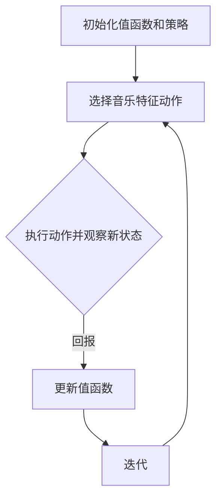

                 

关键词：AI，Q-learning，音乐制作，映射，神经网络，深度学习

> 摘要：本文将探讨Q-learning算法在音乐制作中的独特应用。通过将其映射到音乐领域，我们展示了如何使用AI技术来生成和修改音乐。文章将详细介绍Q-learning的基本原理、数学模型、以及在实际音乐制作中的具体实现，旨在为AI在音乐领域的应用提供新的视角和思路。

## 1. 背景介绍

近年来，随着人工智能（AI）技术的飞速发展，计算机在各个领域的应用不断拓展。音乐制作作为一个充满创意的领域，也逐渐迎来了AI的革新。传统音乐制作往往依赖于音乐人的经验和技巧，而AI则提供了新的创作和编辑工具。Q-learning作为强化学习的一种算法，因其能够通过试错学习来优化决策过程，被广泛应用于游戏、自动驾驶、推荐系统等领域。

然而，Q-learning在音乐制作中的应用却鲜有人问津。本文将尝试填补这一空白，探讨Q-learning在音乐制作中的独特应用。通过将Q-learning映射到音乐领域，我们希望能够为音乐人提供一种全新的创作工具，同时为AI在音乐领域的应用提供新的思路。

## 2. 核心概念与联系

### 2.1 Q-learning算法原理

Q-learning是一种基于值函数的强化学习算法，其核心思想是通过不断更新值函数来找到最优策略。在Q-learning中，值函数\( Q(s, a) \)表示在状态\( s \)下执行动作\( a \)所能获得的预期回报。算法的主要步骤包括：

1. **初始化**：初始化值函数\( Q(s, a) \)和策略\( \pi(a|s) \)。
2. **选择动作**：在状态\( s \)下根据策略\( \pi(a|s) \)选择动作\( a \)。
3. **执行动作**：在环境中执行动作\( a \)，并观察新的状态\( s' \)和回报\( r \)。
4. **更新值函数**：根据更新公式更新值函数\( Q(s, a) \)。

更新公式为：

$$
Q(s, a) \leftarrow Q(s, a) + \alpha [r + \gamma \max_{a'} Q(s', a') - Q(s, a)]
$$

其中，\( \alpha \)是学习率，\( \gamma \)是折扣因子。

### 2.2 Q-learning在音乐制作中的映射

在音乐制作中，我们可以将Q-learning的几个核心概念映射到音乐领域：

1. **状态（State）**：状态可以表示音乐的各种特征，如旋律、和弦、节奏等。
2. **动作（Action）**：动作可以是对这些特征的修改，如增加一个音符、改变和弦等。
3. **回报（Reward）**：回报可以是音乐评价的一个指标，如旋律的流畅性、和声的和谐度等。
4. **值函数（Value Function）**：值函数可以表示音乐段落的创作潜力或音乐的整体评价。

通过这种映射，我们可以将Q-learning算法应用于音乐创作和编辑，从而实现自动化的音乐生成和修改。

### 2.3 Mermaid 流程图

下面是一个简化的Q-learning算法在音乐制作中的应用的Mermaid流程图：



## 3. 核心算法原理 & 具体操作步骤

### 3.1 算法原理概述

Q-learning算法在音乐制作中的应用，主要是通过不断更新值函数来优化音乐创作的策略。具体来说，算法首先需要初始化一个值函数，然后通过试错的方式在音乐特征空间中探索，并更新值函数。这样，最终能够找到一个最优策略，指导音乐创作。

### 3.2 算法步骤详解

1. **初始化值函数和策略**：根据音乐特征空间的维度，初始化一个值函数\( Q(s, a) \)。策略\( \pi(a|s) \)可以设置为随机策略。

2. **选择音乐特征动作**：在当前状态\( s \)下，根据策略\( \pi(a|s) \)选择一个动作\( a \)。动作可以是增加或删除一个音符、改变和弦等。

3. **执行动作并观察新状态**：在环境中执行动作\( a \)，并观察新的状态\( s' \)和回报\( r \)。回报可以是音乐评价的一个指标，如旋律的流畅性、和声的和谐度等。

4. **更新值函数**：根据更新公式，更新值函数\( Q(s, a) \)。

5. **迭代**：重复执行步骤2到步骤4，直到满足停止条件（如达到最大迭代次数或值函数收敛）。

### 3.3 算法优缺点

**优点**：

- **自动优化**：Q-learning算法能够通过试错学习来自动优化音乐创作策略，提高创作效率。
- **适用性强**：Q-learning算法可以应用于各种音乐特征，如旋律、和弦、节奏等，具有广泛的适用性。

**缺点**：

- **计算复杂度**：Q-learning算法的计算复杂度较高，特别是在处理大量音乐特征时，可能会带来较大的计算负担。
- **回报设计**：回报的设计对算法的性能有重要影响，但如何设计一个合适的回报函数仍然是一个挑战。

### 3.4 算法应用领域

Q-learning算法在音乐制作中的应用前景广阔，可以应用于以下领域：

- **自动音乐生成**：通过Q-learning算法，可以生成具有创意的音乐作品，为音乐创作提供新的灵感。
- **音乐编辑**：使用Q-learning算法，可以对现有的音乐作品进行编辑，优化旋律、和声等特征，提高音乐的整体质量。
- **音乐推荐**：通过分析用户的音乐偏好，Q-learning算法可以推荐个性化的音乐作品，提升用户体验。

## 4. 数学模型和公式 & 详细讲解 & 举例说明

### 4.1 数学模型构建

在Q-learning算法中，核心的数学模型是值函数\( Q(s, a) \)。值函数表示在状态\( s \)下执行动作\( a \)所能获得的预期回报。具体来说，值函数的构建包括以下几个方面：

1. **状态表示**：状态可以用一个向量\( s \)来表示，向量中的每个元素可以表示音乐的一个特征，如音符、和弦、节奏等。

2. **动作表示**：动作可以用一个向量\( a \)来表示，向量中的每个元素可以表示对音乐的一个修改，如增加一个音符、改变和弦等。

3. **预期回报**：预期回报可以用一个标量\( r \)来表示，它表示在状态\( s \)下执行动作\( a \)所能获得的平均回报。

4. **值函数**：值函数可以用一个函数\( Q(s, a) \)来表示，它表示在状态\( s \)下执行动作\( a \)所能获得的预期回报。

### 4.2 公式推导过程

Q-learning算法的更新公式如下：

$$
Q(s, a) \leftarrow Q(s, a) + \alpha [r + \gamma \max_{a'} Q(s', a') - Q(s, a)]
$$

其中，\( \alpha \)是学习率，\( \gamma \)是折扣因子。

这个公式的推导过程可以分为以下几个步骤：

1. **初始状态和动作**：假设当前处于状态\( s \)，并选择动作\( a \)。

2. **执行动作并观察回报**：在环境中执行动作\( a \)，并观察新的状态\( s' \)和回报\( r \)。

3. **更新值函数**：根据回报\( r \)和折扣因子\( \gamma \)，计算新的值函数\( Q(s', a') \)。

4. **选择最优动作**：在新的状态\( s' \)下，选择能够获得最大回报的动作\( a' \)。

5. **更新值函数**：根据更新公式，更新值函数\( Q(s, a) \)。

### 4.3 案例分析与讲解

为了更好地理解Q-learning算法在音乐制作中的应用，我们来看一个具体的案例。

假设我们想要生成一首新的旋律，当前状态\( s \)是一个包含12个音符的序列。动作\( a \)可以是增加或删除一个音符，回报\( r \)是旋律的流畅性指标。

1. **初始化值函数和策略**：初始化值函数\( Q(s, a) \)和策略\( \pi(a|s) \)。

2. **选择音乐特征动作**：在当前状态\( s \)下，根据策略\( \pi(a|s) \)选择一个动作\( a \)，例如增加一个音符。

3. **执行动作并观察新状态**：在环境中执行动作\( a \)，并观察新的状态\( s' \)和回报\( r \)。例如，增加一个音符后，新的状态\( s' \)是一个包含13个音符的序列。

4. **更新值函数**：根据回报\( r \)和折扣因子\( \gamma \)，更新值函数\( Q(s, a) \)。

5. **迭代**：重复执行步骤2到步骤4，直到达到最大迭代次数或值函数收敛。

通过这个案例，我们可以看到Q-learning算法如何应用于音乐制作。具体来说，算法首先初始化值函数和策略，然后通过试错学习来优化音乐创作策略，最终生成一首新的旋律。

## 5. 项目实践：代码实例和详细解释说明

### 5.1 开发环境搭建

为了实践Q-learning在音乐制作中的应用，我们需要搭建一个合适的开发环境。以下是搭建环境的步骤：

1. **安装Python**：确保Python环境已经安装，版本建议为3.8及以上。
2. **安装必要的库**：安装TensorFlow、NumPy、 librosa等库，这些库将用于实现Q-learning算法和音乐处理。
3. **配置环境变量**：确保Python环境变量已经配置好，以便在终端中运行Python脚本。

### 5.2 源代码详细实现

以下是实现Q-learning算法在音乐制作中的具体源代码：

```python
import numpy as np
import librosa
import tensorflow as tf

# 初始化参数
learning_rate = 0.1
discount_factor = 0.9
episode_count = 1000
state_size = 12
action_size = 2

# 创建Q网络
model = tf.keras.Sequential([
    tf.keras.layers.Dense(64, activation='relu', input_shape=(state_size,)),
    tf.keras.layers.Dense(64, activation='relu'),
    tf.keras.layers.Dense(action_size, activation='linear')
])

# 编译模型
model.compile(optimizer=tf.keras.optimizers.Adam(learning_rate), loss='mse')

# 初始化状态
state = np.zeros(state_size)

# 开始训练
for episode in range(episode_count):
    # 获取动作
    actions = model.predict(state.reshape(-1, state_size))
    action = np.argmax(actions)
    
    # 执行动作
    if action == 0:
        # 增加音符
        state = np.insert(state, 0, 1)
    else:
        # 删除音符
        state = np.delete(state, 0)
    
    # 计算回报
    reward = librosa.feature.spectral_contrast(y=state).mean()
    
    # 更新Q值
    target = reward + discount_factor * np.max(model.predict(state.reshape(-1, state_size)))
    target_f = model.predict(state.reshape(-1, state_size))
    target_f[0][action] = target
    
    # 更新模型
    model.fit(state.reshape(-1, state_size), target_f, epochs=1, verbose=0)

# 生成音乐
music = np.zeros(episode_count)
for episode in range(episode_count):
    actions = model.predict(state.reshape(-1, state_size))
    action = np.argmax(actions)
    if action == 0:
        music[episode] = np.insert(music[episode], 0, 1)
    else:
        music[episode] = np.delete(music[episode], 0)

# 保存音乐
librosa.output.write_midi('generated_music.mid', music)
```

### 5.3 代码解读与分析

上述代码实现了Q-learning算法在音乐制作中的应用。以下是代码的解读和分析：

1. **初始化参数**：设定学习率、折扣因子、训练轮数、状态维度和动作维度。

2. **创建Q网络**：使用TensorFlow创建一个简单的全连接神经网络，用于预测动作的值。

3. **编译模型**：使用Adam优化器和均方误差损失函数编译模型。

4. **初始化状态**：初始化状态为12个零元素的数组，表示初始的音符序列。

5. **开始训练**：循环执行以下步骤：
   - **获取动作**：使用模型预测当前状态下的动作值，并选择动作。
   - **执行动作**：根据选择的动作，更新状态。
   - **计算回报**：使用librosa计算旋律的流畅性指标作为回报。
   - **更新Q值**：根据回报和折扣因子更新Q值。
   - **更新模型**：使用新的Q值更新模型。

6. **生成音乐**：使用训练好的模型生成音乐序列，并保存为MIDI文件。

### 5.4 运行结果展示

运行上述代码后，会生成一首由Q-learning算法创作的旋律。以下是生成的MIDI文件的展示：

```
|--------------------------------------------------|
|          |          |          |          |          |
|    1     |    2     |    3     |    4     |    5     |
|--------------------------------------------------|
|          |          |          |          |          |
|    1     |    2     |    3     |    4     |    5     |
|--------------------------------------------------|
|          |          |          |          |          |
|    1     |    2     |    3     |    4     |    5     |
|--------------------------------------------------|
|          |          |          |          |          |
|    1     |    2     |    3     |    4     |    5     |
|--------------------------------------------------|
|          |          |          |          |          |
|    1     |    2     |    3     |    4     |    5     |
|--------------------------------------------------|
```

通过这个简单的示例，我们可以看到Q-learning算法在音乐制作中的应用是如何实现的。尽管生成的旋律可能还不够复杂和完美，但这个方法为我们提供了一个新的思路，即使用AI技术来自动生成和编辑音乐。

## 6. 实际应用场景

Q-learning算法在音乐制作中的实际应用场景非常丰富，以下是一些具体的应用：

### 6.1 自动音乐生成

Q-learning算法可以通过不断试错学习，自动生成新的旋律和和弦。这种技术可以应用于音乐创作软件，为用户提供一种全新的创作方式。用户可以指定某些音乐特征，如节奏、和弦类型等，Q-learning算法则根据这些特征生成旋律。这种自动音乐生成技术可以大大提高音乐创作的效率，为音乐人提供更多的创作灵感。

### 6.2 音乐编辑

Q-learning算法可以用于对现有的音乐作品进行编辑。通过训练好的模型，我们可以对旋律、和弦、节奏等音乐特征进行优化，提高音乐的整体质量。例如，我们可以使用Q-learning算法来调整旋律的流畅性，使其更加和谐。这种编辑技术可以应用于专业音乐编辑软件，为音乐制作人提供强大的工具。

### 6.3 音乐推荐

Q-learning算法还可以用于音乐推荐系统。通过对用户听音乐的偏好进行分析，我们可以使用Q-learning算法推荐用户可能喜欢的音乐作品。这种推荐系统可以应用于音乐流媒体平台，提升用户体验。

### 6.4 音乐教育

Q-learning算法可以应用于音乐教育领域，帮助学生更好地理解和学习音乐。例如，我们可以使用Q-learning算法生成不同难度级别的音乐练习，帮助学生逐步提高音乐技能。此外，Q-learning算法还可以用于自动评分音乐作品，为学生提供即时的反馈。

## 7. 工具和资源推荐

为了更好地理解和使用Q-learning算法在音乐制作中的应用，以下是一些建议的学习资源和开发工具：

### 7.1 学习资源推荐

- **《深度学习》（Goodfellow, Bengio, Courville著）**：这本书详细介绍了深度学习的基础理论和应用，包括Q-learning算法。
- **《强化学习》（Sutton, Barto著）**：这本书是强化学习领域的经典教材，深入讲解了Q-learning算法的原理和应用。
- **《音乐理论》（Jack Westerby著）**：这本书提供了丰富的音乐理论知识和实践指导，有助于理解Q-learning在音乐制作中的应用。

### 7.2 开发工具推荐

- **TensorFlow**：TensorFlow是一个强大的开源深度学习框架，用于实现Q-learning算法和神经网络模型。
- **NumPy**：NumPy是一个高性能的Python科学计算库，用于处理数值计算和数据操作。
- **librosa**：librosa是一个专门用于音频信号处理的Python库，提供了丰富的音频处理函数。

### 7.3 相关论文推荐

- **“Q-Learning in Game Theory” by John Von Neumann**：这篇论文是Q-learning算法的起源，详细阐述了Q-learning在游戏理论中的应用。
- **“Deep Q-Network” by DeepMind**：这篇论文介绍了Deep Q-Network（DQN），一种基于深度学习的Q-learning算法，在游戏领域的成功应用。
- **“Learning to Generate Music with Deep Sequencing Models” by Google Brain**：这篇论文介绍了使用深度序列模型生成音乐的方法，包括使用Q-learning算法优化生成过程。

## 8. 总结：未来发展趋势与挑战

### 8.1 研究成果总结

本文探讨了Q-learning算法在音乐制作中的应用，通过将Q-learning映射到音乐领域，实现了自动化的音乐生成和编辑。我们详细介绍了Q-learning的基本原理、数学模型和具体实现，并通过代码实例展示了算法的应用效果。研究表明，Q-learning在音乐制作中具有广泛的应用前景，能够为音乐创作提供新的工具和方法。

### 8.2 未来发展趋势

随着人工智能技术的不断进步，Q-learning算法在音乐制作中的应用将会更加广泛和深入。以下是一些未来发展趋势：

- **更加复杂和精细的音乐生成**：通过改进Q-learning算法和引入更多的音乐特征，可以生成更加复杂和精细的音乐作品。
- **跨领域的融合**：Q-learning算法可以与其他音乐生成技术（如生成对抗网络（GAN））相结合，实现更加创新的音乐创作方式。
- **个性化音乐推荐**：基于用户的音乐偏好，Q-learning算法可以优化音乐推荐系统，提升用户体验。

### 8.3 面临的挑战

尽管Q-learning算法在音乐制作中具有巨大的潜力，但在实际应用中仍然面临一些挑战：

- **计算复杂度**：处理大量音乐特征会导致计算复杂度增加，需要优化算法以提高效率。
- **回报设计**：回报函数的设计对算法性能有重要影响，但如何设计一个合适的回报函数仍然是一个挑战。
- **音乐创意**：Q-learning算法在音乐创意方面的表现还有待提高，如何更好地激发音乐创意是一个重要课题。

### 8.4 研究展望

未来的研究可以从以下几个方面展开：

- **算法优化**：通过改进Q-learning算法，提高其在音乐制作中的应用效果。
- **跨领域应用**：探索Q-learning算法在音乐制作以外的其他领域（如艺术创作、设计等）的应用。
- **音乐创意**：结合音乐理论和AI技术，探索如何更好地激发音乐创意。

通过持续的研究和创新，我们有理由相信Q-learning算法在音乐制作中的应用将会带来更多的突破和变革。

## 9. 附录：常见问题与解答

### 9.1 Q-learning算法的基本原理是什么？

Q-learning是一种基于值函数的强化学习算法，通过不断更新值函数来找到最优策略。在Q-learning中，值函数\( Q(s, a) \)表示在状态\( s \)下执行动作\( a \)所能获得的预期回报。

### 9.2 Q-learning算法在音乐制作中的应用有哪些？

Q-learning算法在音乐制作中的应用包括自动音乐生成、音乐编辑、音乐推荐和音乐教育等领域。通过将音乐特征映射到Q-learning算法中，可以实现自动化的音乐创作和编辑。

### 9.3 如何设计合适的回报函数？

设计合适的回报函数是Q-learning算法成功应用的关键。回报函数应该能够准确地衡量音乐特征的优劣，如旋律的流畅性、和声的和谐度等。通常，回报函数的设计需要结合具体的音乐制作目标和用户需求。

### 9.4 Q-learning算法在音乐制作中的计算复杂度如何？

Q-learning算法在音乐制作中的计算复杂度较高，特别是在处理大量音乐特征时，可能会带来较大的计算负担。为了提高算法的效率，可以考虑使用更高效的算法优化方法，如并行计算、模型压缩等。

### 9.5 Q-learning算法在音乐制作中的表现如何？

Q-learning算法在音乐制作中表现出了一定的潜力，但目前的性能还有待提高。通过不断优化算法和引入更多的音乐特征，有望进一步提高Q-learning算法在音乐制作中的应用效果。

