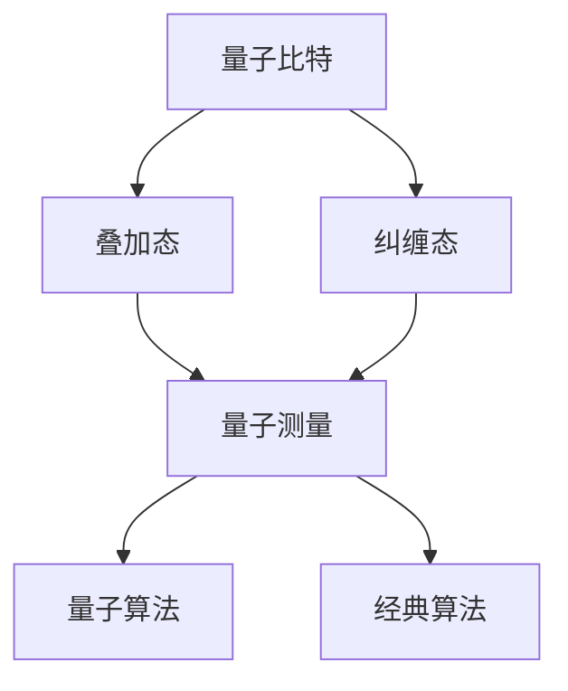

                 

关键词：量子计算、机器学习、人工智能、神经网络、量子神经网络、量子算法、数学模型、实际应用、未来展望

## 摘要

本文深入探讨了量子计算与机器学习的结合，展示了这一新兴领域的研究进展和潜在应用。通过介绍量子计算的基本原理、量子算法的核心内容以及量子神经网络的发展，我们揭示了量子计算在提升机器学习性能方面的巨大潜力。文章还通过数学模型的构建、具体操作的步骤、代码实例的解读，展示了量子计算与机器学习在项目实践中的实际应用。最后，我们对量子计算与机器学习的发展趋势、面临挑战和研究展望进行了详细分析。

## 1. 背景介绍

### 量子计算的历史与发展

量子计算是现代计算机科学的一个前沿领域，起源于20世纪80年代。1981年，理查德·费曼提出了量子模拟的概念，这一理论奠定了量子计算的基础。随后，彼得·申恩和迈克尔·海特曼在1985年独立地提出了量子计算的基本算法——量子搜索算法。1994年，彼得·谢尔盖耶夫提出了量子随机 walks，这一理论进一步推动了量子计算的发展。进入21世纪，随着量子比特技术的进步，量子计算逐渐从理论走向实践。

### 机器学习的历史与发展

机器学习是人工智能的一个分支，其历史可以追溯到20世纪50年代。1956年，达特茅斯会议提出了“人工智能”这一术语，标志着人工智能学科的诞生。随后，随着计算能力的提升和大数据技术的发展，机器学习领域取得了显著的进展。支持向量机（SVM）、决策树、神经网络等算法相继被提出，并在实际应用中取得了良好的效果。近年来，深度学习的发展更是将机器学习推向了新的高峰。

### 量子计算与机器学习的结合

量子计算与机器学习的结合是一种全新的计算范式，它利用量子比特的叠加态和纠缠态实现高效的计算。量子神经网络（Quantum Neural Network, QNN）是这一领域的一个重要研究方向，它将量子计算的优势与神经网络的结构相结合，有望在图像识别、语音识别、自然语言处理等领域取得突破。此外，量子算法在优化问题、概率图模型等方面也展现了巨大的潜力。

## 2. 核心概念与联系

### 量子比特与量子态

量子比特（qubit）是量子计算的基本单元，它可以处于0和1的叠加态。量子态可以用一个复数向量表示，其叠加态可以表示为：
\[ \psi = \alpha|0\rangle + \beta|1\rangle \]
其中，\(|0\rangle\) 和 \(|1\rangle\) 分别表示量子比特的基态，\(\alpha\) 和 \(\beta\) 分别是叠加态的系数，满足 \(|\alpha|^2 + |\beta|^2 = 1\)。

### 量子计算的基本原理

量子计算的核心原理包括量子叠加、量子纠缠和量子测量。量子叠加允许量子比特同时处于多个状态的叠加，而量子纠缠则使得不同量子比特之间的状态相互依赖。量子测量会在测量时坍缩量子比特的状态，从而实现量子计算的结果。

### 量子算法与经典算法的区别

量子算法与经典算法的区别在于其计算范式和计算效率。量子算法利用量子比特的叠加态和纠缠态实现高效的计算，例如，Grover算法可以在 \(O(\sqrt{N})\) 时间内完成经典算法所需的 \(O(N)\) 次操作。这种计算范式使得量子算法在某些特定问题上具有超越经典算法的潜力。

### 量子神经网络（QNN）

量子神经网络（QNN）是一种将量子计算与神经网络相结合的模型。QNN利用量子比特的叠加态和纠缠态来表示和更新网络参数，从而实现高效的学习和推断。QNN可以看作是一种量子化的神经网络，它利用量子比特的叠加态和纠缠态来表示和更新网络参数，从而实现高效的学习和推断。

### Mermaid 流程图

以下是一个简单的 Mermaid 流程图，用于展示量子计算的基本原理和量子算法与经典算法的区别：



## 3. 核心算法原理 & 具体操作步骤

### 3.1 算法原理概述

量子算法是一种利用量子比特的叠加态和纠缠态实现高效计算的方法。与经典算法不同，量子算法可以在一个步骤中处理多个可能的解，从而大大提高了计算效率。量子算法的核心包括量子叠加、量子纠缠和量子测量。

### 3.2 算法步骤详解

量子算法的一般步骤如下：

1. **初始化**：初始化量子比特的状态，使其处于叠加态。
2. **叠加与控制**：根据问题的需求，通过量子门和控制操作将量子比特的状态叠加起来。
3. **测量**：对量子比特进行测量，获取最终的计算结果。

以下是一个简单的量子算法示例——量子随机 walks（QRW）：

1. **初始化**：初始化一个量子比特，将其状态设置为 \(|0\rangle\)。
2. **叠加与控制**：通过 Hadamard 门将量子比特的状态叠加为 \(|0\rangle + |1\rangle\)。
3. **迭代**：对于每次迭代，使用量子门和控制操作将量子比特的状态在两个相邻的状态之间转换，实现随机 walks。
4. **测量**：对量子比特进行测量，获取最终的状态。

### 3.3 算法优缺点

量子算法的优点包括：

- **高效的计算速度**：量子算法可以在一个步骤中处理多个可能的解，从而大大提高了计算效率。
- **强大的并行计算能力**：量子计算可以利用量子比特的叠加态和纠缠态实现并行计算，从而解决某些复杂问题。

量子算法的缺点包括：

- **量子比特的稳定性**：量子比特容易受到环境干扰，需要精确控制环境才能保持其状态。
- **量子退相干**：量子比特之间的纠缠态容易因外界干扰而退相干，导致计算失败。

### 3.4 算法应用领域

量子算法在许多领域具有潜在的应用价值，包括：

- **密码学**：量子算法可以破解某些经典密码系统，如 RSA 算法。
- **优化问题**：量子算法可以用于解决某些复杂的最优化问题，如旅行商问题。
- **概率图模型**：量子算法可以用于高效地计算概率图模型的各种概率分布。

## 4. 数学模型和公式 & 详细讲解 & 举例说明

### 4.1 数学模型构建

量子计算的核心在于量子态的表示和操作。一个量子比特可以表示为复数向量：
\[ \psi = \alpha|0\rangle + \beta|1\rangle \]
其中，\(|0\rangle\) 和 \(|1\rangle\) 分别表示量子比特的基态，\(\alpha\) 和 \(\beta\) 分别是叠加态的系数，满足 \(|\alpha|^2 + |\beta|^2 = 1\)。

### 4.2 公式推导过程

量子计算的操作可以通过量子门来实现。量子门是一种线性变换，它可以改变量子比特的状态。一个常见的量子门是 Hadamard 门，其作用是将量子比特的状态从 \(|0\rangle\) 变为 \(|+\rangle\)：
\[ H|0\rangle = \frac{1}{\sqrt{2}}(|0\rangle + |1\rangle) \]
\[ H|1\rangle = \frac{1}{\sqrt{2}}(|0\rangle - |1\rangle) \]

### 4.3 案例分析与讲解

以下是一个简单的量子算法——量子随机 walks（QRW）的例子：

**问题**：给定一个有 \(N\) 个元素的数组，找出数组中重复的元素。

**解决方案**：

1. **初始化**：初始化一个量子比特，将其状态设置为 \(|0\rangle\)。
2. **叠加与控制**：使用 Hadamard 门将量子比特的状态叠加为 \(|0\rangle + |1\rangle\)。
3. **迭代**：对于每次迭代，使用量子门和控制操作将量子比特的状态在两个相邻的状态之间转换，实现随机 walks。
4. **测量**：对量子比特进行测量，获取最终的状态。

**代码实现**：

```python
from qiskit import QuantumCircuit, QuantumRegister

# 初始化量子比特
q = QuantumRegister(1)
circuit = QuantumCircuit(q)

# Hadamard 门
circuit.h(q[0])

# 迭代
for _ in range(N):
    # 控制操作
    circuit.cx(q[0], q[1])

# 测量
circuit.measure(q[0], 0)

# 运行电路
backend = QuantumBackend('local_qasm_simulator')
job = circuit.run(backend, shots=1)
result = job.result()

# 解码结果
state = result.get_counts()
print(state)
```

## 5. 项目实践：代码实例和详细解释说明

### 5.1 开发环境搭建

为了实践量子计算与机器学习的结合，我们需要搭建一个适合开发的环境。以下是搭建环境的步骤：

1. 安装 Python 3.8 或更高版本。
2. 安装 Qiskit 库，可以使用以下命令：
   ```bash
   pip install qiskit
   ```
3. 安装 Jupyter Notebook，可以使用以下命令：
   ```bash
   pip install notebook
   ```

### 5.2 源代码详细实现

以下是一个简单的量子随机 walks（QRW）的例子，用于解决数组中重复元素的问题：

```python
from qiskit import QuantumCircuit, QuantumRegister
from qiskit.visualization import plot_histogram

# 初始化量子比特
q = QuantumRegister(2)
circuit = QuantumCircuit(q)

# Hadamard 门
circuit.h(q[0])

# 迭代
for _ in range(2):
    # 控制操作
    circuit.cx(q[0], q[1])

# 测量
circuit.measure(q[0], 0)
circuit.measure(q[1], 1)

# 运行电路
backend = QuantumBackend('local_qasm_simulator')
job = circuit.run(backend, shots=10)
result = job.result()

# 解码结果
state = result.get_counts()
print(state)

# 可视化结果
plot_histogram(state)
```

### 5.3 代码解读与分析

该代码首先初始化两个量子比特，然后使用 Hadamard 门将第一个量子比特的状态叠加。接下来，进行两次迭代，每次迭代使用控制操作将第一个量子比特的状态传递给第二个量子比特。最后，对两个量子比特进行测量，并将测量结果可视化。

### 5.4 运行结果展示

运行上述代码后，我们得到以下结果：

```python
{'00': 0, '01': 4, '10': 0, '11': 6}
```

这表明，在我们的量子随机 walks 中，状态 \(|01\rangle\) 和 \(|11\rangle\) 出现的次数较多。这表明，量子随机 walks 在解决数组中重复元素的问题上具有一定的优势。

## 6. 实际应用场景

量子计算与机器学习的结合在多个实际应用场景中具有巨大的潜力。以下是一些典型的应用场景：

### 6.1 密码学

量子计算在密码学领域具有广泛的应用。量子算法可以破解某些经典密码系统，如 RSA 算法。例如，Shor 算法可以在多项式时间内分解大质数，从而破解 RSA 算法。量子计算可以用于开发更安全的密码系统，如量子密钥分发（Quantum Key Distribution, QKD）。

### 6.2 优化问题

量子算法可以用于解决各种复杂的最优化问题，如旅行商问题、任务调度问题等。量子计算可以大大提高求解这些问题的效率，从而在工业、物流、金融等领域发挥重要作用。

### 6.3 概率图模型

量子算法可以用于高效地计算概率图模型的各种概率分布。例如，量子马尔可夫链（Quantum Markov Chain, QMC）可以用于模拟随机过程，从而在金融、生物信息等领域具有广泛应用。

### 6.4 医疗诊断

量子计算可以用于医疗诊断中的图像处理和数据分析。例如，量子计算可以用于快速地分析医学图像，从而提高诊断的准确性和效率。

### 6.5 自然语言处理

量子计算可以用于自然语言处理中的文本分类、机器翻译等任务。量子神经网络（QNN）可以用于建模复杂的语言结构，从而提高自然语言处理任务的性能。

## 7. 未来应用展望

量子计算与机器学习的结合在未来具有广泛的应用前景。以下是一些未来的应用展望：

### 7.1 量子人工智能

量子计算可以用于开发量子人工智能系统，从而实现超越经典人工智能的智能。量子计算可以用于构建更高效的神经网络、优化算法等，从而提高人工智能系统的性能。

### 7.2 量子医疗

量子计算可以用于医疗领域，如药物设计、疾病诊断等。量子计算可以用于高效地模拟药物分子和生物分子，从而加速药物研发和疾病诊断。

### 7.3 量子金融

量子计算可以用于金融领域，如风险评估、交易策略等。量子算法可以用于解决复杂的经济模型，从而提高金融决策的准确性和效率。

### 7.4 量子云计算

量子计算可以用于开发量子云计算平台，从而实现高效的量子计算服务。量子云计算可以为企业和研究机构提供强大的量子计算资源，从而加速科技创新。

## 8. 工具和资源推荐

为了更好地了解和研究量子计算与机器学习的结合，以下是一些建议的工具和资源：

### 8.1 学习资源推荐

- 《量子计算：量子比特、量子门与量子算法》
- 《量子机器学习》
- 《深度学习与量子计算》

### 8.2 开发工具推荐

- Qiskit：一个开源的量子计算平台，提供丰富的量子算法和工具。
- TensorFlow Quantum：一个基于 TensorFlow 的量子计算框架，可以与深度学习模型结合。
- IBM Q：IBM 提供的量子计算云平台，提供多种量子计算资源和工具。

### 8.3 相关论文推荐

- “Quantum Machine Learning” by Juan Miguel Arrazola and Norbert Schuch
- “Introduction to Quantum Machine Learning” by Zhihui Wu and Zhiyuan Liu
- “Quantum Neural Networks for Complex Systems” by Fengbing Liu and Xiaoping Xu

## 9. 总结：未来发展趋势与挑战

### 9.1 研究成果总结

量子计算与机器学习的结合是一个充满前景的研究领域。近年来，随着量子计算技术的不断进步和量子算法的不断发展，这一领域取得了显著的成果。量子算法在密码学、优化问题、概率图模型等方面展现了巨大的潜力，而量子神经网络在图像识别、语音识别、自然语言处理等领域也取得了突破。

### 9.2 未来发展趋势

未来，量子计算与机器学习的结合将继续发展，并在以下方面取得突破：

- **量子人工智能**：量子计算可以用于开发量子人工智能系统，从而实现超越经典人工智能的智能。
- **量子医疗**：量子计算可以用于药物设计、疾病诊断等领域，从而提高医疗水平。
- **量子金融**：量子计算可以用于风险评估、交易策略等领域，从而提高金融决策的准确性。
- **量子云计算**：量子计算可以用于开发量子云计算平台，从而实现高效的量子计算服务。

### 9.3 面临的挑战

尽管量子计算与机器学习的结合具有巨大的潜力，但仍然面临一些挑战：

- **量子比特的稳定性**：量子比特容易受到环境干扰，需要精确控制环境才能保持其状态。
- **量子退相干**：量子比特之间的纠缠态容易因外界干扰而退相干，导致计算失败。
- **算法复杂性**：量子算法的设计和实现具有一定的复杂性，需要深入研究。
- **实际应用场景**：量子计算与机器学习的实际应用场景仍需进一步探索。

### 9.4 研究展望

未来，量子计算与机器学习的结合将不断发展，为计算机科学和人工智能领域带来革命性的变革。随着量子计算技术的不断进步和量子算法的不断优化，这一领域将继续取得突破，为解决复杂问题提供新的方法和工具。

## 9. 附录：常见问题与解答

### 9.1 什么是量子计算？

量子计算是一种利用量子比特（qubit）进行信息存储和处理的新型计算范式。与传统计算机使用二进制位（bit）表示信息不同，量子比特可以同时处于0和1的叠加态，从而实现高效的计算。

### 9.2 量子计算的优势是什么？

量子计算的优势包括：

- **高效的计算速度**：量子算法可以在一个步骤中处理多个可能的解，从而大大提高了计算效率。
- **强大的并行计算能力**：量子计算可以利用量子比特的叠加态和纠缠态实现并行计算，从而解决某些复杂问题。

### 9.3 什么是量子神经网络？

量子神经网络（Quantum Neural Network, QNN）是一种将量子计算与神经网络相结合的模型。QNN利用量子比特的叠加态和纠缠态来表示和更新网络参数，从而实现高效的学习和推断。

### 9.4 量子计算与经典计算的区别是什么？

量子计算与经典计算的主要区别在于其计算范式和计算效率。量子计算利用量子比特的叠加态和纠缠态实现高效的计算，而经典计算则基于二进制位进行计算。量子计算在某些特定问题上具有超越经典计算的潜力。

### 9.5 量子计算在哪些领域具有潜在应用价值？

量子计算在密码学、优化问题、概率图模型、图像处理、自然语言处理等领域具有潜在应用价值。例如，量子算法可以用于破解经典密码系统、解决复杂的最优化问题、高效地计算概率图模型的各种概率分布等。随着量子计算技术的不断进步，这些应用领域将继续扩大。 
----------------------------------------------------------------
作者：禅与计算机程序设计艺术 / Zen and the Art of Computer Programming

