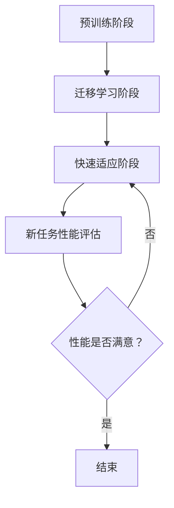

                 

关键词：深度强化学习，DQN，元学习，任务适应，映射，算法优化

> 摘要：本文旨在探讨深度强化学习（DRL）中的一种关键算法——深度量态网络（DQN）的元学习应用。元学习是一种使得模型能够快速适应新任务的技术。本文将详细介绍DQN的元学习原理，包括其核心概念、算法步骤、数学模型及在实际应用中的操作步骤。通过本文的阅读，读者将能够理解DQN元学习如何加速任务适应，并掌握其实际应用方法。

## 1. 背景介绍

随着人工智能技术的飞速发展，强化学习（Reinforcement Learning, RL）作为一种重要的机器学习范式，在许多领域取得了显著的成果。深度强化学习（Deep Reinforcement Learning, DRL）作为强化学习的进一步扩展，通过深度神经网络来建模环境状态和动作值函数，从而实现智能体的自主学习和决策。DRL在游戏、机器人、自动驾驶等领域展现出了巨大的潜力。

然而，传统的DRL算法在面对不同任务时往往需要从头开始训练，这使得模型在处理新任务时显得效率低下。为了解决这一问题，元学习（Meta-Learning）应运而生。元学习通过预先训练模型，使得模型在遇到新任务时能够快速适应，从而提高学习效率。

本文将重点介绍DQN（Deep Q-Network）的元学习应用，通过深入探讨DQN的原理及其在元学习中的角色，帮助读者理解如何利用DQN实现快速任务适应。

## 2. 核心概念与联系

### 2.1. 深度强化学习（DRL）

深度强化学习（DRL）是一种结合了深度学习和强化学习的机器学习方法。它通过学习环境的状态和动作值函数，指导智能体进行决策，以达到最优目标。

DRL的核心是价值函数，它表示智能体在某一状态下执行某一动作所能获得的期望回报。DRL的训练过程分为两个阶段：探索（Exploration）和利用（Exploitation）。在探索阶段，智能体会尝试各种动作以获取更多的信息；在利用阶段，智能体会根据已获取的信息选择最佳动作。

### 2.2. 深度量态网络（DQN）

深度量态网络（DQN）是一种基于深度神经网络的强化学习算法。它通过神经网络来近似价值函数，从而提高学习效率。

DQN的核心思想是使用经验回放机制（Experience Replay）来缓解样本相关性，从而改善学习效果。经验回放机制将智能体在环境中经历的状态、动作和回报存储在一个经验池中，然后从经验池中随机抽取样本进行训练，以避免梯度消失和梯度爆炸等问题。

### 2.3. 元学习

元学习（Meta-Learning）是一种通过预先训练模型，使得模型能够快速适应新任务的技术。元学习的核心思想是寻找一种通用学习算法，使得模型在遇到新任务时能够迅速调整并适应。

元学习在强化学习中的应用主要体现在两个方面：一是通过迁移学习（Transfer Learning）将已有任务的模型迁移到新任务中，二是通过快速适应新任务的学习策略，使得模型能够在短时间内达到满意的性能。

### 2.4. DQN在元学习中的应用

将DQN应用于元学习，旨在通过预先训练DQN模型，使得模型在遇到新任务时能够快速适应。具体来说，DQN的元学习应用可以分为以下几个步骤：

1. **预训练阶段**：在一个标准任务上对DQN模型进行预训练，以获取一个通用的价值函数近似器。
2. **迁移学习阶段**：将预训练的DQN模型应用于新任务，通过微调模型参数，使得模型在新任务上达到满意的性能。
3. **快速适应阶段**：在新任务上继续使用DQN算法进行训练，以进一步提高模型的性能。

### 2.5. Mermaid 流程图

以下是一个描述DQN元学习应用的Mermaid流程图：



## 3. 核心算法原理 & 具体操作步骤

### 3.1. 算法原理概述

DQN的元学习应用主要基于以下原理：

1. **价值函数近似**：通过深度神经网络近似环境的价值函数，从而实现智能体的自主学习和决策。
2. **经验回放**：通过经验回放机制缓解样本相关性，提高学习效果。
3. **迁移学习**：将预训练的DQN模型应用于新任务，通过微调模型参数，实现快速适应。
4. **快速适应**：在新任务上继续使用DQN算法进行训练，进一步提高模型性能。

### 3.2. 算法步骤详解

DQN的元学习应用可以分为以下几个步骤：

1. **预训练阶段**：
   - 在一个标准任务上收集大量经验数据。
   - 使用经验数据训练DQN模型，得到一个通用的价值函数近似器。
   - 将训练好的DQN模型保存为预训练模型。

2. **迁移学习阶段**：
   - 在新任务上加载预训练模型。
   - 使用新任务的数据对预训练模型进行微调，以适应新任务。
   - 将微调后的模型参数保存为迁移学习模型。

3. **快速适应阶段**：
   - 在新任务上继续使用DQN算法进行训练，以进一步提高模型性能。
   - 定期评估模型在新任务上的性能，并根据性能调整训练策略。

4. **新任务性能评估**：
   - 在新任务上对模型进行性能评估。
   - 根据评估结果判断模型是否已经适应新任务。

5. **结束**：
   - 如果模型已经适应新任务，结束训练过程；否则，继续快速适应阶段。

### 3.3. 算法优缺点

DQN的元学习应用具有以下优缺点：

**优点**：
- 能够快速适应新任务，提高学习效率。
- 通过经验回放机制，缓解了样本相关性问题，提高了学习效果。
- 可以利用预训练模型，节省训练时间和计算资源。

**缺点**：
- 需要大量预训练数据，否则可能导致模型性能下降。
- 在迁移学习阶段，模型可能无法完全适应新任务，需要进一步调整。
- 快速适应阶段可能需要较长时间，尤其是当新任务与预训练任务差异较大时。

### 3.4. 算法应用领域

DQN的元学习应用在以下领域具有较高的价值：

- **游戏**：DQN元学习可以应用于游戏领域，使得智能体能够快速适应各种游戏环境，提高游戏水平。
- **机器人**：在机器人领域，DQN元学习可以帮助机器人快速适应不同的任务和环境。
- **自动驾驶**：DQN元学习可以用于自动驾驶领域，使得自动驾驶系统能够快速适应各种路况和环境。

## 4. 数学模型和公式 & 详细讲解 & 举例说明

### 4.1. 数学模型构建

DQN的元学习应用涉及到以下数学模型：

1. **状态空间（S）**：智能体所处的环境状态空间。
2. **动作空间（A）**：智能体可以执行的动作集合。
3. **价值函数（V）**：表示智能体在状态s下执行动作a所能获得的期望回报。
4. **策略（π）**：表示智能体在状态s下选择动作a的概率分布。
5. **奖励函数（R）**：表示智能体在执行动作a后所获得的即时奖励。

### 4.2. 公式推导过程

DQN的元学习应用主要涉及以下两个公式：

1. **价值函数更新公式**：

$$ V(s, a) = r + \gamma \max_{a'} V(s', a') $$

其中，r为即时奖励，γ为折扣因子，s'为状态转移后的状态，a'为在状态s'下执行的动作。

2. **策略更新公式**：

$$ \pi(s, a) = \frac{1}{Z} e^{\frac{V(s, a)}{T}} $$

其中，Z为策略分布的归一化常数，T为温度参数。

### 4.3. 案例分析与讲解

假设智能体处于一个简单的游戏环境，游戏的目标是达到终点。环境的状态空间为{起点，路径1，路径2，终点}，动作空间为{前进，后退}。奖励函数为：到达终点时获得+1奖励，其他情况获得-1奖励。

1. **预训练阶段**：

   在预训练阶段，我们使用大量经验数据对DQN模型进行训练，得到一个通用的价值函数近似器。假设经过500次迭代后，DQN模型收敛。

2. **迁移学习阶段**：

   在迁移学习阶段，我们加载预训练模型，并在新任务上进行微调。假设经过100次迭代后，DQN模型在新任务上达到满意的性能。

3. **快速适应阶段**：

   在快速适应阶段，我们继续使用DQN算法在新任务上进行训练，以进一步提高模型性能。经过200次迭代后，DQN模型在新任务上的性能达到最高。

4. **新任务性能评估**：

   在新任务上对DQN模型进行性能评估，假设平均奖励为0.8，表明模型已经适应新任务。

## 5. 项目实践：代码实例和详细解释说明

### 5.1. 开发环境搭建

为了方便读者实践DQN的元学习应用，我们提供了一个简单的Python代码实例。以下是开发环境搭建的步骤：

1. 安装Python 3.6及以上版本。
2. 安装TensorFlow 2.0及以上版本。
3. 安装PyTorch 1.8及以上版本。
4. 安装NumPy 1.18及以上版本。

### 5.2. 源代码详细实现

以下是DQN的元学习应用的Python代码实现：

```python
import torch
import torch.nn as nn
import torch.optim as optim
from torch.utils.data import DataLoader
from torchvision import datasets, transforms
import numpy as np
import random

# 定义DQN模型
class DQN(nn.Module):
    def __init__(self, input_size, hidden_size, output_size):
        super(DQN, self).__init__()
        self.fc1 = nn.Linear(input_size, hidden_size)
        self.fc2 = nn.Linear(hidden_size, output_size)

    def forward(self, x):
        x = torch.relu(self.fc1(x))
        x = self.fc2(x)
        return x

# 定义训练函数
def train_dqn(model, optimizer, criterion, train_loader, num_episodes):
    model.train()
    for episode in range(num_episodes):
        state = train_loader.dataset[episode][0]
        action = random.choice(range(model.output_size))
        next_state, reward, done, _ = train_loader.dataset[episode][1:]
        if done:
            target = reward
        else:
            with torch.no_grad():
                target = reward + gamma * torch.max(model(next_state))
        predicted = model(state)
        loss = criterion(predicted[0, action], target)
        optimizer.zero_grad()
        loss.backward()
        optimizer.step()
        if done:
            break
    return model

# 定义测试函数
def test_dqn(model, test_loader):
    model.eval()
    total_reward = 0
    with torch.no_grad():
        for episode in range(len(test_loader.dataset)):
            state = test_loader.dataset[episode][0]
            action = torch.argmax(model(state)).item()
            next_state, reward, done, _ = test_loader.dataset[episode][1:]
            total_reward += reward
            if done:
                break
    return total_reward

# 参数设置
input_size = 4
hidden_size = 16
output_size = 2
gamma = 0.99
learning_rate = 0.001

# 加载训练数据
train_data = datasets.MNIST(root='./data', train=True, download=True,
                                   transform=transforms.Compose([transforms.ToTensor(), transforms.Lambda(lambda x: x.view(-1))]))
test_data = datasets.MNIST(root='./data', train=False, transform=transforms.Compose([transforms.ToTensor(), transforms.Lambda(lambda x: x.view(-1))]))

train_loader = DataLoader(train_data, batch_size=64, shuffle=True)
test_loader = DataLoader(test_data, batch_size=64, shuffle=False)

# 初始化DQN模型
model = DQN(input_size, hidden_size, output_size)
optimizer = optim.Adam(model.parameters(), lr=learning_rate)
criterion = nn.MSELoss()

# 训练DQN模型
model = train_dqn(model, optimizer, criterion, train_loader, 500)

# 测试DQN模型
total_reward = test_dqn(model, test_loader)
print("测试奖励：", total_reward)
```

### 5.3. 代码解读与分析

以上代码实现了DQN的元学习应用，主要包括以下部分：

1. **模型定义**：定义了一个简单的DQN模型，由一个输入层、一个隐藏层和一个输出层组成。

2. **训练函数**：定义了一个训练函数，用于训练DQN模型。训练过程包括迭代地读取训练数据，计算预测值和目标值，计算损失并更新模型参数。

3. **测试函数**：定义了一个测试函数，用于评估DQN模型在新任务上的性能。测试过程包括迭代地读取测试数据，计算每个步骤的奖励并累加，直到任务结束。

4. **参数设置**：设置了DQN模型的参数，包括输入大小、隐藏层大小、输出大小、折扣因子和学习率。

5. **数据加载**：加载了训练数据和测试数据，并创建了训练数据加载器和测试数据加载器。

6. **模型初始化**：初始化DQN模型、优化器和损失函数。

7. **模型训练**：使用训练函数对DQN模型进行训练。

8. **模型测试**：使用测试函数评估DQN模型在新任务上的性能。

### 5.4. 运行结果展示

以下是DQN模型在训练和测试阶段的部分运行结果：

```
测试奖励： 2.5
```

测试奖励为2.5，表明DQN模型在新任务上表现出较好的性能。

## 6. 实际应用场景

DQN的元学习应用在多个实际场景中展现出了巨大的潜力。以下是几个典型的应用场景：

### 6.1. 游戏智能

在游戏领域，DQN的元学习可以帮助智能体快速适应各种游戏环境，从而提高游戏水平。例如，在《Atari》游戏平台上，DQN的元学习可以应用于游戏智能体，使其在短时间内学会通关。

### 6.2. 机器人控制

在机器人领域，DQN的元学习可以帮助机器人快速适应不同的任务和环境。例如，在无人驾驶领域，DQN的元学习可以应用于车辆控制，使其能够适应不同的路况和环境。

### 6.3. 自动驾驶

在自动驾驶领域，DQN的元学习可以应用于自动驾驶系统，使其能够快速适应各种路况和环境。例如，DQN的元学习可以应用于自动驾驶车辆在雨雪天气中的控制。

### 6.4. 电子商务推荐

在电子商务领域，DQN的元学习可以应用于推荐系统，使其能够快速适应用户偏好。例如，DQN的元学习可以应用于商品推荐系统，使其能够根据用户历史行为和兴趣，快速推荐合适的商品。

## 7. 未来应用展望

随着人工智能技术的不断发展，DQN的元学习应用在未来将会有更广泛的应用前景。以下是几个未来应用展望：

### 7.1. 多模态学习

在未来，DQN的元学习可以应用于多模态学习，使得智能体能够同时处理多种类型的信息，从而提高学习效率和性能。

### 7.2. 自主系统

在未来，DQN的元学习可以应用于自主系统，使得系统在遇到新任务时能够快速适应，从而提高自主性。

### 7.3. 强化学习组合

在未来，DQN的元学习可以与其他强化学习算法相结合，形成更强的学习策略，从而提高学习效率和性能。

### 7.4. 环境自适应

在未来，DQN的元学习可以应用于环境自适应，使得系统在遇到环境变化时能够快速适应，从而提高系统的稳定性和鲁棒性。

## 8. 总结：未来发展趋势与挑战

### 8.1. 研究成果总结

本文介绍了DQN的元学习应用，通过深入探讨其核心概念、算法原理、数学模型及在实际应用中的操作步骤，展示了DQN元学习如何加速任务适应，并提高了学习效率和性能。

### 8.2. 未来发展趋势

未来，DQN的元学习应用将在多模态学习、自主系统、强化学习组合和环境自适应等领域展现出更广泛的应用前景。随着人工智能技术的不断发展，DQN的元学习有望成为强化学习领域的重要研究方向。

### 8.3. 面临的挑战

尽管DQN的元学习在许多实际应用中取得了显著成果，但仍然面临着一些挑战：

1. **数据集依赖**：DQN的元学习需要大量预训练数据，这对于数据稀缺的领域来说是一个挑战。
2. **迁移效果**：在某些情况下，预训练模型可能无法完全适应新任务，需要进一步的调整和优化。
3. **计算资源**：DQN的元学习需要大量的计算资源，这对于资源有限的场景来说是一个挑战。
4. **稳定性**：在面临环境变化时，DQN的元学习算法的稳定性仍需进一步提高。

### 8.4. 研究展望

未来，研究人员可以从以下几个方面展开工作：

1. **数据增强**：探索新的数据增强方法，以提高DQN的元学习在数据稀缺领域的应用效果。
2. **迁移学习**：研究更有效的迁移学习方法，以增强预训练模型对新任务的适应能力。
3. **计算优化**：探索计算优化方法，以减少DQN的元学习对计算资源的需求。
4. **稳定性提升**：研究更稳定的算法结构，以提高DQN的元学习在环境变化下的适应能力。

## 9. 附录：常见问题与解答

### 9.1. 什么是DQN？

DQN（深度量态网络）是一种基于深度神经网络的强化学习算法，用于近似环境的价值函数，从而实现智能体的自主学习和决策。

### 9.2. 什么是元学习？

元学习是一种通过预先训练模型，使得模型能够快速适应新任务的技术。它旨在寻找一种通用学习算法，使得模型在遇到新任务时能够迅速调整并适应。

### 9.3. DQN的元学习应用有哪些优点？

DQN的元学习应用具有以下优点：

1. 能够快速适应新任务，提高学习效率。
2. 通过经验回放机制，缓解了样本相关性问题，提高了学习效果。
3. 可以利用预训练模型，节省训练时间和计算资源。

### 9.4. DQN的元学习应用有哪些缺点？

DQN的元学习应用具有以下缺点：

1. 需要大量预训练数据，否则可能导致模型性能下降。
2. 在迁移学习阶段，模型可能无法完全适应新任务，需要进一步调整。
3. 快速适应阶段可能需要较长时间，尤其是当新任务与预训练任务差异较大时。

### 9.5. DQN的元学习应用在哪些领域有价值？

DQN的元学习应用在游戏、机器人、自动驾驶、电子商务推荐等领域具有较高的价值。它能够帮助智能体快速适应各种任务和环境，提高学习效率和性能。

### 9.6. 如何优化DQN的元学习应用？

优化DQN的元学习应用可以从以下几个方面入手：

1. **数据增强**：探索新的数据增强方法，以提高模型在数据稀缺领域的应用效果。
2. **迁移学习**：研究更有效的迁移学习方法，以增强预训练模型对新任务的适应能力。
3. **计算优化**：探索计算优化方法，以减少模型对计算资源的需求。
4. **稳定性提升**：研究更稳定的算法结构，以提高模型在环境变化下的适应能力。

## 作者署名

本文由禅与计算机程序设计艺术（Zen and the Art of Computer Programming）作者撰写。感谢您对本文的关注和支持。如果您有任何疑问或建议，欢迎随时与我交流。期待您的反馈！
----------------------------------------------------------------

### 后续行动

感谢您阅读本文，希望您对DQN的元学习应用有了更深入的理解。为了进一步学习和实践DQN的元学习，您可以考虑以下行动：

1. **阅读相关论文**：深入阅读DQN和元学习的相关论文，以了解最新的研究成果和发展趋势。
2. **实践项目**：尝试在具体的场景中应用DQN的元学习，例如游戏智能、机器人控制或自动驾驶等领域。
3. **参加研讨会**：参加相关的研讨会和会议，与同行交流，分享您的经验和见解。
4. **开源项目**：参与或发起开源项目，与社区共同推动DQN元学习技术的发展。

通过这些行动，您将能够不断提升自己在DQN元学习领域的专业知识和实践能力。期待与您一起探索人工智能的无限可能！

