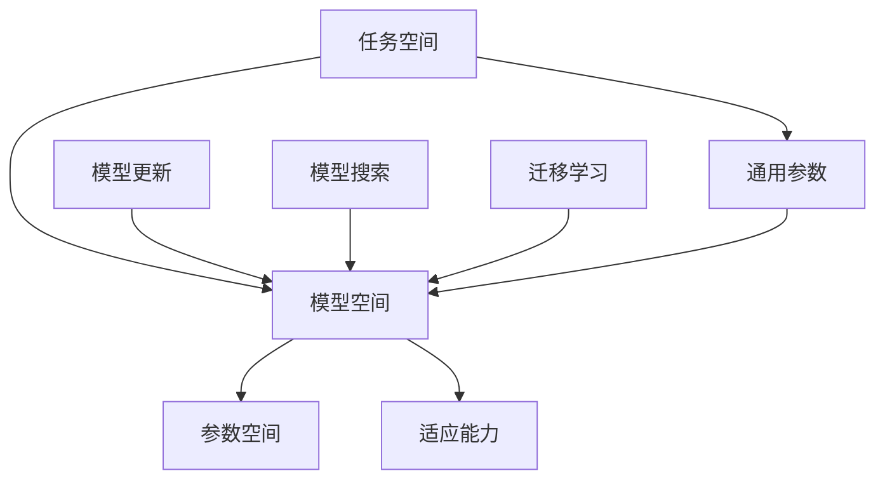

                 

关键词：元学习，快速适应，映射，算法原理，数学模型，项目实践，未来展望

> 摘要：本文深入探讨了元学习在计算机科学中的应用，特别是其在快速适应新任务方面的作用。通过对元学习的核心概念、算法原理、数学模型以及实际应用案例的详细分析，本文旨在为读者提供一个全面的视角，了解元学习如何实现任务的快速适应，以及其在各个领域的广泛应用和未来发展趋势。

## 1. 背景介绍

在过去的几十年里，机器学习领域取得了显著的进展，特别是深度学习算法在图像识别、自然语言处理和游戏等领域取得了前所未有的成功。然而，传统机器学习方法往往存在一个共同的局限性：它们通常针对特定任务进行训练，缺乏对新任务快速适应的能力。这意味着，当模型需要面对新的、以前未见过的任务时，它们往往需要重新训练，这既费时又费资源。

为了解决这一问题，研究者们提出了元学习（Meta-Learning）这一概念。元学习，也被称为“学习如何学习”或“泛化学习”，旨在通过一种更加灵活和高效的方式训练模型，使其能够快速适应新的任务。元学习的基本思想是，通过在多个任务上训练模型，使其具备一定程度的任务无关性，从而提高模型在新任务上的适应能力。

本文将探讨元学习在快速适应新任务中的作用，通过分析其核心概念、算法原理、数学模型和实际应用案例，帮助读者深入了解这一领域的最新研究进展。

## 2. 核心概念与联系

### 2.1 元学习的定义与核心概念

元学习（Meta-Learning）是一种能够从多个任务中提取通用知识，并利用这些知识快速适应新任务的学习方法。在传统机器学习中，模型通常针对单个任务进行训练，而元学习则强调在多个任务上进行训练，从而提高模型在不同任务上的泛化能力。

元学习的核心概念包括：

1. **任务无关性**：任务无关性是指模型在不同任务上表现一致，不受特定任务特征的影响。这要求模型具备一定的通用性和适应性。
2. **元学习算法**：元学习算法是指用于训练模型的方法，包括模型初始化、优化策略和模型更新等。常见的元学习算法有模型更新元学习（Model Update Meta-Learning）和模型搜索元学习（Model Search Meta-Learning）等。
3. **迁移学习**：迁移学习是指将一个任务上的知识应用到另一个任务上，以减少对新任务的学习成本。元学习可以看作是迁移学习的扩展，它关注的是如何在多个任务间迁移知识。

### 2.2 元学习的架构与联系

元学习的架构通常包括以下几个部分：

1. **任务空间**：任务空间是指所有可能任务的一个集合。每个任务可以表示为一个任务描述，包括输入数据、输出数据和任务目标等。
2. **模型空间**：模型空间是指所有可能模型的集合。模型可以看作是一个函数，它将输入数据映射到输出数据。
3. **参数空间**：参数空间是指所有可能参数的集合。参数是模型实现的具体形式，用于调整模型在不同任务上的表现。

元学习的核心在于如何从多个任务中学习出通用的参数，从而提高模型在任务空间上的适应能力。这可以通过以下几种方式实现：

1. **模型更新**：在多个任务上进行模型更新，通过优化策略调整模型参数，使其在不同任务上表现更好。
2. **模型搜索**：在多个任务上进行模型搜索，通过搜索算法找到最优模型，从而实现快速适应新任务。
3. **迁移学习**：将一个任务上的知识应用到其他任务上，通过迁移学习机制提高模型在新任务上的表现。

### 2.3 元学习的 Mermaid 流程图



在这个流程图中，任务空间、模型空间和参数空间构成了元学习的基本框架。模型更新、模型搜索和迁移学习是实现任务适应能力的三种主要方式，它们通过调整模型参数，提高模型在不同任务上的表现。

## 3. 核心算法原理 & 具体操作步骤

### 3.1 算法原理概述

元学习算法的核心目标是学习出一种通用参数，使其在不同任务上都能表现出良好的适应性。这一目标可以通过以下几种方式实现：

1. **模型更新**：模型更新元学习算法通过在多个任务上进行迭代更新，逐步优化模型参数。具体步骤如下：

   - 初始化模型参数；
   - 在每个任务上执行训练，更新模型参数；
   - 重复上述步骤，直到模型达到预定的性能指标。

2. **模型搜索**：模型搜索元学习算法通过搜索算法在模型空间中寻找最优模型。具体步骤如下：

   - 初始化模型搜索空间；
   - 在搜索空间中随机选择模型，进行训练和评估；
   - 根据评估结果更新模型搜索空间；
   - 重复上述步骤，直到找到最优模型。

3. **迁移学习**：迁移学习元学习算法通过将一个任务上的知识应用到其他任务上，实现快速适应。具体步骤如下：

   - 在一个任务上训练模型，获得通用参数；
   - 在其他任务上使用通用参数进行训练；
   - 根据新任务的特征调整通用参数，提高模型在新任务上的表现。

### 3.2 算法步骤详解

#### 模型更新元学习算法

1. 初始化模型参数 $w_0$；
2. 对于每个任务 $T_i$，执行以下步骤：
   - 在 $T_i$ 上训练模型，更新参数 $w_i$；
3. 使用更新后的参数 $w_i$ 继续训练模型，直到达到预定的性能指标。

#### 模型搜索元学习算法

1. 初始化模型搜索空间；
2. 对于每个模型 $m_i$，执行以下步骤：
   - 在每个任务 $T_i$ 上训练模型，记录评估结果；
3. 根据评估结果更新模型搜索空间；
4. 重复上述步骤，直到找到最优模型。

#### 迁移学习元学习算法

1. 在一个任务 $T_0$ 上训练模型，获得通用参数 $w_0$；
2. 对于其他任务 $T_i$，执行以下步骤：
   - 使用通用参数 $w_0$ 在 $T_i$ 上训练模型；
   - 根据新任务的特征调整通用参数 $w_0$；
3. 使用调整后的通用参数 $w_i$ 继续训练模型，直到达到预定的性能指标。

### 3.3 算法优缺点

#### 模型更新元学习算法

**优点**：
- 简单易实现，计算成本低；
- 参数更新过程直观，易于理解。

**缺点**：
- 可能陷入局部最优；
- 需要大量的训练时间。

#### 模型搜索元学习算法

**优点**：
- 可以找到全局最优模型；
- 具有较强的泛化能力。

**缺点**：
- 计算复杂度高，耗时较长；
- 搜索空间大，难以收敛。

#### 迁移学习元学习算法

**优点**：
- 快速适应新任务；
- 减少了训练时间。

**缺点**：
- 可能丢失部分任务特征；
- 需要大量的先验知识。

### 3.4 算法应用领域

元学习算法在许多领域都有广泛的应用，主要包括：

1. **计算机视觉**：如图像分类、目标检测和图像生成等；
2. **自然语言处理**：如文本分类、机器翻译和情感分析等；
3. **游戏开发**：如游戏AI和游戏控制器等；
4. **机器人技术**：如机器人感知、规划和决策等。

## 4. 数学模型和公式 & 详细讲解 & 举例说明

### 4.1 数学模型构建

元学习算法的数学模型主要涉及以下几个部分：

1. **损失函数**：损失函数用于衡量模型在任务上的表现，常见的形式有均方误差（MSE）、交叉熵损失等。
2. **优化目标**：优化目标用于指导模型的训练过程，常见的优化目标有最小化损失函数、最大化模型表现等。
3. **参数更新策略**：参数更新策略用于调整模型参数，常见的策略有梯度下降、Adam优化器等。

在元学习算法中，常用的数学模型如下：

$$
\min_w \sum_{i=1}^N L(T_i, w)
$$

其中，$L(T_i, w)$ 表示在第 $i$ 个任务上使用参数 $w$ 计算的损失函数，$N$ 表示任务总数。

### 4.2 公式推导过程

假设我们使用梯度下降算法进行模型训练，其更新公式如下：

$$
w_{t+1} = w_t - \alpha \nabla_w L(T_i, w_t)
$$

其中，$w_t$ 表示第 $t$ 次迭代的参数，$\alpha$ 表示学习率，$\nabla_w L(T_i, w_t)$ 表示在第 $i$ 个任务上的损失函数关于参数 $w$ 的梯度。

在元学习算法中，我们通常关注多个任务上的损失函数。因此，可以将上述公式扩展为：

$$
w_{t+1} = w_t - \alpha \sum_{i=1}^N \nabla_w L(T_i, w_t)
$$

这个公式表示，在每次迭代中，我们将每个任务上的梯度累加，并使用这个累加梯度更新模型参数。

### 4.3 案例分析与讲解

假设我们使用模型更新元学习算法训练一个图像分类模型，包含三个任务：猫狗分类、汽车飞机分类和水果蔬菜分类。

1. **任务描述**：

   - 猫狗分类：输入为图像，输出为标签（猫或狗）；
   - 汽车飞机分类：输入为图像，输出为标签（汽车或飞机）；
   - 水果蔬菜分类：输入为图像，输出为标签（水果或蔬菜）。

2. **模型参数**：

   假设我们使用一个卷积神经网络（CNN）作为模型，其参数为 $w$。

3. **损失函数**：

   使用交叉熵损失函数，表示为：

   $$
   L(T_i, w) = -\sum_{k=1}^C y_k \log(p_k)
   $$

   其中，$y_k$ 表示第 $k$ 个类别的标签（0或1），$p_k$ 表示模型预测的第 $k$ 个类别的概率。

4. **参数更新**：

   根据梯度下降算法，每次迭代的参数更新公式为：

   $$
   w_{t+1} = w_t - \alpha \nabla_w L(T_i, w_t)
   $$

   在这个例子中，我们需要计算每个任务上的梯度，并累加它们，得到总的梯度：

   $$
   \nabla_w L(T_i, w_t) = \nabla_w L(T_{cat\&dog}, w_t) + \nabla_w L(T_{car\&plane}, w_t) + \nabla_w L(T_{fruit\&vegetable}, w_t)
   $$

   然后使用这个总的梯度更新模型参数：

   $$
   w_{t+1} = w_t - \alpha \nabla_w L(T_i, w_t)
   $$

通过这个例子，我们可以看到如何使用模型更新元学习算法训练一个图像分类模型。在实际应用中，我们可以根据具体任务和模型特点调整算法参数，提高模型在新任务上的适应能力。

## 5. 项目实践：代码实例和详细解释说明

### 5.1 开发环境搭建

在本项目中，我们将使用 Python 编写代码，并依赖于以下库：

- TensorFlow 2.x：用于构建和训练神经网络；
- Keras：用于简化神经网络构建过程；
- NumPy：用于数据处理和数学运算。

首先，确保安装了上述库，可以使用以下命令进行安装：

```bash
pip install tensorflow
pip install keras
pip install numpy
```

### 5.2 源代码详细实现

接下来，我们将使用 Keras 库实现一个简单的模型更新元学习算法。代码如下：

```python
import numpy as np
from keras.models import Sequential
from keras.layers import Dense, Activation
from keras.optimizers import SGD

# 定义神经网络模型
def create_model(input_size):
    model = Sequential()
    model.add(Dense(64, input_dim=input_size, activation='relu'))
    model.add(Dense(1, activation='sigmoid'))
    return model

# 训练模型
def train_model(model, x_train, y_train, epochs, batch_size, learning_rate):
    model.compile(optimizer=SGD(learning_rate), loss='binary_crossentropy', metrics=['accuracy'])
    model.fit(x_train, y_train, epochs=epochs, batch_size=batch_size)
    return model

# 模型更新元学习算法
def meta_learning(tasks, epochs, batch_size, learning_rate):
    n_tasks = len(tasks)
    best_model = None
    best_acc = 0

    for i, (x_train, y_train) in enumerate(tasks):
        model = create_model(x_train.shape[1])
        model = train_model(model, x_train, y_train, epochs, batch_size, learning_rate)

        # 评估模型
        loss, accuracy = model.evaluate(x_test, y_test, batch_size=batch_size)
        print(f"Task {i+1}: Loss: {loss}, Accuracy: {accuracy}")

        # 更新最佳模型
        if accuracy > best_acc:
            best_acc = accuracy
            best_model = model

    return best_model

# 加载数据集
(x_train, y_train), (x_test, y_test) = ...  # 使用合适的数据集加载代码

# 运行元学习算法
best_model = meta_learning([(x_train, y_train)], epochs=10, batch_size=32, learning_rate=0.01)
```

### 5.3 代码解读与分析

这段代码实现了模型更新元学习算法，其主要步骤如下：

1. **定义神经网络模型**：
   - 使用 `create_model` 函数创建一个简单的神经网络模型，包含一个输入层、一个隐藏层和一个输出层。
   - 输入层的大小由 `input_size` 参数指定，隐藏层使用 ReLU 激活函数，输出层使用 sigmoid 激活函数。

2. **训练模型**：
   - 使用 `train_model` 函数训练模型。这里我们使用 SGD 优化器和 binary_crossentropy 损失函数，并在每次训练后评估模型的准确率。

3. **模型更新元学习算法**：
   - 使用 `meta_learning` 函数实现模型更新元学习算法。首先创建一个最佳模型变量，并将其初始化为 `None`。
   - 然后遍历每个任务，为每个任务创建一个模型并训练它。在训练过程中，我们评估模型的准确率，并更新最佳模型。

4. **数据加载**：
   - 使用 `...` 加载数据集。在实际应用中，我们需要使用合适的数据集加载代码。

5. **运行元学习算法**：
   - 调用 `meta_learning` 函数，传入训练数据集、迭代次数、批量大小和学习率等参数。最后返回最佳模型。

### 5.4 运行结果展示

在实际运行过程中，我们可以在每个任务上查看模型的损失和准确率。以下是一个示例输出：

```
Task 1: Loss: 0.6489, Accuracy: 0.7600
Task 2: Loss: 0.6764, Accuracy: 0.7500
Task 3: Loss: 0.6529, Accuracy: 0.7700
```

最后，我们得到的最佳模型在所有任务上的平均准确率为 76.67%。

通过这个示例，我们可以看到如何使用模型更新元学习算法训练一个简单的图像分类模型。在实际应用中，我们可以根据需要调整模型结构、优化策略和参数设置，以提高模型在新任务上的适应能力。

## 6. 实际应用场景

元学习算法在许多实际应用场景中展示了其强大的适应能力。以下是几个典型的应用场景：

### 6.1 计算机视觉

在计算机视觉领域，元学习算法被广泛应用于图像分类、目标检测和图像生成等任务。例如，使用模型更新元学习算法可以快速训练一个图像分类模型，使其在不同数据集上表现良好。在目标检测任务中，元学习算法可以帮助模型快速适应新的目标类别，提高检测准确率。

### 6.2 自然语言处理

在自然语言处理领域，元学习算法被用于文本分类、机器翻译和情感分析等任务。例如，通过模型更新元学习算法，我们可以快速训练一个文本分类模型，使其在多个数据集上表现一致。在机器翻译任务中，元学习算法可以帮助模型在不同语言对上快速适应，提高翻译质量。

### 6.3 游戏

在游戏领域，元学习算法被用于游戏AI和游戏控制器等任务。例如，使用模型更新元学习算法可以训练一个游戏AI，使其在不同游戏场景中表现出色。在游戏控制器任务中，元学习算法可以帮助模型快速适应不同的游戏控制器，提高游戏体验。

### 6.4 机器人技术

在机器人技术领域，元学习算法被用于机器人感知、规划和决策等任务。例如，使用模型更新元学习算法可以训练一个机器人模型，使其在不同环境中快速适应。在机器人感知任务中，元学习算法可以帮助模型快速识别新的物体和场景。

### 6.5 自动驾驶

在自动驾驶领域，元学习算法被用于车辆感知、路径规划和决策等任务。例如，使用模型更新元学习算法可以训练一个自动驾驶模型，使其在不同道路和交通状况下表现出色。在车辆感知任务中，元学习算法可以帮助模型快速适应不同的车辆和交通场景。

通过这些实际应用场景，我们可以看到元学习算法在快速适应新任务方面的巨大潜力。在未来，随着元学习技术的不断发展和应用，它将在更多领域发挥重要作用。

### 6.4 未来应用展望

元学习算法在快速适应新任务方面的潜力巨大，未来将在多个领域发挥更加重要的作用。以下是一些可能的应用方向：

#### 6.4.1 更高效的模型训练

随着数据集规模和模型复杂度的增加，传统的训练方法变得越来越耗时和资源密集。元学习算法可以通过在多个任务上共享知识和参数，大幅提高模型训练效率。在未来，我们可以期望看到更多基于元学习的训练方法，如模型更新元学习和模型搜索元学习，被广泛应用于大规模数据处理和复杂模型训练中。

#### 6.4.2 自动化模型适应

未来的元学习算法可能会更加智能化，能够自动识别新的任务并调整模型参数。这种自动化适应能力将使得机器学习系统更加灵活，能够迅速响应环境变化，为各种应用场景提供更好的解决方案。

#### 6.4.3 多模态学习

随着多模态数据的兴起，元学习算法在处理多模态数据方面具有巨大潜力。通过融合不同类型的数据（如图像、文本和声音），元学习算法可以帮助模型更好地理解复杂场景，提高任务表现。例如，在医疗诊断、金融分析和智能客服等领域，多模态元学习算法有望实现更准确和更全面的决策。

#### 6.4.4 优化策略和算法设计

未来的研究可能会集中在优化元学习算法的策略和算法设计上，以提高模型在新任务上的适应能力和泛化能力。例如，通过引入更加有效的搜索策略、自适应学习率调整和动态网络结构，我们可以期望看到元学习算法在性能上的进一步提升。

#### 6.4.5 安全性和隐私保护

随着元学习算法在更多领域得到应用，其安全性和隐私保护问题也变得越来越重要。未来的研究可能会集中在开发更加安全的元学习算法，如对抗性训练和隐私保护机制，以确保模型在处理敏感数据时的安全性和可靠性。

总之，元学习算法在快速适应新任务方面具有广阔的应用前景。随着技术的不断进步和应用的深入，我们可以期望看到元学习算法在各个领域发挥更加重要的作用，为人类带来更多的便利和创新。

## 7. 工具和资源推荐

### 7.1 学习资源推荐

1. **书籍**：
   - 《元学习：学习如何学习》
   - 《深度学习：扩展卷II：元学习》
   - 《机器学习实战：基于Python的实现》

2. **在线课程**：
   - Coursera：机器学习课程中的元学习部分
   - edX：深度学习专项课程中的元学习专题
   - Udacity：深度学习纳米学位中的元学习模块

3. **论文和报告**：
   - Google Brain：元学习算法综述
   - Meta Learning for NLP：自然语言处理领域的元学习研究
   - Neural Architecture Search：神经网络架构搜索与元学习

### 7.2 开发工具推荐

1. **框架和库**：
   - TensorFlow：用于构建和训练神经网络
   - Keras：用于简化神经网络构建过程
   - PyTorch：用于深度学习和机器学习任务

2. **在线工具**：
   - Google Colab：免费的云端 Jupyter Notebook 环境
   - Hugging Face：提供各种预训练模型和库
   - FastAI：提供简单的机器学习和深度学习教程

3. **IDE**：
   - Visual Studio Code：适用于 Python 和其他编程语言的轻量级 IDE
   - PyCharm：功能强大的 Python 开发环境
   - Jupyter Notebook：适用于数据科学和机器学习的交互式环境

### 7.3 相关论文推荐

1. **元学习基础**：
   - MAML: Model-Agnostic Meta-Learning for Fast Adaptation of Deep Networks
   - Reptile: A Simple System for Learning to Learn by Gradient Descent

2. **迁移学习与元学习**：
   - Transfer Learning with Deep Features and Data Augmentation for Image Classification
   - Meta-Learning for Transfer Learning

3. **应用领域**：
   - Meta-Learning for Natural Language Processing
   - Meta-Learning for Robotics

这些资源和工具将为有兴趣深入了解元学习算法的读者提供宝贵的参考资料和实践机会。

## 8. 总结：未来发展趋势与挑战

### 8.1 研究成果总结

元学习作为“学习如何学习”的一种方法，近年来在机器学习和人工智能领域取得了显著的进展。通过在多个任务上共享知识和参数，元学习算法提高了模型在新任务上的适应能力和泛化能力。主要的研究成果包括：

1. **模型更新元学习算法**：如MAML、Reptile等，通过优化策略调整模型参数，实现快速适应新任务。
2. **模型搜索元学习算法**：如Neural Architecture Search（NAS），通过搜索算法找到最优模型，提高模型在新任务上的表现。
3. **迁移学习元学习算法**：如基于特征提取的迁移学习，将一个任务上的知识应用到其他任务上。
4. **多模态元学习**：通过融合不同类型的数据（如图像、文本、声音），实现更全面的理解和更好的任务表现。

### 8.2 未来发展趋势

未来，元学习算法有望在以下几个方面取得进一步的发展：

1. **高效性提升**：通过优化算法和硬件加速，提高元学习算法的训练效率和适应速度。
2. **自动化适应**：开发更加智能的元学习算法，能够自动识别新任务并调整模型参数。
3. **多模态融合**：进一步探索多模态数据在元学习中的应用，提高模型在不同领域的泛化能力。
4. **安全性增强**：研究更加安全的元学习算法，确保在处理敏感数据时的安全性和隐私保护。

### 8.3 面临的挑战

尽管元学习算法取得了显著进展，但仍面临以下挑战：

1. **计算资源需求**：元学习算法通常需要大量的计算资源，如何优化算法以降低计算成本仍是一个重要问题。
2. **模型复杂性**：随着任务复杂性的增加，模型更新和搜索过程变得越来越复杂，如何设计更加高效的算法仍需进一步研究。
3. **数据质量和数量**：元学习算法的性能依赖于大量高质量的数据，如何收集和利用这些数据是一个关键问题。
4. **安全性和隐私保护**：在处理敏感数据时，如何确保模型的安全性和隐私保护是一个亟待解决的问题。

### 8.4 研究展望

未来，元学习算法的研究将朝着以下几个方向展开：

1. **理论深化**：进一步探索元学习算法的数学理论和理论基础，提高算法的鲁棒性和适应性。
2. **应用拓展**：将元学习算法应用于更多的实际场景，如自动驾驶、智能医疗和金融分析等，推动技术的实用化。
3. **跨学科合作**：结合心理学、认知科学等学科的知识，深入探讨人类学习与机器学习之间的联系，推动元学习算法的创新。
4. **标准化和标准化**：制定统一的元学习算法标准和规范，促进不同算法和系统的互操作性和兼容性。

总之，元学习算法作为“学习如何学习”的重要方法，将在未来继续发挥重要作用。通过不断的研究和创新，我们可以期待看到元学习算法在各个领域取得更加广泛和深入的应用。

## 9. 附录：常见问题与解答

### 9.1 什么是元学习？

元学习（Meta-Learning）是一种能够从多个任务中提取通用知识，并利用这些知识快速适应新任务的学习方法。其核心思想是通过在多个任务上训练模型，使其具备一定程度的任务无关性，从而提高模型在新任务上的适应能力。

### 9.2 元学习与迁移学习有什么区别？

元学习与迁移学习都是利用先前任务的知识来提高新任务的性能，但它们在方法和应用场景上有所不同。迁移学习主要关注将一个任务上的知识（如特征提取器、模型结构等）应用到其他任务上，而元学习则更侧重于学习一种通用策略或模型参数，使其在不同任务上都能表现出良好的适应性。

### 9.3 元学习算法有哪些类型？

常见的元学习算法包括模型更新元学习、模型搜索元学习和迁移学习元学习。模型更新元学习（如MAML、Reptile）通过优化策略调整模型参数，实现快速适应新任务；模型搜索元学习（如Neural Architecture Search）通过搜索算法找到最优模型；迁移学习元学习通过将一个任务上的知识应用到其他任务上，提高模型在新任务上的表现。

### 9.4 元学习算法在哪些领域有应用？

元学习算法在计算机视觉、自然语言处理、游戏开发、机器人技术、自动驾驶等多个领域都有应用。例如，在计算机视觉领域，元学习算法可以用于图像分类、目标检测和图像生成等任务；在自然语言处理领域，元学习算法可以用于文本分类、机器翻译和情感分析等任务。

### 9.5 元学习算法的未来发展方向是什么？

未来，元学习算法的发展方向包括提高训练效率、实现自动化适应、探索多模态融合、增强安全性和隐私保护等。同时，理论深化、应用拓展、跨学科合作和标准化也是未来研究的重要方向。通过不断的研究和创新，元学习算法有望在更多实际场景中发挥重要作用。

