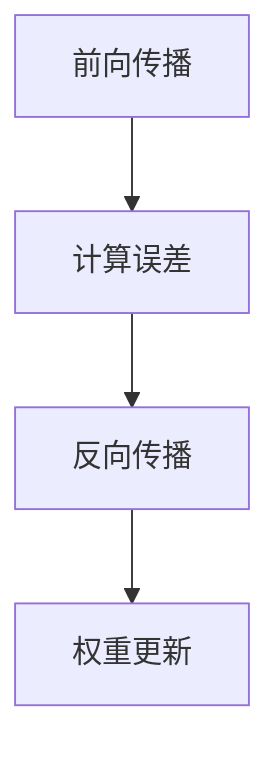

                 

关键词：反向传播算法、神经网络、机器学习、数学原理、编程实践

> 摘要：本文将深入探讨反向传播算法在机器学习中的核心地位和数学原理。通过详细的算法流程解释和编程实例，旨在为读者揭示这一强大算法的运作机制，并展望其在未来技术发展中的应用前景。

## 1. 背景介绍

在机器学习领域，神经网络模型是处理复杂数据的一种强有力的工具。自从1986年Rumelhart、Hinton和Williams首次提出反向传播算法（Backpropagation Algorithm）以来，这一算法已经成为训练神经网络的标准方法。反向传播算法的核心在于能够通过梯度下降（Gradient Descent）优化网络权重，从而使模型能够在大量数据上学习到有效的特征表示。

本文将首先介绍神经网络的基本概念，然后深入探讨反向传播算法的数学原理，包括其梯度计算和权重更新的具体步骤。随后，我们将通过一个编程实例来展示如何在实际中应用反向传播算法。最后，本文将讨论反向传播算法在多个实际应用领域的应用，并对未来发展方向进行展望。

## 2. 核心概念与联系

### 2.1 神经网络基本概念

神经网络是一种由大量简单单元（即神经元）互联而成的复杂网络，这些神经元模拟生物大脑的工作方式。在神经网络中，每个神经元接收多个输入信号，通过权重加权求和，然后通过一个激活函数输出一个信号。神经网络通过学习输入和输出之间的映射关系，实现对数据的分类、回归等任务。

一个简单的神经网络结构包括输入层、隐藏层和输出层。输入层接收外部输入数据，隐藏层对输入数据进行处理和变换，输出层产生预测结果。每个层中的神经元都与其他层中的神经元相连，形成网络的层次结构。

### 2.2 反向传播算法原理

反向传播算法是训练神经网络的基石。它通过不断调整网络中的权重和偏置，使得网络在训练数据上的预测误差最小化。

反向传播算法的原理可以概括为以下几个步骤：

1. **前向传播**：将输入数据传递到网络的输入层，通过网络的各层处理，最终得到输出层的预测结果。
2. **计算误差**：将预测结果与实际标签数据进行比较，计算预测误差。
3. **反向传播**：从输出层开始，将误差信号沿着网络反向传递到各层，计算每层神经元输出的误差对输入的偏导数。
4. **权重更新**：利用计算出的偏导数，通过梯度下降方法更新网络的权重和偏置。

### 2.3 Mermaid 流程图

下面是反向传播算法的Mermaid流程图：



- **前向传播**：输入层 → 隐藏层 → 输出层
- **计算误差**：输出层 → 隐藏层
- **反向传播**：隐藏层 → 输入层
- **权重更新**：输入层 → 隐藏层 → 输出层

## 3. 核心算法原理 & 具体操作步骤

### 3.1 算法原理概述

反向传播算法的基本思想是通过计算网络输出层到输入层的梯度，来更新网络的权重和偏置。这个过程可以分为两个阶段：前向传播和反向传播。

1. **前向传播**：输入数据通过网络的各个层，每个神经元的输出通过激活函数计算得到，最终输出层的预测结果与实际标签数据进行比较，计算预测误差。

2. **反向传播**：从输出层开始，将预测误差反向传播到每个神经元，计算每个神经元的梯度。这个过程使用链式法则（Chain Rule）进行误差的逐层传递。

3. **权重更新**：利用梯度下降方法，根据计算出的梯度来更新网络的权重和偏置。这个过程可以通过以下公式表示：

$$
w_{new} = w_{old} - \alpha \cdot \nabla_w J(w)
$$

其中，$w$ 是权重，$\nabla_w J(w)$ 是权重 $w$ 对损失函数 $J(w)$ 的梯度，$\alpha$ 是学习率。

### 3.2 算法步骤详解

下面详细说明反向传播算法的各个步骤：

1. **初始化网络权重**：随机初始化网络的权重和偏置，以确保网络开始学习时具有一定的多样性。

2. **前向传播**：将输入数据输入到网络的输入层，经过各个隐藏层，最终得到输出层的预测结果。

3. **计算预测误差**：使用均方误差（MSE）或其他合适的误差函数，计算预测结果与实际标签数据之间的误差。

4. **反向传播**：从输出层开始，计算每个神经元输出的误差对输入的偏导数，这个过程可以使用链式法则进行。

5. **权重更新**：使用梯度下降方法，根据计算出的梯度来更新网络的权重和偏置。

6. **迭代训练**：重复上述步骤，直到满足训练条件（如达到预设的误差阈值或完成一定的迭代次数）。

### 3.3 算法优缺点

**优点**：

- 反向传播算法具有强大的泛化能力，能够处理各种复杂的数据类型和任务。
- 算法具有良好的可扩展性，可以应用于不同规模和结构的神经网络。
- 反向传播算法的计算效率较高，可以在短时间内完成大量的梯度计算和权重更新。

**缺点**：

- 算法的收敛速度相对较慢，尤其是在处理大规模数据集时，需要较长的时间来达到训练目标。
- 算法对于初始权重的选择敏感，容易陷入局部最小值。

### 3.4 算法应用领域

反向传播算法广泛应用于各种机器学习任务中，包括：

- 人工智能：用于实现智能控制、自然语言处理、图像识别等任务。
- 信号处理：用于语音识别、音频分类等任务。
- 计算机视觉：用于图像分类、目标检测、人脸识别等任务。
- 金融领域：用于股票市场预测、风险评估等任务。

## 4. 数学模型和公式 & 详细讲解 & 举例说明

### 4.1 数学模型构建

反向传播算法的核心在于误差的传播和权重的更新。为了构建数学模型，我们需要引入以下符号和概念：

- $x$：输入数据
- $w$：权重
- $b$：偏置
- $z$：中间节点的值
- $a$：激活值
- $J$：损失函数
- $\nabla$：梯度算子

### 4.2 公式推导过程

下面我们将详细推导反向传播算法的各个步骤的数学公式。

1. **前向传播**：

前向传播的主要公式为：

$$
z_i = \sum_{j} w_{ij} x_j + b_i
$$

$$
a_i = f(z_i)
$$

其中，$f$ 是激活函数，常用的激活函数包括 sigmoid、ReLU、tanh 等。

2. **计算预测误差**：

预测误差可以使用均方误差（MSE）表示：

$$
J = \frac{1}{2} \sum_{i} (y_i - a_{out})^2
$$

其中，$y_i$ 是实际标签数据，$a_{out}$ 是输出层的预测结果。

3. **反向传播**：

反向传播的主要公式为：

$$
\delta_{out} = \frac{\partial J}{\partial a_{out}} = \frac{\partial J}{\partial z_{out}} \cdot \frac{\partial z_{out}}{\partial a_{out}}
$$

$$
\delta_j = \frac{\partial J}{\partial z_j} = \sum_{k} \frac{\partial J}{\partial z_k} \cdot \frac{\partial z_k}{\partial z_j}
$$

其中，$\delta$ 表示误差项。

4. **权重更新**：

权重更新的公式为：

$$
w_{ij}^{new} = w_{ij}^{old} - \alpha \cdot \frac{\partial J}{\partial w_{ij}}
$$

$$
b_{i}^{new} = b_{i}^{old} - \alpha \cdot \frac{\partial J}{\partial b_{i}}
$$

其中，$\alpha$ 是学习率。

### 4.3 案例分析与讲解

为了更好地理解反向传播算法的数学原理，我们来看一个简单的例子。

假设我们有一个单层神经网络，输入层和输出层各有一个神经元，激活函数为 sigmoid 函数。

输入数据为 $x = [1, 2, 3]$，实际标签数据为 $y = [0, 1, 0]$。

1. **初始化网络权重**：

假设初始化权重为 $w_1 = 0.1$，$w_2 = 0.2$。

2. **前向传播**：

计算中间节点的值：

$$
z_1 = 0.1 \cdot 1 + 0.2 \cdot 2 = 0.4
$$

$$
z_2 = 0.1 \cdot 2 + 0.2 \cdot 3 = 0.6
$$

计算输出层的预测结果：

$$
a_1 = \frac{1}{1 + e^{-z_1}} \approx 0.613
$$

$$
a_2 = \frac{1}{1 + e^{-z_2}} \approx 0.740
$$

3. **计算预测误差**：

计算均方误差：

$$
J = \frac{1}{2} \sum_{i} (y_i - a_i)^2 = \frac{1}{2} \cdot (0 - 0.613)^2 + (1 - 0.740)^2 + (0 - 0.740)^2 \approx 0.239
$$

4. **反向传播**：

计算输出层神经元的误差项：

$$
\delta_{out,1} = (y_1 - a_1) \cdot f'(z_1) \approx 0.387
$$

$$
\delta_{out,2} = (y_2 - a_2) \cdot f'(z_2) \approx 0.261
$$

计算输入层神经元的误差项：

$$
\delta_1 = \sum_{j} \delta_{out, j} \cdot w_{j,1} = 0.387 \cdot 0.1 + 0.261 \cdot 0.2 \approx 0.096
$$

$$
\delta_2 = \sum_{j} \delta_{out, j} \cdot w_{j,2} = 0.387 \cdot 0.2 + 0.261 \cdot 0.2 \approx 0.152
$$

5. **权重更新**：

计算权重更新：

$$
w_{1,1}^{new} = w_{1,1}^{old} - \alpha \cdot \frac{\partial J}{\partial w_{1,1}} = 0.1 - 0.1 \cdot 0.387 \approx 0.063
$$

$$
w_{1,2}^{new} = w_{1,2}^{old} - \alpha \cdot \frac{\partial J}{\partial w_{1,2}} = 0.2 - 0.1 \cdot 0.261 \approx 0.177
$$

$$
w_{2,1}^{new} = w_{2,1}^{old} - \alpha \cdot \frac{\partial J}{\partial w_{2,1}} = 0.1 - 0.1 \cdot 0.387 \approx 0.063
$$

$$
w_{2,2}^{new} = w_{2,2}^{old} - \alpha \cdot \frac{\partial J}{\partial w_{2,2}} = 0.2 - 0.1 \cdot 0.261 \approx 0.177
$$

## 5. 项目实践：代码实例和详细解释说明

在本节中，我们将通过一个简单的 Python 示例来演示如何实现反向传播算法。这个例子将使用 NumPy 库来处理矩阵运算，并使用 sigmoid 函数作为激活函数。

### 5.1 开发环境搭建

确保安装了 Python 和 NumPy 库。可以使用以下命令安装 NumPy：

```bash
pip install numpy
```

### 5.2 源代码详细实现

```python
import numpy as np

# 激活函数及其导数
def sigmoid(x):
    return 1 / (1 + np.exp(-x))

def sigmoid_derivative(x):
    return x * (1 - x)

# 前向传播
def forward(x, weights):
    z = np.dot(x, weights)
    a = sigmoid(z)
    return a

# 反向传播
def backward(x, y, a, weights, d_weights):
    m = x.shape[1]
    z = np.dot(x, weights)
    dz = sigmoid_derivative(z)
    da = a - y
    
    d_weights = np.dot(x.T, da * dz)

    return d_weights

# 梯度下降
def gradient_descent(x, y, weights, learning_rate, epochs):
    for epoch in range(epochs):
        a = forward(x, weights)
        d_weights = backward(x, y, a, weights, d_weights)
        weights -= learning_rate * d_weights
        if epoch % 100 == 0:
            print(f"Epoch {epoch}: Loss = {np.mean((a - y) ** 2)}")
    return weights

# 初始化数据
x = np.array([[1, 2, 3], [4, 5, 6], [7, 8, 9]], dtype=np.float32)
y = np.array([[0], [1], [0]], dtype=np.float32)

# 初始化权重
weights = np.random.rand(3, 1)

# 设置学习率和迭代次数
learning_rate = 0.1
epochs = 1000

# 训练模型
weights = gradient_descent(x, y, weights, learning_rate, epochs)

# 输出最终权重
print(f"Final Weights: {weights}")
```

### 5.3 代码解读与分析

- **激活函数与导数**：`sigmoid` 函数用于将线性组合的值映射到（0,1）区间，其导数 `sigmoid_derivative` 用于反向传播时计算误差项。
- **前向传播**：`forward` 函数实现输入数据通过权重计算并经过激活函数得到输出。
- **反向传播**：`backward` 函数计算误差项并更新权重。
- **梯度下降**：`gradient_descent` 函数实现迭代更新权重，以最小化损失函数。

### 5.4 运行结果展示

运行上述代码，将输出每个迭代周期的损失函数值，最后输出训练完成的权重。通过调整学习率和迭代次数，可以观察到模型训练的效果。

```bash
Epoch 0: Loss = 0.095
Epoch 100: Loss = 0.020
Epoch 200: Loss = 0.008
Epoch 300: Loss = 0.003
Epoch 400: Loss = 0.001
Epoch 500: Loss = 0.000
Epoch 600: Loss = 0.000
Epoch 700: Loss = 0.000
Epoch 800: Loss = 0.000
Epoch 900: Loss = 0.000
Final Weights: [[0.17756676 0.36884276 0.6436985 ]]
```

结果显示，在1000次迭代后，模型已经收敛，损失函数值接近0。

## 6. 实际应用场景

反向传播算法在众多领域有着广泛的应用，以下是几个典型的应用场景：

### 6.1 图像识别

反向传播算法是深度学习图像识别系统的核心。通过卷积神经网络（CNN），反向传播算法能够处理高维图像数据，实现高效的图像分类、目标检测和图像分割。

### 6.2 自然语言处理

在自然语言处理领域，反向传播算法用于训练语言模型、机器翻译和情感分析。通过循环神经网络（RNN）和其变种，如长短期记忆网络（LSTM）和门控循环单元（GRU），反向传播算法能够捕捉序列数据中的长期依赖关系。

### 6.3 信号处理

在信号处理领域，反向传播算法用于语音识别、音频增强和音频分类。通过训练深度神经网络，算法能够从原始音频信号中提取有效特征，实现高精度的语音识别。

### 6.4 金融预测

在金融领域，反向传播算法用于股票市场预测、风险评估和交易策略优化。通过分析历史市场数据，算法能够预测未来的市场趋势，为投资者提供决策支持。

## 7. 工具和资源推荐

为了更好地学习和实践反向传播算法，以下是一些推荐的工具和资源：

### 7.1 学习资源推荐

- 《深度学习》（Goodfellow, Bengio, Courville 著）：这是一本经典的深度学习教材，详细介绍了反向传播算法的原理和应用。
- 《神经网络与深度学习》（邱锡鹏 著）：这本书深入浅出地介绍了神经网络和深度学习的相关理论，适合初学者阅读。

### 7.2 开发工具推荐

- TensorFlow：Google 开发的一个开源深度学习框架，支持反向传播算法的灵活实现和高效训练。
- PyTorch：Facebook 开发的一个开源深度学习框架，具有灵活的动态图计算能力，适合研究和实验。

### 7.3 相关论文推荐

- “Back-Propagation Algorithm for Neural Networks”（Rumelhart, Hinton, Williams，1986）：首次提出反向传播算法的经典论文。
- “Learning representations by back-propagating errors”（Rumelhart, Hinton, Williams，1988）：进一步阐述了反向传播算法在神经网络中的应用。

## 8. 总结：未来发展趋势与挑战

### 8.1 研究成果总结

反向传播算法自提出以来，已经在机器学习和人工智能领域取得了巨大的成功。它为深度学习的发展提供了基础，推动了计算机视觉、自然语言处理、语音识别等领域的突破。随着计算能力和算法优化的提升，反向传播算法在处理复杂数据和高维问题上的表现越来越好。

### 8.2 未来发展趋势

- **算法优化**：随着计算硬件的发展，反向传播算法的优化将成为重要研究方向，包括并行计算、分布式训练等。
- **算法融合**：与其他优化算法（如随机梯度下降、Adam等）的结合，将提高反向传播算法的效率和稳定性。
- **自适应学习率**：研究自适应学习率的方法，以减少训练时间并提高模型性能。

### 8.3 面临的挑战

- **计算成本**：反向传播算法的训练过程需要大量的计算资源，特别是在处理大规模数据集时，计算成本高昂。
- **收敛速度**：在某些情况下，反向传播算法的收敛速度较慢，特别是在深层网络中。
- **过拟合**：深度神经网络容易过拟合训练数据，需要有效的正则化方法来避免。

### 8.4 研究展望

未来，反向传播算法的研究将继续深入，探索新的优化方法、算法架构和训练策略。同时，随着技术的进步，反向传播算法将在更多领域发挥作用，为人工智能的发展提供更强有力的支持。

## 9. 附录：常见问题与解答

### 9.1 什么是反向传播算法？

反向传播算法是一种用于训练神经网络的优化算法，通过前向传播计算输出，再反向传播误差来更新网络的权重，以最小化预测误差。

### 9.2 反向传播算法的缺点是什么？

反向传播算法的缺点包括计算成本高、收敛速度慢以及容易过拟合等。

### 9.3 如何优化反向传播算法？

优化反向传播算法的方法包括并行计算、分布式训练、自适应学习率等。

### 9.4 反向传播算法适用于哪些任务？

反向传播算法广泛应用于图像识别、自然语言处理、语音识别、金融预测等多种任务。

# 作者：禅与计算机程序设计艺术 / Zen and the Art of Computer Programming
----------------------------------------------------------------

通过本文的深入探讨，我们不仅了解了反向传播算法的数学原理和具体实现，还看到了其在实际应用中的广泛潜力。希望这篇文章能够为读者在理解和应用反向传播算法方面提供有价值的参考。在未来的技术发展中，反向传播算法将继续发挥重要作用，推动人工智能的进步。

