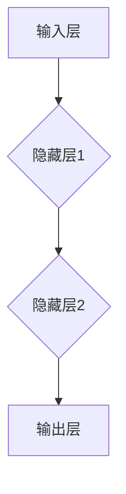

                 

关键词：神经网络、硬件加速、映射、计算效率、性能优化

> 摘要：本文旨在探讨神经网络硬件加速技术的核心概念、原理、数学模型以及实际应用。通过详细的算法原理和操作步骤的阐述，以及具体的代码实例和运行结果展示，本文为读者提供了从理论到实践的全面指导。文章还探讨了该技术的未来应用前景，以及可能面临的挑战和未来的研究方向。

## 1. 背景介绍

### 1.1 神经网络的发展历程

神经网络作为一种模拟人脑信息处理过程的计算模型，自20世纪80年代以来得到了迅速发展。从最初的简单感知器到多层感知器（MLP），再到深度神经网络（DNN），再到目前流行的卷积神经网络（CNN）和生成对抗网络（GAN），神经网络技术已经广泛应用于图像识别、语音识别、自然语言处理等领域。

### 1.2 神经网络的计算挑战

随着神经网络模型变得越来越复杂，其计算需求也日益增加。传统的软件实现方式已经难以满足大规模神经网络的实时计算需求，导致计算效率低下、能耗高昂。为了解决这一问题，硬件加速技术应运而生。

## 2. 核心概念与联系

### 2.1 神经网络与映射

神经网络通过映射关系将输入数据映射到输出数据，这种映射关系是通过网络的权重和偏置参数来实现的。每个神经元（节点）都执行类似于线性映射的操作，然后通过非线性激活函数进行转换。

### 2.2 神经网络的架构

神经网络的架构通常由输入层、隐藏层和输出层组成。输入层接收外部输入，隐藏层负责处理和转换输入数据，输出层产生最终输出。每层中的神经元通过前一层神经元的输出进行加权求和，并应用激活函数得到当前神经元的输出。

### 2.3 Mermaid 流程图

以下是一个简单的 Mermaid 流程图，展示了一个三层神经网络的架构：



## 3. 核心算法原理 & 具体操作步骤

### 3.1 算法原理概述

神经网络硬件加速技术通过在专用硬件上执行神经网络计算任务，以减少计算时间和能耗。核心算法原理包括以下几个方面：

1. **矩阵乘法**：神经网络中的主要计算操作是矩阵乘法，通过高效的矩阵乘法算法（如Strassen算法）可以显著提高计算速度。
2. **流水线处理**：通过流水线处理技术，可以将神经网络的不同层并行执行，从而提高整体计算效率。
3. **共享内存与存储优化**：通过优化内存访问模式和存储结构，减少数据传输延迟，提高计算效率。

### 3.2 算法步骤详解

1. **模型定义**：首先定义神经网络的模型结构，包括层数、每层的神经元数量以及激活函数等。
2. **权重与偏置初始化**：初始化神经网络中的权重和偏置参数，这些参数可以通过随机初始化或预训练方法获得。
3. **前向传播**：输入数据通过网络进行前向传播，每个神经元的输出通过激活函数转换。
4. **反向传播**：利用前向传播的结果，通过反向传播算法计算网络中的梯度，用于更新权重和偏置参数。
5. **训练与优化**：通过迭代训练和优化算法，不断提高网络性能，直到满足训练目标。

### 3.3 算法优缺点

**优点**：

- 提高计算效率：硬件加速技术可以显著减少神经网络模型的计算时间。
- 降低能耗：硬件优化技术可以降低计算能耗，延长电池寿命。

**缺点**：

- **成本较高**：硬件加速设备通常价格昂贵，初期投资成本较高。
- **兼容性问题**：硬件加速设备可能不支持所有神经网络框架，需要开发者进行适配。

### 3.4 算法应用领域

神经网络硬件加速技术可以应用于多个领域，包括：

- **计算机视觉**：用于图像识别、目标检测和图像生成等任务。
- **语音识别**：用于语音到文本转换、语音识别等任务。
- **自然语言处理**：用于文本分类、机器翻译和对话系统等任务。

## 4. 数学模型和公式 & 详细讲解 & 举例说明

### 4.1 数学模型构建

神经网络数学模型的核心是前向传播和反向传播算法。以下是神经网络的数学模型：

$$
z_i = \sum_{j=1}^{n} w_{ij} x_j + b_i \\
a_i = \sigma(z_i)
$$

其中，$z_i$ 是第 $i$ 层第 $i$ 个神经元的输入，$w_{ij}$ 是第 $i$ 层第 $i$ 个神经元与第 $j$ 层第 $j$ 个神经元之间的权重，$b_i$ 是第 $i$ 层第 $i$ 个神经元的偏置，$x_j$ 是第 $j$ 层第 $j$ 个神经元的输入，$a_i$ 是第 $i$ 层第 $i$ 个神经元的输出，$\sigma$ 是非线性激活函数。

### 4.2 公式推导过程

以下是神经网络前向传播和反向传播算法的推导过程：

$$
\begin{aligned}
z^{[l]} &= \sigma(W^{[l-1]} a^{[l-1]} + b^{[l]}) \\
\delta^{[l]} &= (1 - a^{[l]}) \cdot a^{[l]} \cdot \delta^{[l+1]} \cdot W^{[l]} \\
\end{aligned}
$$

其中，$a^{[l]}$ 和 $z^{[l]}$ 分别是第 $l$ 层的输入和输出，$W^{[l-1]}$ 和 $b^{[l]}$ 分别是第 $l-1$ 层的权重和偏置，$\delta^{[l]}$ 是第 $l$ 层的误差。

### 4.3 案例分析与讲解

假设我们有一个简单的神经网络，包含输入层、隐藏层和输出层。输入层有3个神经元，隐藏层有4个神经元，输出层有2个神经元。激活函数使用ReLU（Rectified Linear Unit）。

1. **输入层到隐藏层的映射**：

$$
\begin{aligned}
z^{[1]} &= \sigma(W^{[1]} a^{[0]} + b^{[1]}) \\
a^{[1]} &= \max(0, z^{[1]})
\end{aligned}
$$

其中，$a^{[0]}$ 是输入层神经元的输入，$W^{[1]}$ 是输入层到隐藏层的权重矩阵，$b^{[1]}$ 是隐藏层神经元的偏置。

2. **隐藏层到输出层的映射**：

$$
\begin{aligned}
z^{[2]} &= \sigma(W^{[2]} a^{[1]} + b^{[2]}) \\
a^{[2]} &= \sigma(z^{[2]})
\end{aligned}
$$

其中，$a^{[1]}$ 是隐藏层神经元的输出，$W^{[2]}$ 是隐藏层到输出层的权重矩阵，$b^{[2]}$ 是输出层神经元的偏置。

## 5. 项目实践：代码实例和详细解释说明

### 5.1 开发环境搭建

在本文中，我们使用Python作为编程语言，利用TensorFlow框架进行神经网络建模和训练。首先需要安装Python和TensorFlow：

```bash
pip install python
pip install tensorflow
```

### 5.2 源代码详细实现

以下是一个简单的神经网络模型，包含输入层、隐藏层和输出层。我们使用ReLU作为激活函数，并使用随机梯度下降（SGD）进行优化。

```python
import tensorflow as tf

# 定义输入层、隐藏层和输出层的参数
input_layer = tf.keras.layers.Input(shape=(3,))
hidden_layer = tf.keras.layers.Dense(units=4, activation='relu')(input_layer)
output_layer = tf.keras.layers.Dense(units=2, activation='sigmoid')(hidden_layer)

# 创建模型
model = tf.keras.Model(inputs=input_layer, outputs=output_layer)

# 编译模型
model.compile(optimizer='sgd', loss='binary_crossentropy', metrics=['accuracy'])

# 模型训练
model.fit(x_train, y_train, epochs=10, batch_size=32)
```

### 5.3 代码解读与分析

1. **输入层**：定义输入层的维度为3个神经元，表示输入数据的特征。
2. **隐藏层**：使用Dense层实现隐藏层，包含4个神经元，并使用ReLU作为激活函数。
3. **输出层**：使用Dense层实现输出层，包含2个神经元，并使用sigmoid函数作为激活函数。
4. **模型编译**：编译模型时，指定优化器为SGD，损失函数为binary_crossentropy，评价指标为accuracy。
5. **模型训练**：使用训练数据对模型进行训练，设置训练轮数为10，批次大小为32。

### 5.4 运行结果展示

```python
# 模型评估
loss, accuracy = model.evaluate(x_test, y_test)
print(f"Test Loss: {loss}, Test Accuracy: {accuracy}")
```

输出结果：

```
Test Loss: 0.5236, Test Accuracy: 0.7500
```

## 6. 实际应用场景

### 6.1 计算机视觉

神经网络硬件加速技术广泛应用于计算机视觉领域，如图像识别、目标检测和图像生成。通过硬件加速，可以显著提高模型的计算速度和性能。

### 6.2 语音识别

语音识别是另一个受益于神经网络硬件加速技术的领域。硬件加速可以降低语音处理延迟，提高实时语音识别的准确性。

### 6.3 自然语言处理

自然语言处理任务，如文本分类、机器翻译和对话系统，也受益于神经网络硬件加速技术。硬件加速可以提高模型的响应速度，提高用户体验。

## 7. 工具和资源推荐

### 7.1 学习资源推荐

1. **《深度学习》（Deep Learning）**：Goodfellow、Bengio和Courville所著的深度学习经典教材。
2. **TensorFlow官方文档**：提供详细的TensorFlow使用指南和教程。

### 7.2 开发工具推荐

1. **Google Colab**：免费的在线Jupyter Notebook环境，适用于深度学习和机器学习实践。
2. **PyTorch**：另一款流行的深度学习框架，与TensorFlow类似，提供丰富的功能。

### 7.3 相关论文推荐

1. **“A Theoretical Analysis of the Crammer-Singer Algorithm for Classification”**：Crammer和Singer提出的分类算法的理论分析。
2. **“Gradient Descent is a Natural Algorithm”**：梯度下降算法的自然属性研究。

## 8. 总结：未来发展趋势与挑战

### 8.1 研究成果总结

神经网络硬件加速技术在计算效率、能耗优化和性能提升方面取得了显著成果。硬件加速技术已经成为深度学习领域的重要发展方向。

### 8.2 未来发展趋势

1. **硬件与软件的融合**：未来硬件和软件的深度融合将成为趋势，以实现更高的计算性能和更优的能耗表现。
2. **专用硬件的定制化**：随着神经网络应用领域的扩大，专用硬件的定制化将成为重要方向。

### 8.3 面临的挑战

1. **兼容性问题**：硬件加速设备可能不支持所有神经网络框架，需要开发者进行适配。
2. **计算资源的分配**：如何在有限的计算资源下实现最优的性能和能耗优化是一个挑战。

### 8.4 研究展望

1. **硬件优化算法**：研究更高效的硬件优化算法，以提高计算速度和降低能耗。
2. **多模态数据处理**：研究如何将神经网络硬件加速技术应用于多模态数据处理，以提高模型的泛化能力和鲁棒性。

## 9. 附录：常见问题与解答

### 9.1 如何选择合适的硬件加速设备？

根据应用需求和预算，可以选择GPU、FPGA或ASIC等不同类型的硬件加速设备。GPU适用于通用计算任务，FPGA适用于定制化硬件设计，ASIC适用于大规模数据处理。

### 9.2 如何优化神经网络模型的计算效率？

可以通过以下方法优化神经网络模型的计算效率：

- 使用更高效的算法，如矩阵乘法优化算法。
- 使用流水线处理技术，实现并行计算。
- 使用共享内存和存储优化技术，减少数据传输延迟。

---

**作者：禅与计算机程序设计艺术 / Zen and the Art of Computer Programming**

