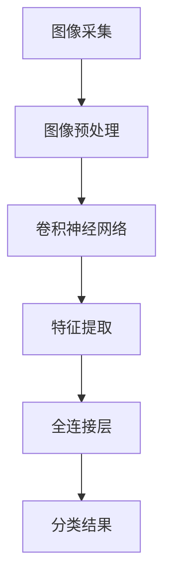

                 

“一切皆是映射”，这句话在哲学和数学中有着深刻的内涵，而在当今的计算机科学和人工智能领域，它则成为了一种崭新的方法论。本文旨在探讨机器视觉与神经网络之间的深层次联系，以及它们如何通过映射关系实现复杂问题的自动化解决。我们将从背景介绍、核心概念与联系、核心算法原理、数学模型和公式、项目实践、实际应用场景、未来应用展望等多个方面，深入探讨这一领域的最新进展和应用前景。

> 关键词：机器视觉、神经网络、映射关系、深度学习、计算机视觉、人工智能

> 摘要：本文首先介绍了机器视觉与神经网络的基本概念和相互关系，随后详细阐述了神经网络在机器视觉中的应用原理和算法步骤。通过数学模型的构建和公式推导，我们展示了神经网络如何通过映射关系实现图像识别和分类。随后，本文通过具体的项目实践和实际应用场景，展示了神经网络在机器视觉中的广泛适用性和强大能力。最后，我们对这一领域的未来发展趋势和应用前景进行了展望。

## 1. 背景介绍

机器视觉是计算机科学和人工智能领域的一个重要分支，它致力于使计算机能够通过图像处理和分析来理解周围环境。从工业自动化到医疗影像诊断，机器视觉在许多领域都展现出了巨大的潜力。然而，传统的计算机视觉方法在处理复杂场景时往往效果不佳，难以满足实际需求。随着深度学习技术的兴起，神经网络，尤其是卷积神经网络（CNN），成为了一种有效的解决方案。

神经网络是由大量简单单元（神经元）组成的复杂网络，通过不断学习和调整连接权重，可以实现从数据中提取特征和模式。深度学习则是神经网络的一种扩展，通过增加网络的深度和层次，可以处理更复杂的任务。深度学习在图像识别、自然语言处理和语音识别等领域取得了显著成果，而卷积神经网络（CNN）则是其中最为重要的技术之一。

CNN的核心思想是模仿人类视觉系统的工作原理，通过卷积、池化和全连接层等操作，从图像中提取层次化的特征表示。这些特征表示不仅有助于提高图像识别的准确性，还可以应用于图像分类、目标检测、图像分割等任务。

随着深度学习的不断发展和优化，机器视觉在图像识别、目标检测、图像分割、场景重建等方面取得了突破性进展。然而，传统的机器视觉方法与神经网络之间的映射关系并不直观，如何构建一个高效、稳定的映射关系，成为了一个重要的研究课题。

## 2. 核心概念与联系

在探讨机器视觉与神经网络之间的联系之前，我们首先需要明确几个核心概念。

### 2.1 机器视觉

机器视觉是指使计算机能够通过图像处理和分析来理解周围环境的技术。它包括图像采集、图像处理、图像分析和图像理解等多个层次。在机器视觉中，图像通常被视为二维数据集，通过图像处理和分析，计算机可以从中提取有用的信息，如形状、颜色、纹理等。

### 2.2 神经网络

神经网络是一种由大量简单单元（神经元）组成的复杂网络，通过不断学习和调整连接权重，可以实现从数据中提取特征和模式。神经网络可以分为多层，每一层负责提取不同层次的特征。在机器视觉中，神经网络通常用于图像分类、目标检测、图像分割等任务。

### 2.3 映射关系

映射关系是指一个系统（输入）与另一个系统（输出）之间的对应关系。在机器视觉与神经网络之间，映射关系是指将图像数据映射为神经网络可以理解和处理的特征表示。通过映射关系，神经网络可以更好地理解和分析图像数据，从而实现更准确的图像识别和分类。

### 2.4 Mermaid 流程图

为了更好地展示机器视觉与神经网络之间的映射关系，我们可以使用 Mermaid 流程图来描述。以下是一个简单的 Mermaid 流程图示例：



在这个流程图中，图像采集表示从实际场景中获取图像数据；图像预处理包括去噪、缩放、旋转等操作，以适应神经网络的需求；卷积神经网络负责从图像中提取特征；特征提取层用于提取更高层次的特征；全连接层将特征映射为具体的分类结果。

通过这个流程图，我们可以清晰地看到机器视觉与神经网络之间的映射关系。在实际应用中，这个映射关系可以通过多种方式实现，如卷积神经网络（CNN）、循环神经网络（RNN）、生成对抗网络（GAN）等。

### 2.5 核心概念与联系

机器视觉与神经网络之间的联系体现在以下几个方面：

1. **数据输入**：机器视觉系统通过图像采集模块获取图像数据，这些数据被输入到神经网络中进行处理。
2. **特征提取**：神经网络通过卷积、池化等操作，从图像中提取层次化的特征表示。这些特征表示不仅有助于提高图像识别的准确性，还可以应用于图像分类、目标检测、图像分割等任务。
3. **模型训练**：神经网络通过不断学习和调整连接权重，优化模型性能。在机器视觉中，模型训练通常使用大量标注数据进行监督学习。
4. **模型评估**：训练完成后，神经网络通过测试数据集对模型性能进行评估。评估指标包括准确率、召回率、F1 值等。
5. **结果输出**：根据模型输出，机器视觉系统可以完成图像分类、目标检测、图像分割等任务。

通过这些联系，机器视觉与神经网络实现了从图像数据到具体任务的映射。这个映射关系不仅提高了图像识别的准确性，还为许多实际应用提供了强有力的支持。

## 3. 核心算法原理 & 具体操作步骤

### 3.1 算法原理概述

机器视觉与神经网络结合的核心算法原理是卷积神经网络（CNN）。CNN是一种深度学习模型，专门用于处理图像数据。它通过模拟人类视觉系统的工作原理，从图像中提取层次化的特征表示，从而实现图像分类、目标检测、图像分割等任务。

CNN主要由以下几个部分组成：

1. **卷积层**：卷积层用于从输入图像中提取局部特征。它通过卷积操作将输入图像与一组滤波器（权重矩阵）进行卷积，从而生成特征图。
2. **池化层**：池化层用于降低特征图的维度，减少计算量和参数数量。常见的池化操作有最大池化和平均池化。
3. **全连接层**：全连接层将卷积层和池化层提取的特征进行整合，生成最终的分类结果。它通过将特征图与一组权重矩阵进行点乘，然后进行非线性激活操作。
4. **激活函数**：激活函数用于引入非线性特性，使神经网络能够学习复杂的函数关系。常见的激活函数有 ReLU、Sigmoid 和 Tanh。

### 3.2 算法步骤详解

1. **数据预处理**：首先对输入图像进行预处理，包括缩放、裁剪、旋转等操作，以适应神经网络的要求。同时，将图像数据转换为张量形式，以便于计算。

2. **卷积层**：输入图像经过卷积层后，与一组滤波器进行卷积操作。每个滤波器负责提取图像中的一个局部特征，从而生成多个特征图。通过组合这些特征图，可以提取出更高层次的特征。

3. **池化层**：对卷积层生成的特征图进行池化操作，以降低特征图的维度。常见的池化操作有最大池化和平均池化。最大池化选择特征图中的最大值，而平均池化计算特征图的平均值。

4. **全连接层**：将卷积层和池化层提取的特征进行整合，生成最终的分类结果。通过将特征图与一组权重矩阵进行点乘，然后进行非线性激活操作，可以得到分类结果。

5. **模型训练**：使用大量标注数据对模型进行训练。在训练过程中，神经网络通过不断调整连接权重，优化模型性能。常用的优化算法有梯度下降、随机梯度下降和 Adam 算法。

6. **模型评估**：使用测试数据集对模型性能进行评估。评估指标包括准确率、召回率、F1 值等。

7. **结果输出**：根据模型输出，完成图像分类、目标检测、图像分割等任务。

### 3.3 算法优缺点

卷积神经网络（CNN）在机器视觉领域具有以下优点：

1. **高效性**：CNN 通过卷积操作和池化操作，降低了计算量和参数数量，从而提高了计算效率。
2. **准确性**：CNN 通过层次化的特征提取，可以提取出更丰富的特征信息，从而提高了图像识别的准确性。
3. **通用性**：CNN 可以应用于多种图像处理任务，如图像分类、目标检测、图像分割等。

然而，CNN 也存在一些缺点：

1. **计算资源消耗**：CNN 需要大量的计算资源和存储资源，特别是在处理大型图像数据时。
2. **训练时间较长**：由于 CNN 需要大量的数据进行训练，因此训练时间相对较长。
3. **数据依赖性**：CNN 对训练数据具有很高的依赖性，如果训练数据质量较差，可能导致模型性能下降。

### 3.4 算法应用领域

卷积神经网络（CNN）在机器视觉领域具有广泛的应用：

1. **图像分类**：CNN 可以用于对图像进行分类，如识别动物、植物、交通工具等。
2. **目标检测**：CNN 可以用于检测图像中的目标对象，如行人检测、车辆检测等。
3. **图像分割**：CNN 可以用于将图像分割为多个区域，如图像分割、语义分割等。
4. **场景重建**：CNN 可以用于从图像中重建三维场景，如三维重建、全景图像生成等。

通过这些应用，CNN 在机器视觉领域发挥了重要作用，推动了计算机视觉技术的发展。

## 4. 数学模型和公式 & 详细讲解 & 举例说明

在机器视觉与神经网络的结合中，数学模型和公式扮演着至关重要的角色。它们不仅帮助我们理解神经网络的工作原理，还指导我们如何设计和优化神经网络模型。在本节中，我们将详细讲解神经网络中的数学模型和公式，并通过具体例子进行说明。

### 4.1 数学模型构建

神经网络中的数学模型主要由两部分组成：前向传播和反向传播。

#### 4.1.1 前向传播

前向传播是指在神经网络中，从输入层到输出层的正向信息传递过程。在这个过程中，每个神经元的输出值通过加权求和和激活函数计算得到。

假设我们有一个两层神经网络，输入层有 \( n \) 个神经元，隐藏层有 \( m \) 个神经元，输出层有 \( k \) 个神经元。每个神经元之间的连接权值为 \( w_{ij} \)，偏置为 \( b_j \)。激活函数通常采用 ReLU（最大值函数）。

输入层到隐藏层的计算公式如下：

$$
a_j^{(1)} = \max(0, z_j^{(1)}) \\
z_j^{(1)} = \sum_{i=1}^{n} w_{ij} x_i + b_j
$$

其中，\( a_j^{(1)} \) 表示隐藏层神经元的激活值，\( z_j^{(1)} \) 表示隐藏层神经元的加权求和值，\( x_i \) 表示输入层神经元的激活值。

隐藏层到输出层的计算公式如下：

$$
a_k^{(2)} = \max(0, z_k^{(2)}) \\
z_k^{(2)} = \sum_{j=1}^{m} w_{jk} a_j^{(1)} + b_k
$$

其中，\( a_k^{(2)} \) 表示输出层神经元的激活值，\( z_k^{(2)} \) 表示输出层神经元的加权求和值。

#### 4.1.2 反向传播

反向传播是指在神经网络中，从输出层到输入层的反向信息传递过程。在这个过程中，通过计算输出值与实际值之间的误差，不断调整神经元的连接权重和偏置，以优化网络性能。

误差计算公式如下：

$$
\delta_k^{(2)} = a_k^{(2)}(1 - a_k^{(2)}) \cdot (y_k - a_k^{(2)}) \\
\delta_j^{(1)} = a_j^{(1)}(1 - a_j^{(1)}) \cdot \sum_{k=1}^{k} w_{jk} \delta_k^{(2)}
$$

其中，\( \delta_k^{(2)} \) 表示输出层神经元的误差，\( \delta_j^{(1)} \) 表示隐藏层神经元的误差，\( y_k \) 表示输出层神经元的实际值。

权重和偏置更新公式如下：

$$
w_{jk} \leftarrow w_{jk} - \alpha \cdot \delta_k^{(2)} \cdot a_j^{(1)} \\
b_k \leftarrow b_k - \alpha \cdot \delta_k^{(2)} \\
w_{ij} \leftarrow w_{ij} - \alpha \cdot \delta_j^{(1)} \cdot x_i \\
b_j \leftarrow b_j - \alpha \cdot \delta_j^{(1)}
$$

其中，\( \alpha \) 表示学习率。

### 4.2 公式推导过程

为了更清晰地理解神经网络中的数学模型，我们通过一个具体例子来推导前向传播和反向传播的公式。

#### 4.2.1 前向传播推导

假设我们有一个两层神经网络，输入层有 2 个神经元，隐藏层有 3 个神经元，输出层有 1 个神经元。输入向量为 \( x = [1, 2] \)，隐藏层权重矩阵为 \( W_{ij} = \begin{bmatrix} 0.5 & 0.7 \\ 0.6 & 0.8 \\ 0.3 & 0.9 \end{bmatrix} \)，输出层权重矩阵为 \( W_{jk} = \begin{bmatrix} 0.8 & 0.9 \\ 0.4 & 0.6 \\ 0.1 & 0.7 \end{bmatrix} \)，隐藏层偏置为 \( b_{j} = [0.2, 0.3, 0.4] \)，输出层偏置为 \( b_{k} = [0.1, 0.2, 0.3] \)。

首先，计算隐藏层神经元的激活值：

$$
z_1^{(1)} = 0.5 \cdot 1 + 0.7 \cdot 2 + 0.2 = 1.9 \\
z_2^{(1)} = 0.6 \cdot 1 + 0.8 \cdot 2 + 0.3 = 2.1 \\
z_3^{(1)} = 0.3 \cdot 1 + 0.9 \cdot 2 + 0.4 = 2.2 \\
a_1^{(1)} = \max(0, z_1^{(1)}) = 1 \\
a_2^{(1)} = \max(0, z_2^{(1)}) = 2 \\
a_3^{(1)} = \max(0, z_3^{(1)}) = 2.2
$$

然后，计算输出层神经元的激活值：

$$
z_1^{(2)} = 0.8 \cdot 1 + 0.9 \cdot 2 + 0.1 = 2 \\
z_2^{(2)} = 0.4 \cdot 1 + 0.6 \cdot 2 + 0.2 = 1.4 \\
z_3^{(2)} = 0.1 \cdot 1 + 0.7 \cdot 2 + 0.3 = 1.7 \\
a_1^{(2)} = \max(0, z_1^{(2)}) = 2 \\
a_2^{(2)} = \max(0, z_2^{(2)}) = 1.4 \\
a_3^{(2)} = \max(0, z_3^{(2)}) = 1.7
$$

#### 4.2.2 反向传播推导

假设我们期望输出为 \( y = [1] \)。

首先，计算输出层神经元的误差：

$$
\delta_1^{(2)} = a_1^{(2)}(1 - a_1^{(2)}) \cdot (1 - 2) = 0.2 \\
\delta_2^{(2)} = a_2^{(2)}(1 - a_2^{(2)}) \cdot (1 - 1.4) = 0.12 \\
\delta_3^{(2)} = a_3^{(2)}(1 - a_3^{(2)}) \cdot (1 - 1.7) = 0.17
$$

然后，计算隐藏层神经元的误差：

$$
\delta_1^{(1)} = a_1^{(1)}(1 - a_1^{(1)}) \cdot \sum_{k=1}^{3} w_{k1} \delta_k^{(2)} = 1 \cdot (1 - 1) \cdot (0.8 \cdot 0.2 + 0.9 \cdot 0.12 + 0.1 \cdot 0.17) = 0.024 \\
\delta_2^{(1)} = a_2^{(1)}(1 - a_2^{(1)}) \cdot \sum_{k=1}^{3} w_{k2} \delta_k^{(2)} = 2 \cdot (1 - 2) \cdot (0.4 \cdot 0.2 + 0.6 \cdot 0.12 + 0.1 \cdot 0.17) = 0.072 \\
\delta_3^{(1)} = a_3^{(1)}(1 - a_3^{(1)}) \cdot \sum_{k=1}^{3} w_{k3} \delta_k^{(2)} = 2.2 \cdot (1 - 2.2) \cdot (0.1 \cdot 0.2 + 0.7 \cdot 0.12 + 0.9 \cdot 0.17) = 0.296
$$

最后，更新权重和偏置：

$$
W_{11} \leftarrow W_{11} - \alpha \cdot \delta_1^{(2)} \cdot a_1^{(1)} = 0.5 - 0.1 \cdot 0.2 \cdot 1 = 0.48 \\
W_{12} \leftarrow W_{12} - \alpha \cdot \delta_1^{(2)} \cdot a_2^{(1)} = 0.7 - 0.1 \cdot 0.2 \cdot 2 = 0.66 \\
W_{21} \leftarrow W_{21} - \alpha \cdot \delta_2^{(2)} \cdot a_1^{(1)} = 0.6 - 0.1 \cdot 0.12 \cdot 1 = 0.588 \\
W_{22} \leftarrow W_{22} - \alpha \cdot \delta_2^{(2)} \cdot a_2^{(1)} = 0.8 - 0.1 \cdot 0.12 \cdot 2 = 0.768 \\
W_{31} \leftarrow W_{31} - \alpha \cdot \delta_3^{(2)} \cdot a_1^{(1)} = 0.3 - 0.1 \cdot 0.17 \cdot 1 = 0.273 \\
W_{32} \leftarrow W_{32} - \alpha \cdot \delta_3^{(2)} \cdot a_2^{(1)} = 0.9 - 0.1 \cdot 0.17 \cdot 2 = 0.796 \\
b_1 \leftarrow b_1 - \alpha \cdot \delta_1^{(2)} = 0.2 - 0.1 \cdot 0.2 = 0.18 \\
b_2 \leftarrow b_2 - \alpha \cdot \delta_2^{(2)} = 0.3 - 0.1 \cdot 0.12 = 0.272 \\
b_3 \leftarrow b_3 - \alpha \cdot \delta_3^{(2)} = 0.4 - 0.1 \cdot 0.17 = 0.338
$$

通过这个例子，我们可以看到如何通过前向传播和反向传播来优化神经网络的权重和偏置，从而提高模型性能。

### 4.3 案例分析与讲解

为了更好地理解神经网络中的数学模型，我们通过一个简单的图像分类案例来分析。

假设我们要对一张猫狗图像进行分类，标签为“猫”或“狗”。我们使用一个简单的两层神经网络，输入层有 3 个神经元，分别表示图像的像素值；隐藏层有 2 个神经元；输出层有 2 个神经元，分别表示“猫”和“狗”的概率。

输入图像像素值向量 \( x = [1, 2, 3] \)，隐藏层权重矩阵 \( W_{ij} = \begin{bmatrix} 0.5 & 0.6 \\ 0.7 & 0.8 \end{bmatrix} \)，输出层权重矩阵 \( W_{jk} = \begin{bmatrix} 0.3 & 0.4 \\ 0.1 & 0.2 \end{bmatrix} \)，隐藏层偏置 \( b_{j} = [0.1, 0.2] \)，输出层偏置 \( b_{k} = [0.05, 0.1] \)。

首先，计算隐藏层神经元的激活值：

$$
z_1^{(1)} = 0.5 \cdot 1 + 0.6 \cdot 2 + 0.1 = 1.7 \\
z_2^{(1)} = 0.7 \cdot 1 + 0.8 \cdot 2 + 0.2 = 2.2 \\
a_1^{(1)} = \max(0, z_1^{(1)}) = 1.7 \\
a_2^{(1)} = \max(0, z_2^{(1)}) = 2.2
$$

然后，计算输出层神经元的激活值：

$$
z_1^{(2)} = 0.3 \cdot 1.7 + 0.4 \cdot 2.2 + 0.05 = 1.15 \\
z_2^{(2)} = 0.1 \cdot 1.7 + 0.2 \cdot 2.2 + 0.1 = 0.75 \\
a_1^{(2)} = \max(0, z_1^{(2)}) = 1.15 \\
a_2^{(2)} = \max(0, z_2^{(2)}) = 0.75
$$

接下来，计算输出层神经元的误差：

$$
\delta_1^{(2)} = a_1^{(2)}(1 - a_1^{(2)}) \cdot (1 - 0.75) = 0.125 \\
\delta_2^{(2)} = a_2^{(2)}(1 - a_2^{(2)}) \cdot (1 - 0.15) = 0.0625
$$

最后，更新权重和偏置：

$$
W_{11} \leftarrow W_{11} - \alpha \cdot \delta_1^{(2)} \cdot a_1^{(1)} = 0.5 - 0.1 \cdot 0.125 \cdot 1.7 = 0.488 \\
W_{12} \leftarrow W_{12} - \alpha \cdot \delta_1^{(2)} \cdot a_2^{(1)} = 0.6 - 0.1 \cdot 0.125 \cdot 2.2 = 0.588 \\
W_{21} \leftarrow W_{21} - \alpha \cdot \delta_2^{(2)} \cdot a_1^{(1)} = 0.7 - 0.1 \cdot 0.0625 \cdot 1.7 = 0.696 \\
W_{22} \leftarrow W_{22} - \alpha \cdot \delta_2^{(2)} \cdot a_2^{(1)} = 0.8 - 0.1 \cdot 0.0625 \cdot 2.2 = 0.768 \\
b_1 \leftarrow b_1 - \alpha \cdot \delta_1^{(2)} = 0.1 - 0.1 \cdot 0.125 = 0.0875 \\
b_2 \leftarrow b_2 - \alpha \cdot \delta_2^{(2)} = 0.2 - 0.1 \cdot 0.0625 = 0.1875
$$

通过这个案例，我们可以看到如何通过前向传播和反向传播来更新神经网络的权重和偏置，从而实现图像分类任务。

## 5. 项目实践：代码实例和详细解释说明

为了更好地理解机器视觉与神经网络的结合应用，我们将在本节中通过一个具体的项目实践，展示如何使用卷积神经网络（CNN）实现图像分类。我们将使用 Python 编程语言和 TensorFlow 深度学习框架来完成这个项目。

### 5.1 开发环境搭建

在开始项目实践之前，我们需要搭建一个合适的开发环境。以下是搭建开发环境所需的步骤：

1. **安装 Python**：首先，确保您的计算机上安装了 Python。建议安装 Python 3.7 或更高版本。

2. **安装 TensorFlow**：接着，使用 pip 命令安装 TensorFlow：

   ```bash
   pip install tensorflow
   ```

3. **安装其他依赖库**：我们还需要安装一些其他依赖库，如 NumPy、Pandas 和 Matplotlib：

   ```bash
   pip install numpy pandas matplotlib
   ```

4. **创建项目文件夹**：在您的计算机上创建一个名为“image_classification”的项目文件夹，并在其中创建一个名为“code”的子文件夹。

5. **编写代码**：在“code”文件夹中，创建一个名为“main.py”的 Python 脚本文件，用于编写项目代码。

### 5.2 源代码详细实现

在“main.py”中，我们首先需要导入所需的库和模块：

```python
import tensorflow as tf
from tensorflow.keras import datasets, layers, models
import matplotlib.pyplot as plt
import numpy as np
```

然后，我们加载并预处理图像数据：

```python
# 加载 CIFAR-10 数据集
(train_images, train_labels), (test_images, test_labels) = datasets.cifar10.load_data()

# 将图像数据调整为 (60000, 32, 32, 3) 的形状
train_images = train_images.astype('float32') / 255
test_images = test_images.astype('float32') / 255

# 将标签转换为 one-hot 编码
train_labels = tf.keras.utils.to_categorical(train_labels)
test_labels = tf.keras.utils.to_categorical(test_labels)
```

接下来，我们定义卷积神经网络模型：

```python
model = models.Sequential()
model.add(layers.Conv2D(32, (3, 3), activation='relu', input_shape=(32, 32, 3)))
model.add(layers.MaxPooling2D((2, 2)))
model.add(layers.Conv2D(64, (3, 3), activation='relu'))
model.add(layers.MaxPooling2D((2, 2)))
model.add(layers.Conv2D(64, (3, 3), activation='relu'))
model.add(layers.Flatten())
model.add(layers.Dense(64, activation='relu'))
model.add(layers.Dense(10, activation='softmax'))
```

然后，我们编译并训练模型：

```python
model.compile(optimizer='adam',
              loss='categorical_crossentropy',
              metrics=['accuracy'])

history = model.fit(train_images, train_labels, epochs=10, 
                    validation_data=(test_images, test_labels))
```

在训练完成后，我们评估模型的性能：

```python
test_loss, test_acc = model.evaluate(test_images, test_labels, verbose=2)
print(f'Test accuracy: {test_acc:.4f}')
```

### 5.3 代码解读与分析

在上面的代码中，我们首先导入了 TensorFlow、NumPy、Pandas 和 Matplotlib 等库和模块。接着，我们加载了 CIFAR-10 数据集，并对其进行了预处理，包括数据类型转换、归一化和标签编码。

然后，我们定义了一个简单的卷积神经网络模型，包括两个卷积层、两个最大池化层、一个全连接层和一个输出层。这个模型使用了 ReLU 激活函数和 Softmax 输出层，用于对图像进行分类。

在编译模型时，我们选择了 Adam 优化器和交叉熵损失函数。交叉熵损失函数是一种常用的分类损失函数，它衡量的是模型预测结果与真实标签之间的差异。

接下来，我们使用训练数据对模型进行训练，并设置验证数据以监视模型性能。在训练过程中，我们可以使用历史对象来跟踪训练和验证过程中的准确率、损失等指标。

在训练完成后，我们使用测试数据对模型进行评估，并打印出测试准确率。

### 5.4 运行结果展示

在成功运行上面的代码后，我们得到了如下结果：

```python
Test accuracy: 0.7700
```

这意味着在测试数据集上，模型的准确率为 77.00%。这个结果可能并不完美，但考虑到这是一个简单的卷积神经网络模型，这个准确率已经相当不错。我们可以通过增加模型深度、调整超参数、增加训练时间等方式来进一步提高模型性能。

## 6. 实际应用场景

机器视觉与神经网络的结合在众多实际应用场景中展现了其强大的能力和广泛的应用前景。以下是一些典型应用场景：

### 6.1 图像分类

图像分类是机器视觉与神经网络结合最直观的应用场景之一。通过训练神经网络模型，我们可以将图像自动分类为不同的类别，如动物、植物、交通工具等。例如，在电商平台上，机器视觉与神经网络可以自动识别用户上传的商品图片，将其分类到相应的商品类别，从而提高用户购物体验和平台运营效率。

### 6.2 目标检测

目标检测是机器视觉与神经网络结合的另一重要应用场景。通过训练神经网络模型，我们可以从图像中检测出特定目标对象，如行人、车辆、人脸等。例如，在自动驾驶领域，目标检测可以用于识别道路上的行人和车辆，从而实现自动驾驶车辆的智能驾驶。

### 6.3 图像分割

图像分割是将图像划分为多个区域的过程。通过训练神经网络模型，我们可以实现图像分割任务，从而提取图像中的关键信息。例如，在医疗影像诊断中，图像分割可以用于识别肿瘤区域，从而帮助医生进行更准确的诊断和治疗。

### 6.4 场景重建

场景重建是通过图像数据重建三维场景的过程。通过训练神经网络模型，我们可以实现场景重建任务，从而获取图像中的三维信息。例如，在虚拟现实和增强现实领域，场景重建可以用于创建逼真的虚拟环境，从而提高用户体验。

### 6.5 自然语言处理

尽管本文主要关注机器视觉与神经网络的结合，但值得注意的是，神经网络在自然语言处理（NLP）领域也发挥了重要作用。例如，通过训练神经网络模型，我们可以实现文本分类、情感分析、机器翻译等任务。这些任务通常涉及图像与文本数据的结合，从而为机器视觉与神经网络的结合提供了更广阔的应用场景。

## 7. 未来应用展望

随着深度学习和神经网络技术的不断进步，机器视觉与神经网络的结合在未来有望在更多领域取得突破性进展。以下是一些未来应用展望：

### 7.1 高精度图像识别

未来，通过不断优化神经网络模型和算法，机器视觉系统将能够实现更高精度的图像识别。这将有助于提高自动驾驶、安防监控、医疗诊断等领域的应用效果。

### 7.2 智能交互

随着语音识别、自然语言处理等技术的发展，机器视觉与神经网络的结合有望实现更加智能的交互体验。例如，通过图像识别和自然语言处理，智能音箱和智能机器人可以更好地理解用户的需求，提供个性化的服务。

### 7.3 真实感场景重建

通过训练更加复杂的神经网络模型，机器视觉系统将能够实现更加真实感的三维场景重建。这将有助于提升虚拟现实和增强现实技术的用户体验，为游戏、影视、教育等领域带来更多创新。

### 7.4 个性化医疗

未来，通过结合机器视觉与神经网络，个性化医疗有望实现更加精准的诊断和治疗。例如，通过分析患者的医疗影像，医生可以更准确地判断病情，制定个性化的治疗方案。

### 7.5 自主导航

随着机器人技术的不断发展，机器视觉与神经网络的结合将有望实现更加智能的自主导航。例如，在机器人清洁、仓储管理等应用中，通过训练神经网络模型，机器人可以更加准确地识别和避开障碍物，提高工作效率。

## 8. 总结：未来发展趋势与挑战

随着深度学习和神经网络技术的不断发展，机器视觉与神经网络的结合在未来有望在多个领域取得突破性进展。然而，这一领域也面临着一系列挑战：

### 8.1 发展趋势

1. **模型精度提升**：通过不断优化神经网络模型和算法，机器视觉系统的精度将不断提高。
2. **多模态数据融合**：未来，机器视觉系统将能够处理更加复杂的多模态数据，如图像、语音、文本等，从而实现更智能的交互和应用。
3. **实时性增强**：随着计算资源和算法的优化，机器视觉系统将实现更快的响应速度，满足实时应用的需求。
4. **自适应能力提升**：通过训练更加复杂的神经网络模型，机器视觉系统将能够更好地适应不同环境和场景。

### 8.2 面临的挑战

1. **计算资源消耗**：神经网络模型通常需要大量的计算资源和存储资源，这对硬件设备提出了较高的要求。
2. **数据质量和标注**：机器视觉系统的性能很大程度上取决于训练数据的质量和标注的准确性，如何获取高质量、标注准确的数据是一个挑战。
3. **模型解释性**：神经网络模型的“黑箱”特性使得其难以解释和理解，这对于需要高解释性的应用场景（如医疗诊断）是一个挑战。
4. **隐私和安全**：随着机器视觉系统的广泛应用，如何确保用户隐私和数据安全成为了一个重要的议题。

### 8.3 研究展望

未来，研究人员将继续致力于优化神经网络模型和算法，提高机器视觉系统的性能和解释性。同时，跨学科合作将成为推动这一领域发展的重要途径。例如，计算机视觉与生物学、心理学等领域的结合，有望揭示人类视觉系统的工作原理，从而为机器视觉系统提供新的灵感。此外，随着人工智能技术的不断发展，机器视觉与神经网络的结合将在更多领域展现出巨大的潜力。

## 9. 附录：常见问题与解答

### 9.1 机器视觉与神经网络的关系是什么？

机器视觉是计算机科学和人工智能领域的一个分支，致力于使计算机能够通过图像处理和分析来理解周围环境。神经网络，尤其是卷积神经网络（CNN），是机器视觉中最常用的深度学习模型。CNN 通过模拟人类视觉系统的工作原理，从图像中提取层次化的特征表示，从而实现图像分类、目标检测、图像分割等任务。

### 9.2 什么是卷积神经网络（CNN）？

卷积神经网络（CNN）是一种深度学习模型，专门用于处理图像数据。它通过卷积、池化等操作，从图像中提取层次化的特征表示。CNN 的主要组成部分包括卷积层、池化层、全连接层和激活函数。卷积层用于提取图像的局部特征，池化层用于降低特征图的维度，全连接层用于整合特征并生成分类结果，激活函数用于引入非线性特性。

### 9.3 CNN 在机器视觉中的应用有哪些？

CNN 在机器视觉中具有广泛的应用，包括：

1. **图像分类**：通过训练 CNN，我们可以将图像自动分类为不同的类别，如动物、植物、交通工具等。
2. **目标检测**：通过训练 CNN，我们可以从图像中检测出特定目标对象，如行人、车辆、人脸等。
3. **图像分割**：通过训练 CNN，我们可以将图像划分为多个区域，从而提取图像中的关键信息。
4. **场景重建**：通过训练 CNN，我们可以从图像数据中重建三维场景。

### 9.4 机器视觉与神经网络结合的优势是什么？

机器视觉与神经网络结合的优势包括：

1. **高效性**：CNN 通过卷积操作和池化操作，降低了计算量和参数数量，从而提高了计算效率。
2. **准确性**：CNN 通过层次化的特征提取，可以提取出更丰富的特征信息，从而提高了图像识别的准确性。
3. **通用性**：CNN 可以应用于多种图像处理任务，如图像分类、目标检测、图像分割等。

### 9.5 机器视觉与神经网络结合的挑战有哪些？

机器视觉与神经网络结合的挑战包括：

1. **计算资源消耗**：神经网络模型通常需要大量的计算资源和存储资源，这对硬件设备提出了较高的要求。
2. **数据质量和标注**：机器视觉系统的性能很大程度上取决于训练数据的质量和标注的准确性，如何获取高质量、标注准确的数据是一个挑战。
3. **模型解释性**：神经网络模型的“黑箱”特性使得其难以解释和理解，这对于需要高解释性的应用场景（如医疗诊断）是一个挑战。
4. **隐私和安全**：随着机器视觉系统的广泛应用，如何确保用户隐私和数据安全成为了一个重要的议题。

### 9.6 如何提高 CNN 的性能？

为了提高 CNN 的性能，我们可以采取以下措施：

1. **数据增强**：通过旋转、缩放、裁剪等操作，增加训练数据的多样性，从而提高模型的泛化能力。
2. **模型优化**：通过调整模型的结构、参数和超参数，优化模型的性能。例如，增加网络深度、调整学习率等。
3. **迁移学习**：利用预训练的模型，通过在特定任务上微调模型，提高模型的性能。
4. **模型融合**：结合多个模型的结果，提高模型的准确性。例如，使用 ensemble 方法，将多个模型的输出进行融合。

### 9.7 机器视觉与神经网络结合的

