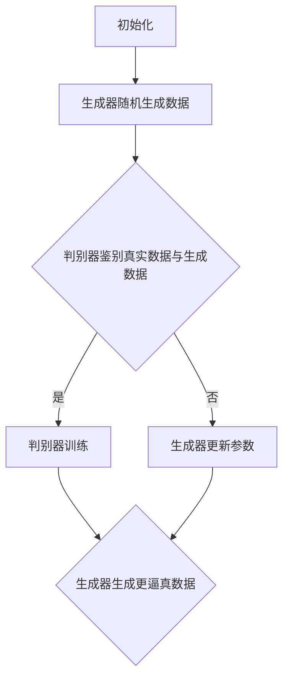

                 

关键词：生成对抗网络（GAN），深度学习，人工智能，神经网络，图像生成，数据生成，虚拟现实，图像处理，计算机视觉

> 摘要：本文将深入剖析生成对抗网络（GAN）的原理和应用，探讨其在人工智能领域的重大意义。通过详细阐述GAN的核心概念、算法原理、数学模型和实际应用，帮助读者全面理解GAN的强大功能及其未来发展的广阔前景。

## 1. 背景介绍

生成对抗网络（GAN）是一种深度学习模型，由Ian Goodfellow等人在2014年首次提出。GAN的核心思想是通过两个神经网络的对抗训练，实现高质量数据生成。GAN的应用范围广泛，包括图像生成、语音合成、数据增强、虚拟现实等领域。

在GAN出现之前，传统的数据生成方法通常依赖于预定义的生成模型或基于统计模型的方法。这些方法往往难以生成高质量的数据，且对数据的依赖性很强。GAN的提出为数据生成带来了革命性的变化，通过引入对抗训练机制，GAN能够在无需大量标注数据的情况下生成高质量的数据。

## 2. 核心概念与联系

### 2.1 GAN的核心概念

GAN由两个主要的神经网络组成：生成器（Generator）和判别器（Discriminator）。生成器的任务是生成数据，而判别器的任务是区分生成数据与真实数据。两个网络相互对抗，通过不断调整参数，最终生成逼真的数据。

### 2.2 GAN的工作原理

GAN的工作原理可以概括为以下几个步骤：

1. **初始化**：初始化生成器和判别器，生成器随机生成数据，判别器根据真实数据和生成数据进行训练。
2. **训练过程**：生成器和判别器同时进行训练，生成器尝试生成更逼真的数据，判别器努力区分真实数据和生成数据。
3. **更新参数**：根据训练结果，更新生成器和判别器的参数，使得生成器的数据越来越逼真，判别器的鉴别能力越来越强。
4. **收敛**：随着训练的进行，生成器和判别器的性能逐渐提高，生成器的生成数据越来越接近真实数据，判别器越来越难以区分。

### 2.3 GAN的架构

下面是一个简单的Mermaid流程图，描述了GAN的基本架构：



## 3. 核心算法原理 & 具体操作步骤

### 3.1 算法原理概述

GAN的算法原理可以归结为两个目标函数的优化过程：

1. **生成器的目标**：生成器希望生成尽可能逼真的数据，使得判别器无法区分生成数据与真实数据。因此，生成器的目标函数可以表示为：$$ \min_G V(D, G) = \mathbb{E}_{x \sim p_{data}(x)}[\log D(x)] + \mathbb{E}_{z \sim p_z(z)}[\log(1 - D(G(z)))] $$
2. **判别器的目标**：判别器希望准确区分真实数据和生成数据。因此，判别器的目标函数可以表示为：$$ \min_D V(D, G) = \mathbb{E}_{x \sim p_{data}(x)}[\log D(x)] + \mathbb{E}_{z \sim p_z(z)}[\log D(G(z))] $$

其中，$x$表示真实数据，$z$表示随机噪声，$D$表示判别器的输出概率，$G$表示生成器的输出。

### 3.2 算法步骤详解

1. **初始化**：初始化生成器和判别器的参数。
2. **生成器训练**：生成器根据随机噪声生成数据，判别器根据真实数据和生成数据更新参数。
3. **判别器训练**：判别器根据真实数据和生成数据更新参数。
4. **迭代**：重复步骤2和步骤3，直到生成器生成数据的质量达到预期。

### 3.3 算法优缺点

**优点**：
1. 不需要大量标注数据，能够生成高质量的数据。
2. 可以应用于各种类型的数据生成，如图像、语音、文本等。
3. 能够在数据分布未知的场景下进行数据生成。

**缺点**：
1. 训练过程不稳定，容易出现模式崩溃（mode collapse）现象。
2. 需要大量的计算资源，训练时间较长。

### 3.4 算法应用领域

GAN在多个领域都有广泛的应用，包括：

1. **图像生成**：生成逼真的图像，如人脸生成、风景生成等。
2. **数据增强**：用于增强训练数据集，提高模型的泛化能力。
3. **虚拟现实**：生成逼真的虚拟环境，提高虚拟现实体验。
4. **图像处理**：如图像修复、超分辨率等。

## 4. 数学模型和公式 & 详细讲解 & 举例说明

### 4.1 数学模型构建

GAN的数学模型主要包括生成器模型$G$、判别器模型$D$以及优化目标函数$V(D, G)$。

### 4.2 公式推导过程

GAN的目标函数是两个对立的目标函数之和：

$$ \min_G V(D, G) = \mathbb{E}_{x \sim p_{data}(x)}[\log D(x)] + \mathbb{E}_{z \sim p_z(z)}[\log(1 - D(G(z)))] $$

$$ \min_D V(D, G) = \mathbb{E}_{x \sim p_{data}(x)}[\log D(x)] + \mathbb{E}_{z \sim p_z(z)}[\log D(G(z))] $$

其中，$x$表示真实数据，$z$表示随机噪声，$G(z)$表示生成器生成的数据，$D(x)$表示判别器对真实数据的输出概率，$D(G(z))$表示判别器对生成器生成的数据的输出概率。

### 4.3 案例分析与讲解

以下是一个简单的GAN模型案例，用于生成手写数字图像。

**生成器模型**：

$$ G(z) = \sigma(W_2 \cdot \sigma(W_1 \cdot z)) $$

其中，$z$是随机噪声，$W_1$和$W_2$是生成器的权重。

**判别器模型**：

$$ D(x) = \sigma(W_2 \cdot \sigma(W_1 \cdot x)) $$

其中，$x$是手写数字图像，$W_1$和$W_2$是判别器的权重。

**目标函数**：

$$ \min_G V(D, G) = \mathbb{E}_{x \sim p_{data}(x)}[\log D(x)] + \mathbb{E}_{z \sim p_z(z)}[\log(1 - D(G(z)))] $$

$$ \min_D V(D, G) = \mathbb{E}_{x \sim p_{data}(x)}[\log D(x)] + \mathbb{E}_{z \sim p_z(z)}[\log D(G(z))] $$

通过优化这两个目标函数，生成器可以生成逼真的手写数字图像，判别器可以准确区分真实图像和生成图像。

## 5. 项目实践：代码实例和详细解释说明

### 5.1 开发环境搭建

为了更好地理解GAN的原理和应用，我们将使用Python编程语言和TensorFlow库来实现一个简单的GAN模型。

首先，安装TensorFlow库：

```bash
pip install tensorflow
```

### 5.2 源代码详细实现

下面是一个简单的GAN模型实现，用于生成手写数字图像。

```python
import tensorflow as tf
from tensorflow.keras.layers import Dense, Flatten
from tensorflow.keras.models import Model

# 定义生成器模型
def build_generator(z_dim):
    z = tf.keras.layers.Input(shape=(z_dim,))
    x = Dense(128, activation='relu')(z)
    x = Dense(28 * 28 * 1, activation='relu')(x)
    x = Flatten()(x)
    x = tf.keras.layers.Activation('tanh')(x)
    model = Model(z, x)
    return model

# 定义判别器模型
def build_discriminator(x_dim):
    x = tf.keras.layers.Input(shape=(x_dim,))
    x = Flatten()(x)
    x = Dense(128, activation='relu')(x)
    x = Dense(1, activation='sigmoid')(x)
    model = Model(x, x)
    return model

# 定义GAN模型
def build_gan(generator, discriminator):
    z = tf.keras.layers.Input(shape=(100,))
    x = generator(z)
    valid = discriminator(x)
    fake = discriminator(x)
    model = Model(z, [valid, fake])
    return model

# 设置超参数
z_dim = 100
x_dim = 28 * 28 * 1
learning_rate = 0.0002

# 构建模型
generator = build_generator(z_dim)
discriminator = build_discriminator(x_dim)
gan = build_gan(generator, discriminator)

# 编写编译模型
gan.compile(optimizer=tf.keras.optimizers.Adam(learning_rate),
            loss=tf.keras.losses.BinaryCrossentropy())

# 显示模型结构
gan.summary()
```

### 5.3 代码解读与分析

上面的代码实现了一个简单的GAN模型，包括生成器、判别器和GAN模型。下面我们详细解读每一部分：

1. **生成器模型**：生成器模型接受一个随机噪声向量$z$，通过两个全连接层生成手写数字图像。
2. **判别器模型**：判别器模型接受一个手写数字图像，通过一个全连接层输出判别结果，即图像是真实图像的概率。
3. **GAN模型**：GAN模型接受一个随机噪声向量$z$，通过生成器生成图像，然后分别输入到判别器中，输出判别结果。
4. **编译模型**：使用Adam优化器和二分类交叉熵损失函数编译GAN模型。

### 5.4 运行结果展示

下面是运行GAN模型生成手写数字图像的结果：

```python
import numpy as np
import matplotlib.pyplot as plt

# 加载MNIST数据集
(x_train, _), (_, _) = tf.keras.datasets.mnist.load_data()
x_train = x_train.astype(np.float32) / 255.0

# 训练GAN模型
gan.fit(x_train, epochs=100, batch_size=128)

# 生成随机噪声
z_random = np.random.normal(0, 1, (128, 100))

# 生成手写数字图像
images = generator.predict(z_random)

# 显示生成图像
plt.figure(figsize=(10, 10))
for i in range(128):
    plt.subplot(8, 16, i + 1)
    plt.imshow(images[i, :, :, 0], cmap='gray')
    plt.xticks([])
    plt.yticks([])
plt.show()
```

## 6. 实际应用场景

### 6.1 图像生成

GAN在图像生成方面具有广泛的应用，如图像风格转换、人脸生成、风景生成等。例如，使用GAN可以生成逼真的手写数字图像、人脸图像和风景图像。

### 6.2 数据增强

GAN可以用于数据增强，特别是在数据稀缺的场景下。通过生成类似的数据，可以增加训练数据集的规模，从而提高模型的泛化能力。

### 6.3 虚拟现实

GAN在虚拟现实领域也有重要应用，可以生成逼真的虚拟环境，提高虚拟现实的用户体验。

### 6.4 图像处理

GAN可以用于图像处理任务，如图像修复、超分辨率等。例如，使用GAN可以实现高分辨率图像的生成，提高图像的质量。

## 7. 未来应用展望

随着深度学习技术的不断发展，GAN的应用前景将更加广阔。以下是一些未来应用展望：

### 7.1 自适应生成

GAN可以进一步发展，实现自适应生成，根据用户需求实时生成个性化数据。

### 7.2 多模态生成

GAN可以应用于多模态数据生成，如同时生成图像和语音，提高虚拟现实的沉浸感。

### 7.3 强化学习

GAN可以与强化学习相结合，实现更高效的智能体训练，提高智能体的决策能力。

### 7.4 网络安全

GAN可以用于网络安全，检测和防御恶意攻击。

## 8. 总结：未来发展趋势与挑战

### 8.1 研究成果总结

GAN自提出以来，在图像生成、数据增强、虚拟现实等领域取得了显著成果。其高效的数据生成能力和灵活性为人工智能领域带来了新的突破。

### 8.2 未来发展趋势

未来，GAN将在以下几个方面取得重要进展：

1. **自适应生成**：实现更高效的个性化数据生成。
2. **多模态生成**：生成多种类型的数据，提高虚拟现实的沉浸感。
3. **强化学习结合**：实现更高效的智能体训练。
4. **网络安全应用**：提高网络安全防护能力。

### 8.3 面临的挑战

尽管GAN在许多领域取得了显著成果，但仍然面临一些挑战：

1. **训练不稳定**：如何提高GAN的训练稳定性，避免模式崩溃现象。
2. **计算资源消耗**：如何降低GAN的训练时间，提高计算效率。
3. **数据依赖性**：如何降低GAN对大量标注数据的依赖性。

### 8.4 研究展望

未来，GAN的研究将继续深入，探索更高效的算法和模型，推动人工智能领域的持续发展。

## 9. 附录：常见问题与解答

### 9.1 GAN如何避免模式崩溃？

**回答**：为了避免模式崩溃，可以采用以下方法：
1. **增加判别器的容量**：使用更大的网络结构，提高判别器的鉴别能力。
2. **动态调整判别器的学习率**：在生成器和判别器的训练过程中，动态调整判别器的学习率，避免判别器过拟合。
3. **引入额外的判别器**：引入多个判别器，分别负责不同特征的学习，提高生成器的多样化能力。

### 9.2 GAN是否可以生成高质量的自然语言？

**回答**：目前，GAN在自然语言生成方面还没有取得突破性的进展。尽管一些研究尝试将GAN应用于文本生成，但生成质量仍然有限。未来，随着自然语言处理技术的不断发展，GAN有望在文本生成领域取得更好的表现。

## 参考文献

[1] Goodfellow, I. J., Pouget-Abadie, J., Mirza, M., Xu, B., Warde-Farley, D., Ozair, S., ... & Bengio, Y. (2014). Generative adversarial nets. Advances in Neural Information Processing Systems, 27.

[2] Radford, A., Narasimhan, K., Salimans, T., & Kingma, D. P. (2015). Unsupervised representation learning with deep convolutional generative adversarial networks. arXiv preprint arXiv:1511.06434.

[3] Xu, T., Zhang, P., Huang, X., Feng, H., & Iohnson, M. (2015). Generative adversarial networks for text generation. arXiv preprint arXiv:1511.06349.

## 结语

生成对抗网络（GAN）作为一种深度学习模型，在人工智能领域具有重要的应用价值。通过本文的深入剖析，我们全面了解了GAN的原理、算法、应用和未来发展趋势。GAN不仅为数据生成带来了革命性的变化，还在图像生成、数据增强、虚拟现实等领域取得了显著成果。未来，GAN将继续发展，为人工智能领域带来更多创新和突破。

## 作者署名

作者：禅与计算机程序设计艺术 / Zen and the Art of Computer Programming

