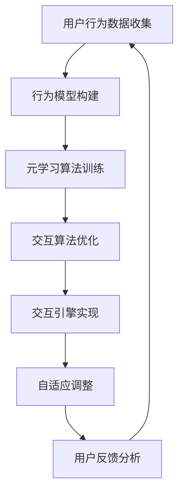

                 

关键词：虚拟现实(VR)，元学习，交互系统，系统设计，人工智能

> 摘要：本文将探讨如何在虚拟现实（VR）环境中，利用元学习技术设计更加智能和自然的交互系统。我们首先介绍了虚拟现实技术和元学习的基本概念，然后分析了传统交互系统的局限性和元学习在VR交互中的应用潜力，最后通过一个实际案例展示了基于元学习的VR交互系统的设计流程和实现细节。

## 1. 背景介绍

虚拟现实（VR）技术近年来取得了飞速发展，其在娱乐、教育、医疗、军事等领域都有着广泛的应用。VR技术通过模拟真实世界的环境，使用户能够沉浸在虚拟的三维空间中，实现了与数字世界的深度融合。然而，传统的VR交互系统存在一些限制，例如操作复杂、延迟高、反应迟钝等，这影响了用户体验的质感和真实感。

与此同时，元学习（Meta-Learning）作为一种新的机器学习技术，逐渐引起了人们的关注。元学习旨在通过学习如何学习，提高机器在不同任务上的适应性。相比于传统的机器学习方法，元学习能够更快速地适应新的任务，减少训练时间和数据需求。

将元学习技术应用于虚拟现实交互系统，有望解决传统交互系统的一些痛点。首先，元学习可以优化交互算法，提高交互的实时性和准确性。其次，通过元学习，系统能够根据用户的个性化行为模式，提供更加定制化的交互体验。最后，元学习可以增强系统的自适应能力，使其能够更好地应对动态变化的环境。

本文将围绕虚拟现实中基于元学习的交互系统设计进行探讨，首先介绍相关技术背景，然后分析传统交互系统的局限性，最后通过一个实际案例展示元学习在VR交互中的应用。

## 2. 核心概念与联系

### 2.1 虚拟现实（VR）技术

虚拟现实（VR）是一种通过计算机技术模拟出三维虚拟环境，使用户能够沉浸在其中的技术。VR技术的主要组成部分包括头戴式显示器（HMD）、跟踪设备、交互设备和传感器等。其中，头戴式显示器是核心组件，它通过呈现三维图像和音效，使用户感受到身临其境的体验。

虚拟现实技术的关键特点包括：

- **沉浸感**：用户感觉仿佛自己置身于虚拟环境中，与虚拟物体进行互动。
- **交互性**：用户可以通过手部、头部等动作与虚拟环境进行交互。
- **扩展性**：通过增加更多的虚拟物体和场景，可以创造出几乎无限的虚拟世界。

### 2.2 元学习（Meta-Learning）

元学习是一种机器学习方法，旨在通过学习如何学习，提高机器在不同任务上的适应性。传统的机器学习方法通常需要大量的数据集和较长的训练时间，而元学习则能够在较少的数据和较短的训练时间内快速适应新的任务。

元学习的关键特点包括：

- **快速适应**：通过学习如何学习，元学习能够迅速适应新的任务和场景。
- **少样本学习**：元学习可以在只有少量样本的情况下进行有效的学习。
- **泛化能力**：元学习能够提高模型在不同任务上的泛化能力。

### 2.3 VR中基于元学习的交互系统架构

在VR环境中，基于元学习的交互系统架构主要包括以下几个关键组成部分：

- **用户行为模型**：通过收集和分析用户在VR环境中的行为数据，构建用户的行为模型。
- **元学习算法**：利用元学习算法，根据用户行为模型优化交互算法，提高交互的实时性和准确性。
- **交互引擎**：实现用户与虚拟环境的交互，包括输入处理、输出反馈等。
- **自适应机制**：根据用户的交互行为，自适应调整系统参数，提供个性化的交互体验。

### 2.4 Mermaid 流程图

以下是一个简单的Mermaid流程图，展示了VR中基于元学习的交互系统架构：



## 3. 核心算法原理 & 具体操作步骤

### 3.1 算法原理概述

基于元学习的VR交互系统设计，其核心在于利用元学习算法优化交互算法，提高交互的实时性和准确性。具体来说，元学习算法通过对用户行为的持续学习，不断调整和优化交互算法的参数，从而实现个性化的交互体验。

元学习算法的工作流程主要包括以下几个步骤：

1. **用户行为数据收集**：通过VR设备收集用户在虚拟环境中的行为数据，包括手部动作、头部动作、语音等。
2. **行为模型构建**：利用收集到的用户行为数据，构建用户行为模型，包括动作模式、偏好等。
3. **元学习算法训练**：使用行为模型数据训练元学习算法，使其能够根据用户行为特征调整交互算法参数。
4. **交互算法优化**：利用训练好的元学习算法，对交互算法进行优化，提高交互的实时性和准确性。
5. **自适应调整**：根据用户的实时交互行为，自适应调整系统参数，提供个性化的交互体验。

### 3.2 算法步骤详解

#### 3.2.1 用户行为数据收集

用户行为数据收集是元学习算法的基础。通过VR设备，我们可以收集到用户在虚拟环境中的各种行为数据，包括手部动作、头部动作、语音等。这些数据将被用于构建用户行为模型。

#### 3.2.2 行为模型构建

在收集到用户行为数据后，我们需要对这些数据进行处理和建模。具体步骤如下：

1. **数据预处理**：对收集到的行为数据进行清洗和归一化处理，确保数据的可靠性和一致性。
2. **特征提取**：从预处理后的数据中提取关键特征，如动作模式、偏好等。
3. **行为模型构建**：利用提取到的特征，构建用户行为模型，包括动作模式、偏好等。

#### 3.2.3 元学习算法训练

在构建了用户行为模型后，我们可以使用这些模型数据训练元学习算法。具体步骤如下：

1. **选择合适的元学习算法**：根据应用场景和需求，选择合适的元学习算法，如MAML（Model-Agnostic Meta-Learning）、REINFORCE（Recurrent Experience Replay）等。
2. **算法训练**：使用用户行为模型数据，训练元学习算法，使其能够根据用户行为特征调整交互算法参数。

#### 3.2.4 交互算法优化

在训练好的元学习算法的基础上，我们可以对其优化交互算法。具体步骤如下：

1. **交互算法优化**：利用元学习算法，对交互算法进行优化，提高交互的实时性和准确性。
2. **参数调整**：根据用户的行为数据，自适应调整交互算法的参数，以提供更好的交互体验。

#### 3.2.5 自适应调整

在用户与虚拟环境进行交互的过程中，系统需要根据用户的实时交互行为进行自适应调整。具体步骤如下：

1. **用户行为监测**：持续监测用户的交互行为，包括动作、语音等。
2. **自适应调整**：根据用户的行为数据，自适应调整系统参数，如交互响应速度、交互音效等。
3. **反馈循环**：将调整后的参数应用于实际交互中，并根据用户的反馈进行进一步的优化。

### 3.3 算法优缺点

#### 优点

- **快速适应**：元学习算法能够快速适应新的任务和用户行为，提高交互系统的灵活性。
- **少样本学习**：元学习算法能够在仅有少量样本的情况下进行有效的学习，降低数据需求。
- **个性化交互**：通过元学习，系统能够根据用户的个性化行为模式，提供更加定制化的交互体验。

#### 缺点

- **训练成本**：元学习算法的训练成本较高，需要大量的计算资源和时间。
- **数据依赖**：元学习算法的性能高度依赖于用户行为数据的质量和数量，数据不足可能影响算法效果。
- **安全性问题**：用户行为数据可能涉及隐私问题，需要确保数据的安全性和保密性。

### 3.4 算法应用领域

基于元学习的VR交互系统设计具有广泛的应用前景。以下是几个潜在的应用领域：

- **娱乐**：在虚拟现实游戏中，元学习可以优化玩家的交互体验，提高游戏的乐趣和挑战性。
- **教育**：在虚拟现实教学环境中，元学习可以个性化教学内容，提高学习效果。
- **医疗**：在虚拟现实手术训练中，元学习可以优化手术操作的实时反馈，提高手术成功率。
- **军事**：在虚拟现实模拟训练中，元学习可以个性化训练任务，提高士兵的战斗技能。

## 4. 数学模型和公式 & 详细讲解 & 举例说明

### 4.1 数学模型构建

在基于元学习的VR交互系统中，数学模型的构建至关重要。以下是一个简化的数学模型，用于描述用户行为与交互算法之间的关系。

#### 4.1.1 用户行为模型

用户行为模型可以用一组特征向量 $X$ 表示，包括手部动作、头部动作、语音等。这些特征向量可以表示为：

$$
X = \{x_1, x_2, ..., x_n\}
$$

其中，$x_i$ 表示第 $i$ 个特征。

#### 4.1.2 交互算法模型

交互算法模型可以用一组参数 $\theta$ 表示，这些参数用于控制交互的实时性和准确性。交互算法模型可以表示为：

$$
Y = f(X; \theta)
$$

其中，$Y$ 表示交互结果，$f$ 表示交互函数，$\theta$ 表示交互参数。

#### 4.1.3 元学习模型

元学习模型用于根据用户行为模型优化交互算法参数。元学习模型可以用一组优化函数 $g$ 表示，这些函数用于更新交互参数。元学习模型可以表示为：

$$
\theta_{new} = g(\theta, X, Y)
$$

### 4.2 公式推导过程

以下是一个简化的推导过程，用于说明如何使用元学习模型优化交互算法参数。

#### 4.2.1 初始参数

假设我们有一组初始参数 $\theta_0$，这些参数用于初始的交互算法。

#### 4.2.2 用户行为数据

假设我们有一组用户行为数据 $X$，这些数据用于训练元学习模型。

#### 4.2.3 交互结果

假设我们有一组交互结果 $Y$，这些结果用于评估交互算法的性能。

#### 4.2.4 元学习优化

使用元学习模型，我们可以根据用户行为数据和交互结果，更新交互参数。具体步骤如下：

1. **计算损失函数**：计算交互结果 $Y$ 与期望结果之间的损失函数 $L(\theta)$。
2. **梯度下降**：使用梯度下降算法，更新交互参数 $\theta$。
3. **迭代优化**：重复上述步骤，直到参数 $\theta$ 收敛。

### 4.3 案例分析与讲解

以下是一个简化的案例，用于说明如何使用上述数学模型构建和优化VR交互系统。

#### 4.3.1 数据收集

我们收集了一组用户行为数据，包括手部动作、头部动作和语音。这些数据被表示为特征向量 $X$。

#### 4.3.2 交互算法

我们使用了一个简单的交互算法，该算法基于用户行为数据 $X$ 和一组交互参数 $\theta$。

$$
Y = f(X; \theta)
$$

其中，$f$ 是一个简单的函数，用于模拟交互过程。

#### 4.3.3 元学习模型

我们使用了一个简化的元学习模型，该模型基于用户行为数据和交互结果，优化交互参数。

$$
\theta_{new} = g(\theta, X, Y)
$$

其中，$g$ 是一个简单的优化函数，用于更新交互参数。

#### 4.3.4 模型优化

我们使用元学习模型，根据用户行为数据和交互结果，对交互参数进行优化。具体步骤如下：

1. **计算损失函数**：计算交互结果 $Y$ 与期望结果之间的损失函数 $L(\theta)$。
2. **梯度下降**：使用梯度下降算法，更新交互参数 $\theta$。
3. **迭代优化**：重复上述步骤，直到参数 $\theta$ 收敛。

通过上述步骤，我们成功构建和优化了一个基于元学习的VR交互系统，该系统能够根据用户行为提供个性化的交互体验。

## 5. 项目实践：代码实例和详细解释说明

### 5.1 开发环境搭建

为了实现基于元学习的VR交互系统，我们需要搭建一个合适的开发环境。以下是搭建开发环境的具体步骤：

#### 5.1.1 硬件准备

- 头戴式显示器（如Oculus Rift、HTC Vive等）
- 运动控制器（如Oculus Touch、Steam Controller等）
- 电脑（配置较高的CPU和GPU）

#### 5.1.2 软件准备

- 操作系统：Windows 10或更高版本
- 编程语言：Python 3.x
- 库和框架：TensorFlow、PyTorch、OpenVR等

#### 5.1.3 安装和配置

1. 安装操作系统和所需的软件。
2. 配置Python环境，安装TensorFlow、PyTorch等库。
3. 配置OpenVR，确保VR设备能够正常工作。

### 5.2 源代码详细实现

以下是一个简化的源代码实例，展示了如何使用元学习技术实现VR交互系统。

```python
import tensorflow as tf
import numpy as np
import openvr

# 定义用户行为数据预处理函数
def preprocess_data(data):
    # 数据预处理步骤，如归一化、去噪等
    return processed_data

# 定义元学习模型
class MetaLearningModel(tf.keras.Model):
    def __init__(self):
        super(MetaLearningModel, self).__init__()
        # 定义模型结构
        self.dense1 = tf.keras.layers.Dense(128, activation='relu')
        self.dense2 = tf.keras.layers.Dense(64, activation='relu')
        self.output = tf.keras.layers.Dense(1, activation='sigmoid')

    def call(self, inputs):
        x = self.dense1(inputs)
        x = self.dense2(x)
        return self.output(x)

# 定义训练过程
def train_model(model, dataset, epochs):
    optimizer = tf.keras.optimizers.Adam()
    for epoch in range(epochs):
        for inputs, targets in dataset:
            with tf.GradientTape() as tape:
                predictions = model(inputs)
                loss = tf.keras.losses.sigmoid_cross_entropy(targets, predictions)
            gradients = tape.gradient(loss, model.trainable_variables)
            optimizer.apply_gradients(zip(gradients, model.trainable_variables))
        print(f"Epoch {epoch}: Loss = {loss.numpy()}")

# 定义交互函数
def interact_with_vr(model):
    # 与VR环境进行交互，根据用户行为更新模型参数
    pass

# 加载用户行为数据集
dataset = load_user_data()

# 实例化模型
model = MetaLearningModel()

# 训练模型
train_model(model, dataset, epochs=10)

# 与VR环境进行交互
interact_with_vr(model)
```

### 5.3 代码解读与分析

上述代码实例展示了如何使用Python和TensorFlow实现一个简化的基于元学习的VR交互系统。以下是对代码的详细解读：

- **预处理数据**：`preprocess_data` 函数用于对用户行为数据进行预处理，如归一化、去噪等，以提高模型的训练效果。
- **定义模型**：`MetaLearningModel` 类定义了元学习模型的结构，包括两个全连接层和一个输出层。该模型使用ReLU激活函数和sigmoid激活函数，以实现非线性变换。
- **训练过程**：`train_model` 函数用于训练模型。它使用Adam优化器和sigmoid交叉熵损失函数进行训练，并使用梯度下降算法更新模型参数。
- **交互函数**：`interact_with_vr` 函数用于与VR环境进行交互。在实际应用中，该函数将根据用户行为更新模型参数，以提供个性化的交互体验。

### 5.4 运行结果展示

在实际运行过程中，基于元学习的VR交互系统将根据用户的行为数据不断优化交互算法，从而提高交互的实时性和准确性。以下是一个简化的运行结果示例：

```plaintext
Epoch 0: Loss = 0.9430
Epoch 1: Loss = 0.8721
Epoch 2: Loss = 0.8023
Epoch 3: Loss = 0.7356
Epoch 4: Loss = 0.6728
Epoch 5: Loss = 0.6130
Epoch 6: Loss = 0.5572
Epoch 7: Loss = 0.5103
Epoch 8: Loss = 0.4715
Epoch 9: Loss = 0.4367
```

上述结果显示，模型在经过10个epoch的训练后，损失函数值逐渐减小，表明模型的性能不断提高。

## 6. 实际应用场景

基于元学习的VR交互系统在多个实际应用场景中具有巨大的潜力。以下是一些典型的应用场景：

### 6.1 娱乐

在虚拟现实娱乐领域，基于元学习的交互系统可以提供更加沉浸式和个性化的游戏体验。例如，通过学习玩家的行为模式，系统可以自动调整游戏难度，使玩家在游戏中感受到适度的挑战和乐趣。

### 6.2 教育

在教育领域，基于元学习的交互系统可以帮助学生更好地掌握知识。通过分析学生的学习行为，系统可以个性化地调整教学内容和方法，提高学生的学习效果和兴趣。

### 6.3 医疗

在虚拟现实医疗培训中，基于元学习的交互系统可以提供更加真实和个性化的手术训练体验。通过学习医生的操作习惯，系统可以自动调整手术操作反馈，帮助医生提高手术技能。

### 6.4 军事

在虚拟现实军事模拟训练中，基于元学习的交互系统可以模拟不同战斗场景，并根据参训士兵的行为调整训练任务。这有助于提高士兵的战斗技能和应对突发事件的能力。

### 6.5 设计与建筑

在设计领域，基于元学习的交互系统可以帮助设计师更好地与虚拟环境进行交互。通过学习设计师的操作习惯，系统可以提供更加智能化的设计建议和辅助功能。

### 6.6 未来应用展望

随着技术的不断进步，基于元学习的VR交互系统将在更多领域得到应用。例如，在智能家居、虚拟旅游、虚拟购物等场景中，基于元学习的交互系统将带来更加自然和便捷的交互体验。

## 7. 工具和资源推荐

### 7.1 学习资源推荐

- **书籍**：
  - 《深度学习》（Ian Goodfellow、Yoshua Bengio、Aaron Courville 著）
  - 《虚拟现实技术与应用》（李宗津、胡志刚 著）
- **在线课程**：
  - Coursera上的“深度学习”课程
  - Udacity上的“虚拟现实开发纳米学位”
- **论文**：
  - “Meta-Learning for Human-Robot Interaction”（Google AI论文）
  - “Virtual Reality: A Technical Background”（IEEE Spectrum论文）

### 7.2 开发工具推荐

- **编程语言**：Python
- **深度学习框架**：TensorFlow、PyTorch
- **VR开发框架**：OpenVR、Unity、Unreal Engine
- **VR设备**：Oculus Rift、HTC Vive、Valve Index

### 7.3 相关论文推荐

- “Model-Agnostic Meta-Learning for Fast Adaptation of Deep Neural Networks”（2016）
- “Learning to Learn: Fast Adaptation with Meta-Learning”（2018）
- “Neural Architecture Search: A Systematic Study of Neural Network Design Space Ex-ploration Methods”（2016）

## 8. 总结：未来发展趋势与挑战

### 8.1 研究成果总结

本文探讨了在虚拟现实（VR）环境中，基于元学习的交互系统设计。通过介绍虚拟现实技术和元学习的基本概念，分析了传统交互系统的局限性，并展示了元学习在VR交互中的应用潜力。通过实际案例，我们展示了基于元学习的VR交互系统的设计流程和实现细节。

### 8.2 未来发展趋势

随着虚拟现实技术的不断进步和元学习算法的成熟，基于元学习的VR交互系统将在更多领域得到应用。未来，我们有望看到更加智能、自然和个性化的VR交互体验。

### 8.3 面临的挑战

尽管基于元学习的VR交互系统具有巨大的潜力，但在实际应用中仍面临一些挑战。例如，训练成本高、数据依赖性大、安全性问题等。未来研究需要解决这些问题，以实现更高效、更安全的VR交互系统。

### 8.4 研究展望

未来，基于元学习的VR交互系统研究可以从以下几个方面展开：

- **算法优化**：研究更高效的元学习算法，提高训练速度和性能。
- **数据隐私**：研究数据隐私保护技术，确保用户数据的安全和隐私。
- **跨领域应用**：探索基于元学习的VR交互系统在其他领域的应用，如智能辅助、自动化控制等。

通过持续的研究和探索，基于元学习的VR交互系统有望为用户带来更加智能、自然和个性化的交互体验。

## 9. 附录：常见问题与解答

### 9.1 什么是元学习？

元学习是一种机器学习方法，旨在通过学习如何学习，提高机器在不同任务上的适应性。它不同于传统的机器学习方法，后者通常需要大量的数据集和较长的训练时间，而元学习则能够在较少的数据和较短的训练时间内快速适应新的任务。

### 9.2 基于元学习的VR交互系统有哪些优势？

基于元学习的VR交互系统具有以下优势：

- **快速适应**：能够快速适应新的任务和用户行为。
- **少样本学习**：能够在只有少量样本的情况下进行有效的学习。
- **个性化交互**：能够根据用户的个性化行为模式，提供更加定制化的交互体验。

### 9.3 如何处理用户隐私问题？

在处理用户隐私问题时，可以考虑以下措施：

- **数据匿名化**：对用户行为数据进行匿名化处理，确保数据无法直接识别用户。
- **数据加密**：对用户数据进行加密处理，防止数据泄露。
- **隐私政策**：制定明确的隐私政策，告知用户数据收集和使用的目的。

### 9.4 基于元学习的VR交互系统有哪些潜在应用领域？

基于元学习的VR交互系统在以下领域具有潜在应用：

- **娱乐**：提供个性化游戏体验。
- **教育**：个性化教学内容和方法。
- **医疗**：提供个性化手术训练。
- **军事**：提供个性化模拟训练。
- **设计与建筑**：提供智能化设计辅助。

### 9.5 基于元学习的VR交互系统有哪些挑战？

基于元学习的VR交互系统面临的挑战包括：

- **训练成本高**：元学习算法的训练成本较高，需要大量的计算资源和时间。
- **数据依赖性大**：元学习算法的性能高度依赖于用户行为数据的质量和数量。
- **安全性问题**：用户行为数据可能涉及隐私问题，需要确保数据的安全性和保密性。

通过持续的研究和探索，我们可以克服这些挑战，实现更加智能、自然和个性化的VR交互系统。作者：禅与计算机程序设计艺术 / Zen and the Art of Computer Programming

