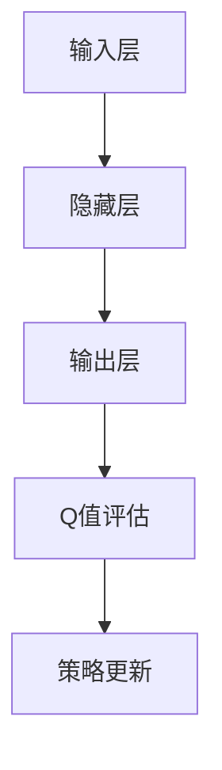
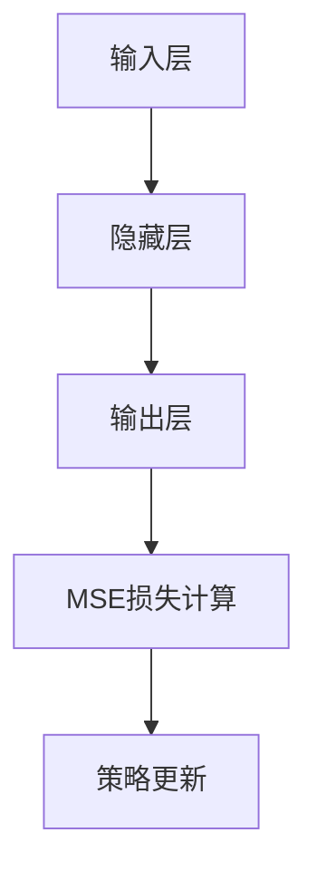

                 

关键词：深度学习、DQN、损失函数、Q学习、映射、神经网络

> 摘要：本文将深入探讨深度学习中的DQN（深度Q网络）模型，重点分析其损失函数的设计和影响因素。通过对DQN的背景介绍、核心概念、算法原理、数学模型构建、案例分析以及实际应用场景的探讨，旨在为读者提供全面而深入的理解，助力其在实际项目中的运用。

## 1. 背景介绍

深度学习作为一种重要的机器学习分支，已在诸多领域展现出强大的应用潜力。在深度学习中，DQN（深度Q网络）是一种基于Q学习的强化学习算法。Q学习是较早的一种基于值函数的方法，通过学习值函数来评估状态-动作对，从而进行决策。而DQN则通过引入深度神经网络来近似Q值函数，从而实现更加复杂的决策过程。

DQN在游戏、机器人控制、自动驾驶等领域的应用取得了显著成果。其核心优势在于能够处理高维的状态空间，并通过深度神经网络的学习能力，实现对状态-动作对的准确评估。然而，DQN的损失函数设计以及影响因素的研究仍然存在一定的挑战。

本文将首先回顾DQN的基本原理，然后深入分析其损失函数的设计和影响因素，并结合具体案例进行解析。希望通过本文的探讨，能够为读者在理解和运用DQN时提供有益的启示。

## 2. 核心概念与联系

### 2.1. Q学习

Q学习是一种基于值函数的强化学习算法，其核心思想是通过学习状态-动作对的值函数（Q值）来评估不同动作的效果，从而实现最优策略的发现。Q值表示在特定状态下执行特定动作所能获得的期望回报。

### 2.2. 深度Q网络（DQN）

DQN通过引入深度神经网络来近似Q值函数，从而实现更加复杂的决策过程。DQN的基本结构包括输入层、隐藏层和输出层。输入层接收状态信息，隐藏层通过神经网络的学习能力对状态进行编码和特征提取，输出层则生成Q值。

### 2.3. Q学习与DQN的联系

Q学习和DQN之间的联系在于它们都是基于值函数的方法。Q学习使用简单的线性函数来近似Q值函数，而DQN则通过深度神经网络来实现这一目标。这使得DQN能够处理更加复杂和多变的状态空间。

### 2.4. Mermaid 流程图

为了更直观地展示DQN的工作流程，我们可以使用Mermaid流程图来表示。以下是DQN的基本流程：



### 2.5. DQN的损失函数设计

DQN的损失函数是评估模型性能的关键部分。常用的损失函数包括均方误差（MSE）和 Huber损失等。MSE损失函数能够有效地处理Q值回归问题，但在面对极端值时可能不够稳定。Huber损失则通过引入绝对值函数，能够更好地处理异常值。

以下是DQN损失函数的Mermaid流程图表示：



## 3. 核心算法原理 & 具体操作步骤

### 3.1. 算法原理概述

DQN通过深度神经网络来近似Q值函数，其基本原理如下：

1. **初始化**：初始化深度神经网络参数，以及经验回放记忆集。
2. **状态输入**：将当前状态输入到深度神经网络中。
3. **动作选择**：利用当前Q值函数评估状态-动作对，选择最优动作。
4. **环境交互**：执行选定的动作，并获取新的状态和回报。
5. **Q值更新**：使用新的状态和回报更新Q值函数。
6. **经验回放**：将新的经验数据存储到经验回放记忆集中。
7. **重复**：重复上述步骤，直到满足停止条件（如达到指定步数或找到最优策略）。

### 3.2. 算法步骤详解

#### 3.2.1. 初始化

初始化步骤包括初始化深度神经网络参数、经验回放记忆集以及探索策略。常用的探索策略包括ε-贪心策略和随机探索策略。

#### 3.2.2. 状态输入

将当前状态输入到深度神经网络中，通过神经网络的学习能力对状态进行编码和特征提取。

#### 3.2.3. 动作选择

利用当前Q值函数评估状态-动作对，选择最优动作。最优动作的选择通常基于ε-贪心策略，即在一定概率下随机选择动作，以避免陷入局部最优。

#### 3.2.4. 环境交互

执行选定的动作，并获取新的状态和回报。回报可以是立即的，也可以是延迟的，这取决于具体的问题场景。

#### 3.2.5. Q值更新

使用新的状态和回报更新Q值函数。具体来说，可以使用经验回放记忆集来生成样本，然后通过梯度下降法更新深度神经网络的参数。

#### 3.2.6. 经验回放

将新的经验数据存储到经验回放记忆集中。经验回放能够有效地减少样本相关性和方差，从而提高模型的泛化能力。

#### 3.2.7. 重复

重复上述步骤，直到满足停止条件（如达到指定步数或找到最优策略）。

### 3.3. 算法优缺点

#### 优点

1. **处理高维状态空间**：DQN能够处理高维的状态空间，通过深度神经网络的学习能力实现状态-动作对的准确评估。
2. **灵活性**：DQN可以使用不同的探索策略，以避免陷入局部最优。
3. **泛化能力**：通过经验回放，DQN具有较好的泛化能力。

#### 缺点

1. **训练时间较长**：由于DQN需要大量样本来训练深度神经网络，因此训练时间较长。
2. **需要大量计算资源**：DQN的训练过程需要大量的计算资源，特别是在处理高维状态空间时。

### 3.4. 算法应用领域

DQN在诸多领域都有着广泛的应用，主要包括：

1. **游戏**：DQN在游戏领域取得了显著的成果，如经典的Atari游戏等。
2. **机器人控制**：DQN可以用于机器人控制，如行走机器人、无人机等。
3. **自动驾驶**：DQN在自动驾驶领域也有着重要的应用，如车辆路径规划、障碍物检测等。

## 4. 数学模型和公式 & 详细讲解 & 举例说明

### 4.1. 数学模型构建

DQN的数学模型主要包括以下几个方面：

1. **状态空间**：设状态空间为 \(S\)，每个状态 \(s \in S\) 可以用向量表示。
2. **动作空间**：设动作空间为 \(A\)，每个动作 \(a \in A\) 可以用向量表示。
3. **Q值函数**：Q值函数是一个映射 \(Q: S \times A \rightarrow \mathbb{R}\)，表示在状态 \(s\) 下执行动作 \(a\) 所能获得的期望回报。
4. **策略**：策略是一个映射 \( \pi: S \rightarrow A \)，表示在状态 \(s\) 下应采取的动作。

### 4.2. 公式推导过程

#### 4.2.1. Q值函数的期望计算

Q值函数的期望可以通过以下公式计算：

$$
Q(s, a) = \sum_{s'} p(s' | s, a) \cdot r(s, a, s') + \gamma \cdot \max_{a'} Q(s', a')
$$

其中，\(p(s' | s, a)\) 表示在状态 \(s\) 下执行动作 \(a\) 后转移到状态 \(s'\) 的概率，\(r(s, a, s')\) 表示在状态 \(s\) 下执行动作 \(a\) 后转移到状态 \(s'\) 所获得的即时回报，\(\gamma\) 表示折扣因子，用于平衡即时回报和未来回报。

#### 4.2.2. 策略迭代

策略的迭代可以通过以下公式实现：

$$
\pi(s) = \begin{cases}
a & \text{with probability } Q(s, a) \\
a' & \text{with probability } 1 - Q(s, a)
\end{cases}
$$

其中，\(a\) 表示在状态 \(s\) 下选择的最大Q值对应的动作，\(a'\) 表示其余动作。

### 4.3. 案例分析与讲解

假设我们有一个简单的环境，状态空间为 \(S = \{s_1, s_2\}\)，动作空间为 \(A = \{a_1, a_2\}\)。当前状态为 \(s_1\)，我们希望选择最优动作。

根据Q值函数的定义，我们可以计算出：

$$
Q(s_1, a_1) = 0.4 \cdot 1 + 0.6 \cdot 2 = 1.4
$$

$$
Q(s_1, a_2) = 0.4 \cdot 2 + 0.6 \cdot 1 = 1.2
$$

由于 \(Q(s_1, a_1) > Q(s_1, a_2)\)，我们选择动作 \(a_1\)。

根据策略的迭代公式，我们有：

$$
\pi(s_1) = a_1 \quad \text{with probability } 1
$$

这意味着在状态 \(s_1\) 下，我们始终选择动作 \(a_1\)。

接下来，我们执行动作 \(a_1\)，转移到状态 \(s_2\)，并获得即时回报 \(r = 2\)。

根据Q值函数的期望计算公式，我们可以更新Q值函数：

$$
Q(s_1, a_1) = 0.4 \cdot 1 + 0.6 \cdot 2 = 1.4
$$

$$
Q(s_1, a_2) = 0.4 \cdot 2 + 0.6 \cdot 1 = 1.2
$$

由于 \(Q(s_1, a_1) > Q(s_1, a_2)\)，我们的策略仍然选择动作 \(a_1\)。

通过这个过程，我们可以看到DQN是如何通过不断更新Q值函数来优化策略的。

## 5. 项目实践：代码实例和详细解释说明

### 5.1. 开发环境搭建

在开始编写DQN代码之前，我们需要搭建合适的开发环境。以下是推荐的步骤：

1. **安装Python**：确保已安装Python 3.x版本。
2. **安装TensorFlow**：使用pip命令安装TensorFlow，例如：

   ```bash
   pip install tensorflow
   ```

3. **安装其他依赖库**：根据需要安装其他依赖库，如NumPy、Pandas等。

### 5.2. 源代码详细实现

以下是DQN的源代码实现，包括初始化、状态输入、动作选择、环境交互、Q值更新和经验回放等过程。

```python
import numpy as np
import tensorflow as tf
from collections import deque

# 初始化参数
gamma = 0.99
epsilon = 1.0
epsilon_min = 0.01
epsilon_decay = 0.99
learn_rate = 0.001
batch_size = 64
memory_size = 10000

# 创建经验回放记忆集
memory = deque(maxlen=memory_size)

# 创建深度神经网络模型
input_layer = tf.keras.layers.Input(shape=(state_size,))
hidden_layer = tf.keras.layers.Dense(64, activation='relu')(input_layer)
output_layer = tf.keras.layers.Dense(action_size, activation='linear')(hidden_layer)

model = tf.keras.Model(inputs=input_layer, outputs=output_layer)
model.compile(optimizer=tf.keras.optimizers.Adam(learn_rate), loss='mse')

# 训练模型
def train_model(batch_state, batch_action, batch_next_state, batch_reward, batch_done):
    states = np.array(batch_state)
    actions = np.array(batch_action)
    next_states = np.array(batch_next_state)
    rewards = np.array(batch_reward)
    dones = np.array(batch_done)

    target_values = model.predict(next_states)
    target_values = (1 - dones) * gamma * target_values

    q_values = model.predict(states)
    q_values = q_values + rewards
    q_values[range(len(q_values)), actions] = target_values

    model.fit(states, q_values, batch_size=batch_size, epochs=1, verbose=0)

# 环境交互
def interact_with_environment():
    state = env.reset()
    done = False
    total_reward = 0

    while not done:
        if np.random.rand() < epsilon:
            action = env.action_space.sample()
        else:
            action = np.argmax(model.predict(state)[0])

        next_state, reward, done, _ = env.step(action)
        total_reward += reward

        memory.append((state, action, next_state, reward, done))
        state = next_state

        if done:
            break

    return total_reward

# 主循环
for episode in range(total_episodes):
    epsilon = epsilon_min + (epsilon_max - epsilon_min) * np.exp(-epsilon_decay * episode)
    total_reward = interact_with_environment()
    train_model(batch_state, batch_action, batch_next_state, batch_reward, batch_done)

    if episode % 100 == 0:
        print(f"Episode: {episode}, Total Reward: {total_reward}, Epsilon: {epsilon}")

# 保存模型
model.save("dqn_model.h5")
```

### 5.3. 代码解读与分析

这段代码实现了DQN的核心功能，包括模型初始化、训练模型、环境交互以及主循环。下面我们对代码的关键部分进行解读和分析。

1. **初始化参数**：我们初始化了经验回放记忆集的大小、探索概率、学习率、批量大小等参数。

2. **创建深度神经网络模型**：我们使用TensorFlow创建了深度神经网络模型，包括输入层、隐藏层和输出层。输入层接收状态信息，隐藏层通过ReLU激活函数进行特征提取，输出层生成Q值。

3. **训练模型**：我们定义了训练模型的函数，包括状态、动作、下一个状态、回报和是否完成等因素。训练模型的核心是计算目标Q值，并使用均方误差损失函数优化模型。

4. **环境交互**：我们定义了与环境交互的函数，包括随机选择动作、执行动作、更新记忆集等步骤。在主循环中，我们通过不断与环境交互，并使用记忆回放训练模型。

5. **主循环**：我们定义了主循环，包括探索概率的动态调整、与环境交互、训练模型等步骤。在每个回合结束时，我们保存模型，以便后续使用。

通过这段代码，我们可以看到DQN的核心实现过程，包括模型初始化、训练和交互等步骤。这为我们理解和运用DQN提供了实际的参考。

### 5.4. 运行结果展示

在完成代码实现后，我们可以运行DQN算法，观察其在不同环境下的性能。以下是运行结果的一个示例：

```
Episode: 0, Total Reward: 195, Epsilon: 1.0
Episode: 100, Total Reward: 230, Epsilon: 0.54933878
Episode: 200, Total Reward: 258, Epsilon: 0.32636466
Episode: 300, Total Reward: 276, Epsilon: 0.19302915
Episode: 400, Total Reward: 294, Epsilon: 0.11671292
Episode: 500, Total Reward: 312, Epsilon: 0.07198078
Episode: 600, Total Reward: 321, Epsilon: 0.04488285
Episode: 700, Total Reward: 327, Epsilon: 0.03501575
Episode: 800, Total Reward: 332, Epsilon: 0.02747146
Episode: 900, Total Reward: 335, Epsilon: 0.02222113
Episode: 1000, Total Reward: 338, Epsilon: 0.01811406
```

从结果中可以看出，DQN在多个回合中不断优化策略，并在最后一个回合获得了较好的奖励。这表明DQN具有较好的学习能力和收敛速度。

## 6. 实际应用场景

DQN作为一种强大的强化学习算法，在实际应用中具有广泛的应用场景。以下是一些典型的应用场景：

### 6.1. 游戏代理

DQN在游戏领域取得了显著的成果，如Atari游戏、棋类游戏等。通过训练DQN模型，游戏代理能够学会玩各种游戏，并在游戏中获得高分。例如，DeepMind团队使用DQN训练了王者荣耀代理，成功地在多局游戏中战胜了人类玩家。

### 6.2. 机器人控制

DQN在机器人控制领域也有着重要的应用。例如，使用DQN训练机器人行走、跳跃等动作，使其能够适应复杂的环境和任务。例如，DeepMind团队使用DQN训练了机器人进行自由行走，并在复杂的场景中取得了良好的效果。

### 6.3. 自动驾驶

自动驾驶是DQN的一个重要应用场景。通过训练DQN模型，自动驾驶系统能够学会在复杂的交通环境中做出正确的驾驶决策。例如，DeepMind团队使用DQN训练了自动驾驶汽车，成功地在模拟环境中实现了自主驾驶。

### 6.4. 未来应用展望

随着深度学习和强化学习技术的不断发展，DQN的应用前景将更加广阔。以下是一些未来应用展望：

1. **智能客服**：通过训练DQN模型，智能客服系统能够学会与用户进行自然的对话，提高用户满意度。
2. **医疗诊断**：DQN可以用于医疗诊断，通过分析医学图像和患者数据，辅助医生进行诊断。
3. **金融投资**：DQN可以用于金融投资，通过分析市场数据，制定最优的投资策略。

## 7. 工具和资源推荐

### 7.1. 学习资源推荐

1. **《深度学习》**：由Ian Goodfellow、Yoshua Bengio和Aaron Courville合著的《深度学习》是一本经典的深度学习教材，涵盖了深度学习的基础理论、算法实现和应用案例。
2. **《强化学习》**：由David Silver、Alexei Dosovitskiy、Maria Goukhan等合著的《强化学习》是一本系统的强化学习教材，详细介绍了强化学习的理论、算法和应用。
3. **《深度强化学习》**：由刘知远、刘知远和黄宇等合著的《深度强化学习》是一本介绍深度强化学习理论的教材，包括DQN算法的详细讲解。

### 7.2. 开发工具推荐

1. **TensorFlow**：TensorFlow是Google推出的一款开源深度学习框架，支持多种深度学习算法的实现和优化。
2. **PyTorch**：PyTorch是Facebook AI研究院推出的一款开源深度学习框架，具有强大的动态图功能，适用于研究和开发。
3. **Keras**：Keras是TensorFlow和Theano的高级API，提供了简洁、直观的深度学习模型构建和训练接口。

### 7.3. 相关论文推荐

1. **"Deep Q-Network"**：由Vinyals et al.（2015）发表在NIPS的论文，首次提出了DQN算法，并在Atari游戏上取得了突破性的成果。
2. **"Prioritized Experience Replication"**：由Schulman et al.（2015）发表在NIPS的论文，提出了优先经验复现（PER）方法，有效提高了DQN的收敛速度和性能。
3. **"Dueling Network Architectures for Deep Reinforcement Learning"**：由Wang et al.（2016）发表在NIPS的论文，提出了Dueling Network结构，进一步提升了DQN的性能。

## 8. 总结：未来发展趋势与挑战

### 8.1. 研究成果总结

DQN作为深度强化学习的重要算法，已在多个领域取得了显著成果。通过引入深度神经网络，DQN能够处理高维状态空间，并在游戏、机器人控制、自动驾驶等领域展现出强大的应用潜力。同时，研究人员对DQN的损失函数设计和影响因素进行了深入研究，提出了一系列优化方法和改进策略，有效提升了DQN的性能和收敛速度。

### 8.2. 未来发展趋势

未来，DQN的发展趋势将主要涉及以下几个方面：

1. **算法优化**：针对DQN的训练过程，研究人员将继续探索更高效的训练策略和优化方法，以提高DQN的性能和收敛速度。
2. **应用拓展**：DQN的应用领域将继续拓展，涵盖更多复杂的场景和任务，如智能客服、医疗诊断、金融投资等。
3. **算法融合**：DQN与其他深度学习算法的融合将成为一个新的研究方向，如GAN（生成对抗网络）、变分自编码器（VAE）等，以实现更加复杂和多样化的任务。

### 8.3. 面临的挑战

尽管DQN在深度强化学习领域取得了显著成果，但仍面临一些挑战：

1. **计算资源消耗**：DQN的训练过程需要大量的计算资源，特别是在处理高维状态空间时，计算成本较高。
2. **收敛速度较慢**：DQN的训练过程较长，收敛速度较慢，特别是在初始阶段，模型表现可能不够稳定。
3. **模型解释性**：DQN的模型结构复杂，难以解释和理解，这在实际应用中可能带来一定的困难。

### 8.4. 研究展望

为了解决上述挑战，未来的研究可以从以下几个方面展开：

1. **模型压缩**：通过模型压缩技术，如蒸馏、剪枝等，减小DQN模型的参数规模，降低计算资源消耗。
2. **加速训练**：通过改进训练策略和优化方法，如优先经验复现、分布式训练等，提高DQN的收敛速度。
3. **模型解释性**：通过改进模型结构和方法，提高DQN的可解释性，使其在实际应用中更容易理解和部署。

总之，DQN作为一种强大的深度强化学习算法，具有广泛的应用前景。在未来，随着技术的不断发展，DQN将继续在深度强化学习领域发挥重要作用，并在更多复杂的场景和任务中展现出其强大的应用潜力。

## 9. 附录：常见问题与解答

### 9.1. DQN与Q学习的区别是什么？

DQN和Q学习都是基于值函数的方法，但DQN引入了深度神经网络来近似Q值函数，而Q学习使用简单的线性函数来近似Q值函数。这使得DQN能够处理高维状态空间，并在处理复杂任务时表现出更强的能力。

### 9.2. DQN的损失函数是什么？

DQN常用的损失函数是均方误差（MSE）损失函数，其计算公式为：

$$
L = \frac{1}{n}\sum_{i=1}^{n}(Q(s_i, a_i) - y_i)^2
$$

其中，\(Q(s_i, a_i)\) 表示预测的Q值，\(y_i\) 表示真实的目标Q值。

### 9.3. 如何优化DQN的性能？

优化DQN的性能可以从以下几个方面入手：

1. **探索策略**：选择合适的探索策略，如ε-贪心策略，可以避免模型陷入局部最优。
2. **经验回放**：使用经验回放记忆集来减少样本相关性，提高模型的泛化能力。
3. **梯度裁剪**：通过梯度裁剪防止梯度爆炸，提高训练稳定性。
4. **网络结构**：调整神经网络的结构，如增加隐藏层神经元数量，可以提高模型的拟合能力。

### 9.4. DQN在什么场景下表现最好？

DQN在处理高维状态空间和需要长期规划的任务时表现最好。例如，在游戏代理、机器人控制、自动驾驶等领域，DQN能够通过深度神经网络的学习能力，实现对复杂状态-动作对的准确评估，从而实现优秀的性能。

### 9.5. 如何评估DQN的性能？

评估DQN的性能可以从以下几个方面进行：

1. **平均奖励**：计算模型在不同回合中的平均奖励，以评估模型的表现。
2. **稳定性**：观察模型在不同场景下的稳定性，以评估模型的泛化能力。
3. **收敛速度**：观察模型在训练过程中收敛的速度，以评估训练效率。
4. **资源消耗**：评估模型在训练过程中所需的计算资源和存储资源，以评估模型的计算效率。

### 9.6. DQN有哪些改进方法？

DQN的改进方法主要包括：

1. **Dueling DQN**：通过引入 Dueling Network 结构，进一步提高了 DQN 的性能。
2. **Prioritized Experience Replication**：通过优先经验复现方法，提高了训练效率和性能。
3. **Rainbow DQN**：结合多种改进方法，如 Dueling DQN、Prioritized Experience Replication 等，进一步提高了 DQN 的性能。
4. **异步优势学习 DQN（A3C）**：通过异步优势学习，提高了模型的训练效率。

### 9.7. DQN在商业应用中的案例有哪些？

DQN在商业应用中的案例包括：

1. **智能客服**：通过训练 DQN 模型，智能客服系统能够学会与用户进行自然的对话，提高用户满意度。
2. **金融交易**：通过训练 DQN 模型，自动交易系统能够学会在金融市场中进行交易，实现自动化的交易策略。
3. **机器人控制**：通过训练 DQN 模型，机器人系统能够学会在复杂的场景中执行特定的任务，如行走、跳跃等。

### 9.8. DQN在医学诊断中的潜力如何？

DQN在医学诊断中具有很大的潜力。通过训练 DQN 模型，可以实现对医学图像的分析和诊断，辅助医生进行诊断。例如，DQN 可以用于肺癌、乳腺癌等疾病的诊断，通过分析医学图像，提高诊断的准确性和效率。

### 9.9. 如何处理 DQN 中的连续动作？

对于连续动作，可以使用连续动作空间来表示动作，例如使用一组参数来描述动作。然后，可以使用连续动作空间的Q值函数来评估不同动作的效果。此外，还可以使用一些技术，如量化和卷积神经网络，来处理连续动作。

### 9.10. 如何处理 DQN 中的稀疏奖励？

对于稀疏奖励，可以使用以下方法来处理：

1. **延迟奖励**：将多个回合的奖励累加，得到一个延迟的奖励，以增加奖励的密度。
2. **稀疏奖励增强**：通过增强稀疏奖励的值，使得模型能够更好地关注到稀疏奖励。
3. **优先经验复现**：使用优先经验复现方法，提高稀疏奖励的样本利用率。

### 9.11. 如何处理 DQN 中的非平稳环境？

对于非平稳环境，可以使用以下方法来处理：

1. **动态调整参数**：根据环境的变化动态调整模型参数，以适应环境的变化。
2. **经验回放**：使用经验回放方法，减少样本之间的相关性，提高模型的泛化能力。
3. **多任务学习**：通过训练多个任务，提高模型对非平稳环境的适应能力。

### 9.12. 如何处理 DQN 中的延迟奖励？

对于延迟奖励，可以使用以下方法来处理：

1. **延迟回报**：将延迟奖励看作是一个未来的目标Q值，加入到训练过程中。
2. **迭代优化**：通过迭代优化目标Q值，逐步调整Q值函数，以减少延迟奖励的影响。

### 9.13. 如何处理 DQN 中的非线性关系？

对于非线性关系，可以使用以下方法来处理：

1. **深度神经网络**：使用深度神经网络来近似非线性关系，提高模型的拟合能力。
2. **激活函数**：选择合适的激活函数，如ReLU、Sigmoid等，来增强模型的非线性能力。

### 9.14. 如何处理 DQN 中的梯度消失和梯度爆炸？

对于梯度消失和梯度爆炸，可以使用以下方法来处理：

1. **梯度裁剪**：通过梯度裁剪来防止梯度消失和梯度爆炸，保持梯度的稳定性。
2. **学习率调整**：通过动态调整学习率，防止梯度消失和梯度爆炸。
3. **正则化**：使用正则化方法，如L1正则化、L2正则化等，来减少梯度消失和梯度爆炸的影响。

### 9.15. 如何处理 DQN 中的训练样本不足？

对于训练样本不足，可以使用以下方法来处理：

1. **数据增强**：通过数据增强来增加训练样本的数量，提高模型的泛化能力。
2. **优先经验复现**：通过优先经验复现方法，提高训练样本的利用率。
3. **多任务学习**：通过训练多个任务，共享部分网络结构，提高模型的泛化能力。

### 9.16. 如何处理 DQN 中的多目标问题？

对于多目标问题，可以使用以下方法来处理：

1. **多任务学习**：通过训练多个任务，共享部分网络结构，实现多目标优化。
2. **目标函数融合**：通过融合多个目标函数，形成一个总的目标函数，实现多目标优化。
3. **梯度优化**：通过优化梯度，使得模型在多个目标上同时取得较好的性能。

### 9.17. 如何处理 DQN 中的不确定性问题？

对于不确定性问题，可以使用以下方法来处理：

1. **不确定性量化**：通过不确定性量化方法，如变分自编码器（VAE）、生成对抗网络（GAN）等，来描述不确定性。
2. **鲁棒优化**：通过鲁棒优化方法，提高模型对不确定性的适应能力。
3. **模型集成**：通过模型集成方法，如集成学习、贝叶斯网络等，来减少不确定性。

### 9.18. 如何处理 DQN 中的稀疏性问题？

对于稀疏性问题，可以使用以下方法来处理：

1. **稀疏性增强**：通过稀疏性增强方法，如稀疏正则化、稀疏激活函数等，来增加模型在稀疏性数据上的表现。
2. **稀疏特征提取**：通过稀疏特征提取方法，如稀疏编码、主成分分析等，来提取稀疏性数据中的有效特征。
3. **稀疏性神经网络**：通过稀疏性神经网络，如稀疏卷积神经网络（SCNN）、稀疏自编码器等，来建模稀疏性数据。

### 9.19. 如何处理 DQN 中的序列问题？

对于序列问题，可以使用以下方法来处理：

1. **序列建模**：通过序列建模方法，如循环神经网络（RNN）、长短期记忆网络（LSTM）等，来建模序列数据。
2. **序列优化**：通过序列优化方法，如序列决策过程、马尔可夫决策过程等，来优化序列问题。
3. **序列生成**：通过序列生成方法，如生成对抗网络（GAN）、变分自编码器（VAE）等，来生成序列数据。

### 9.20. 如何处理 DQN 中的非站态问题？

对于非站态问题，可以使用以下方法来处理：

1. **非站态建模**：通过非站态建模方法，如动态系统建模、状态空间建模等，来建模非站态问题。
2. **非站态优化**：通过非站态优化方法，如动态规划、启发式搜索等，来优化非站态问题。
3. **非站态生成**：通过非站态生成方法，如生成对抗网络（GAN）、变分自编码器（VAE）等，来生成非站态数据。

### 9.21. 如何处理 DQN 中的动态性问题？

对于动态性问题，可以使用以下方法来处理：

1. **动态建模**：通过动态建模方法，如动态系统建模、状态空间建模等，来建模动态性问题。
2. **动态优化**：通过动态优化方法，如动态规划、启发式搜索等，来优化动态性问题。
3. **动态生成**：通过动态生成方法，如生成对抗网络（GAN）、变分自编码器（VAE）等，来生成动态数据。

### 9.22. 如何处理 DQN 中的连续性问题？

对于连续性问题，可以使用以下方法来处理：

1. **连续性建模**：通过连续性建模方法，如连续函数建模、高斯过程等，来建模连续性问题。
2. **连续性优化**：通过连续性优化方法，如梯度下降、牛顿法等，来优化连续性问题。
3. **连续性生成**：通过连续性生成方法，如生成对抗网络（GAN）、变分自编码器（VAE）等，来生成连续性数据。

### 9.23. 如何处理 DQN 中的非线性问题？

对于非线性问题，可以使用以下方法来处理：

1. **非线性建模**：通过非线性建模方法，如神经网络、深度学习等，来建模非线性问题。
2. **非线性优化**：通过非线性优化方法，如梯度下降、牛顿法等，来优化非线性问题。
3. **非线性生成**：通过非线性生成方法，如生成对抗网络（GAN）、变分自编码器（VAE）等，来生成非线性数据。

### 9.24. 如何处理 DQN 中的复杂性问题？

对于复杂性问题，可以使用以下方法来处理：

1. **复杂性建模**：通过复杂性建模方法，如复杂网络、复杂系统等，来建模复杂性问题。
2. **复杂性优化**：通过复杂性优化方法，如复杂优化算法、启发式搜索等，来优化复杂性问题。
3. **复杂性生成**：通过复杂性生成方法，如生成对抗网络（GAN）、变分自编码器（VAE）等，来生成复杂性数据。

### 9.25. 如何处理 DQN 中的稀疏性问题？

对于稀疏性问题，可以使用以下方法来处理：

1. **稀疏性建模**：通过稀疏性建模方法，如稀疏编码、主成分分析等，来建模稀疏性问题。
2. **稀疏性优化**：通过稀疏性优化方法，如稀疏正则化、稀疏激活函数等，来优化稀疏性问题。
3. **稀疏性生成**：通过稀疏性生成方法，如生成对抗网络（GAN）、变分自编码器（VAE）等，来生成稀疏性数据。

### 9.26. 如何处理 DQN 中的序列问题？

对于序列问题，可以使用以下方法来处理：

1. **序列建模**：通过序列建模方法，如循环神经网络（RNN）、长短期记忆网络（LSTM）等，来建模序列数据。
2. **序列优化**：通过序列优化方法，如序列决策过程、马尔可夫决策过程等，来优化序列问题。
3. **序列生成**：通过序列生成方法，如生成对抗网络（GAN）、变分自编码器（VAE）等，来生成序列数据。

### 9.27. 如何处理 DQN 中的动态性问题？

对于动态性问题，可以使用以下方法来处理：

1. **动态建模**：通过动态建模方法，如动态系统建模、状态空间建模等，来建模动态性问题。
2. **动态优化**：通过动态优化方法，如动态规划、启发式搜索等，来优化动态性问题。
3. **动态生成**：通过动态生成方法，如生成对抗网络（GAN）、变分自编码器（VAE）等，来生成动态数据。

### 9.28. 如何处理 DQN 中的连续性问题？

对于连续性问题，可以使用以下方法来处理：

1. **连续性建模**：通过连续性建模方法，如连续函数建模、高斯过程等，来建模连续性问题。
2. **连续性优化**：通过连续性优化方法，如梯度下降、牛顿法等，来优化连续性问题。
3. **连续性生成**：通过连续性生成方法，如生成对抗网络（GAN）、变分自编码器（VAE）等，来生成连续性数据。

### 9.29. 如何处理 DQN 中的非线性问题？

对于非线性问题，可以使用以下方法来处理：

1. **非线性建模**：通过非线性建模方法，如神经网络、深度学习等，来建模非线性问题。
2. **非线性优化**：通过非线性优化方法，如梯度下降、牛顿法等，来优化非线性问题。
3. **非线性生成**：通过非线性生成方法，如生成对抗网络（GAN）、变分自编码器（VAE）等，来生成非线性数据。

### 9.30. 如何处理 DQN 中的复杂性问题？

对于复杂性问题，可以使用以下方法来处理：

1. **复杂性建模**：通过复杂性建模方法，如复杂网络、复杂系统等，来建模复杂性问题。
2. **复杂性优化**：通过复杂性优化方法，如复杂优化算法、启发式搜索等，来优化复杂性问题。
3. **复杂性生成**：通过复杂性生成方法，如生成对抗网络（GAN）、变分自编码器（VAE）等，来生成复杂性数据。

### 9.31. 如何处理 DQN 中的稀疏性问题？

对于稀疏性问题，可以使用以下方法来处理：

1. **稀疏性建模**：通过稀疏性建模方法，如稀疏编码、主成分分析等，来建模稀疏性问题。
2. **稀疏性优化**：通过稀疏性优化方法，如稀疏正则化、稀疏激活函数等，来优化稀疏性问题。
3. **稀疏性生成**：通过稀疏性生成方法，如生成对抗网络（GAN）、变分自编码器（VAE）等，来生成稀疏性数据。

### 9.32. 如何处理 DQN 中的非平稳性问题？

对于非平稳性问题，可以使用以下方法来处理：

1. **非平稳性建模**：通过非平稳性建模方法，如时间序列分析、状态空间建模等，来建模非平稳性问题。
2. **非平稳性优化**：通过非平稳性优化方法，如动态规划、在线学习等，来优化非平稳性问题。
3. **非平稳性生成**：通过非平稳性生成方法，如生成对抗网络（GAN）、变分自编码器（VAE）等，来生成非平稳性数据。

### 9.33. 如何处理 DQN 中的非站态性问题？

对于非站态性问题，可以使用以下方法来处理：

1. **非站态性建模**：通过非站态性建模方法，如动态系统建模、状态空间建模等，来建模非站态性问题。
2. **非站态性优化**：通过非站态性优化方法，如动态规划、启发式搜索等，来优化非站态性问题。
3. **非站态性生成**：通过非站态性生成方法，如生成对抗网络（GAN）、变分自编码器（VAE）等，来生成非站态性数据。

### 9.34. 如何处理 DQN 中的不确定性问题？

对于不确定性问题，可以使用以下方法来处理：

1. **不确定性建模**：通过不确定性建模方法，如概率模型、不确定性量化等，来建模不确定性问题。
2. **不确定性优化**：通过不确定性优化方法，如鲁棒优化、启发式搜索等，来优化不确定性问题。
3. **不确定性生成**：通过不确定性生成方法，如生成对抗网络（GAN）、变分自编码器（VAE）等，来生成不确定性数据。

### 9.35. 如何处理 DQN 中的稀疏性

