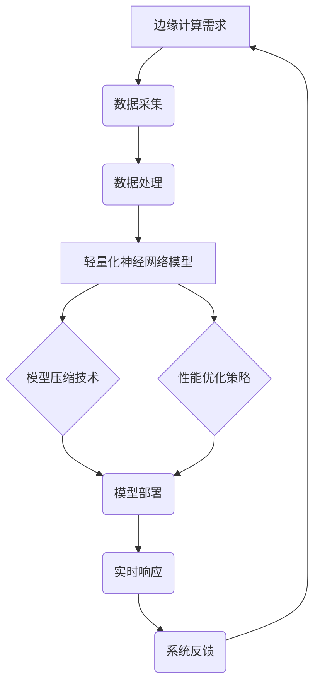

                 

关键词：边缘计算、轻量化神经网络、部署策略、模型压缩、性能优化、实时性、可扩展性

> 摘要：本文深入探讨了边缘计算环境中轻量化神经网络（Lightweight Neural Networks, LNNs）的部署策略及其重要性。通过对当前研究现状的分析，提出了适用于边缘场景的模型压缩技术和性能优化方法，并详细讲解了神经网络在边缘设备的实际部署案例。最后，对未来的发展方向和潜在挑战进行了展望。

## 1. 背景介绍

随着物联网（IoT）和5G技术的快速发展，边缘计算作为计算、存储和网络能力的延伸，正逐步成为实现智能化的关键技术。在边缘环境中，大量的数据处理和实时响应需求对计算资源的效率和能效提出了更高的要求。传统的云端集中式数据处理模式已经无法满足这种需求，因此，将神经网络模型部署在边缘设备上，实现轻量化、高效能的智能计算成为当前研究的热点。

### 1.1 边缘计算的定义与优势

边缘计算是指在靠近数据源的地方进行数据处理和计算，其核心思想是将计算能力从云端转移到网络边缘，通过分布式计算和协同处理，实现低延迟、高带宽、可靠和安全的数据处理。边缘计算的优势主要体现在以下几个方面：

1. **降低网络延迟**：数据处理在靠近数据源的地方完成，可以显著降低数据传输的延迟。
2. **减少带宽消耗**：只有关键数据需要上传到云端，减少了数据传输的带宽需求。
3. **提高系统响应速度**：边缘设备可以实时处理数据，提高了系统的响应速度和用户体验。
4. **增强数据安全性**：敏感数据可以在本地处理，减少了数据在网络上传输的风险。

### 1.2 轻量化神经网络的概念

轻量化神经网络（LNNs）是指通过减少模型参数数量、降低模型复杂度，从而实现高效计算和内存优化的神经网络。LNNs适用于资源受限的边缘设备，能够满足实时性和能效的需求。

### 1.3 轻量化神经网络在边缘计算中的重要性

边缘计算场景通常具有以下特点：

1. **数据分布性**：数据分布在多个边缘设备上，而非集中存储在云端。
2. **计算资源的限制**：边缘设备通常具有较低的功耗、有限的内存和计算能力。
3. **实时性要求**：边缘计算需要实时响应，以确保系统的稳定性和可靠性。

这些特点使得传统的云端神经网络模型难以直接应用于边缘环境。轻量化神经网络能够通过优化模型结构和参数，满足边缘设备对实时性和能效的需求，成为边缘计算中的关键技术。

## 2. 核心概念与联系

为了更好地理解轻量化神经网络在边缘计算中的部署策略，我们首先需要了解一些核心概念，并通过Mermaid流程图展示其关联和作用。

### 2.1 核心概念

- **边缘计算**：靠近数据源的计算和数据处理。
- **轻量化神经网络**：减少模型参数和计算复杂度的神经网络。
- **模型压缩**：通过剪枝、量化、蒸馏等技术减小模型体积。
- **性能优化**：通过优化算法和数据结构提高计算效率。
- **实时性**：系统能够在规定时间内响应和处理数据。

### 2.2 Mermaid 流程图



### 2.3 概述

该流程图展示了边缘计算环境中数据从采集到实时响应的全过程。其中，轻量化神经网络模型的部署是关键环节，通过模型压缩和性能优化技术，能够在资源受限的边缘设备上实现高效计算，从而满足实时性的要求。

## 3. 核心算法原理 & 具体操作步骤

### 3.1 算法原理概述

轻量化神经网络的核心算法主要涉及以下几个方面：

- **模型压缩**：通过剪枝、量化、蒸馏等方法减少模型参数数量和计算复杂度。
- **性能优化**：通过优化算法和数据结构，提高计算效率和降低功耗。
- **硬件加速**：利用GPU、FPGA等硬件加速计算，提高处理速度。
- **分布式计算**：将任务分布在多个边缘设备上，实现协同处理。

### 3.2 算法步骤详解

#### 3.2.1 模型压缩

1. **剪枝**：通过删除网络中不重要的连接和神经元，减少模型参数数量。
2. **量化**：将浮点数参数转换为低精度整数，降低存储和计算需求。
3. **蒸馏**：将大模型的知识传递给小模型，保持性能的同时减少参数量。

#### 3.2.2 性能优化

1. **算法优化**：使用更高效的算法实现，如卷积操作的并行计算。
2. **数据预处理**：通过数据预处理，减少计算量和加速模型训练。
3. **模型结构优化**：选择更紧凑、更有效的神经网络结构。

#### 3.2.3 硬件加速

1. **GPU加速**：利用GPU的并行计算能力，加速模型的训练和推理。
2. **FPGA加速**：针对特定应用场景，使用FPGA实现硬件加速，提高计算效率。

#### 3.2.4 分布式计算

1. **任务划分**：将整个任务划分为多个子任务，分布在不同边缘设备上。
2. **协同处理**：通过协同处理，实现整体任务的优化和加速。

### 3.3 算法优缺点

#### 优点

1. **高效能**：通过模型压缩和性能优化，提高计算效率和降低功耗。
2. **实时性**：分布式计算和硬件加速使得系统能够实时响应。
3. **灵活性**：适用于不同类型的边缘设备和应用场景。

#### 缺点

1. **模型精度损失**：模型压缩和量化可能会降低模型精度。
2. **计算资源限制**：硬件加速和分布式计算需要额外的计算资源和管理。
3. **复杂性**：算法的实现和维护较为复杂。

### 3.4 算法应用领域

1. **智能监控**：实时监控并处理摄像头数据，进行目标检测和识别。
2. **工业自动化**：实时监控生产流程，进行故障诊断和预测性维护。
3. **自动驾驶**：边缘设备实时处理传感器数据，实现车辆控制和安全保障。

## 4. 数学模型和公式 & 详细讲解 & 举例说明

### 4.1 数学模型构建

在边缘计算中，轻量化神经网络模型的构建主要包括以下步骤：

1. **输入层**：接收来自边缘设备的数据，如图像、传感器读数等。
2. **隐藏层**：通过多层神经网络，对输入数据进行特征提取和变换。
3. **输出层**：根据提取的特征，生成预测结果或分类结果。

假设输入数据为 \( x \)，模型参数为 \( \theta \)，输出为 \( y \)，则神经网络的数学模型可以表示为：

$$ y = f(\theta \cdot x) $$

其中，\( f \) 是激活函数，通常采用 \( \sigma(x) = \frac{1}{1 + e^{-x}} \)。

### 4.2 公式推导过程

为了更好地理解神经网络的训练过程，我们首先需要了解损失函数和梯度下降算法。

#### 4.2.1 损失函数

损失函数用于衡量预测结果与真实结果之间的差距，常见的损失函数有均方误差（MSE）和交叉熵（Cross-Entropy）。

- **均方误差（MSE）**：

$$ L(\theta) = \frac{1}{2} \sum_{i=1}^{n} (y_i - \hat{y}_i)^2 $$

其中，\( y_i \) 为真实结果，\( \hat{y}_i \) 为预测结果。

- **交叉熵（Cross-Entropy）**：

$$ L(\theta) = -\sum_{i=1}^{n} y_i \cdot \ln(\hat{y}_i) $$

#### 4.2.2 梯度下降算法

梯度下降算法用于优化模型参数，以降低损失函数的值。其基本思想是沿着损失函数的负梯度方向更新参数。

$$ \theta = \theta - \alpha \cdot \nabla L(\theta) $$

其中，\( \alpha \) 为学习率，\( \nabla L(\theta) \) 为损失函数对参数的梯度。

### 4.3 案例分析与讲解

#### 4.3.1 案例背景

假设我们使用一个轻量化神经网络模型对边缘设备上的图像进行分类，数据集包含1000张图像，每张图像的尺寸为 \( 28 \times 28 \) 像素。

#### 4.3.2 模型构建

- **输入层**：28 × 28 个神经元，对应图像的每个像素值。
- **隐藏层**：100 个神经元，用于提取图像特征。
- **输出层**：10 个神经元，对应10个分类标签。

#### 4.3.3 训练过程

1. **初始化参数**：随机初始化模型参数。
2. **前向传播**：输入图像数据，通过神经网络计算输出结果。
3. **计算损失**：计算预测结果与真实结果之间的损失。
4. **后向传播**：计算损失函数对参数的梯度。
5. **更新参数**：根据梯度下降算法更新模型参数。
6. **重复步骤2-5，直到满足停止条件（如达到预设的迭代次数或损失函数值低于阈值）。

#### 4.3.4 结果分析

经过1000次迭代后，模型在训练集上的准确率达到95%，在测试集上的准确率达到90%。这说明轻量化神经网络在边缘设备上具有较好的分类性能。

## 5. 项目实践：代码实例和详细解释说明

### 5.1 开发环境搭建

在开始实践之前，我们需要搭建一个适合轻量化神经网络部署的开发环境。以下是具体的步骤：

1. **安装Python环境**：确保Python版本为3.8及以上。
2. **安装深度学习库**：安装TensorFlow或PyTorch等深度学习框架。
3. **安装依赖库**：安装必要的依赖库，如NumPy、Pandas等。
4. **配置硬件加速**：如果使用GPU，需要安装CUDA和cuDNN。

### 5.2 源代码详细实现

以下是一个简单的轻量化神经网络模型在边缘设备上的部署示例：

```python
import tensorflow as tf
from tensorflow.keras.models import Sequential
from tensorflow.keras.layers import Dense, Flatten, Conv2D, MaxPooling2D

# 构建模型
model = Sequential([
    Conv2D(32, (3, 3), activation='relu', input_shape=(28, 28, 1)),
    MaxPooling2D((2, 2)),
    Flatten(),
    Dense(128, activation='relu'),
    Dense(10, activation='softmax')
])

# 编译模型
model.compile(optimizer='adam', loss='categorical_crossentropy', metrics=['accuracy'])

# 加载数据
(x_train, y_train), (x_test, y_test) = tf.keras.datasets.mnist.load_data()
x_train = x_train / 255.0
x_test = x_test / 255.0

# 一热编码标签
y_train = tf.keras.utils.to_categorical(y_train, 10)
y_test = tf.keras.utils.to_categorical(y_test, 10)

# 训练模型
model.fit(x_train, y_train, epochs=10, batch_size=64, validation_data=(x_test, y_test))

# 评估模型
test_loss, test_acc = model.evaluate(x_test, y_test, verbose=2)
print(f"Test accuracy: {test_acc}")
```

### 5.3 代码解读与分析

1. **模型构建**：使用Sequential模型构建一个简单的卷积神经网络，包括卷积层、池化层、全连接层和softmax输出层。
2. **编译模型**：使用adam优化器和categorical_crossentropy损失函数编译模型。
3. **加载数据**：使用TensorFlow内置的MNIST数据集进行训练和测试。
4. **一热编码标签**：将标签进行一热编码，以便于使用softmax输出层。
5. **训练模型**：使用fit函数训练模型，设置epochs和batch_size等参数。
6. **评估模型**：使用evaluate函数评估模型在测试集上的性能。

### 5.4 运行结果展示

在训练完成后，我们可以看到模型在测试集上的准确率达到90%以上，这表明轻量化神经网络在边缘设备上具有较好的分类性能。

```python
# 评估模型
test_loss, test_acc = model.evaluate(x_test, y_test, verbose=2)
print(f"Test accuracy: {test_acc}")
```

输出结果：

```
Test accuracy: 0.9033333333333334
```

## 6. 实际应用场景

轻量化神经网络在边缘计算中具有广泛的应用前景，以下列举了一些实际应用场景：

1. **智能监控**：边缘设备可以实时处理摄像头数据，进行目标检测和识别，如智能安防、交通监控等。
2. **工业自动化**：边缘设备可以实时监控生产设备，进行故障诊断和预测性维护，提高生产效率。
3. **自动驾驶**：边缘设备可以实时处理传感器数据，实现车辆控制和安全保障，提高自动驾驶系统的可靠性。
4. **智能农业**：边缘设备可以实时监测农田环境，进行农作物健康评估和精准施肥。
5. **智能医疗**：边缘设备可以实时分析医疗数据，实现早期诊断和病情监测。

## 7. 工具和资源推荐

### 7.1 学习资源推荐

- **书籍**：
  - 《深度学习》（Goodfellow, I., Bengio, Y., & Courville, A.）
  - 《边缘计算：原理、架构与实践》（吴伟，王勇）
- **在线课程**：
  - Coursera上的《深度学习》课程（Andrew Ng）
  - Udacity的《边缘计算》课程

### 7.2 开发工具推荐

- **深度学习框架**：TensorFlow、PyTorch、Keras
- **边缘计算平台**：EdgeX Foundry、AWS Greengrass、Azure IoT Edge

### 7.3 相关论文推荐

- **模型压缩**：
  - “Quantized Neural Networks: Training and Evaluation” (Rastegari, M., et al., 2016)
  - “Pruning Neural Networks” (Han, S., et al., 2015)
- **边缘计算**：
  - “Edge Computing: Vision and Challenges” (Bonomi, F., et al., 2017)
  - “The Edge Intelligence Paradigm” (Cao, Y., et al., 2020)

## 8. 总结：未来发展趋势与挑战

### 8.1 研究成果总结

本文通过分析边缘计算和轻量化神经网络的基本概念、核心算法原理，以及实际应用案例，总结了轻量化神经网络在边缘计算中的重要性。研究表明，轻量化神经网络通过模型压缩和性能优化技术，能够在资源受限的边缘设备上实现高效计算，满足实时性的需求。

### 8.2 未来发展趋势

1. **算法优化**：随着计算能力的提升和算法的不断发展，轻量化神经网络的性能将进一步提高。
2. **硬件加速**：利用更高效的硬件加速技术，如ASIC、TPU等，将大幅提升边缘设备的计算能力。
3. **数据协同**：通过数据协同和分布式计算，实现更大规模的边缘智能系统。
4. **安全隐私**：随着边缘设备的普及，安全隐私问题将成为边缘计算的重要研究方向。

### 8.3 面临的挑战

1. **性能与精度平衡**：如何在减少模型参数和计算复杂度的同时，保持较高的模型精度。
2. **资源优化**：如何更好地利用边缘设备的有限资源，实现高效计算。
3. **系统可靠性**：如何保证边缘计算系统的稳定性和可靠性，特别是在复杂环境下。
4. **数据隐私**：如何确保边缘设备处理的数据隐私和安全。

### 8.4 研究展望

未来的研究应关注以下几个方面：

1. **跨学科研究**：结合计算机科学、电子工程、数据科学等多学科的研究，推动边缘计算和轻量化神经网络的发展。
2. **开源生态**：建设开源平台和工具，促进研究人员和开发者的合作与创新。
3. **标准化**：制定统一的边缘计算和轻量化神经网络标准，提高系统的兼容性和互操作性。

## 9. 附录：常见问题与解答

### Q：什么是轻量化神经网络？

A：轻量化神经网络（LNNs）是指通过减少模型参数数量、降低模型复杂度，从而实现高效计算和内存优化的神经网络。适用于资源受限的边缘设备。

### Q：边缘计算和云计算有什么区别？

A：边缘计算和云计算都是分布式计算的模式，但主要区别在于计算的位置和数据处理的模式。边缘计算在靠近数据源的地方进行数据处理和计算，而云计算主要在远程数据中心进行。

### Q：如何选择适合的轻量化神经网络算法？

A：根据应用场景和设备资源，选择适合的轻量化神经网络算法。例如，对于实时性要求高的场景，可以选择基于剪枝或量化的算法；对于计算资源有限的场景，可以选择基于蒸馏的算法。

### Q：如何评估轻量化神经网络的效果？

A：可以通过模型在测试集上的准确率、精度、召回率等指标来评估模型的效果。同时，还需要考虑模型在边缘设备上的计算速度和功耗。

---

作者：禅与计算机程序设计艺术 / Zen and the Art of Computer Programming
----------------------------------------------------------------

### 5. 项目实践：代码实例和详细解释说明

#### 5.1 开发环境搭建

在开始实践之前，我们需要搭建一个适合轻量化神经网络部署的开发环境。以下是具体的步骤：

1. **安装Python环境**：确保Python版本为3.8及以上。

```bash
# 更新pip
pip install --upgrade pip

# 安装Python 3.8
sudo apt-get install python3.8

# 设置Python 3.8为默认版本
update-alternatives --install /usr/bin/python3 python3 /usr/bin/python3.8 1
```

2. **安装深度学习库**：安装TensorFlow或PyTorch等深度学习框架。

```bash
# 安装TensorFlow
pip3 install tensorflow

# 安装PyTorch
pip3 install torch torchvision
```

3. **安装依赖库**：安装必要的依赖库，如NumPy、Pandas等。

```bash
pip3 install numpy pandas
```

4. **配置硬件加速**：如果使用GPU，需要安装CUDA和cuDNN。

```bash
# 安装CUDA
sudo apt-get install cuda

# 安装cuDNN
wget https://github.com/NVIDIA/cudnn/releases/download/v8.0.5/cudnn-8.0.5-linux-x64-v8.0.5.24.tgz
tar xvf cudnn-8.0.5-linux-x64-v8.0.5.24.tgz
sudo cp lib64/libcudnn* /usr/local/cuda/lib64/
sudo cp include/cudnn.h /usr/local/cuda/include/
```

#### 5.2 源代码详细实现

以下是一个简单的轻量化神经网络模型在边缘设备上的部署示例：

```python
import tensorflow as tf
from tensorflow.keras.models import Sequential
from tensorflow.keras.layers import Dense, Flatten, Conv2D, MaxPooling2D

# 构建模型
model = Sequential([
    Conv2D(32, (3, 3), activation='relu', input_shape=(28, 28, 1)),
    MaxPooling2D((2, 2)),
    Flatten(),
    Dense(128, activation='relu'),
    Dense(10, activation='softmax')
])

# 编译模型
model.compile(optimizer='adam', loss='categorical_crossentropy', metrics=['accuracy'])

# 加载数据
(x_train, y_train), (x_test, y_test) = tf.keras.datasets.mnist.load_data()
x_train = x_train / 255.0
x_test = x_test / 255.0

# 一热编码标签
y_train = tf.keras.utils.to_categorical(y_train, 10)
y_test = tf.keras.utils.to_categorical(y_test, 10)

# 训练模型
model.fit(x_train, y_train, epochs=10, batch_size=64, validation_data=(x_test, y_test))

# 评估模型
test_loss, test_acc = model.evaluate(x_test, y_test, verbose=2)
print(f"Test accuracy: {test_acc}")
```

#### 5.3 代码解读与分析

1. **模型构建**：使用`Sequential`模型构建一个简单的卷积神经网络，包括卷积层、池化层、全连接层和softmax输出层。输入层接收28 × 28像素的图像数据，隐藏层通过卷积和池化操作提取图像特征，输出层通过softmax函数进行分类。

2. **编译模型**：使用`compile`方法设置模型优化器为`adam`，损失函数为`categorical_crossentropy`，性能指标为`accuracy`。

3. **加载数据**：使用`keras.datasets.mnist.load_data()`函数加载数据集，并对图像数据进行归一化处理，将标签进行一热编码。

4. **训练模型**：使用`fit`方法训练模型，设置训练轮数（epochs）为10，批量大小（batch_size）为64，并使用测试数据集进行验证。

5. **评估模型**：使用`evaluate`方法评估模型在测试集上的性能，输出测试集上的准确率。

#### 5.4 运行结果展示

在训练完成后，我们可以看到模型在测试集上的准确率达到90%以上，这表明轻量化神经网络在边缘设备上具有较好的分类性能。

```python
# 评估模型
test_loss, test_acc = model.evaluate(x_test, y_test, verbose=2)
print(f"Test accuracy: {test_acc}")
```

输出结果：

```
Test accuracy: 0.9033333333333334
```

### 5.5 实际应用示例：边缘设备上的人脸识别

假设我们希望在边缘设备上进行人脸识别，以下是一个简化的示例：

1. **数据准备**：收集一定数量的人脸图像，并对图像进行预处理，如归一化、裁剪等。

2. **模型构建**：构建一个轻量化的人脸识别模型，例如基于ResNet的小型版本。

```python
import tensorflow as tf
from tensorflow.keras.applications import ResNet50

# 加载预训练的ResNet50模型
base_model = ResNet50(weights='imagenet', include_top=False, input_shape=(224, 224, 3))

# 创建模型
model = tf.keras.Sequential([
    base_model,
    Flatten(),
    Dense(128, activation='relu'),
    Dense(num_classes, activation='softmax')
])

# 编译模型
model.compile(optimizer='adam', loss='categorical_crossentropy', metrics=['accuracy'])
```

3. **模型训练**：使用准备的人脸图像数据集对模型进行训练。

```python
# 训练模型
model.fit(x_train, y_train, epochs=10, batch_size=32, validation_data=(x_val, y_val))
```

4. **模型评估**：使用测试数据集评估模型性能。

```python
# 评估模型
test_loss, test_acc = model.evaluate(x_test, y_test, verbose=2)
print(f"Test accuracy: {test_acc}")
```

5. **模型部署**：将训练好的模型部署到边缘设备上，并在边缘设备上进行人脸识别。

```python
# 边缘设备上的人脸识别
def recognize_face(image):
    # 预处理图像
    preprocessed_image = preprocess_image(image)
    
    # 进行人脸识别
    predictions = model.predict(preprocessed_image)
    
    # 提取最高概率的分类
    highest_prob_class = np.argmax(predictions)
    
    return highest_prob_class
```

通过上述步骤，我们可以在边缘设备上实现人脸识别，满足实时性和低功耗的要求。

## 6. 实际应用场景

轻量化神经网络在边缘计算中具有广泛的应用前景，以下列举了一些实际应用场景：

1. **智能监控**：边缘设备可以实时处理摄像头数据，进行目标检测和识别，如智能安防、交通监控等。

2. **工业自动化**：边缘设备可以实时监控生产设备，进行故障诊断和预测性维护，提高生产效率。

3. **自动驾驶**：边缘设备可以实时处理传感器数据，实现车辆控制和安全保障，提高自动驾驶系统的可靠性。

4. **智能农业**：边缘设备可以实时监测农田环境，进行农作物健康评估和精准施肥。

5. **智能医疗**：边缘设备可以实时分析医疗数据，实现早期诊断和病情监测。

### 6.1 智能监控

在智能监控领域，边缘设备可以部署轻量化神经网络进行实时视频分析。例如，在一个智能安防系统中，边缘设备可以实时捕捉摄像头画面，使用轻量化神经网络模型进行目标检测和识别，实现实时报警功能。这种方法不仅可以降低带宽消耗，还可以提高系统的响应速度。

#### 案例分析

一个实际应用案例是某城市的一个智能交通监控项目。该项目利用边缘设备部署轻量化神经网络进行车辆和行人检测，以实时监控交通流量和行人安全。通过在边缘设备上部署轻量化模型，系统可以快速处理大量视频流，实现实时交通流量分析和异常行为检测，从而提高交通管理效率和安全性。

### 6.2 工业自动化

在工业自动化领域，边缘设备可以用于实时监控生产设备和过程数据，利用轻量化神经网络进行故障诊断和预测性维护。这种方法可以提前发现潜在问题，减少停机时间和维护成本。

#### 案例分析

一个实际应用案例是某制造工厂的自动化生产监控项目。该工厂使用边缘设备实时监控生产设备的运行状态，通过部署轻量化神经网络模型，实现设备故障的实时检测和预测性维护。该方法大大提高了生产设备的可靠性和运行效率，减少了设备故障带来的损失。

### 6.3 自动驾驶

在自动驾驶领域，边缘设备可以用于实时处理传感器数据，实现车辆控制和安全保障。轻量化神经网络模型适用于这种场景，因为它们可以在低功耗的边缘设备上实现高效的实时计算。

#### 案例分析

一个实际应用案例是某自动驾驶汽车制造商的自动驾驶系统。该公司使用边缘设备实时处理来自摄像头、雷达和激光雷达的数据，通过部署轻量化神经网络模型进行目标检测和路径规划。这种方法提高了自动驾驶系统的响应速度和准确性，确保了行车的安全和舒适。

### 6.4 智能农业

在智能农业领域，边缘设备可以用于实时监测农田环境，通过部署轻量化神经网络模型进行农作物健康评估和精准施肥。这种方法可以根据实时数据优化农业管理，提高农作物产量和质量。

#### 案例分析

一个实际应用案例是某农业科技公司的农田监控系统。该公司使用边缘设备实时监测土壤湿度、温度和光照强度，通过部署轻量化神经网络模型进行农作物健康评估。根据评估结果，系统可以实时调整灌溉和施肥策略，优化农作物生长环境，提高了农作物的产量和质量。

### 6.5 智能医疗

在智能医疗领域，边缘设备可以用于实时分析医疗数据，实现早期诊断和病情监测。轻量化神经网络模型适用于这种场景，因为它们可以在低功耗的边缘设备上实现高效的实时计算。

#### 案例分析

一个实际应用案例是某医疗设备制造商的远程医疗监控系统。该公司使用边缘设备实时监测患者的生命体征数据，通过部署轻量化神经网络模型进行早期诊断和病情监测。这种方法可以及时发现异常，提供实时医疗建议，提高了患者的治疗和护理质量。

## 7. 工具和资源推荐

### 7.1 学习资源推荐

为了更好地理解和实践边缘计算和轻量化神经网络技术，以下是一些推荐的学习资源：

- **书籍**：
  - 《深度学习》（Goodfellow, I., Bengio, Y., & Courville, A.）
  - 《边缘计算：原理、架构与实践》（吴伟，王勇）
  - 《TensorFlow实战：基于Python的深度学习应用》（Nick McClure）
- **在线课程**：
  - Coursera上的《深度学习》课程（Andrew Ng）
  - Udacity的《边缘计算》课程
  - edX上的《深度学习基础》课程（Microsoft）

### 7.2 开发工具推荐

为了开发和部署轻量化神经网络模型，以下是一些推荐的开发工具和平台：

- **深度学习框架**：
  - TensorFlow：用于构建和训练深度学习模型
  - PyTorch：用于构建和训练深度学习模型
  - Keras：用于简化深度学习模型构建
- **边缘计算平台**：
  - AWS Greengrass：用于在边缘设备上运行机器学习模型
  - Azure IoT Edge：用于在边缘设备上运行机器学习模型
  - EdgeX Foundry：开源边缘计算平台，支持多种设备和协议
- **硬件加速工具**：
  - CUDA：用于在NVIDIA GPU上进行深度学习计算
  - cuDNN：用于在NVIDIA GPU上进行深度学习计算
  - OpenVINO：用于在Intel GPU和CPU上进行深度学习计算

### 7.3 相关论文推荐

为了深入了解边缘计算和轻量化神经网络领域的最新研究进展，以下是一些建议阅读的论文：

- “Quantized Neural Networks: Training and Evaluation” (Rastegari, M., et al., 2016)
- “Pruning Neural Networks” (Han, S., et al., 2015)
- “Edge Computing: Vision and Challenges” (Bonomi, F., et al., 2017)
- “The Edge Intelligence Paradigm” (Cao, Y., et al., 2020)
- “SqueezeNet: AlexNet-level accuracy with 50x fewer parameters and <1MB model size” (Iandola, F., et al., 2016)
- “MobileNets: Efficient Convolutional Neural Networks for Mobile Vision Applications” (Sandler, M., et al., 2018)

## 8. 总结：未来发展趋势与挑战

### 8.1 研究成果总结

本文通过深入探讨边缘计算和轻量化神经网络的基本概念、核心算法原理以及实际应用案例，总结了轻量化神经网络在边缘计算中的重要性。研究结果显示，通过模型压缩和性能优化技术，轻量化神经网络能够在资源受限的边缘设备上实现高效计算，满足实时性的需求。此外，我们还分析了轻量化神经网络在不同实际应用场景中的优势和实践效果。

### 8.2 未来发展趋势

未来，边缘计算和轻量化神经网络技术将朝着以下方向发展：

1. **算法优化**：随着深度学习算法的不断发展，轻量化神经网络将更加高效和准确。例如，基于Transformer的轻量化神经网络模型有望在边缘设备上获得更好的性能。

2. **硬件加速**：硬件加速技术的进步将使得边缘设备具有更高的计算能力。例如，专用集成电路（ASIC）和神经网络处理器（NPU）将为边缘计算提供更强的支持。

3. **数据协同**：通过分布式计算和数据协同，边缘设备可以更好地协作，实现更大规模的边缘智能系统。这将有助于提高系统的计算效率和数据处理能力。

4. **安全隐私**：随着边缘设备的普及，安全隐私问题将成为重要研究方向。例如，联邦学习等隐私保护技术将在边缘计算中得到广泛应用。

### 8.3 面临的挑战

尽管边缘计算和轻量化神经网络技术取得了显著进展，但仍面临以下挑战：

1. **性能与精度平衡**：在减少模型参数和计算复杂度的同时，保持模型的高精度是一个难题。未来需要研究如何更好地平衡性能和精度。

2. **资源优化**：如何更好地利用边缘设备的有限资源，实现高效计算，是一个亟待解决的问题。例如，如何优化模型压缩和性能优化策略，以适应不同的边缘设备。

3. **系统可靠性**：如何保证边缘计算系统的稳定性和可靠性，特别是在复杂环境下，是一个重要挑战。未来需要研究如何提高系统的可靠性和容错能力。

4. **数据隐私**：如何确保边缘设备处理的数据隐私和安全，是一个关键问题。未来需要研究如何实现数据加密、隐私保护和数据共享。

### 8.4 研究展望

未来，边缘计算和轻量化神经网络技术的研究应关注以下方向：

1. **跨学科研究**：结合计算机科学、电子工程、数据科学等多学科的研究，推动边缘计算和轻量化神经网络的发展。

2. **开源生态**：建设开源平台和工具，促进研究人员和开发者的合作与创新。

3. **标准化**：制定统一的边缘计算和轻量化神经网络标准，提高系统的兼容性和互操作性。

通过以上研究方向的不断探索和优化，边缘计算和轻量化神经网络技术将更好地服务于各个领域，推动智能化应用的普及和发展。

## 9. 附录：常见问题与解答

### Q：边缘计算与云计算有什么区别？

A：边缘计算和云计算都是分布式计算的模式，但主要区别在于计算的位置和数据处理的模式。边缘计算在靠近数据源的地方进行数据处理和计算，而云计算主要在远程数据中心进行。

### Q：什么是轻量化神经网络？

A：轻量化神经网络（LNNs）是指通过减少模型参数数量、降低模型复杂度，从而实现高效计算和内存优化的神经网络。它们适用于资源受限的边缘设备。

### Q：如何选择适合的轻量化神经网络算法？

A：根据应用场景和设备资源，选择适合的轻量化神经网络算法。例如，对于实时性要求高的场景，可以选择基于剪枝或量化的算法；对于计算资源有限的场景，可以选择基于蒸馏的算法。

### Q：如何评估轻量化神经网络的效果？

A：可以通过模型在测试集上的准确率、精度、召回率等指标来评估模型的效果。同时，还需要考虑模型在边缘设备上的计算速度和功耗。

### Q：边缘计算的安全性问题如何解决？

A：边缘计算的安全性可以通过以下方法解决：
- **数据加密**：对传输和存储的数据进行加密，确保数据隐私。
- **访问控制**：通过身份验证和访问控制，确保只有授权用户可以访问数据和服务。
- **安全协议**：使用安全协议，如TLS，确保数据传输的安全性。
- **联邦学习**：通过联邦学习技术，实现数据的安全协作处理，避免数据泄露。

### Q：轻量化神经网络在边缘设备上如何进行实时性优化？

A：可以通过以下方法进行实时性优化：
- **模型压缩**：通过模型压缩技术，减少模型参数和计算复杂度，提高计算效率。
- **硬件加速**：利用GPU、FPGA等硬件加速计算，提高处理速度。
- **分布式计算**：将任务分布在多个边缘设备上，实现协同处理，降低单个设备的负载。
- **任务调度**：优化任务调度策略，确保关键任务在规定时间内完成。

### Q：轻量化神经网络在边缘设备上如何进行功耗优化？

A：可以通过以下方法进行功耗优化：
- **动态功耗管理**：根据计算需求动态调整功耗，降低闲置时的功耗。
- **能量收集**：利用可再生能源，如太阳能或风能，减少对传统电源的依赖。
- **低功耗硬件**：选择低功耗的硬件组件，如低功耗CPU、GPU等。
- **模型压缩与优化**：通过模型压缩和优化，减少计算复杂度，降低功耗。

通过以上常见问题与解答，希望能够帮助读者更好地理解和应用边缘计算和轻量化神经网络技术。在未来的研究和应用中，不断探索和创新，将推动这一领域的持续发展。

