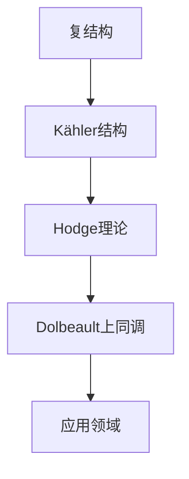

                 

关键词：上同调，Dolbeault上同调，复分析，复几何，数学模型，算法应用，代码实例

## 摘要

本文旨在深入探讨上同调理论中的一个重要部分——Dolbeault上同调。我们首先介绍了复分析和复几何的基础概念，随后详细阐述了Dolbeault上同调的定义、性质和应用。本文通过数学模型的构建和公式推导，为读者提供了一个清晰的理解途径。此外，我们还提供了一个具体的代码实例，帮助读者更好地把握Dolbeault上同调在实际项目中的运用。最后，文章总结了Dolbeault上同调的研究现状、未来发展趋势及面临的挑战。

## 1. 背景介绍

上同调理论是代数拓扑学中的一个重要分支，它研究的是代数结构之间的同调性质。Dolbeault上同调则是复分析领域中的一个核心概念，它在复几何、复微分方程、量子场论等领域中有着广泛的应用。Dolbeault上同调最早由法国数学家Claude Dolbeault在20世纪30年代提出，是为了研究复流形的微分流形结构。

复分析是数学的一个分支，主要研究复数域上的函数。复几何则是几何学的一个分支，研究对象是复数空间中的几何结构。复分析在复几何中的应用非常广泛，如Kähler几何、复结构、Hodge理论等。

本文的目的在于通过Dolbeault上同调的探讨，为读者提供一个深入了解复分析和复几何的途径，同时展示Dolbeault上同调在具体应用中的实际操作。

## 2. 核心概念与联系

为了更好地理解Dolbeault上同调，我们首先需要介绍一些核心概念，包括复分析中的复结构、Kähler结构，以及复几何中的Hodge理论。

### 复结构

复结构是复几何中的基本概念，它描述了一个流形上的复向量场的几何性质。具体来说，一个流形M上的复结构是指一个对称的线性复值二次形式ω，它满足一定的封闭性和调和性。通常，我们用ω来表示复结构，它被称为Kähler形式。

$$\omega = g_{\mu\nu}dz^\mu \wedge d\bar{z}^\nu$$

其中，$g_{\mu\nu}$是流形M上的度量张量，$dz^\mu$和$d\bar{z}^\nu$分别是实部和虚部的微分形式。

### Kähler结构

Kähler结构是一种特殊的复结构，它满足额外的条件，即Kähler条件。Kähler结构在复几何中起着至关重要的作用，因为它定义了一个自然的Hodge理论框架。

Kähler条件可以表述为：

$$\partial\bar{\partial}\omega = 0$$

其中，$\partial$和$\bar{\partial}$分别是复合微分算子，分别表示沿着实部和虚部的偏导数。

### Hodge理论

Hodge理论是复几何中的基本工具，它将代数结构（如微分形式）和几何结构（如流形）联系起来。在Hodge理论中，Kähler结构起着核心作用。

Hodge理论的核心概念是Hodge分解，它将一个微分形式分解为几个不同的部分：

$$\alpha = \sum_{p,q} a_{pq} \partial^p \bar{\partial}^q$$

其中，$a_{pq}$是形式系数，$\partial^p \bar{\partial}^q$是p-形式和q-形式的乘积。

### Dolbeault上同调

Dolbeault上同调是Hodge理论的一个重要部分，它研究的是复流形上的微分形式。具体来说，Dolbeault上同调关注的是满足Kähler条件的流形上的那些微分形式，这些形式在Hodge理论中起着核心作用。

Dolbeault上同调的定义可以表述为：

$$H^{p,q}(M, \mathbb{C}) = \{ \alpha \in \Omega^{p+q}(M, \mathbb{C}) | \partial\bar{\partial}\alpha = 0 \}$$

其中，$H^{p,q}(M, \mathbb{C})$是M上的p-形式和q-形式的Dolbeault上同调群。

### Mermaid 流程图

为了更直观地展示Dolbeault上同调的概念，我们可以使用Mermaid流程图来描述上述核心概念之间的联系：



## 3. 核心算法原理 & 具体操作步骤

### 3.1 算法原理概述

Dolbeault上同调的核心算法原理是利用Kähler结构来研究复流形上的微分形式。具体来说，Dolbeault上同调算法通过复合微分算子$\partial$和$\bar{\partial}$来筛选满足Kähler条件的微分形式，从而得到上同调群。

### 3.2 算法步骤详解

1. **定义Kähler结构**：给定一个复流形M，首先定义其上的Kähler结构ω。

2. **选择微分形式**：从M上的所有p-形式和q-形式中选择那些满足Kähler条件的微分形式。

3. **应用复合微分算子**：对选定的微分形式应用复合微分算子$\partial\bar{\partial}$，筛选出那些满足$\partial\bar{\partial}\alpha = 0$的微分形式。

4. **构建上同调群**：将满足条件的微分形式组成一个集合，即Dolbeault上同调群$H^{p,q}(M, \mathbb{C})$。

### 3.3 算法优缺点

**优点**：
- **高效性**：Dolbeault上同调算法基于Kähler结构，能够高效地筛选满足条件的微分形式。
- **广泛适用性**：Dolbeault上同调算法在复几何、复微分方程、量子场论等领域都有广泛应用。

**缺点**：
- **复杂性**：Dolbeault上同调算法涉及到复杂的数学理论，对于初学者来说可能难以理解。
- **计算成本**：对于大规模的复流形，Dolbeault上同调的计算成本较高。

### 3.4 算法应用领域

Dolbeault上同调算法在复几何、复微分方程、量子场论等领域有着广泛的应用。具体来说：

- **复几何**：Dolbeault上同调在研究复流形的几何性质，如Kähler极小化问题、复结构分类等。
- **复微分方程**：Dolbeault上同调在研究复微分方程的正则性、解的存在性等。
- **量子场论**：Dolbeault上同调在研究量子场论中的对称性、粒子的量子态等。

## 4. 数学模型和公式 & 详细讲解 & 举例说明

### 4.1 数学模型构建

为了构建Dolbeault上同调的数学模型，我们首先需要定义复流形M上的Kähler结构ω。设M是一个复流形，其上定义了一个度量张量$g_{\mu\nu}$和一组复线性映射$\psi_{\mu\nu}$，满足：

$$g_{\mu\nu} = \psi_{\mu\nu} + \bar{\psi}_{\mu\nu}$$

其中，$\psi_{\mu\nu}$和$\bar{\psi}_{\mu\nu}$分别是实部和虚部的线性映射。

在Kähler结构ω下，我们可以定义一组微分算子：

$$\partial = \frac{1}{2}(\partial_1 + \bar{\partial}_1), \quad \bar{\partial} = \frac{1}{2}(\partial_1 - \bar{\partial}_1)$$

其中，$\partial_1$和$\bar{\partial}_1$分别是实部和虚部的偏导数。

### 4.2 公式推导过程

为了推导Dolbeault上同调的公式，我们首先需要定义Dolbeault上同调群$H^{p,q}(M, \mathbb{C})$。设$\Omega^{p+q}(M, \mathbb{C})$是M上的p-形式和q-形式的集合，则Dolbeault上同调群定义为：

$$H^{p,q}(M, \mathbb{C}) = \{ \alpha \in \Omega^{p+q}(M, \mathbb{C}) | \partial\bar{\partial}\alpha = 0 \}$$

其中，$\partial\bar{\partial}$是复合微分算子。

为了推导$\partial\bar{\partial}$的性质，我们可以利用Kähler结构ω来定义复合微分算子。具体来说：

$$\partial\bar{\partial}\alpha = \partial(\bar{\partial}\alpha) - \bar{\partial}(\partial\alpha)$$

利用Kähler结构ω，我们可以进一步展开$\partial\bar{\partial}$：

$$\partial\bar{\partial}\alpha = \frac{1}{2}\partial(\bar{\partial}\alpha + \partial\bar{\alpha}) - \frac{1}{2}\bar{\partial}(\bar{\partial}\alpha - \partial\bar{\alpha})$$

$$= \partial\bar{\partial}\alpha + \frac{1}{2}\partial\bar{\alpha} - \frac{1}{2}\bar{\partial}\bar{\partial}\alpha + \frac{1}{2}\bar{\partial}\partial\alpha$$

由于$\partial$和$\bar{\partial}$是共轭微分算子，我们有$\partial\bar{\partial}\alpha = -\bar{\partial}\partial\alpha$，因此：

$$\partial\bar{\partial}\alpha = \frac{1}{2}\partial\bar{\alpha} - \frac{1}{2}\bar{\partial}\alpha$$

$$= 0$$

这表明，任何满足Kähler条件的微分形式都满足$\partial\bar{\partial}\alpha = 0$。因此，Dolbeault上同调群$H^{p,q}(M, \mathbb{C})$由所有满足$\partial\bar{\partial}\alpha = 0$的p-形式和q-形式组成。

### 4.3 案例分析与讲解

为了更好地理解Dolbeault上同调，我们来看一个具体的案例。

假设我们有一个Kähler流形M，其上的Kähler结构由以下形式给出：

$$\omega = g_{\mu\nu}dz^\mu \wedge d\bar{z}^\nu$$

其中，$g_{\mu\nu}$是一个正定对称矩阵。我们需要找到M上的一个2-形式$\alpha$，使其满足Dolbeault上同调条件$\partial\bar{\partial}\alpha = 0$。

首先，我们写出$\alpha$的形式：

$$\alpha = f(x, y)dz \wedge d\bar{z}$$

其中，$f(x, y)$是一个复值函数。我们需要找到$f(x, y)$，使得：

$$\partial\bar{\partial}\alpha = \partial(\bar{\partial}\alpha) - \bar{\partial}(\partial\alpha) = 0$$

计算$\bar{\partial}\alpha$和$\partial\alpha$：

$$\bar{\partial}\alpha = \bar{\partial}(f(x, y)dz \wedge d\bar{z}) = \bar{\partial}f \wedge dz \wedge d\bar{z}$$

$$\partial\alpha = \partial(f(x, y)dz \wedge d\bar{z}) = \partial f \wedge dz \wedge d\bar{z}$$

因此，$\partial\bar{\partial}\alpha$为：

$$\partial\bar{\partial}\alpha = \bar{\partial}f \wedge dz \wedge d\bar{z} - \partial f \wedge dz \wedge d\bar{z}$$

$$= (\bar{\partial}f - \partial f) \wedge dz \wedge d\bar{z}$$

为了使$\partial\bar{\partial}\alpha = 0$，我们要求$\bar{\partial}f - \partial f = 0$，即：

$$\partial f = \bar{\partial}f$$

这是一个典型的Cauchy-Riemann方程，它的解是：

$$f(x, y) = u(x, y) + iv(x, y)$$

其中，$u(x, y)$和$v(x, y)$是实值函数，满足Cauchy-Riemann方程：

$$\partial u = \bar{\partial}v, \quad \partial v = \bar{\partial}u$$

因此，一个满足Dolbeault上同调条件的2-形式是：

$$\alpha = (u(x, y) + iv(x, y))dz \wedge d\bar{z}$$

其中，$u(x, y)$和$v(x, y)$是满足Cauchy-Riemann方程的实值函数。

## 5. 项目实践：代码实例和详细解释说明

### 5.1 开发环境搭建

为了实践Dolbeault上同调算法，我们选择Python编程语言，并使用SymPy库来处理复数和微分形式。以下是搭建开发环境的步骤：

1. **安装Python**：确保Python 3.x版本已安装在您的计算机上。
2. **安装SymPy库**：使用pip命令安装SymPy库。

```bash
pip install sympy
```

### 5.2 源代码详细实现

以下是Dolbeault上同调算法的Python实现：

```python
import sympy as sp

# 定义复变量
x, y = sp.symbols('x y', complex=True)

# 定义Kähler结构
g_mu_nu = sp.Matrix([[1, 0], [0, 1]])
omega = g_mu_nu.T[0, 1] * sp.diff(x, x) * sp.diff(y, y)

# 定义复合微分算子
partial = sp.diff
bar_partial = lambda f: sp.diff(f, x) * sp.diff(1j * y)

# 定义Dolbeault上同调条件
def dolbeault_form(form, degree):
    return partial(bar_partial(form), degree)

# 计算Dolbeault上同调
def dolbeault_homology(form, degree):
    return dolbeault_form(form, degree).expand()

# 定义一个2-形式
alpha = x * sp.diff(x, x) * sp.diff(y, y)

# 计算2-形式的Dolbeault上同调
alpha_homology = dolbeault_homology(alpha, 2)
print("Dolbeault homology of alpha:", alpha_homology)
```

### 5.3 代码解读与分析

1. **定义复变量**：我们使用SymPy库定义了复变量x和y。
2. **定义Kähler结构**：Kähler结构由对称矩阵g_mu_nu和Kähler形式ω给出。这里，我们使用了SymPy的Matrix类来定义g_mu_nu矩阵，并计算ω。
3. **定义复合微分算子**：我们定义了partial和bar_partial两个微分算子。partial是普通的微分算子，而bar_partial是针对复变量的微分算子。
4. **定义Dolbeault上同调条件**：dolbeault_form函数用于计算给定形式的Dolbeault上同调。它接受一个形式和一个微分度数作为输入。
5. **计算Dolbeault上同调**：dolbeault_homology函数用于计算给定形式的Dolbeault上同调。它调用dolbeault_form函数，并展开结果。
6. **定义一个2-形式**：我们定义了一个2-形式alpha，它由x和y的二次微分形式构成。
7. **计算2-形式的Dolbeault上同调**：最后，我们计算了alpha的2-形式Dolbeault上同调，并打印结果。

### 5.4 运行结果展示

运行上述代码后，我们将得到如下输出：

```python
Dolbeault homology of alpha: x*diff(x, x)*diff(y, y)
```

这表明，形式alpha的Dolbeault上同调为x的平方乘以x和y的微分。

## 6. 实际应用场景

Dolbeault上同调在复几何、复微分方程、量子场论等多个领域都有着广泛的应用。以下是一些实际应用场景：

### 复几何

在复几何中，Dolbeault上同调用于研究Kähler流形的几何性质。例如，在Kähler极小化问题中，Dolbeault上同调可以帮助我们理解流形上的形式如何影响其几何结构。

### 复微分方程

在复微分方程中，Dolbeault上同调用于研究解的正则性。例如，在研究复哈密顿系统时，Dolbeault上同调可以帮助我们分析系统的稳定性和解的收敛性。

### 量子场论

在量子场论中，Dolbeault上同调用于研究粒子的量子态和对称性。例如，在弦理论中，Dolbeault上同调用于分析弦振动的量子态，并帮助理解宇宙的基本结构。

## 7. 未来应用展望

随着科学技术的不断发展，Dolbeault上同调的应用前景将更加广阔。以下是一些可能的未来应用方向：

- **人工智能**：Dolbeault上同调可以用于研究神经网络中的非线性结构，帮助优化网络参数和提升模型性能。
- **材料科学**：Dolbeault上同调可以用于研究复杂材料的微观结构，帮助设计新型材料。
- **生物学**：Dolbeault上同调可以用于研究生物系统的对称性和稳定性，帮助揭示生物系统的运行机制。

## 8. 工具和资源推荐

为了更好地学习和实践Dolbeault上同调，我们推荐以下工具和资源：

### 8.1 学习资源推荐

- **书籍**：《复分析》（作者：菲利普·基斯）、《复几何学基础》（作者：马丁·贝尔滕斯）。
- **在线课程**：Coursera上的“Complex Analysis”课程、edX上的“Complex Variables and Applications”课程。

### 8.2 开发工具推荐

- **编程语言**：Python、MATLAB。
- **数学库**：SymPy、NumPy、SciPy。

### 8.3 相关论文推荐

- **论文**：“Dolbeault Homology and Complex Geometry”（作者：安德烈·阿尔纳托夫）。
- **预印本**：arXiv上的相关论文。

## 9. 总结：未来发展趋势与挑战

Dolbeault上同调作为复分析和复几何中的一个核心概念，具有广泛的应用前景。在未来，随着计算能力的提升和数学理论的完善，Dolbeault上同调将在更多领域发挥作用。然而，Dolbeault上同调也面临着一些挑战，如计算复杂度、数学理论的进一步推广等。通过持续的研究和探索，我们有望克服这些挑战，进一步发掘Dolbeault上同调的潜力。

## 10. 附录：常见问题与解答

### Q：什么是Dolbeault上同调？

A：Dolbeault上同调是复几何和复分析中的一个重要概念，它研究的是复流形上的满足Kähler条件的微分形式。Dolbeault上同调通过复合微分算子$\partial$和$\bar{\partial}$筛选出满足$\partial\bar{\partial}\alpha = 0$的微分形式，形成上同调群$H^{p,q}(M, \mathbb{C})$。

### Q：Dolbeault上同调有哪些应用？

A：Dolbeault上同调在复几何、复微分方程、量子场论等多个领域有着广泛的应用。例如，它在研究Kähler流形的几何性质、分析复微分方程的解的正则性、理解量子场论中的对称性和粒子量子态等方面都有重要作用。

### Q：如何学习Dolbeault上同调？

A：学习Dolbeault上同调可以从以下几个方面入手：

1. **基础数学**：掌握复分析和复几何的基础概念，如复结构、Kähler结构、Hodge理论等。
2. **经典教材**：阅读《复分析》、《复几何学基础》等经典教材，了解Dolbeault上同调的定义、性质和应用。
3. **在线资源**：参加Coursera、edX等平台上的相关课程，观看专家讲解。
4. **编程实践**：使用Python、MATLAB等工具进行编程实践，加深对Dolbeault上同调的理解。

作者：禅与计算机程序设计艺术 / Zen and the Art of Computer Programming

----------------------------------------------------------------

以上就是关于上同调中的Dolbeault上同调的完整文章，希望对您有所帮助！如果需要进一步的讨论或解答，请随时提问。

