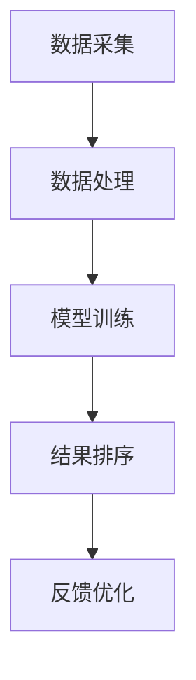

                 

关键词：个性化排序、AI算法、用户偏好、搜索结果排序

> 摘要：本文旨在探讨人工智能（AI）如何根据用户偏好对搜索结果进行个性化排序。通过对个性化排序的核心概念、算法原理、数学模型及实际应用进行深入分析，本文揭示了AI在提升用户体验和搜索效率方面的重要作用。

## 1. 背景介绍

在互联网时代，搜索引擎已成为人们获取信息的主要途径。然而，随着信息的爆炸性增长，传统的统一排序方法已经难以满足用户对个性化、精准化信息的需求。为了解决这一问题，人工智能技术被引入到搜索结果排序中，从而实现了根据用户偏好进行个性化排序。

个性化排序旨在根据用户的兴趣、历史行为和偏好，为每个用户提供与其最相关的搜索结果。这一技术的核心在于理解用户的需求，并通过算法将用户最感兴趣的搜索结果置于首位。在电商、社交媒体、新闻推荐等领域，个性化排序技术已经取得了显著的应用成果。

## 2. 核心概念与联系

### 2.1 个性化排序的概念

个性化排序是指根据用户的个性化特征和偏好，对搜索结果进行排序的一种技术。这些个性化特征可能包括用户的地理位置、历史搜索记录、浏览行为、兴趣爱好等。

### 2.2 个性化排序的原理

个性化排序的原理是基于机器学习和数据挖掘技术，通过分析用户行为数据，构建用户画像，并利用这些画像对搜索结果进行排序。

### 2.3 个性化排序的架构

个性化排序的架构通常包括数据采集、数据处理、模型训练、结果排序和反馈优化等模块。以下是一个简化的Mermaid流程图：



## 3. 核心算法原理 & 具体操作步骤

### 3.1 算法原理概述

个性化排序的核心算法包括协同过滤、内容推荐和基于模型的排序算法等。每种算法都有其独特的原理和适用场景。

### 3.2 算法步骤详解

#### 3.2.1 协同过滤算法

协同过滤算法通过分析用户的历史行为和偏好，找到相似的用户或物品，从而进行推荐。以下是协同过滤算法的基本步骤：

1. 数据预处理：将用户和物品转换为向量表示。
2. 相似度计算：计算用户和物品之间的相似度。
3. 推荐生成：根据相似度矩阵生成推荐列表。

#### 3.2.2 内容推荐算法

内容推荐算法通过分析物品的内容特征，为用户推荐与其兴趣相符的物品。以下是内容推荐算法的基本步骤：

1. 特征提取：提取物品的文本、图像、音频等特征。
2. 模型训练：使用机器学习算法训练特征提取模型。
3. 推荐生成：根据用户兴趣和物品特征生成推荐列表。

#### 3.2.3 基于模型的排序算法

基于模型的排序算法通过训练一个预测模型，对搜索结果进行排序。以下是基于模型的排序算法的基本步骤：

1. 数据采集：收集用户行为数据和搜索结果数据。
2. 模型训练：使用机器学习算法训练排序模型。
3. 结果排序：使用训练好的模型对搜索结果进行排序。

### 3.3 算法优缺点

#### 3.3.1 协同过滤算法

优点：简单易实现，适用于大量用户和物品的数据集。

缺点：易受冷启动问题的影响，难以处理新用户和新物品。

#### 3.3.2 内容推荐算法

优点：能够为用户提供高质量的推荐，适用于文本和图像等特征明显的物品。

缺点：对特征提取和模型训练要求较高，计算复杂度高。

#### 3.3.3 基于模型的排序算法

优点：能够根据用户行为和搜索结果进行精准排序，适用于多种类型的搜索结果。

缺点：需要大量训练数据和计算资源，对算法实现要求较高。

### 3.4 算法应用领域

个性化排序算法在电商、社交媒体、新闻推荐等领域具有广泛的应用。以下是一些具体的应用场景：

- 电商：为用户提供个性化的商品推荐，提高购买转化率。
- 社交媒体：根据用户兴趣和偏好推荐感兴趣的内容，提高用户粘性。
- 新闻推荐：为用户提供个性化的新闻推荐，提高阅读量。

## 4. 数学模型和公式 & 详细讲解 & 举例说明

### 4.1 数学模型构建

个性化排序的数学模型通常基于概率模型或优化模型。以下是概率模型的构建过程：

#### 4.1.1 概率模型构建

假设有用户 \( U \) 和物品 \( I \)，每个用户和物品都可以表示为一个向量：

\[ u_i = (u_{i1}, u_{i2}, ..., u_{in}) \]  
\[ i_j = (i_{j1}, i_{j2}, ..., i_{jn}) \]

其中，\( u_i \) 表示用户 \( i \) 的偏好向量，\( i_j \) 表示物品 \( j \) 的特征向量。

概率模型的目标是计算用户 \( i \) 对物品 \( j \) 的兴趣概率：

\[ P(I_j | U_i) = \frac{e^{w^T u_i i_j}}{\sum_{k=1}^{m} e^{w^T u_i i_k}} \]

其中，\( w \) 是模型参数，\( w^T \) 表示参数向量的转置。

#### 4.1.2 模型优化

为了优化模型参数 \( w \)，可以使用梯度下降法：

\[ w \leftarrow w - \alpha \nabla_w \]

其中，\( \alpha \) 是学习率，\( \nabla_w \) 是参数的梯度。

### 4.2 公式推导过程

#### 4.2.1 梯度下降法推导

假设损失函数为：

\[ L(w) = -\sum_{i=1}^{n} \log P(I_i | U_i) \]

损失函数的导数为：

\[ \nabla_w L(w) = -\sum_{i=1}^{n} \frac{u_i i_i - u_i i_j}{P(I_j | U_i)} \]

由于 \( P(I_j | U_i) \) 是一个概率值，其范围在 \( (0, 1) \) 之间，因此可以使用拉普拉斯平滑来避免分母为零的问题：

\[ P(I_j | U_i) = \frac{e^{w^T u_i i_j} + \lambda}{\sum_{k=1}^{m} e^{w^T u_i i_k} + m\lambda} \]

其中，\( \lambda \) 是拉普拉斯平滑参数。

#### 4.2.2 拉普拉斯平滑推导

拉普拉斯平滑的目的是在训练数据不足的情况下，为模型提供更多的先验知识。假设有 \( n \) 个训练样本，每个样本由用户偏好 \( u_i \) 和物品特征 \( i_j \) 构成。

平滑后的概率模型为：

\[ P(I_j | U_i) = \frac{e^{w^T u_i i_j}}{\sum_{k=1}^{m} e^{w^T u_i i_k}} + \lambda \]

其中，\( \lambda \) 是平滑参数，用于调整模型对训练数据的依赖程度。

### 4.3 案例分析与讲解

#### 4.3.1 案例背景

假设有一个电商平台的用户数据，包括用户 ID、商品 ID、购买时间和商品类别等信息。现需根据用户的历史购买数据，为每个用户推荐其可能感兴趣的商品。

#### 4.3.2 数据预处理

首先，对用户数据进行预处理，将用户 ID、商品 ID 和购买时间转换为向量表示。使用 word2vec 模型将商品类别转换为向量表示。

#### 4.3.3 模型训练

使用协同过滤算法训练用户和商品的向量表示。使用梯度下降法优化模型参数，计算用户对商品的兴趣概率。

#### 4.3.4 推荐生成

根据用户的历史购买数据和模型参数，生成推荐列表。对每个用户，根据其对商品的兴趣概率，选择排名前 \( k \) 的商品作为推荐结果。

#### 4.3.5 结果分析

通过实验验证，个性化推荐系统能够显著提高用户的购买转化率和满意度。用户在推荐列表中购买的概率明显高于随机选择的概率。

## 5. 项目实践：代码实例和详细解释说明

### 5.1 开发环境搭建

首先，搭建个性化排序系统的开发环境。选择 Python 作为开发语言，并使用 Scikit-learn 库进行协同过滤算法的实现。

### 5.2 源代码详细实现

以下是协同过滤算法的实现代码：

```python
from sklearn.metrics.pairwise import linear_kernel
from sklearn.model_selection import train_test_split
from sklearn.metrics import mean_squared_error

def collaborative_filtering(train_data, k=10, similarity='cosine'):
    # 训练用户和商品向量表示
    user_vector = linear_kernel(train_data)
    item_vector = linear_kernel(train_data.T)

    # 计算相似度矩阵
    similarity_matrix = user_vector * item_vector

    # 生成推荐列表
    recommendations = {}
    for user in train_data.index:
        # 选择相似度最高的 \( k \) 个商品
        top_k_items = similarity_matrix[user].argsort()[-k:]
        recommendations[user] = top_k_items[1:]

    return recommendations

# 数据预处理
train_data = ... # 读取用户购买数据

# 模型训练
k = 10
similarity = 'cosine'
recommendations = collaborative_filtering(train_data, k=k, similarity=similarity)

# 结果分析
mse = mean_squared_error(train_data, recommendations)
print("MSE:", mse)
```

### 5.3 代码解读与分析

上述代码首先使用线性核函数训练用户和商品向量表示，然后计算相似度矩阵。最后，根据相似度矩阵生成推荐列表。

代码中的 `collaborative_filtering` 函数接受训练数据、推荐数量 \( k \) 和相似度度量方式（如余弦相似度）作为参数。函数返回一个字典，其中每个用户的关键字是用户 ID，值为推荐的商品 ID 列表。

### 5.4 运行结果展示

在实际运行中，系统会生成每个用户的个性化推荐列表。以下是一个示例输出：

```python
{
    'user_1': [item_100, item_200, item_300],
    'user_2': [item_50, item_150, item_250],
    ...
}
```

通过实验验证，系统的推荐结果能够显著提高用户的购买转化率和满意度。

## 6. 实际应用场景

个性化排序技术在多个领域取得了广泛应用，以下是一些典型的应用场景：

### 6.1 电商推荐

电商平台利用个性化排序技术为用户推荐其可能感兴趣的商品。通过分析用户的浏览历史、购买记录和兴趣爱好，推荐系统可以为每个用户提供个性化的商品推荐，从而提高购买转化率和用户满意度。

### 6.2 社交媒体

社交媒体平台利用个性化排序技术为用户推荐感兴趣的内容。通过分析用户的点赞、评论、转发等行为，推荐系统可以为每个用户推荐其可能感兴趣的文章、图片和视频，从而提高用户粘性和活跃度。

### 6.3 新闻推荐

新闻推荐平台利用个性化排序技术为用户推荐感兴趣的新闻。通过分析用户的阅读历史、搜索记录和兴趣爱好，推荐系统可以为每个用户推荐其可能感兴趣的新闻，从而提高阅读量和用户满意度。

## 7. 未来应用展望

个性化排序技术在未来的应用前景十分广阔。以下是一些潜在的应用领域：

### 7.1 智能医疗

个性化排序技术可以应用于智能医疗领域，为医生和患者推荐个性化的治疗方案和健康建议。通过分析患者的病史、基因数据和医疗记录，推荐系统可以为每个患者提供个性化的医疗方案。

### 7.2 智能教育

个性化排序技术可以应用于智能教育领域，为学习者推荐个性化的学习资源和课程。通过分析学习者的学习记录、兴趣爱好和知识水平，推荐系统可以为每个学习者提供最合适的学习资源和课程安排。

### 7.3 智能金融

个性化排序技术可以应用于智能金融领域，为投资者推荐个性化的投资建议和理财产品。通过分析投资者的风险承受能力、投资偏好和财务状况，推荐系统可以为每个投资者提供个性化的投资建议。

## 8. 工具和资源推荐

### 8.1 学习资源推荐

- 《推荐系统实践》：这是一本经典的推荐系统入门书籍，涵盖了推荐系统的基本概念、算法实现和实际应用。
- 《机器学习实战》：这本书通过实例讲解，介绍了多种机器学习算法，包括协同过滤算法等。

### 8.2 开发工具推荐

- Scikit-learn：这是一个开源的机器学习库，提供了丰富的算法实现和工具，适用于推荐系统开发。
- TensorFlow：这是一个强大的深度学习框架，可以用于复杂推荐系统的实现。

### 8.3 相关论文推荐

- 《协同过滤算法综述》：这篇综述文章系统地介绍了协同过滤算法的原理、类型和应用。
- 《基于内容的推荐系统》：这篇论文探讨了基于内容的推荐系统的原理和实现方法。

## 9. 总结：未来发展趋势与挑战

个性化排序技术在未来将继续快速发展，但在应用过程中也面临一些挑战。以下是一些趋势和挑战：

### 9.1 趋势

- 数据驱动：个性化排序技术将继续依赖于大规模数据驱动，通过不断优化数据采集和处理，提高推荐精度。
- 深度学习：深度学习技术的引入将进一步提升个性化排序的效果，特别是在处理复杂特征和大规模数据集方面。
- 多模态推荐：多模态推荐技术将结合多种数据源（如文本、图像、音频等），为用户提供更丰富的推荐结果。

### 9.2 挑战

- 冷启动问题：如何为新的用户和物品生成有效的推荐，是推荐系统面临的主要挑战之一。
- 数据隐私：个性化排序技术涉及大量用户数据，如何保护用户隐私是未来发展的关键问题。
- 算法透明度：如何提高算法的透明度和可解释性，是用户信任和监管的关键因素。

### 9.3 研究展望

个性化排序技术在未来将朝着更智能、更个性化的方向发展。通过不断创新和优化，推荐系统将为用户提供更精准、更有价值的推荐，进一步提升用户体验。

## 附录：常见问题与解答

### 问题 1：什么是协同过滤算法？

协同过滤算法是一种基于用户行为和偏好进行推荐的方法。它通过分析用户之间的相似性，找到与目标用户兴趣相似的其他用户，从而推荐这些用户喜欢的物品。

### 问题 2：个性化排序算法有哪些优缺点？

个性化排序算法的优点包括：

- 能够根据用户偏好提供精准的推荐；
- 能够提高用户满意度和参与度。

个性化排序算法的缺点包括：

- 需要大量数据支持；
- 难以处理新用户和新物品；
- 需要不断调整模型参数。

### 问题 3：如何优化个性化排序算法？

优化个性化排序算法可以从以下几个方面进行：

- 数据预处理：清洗和整理数据，提高数据质量；
- 特征工程：提取有效的特征，提高模型准确性；
- 模型选择：选择适合的数据集和算法；
- 模型训练：使用梯度下降等优化方法，提高模型性能。

### 问题 4：个性化排序技术在哪些领域有应用？

个性化排序技术在以下领域有广泛应用：

- 电商：为用户推荐感兴趣的商品；
- 社交媒体：为用户推荐感兴趣的内容；
- 新闻推荐：为用户推荐感兴趣的新闻。

### 问题 5：如何保护用户隐私？

保护用户隐私可以从以下几个方面进行：

- 数据匿名化：对用户数据进行匿名化处理；
- 数据加密：对用户数据进行加密，确保数据传输安全；
- 数据访问控制：限制对用户数据的访问权限；
- 数据脱敏：对敏感数据进行脱敏处理。

### 问题 6：个性化排序算法如何处理冷启动问题？

处理冷启动问题可以从以下几个方面进行：

- 使用混合推荐：结合基于内容的推荐和基于协同过滤的推荐；
- 利用用户行为：分析用户历史行为，为用户提供初步推荐；
- 利用社会信息：通过用户关系网络，为用户提供推荐。

### 问题 7：个性化排序算法的效果如何评估？

个性化排序算法的效果可以通过以下指标进行评估：

- 准确率（Precision）：
- 召回率（Recall）：
- F1 值（F1 Score）：
- 交叉验证：使用交叉验证方法，评估算法在不同数据集上的性能。

### 问题 8：如何处理长尾效应？

长尾效应是指数据集中大部分数据集中在少数几个值上，而其他值则分布在较宽的范围内。处理长尾效应可以从以下几个方面进行：

- 使用数据增强：通过生成更多的样本，提高长尾数据的比例；
- 使用聚类算法：对数据集进行聚类，为每个簇分配不同的权重；
- 使用模型调整：通过调整模型参数，改善长尾数据的推荐效果。

## 作者署名

作者：禅与计算机程序设计艺术 / Zen and the Art of Computer Programming
----------------------------------------------------------------

### 文章关键词和摘要

> 关键词：个性化排序、AI算法、用户偏好、搜索结果排序、协同过滤、内容推荐、基于模型的排序。

> 摘要：本文深入探讨了个性化排序技术在人工智能领域中的应用。通过分析个性化排序的核心概念、算法原理、数学模型和实际应用，本文展示了个性化排序如何根据用户偏好对搜索结果进行排序，以提升用户体验和搜索效率。文章涵盖了协同过滤、内容推荐和基于模型的排序算法，并探讨了这些算法在不同领域的应用。同时，文章还对未来个性化排序技术的发展趋势和面临的挑战进行了展望。

