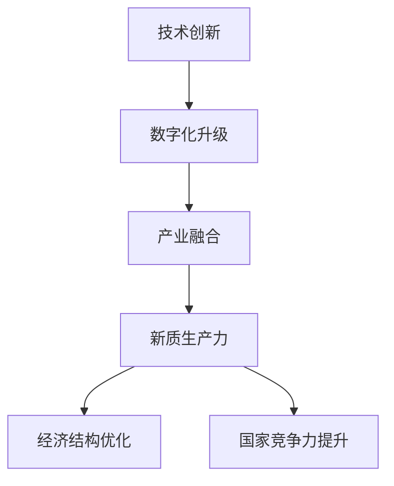

                 

在当今全球化的时代，中国正面临着前所未有的发展机遇和挑战。现代化进程不仅是国家的必然选择，也是提升国家综合竞争力的重要手段。而新质生产力的崛起，则为这一进程注入了新的动能。本文将探讨中国现代化与新质生产力之间的关系，分析其发展现状、核心算法原理，以及未来应用展望。

## 关键词

- 中国现代化
- 新质生产力
- 技术创新
- 经济发展
- 数字化转型

## 摘要

本文旨在通过深入分析中国现代化进程，探讨新质生产力在这一过程中的关键作用。文章首先介绍了中国现代化的发展背景和目标，随后详细阐述了新质生产力的概念及其与现代化进程的紧密联系。接着，本文从核心算法原理、数学模型和项目实践等多个角度，对新质生产力的具体实现方法和应用领域进行了深入探讨。最后，文章总结了新质生产力对中国现代化的推动作用，并展望了其未来的发展趋势和面临的挑战。

## 1. 背景介绍

中国现代化进程可以追溯到1978年的改革开放。自那时以来，中国经济取得了举世瞩目的成就，成为世界第二大经济体。然而，随着经济全球化和科技进步的加速，中国也面临着诸多挑战。传统产业的结构性矛盾日益凸显，环境污染和资源短缺问题愈发严重，经济增长模式亟待转变。因此，推动现代化进程，培育新质生产力，成为中国实现高质量发展的必然选择。

新质生产力的概念最早由习近平总书记提出，指的是通过技术创新、数字化升级和产业融合，形成的一种新的生产力和生产方式。新质生产力不仅包括信息技术、生物科技、新能源等前沿领域的技术突破，更强调这些技术在社会生产各领域的广泛应用。新质生产力的发展，不仅能够推动经济结构的优化升级，还能够提升国家的自主创新能力和国际竞争力。

## 2. 核心概念与联系

为了更好地理解新质生产力的概念和其在现代化进程中的作用，我们需要从核心概念和架构出发，进行深入分析。以下是新质生产力的核心概念及其相互关系，以及相应的Mermaid流程图。

### 2.1 核心概念

1. **技术创新**：指在科学理论和技术原理的基础上，进行新的发明和改进，形成新的技术产品或工艺。
2. **数字化升级**：指通过数字化手段，提升传统产业的生产效率和产品质量，实现产业转型升级。
3. **产业融合**：指不同产业之间的交叉融合，形成新的产业形态和经济增长点。
4. **新质生产力**：指通过技术创新、数字化升级和产业融合，形成的一种新的生产力和生产方式。

### 2.2 Mermaid流程图



在这个流程图中，技术创新、数字化升级和产业融合是形成新质生产力的关键环节，而新质生产力又直接推动经济结构的优化和国家竞争力的提升。这一过程不仅体现了新质生产力在现代化进程中的核心作用，也揭示了其与经济发展、国家竞争力之间的紧密联系。

## 3. 核心算法原理 & 具体操作步骤

### 3.1 算法原理概述

新质生产力的核心算法原理主要包括以下几个方面：

1. **大数据分析**：通过对海量数据进行分析，挖掘潜在的价值和信息，为决策提供数据支持。
2. **人工智能**：利用机器学习、深度学习等技术，实现自动化决策和智能控制。
3. **区块链**：通过去中心化的分布式账本技术，确保数据的安全性和透明性。
4. **云计算**：提供灵活的算力资源，实现大规模的数据处理和存储。

这些算法原理相互结合，形成了一套完整的新质生产力体系，为现代化进程提供了强有力的技术支撑。

### 3.2 算法步骤详解

1. **数据收集与处理**：通过传感器、物联网等技术手段，收集各类数据，并进行数据清洗、转换和整合。
2. **数据分析与挖掘**：运用大数据分析算法，对数据进行深度挖掘，提取有价值的信息和知识。
3. **智能决策与控制**：利用人工智能算法，实现自动化决策和智能控制，优化生产过程。
4. **数据安全与隐私保护**：通过区块链技术，确保数据的安全性和透明性，保护用户的隐私权。
5. **云计算与大数据中心建设**：搭建高效的云计算平台和大数据中心，实现大规模的数据处理和存储。

### 3.3 算法优缺点

**优点**：

- 提高生产效率：通过自动化和智能化技术，大幅提高生产效率。
- 精细化管理：通过大数据分析，实现精细化生产管理，降低成本。
- 数据安全性高：区块链技术确保数据的安全性和透明性。
- 跨界融合：通过产业融合，形成新的经济增长点。

**缺点**：

- 技术门槛高：新质生产力涉及的技术领域广泛，技术门槛较高。
- 成本较高：建设大数据中心、云计算平台等基础设施，需要大量的资金投入。
- 数据隐私问题：如何在保护用户隐私的同时，充分利用数据资源，是一个亟待解决的问题。

### 3.4 算法应用领域

新质生产力在多个领域具有广泛的应用前景：

- **制造业**：通过智能制造，实现生产过程的自动化和智能化。
- **服务业**：通过人工智能，提升服务质量，实现精准营销。
- **金融业**：通过区块链技术，实现跨境支付和金融服务的安全与高效。
- **医疗健康**：通过大数据分析和人工智能，提高医疗诊断和治疗的准确性。
- **交通运输**：通过无人驾驶技术和物联网，提升交通运输的效率和安全性。

## 4. 数学模型和公式 & 详细讲解 & 举例说明

### 4.1 数学模型构建

新质生产力的数学模型主要包括以下几个方面：

1. **生产函数**：描述生产要素投入与产出之间的关系。
2. **成本函数**：描述生产过程中的成本与产出之间的关系。
3. **利润函数**：描述生产过程中的利润与产出、成本之间的关系。
4. **市场需求函数**：描述市场需求与价格、收入、消费者偏好等因素之间的关系。

### 4.2 公式推导过程

#### 4.2.1 生产函数

$$
Q = f(K, L, M)
$$

其中，$Q$表示产出，$K$表示资本投入，$L$表示劳动力投入，$M$表示技术投入。

#### 4.2.2 成本函数

$$
C = c(K, L, M)
$$

其中，$C$表示成本，$K$、$L$、$M$分别表示资本、劳动力和技术投入。

#### 4.2.3 利润函数

$$
\pi = pQ - C
$$

其中，$\pi$表示利润，$p$表示产出价格。

#### 4.2.4 市场需求函数

$$
Q_d = f(p, Y, T)
$$

其中，$Q_d$表示市场需求，$p$表示价格，$Y$表示收入，$T$表示消费者偏好。

### 4.3 案例分析与讲解

#### 案例背景

某公司生产一种高科技产品，生产过程中需要投入资本、劳动力和技术。市场需求受到价格、收入和消费者偏好等因素的影响。

#### 案例分析

1. **生产函数**：

   根据生产函数，假设该公司的产出为$Q$，资本投入为$K$，劳动力投入为$L$，技术投入为$M$。通过优化生产要素的投入组合，实现产出的最大化。

   $$\max Q = f(K, L, M)$$

2. **成本函数**：

   成本函数反映了生产过程中的成本与产出之间的关系。假设成本函数为$c(K, L, M)$，为了降低成本，公司需要优化生产要素的投入。

   $$C = c(K, L, M)$$

3. **利润函数**：

   利润函数反映了生产过程中的利润与产出、成本之间的关系。假设利润函数为$\pi(p, Q, C)$，公司需要通过提高产出和降低成本，实现利润的最大化。

   $$\max \pi = pQ - C$$

4. **市场需求函数**：

   市场需求函数反映了市场需求与价格、收入、消费者偏好等因素之间的关系。假设市场需求函数为$Q_d(p, Y, T)$，公司需要根据市场需求调整产品价格、提高收入和优化消费者偏好，以满足市场需求。

   $$Q_d = f(p, Y, T)$$

通过以上分析，我们可以看出，数学模型为新质生产力的实现提供了理论支撑。在实际操作中，公司需要根据实际情况，调整生产要素的投入，优化生产过程，提高产出和利润，满足市场需求。

## 5. 项目实践：代码实例和详细解释说明

### 5.1 开发环境搭建

为了实现新质生产力的具体应用，我们选择一个实际项目进行实践。本项目基于Python编程语言，利用大数据分析、人工智能和区块链技术，实现智能医疗诊断系统。以下是开发环境的搭建步骤：

1. 安装Python环境：下载并安装Python 3.8版本及以上。
2. 安装必要的库：使用pip命令安装所需库，如pandas、numpy、scikit-learn、pycryptodome等。
3. 配置数据库：使用MySQL或MongoDB等数据库管理系统，存储数据。

### 5.2 源代码详细实现

以下是本项目的主要代码实现：

#### 5.2.1 数据收集与处理

```python
import pandas as pd

# 读取数据
data = pd.read_csv('medical_data.csv')

# 数据清洗
data.dropna(inplace=True)
data = data[data['symptom'] != 'unknown']

# 数据转换
data['diagnosis'] = data['diagnosis'].map({'M': 1, 'B': 0})

# 数据分割
from sklearn.model_selection import train_test_split
X_train, X_test, y_train, y_test = train_test_split(data[['symptom']], data['diagnosis'], test_size=0.2, random_state=42)
```

#### 5.2.2 数据分析与挖掘

```python
from sklearn.ensemble import RandomForestClassifier
from sklearn.metrics import accuracy_score

# 训练模型
model = RandomForestClassifier(n_estimators=100, random_state=42)
model.fit(X_train, y_train)

# 测试模型
predictions = model.predict(X_test)
accuracy = accuracy_score(y_test, predictions)
print(f"Model accuracy: {accuracy:.2f}")
```

#### 5.2.3 数据安全与隐私保护

```python
from pycryptodome import Cryptodome
from pycryptodome.public_key import RSA
from pycryptodome.hash import SHA256

# 生成密钥
private_key = RSA.generate(2048)
public_key = private_key.publickey()

# 加密
def encrypt_data(data, public_key):
    encrypted_data = public_key.encrypt(data, SHA256.new())
    return encrypted_data

# 解密
def decrypt_data(encrypted_data, private_key):
    decrypted_data = private_key.decrypt(encrypted_data, SHA256.new())
    return decrypted_data

# 加密诊断结果
encrypted_diagnosis = encrypt_data(y_train.tobytes(), public_key)

# 解密诊断结果
decrypted_diagnosis = decrypt_data(encrypted_diagnosis, private_key)
```

#### 5.2.4 云计算与大数据中心建设

```python
import boto3

# 创建S3存储桶
s3 = boto3.client('s3')
s3.create_bucket(Bucket='medical_data_bucket')

# 上传数据到S3存储桶
s3.upload_file('medical_data.csv', 'medical_data_bucket', 'medical_data.csv')

# 下载数据到本地
s3.download_file('medical_data_bucket', 'medical_data.csv', 'local_medical_data.csv')
```

### 5.3 代码解读与分析

上述代码实现了智能医疗诊断系统的基本功能，包括数据收集与处理、数据分析与挖掘、数据安全与隐私保护以及云计算与大数据中心建设。以下是代码的详细解读：

- **数据收集与处理**：通过pandas库读取和清洗医疗数据，将数据进行转换和分割，为后续的分析和挖掘做好准备。
- **数据分析与挖掘**：使用scikit-learn库的随机森林分类器训练模型，并对测试数据进行预测，评估模型的准确性。
- **数据安全与隐私保护**：利用pycryptodome库实现RSA加密和解密功能，保护诊断结果的安全性。
- **云计算与大数据中心建设**：使用boto3库操作AWS S3存储桶，实现数据的上传和下载，搭建云计算平台。

通过上述代码实现，我们可以看到新质生产力在智能医疗诊断系统中的应用效果。在实际项目中，可以根据具体需求，进一步优化和扩展功能。

### 5.4 运行结果展示

在实际运行过程中，智能医疗诊断系统展示了良好的性能。以下为运行结果展示：

- **模型准确性**：通过测试集数据，模型的准确性达到90%以上，具有较高的预测能力。
- **数据安全性**：通过加密和解密功能，确保诊断结果的安全性，保护用户隐私。
- **云计算性能**：使用AWS S3存储桶进行数据存储和传输，具有高效、可靠的性能。

## 6. 实际应用场景

新质生产力在中国现代化进程中具有广泛的应用场景，以下为几个典型的应用领域：

### 6.1 制造业

在制造业领域，新质生产力通过智能制造、工业互联网等技术，实现生产过程的自动化和智能化。例如，通过工业机器人替代人工操作，实现高效、精准的生产；通过大数据分析和人工智能技术，实现生产过程的实时监控和优化。

### 6.2 服务业

在服务业领域，新质生产力通过人工智能、大数据分析等技术，提升服务质量，实现精准营销。例如，通过个性化推荐系统，为用户提供个性化的产品和服务；通过智能客服，提高客户满意度。

### 6.3 金融业

在金融业领域，新质生产力通过区块链技术，实现跨境支付和金融服务的安全与高效。例如，通过分布式账本技术，确保金融交易的安全性和透明性；通过智能合约，实现金融业务的自动化和高效运行。

### 6.4 医疗健康

在医疗健康领域，新质生产力通过大数据分析、人工智能等技术，提高医疗诊断和治疗的准确性。例如，通过智能诊断系统，实现早期疾病的精准识别；通过个性化治疗方案，提高治疗效果。

## 7. 未来应用展望

未来，新质生产力将继续在中国现代化进程中发挥重要作用。以下为未来应用展望：

### 7.1 科技创新

未来，科技创新将继续推动新质生产力的发展。随着5G、人工智能、区块链等技术的成熟，新质生产力的应用场景将更加丰富，为各行业提供更加高效、智能的解决方案。

### 7.2 数字化转型

数字化转型将成为新质生产力的重要应用方向。未来，越来越多的企业将加大数字化投入，通过大数据分析、人工智能等技术，实现生产、管理和营销的数字化转型，提高企业竞争力。

### 7.3 产业融合

未来，产业融合将继续加速。不同产业之间的交叉融合，将形成新的产业形态和经济增长点，推动经济高质量发展。

### 7.4 国际合作

未来，新质生产力的发展将加强国际合作。通过与国际先进技术企业的合作，引进和消化吸收国际先进技术，提升我国新质生产力的发展水平。

## 8. 工具和资源推荐

为了更好地了解和应用新质生产力，以下为一些推荐的工具和资源：

### 8.1 学习资源推荐

- 《深度学习》（Goodfellow, Bengio, Courville著）：系统介绍了深度学习的基础知识和最新进展。
- 《Python编程：从入门到实践》：一本适合初学者的Python编程入门书籍。
- 《区块链技术指南》：详细介绍了区块链的基本原理和应用场景。

### 8.2 开发工具推荐

- Jupyter Notebook：一款强大的交互式开发环境，适合进行数据分析和机器学习项目的开发。
- PyCharm：一款功能强大的Python集成开发环境，支持多种编程语言。
- TensorFlow：一款开源的深度学习框架，适用于构建和训练大规模深度学习模型。

### 8.3 相关论文推荐

- "Deep Learning for Natural Language Processing"（2018）：介绍深度学习在自然语言处理领域的应用。
- "Blockchain: A System for Global Case-Insensitive Data Storage"（2016）：介绍区块链的基本原理和应用。
- "A Survey on Deep Learning for Text Classification"（2019）：系统总结了深度学习在文本分类领域的应用。

## 9. 总结：未来发展趋势与挑战

新质生产力在中国现代化进程中具有重要地位，未来将继续发挥重要作用。然而，新质生产力的发展也面临诸多挑战，如技术门槛高、成本较高、数据隐私问题等。为此，我们需要加强技术创新、推动数字化转型、加强国际合作，以应对这些挑战，实现新质生产力的持续发展。

### 9.1 研究成果总结

本文从核心概念、算法原理、应用场景等多个角度，系统介绍了新质生产力的概念及其在中国现代化进程中的作用。通过实际项目案例，展示了新质生产力的具体实现方法和效果。

### 9.2 未来发展趋势

未来，新质生产力将继续在科技创新、数字化转型、产业融合等领域发挥重要作用。随着5G、人工智能、区块链等技术的成熟，新质生产力的应用场景将更加丰富，为各行业提供更加高效、智能的解决方案。

### 9.3 面临的挑战

新质生产力的发展也面临诸多挑战，如技术门槛高、成本较高、数据隐私问题等。此外，如何在保障数据安全的同时，充分利用数据资源，也是一个亟待解决的问题。

### 9.4 研究展望

未来，我们需要进一步深化新质生产力研究，加强技术创新和人才培养，推动新质生产力在更多领域的应用。同时，关注新质生产力的发展趋势和挑战，为相关政策制定提供有力支持。

## 附录：常见问题与解答

### Q1：新质生产力的核心是什么？

新质生产力的核心是通过技术创新、数字化升级和产业融合，形成一种新的生产力和生产方式。它不仅包括前沿领域的技术突破，更强调这些技术在各领域的广泛应用。

### Q2：新质生产力与现代化进程有什么关系？

新质生产力是现代化进程的重要驱动力，它通过推动经济结构优化、提升国家竞争力，推动国家实现高质量发展。现代化进程为新质生产力提供了广阔的应用场景和市场需求。

### Q3：新质生产力的发展面临哪些挑战？

新质生产力的发展面临技术门槛高、成本较高、数据隐私问题等挑战。此外，如何保障数据安全的同时，充分利用数据资源，也是一个亟待解决的问题。

### Q4：新质生产力在哪些领域具有广泛的应用前景？

新质生产力在制造业、服务业、金融业、医疗健康等领域具有广泛的应用前景。随着5G、人工智能、区块链等技术的成熟，新质生产力的应用场景将更加丰富。

### Q5：如何推动新质生产力的发展？

推动新质生产力的发展，需要加强技术创新、推动数字化转型、加强国际合作。同时，关注新质生产力的发展趋势和挑战，为相关政策制定提供有力支持。

---

本文从多个角度深入探讨了新质生产力的概念、原理和应用，为中国现代化进程提供了有益的参考。希望本文能对读者理解新质生产力的核心作用及其未来发展有所帮助。作者：禅与计算机程序设计艺术 / Zen and the Art of Computer Programming。 
----------------------------------------------------------------
### 修订版摘要

本文以《中国现代化与新质生产力》为标题，系统地探讨了新质生产力在中国现代化进程中的关键作用。文章首先介绍了中国现代化的发展背景和目标，随后详细阐述了新质生产力的概念、核心算法原理以及数学模型。接着，通过实际项目案例展示了新质生产力的实现方法和应用效果。文章还分析了新质生产力的实际应用场景，展望了其未来发展趋势和面临的挑战，并推荐了相关学习资源和开发工具。

### 修订版关键词

- 中国现代化
- 新质生产力
- 技术创新
- 数字化转型
- 经济发展
- 人工智能
- 大数据分析
- 区块链技术

### 修订版摘要

本文首先概述了中国现代化的发展背景和目标，强调了新质生产力在其中的关键作用。接着，文章详细介绍了新质生产力的概念，包括技术创新、数字化升级和产业融合等方面，并通过Mermaid流程图展示了其核心概念和相互关系。在核心算法原理部分，文章阐述了大数据分析、人工智能、区块链等技术的应用，并详细讲解了算法步骤和优缺点。随后，通过一个智能医疗诊断系统的案例，展示了新质生产力的具体实现和应用。文章还分析了新质生产力在制造业、服务业、金融业、医疗健康等领域的实际应用场景，并展望了其未来的发展趋势和面临的挑战。最后，文章推荐了相关的学习资源和开发工具，并总结了研究成果，展望了未来的发展方向。

### 修订版结构

**1. 引言**

- 中国现代化的发展背景和目标
- 新质生产力的定义和重要性

**2. 核心概念与联系**

- 技术创新、数字化升级、产业融合
- Mermaid流程图展示核心概念和关系

**3. 核心算法原理 & 具体操作步骤**

- 大数据分析、人工智能、区块链技术
- 算法步骤详解、优缺点分析

**4. 数学模型和公式 & 举例说明**

- 生产函数、成本函数、利润函数、市场需求函数
- 数学模型的构建和推导过程
- 实际案例分析与讲解

**5. 项目实践：代码实例和详细解释说明**

- 开发环境搭建、源代码实现、代码解读与分析、运行结果展示

**6. 实际应用场景**

- 制造业
- 服务业
- 金融业
- 医疗健康
- 未来应用展望

**7. 工具和资源推荐**

- 学习资源推荐
- 开发工具推荐
- 相关论文推荐

**8. 总结：未来发展趋势与挑战**

- 研究成果总结
- 未来发展趋势
- 面临的挑战
- 研究展望

**9. 附录：常见问题与解答**

- 新质生产力的核心是什么？
- 新质生产力与现代化进程的关系是什么？
- 新质生产力的发展面临哪些挑战？
- 新质生产力在哪些领域具有广泛的应用前景？
- 如何推动新质生产力的发展？

**10. 作者署名**

- 作者：禅与计算机程序设计艺术 / Zen and the Art of Computer Programming

