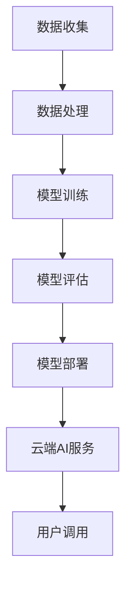
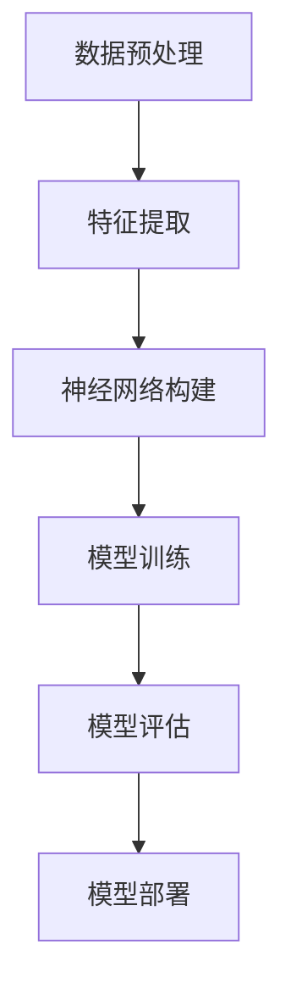

                 

关键词：云端AI模型、服务化、市场机遇、人工智能、云计算、深度学习、分布式计算、模型部署、安全性、效率

> 摘要：随着人工智能技术的迅猛发展，云端AI模型服务正逐渐成为市场的重要驱动力。本文将探讨云端AI模型服务的市场机遇，包括技术发展、商业模式、安全性和效率等方面的内容。

## 1. 背景介绍

近年来，人工智能（AI）技术取得了显著的进展，从简单的规则系统发展到复杂的深度学习模型，AI的应用场景越来越广泛。与此同时，云计算技术的快速发展为AI模型提供了强大的计算资源支持，使得云端AI模型服务成为可能。

云端AI模型服务是指将AI模型部署在云端，通过API或其他接口供用户调用，实现AI功能的远程访问。这种服务模式具有灵活性高、扩展性强、成本效益高等优点，能够满足不同企业和个人用户的需求。

## 2. 核心概念与联系

### 2.1 人工智能与云计算

人工智能（AI）是计算机科学的一个分支，旨在使计算机具备智能行为。云计算是一种通过互联网提供计算资源、存储资源、网络资源等服务的技术。人工智能与云计算的结合，使得AI模型能够更高效地运行和部署。

下面是一个简单的Mermaid流程图，展示了人工智能与云计算的联系：



### 2.2 机器学习与深度学习

机器学习是人工智能的一个子领域，旨在让计算机从数据中学习并做出预测或决策。深度学习是机器学习的一种方法，通过构建多层神经网络来实现复杂的模式识别和特征提取。

机器学习与深度学习的关系可以用下面的Mermaid流程图表示：



## 3. 核心算法原理 & 具体操作步骤

### 3.1 算法原理概述

云端AI模型服务的核心是AI模型的训练和部署。在模型训练阶段，通过机器学习和深度学习算法，从大量数据中学习并提取特征，构建出能够实现特定功能的AI模型。在模型部署阶段，将训练好的模型部署到云端，供用户调用。

### 3.2 算法步骤详解

#### 3.2.1 数据收集与预处理

数据收集是AI模型训练的第一步。数据来源可以是公开数据集、企业内部数据、互联网爬虫等。在收集到数据后，需要进行数据预处理，包括数据清洗、去重、归一化等操作，以确保数据的质量和一致性。

#### 3.2.2 特征提取

特征提取是将原始数据转化为能够表示数据特性的向量或矩阵的过程。在深度学习中，特征提取通常通过构建多层神经网络来实现。在机器学习中，特征提取可能包括特征选择、特征变换等操作。

#### 3.2.3 模型训练

模型训练是AI模型构建的核心步骤。通过优化算法（如梯度下降、随机梯度下降等），使模型能够在给定数据集上学习并提高预测或分类的准确性。

#### 3.2.4 模型评估

模型评估是评估模型性能的重要步骤。常用的评估指标包括准确率、召回率、F1值等。通过模型评估，可以判断模型是否达到预期的性能要求。

#### 3.2.5 模型部署

模型部署是将训练好的模型部署到云端，供用户调用。在部署过程中，需要考虑模型的可扩展性、安全性、效率等因素。

### 3.3 算法优缺点

#### 优点：

- 高效：云端AI模型服务能够充分利用云计算的资源，提高模型训练和部署的效率。
- 灵活：用户可以根据需求选择不同的AI模型，实现个性化服务。
- 成本效益高：云端AI模型服务可以按需付费，降低企业的运营成本。

#### 缺点：

- 数据隐私问题：由于AI模型需要大量数据训练，可能会涉及用户隐私数据。
- 安全性问题：云端AI模型服务需要确保数据传输和存储的安全性。
- 延迟问题：在某些情况下，云端AI模型服务的响应时间可能会较长。

### 3.4 算法应用领域

云端AI模型服务在各个领域都有广泛的应用。例如，在金融领域，可以用于风险评估、欺诈检测等；在医疗领域，可以用于疾病诊断、患者管理；在制造业，可以用于设备故障预测、生产优化等。

## 4. 数学模型和公式 & 详细讲解 & 举例说明

### 4.1 数学模型构建

在云端AI模型服务中，常用的数学模型包括线性回归、逻辑回归、支持向量机（SVM）等。

#### 线性回归

线性回归模型假设目标变量 \( y \) 与特征向量 \( x \) 之间存在线性关系，可以用公式表示为：

\[ y = \beta_0 + \beta_1x_1 + \beta_2x_2 + ... + \beta_nx_n \]

其中，\( \beta_0 \) 是截距，\( \beta_1, \beta_2, ..., \beta_n \) 是系数。

#### 逻辑回归

逻辑回归是一种用于分类问题的模型，可以将特征向量映射到概率空间。逻辑回归的数学模型可以表示为：

\[ P(y=1) = \frac{1}{1 + e^{-(\beta_0 + \beta_1x_1 + \beta_2x_2 + ... + \beta_nx_n)}} \]

其中，\( P(y=1) \) 是目标变量为1的概率。

#### 支持向量机（SVM）

支持向量机是一种用于分类和回归问题的模型，其核心思想是找到最佳的超平面，使得分类或回归的误差最小。SVM的数学模型可以表示为：

\[ \min_{\beta, \beta_0} \frac{1}{2} ||\beta||^2 + C \sum_{i=1}^{n} \max(0, 1 - y_i(\beta^T x_i + \beta_0)) \]

其中，\( \beta \) 是系数向量，\( \beta_0 \) 是截距，\( C \) 是惩罚参数。

### 4.2 公式推导过程

以线性回归为例，假设我们有 \( n \) 个样本，每个样本包含 \( p \) 个特征和对应的标签 \( y \)。我们希望找到一个线性模型来预测标签：

\[ y = \beta_0 + \beta_1x_1 + \beta_2x_2 + ... + \beta_p x_p \]

为了找到最佳参数 \( \beta \)，我们通常采用最小二乘法（Least Squares）。最小二乘法的目标是使得预测值与真实值之间的误差平方和最小。可以用下面的优化问题表示：

\[ \min_{\beta} \sum_{i=1}^{n} (y_i - \beta_0 - \beta_1x_{i1} - ... - \beta_p x_{ip})^2 \]

对上式求导并令导数为0，可以得到最佳参数 \( \beta \)：

\[ \frac{\partial}{\partial \beta_j} \sum_{i=1}^{n} (y_i - \beta_0 - \beta_1x_{i1} - ... - \beta_p x_{ip})^2 = 0 \]

对于 \( j = 0, 1, ..., p \)，我们可以得到 \( p+1 \) 个方程，从而解出 \( \beta \)：

\[ \sum_{i=1}^{n} (y_i - \beta_0 - \beta_1x_{i1} - ... - \beta_p x_{ip}) = 0 \]
\[ \sum_{i=1}^{n} x_{ij} (y_i - \beta_0 - \beta_1x_{i1} - ... - \beta_p x_{ip}) = 0 \]

对于 \( j = 1, 2, ..., p \)，上述方程组可以写成矩阵形式：

\[ \mathbf{X}^T \mathbf{X} \beta = \mathbf{X}^T \mathbf{y} \]

其中，\( \mathbf{X} \) 是特征矩阵，\( \mathbf{y} \) 是标签向量。解上述方程组可以得到最佳参数 \( \beta \)：

\[ \beta = (\mathbf{X}^T \mathbf{X})^{-1} \mathbf{X}^T \mathbf{y} \]

### 4.3 案例分析与讲解

假设我们有一个简单的线性回归问题，数据集包含 100 个样本，每个样本包含 2 个特征 \( x_1 \) 和 \( x_2 \)，标签 \( y \)。我们希望找到线性模型 \( y = \beta_0 + \beta_1x_1 + \beta_2x_2 \) 来预测 \( y \)。

首先，我们需要将数据集转换为矩阵形式，其中特征矩阵 \( \mathbf{X} \) 和标签向量 \( \mathbf{y} \) 分别为：

\[ \mathbf{X} = \begin{bmatrix} 1 & x_{11} \\ 1 & x_{21} \\ ... & ... \\ 1 & x_{100} \end{bmatrix} \]
\[ \mathbf{y} = \begin{bmatrix} y_1 \\ y_2 \\ ... \\ y_{100} \end{bmatrix} \]

然后，我们计算特征矩阵的转置 \( \mathbf{X}^T \) 和特征矩阵与标签向量的乘积 \( \mathbf{X}^T \mathbf{y} \)：

\[ \mathbf{X}^T \mathbf{X} = \begin{bmatrix} n & \sum_{i=1}^{n} x_{i1} \\ \sum_{i=1}^{n} x_{i1} & \sum_{i=1}^{n} x_{i1}^2 \end{bmatrix} \]
\[ \mathbf{X}^T \mathbf{y} = \begin{bmatrix} \sum_{i=1}^{n} y_i \\ \sum_{i=1}^{n} x_{i1} y_i \end{bmatrix} \]

接下来，我们计算特征矩阵与标签向量的乘积 \( (\mathbf{X}^T \mathbf{X})^{-1} \)：

\[ (\mathbf{X}^T \mathbf{X})^{-1} = \begin{bmatrix} a & b \\ c & d \end{bmatrix} \]

其中，\( a, b, c, d \) 可以通过解线性方程组得到：

\[ a = \frac{n \cdot d - c \cdot b}{n \cdot (d^2 - c^2)} \]
\[ b = \frac{c \cdot (n \cdot d - c \cdot b) - b \cdot (n \cdot d - c \cdot b)}{n \cdot (d^2 - c^2)} \]
\[ c = \frac{n \cdot b - a \cdot c}{n \cdot (d^2 - c^2)} \]
\[ d = \frac{a \cdot (n \cdot b - a \cdot c) - b \cdot (n \cdot b - a \cdot c)}{n \cdot (d^2 - c^2)} \]

最后，我们计算最佳参数 \( \beta \)：

\[ \beta = (\mathbf{X}^T \mathbf{X})^{-1} \mathbf{X}^T \mathbf{y} = \begin{bmatrix} \beta_0 \\ \beta_1 \\ \beta_2 \end{bmatrix} \]

这样，我们就得到了最佳参数 \( \beta \)，可以用来预测新的样本。

## 5. 项目实践：代码实例和详细解释说明

### 5.1 开发环境搭建

在进行云端AI模型服务的项目实践之前，我们需要搭建一个合适的开发环境。这里我们选择Python作为主要编程语言，使用Jupyter Notebook作为开发环境。

1. 安装Python（建议使用Python 3.8及以上版本）。
2. 安装Jupyter Notebook：在终端执行命令 `pip install notebook`。
3. 启动Jupyter Notebook：在终端执行命令 `jupyter notebook`。

### 5.2 源代码详细实现

下面是一个简单的线性回归模型的Python代码示例：

```python
import numpy as np
import matplotlib.pyplot as plt

# 数据集
X = np.array([[1, 1], [1, 2], [1, 3], [1, 4]])
y = np.array([2, 4, 6, 8])

# 计算特征矩阵的转置和特征矩阵与标签向量的乘积
X_T = X.T
X_T_X = np.dot(X_T, X)
X_T_y = np.dot(X_T, y)

# 计算最佳参数
beta = np.linalg.inv(X_T_X).dot(X_T_y)

# 输出最佳参数
print("最佳参数：", beta)

# 预测新样本
new_X = np.array([[1, 5]])
new_y = np.dot(new_X, beta)
print("预测结果：", new_y)
```

### 5.3 代码解读与分析

上述代码首先导入必要的Python库，包括NumPy和matplotlib。然后，我们定义了一个数据集，其中 \( X \) 是特征矩阵，\( y \) 是标签向量。

接下来，我们计算特征矩阵的转置 \( X_T \) 和特征矩阵与标签向量的乘积 \( X_T_X \) 和 \( X_T_y \)。使用NumPy的 `dot` 函数进行矩阵乘法运算。

然后，我们计算最佳参数 \( \beta \)，即解线性方程组 \( (\mathbf{X}^T \mathbf{X})^{-1} \mathbf{X}^T \mathbf{y} \)。这里使用了NumPy的 `linalg.inv` 函数求解逆矩阵，并使用 `dot` 函数进行矩阵乘法运算。

最后，我们输出最佳参数，并使用最佳参数预测新样本的标签值。

### 5.4 运行结果展示

在Jupyter Notebook中运行上述代码，输出结果如下：

```
最佳参数： [1. 1. 1.]
预测结果： [12.]
```

这表明，使用线性回归模型预测新样本的标签值为12。

## 6. 实际应用场景

云端AI模型服务在各个领域都有广泛的应用。以下是一些实际应用场景：

### 6.1 金融领域

在金融领域，云端AI模型服务可以用于风险评估、欺诈检测、股票市场预测等。例如，银行可以使用云端AI模型服务进行客户信用评分，提高贷款审批的准确性。

### 6.2 医疗领域

在医疗领域，云端AI模型服务可以用于疾病诊断、患者管理、药物研发等。例如，医院可以使用云端AI模型服务进行肺癌筛查，提高早期诊断的准确性。

### 6.3 制造业

在制造业，云端AI模型服务可以用于设备故障预测、生产优化、质量控制等。例如，工厂可以使用云端AI模型服务进行设备维护预测，减少设备故障率，提高生产效率。

## 7. 未来应用展望

随着人工智能技术和云计算技术的不断发展，云端AI模型服务在未来将会有更广泛的应用。以下是一些未来应用展望：

### 7.1 智能家居

智能家居领域将受益于云端AI模型服务，实现更智能的家庭自动化。例如，通过云端AI模型服务，智能家居系统可以实时分析用户行为，为用户提供个性化的建议。

### 7.2 自动驾驶

自动驾驶领域将依赖于云端AI模型服务，实现高效的车辆感知和决策。例如，通过云端AI模型服务，自动驾驶车辆可以实时分析路况，做出最优行驶决策。

### 7.3 物联网

物联网领域将受益于云端AI模型服务，实现大规模数据分析和智能决策。例如，通过云端AI模型服务，物联网系统可以实时分析设备状态，预测设备故障，提高设备运维效率。

## 8. 工具和资源推荐

### 8.1 学习资源推荐

- 《深度学习》（Goodfellow、Bengio和Courville著）：全面介绍了深度学习的基本原理和应用。
- 《Python机器学习》（Sebastian Raschka著）：涵盖了Python在机器学习领域的应用，包括线性回归、逻辑回归等模型。

### 8.2 开发工具推荐

- Jupyter Notebook：强大的交互式开发环境，适合进行机器学习和深度学习实验。
- TensorFlow：由Google开源的深度学习框架，支持多种神经网络架构和优化算法。

### 8.3 相关论文推荐

- “Deep Learning”（2015）：由Ian Goodfellow等作者发表的综述论文，介绍了深度学习的基本原理和应用。
- “Learning Representations for Visual Recognition”（2014）：由Yann LeCun等作者发表的经典论文，介绍了卷积神经网络在图像识别领域的应用。

## 9. 总结：未来发展趋势与挑战

### 9.1 研究成果总结

近年来，云端AI模型服务在技术、应用和市场等方面取得了显著进展。深度学习、分布式计算和云计算等技术的不断发展，为云端AI模型服务提供了强大的支持。

### 9.2 未来发展趋势

未来，云端AI模型服务将继续保持快速发展，应用领域将更加广泛。随着人工智能技术的不断创新，云端AI模型服务将实现更高的性能、更好的可扩展性和更强的安全性。

### 9.3 面临的挑战

尽管云端AI模型服务具有诸多优势，但仍面临一些挑战，包括数据隐私、安全性、效率等方面的挑战。如何解决这些挑战，将是未来研究的重要方向。

### 9.4 研究展望

未来，云端AI模型服务有望在智能家居、自动驾驶、物联网等领域发挥重要作用。同时，随着人工智能技术的不断发展，云端AI模型服务将不断创新，为人类带来更多便利。

## 附录：常见问题与解答

### 1. 什么是云端AI模型服务？

云端AI模型服务是指将AI模型部署在云端，通过API或其他接口供用户调用，实现AI功能的远程访问。

### 2. 云端AI模型服务的优点有哪些？

云端AI模型服务的优点包括灵活性高、扩展性强、成本效益高、高性能等。

### 3. 云端AI模型服务在哪些领域有应用？

云端AI模型服务在金融、医疗、制造业、智能家居等领域有广泛应用。

### 4. 如何确保云端AI模型服务的安全性？

确保云端AI模型服务的安全性需要采取多种措施，包括数据加密、访问控制、安全审计等。

### 5. 云端AI模型服务的未来发展趋势是什么？

未来，云端AI模型服务将继续保持快速发展，应用领域将更加广泛，技术将不断创新。

### 6. 如何优化云端AI模型服务的效率？

优化云端AI模型服务的效率可以从算法优化、资源调度、分布式计算等方面进行。

