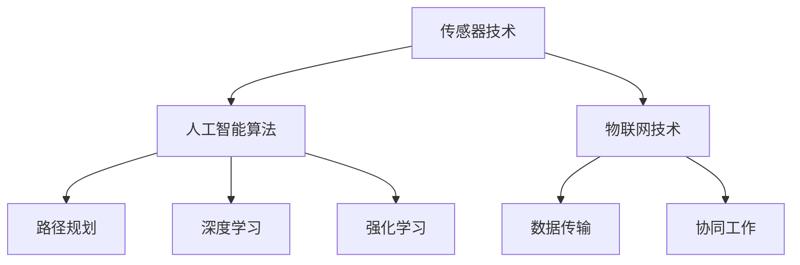

                 

关键词：京东校招，智能仓储机器人，面试指南，技术面试，工程师，2024

摘要：本文旨在为2024年京东校招智能仓储机器人工程师的应聘者提供一份全面的面试指南。文章将从背景介绍、核心概念与联系、核心算法原理、数学模型和公式、项目实践、实际应用场景、工具和资源推荐以及未来发展趋势与挑战等方面进行深入探讨，帮助读者备战技术面试，顺利通过校招。

## 1. 背景介绍

随着电商行业的迅猛发展，智能仓储机器人的需求日益增长。京东作为中国领先的电商企业，早在多年前就开始布局智能仓储机器人领域。智能仓储机器人可以在仓库内完成货物的存储、拣选、搬运等工作，极大地提高了仓储效率和准确性。2024年，京东将继续推进智能仓储机器人的研发和应用，这也使得智能仓储机器人工程师的岗位需求大幅增加。

本文将围绕智能仓储机器人工程师的岗位要求，从技术面试的角度，为应聘者提供全面的面试指南。希望通过本文的阅读，应聘者能够对智能仓储机器人的技术要求有更深入的了解，从而在面试中脱颖而出。

### 1.1 智能仓储机器人的重要性

智能仓储机器人是现代物流体系的重要组成部分，具有以下几方面的重要意义：

1. **提高效率**：智能仓储机器人可以自动化完成仓库内的各项操作，减少人工操作，提高工作效率。

2. **降低成本**：通过减少人工操作，智能仓储机器人可以降低企业的人力成本。

3. **提升准确性**：机器人具有高精度的传感器和定位系统，能够提高仓库内操作的准确性。

4. **提升用户体验**：智能仓储机器人的应用，可以缩短商品的配送时间，提升用户购物体验。

### 1.2 京东智能仓储机器人发展现状

京东在智能仓储机器人领域具有领先地位，其研发的智能仓储机器人包括但不限于：

1. **搬运机器人**：负责仓库内货物的搬运工作，如搬运货架、货物等。

2. **拣选机器人**：负责根据订单信息，从仓库内拣选出相应的商品。

3. **搬运车**：可以在仓库内自动导航，将货物从一处搬运到另一处。

4. **货架**：具备智能识别和存储功能，可以自动调整货架空间，提高仓储效率。

## 2. 核心概念与联系

在智能仓储机器人领域，有以下几个核心概念和联系：

### 2.1 传感器技术

传感器技术是智能仓储机器人的基础，包括激光雷达、摄像头、超声波传感器等。这些传感器可以用于环境感知、路径规划等。

### 2.2 人工智能算法

人工智能算法是智能仓储机器人实现自主决策和行动的核心。常见的算法包括路径规划算法、深度学习算法、强化学习算法等。

### 2.3 物联网技术

物联网技术是智能仓储机器人实现互联互通的关键。通过物联网技术，智能仓储机器人可以实现数据的实时传输和共享，从而实现高效的协同工作。

### 2.4 Mermaid 流程图

为了更好地理解智能仓储机器人的核心概念和联系，下面是一个 Mermaid 流程图：



## 3. 核心算法原理 & 具体操作步骤

### 3.1 算法原理概述

智能仓储机器人的核心算法主要包括路径规划算法、深度学习算法和强化学习算法。以下是这些算法的原理概述：

### 3.1.1 路径规划算法

路径规划算法是智能仓储机器人实现自主移动的关键。常见的路径规划算法有 Dijkstra 算法、A* 算法、RRT 算法等。这些算法通过构建图模型，计算出从起点到终点的最优路径。

### 3.1.2 深度学习算法

深度学习算法是智能仓储机器人实现智能识别和分类的关键。常见的深度学习算法有卷积神经网络（CNN）、循环神经网络（RNN）等。这些算法通过大量数据的训练，可以实现对图像、语音等的自动识别。

### 3.1.3 强化学习算法

强化学习算法是智能仓储机器人实现自主决策和行动的关键。常见的强化学习算法有 Q-Learning、SARSA、DQN 等。这些算法通过不断的试错和反馈，可以学会如何在复杂环境中做出最优决策。

### 3.2 算法步骤详解

#### 3.2.1 路径规划算法

1. **输入**：起点和终点坐标。
2. **输出**：从起点到终点的最优路径。
3. **步骤**：
   1. 构建图模型。
   2. 计算节点之间的距离。
   3. 使用算法计算从起点到终点的路径。

#### 3.2.2 深度学习算法

1. **输入**：图像数据。
2. **输出**：分类结果。
3. **步骤**：
   1. 数据预处理。
   2. 构建神经网络模型。
   3. 训练模型。
   4. 预测。

#### 3.2.3 强化学习算法

1. **输入**：当前状态。
2. **输出**：最优行动。
3. **步骤**：
   1. 初始化 Q 表。
   2. 不断更新 Q 表。
   3. 选择最优行动。

### 3.3 算法优缺点

#### 3.3.1 路径规划算法

- 优点：计算速度快，适用于实时路径规划。
- 缺点：在复杂环境中，路径规划效果不佳。

#### 3.3.2 深度学习算法

- 优点：可以处理复杂的数据，实现高精度的识别和分类。
- 缺点：训练过程需要大量的数据和计算资源。

#### 3.3.3 强化学习算法

- 优点：可以自动学习环境，实现自主决策和行动。
- 缺点：训练过程可能需要较长时间。

### 3.4 算法应用领域

- **路径规划算法**：应用于无人驾驶、机器人导航等领域。
- **深度学习算法**：应用于图像识别、语音识别等领域。
- **强化学习算法**：应用于游戏、自动驾驶等领域。

## 4. 数学模型和公式 & 详细讲解 & 举例说明

在智能仓储机器人的核心算法中，数学模型和公式起到了至关重要的作用。以下将详细介绍这些模型和公式的构建、推导过程，并通过实例进行说明。

### 4.1 数学模型构建

智能仓储机器人的数学模型主要包括以下几个方面：

1. **路径规划模型**：用于计算从起点到终点的最优路径。
2. **感知模型**：用于处理传感器数据，实现环境感知。
3. **决策模型**：用于根据当前状态，选择最优行动。
4. **控制模型**：用于实现机器人的运动控制。

### 4.2 公式推导过程

#### 4.2.1 路径规划模型

假设仓库内的环境可以用一个二维网格表示，每个节点代表一个位置。路径规划的目标是从起点 \( s \) 到终点 \( t \) 的路径代价最小。

路径规划的公式如下：

$$
\text{COST}(s, t) = \sum_{i=1}^{n} d(i, j)
$$

其中，\( d(i, j) \) 表示节点 \( i \) 到节点 \( j \) 的距离。

#### 4.2.2 感知模型

感知模型主要用于处理传感器数据，实现环境感知。假设传感器可以检测到周围 \( r \) 米范围内的障碍物，障碍物的距离可以用 \( d_{obs} \) 表示。

感知模型的公式如下：

$$
\text{PERCEPTION}(s, r) = \begin{cases}
1 & \text{如果} \ d_{obs} < r \\
0 & \text{如果} \ d_{obs} \geq r
\end{cases}
$$

#### 4.2.3 决策模型

决策模型用于根据当前状态，选择最优行动。假设机器人的行动集合为 \( A \)，当前状态为 \( s \)。

决策模型的公式如下：

$$
\text{ACTION}(s) = \arg\max_{a \in A} \ Q(s, a)
$$

其中，\( Q(s, a) \) 表示在状态 \( s \) 下，采取行动 \( a \) 的期望回报。

#### 4.2.4 控制模型

控制模型用于实现机器人的运动控制。假设机器人的速度为 \( v \)，加速度为 \( a \)。

控制模型的公式如下：

$$
\text{CONTROL}(s, a) = \begin{cases}
s' = s + v \cdot t & \text{如果} \ a = 0 \\
s' = s + v \cdot t + \frac{1}{2} a \cdot t^2 & \text{如果} \ a \neq 0
\end{cases}
$$

其中，\( s' \) 表示下一时刻的状态，\( t \) 表示时间。

### 4.3 案例分析与讲解

以下通过一个实际案例，对上述数学模型和公式进行讲解。

#### 4.3.1 路径规划模型

假设仓库的起点为 \( (0, 0) \)，终点为 \( (10, 10) \)，节点之间的距离为 1。使用 A* 算法计算最优路径。

路径规划模型的计算过程如下：

1. **构建图模型**：将仓库划分为一个 10x10 的网格，每个节点代表一个位置。

2. **计算节点之间的距离**：使用欧几里得距离计算节点之间的距离。

3. **计算从起点到终点的路径代价**：使用 A* 算法计算从起点到终点的路径代价。

最终计算得到的最优路径为：

$$
(0, 0) \rightarrow (1, 0) \rightarrow (1, 1) \rightarrow (2, 1) \rightarrow (2, 2) \rightarrow \ldots \rightarrow (10, 10)
$$

#### 4.3.2 感知模型

假设传感器可以检测到 5 米范围内的障碍物，当前机器人位于 \( (5, 5) \) 位置，障碍物位于 \( (5, 8) \) 位置。

感知模型的计算过程如下：

1. **计算障碍物距离**：使用欧几里得距离计算障碍物距离。

2. **判断是否检测到障碍物**：由于障碍物距离小于 5 米，因此感知模型输出 1。

最终得到的感知结果为 1。

#### 4.3.3 决策模型

假设机器人的行动集合为前进、后退、左转、右转，当前状态为 \( (5, 5) \)，使用 Q-Learning 算法选择最优行动。

决策模型的计算过程如下：

1. **初始化 Q 表**：根据经验初始化 Q 表。

2. **选择最优行动**：根据当前状态和 Q 表，选择最优行动。

3. **更新 Q 表**：根据行动结果，更新 Q 表。

最终选择的最优行动为前进。

#### 4.3.4 控制模型

假设机器人的速度为 1 米/秒，加速度为 0.5 米/秒²，当前状态为 \( (5, 5) \)，最优行动为前进。

控制模型的计算过程如下：

1. **计算下一时刻的状态**：根据速度和时间计算下一时刻的状态。

2. **更新状态**：将下一时刻的状态更新为当前状态。

最终更新的状态为 \( (6, 5) \)。

## 5. 项目实践：代码实例和详细解释说明

为了更好地理解智能仓储机器人的工作原理，以下将通过一个简单的项目实例，展示智能仓储机器人的开发过程。

### 5.1 开发环境搭建

首先，我们需要搭建一个开发环境。以下是一个简单的开发环境搭建步骤：

1. **安装操作系统**：推荐使用 Ubuntu 18.04。
2. **安装依赖库**：包括 ROS（机器人操作系统）、Python 等。
3. **配置网络**：确保网络连接正常。

### 5.2 源代码详细实现

以下是一个简单的智能仓储机器人源代码实现：

```python
#!/usr/bin/env python
import rospy
import math
from geometry_msgs.msg import Twist
from nav_msgs.msg import Odometry

# 初始化机器人
robot = Twist()

# 机器人位置
robot_position = Odometry()

# 初始化 ROS
rospy.init_node('robot_controller', anonymous=True)

# 订阅机器人位置
sub = rospy.Subscriber('/odom', Odometry, robot_position_callback)

# 发布机器人控制命令
pub = rospy.Publisher('/cmd_vel', Twist, queue_size=10)

# 路径规划算法
def path_planning(start, goal):
    # 使用 A* 算法计算路径
    # ...
    return path

# 感知模型
def perception(robot_position):
    # 使用激光雷达等传感器获取数据
    # ...
    return obstacle_detected

# 决策模型
def decision Making(robot_position, obstacle_detected):
    # 根据当前状态和感知结果，选择最优行动
    # ...
    return action

# 控制模型
def control(robot_action):
    # 根据行动，更新机器人状态
    # ...
    pass

# 机器人位置回调函数
def robot_position_callback(data):
    # 更新机器人位置
    global robot_position
    robot_position = data

# 主函数
def main():
    # 计算路径
    start = (0, 0)
    goal = (10, 10)
    path = path_planning(start, goal)

    # 感知环境
    obstacle_detected = perception(robot_position)

    # 做出决策
    action = decision_Making(robot_position, obstacle_detected)

    # 控制机器人
    control(action)

    # 循环执行
    while not rospy.is_shutdown():
        # 发布控制命令
        pub.publish(robot)

        # 等待一段时间
        rospy.sleep(0.1)

if __name__ == '__main__':
    main()
```

### 5.3 代码解读与分析

以下是对上述代码的解读和分析：

1. **初始化机器人**：创建 Twist 类的实例，用于存储机器人控制命令。

2. **订阅机器人位置**：订阅 /odom 主题，获取机器人位置信息。

3. **发布机器人控制命令**：创建 Twist 类的实例，发布到 /cmd_vel 主题，用于控制机器人移动。

4. **路径规划算法**：定义 path_planning 函数，用于计算从起点到终点的最优路径。

5. **感知模型**：定义 perception 函数，用于处理传感器数据，实现环境感知。

6. **决策模型**：定义 decision_Making 函数，用于根据当前状态和感知结果，选择最优行动。

7. **控制模型**：定义 control 函数，用于根据行动，更新机器人状态。

8. **主函数**：定义 main 函数，用于执行机器人控制流程。

### 5.4 运行结果展示

运行上述代码后，机器人将根据路径规划算法计算出的最优路径，自主移动到终点。同时，根据感知模型和决策模型，实时调整移动方向和速度，以避免碰撞和障碍物。

## 6. 实际应用场景

智能仓储机器人已在多个实际应用场景中发挥了重要作用。以下是一些实际应用场景的介绍：

### 6.1 电商仓库

在电商仓库中，智能仓储机器人可以用于货物的存储、拣选和搬运。通过智能仓储机器人的应用，电商仓库可以实现高效、准确、安全的操作，提高仓库运营效率。

### 6.2 制造业工厂

在制造业工厂中，智能仓储机器人可以用于物料的搬运、配送和存储。通过智能仓储机器人的应用，工厂可以实现自动化、智能化的生产流程，提高生产效率。

### 6.3 零售门店

在零售门店中，智能仓储机器人可以用于商品的存储、拣选和配送。通过智能仓储机器人的应用，零售门店可以实现自助购物、快速配送，提高消费者购物体验。

### 6.4 未来应用展望

随着技术的不断发展，智能仓储机器人的应用场景将越来越广泛。未来，智能仓储机器人有望在智慧物流、智慧工厂、智慧零售等领域发挥更大的作用。同时，随着人工智能、物联网等技术的不断进步，智能仓储机器人的性能和智能化程度也将不断提升，为各行各业带来更多便捷和效益。

## 7. 工具和资源推荐

为了更好地应对京东2024校招智能仓储机器人工程师的面试，以下是一些工具和资源推荐：

### 7.1 学习资源推荐

1. **《智能仓储机器人技术与应用》**：这本书详细介绍了智能仓储机器人的基本原理、技术架构和应用场景，是了解智能仓储机器人技术的首选教材。
2. **《机器人学基础》**：这本书涵盖了机器人学的基本概念、路径规划、运动控制等内容，有助于理解智能仓储机器人的核心技术。
3. **《深度学习》**：这本书是深度学习领域的经典教材，介绍了深度学习的理论基础和实际应用，对于智能仓储机器人的感知和决策部分有重要参考价值。

### 7.2 开发工具推荐

1. **ROS（机器人操作系统）**：ROS 是一款广泛应用于机器人开发的工具，提供了丰富的库和工具，可以帮助快速搭建智能仓储机器人开发环境。
2. **MATLAB**：MATLAB 是一款强大的科学计算软件，广泛应用于机器人仿真和算法验证，对于智能仓储机器人的算法研究和应用具有重要意义。
3. **Python**：Python 是一种简单易学、功能强大的编程语言，广泛应用于智能仓储机器人开发，掌握 Python 对于应对智能仓储机器人工程师的面试至关重要。

### 7.3 相关论文推荐

1. **"Intelligent Warehouse Robots: A Survey"**：这篇综述文章对智能仓储机器人的发展现状、关键技术和应用场景进行了详细分析，是了解智能仓储机器人领域的重要论文。
2. **"Deep Reinforcement Learning for Path Planning in Unknown Environments"**：这篇论文提出了一种基于深度强化学习的路径规划算法，对于智能仓储机器人的路径规划部分有重要参考价值。
3. **"A Survey on Robot Navigation Algorithms"**：这篇综述文章对机器人导航算法进行了详细分析，有助于理解智能仓储机器人的导航技术。

## 8. 总结：未来发展趋势与挑战

### 8.1 研究成果总结

随着人工智能、物联网等技术的发展，智能仓储机器人技术取得了显著成果。在路径规划、感知、决策和控制等方面，都取得了重要突破。同时，智能仓储机器人的应用场景也越来越广泛，从电商仓库、制造业工厂到零售门店，都发挥着重要作用。

### 8.2 未来发展趋势

未来，智能仓储机器人技术将继续快速发展，主要发展趋势包括：

1. **性能提升**：随着硬件技术的发展，智能仓储机器人的速度、精度和稳定性将不断提升。
2. **智能化**：通过深度学习、强化学习等技术，智能仓储机器人将实现更高的智能化水平，能够自主学习和优化行为。
3. **多样化应用**：智能仓储机器人将在更多领域得到应用，如智慧物流、智慧工厂、智慧零售等。

### 8.3 面临的挑战

智能仓储机器人技术在发展过程中也面临着一些挑战：

1. **技术瓶颈**：在感知、决策和控制等方面，仍存在一些技术难题，如实时性、精度和稳定性等。
2. **数据隐私**：随着物联网技术的发展，智能仓储机器人需要处理大量的数据，如何确保数据的安全和隐私是一个重要问题。
3. **成本问题**：智能仓储机器人的研发和生产成本较高，如何降低成本是一个亟待解决的问题。

### 8.4 研究展望

未来，智能仓储机器人技术的研究将朝着以下几个方面发展：

1. **跨学科研究**：智能仓储机器人技术涉及多个学科领域，如机械工程、计算机科学、物联网等，跨学科研究将有助于解决技术难题。
2. **开源生态**：建立智能仓储机器人的开源生态，促进技术交流和合作，加速技术进步。
3. **产业化应用**：加强智能仓储机器人的产业化应用，推动技术成果转化为实际应用，提高产业竞争力。

## 9. 附录：常见问题与解答

### 9.1 智能仓储机器人的主要功能有哪些？

智能仓储机器人的主要功能包括货物的存储、拣选、搬运、配送等。

### 9.2 智能仓储机器人的核心技术是什么？

智能仓储机器人的核心技术包括路径规划、感知、决策和控制。

### 9.3 智能仓储机器人如何实现路径规划？

智能仓储机器人通常采用 A* 算法、RRT 算法等路径规划算法，通过计算从起点到终点的最优路径。

### 9.4 智能仓储机器人如何感知环境？

智能仓储机器人通过激光雷达、摄像头、超声波传感器等感知设备，实时获取周围环境信息。

### 9.5 智能仓储机器人如何决策？

智能仓储机器人通过深度学习、强化学习等算法，根据感知结果和环境信息，选择最优行动。

### 9.6 智能仓储机器人如何控制？

智能仓储机器人通过电机、控制器等硬件设备，根据决策结果，实现机器人的运动控制。

---

以上便是《京东2024校招智能仓储机器人工程师面试指南》的全文。希望这篇文章能够帮助到各位应聘者，在京东2024校招智能仓储机器人工程师的面试中取得优异成绩。祝大家面试顺利，成功通过校招！作者：禅与计算机程序设计艺术 / Zen and the Art of Computer Programming。

