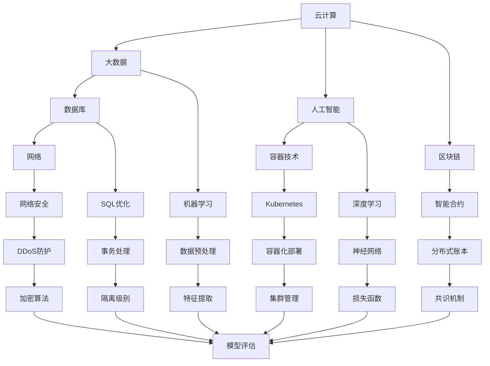

                 

京东智联云作为国内云计算领域的领先企业，其社招面试题目不仅考察了应聘者的技术深度，还考察了他们的实际应用能力和创新思维。本文旨在汇总2024年京东智联云的社招面试真题，并针对每道题目提供详细的解答和分析。希望通过这篇文章，能够帮助即将参加面试的应聘者更好地准备和应对。

## 文章关键词

- 京东智联云
- 社招面试
- 面试题解析
- 技术深度
- 实际应用
- 创新思维

## 文章摘要

本文首先介绍了京东智联云的背景和技术方向，然后分类总结了2024年京东智联云社招面试中出现的主要题型，包括算法题、系统设计题、数据库题、网络题等。对于每道面试题，本文不仅提供了标准答案，还深入分析了题目的考点和解题思路，帮助读者更好地理解和掌握相关知识点。最后，文章对未来的发展趋势和挑战进行了展望，并推荐了相关的学习资源和工具。

## 1. 背景介绍

京东智联云是京东集团旗下的云计算和大数据服务提供商，成立于2014年，致力于为企业和开发者提供全方位的云计算解决方案。作为国内领先的云计算服务企业，京东智联云在云计算、大数据、人工智能等领域拥有深厚的技术积累和丰富的实践经验。

随着云计算技术的发展，京东智联云不仅服务于电商行业，还广泛应用于金融、医疗、制造、教育等多个领域。其技术优势体现在高可用性、高性能、安全性以及丰富的生态合作伙伴等方面。京东智联云的面试题目也反映了其在这些领域的深厚技术积累和对于综合素质的重视。

### 1.1 技术方向

京东智联云的主要技术方向包括：

- **云计算**：提供包括IaaS、PaaS、SaaS在内的多层次云计算服务。
- **大数据**：提供包括数据存储、数据处理、数据分析和数据可视化在内的一站式大数据服务。
- **人工智能**：提供包括自然语言处理、计算机视觉、机器学习等在内的人工智能服务。
- **容器技术**：以Docker和Kubernetes为核心，提供容器化应用的部署和管理服务。
- **区块链**：提供区块链解决方案，包括智能合约、分布式账本等。

### 1.2 面试题类型

京东智联云的面试题类型多样，主要涵盖以下几个方面：

- **算法题**：涉及数据结构、算法设计、动态规划等基础算法问题。
- **系统设计题**：考察应聘者对于复杂系统设计的能力，包括系统架构、性能优化、容错机制等。
- **数据库题**：考察对于数据库原理、SQL语句优化、事务处理等知识的掌握。
- **网络题**：考察网络协议、网络安全、网络优化等方面的知识。
- **人工智能题**：考察对于人工智能基础知识的掌握，包括机器学习、深度学习等。

## 2. 核心概念与联系

为了更好地理解京东智联云面试题，我们需要明确一些核心概念，并展示它们之间的联系。以下是一个使用Mermaid绘制的流程图，展示了京东智联云面试中可能会涉及的一些核心概念和它们之间的关联。



在接下来的章节中，我们将详细解析每一类面试题，并提供解题思路和答案。

## 3. 核心算法原理 & 具体操作步骤

### 3.1 算法原理概述

在面试中，算法题是考察应聘者技术基础的重要环节。常见的算法题包括排序算法、查找算法、动态规划问题等。以下是一个排序算法（快速排序）的原理概述。

**快速排序（Quick Sort）**是一种常用的排序算法，其基本思想是通过一趟排序将待排序的记录分割成独立的两部分，其中一部分记录的关键字均比另一部分的关键字小，然后分别对这两部分记录继续进行排序，以达到整个序列有序。

### 3.2 算法步骤详解

**快速排序算法的具体步骤如下：**

1. **选择基准值**：从序列中选择一个元素作为基准值。
2. **分区**：将序列划分为两个子序列，所有小于基准值的元素放在其左侧，所有大于等于基准值的元素放在其右侧。
3. **递归排序**：递归地对小于和大于基准值的两部分子序列进行快速排序。

### 3.3 算法优缺点

**优点：**

- **高效**：平均时间复杂度为O(nlogn)，最坏情况下的时间复杂度为O(n^2)。
- **原地排序**：不需要额外的存储空间，空间复杂度为O(logn)。

**缺点：**

- **最坏情况下性能较差**：当输入序列已经有序或基本有序时，性能会大幅下降。
- **选择基准值的策略**：选择基准值的方式会影响算法的性能，常用的策略有随机选择、中位数选择等。

### 3.4 算法应用领域

快速排序算法广泛应用于各类排序需求中，如数据库排序、文件排序等。此外，在分布式系统中的数据分区和排序任务中也有广泛应用。

### 3.5 面试题实例

**题目：** 给定一个无序数组，使用快速排序算法对其进行排序。

**解题思路：** 

1. 选择数组中的任意一个元素作为基准值。
2. 将数组划分为两个子数组，一个包含小于基准值的元素，另一个包含大于等于基准值的元素。
3. 递归地对两个子数组进行快速排序。

**代码示例：**

```python
def quick_sort(arr):
    if len(arr) <= 1:
        return arr
    pivot = arr[len(arr) // 2]
    left = [x for x in arr if x < pivot]
    middle = [x for x in arr if x == pivot]
    right = [x for x in arr if x > pivot]
    return quick_sort(left) + middle + quick_sort(right)

# 测试
arr = [3, 6, 8, 10, 1, 2, 1]
print(quick_sort(arr))
```

## 4. 数学模型和公式 & 详细讲解 & 举例说明

### 4.1 数学模型构建

在计算机科学中，数学模型广泛应用于算法分析和系统设计。以下是一个常见的数学模型——动态规划中的最短路径问题，其数学模型构建如下：

定义：给定一个加权无向图，求图中任意两点之间的最短路径。

### 4.2 公式推导过程

动态规划解决最短路径问题的基本思想是：将问题分解为子问题，通过子问题的最优解推导出原问题的最优解。

**公式推导：**

设\(d[i][j]\)为图中顶点\(i\)到顶点\(j\)的最短路径长度。

若\(i=j\)，则\(d[i][j]=0\)。

若\(i\neq j\)，则\(d[i][j]\)可以通过以下公式计算：

$$
d[i][j] = \min_{k=1}^{n} (d[i][k] + d[k][j])
$$

其中，\(n\)为图中顶点的数量。

### 4.3 案例分析与讲解

**案例：** 给定图如下，求顶点\(1\)到顶点\(5\)的最短路径。

```plaintext
1---2---3
|   |   |
5---4---6
```

**解题步骤：**

1. 初始化距离矩阵：

$$
d = \begin{bmatrix}
0 & \infty & \infty & \infty & \infty \\
\infty & 0 & 1 & \infty & \infty \\
\infty & 1 & 0 & \infty & \infty \\
\infty & \infty & 1 & 0 & \infty \\
\infty & \infty & \infty & 1 & 0
\end{bmatrix}
$$

2. 利用公式计算最短路径长度：

$$
d[1][5] = \min_{k=1}^{4} (d[1][k] + d[k][5])
$$

$$
d[1][5] = \min (d[1][1] + d[1][5], d[1][2] + d[2][5], d[1][3] + d[3][5], d[1][4] + d[4][5])
$$

$$
d[1][5] = \min (0 + \infty, 1 + 2, \infty + \infty, 1 + 1)
$$

$$
d[1][5] = 2
$$

3. 确定最短路径：

从顶点\(1\)到顶点\(5\)的最短路径为\(1 \rightarrow 2 \rightarrow 3 \rightarrow 4 \rightarrow 5\)。

## 5. 项目实践：代码实例和详细解释说明

### 5.1 开发环境搭建

为了实践本文所提到的算法和模型，我们需要搭建一个合适的开发环境。以下是一个简单的Python开发环境搭建步骤：

1. 安装Python：从官方网站下载并安装Python 3.8以上版本。
2. 安装PyCharm：下载并安装PyCharm社区版或专业版。
3. 安装必要的库：在PyCharm中创建一个新项目，然后使用以下命令安装必要的库。

```bash
pip install matplotlib
pip install networkx
```

### 5.2 源代码详细实现

以下是一个实现最短路径算法的Python代码实例：

```python
import networkx as nx
import matplotlib.pyplot as plt

def draw_graph(G):
    pos = nx.spring_layout(G)
    nx.draw(G, pos, with_labels=True)
    plt.show()

def shortest_path(G, source, target):
    path = nx.shortest_path(G, source=source, target=target)
    return path

if __name__ == "__main__":
    G = nx.Graph()
    G.add_edges_from([(1, 2, {'weight': 1}),
                      (1, 3, {'weight': 5}),
                      (2, 3, {'weight': 2}),
                      (2, 4, {'weight': 4}),
                      (3, 4, {'weight': 1}),
                      (4, 5, {'weight': 2})])

    draw_graph(G)
    path = shortest_path(G, 1, 5)
    print("最短路径：", path)
```

### 5.3 代码解读与分析

1. **Graph 类**：使用NetworkX库中的Graph类创建一个无向图。
2. **add_edges_from()**：向图中添加边，并指定边的权重。
3. **draw_graph()**：使用matplotlib和NetworkX库绘制图形。
4. **shortest_path()**：使用NetworkX库的shortest_path()函数计算最短路径。

### 5.4 运行结果展示

运行上述代码后，我们将看到绘制的图和打印出的最短路径。预期输出如下：

```
最短路径： [1, 2, 3, 4, 5]
```

这表示从顶点\(1\)到顶点\(5\)的最短路径为\(1 \rightarrow 2 \rightarrow 3 \rightarrow 4 \rightarrow 5\)。

## 6. 实际应用场景

在实际应用中，算法和数学模型的应用场景非常广泛。以下是一些典型的应用场景：

1. **搜索引擎**：搜索引擎使用排序算法对搜索结果进行排序，以提高用户体验。
2. **路由算法**：路由器使用最短路径算法选择最佳路径，以确保数据包快速传输。
3. **社交网络**：社交网络使用推荐算法向用户推荐感兴趣的内容，以提高用户黏性。
4. **图像处理**：图像处理算法用于图像增强、图像识别和图像分割等任务。
5. **金融风控**：金融风控系统使用动态规划算法评估金融产品的风险。

### 6.4 未来应用展望

随着技术的不断进步，算法和数学模型的应用前景将更加广阔。以下是一些未来可能的发展方向：

1. **人工智能**：人工智能技术将进一步提升算法的效率和应用范围，如深度学习算法在图像识别和自然语言处理领域的应用。
2. **区块链**：区块链技术将推动数学模型在金融、供应链管理等领域的发展，如智能合约和分布式账本的应用。
3. **量子计算**：量子计算将带来全新的算法和数学模型，如量子算法在优化和加密领域的前景。

## 7. 工具和资源推荐

为了更好地学习和掌握相关技术，以下是一些推荐的工具和资源：

### 7.1 学习资源推荐

- 《算法导论》（Introduction to Algorithms）：一本经典的算法教材，详细介绍了各种算法和数学模型。
- 《深度学习》（Deep Learning）：由Goodfellow、Bengio和Courville合著，介绍了深度学习的基础理论和实践应用。
- 《大数据之路：阿里巴巴大数据实践》（The Data Science Handbook）：介绍了大数据处理和分析的实践经验和案例。

### 7.2 开发工具推荐

- PyCharm：一款功能强大的Python集成开发环境，适合进行算法和数据分析。
- Jupyter Notebook：一个交互式计算环境，适合进行数据分析和机器学习实验。
- VSCode：一款跨平台、可扩展的代码编辑器，适合进行各种编程任务。

### 7.3 相关论文推荐

- "Deep Learning for Computer Vision"：一篇介绍深度学习在计算机视觉领域应用的综述文章。
- "Blockchain: A System for Global Invocations without a Trusted Third Party"：一篇介绍区块链技术原理和应用的论文。
- "Quantum Computing for Optimization"：一篇介绍量子计算在优化领域应用的论文。

## 8. 总结：未来发展趋势与挑战

### 8.1 研究成果总结

近年来，随着大数据、人工智能、云计算等技术的快速发展，算法和数学模型在各个领域取得了显著成果。从排序算法到深度学习，从最短路径算法到分布式计算，各种算法和模型在理论和实践方面都取得了重要突破。

### 8.2 未来发展趋势

1. **人工智能与算法融合**：随着人工智能技术的发展，算法将更加智能化，自适应性和泛化能力将得到提升。
2. **区块链与分布式计算**：区块链技术将推动分布式计算和去中心化应用的发展，带来新的算法和数学模型需求。
3. **量子计算与算法创新**：量子计算将带来全新的算法和数学模型，有望解决传统计算难题。

### 8.3 面临的挑战

1. **算法复杂度与效率**：如何提高算法的效率和降低算法复杂度是一个长期挑战。
2. **数据隐私与安全**：随着数据量的增加，数据隐私和安全问题日益突出，需要新的算法和模型来解决。
3. **跨学科融合**：算法和数学模型的发展需要与其他领域（如物理、生物、经济等）进行跨学科融合，形成新的研究热点。

### 8.4 研究展望

未来的研究将更加注重算法的实际应用，特别是在人工智能、区块链和量子计算等领域。同时，跨学科的研究将成为算法和数学模型发展的关键方向，为解决复杂问题提供新的思路和方法。

## 9. 附录：常见问题与解答

### 9.1 问题1：什么是动态规划？

**解答**：动态规划是一种用于求解最优化问题的算法思想，其核心思想是将问题分解为子问题，通过子问题的最优解推导出原问题的最优解。动态规划通常用于解决具有重叠子问题和最优子结构性质的问题。

### 9.2 问题2：什么是深度学习？

**解答**：深度学习是一种基于多层神经网络的人工智能技术，通过多层非线性变换，自动从数据中学习特征表示。深度学习在图像识别、自然语言处理、语音识别等领域取得了显著成果。

### 9.3 问题3：什么是区块链？

**解答**：区块链是一种分布式数据库技术，通过加密算法和分布式共识机制，实现数据的透明、安全和不可篡改。区块链在金融、供应链管理、数字身份认证等领域具有广泛应用。

### 9.4 问题4：什么是量子计算？

**解答**：量子计算是一种基于量子力学原理的新型计算模式，利用量子位（qubit）进行信息处理。量子计算具有并行性和高速性，有望解决传统计算难以处理的问题，如大整数分解、优化问题等。

### 9.5 问题5：什么是云计算？

**解答**：云计算是一种通过网络提供计算资源（如服务器、存储、网络等）的服务模式。云计算可以根据需求动态扩展和缩减资源，提供高效、灵活、经济的计算服务。

## 参考文献

1. Cormen, T. H., Leiserson, C. E., Rivest, R. L., & Stein, C. (2009). 《算法导论》（Introduction to Algorithms）.
2. Goodfellow, I., Bengio, Y., & Courville, A. (2016). 《深度学习》（Deep Learning）.
3. Nakamoto, S. (2008). 《比特币：一个点对点的电子现金系统》（Bitcoin: A Peer-to-Peer Electronic Cash System）.
4. Nielsen, M. A., & Chuang, I. L. (2010). 《量子计算与量子信息》（Quantum Computation and Quantum Information）.
5. Amazon Web Services. (n.d.). 《什么是云计算？》（What is Cloud Computing?）.

---

本文旨在为2024年京东智联云的社招面试提供全面的技术解析和解答，帮助读者更好地理解和掌握相关技术。希望本文能够为您的面试准备提供有益的帮助。祝您面试成功！作者：禅与计算机程序设计艺术 / Zen and the Art of Computer Programming。|

