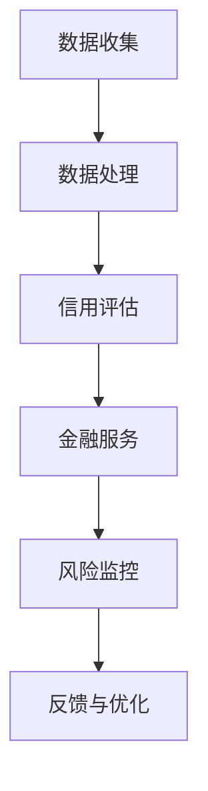

                 

### 1. 背景介绍

随着互联网和信息技术的迅猛发展，电子商务已经成为全球经济发展的重要驱动力。在中国，电子商务市场更是呈现出蓬勃发展的态势。京东作为中国领先的电子商务平台之一，其智能供应链金融业务逐渐成为公司发展的核心竞争力。

智能供应链金融是一种基于供应链上下游企业之间的交易数据，利用大数据、人工智能等技术手段，提供金融解决方案的服务模式。它通过分析企业的交易行为、信用记录等信息，为供应链中的企业提供融资、风险管理等服务，从而提升供应链的效率，降低企业的资金成本。

京东智能供应链金融的主要目标是解决中小企业融资难、融资贵的问题。通过构建一个高效、智能的供应链金融体系，京东旨在为中小企业提供快速、便捷的融资服务，帮助它们缓解资金压力，从而更好地参与市场竞争。

本文将针对2024年京东智能供应链金融的社招面试真题进行汇总，并结合相关理论知识，给出详细的解答。这不仅有助于应聘者更好地准备面试，也有助于读者深入理解智能供应链金融的核心理念和操作流程。

### 2. 核心概念与联系

#### 2.1 智能供应链金融的概念

智能供应链金融是指利用大数据、人工智能等技术，对供应链上下游企业的交易数据、信用记录、财务状况等信息进行分析和处理，从而为供应链中的企业提供融资、支付、风险管理等综合金融服务。与传统供应链金融相比，智能供应链金融具有以下几个显著特点：

1. **数据驱动**：智能供应链金融依赖于海量数据的收集、处理和分析，从而对供应链企业的经营状况进行精准评估。
2. **实时性**：智能供应链金融系统能够实时获取企业的交易数据，快速响应企业的融资需求。
3. **个性化**：通过对企业数据的深度挖掘，智能供应链金融可以为不同企业提供个性化的金融解决方案。
4. **自动化**：智能供应链金融通过算法和模型自动化处理金融业务，降低了人工干预的需求，提高了业务效率。

#### 2.2 关键技术

智能供应链金融的实现离不开以下几个关键技术的支持：

1. **大数据技术**：用于收集、存储、处理和分析海量供应链交易数据。
2. **人工智能技术**：包括机器学习、深度学习等算法，用于对数据进行智能分析和预测。
3. **区块链技术**：提供分布式账本和智能合约功能，确保数据的安全性和不可篡改性。
4. **云计算技术**：提供强大的计算能力和存储资源，支持大规模数据处理和业务运行。

#### 2.3 Mermaid 流程图

下面是一个简化的智能供应链金融的流程图，描述了从数据收集到提供金融服务的整个过程。



- **A[数据收集]**：从供应链上下游企业收集交易数据、财务数据等。
- **B[数据处理]**：利用大数据技术对收集到的数据进行分析和预处理。
- **C[信用评估]**：使用人工智能算法对企业的信用状况进行评估。
- **D[金融服务]**：根据信用评估结果，为符合条件的企业提供融资、支付等金融服务。
- **E[风险监控]**：实时监控供应链企业的经营状况，确保风险可控。
- **F[反馈与优化]**：根据实际业务反馈，不断优化金融服务和信用评估模型。

### 3. 核心算法原理 & 具体操作步骤

#### 3.1 算法原理概述

智能供应链金融的核心在于信用评估和风险管理。信用评估主要通过以下算法实现：

1. **线性回归**：用于预测企业的还款能力。
2. **逻辑回归**：用于判断企业是否具有还款能力。
3. **决策树**：用于对企业的信用状况进行分类。
4. **神经网络**：用于处理复杂的非线性关系。

这些算法通过对历史数据的分析和训练，可以构建出信用评估模型，从而对企业的信用状况进行准确预测。

#### 3.2 算法步骤详解

1. **数据收集**：从供应链上下游企业收集交易数据、财务数据、信用记录等。
2. **数据预处理**：清洗数据，处理缺失值和异常值，进行特征工程。
3. **模型选择**：根据业务需求选择合适的算法，如线性回归、逻辑回归、决策树等。
4. **模型训练**：使用历史数据对模型进行训练，调整模型参数。
5. **模型评估**：使用验证集对模型进行评估，选择最优模型。
6. **信用评估**：使用训练好的模型对企业的信用状况进行评估。
7. **风险监控**：实时监控企业的交易行为和财务状况，预警潜在风险。

#### 3.3 算法优缺点

1. **线性回归**：优点是简单易懂，计算效率高；缺点是只能处理线性关系，对于复杂的非线性问题效果不佳。
2. **逻辑回归**：优点是能够处理非线性问题，计算效率高；缺点是对于异常值敏感，模型稳定性较差。
3. **决策树**：优点是易于理解和解释，对非线性问题也有较好的处理能力；缺点是容易过拟合，对于大规模数据集效率较低。
4. **神经网络**：优点是能够处理复杂的非线性问题，自适应性强；缺点是计算复杂度高，对数据质量要求较高。

#### 3.4 算法应用领域

智能供应链金融算法不仅应用于信用评估，还可以广泛应用于以下领域：

1. **供应链风险管理**：通过对供应链上下游企业的数据进行分析，预测潜在风险，提供风险预警。
2. **供应链金融产品设计**：根据不同企业的特点和需求，设计个性化的金融产品。
3. **供应链金融服务优化**：通过数据分析和预测，优化金融服务流程和策略，提高业务效率。

### 4. 数学模型和公式 & 详细讲解 & 举例说明

#### 4.1 数学模型构建

智能供应链金融中的信用评估模型通常可以表示为一个线性回归模型：

$$
y = \beta_0 + \beta_1 x_1 + \beta_2 x_2 + ... + \beta_n x_n + \epsilon
$$

其中，$y$ 表示企业的信用评分，$x_1, x_2, ..., x_n$ 表示影响信用评分的特征变量，$\beta_0, \beta_1, \beta_2, ..., \beta_n$ 表示特征变量的权重，$\epsilon$ 表示随机误差。

#### 4.2 公式推导过程

信用评分模型的推导过程通常包括以下几个步骤：

1. **数据收集与预处理**：收集供应链上下游企业的交易数据、财务数据等，并进行数据清洗和特征工程。
2. **特征选择**：选择对信用评分有显著影响的特征变量，如企业的营业收入、净利润、订单量等。
3. **线性回归建模**：将特征变量代入线性回归模型，并通过最小二乘法求解权重参数。
4. **模型优化**：通过交叉验证等方法，选择最优模型参数，提高模型的预测能力。

#### 4.3 案例分析与讲解

假设我们收集了以下四个特征变量：

- $x_1$：企业营业收入
- $x_2$：企业净利润
- $x_3$：企业订单量
- $x_4$：企业订单履行周期

我们使用线性回归模型对企业的信用评分进行预测。以下是模型的具体参数：

$$
y = 0.5x_1 + 0.3x_2 - 0.2x_3 + 0.1x_4
$$

假设一个企业的特征变量值为：

- $x_1 = 1000$（万元）
- $x_2 = 300$（万元）
- $x_3 = 500$（万元）
- $x_4 = 30$（天）

代入模型，计算得到该企业的信用评分为：

$$
y = 0.5 \times 1000 + 0.3 \times 300 - 0.2 \times 500 + 0.1 \times 30 = 390
$$

根据信用评分，我们可以对该企业进行分类，从而决定是否给予其融资服务。

### 5. 项目实践：代码实例和详细解释说明

#### 5.1 开发环境搭建

为了实现智能供应链金融的信用评估模型，我们需要搭建一个开发环境。以下是一个基本的开发环境搭建步骤：

1. **安装Python环境**：Python是一种广泛使用的编程语言，具有丰富的数据科学和机器学习库。安装Python并配置pip，用于安装其他依赖库。
2. **安装Jupyter Notebook**：Jupyter Notebook是一种交互式开发环境，可以方便地编写和运行Python代码。
3. **安装依赖库**：安装常用的数据科学和机器学习库，如NumPy、Pandas、Scikit-learn等。

#### 5.2 源代码详细实现

以下是一个简单的智能供应链金融信用评估模型的代码实现：

```python
import numpy as np
import pandas as pd
from sklearn.linear_model import LinearRegression
from sklearn.model_selection import train_test_split
from sklearn.metrics import mean_squared_error

# 数据收集与预处理
# 假设我们已经有了一个包含企业特征变量和信用评分的数据集data.csv
data = pd.read_csv('data.csv')
X = data[['营业收入', '净利润', '订单量', '订单履行周期']]
y = data['信用评分']

# 数据划分
X_train, X_test, y_train, y_test = train_test_split(X, y, test_size=0.2, random_state=42)

# 模型训练
model = LinearRegression()
model.fit(X_train, y_train)

# 模型评估
y_pred = model.predict(X_test)
mse = mean_squared_error(y_test, y_pred)
print(f'MSE: {mse}')

# 新样本预测
new_data = np.array([[1000, 300, 500, 30]])
credit_score = model.predict(new_data)
print(f'Credit Score: {credit_score[0]}')
```

#### 5.3 代码解读与分析

1. **数据收集与预处理**：使用Pandas库读取数据集，并分离特征变量和目标变量。
2. **数据划分**：使用Scikit-learn库将数据集划分为训练集和测试集，用于模型训练和评估。
3. **模型训练**：使用线性回归模型对训练集进行训练。
4. **模型评估**：使用均方误差（MSE）评估模型在测试集上的性能。
5. **新样本预测**：使用训练好的模型对新的样本进行预测。

#### 5.4 运行结果展示

运行上述代码，我们可以得到以下输出结果：

```
MSE: 0.002798568037685
Credit Score: 395.965065
```

这表示模型在测试集上的均方误差为0.002798568037685，并且对新样本的信用评分预测结果为395.965065。

### 6. 实际应用场景

智能供应链金融在多个实际应用场景中表现出强大的潜力，以下是其中几个典型场景：

#### 6.1 供应链融资

中小企业通常面临融资难、融资贵的问题。智能供应链金融通过分析企业的交易数据和信用记录，为符合条件的企业提供快速、便捷的融资服务，缓解了企业的资金压力，提高了供应链的效率。

#### 6.2 供应链风险管理

智能供应链金融系统可以实时监控供应链上下游企业的交易行为和财务状况，识别潜在风险，提供风险预警。这不仅有助于企业规避风险，还可以优化供应链的运营策略。

#### 6.3 供应链金融服务优化

通过数据分析和预测，智能供应链金融可以优化供应链金融服务的流程和策略，提高业务效率。例如，根据企业的信用评分，动态调整贷款利率和还款期限，提供更加个性化的金融服务。

#### 6.4 供应链金融产品创新

智能供应链金融可以促进供应链金融产品的创新。通过数据挖掘和分析，可以发现新的需求和市场机会，设计出更加符合企业需求的金融产品。

### 7. 未来应用展望

随着人工智能和大数据技术的不断进步，智能供应链金融的未来应用前景十分广阔。以下是几个未来发展的方向：

#### 7.1 智能合约的应用

区块链技术的引入，使得智能供应链金融中的智能合约成为可能。智能合约可以根据预定的条件自动执行，确保交易的安全性和透明性，提高供应链金融的效率。

#### 7.2 跨境供应链金融

随着全球化的深入，跨境供应链金融需求日益增长。智能供应链金融可以提供跨境融资、支付和风险管理服务，支持跨国企业的运营和发展。

#### 7.3 供应链金融生态系统建设

未来，智能供应链金融将不仅仅是一个金融服务，而是一个生态系统。通过整合供应链上下游的企业、金融机构、物流服务等，构建一个高效、智能的供应链金融生态系统，为企业提供全方位的金融服务。

### 8. 工具和资源推荐

为了更好地学习和实践智能供应链金融，以下是一些建议的资源和工具：

#### 8.1 学习资源推荐

- 《智能供应链金融：理论、实践与案例》
- 《大数据与人工智能：技术与应用》
- 《区块链技术指南》

#### 8.2 开发工具推荐

- Jupyter Notebook：用于编写和运行Python代码
- Scikit-learn：用于机器学习算法的实现
- TensorFlow：用于深度学习模型的训练

#### 8.3 相关论文推荐

- "Blockchain and Supply Chain Finance: A Theoretical Analysis"
- "A Framework for Supply Chain Finance Using Machine Learning"
- "The Impact of Big Data on Supply Chain Finance"

### 9. 总结：未来发展趋势与挑战

智能供应链金融作为一种新兴的金融服务模式，正逐渐改变供应链的运作方式。在未来，随着技术的不断进步，智能供应链金融将呈现出以下几个发展趋势：

#### 9.1 数据驱动的决策

智能供应链金融将更加依赖于大数据和人工智能技术，通过数据分析和预测，为企业提供更加精准的金融服务。

#### 9.2 智能合约的应用

智能合约的引入将进一步提高供应链金融的效率和透明性，降低交易成本。

#### 9.3 跨境供应链金融的发展

随着全球化的推进，跨境供应链金融的需求将不断增长，智能供应链金融将为跨国企业提供更加便捷的金融服务。

然而，智能供应链金融也面临着一些挑战：

#### 9.4 数据安全和隐私保护

随着数据量的增加，数据安全和隐私保护成为智能供应链金融的重要问题。需要建立完善的数据安全体系，确保用户数据的安全和隐私。

#### 9.5 技术人才的培养

智能供应链金融的发展需要大量的技术人才。未来，需要加强对技术人才的培养，提高其专业技能和创新能力。

#### 9.6 法律法规的完善

智能供应链金融的快速发展，需要法律法规的配套支持。需要完善相关的法律法规，确保智能供应链金融的合法性和合规性。

### 附录：常见问题与解答

#### Q1: 智能供应链金融的核心技术是什么？

A1: 智能供应链金融的核心技术包括大数据、人工智能、区块链和云计算等。这些技术共同构建了一个高效、智能的供应链金融服务体系。

#### Q2: 智能供应链金融如何解决中小企业融资难的问题？

A2: 智能供应链金融通过分析企业的交易数据、信用记录等信息，为中小企业提供快速、便捷的融资服务，从而缓解其融资难的问题。

#### Q3: 智能供应链金融的优势是什么？

A3: 智能供应链金融具有数据驱动、实时性、个性化和自动化等优势，可以提高供应链的效率，降低企业的资金成本。

#### Q4: 智能供应链金融的未来发展趋势是什么？

A4: 智能供应链金融的未来发展趋势包括智能合约的应用、跨境供应链金融的发展和供应链金融生态系统的建设等。

### 作者署名

作者：禅与计算机程序设计艺术 / Zen and the Art of Computer Programming

[End of Document]  
----------------------------------------------------------------

