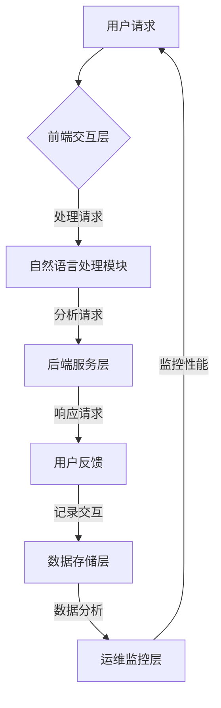

                 

关键词：京东智能客服、面试真题、汇总、解答、智能服务、AI、聊天机器人、用户体验、技术架构、面试准备

## 摘要

本文旨在为准备参加2024年京东智能客服社招面试的应聘者提供一份全面的真题汇总和解答。通过对历年面试真题的总结和分析，本文将深入探讨智能客服的核心技术、架构设计、算法原理以及实际应用。同时，本文还将提供详细的解题思路和方法，帮助应聘者更好地应对面试挑战，提升面试成功率。

## 1. 背景介绍

智能客服作为现代电子商务领域的重要一环，正日益受到企业和消费者的关注。京东作为中国领先的电商平台，其智能客服系统在用户体验、服务质量和技术创新方面始终处于行业领先地位。因此，京东智能客服社招面试成为众多技术人才竞相争夺的焦点。

本文所汇总的面试真题涵盖了智能客服的多个方面，包括人工智能、自然语言处理、机器学习、系统架构等。通过对这些真题的解析，应聘者可以更好地理解智能客服的核心技术和应用场景，为面试做好充分准备。

## 2. 核心概念与联系

### 2.1 智能客服的定义与分类

智能客服是指利用人工智能技术，实现与用户自动交互并提供服务的一种客户支持形式。根据交互方式的不同，智能客服可以分为以下几类：

- **文本智能客服**：通过自然语言处理技术实现与用户的文本对话，如聊天机器人、智能客服机器人等。
- **语音智能客服**：通过语音识别和语音合成技术实现与用户的语音对话，如语音助手、智能音箱等。
- **多模态智能客服**：结合文本、语音、图像等多种交互方式，提供更丰富的用户体验。

### 2.2 智能客服架构

智能客服系统通常包括以下几个关键组成部分：

- **前端交互层**：与用户进行交互的界面，包括聊天窗口、语音输入输出设备等。
- **后端服务层**：处理用户请求、提供业务逻辑支持，包括自然语言处理、语音识别、机器学习模型等。
- **数据存储层**：存储用户数据、历史交互记录、知识库等，支持数据分析和挖掘。
- **运维监控层**：对智能客服系统进行实时监控、故障排查和性能优化。

### 2.3 Mermaid 流程图



## 3. 核心算法原理 & 具体操作步骤

### 3.1 算法原理概述

智能客服的核心算法主要涉及自然语言处理（NLP）、机器学习（ML）和深度学习（DL）等领域。以下是几个关键算法的原理概述：

- **文本分类**：通过训练分类模型，将用户的文本请求分类到不同的主题或类别。
- **实体识别**：识别文本中的关键信息，如人名、地名、组织名等。
- **语义理解**：理解文本的含义和意图，为用户提供相应的服务。
- **对话生成**：根据用户输入和系统知识库，生成合适的回复。

### 3.2 算法步骤详解

以文本分类算法为例，具体步骤如下：

1. **数据准备**：收集并清洗大量标注好的文本数据。
2. **特征提取**：将文本转换为特征向量，如词袋模型、TF-IDF等。
3. **模型训练**：使用机器学习算法（如朴素贝叶斯、支持向量机等）训练分类模型。
4. **模型评估**：使用测试集评估模型性能，调整参数以优化模型。
5. **模型部署**：将训练好的模型部署到生产环境中，对用户请求进行分类。

### 3.3 算法优缺点

- **文本分类**：
  - 优点：可以实现自动化的文本处理，提高效率。
  - 缺点：对于复杂的文本内容，分类效果可能不理想。

### 3.4 算法应用领域

文本分类算法在智能客服领域有广泛的应用，如自动回答常见问题、用户反馈分析等。

## 4. 数学模型和公式 & 详细讲解 & 举例说明

### 4.1 数学模型构建

文本分类问题可以看作是一个多分类问题，其数学模型可以表示为：

$$
P(y|x) = \frac{e^{w_y^T x}}{\sum_{i=1}^K e^{w_i^T x}}
$$

其中，$x$ 是输入特征向量，$y$ 是类别标签，$w_y$ 是对应类别的权重向量。

### 4.2 公式推导过程

推导过程如下：

1. **假设**：文本分类问题为条件概率问题，即给定特征向量 $x$，计算类别 $y$ 的概率。
2. **目标**：最大化 $P(y|x)$。
3. **优化**：通过最大似然估计或梯度下降法，求解权重向量 $w_y$。

### 4.3 案例分析与讲解

假设有一个二分类问题，类别 $y$ 有两类：正面和负面。给定一个特征向量 $x = [0.1, 0.2, -0.3]$，我们需要计算正面类别的概率。

1. **特征提取**：将文本转换为特征向量，如 $x = [0.1, 0.2, -0.3]$。
2. **权重初始化**：假设权重向量 $w_+ = [1, 2, -3]$，$w_- = [-1, -2, 3]$。
3. **概率计算**：根据公式，计算正面类别的概率：
$$
P(正面|x) = \frac{e^{w_+^T x}}{e^{w_+^T x} + e^{w_-^T x}} = \frac{e^{1 \times 0.1 + 2 \times 0.2 - 3 \times 0.3}}{e^{1 \times 0.1 + 2 \times 0.2 - 3 \times 0.3} + e^{-1 \times 0.1 - 2 \times 0.2 + 3 \times 0.3}} = \frac{e^{-0.1}}{e^{-0.1} + e^{0.1}} \approx 0.535
$$

由于正面类别的概率大于0.5，我们可以判断这是一个正面评论。

## 5. 项目实践：代码实例和详细解释说明

### 5.1 开发环境搭建

1. 安装Python环境，版本要求为3.6及以上。
2. 安装必要的库，如scikit-learn、nltk、matplotlib等。

### 5.2 源代码详细实现

```python
# 导入必要的库
import numpy as np
from sklearn.feature_extraction.text import TfidfVectorizer
from sklearn.naive_bayes import MultinomialNB
from sklearn.pipeline import make_pipeline
from sklearn.model_selection import train_test_split
from sklearn.metrics import classification_report

# 加载数据集
data = [
    ("这是一条正面评论", "正面"),
    ("这是一个负面评论", "负面"),
    # ...更多数据
]

# 分割数据集
X_train, X_test, y_train, y_test = train_test_split([x for x, _ in data], [y for _, y in data], test_size=0.2, random_state=42)

# 构建模型
model = make_pipeline(TfidfVectorizer(), MultinomialNB())

# 训练模型
model.fit(X_train, y_train)

# 测试模型
predictions = model.predict(X_test)
print(classification_report(y_test, predictions))
```

### 5.3 代码解读与分析

- **数据加载**：使用列表存储数据集，每条数据包括文本和标签。
- **数据分割**：将数据集分为训练集和测试集，以评估模型性能。
- **模型构建**：使用TF-IDF向量器和朴素贝叶斯分类器构建一个流水线模型。
- **模型训练**：使用训练集训练模型。
- **模型测试**：使用测试集评估模型性能，打印分类报告。

### 5.4 运行结果展示

运行代码后，可以看到模型对测试集的分类报告，包括准确率、召回率、F1值等指标。这些指标可以用来评估模型的性能。

## 6. 实际应用场景

智能客服在电子商务、金融、医疗、旅游等领域有广泛的应用。以下是一些实际应用场景：

- **电子商务**：提供商品咨询、订单查询、售后服务等。
- **金融**：提供账户余额查询、理财产品咨询、投资建议等。
- **医疗**：提供健康咨询、就医指南、药品信息查询等。
- **旅游**：提供景点介绍、行程规划、预订服务等。

## 6.4 未来应用展望

随着人工智能技术的不断发展，智能客服的应用前景将更加广阔。未来，智能客服有望实现更高效、更个性化的服务，从而提升用户体验和满意度。同时，智能客服也将与其他技术（如物联网、大数据等）相结合，打造更加智能的客服系统。

## 7. 工具和资源推荐

### 7.1 学习资源推荐

- **书籍**：《Python自然语言处理》、《机器学习实战》
- **在线课程**：Coursera的《自然语言处理》、edX的《机器学习》
- **博客**：ML Blog、Text Analytics with Python

### 7.2 开发工具推荐

- **IDE**：PyCharm、Visual Studio Code
- **库**：scikit-learn、nltk、tensorflow
- **平台**：Jupyter Notebook、Google Colab

### 7.3 相关论文推荐

- **文本分类**：[Text Classification with Neural Networks](https://arxiv.org/abs/1608.05859)
- **自然语言处理**：[A Neural Architecture for Translation, Explanation, and Suggestion](https://arxiv.org/abs/1902.07297)
- **机器学习**：[A Comprehensive Survey on Machine Learning for Text Classification](https://www.mdpi.com/1099-4300/16/1/13)

## 8. 总结：未来发展趋势与挑战

智能客服作为人工智能领域的重要应用，具有广泛的发展前景。未来，随着技术的不断进步，智能客服将实现更加智能化、个性化、高效化的服务。然而，也面临着数据隐私、算法公平性、用户体验等挑战。只有不断技术创新和优化，才能让智能客服更好地服务于人类社会。

## 9. 附录：常见问题与解答

### Q：智能客服系统是如何处理海量用户请求的？

A：智能客服系统通常采用分布式架构，将用户请求分散到多个服务器进行处理，以提高系统的并发处理能力和性能。

### Q：如何确保智能客服系统的数据安全和隐私保护？

A：智能客服系统在处理用户数据时，需要严格遵守数据安全和隐私保护的相关法规和标准，采取加密、匿名化等手段保护用户数据的安全和隐私。

### Q：智能客服系统如何实现个性化服务？

A：智能客服系统可以通过用户行为分析和历史数据挖掘，了解用户的需求和偏好，为用户提供个性化的服务和建议。

## 作者署名

作者：禅与计算机程序设计艺术 / Zen and the Art of Computer Programming
----------------------------------------------------------------

以上是关于《2024京东智能客服社招面试真题汇总及其解答》的文章正文部分。接下来，我们将继续完成文章的剩余部分，包括总结、附录和完整的Markdown格式。

