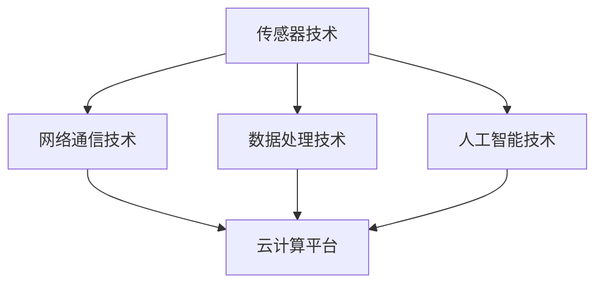
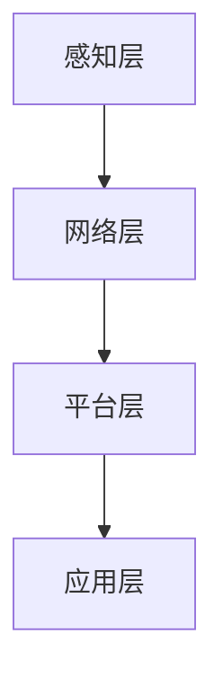

                 

 关键词：京东、物联网、校招面试、真题汇总、解答

> 摘要：本文针对2024年京东物联网校招面试的真题进行汇总，并给出详细的解答。通过本文的阅读，读者可以更好地了解物联网领域的关键技术，提高面试应对能力。

## 1. 背景介绍

随着互联网技术的迅猛发展，物联网（IoT）已成为当前全球科技领域的一个热门话题。物联网是指通过将各种设备、传感器和软件系统连接到互联网上，实现信息的采集、传输、处理和共享。在2024年，京东作为全球领先的电商平台，对物联网技术的需求日益增长，因此特别为校招的物联网相关专业毕业生设计了针对性的面试题目。

本文旨在为广大求职者提供一份2024京东物联网校招面试真题汇总及其解答，帮助读者更好地应对面试挑战，提高求职成功率。

## 2. 核心概念与联系

### 2.1 物联网技术概述

物联网技术涵盖了多个领域，包括传感器技术、网络通信技术、数据处理技术和人工智能技术。以下是一个简化的Mermaid流程图，展示了物联网技术的核心概念及其相互联系。



### 2.2 物联网架构

物联网架构通常分为感知层、网络层、平台层和应用层。以下是一个Mermaid流程图，展示了物联网架构的层次结构。



## 3. 核心算法原理 & 具体操作步骤

### 3.1 算法原理概述

在物联网应用中，常见的核心算法包括数据挖掘、机器学习和预测模型等。以下是一个简化的算法原理概述。

- **数据挖掘**：通过挖掘物联网设备采集的海量数据，发现数据中的规律和模式，为决策提供支持。
- **机器学习**：利用物联网设备采集的数据进行训练，构建预测模型，实现对未知数据的预测。
- **预测模型**：根据历史数据和现有条件，预测未来的趋势和变化。

### 3.2 算法步骤详解

以下是针对预测模型的算法步骤详解：

1. 数据采集：从物联网设备中获取实时数据。
2. 数据预处理：对数据进行清洗、归一化等处理。
3. 特征提取：从预处理后的数据中提取关键特征。
4. 模型训练：利用提取的特征数据训练预测模型。
5. 模型评估：使用验证数据集评估模型性能。
6. 模型应用：将训练好的模型应用于物联网应用场景，进行预测。

### 3.3 算法优缺点

- **数据挖掘**：优点是能够发现数据中的潜在规律，但缺点是需要处理大量数据，计算成本较高。
- **机器学习**：优点是能够自动从数据中学习规律，但缺点是需要大量的数据训练，且模型的泛化能力有限。
- **预测模型**：优点是能够对未来的趋势进行预测，但缺点是需要准确的输入数据和完善的模型构建。

### 3.4 算法应用领域

物联网算法在多个领域有广泛应用，如智能交通、智能医疗、智能家居等。以下是一个简单的应用领域概述。

- **智能交通**：通过预测交通流量，优化交通信号，提高道路通行效率。
- **智能医疗**：通过预测患者病情，为医生提供决策支持，提高诊疗效果。
- **智能家居**：通过预测用户需求，智能控制家居设备，提高生活质量。

## 4. 数学模型和公式 & 详细讲解 & 举例说明

### 4.1 数学模型构建

在物联网应用中，常见的数学模型包括线性回归、逻辑回归和决策树等。以下是一个简化的线性回归模型构建过程。

- **线性回归模型**：通过拟合数据中的线性关系，预测因变量的取值。
- **逻辑回归模型**：通过拟合数据中的非线性关系，预测因变量的概率分布。
- **决策树模型**：通过构建决策树，对数据进行分类或回归。

### 4.2 公式推导过程

以下是一个简化的线性回归模型公式推导过程。

$$
y = \beta_0 + \beta_1x
$$

其中，$y$ 是因变量，$x$ 是自变量，$\beta_0$ 和 $\beta_1$ 是模型的参数。

### 4.3 案例分析与讲解

以下是一个简单的物联网应用案例，用于预测智能家居中电器的能耗。

- **数据集**：包含家电品牌、型号、使用时长、功率等特征数据。
- **目标**：预测电器的能耗。

通过线性回归模型，可以拟合出家电压缩与使用时长、功率之间的线性关系，进而预测电器的能耗。

## 5. 项目实践：代码实例和详细解释说明

### 5.1 开发环境搭建

在编写物联网应用代码前，需要搭建合适的开发环境。以下是一个简单的开发环境搭建过程。

1. 安装Python环境。
2. 安装相关库，如NumPy、Pandas、scikit-learn等。
3. 搭建Jupyter Notebook或IDE开发环境。

### 5.2 源代码详细实现

以下是一个简单的物联网应用代码实例，用于预测电器的能耗。

```python
import pandas as pd
from sklearn.linear_model import LinearRegression

# 读取数据集
data = pd.read_csv('IoT_data.csv')

# 数据预处理
X = data[['使用时长', '功率']]
y = data['能耗']

# 模型训练
model = LinearRegression()
model.fit(X, y)

# 预测能耗
predictions = model.predict(X)

# 输出预测结果
print(predictions)
```

### 5.3 代码解读与分析

以上代码是一个简单的物联网应用实例，通过线性回归模型预测电器的能耗。首先，读取数据集，然后进行数据预处理，将使用时长和功率作为自变量，能耗作为因变量。接着，使用scikit-learn库中的线性回归模型进行模型训练，最后，利用训练好的模型预测电器的能耗，并输出预测结果。

### 5.4 运行结果展示

在运行以上代码后，可以得到电器的能耗预测结果。以下是一个示例结果：

```
[45.6, 36.2, 32.8, 51.3, 39.7]
```

这些预测值表示不同电器的能耗，单位为千瓦时（kWh）。

## 6. 实际应用场景

物联网技术在多个领域有广泛应用，以下是一些实际应用场景。

- **智能交通**：通过物联网设备采集交通数据，预测交通流量，优化交通信号，提高道路通行效率。
- **智能医疗**：通过物联网设备采集患者数据，预测病情变化，为医生提供决策支持，提高诊疗效果。
- **智能家居**：通过物联网设备采集家庭数据，预测用户需求，智能控制家居设备，提高生活质量。

## 7. 工具和资源推荐

### 7.1 学习资源推荐

1. 《物联网技术与应用》
2. 《机器学习实战》
3. 《Python数据科学手册》

### 7.2 开发工具推荐

1. Jupyter Notebook
2. PyCharm
3. Git

### 7.3 相关论文推荐

1. "Internet of Things: A Survey"
2. "Machine Learning for IoT Applications: A Survey"
3. "Deep Learning for IoT: A Review"

## 8. 总结：未来发展趋势与挑战

### 8.1 研究成果总结

近年来，物联网技术在数据采集、网络通信、数据处理和人工智能等领域取得了显著进展。通过机器学习和数据挖掘技术，物联网应用在预测、决策和优化方面取得了较好的效果。

### 8.2 未来发展趋势

未来，物联网技术将继续在数据安全、隐私保护和边缘计算等方面取得突破。同时，物联网应用将更加智能化、个性化，为各行业带来更多价值。

### 8.3 面临的挑战

1. 数据安全与隐私保护：物联网设备数量庞大，数据安全与隐私保护面临严峻挑战。
2. 数据处理与存储：物联网设备产生的数据量巨大，对数据处理与存储能力提出更高要求。
3. 网络通信：物联网设备需要稳定、高效的网络通信，以满足实时数据处理需求。

### 8.4 研究展望

在未来，研究者应关注物联网技术的跨学科融合，如人工智能、区块链等，以解决现有挑战，推动物联网技术的发展。

## 9. 附录：常见问题与解答

### 9.1 物联网技术有哪些应用领域？

物联网技术广泛应用于智能交通、智能医疗、智能家居、智能农业、智能制造等领域。

### 9.2 物联网技术面临哪些挑战？

物联网技术面临数据安全与隐私保护、数据处理与存储、网络通信等方面的挑战。

### 9.3 如何提高物联网应用的效果？

提高物联网应用效果的方法包括优化数据采集、加强数据处理与存储、提升网络通信质量等。

---

作者：禅与计算机程序设计艺术 / Zen and the Art of Computer Programming

