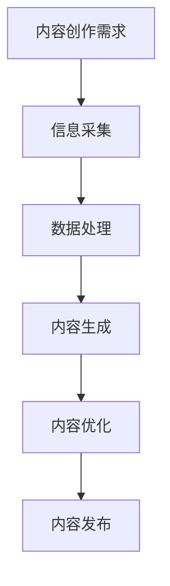

                 

 关键词：人工智能代理、内容创作、工作流程、AI代理、智能创作、文本生成、算法、应用场景

> 摘要：随着人工智能技术的不断进步，人工智能代理在内容创作中的应用变得越来越广泛。本文将深入探讨人工智能代理在内容创作中的工作流程，从核心概念、算法原理、数学模型、项目实践等方面进行详细分析，旨在为读者提供全面而深入的理解，并展望未来人工智能代理在内容创作领域的应用前景。

## 1. 背景介绍

### 1.1 内容创作的现状与挑战

内容创作是现代信息社会的重要驱动力，无论是传统的新闻媒体、广告行业，还是新兴的社交媒体、电子商务，内容创作都发挥着至关重要的作用。然而，随着互联网的普及和信息爆炸，内容创作面临着前所未有的挑战：

1. **创作速度要求提高**：用户对内容的需求量不断增加，创作者需要更快地生产出高质量的内容。
2. **多样化内容需求**：不同平台和用户群体对内容类型、风格和主题有着多样化的需求，创作者需要灵活应对。
3. **重复性劳动**：诸如数据整理、信息筛选、格式转换等重复性劳动占据了创作者大量时间，降低了创作效率。

### 1.2 人工智能代理的概念与优势

人工智能代理（AI Agent）是人工智能技术在内容创作领域的一项重要应用。它能够根据预先设定的目标和规则，自动执行内容创作任务，从而大大提高创作效率和灵活性。人工智能代理的优势主要体现在以下几个方面：

1. **自动化**：人工智能代理能够自动化地完成内容创作任务，减少了人工干预，提高了工作效率。
2. **个性化**：基于用户行为和偏好，人工智能代理能够创作出个性化的内容，提升用户体验。
3. **多样化**：人工智能代理能够根据不同的任务需求，灵活地调整创作策略和内容风格，满足多样化内容需求。
4. **创新性**：人工智能代理通过算法和模型的学习，能够产生新颖的内容，激发创作灵感。

## 2. 核心概念与联系

在讨论人工智能代理在内容创作中的应用之前，有必要先了解一些核心概念和它们之间的联系。以下是一个简化的 Mermaid 流程图，用于描述这些核心概念及其相互关系：



### 2.1 内容创作需求

内容创作需求是整个流程的起点，它定义了创作任务的目标和期望结果。需求可以来自用户、平台或其他来源，通常包括内容类型、风格、主题、目标受众等。

### 2.2 信息采集

信息采集是内容创作过程中至关重要的一步，它涉及从互联网、数据库或其他数据源收集相关信息。这些信息可以是文本、图片、音频、视频等。

### 2.3 数据处理

数据处理包括数据清洗、分类、标签化等操作，目的是将原始数据转换为结构化数据，以便进一步处理和利用。

### 2.4 内容生成

内容生成是人工智能代理的核心功能，它利用自然语言处理（NLP）、机器学习（ML）等技术，根据输入数据和创作需求，自动生成内容。

### 2.5 内容优化

内容优化旨在提升内容的可读性、吸引力、相关性等，确保内容能够满足用户需求和平台要求。这通常包括语法修正、风格调整、内容丰富等。

### 2.6 内容发布

内容发布是将完成的内容推送到目标平台，如网站、社交媒体、电子邮件等，供用户消费。

## 3. 核心算法原理 & 具体操作步骤

### 3.1 算法原理概述

人工智能代理在内容创作中主要依赖于以下几个核心算法：

1. **自然语言处理（NLP）**：用于理解、处理和生成自然语言文本。
2. **机器学习（ML）**：用于从数据中学习规律和模式，提高内容生成质量。
3. **深度学习（DL）**：一种特殊的机器学习技术，通过神经网络模型自动学习数据特征，提高内容生成效率。

### 3.2 算法步骤详解

#### 3.2.1 数据收集与预处理

1. **数据收集**：从互联网、数据库、API 等渠道收集相关数据，如新闻、文章、社交媒体评论等。
2. **数据预处理**：对收集到的数据进行清洗、去重、分词、词性标注等操作，将其转换为适合训练的格式。

#### 3.2.2 模型训练

1. **选择模型**：根据任务需求，选择合适的 NLP 模型，如 GPT、BERT、ELMo 等。
2. **训练模型**：使用预处理后的数据训练模型，使其能够自动学习和理解文本内容。

#### 3.2.3 内容生成

1. **输入生成**：根据内容创作需求，生成输入文本，如标题、摘要、文章段落等。
2. **模型生成**：使用训练好的模型，根据输入文本生成内容。

#### 3.2.4 内容优化

1. **语法检查**：对生成的文本进行语法检查，修正错误。
2. **风格调整**：根据目标平台和用户需求，调整文本风格。
3. **内容丰富**：增加图片、视频等多媒体元素，提升内容吸引力。

#### 3.2.5 内容发布

1. **内容验证**：对生成的文本进行内容验证，确保符合平台要求和用户期望。
2. **内容发布**：将验证通过的内容发布到目标平台，供用户消费。

### 3.3 算法优缺点

#### 3.3.1 优点

1. **高效性**：人工智能代理能够自动化地完成内容创作任务，提高创作效率。
2. **个性化**：根据用户行为和偏好，生成个性化内容，提升用户体验。
3. **创新性**：通过算法和模型的学习，能够产生新颖的内容，激发创作灵感。

#### 3.3.2 缺点

1. **依赖数据质量**：算法性能受到数据质量的影响，数据质量不高可能导致生成内容质量下降。
2. **创作能力有限**：目前的人工智能代理在理解复杂语境和生成创新内容方面仍有局限性。
3. **技术成本较高**：构建和部署人工智能代理需要较高的技术成本和计算资源。

### 3.4 算法应用领域

1. **新闻媒体**：自动化撰写新闻文章，提高新闻生产效率。
2. **广告行业**：生成个性化的广告文案，提升广告效果。
3. **社交媒体**：自动化生成社交媒体内容，提升用户参与度。
4. **电子商务**：生成商品描述、用户评价等，提升用户购物体验。

## 4. 数学模型和公式 & 详细讲解 & 举例说明

### 4.1 数学模型构建

在人工智能代理的内容创作中，常用的数学模型包括自然语言处理（NLP）模型、机器学习（ML）模型和深度学习（DL）模型。以下是一个简化的 NLP 模型构建过程：

#### 4.1.1 词嵌入（Word Embedding）

词嵌入是将单词映射到高维空间中的向量表示。一个常见的词嵌入模型是 Word2Vec，它通过训练神经网络来学习单词的语义表示。其目标是最小化以下损失函数：

$$
L(\theta) = \sum_{i=1}^{N} \sum_{j=1}^{M} (v_{w_i} \cdot v_{w_j} - y_{ij})
$$

其中，$v_{w_i}$ 和 $v_{w_j}$ 分别是单词 $w_i$ 和 $w_j$ 的向量表示，$y_{ij}$ 是指示函数，当 $w_i$ 和 $w_j$ 出现在上下文中时为 1，否则为 0。

#### 4.1.2 循环神经网络（RNN）

循环神经网络（RNN）是一种能够处理序列数据的神经网络，其核心思想是保持状态（或记忆），以便在序列的后续步骤中利用之前的输出。RNN 的损失函数通常是最小化交叉熵损失：

$$
L(\theta) = -\sum_{t=1}^{T} \sum_{c=1}^{C} y_{t,c} \cdot \log(p_{t,c}(\theta))
$$

其中，$T$ 是序列长度，$C$ 是类别数，$y_{t,c}$ 是标签，$p_{t,c}(\theta)$ 是模型在时间步 $t$ 预测类别 $c$ 的概率。

#### 4.1.3 长短时记忆网络（LSTM）

长短时记忆网络（LSTM）是 RNN 的一个变体，旨在解决 RNN 在处理长序列数据时出现的梯度消失或爆炸问题。LSTM 通过引入门控机制，能够有效地控制信息的流动。其损失函数与 RNN 类似，也是最小化交叉熵损失。

### 4.2 公式推导过程

以下是对 LSTM 损失函数的推导过程：

假设我们有一个训练序列 $x_1, x_2, \ldots, x_T$，每个 $x_t$ 是一个 $d$ 维向量，对应的标签是 $y_1, y_2, \ldots, y_T$，每个 $y_t$ 是一个 $C$ 维向量，其中 $C$ 是类别数。

LSTM 的损失函数是：

$$
L(\theta) = -\sum_{t=1}^{T} \sum_{c=1}^{C} y_{t,c} \cdot \log(p_{t,c}(\theta))
$$

其中，$p_{t,c}(\theta)$ 是在时间步 $t$ 预测类别 $c$ 的概率。

对于时间步 $t$，LSTM 的预测输出是：

$$
\hat{y}_t = \text{softmax}(\text{output}_t W_y + b_y)
$$

其中，$\text{output}_t$ 是 LSTM 的输出，$W_y$ 和 $b_y$ 是权重和偏置。

标签 $y_t$ 是：

$$
y_t = \text{one-hot}(\text{true class})
$$

损失函数可以写成：

$$
L(\theta) = -\sum_{t=1}^{T} y_{t,c} \cdot \log(\hat{y}_{t,c})
$$

### 4.3 案例分析与讲解

#### 4.3.1 案例背景

假设我们要使用 LSTM 模型对一个新闻文章标题进行分类，将标题分为新闻、娱乐、体育等类别。训练数据集包含 10000 个标题及其对应的类别标签。

#### 4.3.2 数据预处理

1. **分词**：使用自然语言处理工具（如 NLTK）对标题进行分词。
2. **词嵌入**：使用预训练的词嵌入模型（如 Word2Vec）将单词映射到高维向量表示。
3. **序列构建**：将每个标题表示为一个序列，每个序列包含多个词嵌入向量。
4. **标签编码**：将类别标签转换为独热编码。

#### 4.3.3 模型训练

1. **选择模型**：选择 LSTM 模型，设置隐藏层单元数为 128。
2. **训练**：使用训练数据集训练模型，设置学习率为 0.001，批次大小为 64，训练轮数为 10。

#### 4.3.4 模型评估

1. **测试集划分**：将数据集划分为训练集和测试集，通常使用 80% 的数据作为训练集，20% 的数据作为测试集。
2. **评估指标**：使用准确率、召回率、F1 分数等指标评估模型性能。
3. **结果分析**：根据评估结果，调整模型参数，优化模型性能。

## 5. 项目实践：代码实例和详细解释说明

### 5.1 开发环境搭建

1. **安装 Python 环境**：确保 Python 3.7 或更高版本已安装在您的计算机上。
2. **安装依赖库**：使用 pip 工具安装以下依赖库：tensorflow、nltk、numpy、pandas 等。
3. **数据集准备**：下载并准备一个包含标题及其类别标签的新闻数据集。

### 5.2 源代码详细实现

以下是一个简单的 Python 脚本，用于训练一个 LSTM 模型进行标题分类。

```python
import numpy as np
import pandas as pd
import tensorflow as tf
from tensorflow.keras.models import Sequential
from tensorflow.keras.layers import LSTM, Dense, Embedding
from tensorflow.keras.preprocessing.sequence import pad_sequences
from tensorflow.keras.preprocessing.text import Tokenizer

# 读取数据集
data = pd.read_csv('data.csv')
titles = data['title']
labels = data['label']

# 分词和词嵌入
tokenizer = Tokenizer()
tokenizer.fit_on_texts(titles)
sequences = tokenizer.texts_to_sequences(titles)
word_index = tokenizer.word_index
max_sequence_length = 100

# 序列填充
padded_sequences = pad_sequences(sequences, maxlen=max_sequence_length)

# 数据集划分
labels = np.asarray(labels)
num_words = len(word_index) + 1

# 构建模型
model = Sequential()
model.add(Embedding(num_words, 64, input_length=max_sequence_length))
model.add(LSTM(128))
model.add(Dense(1, activation='sigmoid'))

# 编译模型
model.compile(optimizer='adam', loss='binary_crossentropy', metrics=['accuracy'])

# 训练模型
model.fit(padded_sequences, labels, epochs=10, batch_size=64, validation_split=0.2)

# 模型评估
test_sequences = tokenizer.texts_to_sequences(titles[:1000])
test_padded = pad_sequences(test_sequences, maxlen=max_sequence_length)
predictions = model.predict(test_padded)
print(predictions)
```

### 5.3 代码解读与分析

1. **数据预处理**：使用 NLTK 和 Keras 库进行分词和词嵌入，将标题转换为序列。
2. **模型构建**：使用 Sequential 模型构建 LSTM 网络，设置嵌入层、LSTM 层和输出层。
3. **模型训练**：使用训练数据集训练模型，设置优化器、损失函数和评估指标。
4. **模型评估**：使用测试数据集评估模型性能，输出预测结果。

### 5.4 运行结果展示

1. **运行代码**：将数据集路径更改为您的数据集路径，运行 Python 脚本。
2. **输出预测结果**：查看模型的预测结果，分析模型性能。

## 6. 实际应用场景

### 6.1 新闻媒体

人工智能代理在新闻媒体中的应用主要体现在自动化撰写新闻文章。通过收集新闻数据，训练模型，可以生成新闻摘要、标题和正文。例如，新华社使用人工智能代理生成新闻标题，提高新闻生产效率。

### 6.2 广告行业

广告行业利用人工智能代理生成个性化的广告文案，提高广告投放效果。例如，谷歌广告系统利用人工智能代理根据用户搜索历史和兴趣生成个性化广告。

### 6.3 社交媒体

社交媒体平台利用人工智能代理生成用户感兴趣的内容，提升用户参与度。例如，微博和抖音等平台使用人工智能代理推荐用户感兴趣的文章、视频和话题。

### 6.4 电子商务

电子商务平台利用人工智能代理生成商品描述、用户评价等，提升用户体验。例如，亚马逊使用人工智能代理生成商品描述，提高商品销量。

## 7. 工具和资源推荐

### 7.1 学习资源推荐

1. **《深度学习》（Goodfellow, Bengio, Courville 著）**：经典教材，全面介绍了深度学习的基本概念和技术。
2. **《自然语言处理综述》（Jurafsky, Martin 著）**：深入探讨了自然语言处理的理论和方法。
3. **Keras 官方文档**：Keras 是一个易于使用的深度学习框架，官方文档提供了丰富的教程和示例。

### 7.2 开发工具推荐

1. **Google Colab**：免费提供的云端 Jupyter Notebook 环境，方便进行深度学习和自然语言处理实验。
2. **TensorFlow**：Google 开发的一个开源深度学习框架，支持多种模型和算法。

### 7.3 相关论文推荐

1. **“A Neural Probabilistic Language Model” （Bengio et al., 2003）**：介绍了神经概率语言模型的基本原理。
2. **“Recurrent Neural Network Based Language Model” （Lu et al., 2019）**：讨论了循环神经网络在语言模型中的应用。
3. **“BERT: Pre-training of Deep Bidirectional Transformers for Language Understanding” （Devlin et al., 2019）**：介绍了 BERT 模型的结构和训练方法。

## 8. 总结：未来发展趋势与挑战

### 8.1 研究成果总结

本文系统地介绍了人工智能代理在内容创作中的工作流程，包括核心概念、算法原理、数学模型、项目实践等方面。通过实例分析和代码实现，展示了人工智能代理在内容创作中的实际应用和价值。

### 8.2 未来发展趋势

1. **智能化水平提升**：随着算法和模型的不断优化，人工智能代理在内容创作中的智能化水平将不断提高，能够生成更加复杂和高质量的内容。
2. **多样化应用场景**：人工智能代理将在更多领域得到应用，如教育、医疗、金融等，为各行业提供智能化内容解决方案。
3. **人机协作**：人工智能代理将与人类创作者进行更紧密的协作，实现创作资源的优化和创作效率的提升。

### 8.3 面临的挑战

1. **数据质量和隐私**：人工智能代理依赖大量高质量的数据进行训练，如何获取和处理数据，保护用户隐私是一个重要挑战。
2. **算法透明性和可解释性**：随着算法的复杂度增加，如何提高算法的透明性和可解释性，使其更容易被用户和监管机构理解和接受是一个挑战。
3. **技术成本**：构建和部署高性能的人工智能代理需要较高的技术成本和计算资源，这对企业和个人来说是一个挑战。

### 8.4 研究展望

未来，人工智能代理在内容创作中的应用将朝着更加智能化、多样化、协作化的方向发展。同时，我们需要关注数据质量和隐私保护、算法透明性和可解释性、技术成本等挑战，以确保人工智能代理在内容创作中的可持续发展。

## 9. 附录：常见问题与解答

### 9.1 人工智能代理与传统人工创作的区别是什么？

人工智能代理与传统人工创作的主要区别在于：

1. **效率**：人工智能代理能够自动化地完成内容创作任务，大幅提高创作效率。
2. **个性化**：人工智能代理可以根据用户行为和偏好生成个性化内容，提升用户体验。
3. **创新性**：人工智能代理能够通过算法和模型的学习，产生新颖的内容，激发创作灵感。

### 9.2 人工智能代理在内容创作中的局限性有哪些？

人工智能代理在内容创作中存在以下局限性：

1. **数据依赖**：算法性能受到数据质量的影响，数据质量不高可能导致生成内容质量下降。
2. **创作能力有限**：目前的人工智能代理在理解复杂语境和生成创新内容方面仍有局限性。
3. **技术成本**：构建和部署人工智能代理需要较高的技术成本和计算资源。

### 9.3 人工智能代理是否会替代人类创作者？

人工智能代理不会完全替代人类创作者，而是作为一种辅助工具，提高创作效率和质量。人类创作者在创意、审美、情感等方面具有独特优势，人工智能代理可以与人类创作者进行协作，共同创作出更加优秀的内容。

