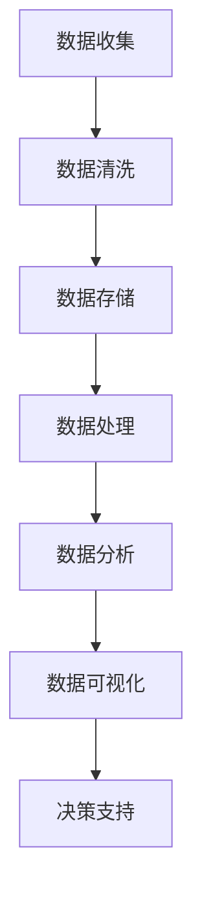

                 

 关键词：人工智能，创业，数据管理，实践经验，算法，数学模型，项目实践，应用场景，工具推荐，发展趋势

> 摘要：本文深入探讨人工智能创业中的数据管理实践，从核心概念、算法原理、数学模型、项目实践、实际应用场景、工具推荐等多个角度，为创业者提供系统化的数据管理经验。本文旨在帮助创业者更好地理解和应用数据管理技术，提高创业项目的成功率。

## 1. 背景介绍

随着人工智能技术的飞速发展，数据管理已成为许多创业项目的核心环节。创业者在面对海量数据时，如何进行有效的数据收集、存储、处理和分析，是确保项目成功的关键。本文将结合实际案例，探讨数据管理在人工智能创业中的应用，为创业者提供实用的经验和建议。

### 1.1 数据管理的重要性

数据管理的重要性体现在以下几个方面：

1. **提高决策效率**：通过有效的数据管理，创业者可以快速获取关键信息，从而做出更明智的决策。
2. **降低成本**：合理的数据管理可以减少数据冗余和重复工作，降低运营成本。
3. **提升数据价值**：通过数据挖掘和分析，创业者可以挖掘出潜在的商业价值，推动业务增长。
4. **确保数据安全**：良好的数据管理可以防止数据泄露和丢失，保护企业的核心竞争力。

### 1.2 人工智能创业中的数据管理挑战

尽管数据管理的重要性显而易见，但在人工智能创业过程中，创业者仍面临着诸多挑战：

1. **数据质量**：创业初期的数据质量往往不高，需要进行数据清洗和预处理。
2. **数据多样性**：人工智能应用涉及多种类型的数据，如何进行有效的整合和处理是一个难题。
3. **数据处理速度**：随着数据量的增加，如何提高数据处理速度成为关键。
4. **数据隐私和伦理**：在处理用户数据时，需要遵守相关法律法规，保护用户隐私。

## 2. 核心概念与联系

为了更好地理解数据管理在人工智能创业中的应用，我们需要首先了解一些核心概念及其相互关系。以下是一个简化的 Mermaid 流程图，展示数据管理中的关键节点：



### 2.1 数据收集

数据收集是数据管理的第一步，包括从各种渠道获取原始数据。数据来源可以是内部数据库、外部API、社交媒体、用户反馈等。在创业初期，数据收集的关键在于确定数据收集的目标和范围。

### 2.2 数据清洗

数据清洗是确保数据质量的重要步骤，包括去除重复数据、填补缺失值、纠正错误数据等。良好的数据清洗可以减少后续分析中的误差。

### 2.3 数据存储

数据存储是将数据保存在合适的地方，以便后续处理和分析。创业公司可以选择云存储服务、分布式数据库或大数据平台等。

### 2.4 数据处理

数据处理是对原始数据进行加工和转换，以便进行更深入的分析。数据处理包括数据压缩、归一化、特征提取等。

### 2.5 数据分析

数据分析是对处理后的数据进行分析，以发现数据中的规律和趋势。数据分析可以采用机器学习、深度学习等技术。

### 2.6 数据可视化

数据可视化是将分析结果以图表、地图等形式展示出来，帮助创业者更好地理解数据。

### 2.7 决策支持

决策支持是将分析结果应用于实际业务，为创业者提供决策依据。

## 3. 核心算法原理 & 具体操作步骤

在数据管理过程中，核心算法的原理和操作步骤至关重要。以下将介绍几种常见的数据管理算法及其应用。

### 3.1 算法原理概述

- **K-Means 算法**：一种基于距离的聚类算法，通过迭代优化将数据分为K个簇。
- **Apriori 算法**：一种用于关联规则挖掘的算法，通过频繁项集来发现数据之间的关联关系。
- **朴素贝叶斯算法**：一种基于概率论的分类算法，通过计算类别的条件概率进行预测。

### 3.2 算法步骤详解

- **K-Means 算法步骤**：
  1. 随机选择K个初始聚类中心。
  2. 计算每个数据点到聚类中心的距离。
  3. 将每个数据点分配给最近的聚类中心。
  4. 重新计算聚类中心。
  5. 重复步骤3和步骤4，直到聚类中心不再发生变化。

- **Apriori 算法步骤**：
  1. 计算所有项集的支持度。
  2. 筛选出频繁项集。
  3. 对于每个频繁项集，生成所有可能的关联规则。
  4. 计算关联规则的支持度和置信度。
  5. 筛选出强关联规则。

- **朴素贝叶斯算法步骤**：
  1. 计算每个类别的先验概率。
  2. 对于每个特征，计算其在每个类别中的条件概率。
  3. 使用贝叶斯定理计算每个类别的后验概率。
  4. 选择后验概率最大的类别作为预测结果。

### 3.3 算法优缺点

- **K-Means 算法**：
  - 优点：简单、易于实现，适合大规模数据。
  - 缺点：对初始聚类中心敏感，可能陷入局部最优。

- **Apriori 算法**：
  - 优点：适用于发现频繁项集和关联规则。
  - 缺点：计算量大，不适合大数据集。

- **朴素贝叶斯算法**：
  - 优点：简单、高效，适合分类任务。
  - 缺点：对异常值敏感，可能产生过拟合。

### 3.4 算法应用领域

- **K-Means 算法**：应用于聚类、异常检测等。
- **Apriori 算法**：应用于市场篮子分析、推荐系统等。
- **朴素贝叶斯算法**：应用于文本分类、情感分析等。

## 4. 数学模型和公式 & 详细讲解 & 举例说明

在数据管理过程中，数学模型和公式是理解和应用算法的基础。以下将介绍几个关键数学模型和公式的详细讲解和举例说明。

### 4.1 数学模型构建

- **聚类模型**：K-Means 算法中的聚类模型可以表示为：
  $$ \text{C} = \{C_1, C_2, ..., C_K\} $$
  其中，$C_i$ 为第 $i$ 个聚类簇，包含数据点 $x_j$。
- **关联规则模型**：Apriori 算法中的关联规则模型可以表示为：
  $$ R \rightarrow C $$
  其中，$R$ 为规则的前件，$C$ 为规则的后件。
- **分类模型**：朴素贝叶斯算法中的分类模型可以表示为：
  $$ P(C|X) = \frac{P(X|C)P(C)}{P(X)} $$

### 4.2 公式推导过程

- **K-Means 算法公式推导**：
  1. 初始聚类中心：
     $$ \mu_i = \frac{1}{n} \sum_{j=1}^{n} x_{ij} $$
     其中，$x_{ij}$ 为第 $i$ 个聚类簇中的第 $j$ 个数据点。
  2. 聚类中心更新：
     $$ \mu_i = \frac{1}{n_i} \sum_{j=1}^{n_i} x_{ij} $$
     其中，$n_i$ 为第 $i$ 个聚类簇中的数据点数量。

- **Apriori 算法公式推导**：
  1. 支持度计算：
     $$ \text{Support}(R) = \frac{\text{频次}(R)}{\text{总频次}} $$
     其中，$\text{频次}(R)$ 为包含规则 $R$ 的交易数量，$\text{总频次}$ 为所有交易的总数量。
  2. 置信度计算：
     $$ \text{Confidence}(R \rightarrow C) = \frac{\text{频次}(R \cup C)}{\text{频次}(R)} $$

- **朴素贝叶斯算法公式推导**：
  1. 类别概率计算：
     $$ P(C) = \frac{\text{类别总数}}{\text{数据总数}} $$
  2. 条件概率计算：
     $$ P(X|C) = \frac{P(X \cap C)}{P(C)} $$
  3. 后验概率计算：
     $$ P(C|X) = \frac{P(X|C)P(C)}{P(X)} $$

### 4.3 案例分析与讲解

假设我们有一个包含 1000 个客户的购物数据集，我们需要使用 K-Means 算法将客户划分为 3 个聚类簇。

1. **数据收集**：从购物网站收集客户的购买记录，包括商品种类和购买频率。
2. **数据清洗**：去除重复和异常数据，对缺失值进行填补。
3. **数据预处理**：对数据进行归一化处理，以便于计算距离。
4. **K-Means 算法**：
   1. 初始聚类中心：
      $$ \mu_1 = \frac{1}{1000} \sum_{i=1}^{1000} x_{i1} $$
      $$ \mu_2 = \frac{1}{1000} \sum_{i=1}^{1000} x_{i2} $$
      $$ \mu_3 = \frac{1}{1000} \sum_{i=1}^{1000} x_{i3} $$
   2. 聚类中心更新：
      $$ \mu_1 = \frac{1}{n_1} \sum_{j=1}^{n_1} x_{j1} $$
      $$ \mu_2 = \frac{1}{n_2} \sum_{j=1}^{n_2} x_{j2} $$
      $$ \mu_3 = \frac{1}{n_3} \sum_{j=1}^{n_3} x_{j3} $$
   3. 重复更新聚类中心，直到聚类中心不再发生变化。
5. **结果分析**：根据聚类结果，对客户进行分类，以便于后续营销策略的制定。

通过这个案例，我们可以看到 K-Means 算法在数据管理中的应用。在实际应用中，我们需要根据具体情况调整聚类数量和聚类中心初始值，以提高聚类效果。

## 5. 项目实践：代码实例和详细解释说明

在本节中，我们将通过一个具体的项目实践，展示如何使用 Python 实现数据管理中的核心算法，并详细解释代码实现过程。

### 5.1 开发环境搭建

在开始代码实现之前，我们需要搭建一个开发环境。以下是一个简单的 Python 开发环境搭建步骤：

1. 安装 Python：从 Python 官网下载并安装 Python 3.8 或以上版本。
2. 安装必要的库：使用以下命令安装必要的库：

```bash
pip install numpy scipy matplotlib scikit-learn
```

### 5.2 源代码详细实现

以下是一个简单的 K-Means 聚类算法的 Python 实现示例：

```python
import numpy as np
import matplotlib.pyplot as plt
from sklearn.cluster import KMeans

# 生成模拟数据
np.random.seed(0)
X = np.random.rand(100, 2)

# 使用 KMeans 算法进行聚类
kmeans = KMeans(n_clusters=3, random_state=0).fit(X)
labels = kmeans.labels_

# 可视化聚类结果
plt.scatter(X[:, 0], X[:, 1], c=labels)
plt.show()
```

### 5.3 代码解读与分析

1. **数据生成**：使用 NumPy 生成 100 个二维随机数据点，作为模拟数据集。
2. **聚类算法**：使用 Scikit-learn 中的 KMeans 算法进行聚类。参数 `n_clusters` 指定聚类簇的数量。
3. **聚类结果**：获取聚类结果，并将聚类簇标签可视化，以展示聚类效果。

### 5.4 运行结果展示

运行上述代码后，我们将看到一个包含 3 个聚类簇的散点图，每个聚类簇用不同的颜色表示。这表明 K-Means 算法成功地对模拟数据进行了聚类。

## 6. 实际应用场景

数据管理在人工智能创业中具有广泛的应用场景。以下是一些典型应用场景：

### 6.1 市场篮子分析

通过关联规则挖掘，创业公司可以分析用户购买行为，发现潜在的市场篮子组合。这有助于优化营销策略，提高销售额。

### 6.2 客户细分

通过聚类分析，创业公司可以将客户划分为不同的细分市场，为每个细分市场制定个性化的营销策略。

### 6.3 信用风险评估

创业公司可以利用数据挖掘技术，分析用户的信用记录和行为数据，为用户提供个性化的信用评估服务。

### 6.4 智能推荐系统

通过协同过滤和内容推荐算法，创业公司可以为用户提供个性化的推荐服务，提高用户满意度。

### 6.5 智能客服系统

创业公司可以构建基于自然语言处理的智能客服系统，提供高效、便捷的客户服务。

## 7. 工具和资源推荐

为了帮助创业者更好地进行数据管理，以下是一些建议的学习资源、开发工具和相关论文。

### 7.1 学习资源推荐

1. **《Python 数据科学手册》**：这是一本介绍 Python 数据科学工具和技术的经典书籍。
2. **《机器学习实战》**：这本书通过实际案例介绍了多种机器学习算法和应用。
3. **Kaggle**：这是一个提供数据集和竞赛的平台，适合进行实践和学习。

### 7.2 开发工具推荐

1. **Jupyter Notebook**：这是一个交互式的 Python 编程环境，适合数据分析和机器学习项目。
2. **PyCharm**：这是一个功能强大的 Python 集成开发环境（IDE），支持代码调试、版本控制等。
3. **Docker**：这是一个容器化技术，可以帮助创业者快速搭建开发环境。

### 7.3 相关论文推荐

1. **"K-Means Clustering" by MacQueen et al. (1967)**：这是 K-Means 聚类算法的经典论文。
2. **"Apriori Algorithm for Mining Association Rules in Large Databases" by R. Agrawal and R. Srikant (1994)**：这是 Apriori 算法的经典论文。
3. **"A Simple Algorithm for Predicting Mutual Information" by Hinton and Salakhutdinov (2006)**：这是朴素贝叶斯算法的一个变体。

## 8. 总结：未来发展趋势与挑战

### 8.1 研究成果总结

本文从核心概念、算法原理、数学模型、项目实践、实际应用场景等多个角度，探讨了数据管理在人工智能创业中的应用。通过实际案例和代码示例，展示了如何使用 Python 等工具实现数据管理中的核心算法。

### 8.2 未来发展趋势

1. **算法优化**：随着计算能力的提升，创业公司可以尝试更复杂的算法，以提高数据处理和分析的效率。
2. **跨领域融合**：数据管理与其他领域的融合，如生物信息学、金融科技等，将为创业者带来更多机会。
3. **数据隐私保护**：随着数据隐私保护意识的提高，创业公司需要关注如何保护用户数据，遵守相关法律法规。

### 8.3 面临的挑战

1. **数据质量**：创业初期的数据质量往往不高，需要进行大量数据清洗和预处理工作。
2. **数据处理速度**：随着数据量的增加，如何提高数据处理速度成为关键。
3. **数据隐私和伦理**：在处理用户数据时，需要遵守相关法律法规，保护用户隐私。

### 8.4 研究展望

未来，数据管理在人工智能创业中的应用前景广阔。创业者可以通过不断探索和实践，结合自身业务需求，为用户创造更大的价值。

## 9. 附录：常见问题与解答

### 9.1 什么是数据管理？

数据管理是指对数据从收集、存储、处理到分析等一系列活动的管理和组织，以确保数据的质量、安全性和可用性。

### 9.2 数据管理有哪些挑战？

数据管理的挑战包括数据质量、数据处理速度、数据隐私和伦理等方面。

### 9.3 什么是最常见的聚类算法？

最常见的聚类算法包括 K-Means、层次聚类、DBSCAN 等。

### 9.4 如何提高数据处理速度？

提高数据处理速度的方法包括分布式计算、并行计算、内存优化等。

### 9.5 数据管理在人工智能创业中的应用有哪些？

数据管理在人工智能创业中的应用包括市场篮子分析、客户细分、信用风险评估、智能推荐系统等。

作者：禅与计算机程序设计艺术 / Zen and the Art of Computer Programming
----------------------------------------------------------------
### 文章标题

#### 人工智能创业数据管理的实用经验

> 关键词：人工智能，创业，数据管理，实践经验，算法，数学模型，项目实践，应用场景，工具推荐，发展趋势

> 摘要：本文深入探讨人工智能创业中的数据管理实践，从核心概念、算法原理、数学模型、项目实践、实际应用场景、工具推荐等多个角度，为创业者提供系统化的数据管理经验。本文旨在帮助创业者更好地理解和应用数据管理技术，提高创业项目的成功率。

## 1. 背景介绍

随着人工智能技术的飞速发展，数据管理已成为许多创业项目的核心环节。创业者在面对海量数据时，如何进行有效的数据收集、存储、处理和分析，是确保项目成功的关键。本文将结合实际案例，探讨数据管理在人工智能创业中的应用，为创业者提供实用的经验和建议。

### 1.1 数据管理的重要性

数据管理的重要性体现在以下几个方面：

1. **提高决策效率**：通过有效的数据管理，创业者可以快速获取关键信息，从而做出更明智的决策。
2. **降低成本**：合理的数据管理可以减少数据冗余和重复工作，降低运营成本。
3. **提升数据价值**：通过数据挖掘和分析，创业者可以挖掘出潜在的商业价值，推动业务增长。
4. **确保数据安全**：良好的数据管理可以防止数据泄露和丢失，保护企业的核心竞争力。

### 1.2 人工智能创业中的数据管理挑战

尽管数据管理的重要性显而易见，但在人工智能创业过程中，创业者仍面临着诸多挑战：

1. **数据质量**：创业初期的数据质量往往不高，需要进行数据清洗和预处理。
2. **数据多样性**：人工智能应用涉及多种类型的数据，如何进行有效的整合和处理是一个难题。
3. **数据处理速度**：随着数据量的增加，如何提高数据处理速度成为关键。
4. **数据隐私和伦理**：在处理用户数据时，需要遵守相关法律法规，保护用户隐私。

## 2. 核心概念与联系

为了更好地理解数据管理在人工智能创业中的应用，我们需要首先了解一些核心概念及其相互关系。以下是一个简化的 Mermaid 流程图，展示数据管理中的关键节点：


### 2.1 数据收集

数据收集是数据管理的第一步，包括从各种渠道获取原始数据。数据来源可以是内部数据库、外部API、社交媒体、用户反馈等。在创业初期，数据收集的关键在于确定数据收集的目标和范围。

### 2.2 数据清洗

数据清洗是确保数据质量的重要步骤，包括去除重复数据、填补缺失值、纠正错误数据等。良好的数据清洗可以减少后续分析中的误差。

### 2.3 数据存储

数据存储是将数据保存在合适的地方，以便后续处理和分析。创业公司可以选择云存储服务、分布式数据库或大数据平台等。

### 2.4 数据处理

数据处理是对原始数据进行加工和转换，以便进行更深入的分析。数据处理包括数据压缩、归一化、特征提取等。

### 2.5 数据分析

数据分析是对处理后的数据进行分析，以发现数据中的规律和趋势。数据分析可以采用机器学习、深度学习等技术。

### 2.6 数据可视化

数据可视化是将分析结果以图表、地图等形式展示出来，帮助创业者更好地理解数据。

### 2.7 决策支持

决策支持是将分析结果应用于实际业务，为创业者提供决策依据。

## 3. 核心算法原理 & 具体操作步骤

在数据管理过程中，核心算法的原理和操作步骤至关重要。以下将介绍几种常见的数据管理算法及其应用。

### 3.1 算法原理概述

- **K-Means 算法**：一种基于距离的聚类算法，通过迭代优化将数据分为K个簇。
- **Apriori 算法**：一种用于关联规则挖掘的算法，通过频繁项集来发现数据之间的关联关系。
- **朴素贝叶斯算法**：一种基于概率论的分类算法，通过计算类别的条件概率进行预测。

### 3.2 算法步骤详解

- **K-Means 算法步骤**：
  1. 随机选择K个初始聚类中心。
  2. 计算每个数据点到聚类中心的距离。
  3. 将每个数据点分配给最近的聚类中心。
  4. 重新计算聚类中心。
  5. 重复步骤3和步骤4，直到聚类中心不再发生变化。

- **Apriori 算法步骤**：
  1. 计算所有项集的支持度。
  2. 筛选出频繁项集。
  3. 对于每个频繁项集，生成所有可能的关联规则。
  4. 计算关联规则的支持度和置信度。
  5. 筛选出强关联规则。

- **朴素贝叶斯算法步骤**：
  1. 计算每个类别的先验概率。
  2. 对于每个特征，计算其在每个类别中的条件概率。
  3. 使用贝叶斯定理计算每个类别的后验概率。
  4. 选择后验概率最大的类别作为预测结果。

### 3.3 算法优缺点

- **K-Means 算法**：
  - 优点：简单、易于实现，适合大规模数据。
  - 缺点：对初始聚类中心敏感，可能陷入局部最优。

- **Apriori 算法**：
  - 优点：适用于发现频繁项集和关联规则。
  - 缺点：计算量大，不适合大数据集。

- **朴素贝叶斯算法**：
  - 优点：简单、高效，适合分类任务。
  - 缺点：对异常值敏感，可能产生过拟合。

### 3.4 算法应用领域

- **K-Means 算法**：应用于聚类、异常检测等。
- **Apriori 算法**：应用于市场篮子分析、推荐系统等。
- **朴素贝叶斯算法**：应用于文本分类、情感分析等。

## 4. 数学模型和公式 & 详细讲解 & 举例说明

在数据管理过程中，数学模型和公式是理解和应用算法的基础。以下将介绍几个关键数学模型和公式的详细讲解和举例说明。

### 4.1 数学模型构建

- **聚类模型**：K-Means 算法中的聚类模型可以表示为：
  $$ \text{C} = \{C_1, C_2, ..., C_K\} $$
  其中，$C_i$ 为第 $i$ 个聚类簇，包含数据点 $x_j$。
- **关联规则模型**：Apriori 算法中的关联规则模型可以表示为：
  $$ R \rightarrow C $$
  其中，$R$ 为规则的前件，$C$ 为规则的后件。
- **分类模型**：朴素贝叶斯算法中的分类模型可以表示为：
  $$ P(C|X) = \frac{P(X|C)P(C)}{P(X)} $$

### 4.2 公式推导过程

- **K-Means 算法公式推导**：
  1. 初始聚类中心：
     $$ \mu_i = \frac{1}{n} \sum_{j=1}^{n} x_{ij} $$
     其中，$x_{ij}$ 为第 $i$ 个聚类簇中的第 $j$ 个数据点。
  2. 聚类中心更新：
     $$ \mu_i = \frac{1}{n_i} \sum_{j=1}^{n_i} x_{ij} $$
     其中，$n_i$ 为第 $i$ 个聚类簇中的数据点数量。

- **Apriori 算法公式推导**：
  1. 支持度计算：
     $$ \text{Support}(R) = \frac{\text{频次}(R)}{\text{总频次}} $$
     其中，$\text{频次}(R)$ 为包含规则 $R$ 的交易数量，$\text{总频次}$ 为所有交易的总数量。
  2. 置信度计算：
     $$ \text{Confidence}(R \rightarrow C) = \frac{\text{频次}(R \cup C)}{\text{频次}(R)} $$

- **朴素贝叶斯算法公式推导**：
  1. 类别概率计算：
     $$ P(C) = \frac{\text{类别总数}}{\text{数据总数}} $$
  2. 条件概率计算：
     $$ P(X|C) = \frac{P(X \cap C)}{P(C)} $$
  3. 后验概率计算：
     $$ P(C|X) = \frac{P(X|C)P(C)}{P(X)} $$

### 4.3 案例分析与讲解

假设我们有一个包含 1000 个客户的购物数据集，我们需要使用 K-Means 算法将客户划分为 3 个聚类簇。

1. **数据收集**：从购物网站收集客户的购买记录，包括商品种类和购买频率。
2. **数据清洗**：去除重复和异常数据，对缺失值进行填补。
3. **数据预处理**：对数据进行归一化处理，以便于计算距离。
4. **K-Means 算法**：
   1. 初始聚类中心：
      $$ \mu_1 = \frac{1}{1000} \sum_{i=1}^{1000} x_{i1} $$
      $$ \mu_2 = \frac{1}{1000} \sum_{i=1}^{1000} x_{i2} $$
      $$ \mu_3 = \frac{1}{1000} \sum_{i=1}^{1000} x_{i3} $$
   2. 聚类中心更新：
      $$ \mu_1 = \frac{1}{n_1} \sum_{j=1}^{n_1} x_{j1} $$
      $$ \mu_2 = \frac{1}{n_2} \sum_{j=1}^{n_2} x_{j2} $$
      $$ \mu_3 = \frac{1}{n_3} \sum_{j=1}^{n_3} x_{j3} $$
   3. 重复更新聚类中心，直到聚类中心不再发生变化。
5. **结果分析**：根据聚类结果，对客户进行分类，以便于后续营销策略的制定。

通过这个案例，我们可以看到 K-Means 算法在数据管理中的应用。在实际应用中，我们需要根据具体情况调整聚类数量和聚类中心初始值，以提高聚类效果。

## 5. 项目实践：代码实例和详细解释说明

在本节中，我们将通过一个具体的项目实践，展示如何使用 Python 实现数据管理中的核心算法，并详细解释代码实现过程。

### 5.1 开发环境搭建

在开始代码实现之前，我们需要搭建一个开发环境。以下是一个简单的 Python 开发环境搭建步骤：

1. 安装 Python：从 Python 官网下载并安装 Python 3.8 或以上版本。
2. 安装必要的库：使用以下命令安装必要的库：

```bash
pip install numpy scipy matplotlib scikit-learn
```

### 5.2 源代码详细实现

以下是一个简单的 K-Means 聚类算法的 Python 实现示例：

```python
import numpy as np
import matplotlib.pyplot as plt
from sklearn.cluster import KMeans

# 生成模拟数据
np.random.seed(0)
X = np.random.rand(100, 2)

# 使用 KMeans 算法进行聚类
kmeans = KMeans(n_clusters=3, random_state=0).fit(X)
labels = kmeans.labels_

# 可视化聚类结果
plt.scatter(X[:, 0], X[:, 1], c=labels)
plt.show()
```

### 5.3 代码解读与分析

1. **数据生成**：使用 NumPy 生成 100 个二维随机数据点，作为模拟数据集。
2. **聚类算法**：使用 Scikit-learn 中的 KMeans 算法进行聚类。参数 `n_clusters` 指定聚类簇的数量。
3. **聚类结果**：获取聚类结果，并将聚类簇标签可视化，以展示聚类效果。

### 5.4 运行结果展示

运行上述代码后，我们将看到一个包含 3 个聚类簇的散点图，每个聚类簇用不同的颜色表示。这表明 K-Means 算法成功地对模拟数据进行了聚类。

## 6. 实际应用场景

数据管理在人工智能创业中具有广泛的应用场景。以下是一些典型应用场景：

### 6.1 市场篮子分析

通过关联规则挖掘，创业公司可以分析用户购买行为，发现潜在的市场篮子组合。这有助于优化营销策略，提高销售额。

### 6.2 客户细分

通过聚类分析，创业公司可以将客户划分为不同的细分市场，为每个细分市场制定个性化的营销策略。

### 6.3 信用风险评估

创业公司可以利用数据挖掘技术，分析用户的信用记录和行为数据，为用户提供个性化的信用评估服务。

### 6.4 智能推荐系统

通过协同过滤和内容推荐算法，创业公司可以为用户提供个性化的推荐服务，提高用户满意度。

### 6.5 智能客服系统

创业公司可以构建基于自然语言处理的智能客服系统，提供高效、便捷的客户服务。

## 7. 工具和资源推荐

为了帮助创业者更好地进行数据管理，以下是一些建议的学习资源、开发工具和相关论文。

### 7.1 学习资源推荐

1. **《Python 数据科学手册》**：这是一本介绍 Python 数据科学工具和技术的经典书籍。
2. **《机器学习实战》**：这本书通过实际案例介绍了多种机器学习算法和应用。
3. **Kaggle**：这是一个提供数据集和竞赛的平台，适合进行实践和学习。

### 7.2 开发工具推荐

1. **Jupyter Notebook**：这是一个交互式的 Python 编程环境，适合数据分析和机器学习项目。
2. **PyCharm**：这是一个功能强大的 Python 集成开发环境（IDE），支持代码调试、版本控制等。
3. **Docker**：这是一个容器化技术，可以帮助创业者快速搭建开发环境。

### 7.3 相关论文推荐

1. **"K-Means Clustering" by MacQueen et al. (1967)**：这是 K-Means 聚类算法的经典论文。
2. **"Apriori Algorithm for Mining Association Rules in Large Databases" by R. Agrawal and R. Srikant (1994)**：这是 Apriori 算法的经典论文。
3. **"A Simple Algorithm for Predicting Mutual Information" by Hinton and Salakhutdinov (2006)**：这是朴素贝叶斯算法的一个变体。

## 8. 总结：未来发展趋势与挑战

### 8.1 研究成果总结

本文从核心概念、算法原理、数学模型、项目实践、实际应用场景等多个角度，探讨了数据管理在人工智能创业中的应用。通过实际案例和代码示例，展示了如何使用 Python 等工具实现数据管理中的核心算法。

### 8.2 未来发展趋势

1. **算法优化**：随着计算能力的提升，创业公司可以尝试更复杂的算法，以提高数据处理和分析的效率。
2. **跨领域融合**：数据管理与其他领域的融合，如生物信息学、金融科技等，将为创业者带来更多机会。
3. **数据隐私保护**：随着数据隐私保护意识的提高，创业公司需要关注如何保护用户数据，遵守相关法律法规。

### 8.3 面临的挑战

1. **数据质量**：创业初期的数据质量往往不高，需要进行大量数据清洗和预处理工作。
2. **数据处理速度**：随着数据量的增加，如何提高数据处理速度成为关键。
3. **数据隐私和伦理**：在处理用户数据时，需要遵守相关法律法规，保护用户隐私。

### 8.4 研究展望

未来，数据管理在人工智能创业中的应用前景广阔。创业者可以通过不断探索和实践，结合自身业务需求，为用户创造更大的价值。

## 9. 附录：常见问题与解答

### 9.1 什么是数据管理？

数据管理是指对数据从收集、存储、处理到分析等一系列活动的管理和组织，以确保数据的质量、安全性和可用性。

### 9.2 数据管理有哪些挑战？

数据管理的挑战包括数据质量、数据处理速度、数据隐私和伦理等方面。

### 9.3 什么是最常见的聚类算法？

最常见的聚类算法包括 K-Means、层次聚类、DBSCAN 等。

### 9.4 如何提高数据处理速度？

提高数据处理速度的方法包括分布式计算、并行计算、内存优化等。

### 9.5 数据管理在人工智能创业中的应用有哪些？

数据管理在人工智能创业中的应用包括市场篮子分析、客户细分、信用风险评估、智能推荐系统等。

### 文章标题

#### 人工智能创业数据管理的实用经验

### 关键词

- 人工智能
- 创业
- 数据管理
- 实践经验
- 算法
- 数学模型
- 项目实践
- 应用场景
- 工具推荐
- 发展趋势

### 摘要

本文深入探讨人工智能创业中的数据管理实践，从核心概念、算法原理、数学模型、项目实践、实际应用场景、工具推荐等多个角度，为创业者提供系统化的数据管理经验。本文旨在帮助创业者更好地理解和应用数据管理技术，提高创业项目的成功率。

## 1. 背景介绍

随着人工智能技术的飞速发展，数据管理已成为许多创业项目的核心环节。创业者在面对海量数据时，如何进行有效的数据收集、存储、处理和分析，是确保项目成功的关键。本文将结合实际案例，探讨数据管理在人工智能创业中的应用，为创业者提供实用的经验和建议。

### 1.1 数据管理的重要性

数据管理的重要性体现在以下几个方面：

1. **提高决策效率**：通过有效的数据管理，创业者可以快速获取关键信息，从而做出更明智的决策。
2. **降低成本**：合理的数据管理可以减少数据冗余和重复工作，降低运营成本。
3. **提升数据价值**：通过数据挖掘和分析，创业者可以挖掘出潜在的商业价值，推动业务增长。
4. **确保数据安全**：良好的数据管理可以防止数据泄露和丢失，保护企业的核心竞争力。

### 1.2 人工智能创业中的数据管理挑战

尽管数据管理的重要性显而易见，但在人工智能创业过程中，创业者仍面临着诸多挑战：

1. **数据质量**：创业初期的数据质量往往不高，需要进行数据清洗和预处理。
2. **数据多样性**：人工智能应用涉及多种类型的数据，如何进行有效的整合和处理是一个难题。
3. **数据处理速度**：随着数据量的增加，如何提高数据处理速度成为关键。
4. **数据隐私和伦理**：在处理用户数据时，需要遵守相关法律法规，保护用户隐私。

## 2. 核心概念与联系

为了更好地理解数据管理在人工智能创业中的应用，我们需要首先了解一些核心概念及其相互关系。以下是一个简化的 Mermaid 流程图，展示数据管理中的关键节点：


### 2.1 数据收集

数据收集是数据管理的第一步，包括从各种渠道获取原始数据。数据来源可以是内部数据库、外部API、社交媒体、用户反馈等。在创业初期，数据收集的关键在于确定数据收集的目标和范围。

### 2.2 数据清洗

数据清洗是确保数据质量的重要步骤，包括去除重复数据、填补缺失值、纠正错误数据等。良好的数据清洗可以减少后续分析中的误差。

### 2.3 数据存储

数据存储是将数据保存在合适的地方，以便后续处理和分析。创业公司可以选择云存储服务、分布式数据库或大数据平台等。

### 2.4 数据处理

数据处理是对原始数据进行加工和转换，以便进行更深入的分析。数据处理包括数据压缩、归一化、特征提取等。

### 2.5 数据分析

数据分析是对处理后的数据进行分析，以发现数据中的规律和趋势。数据分析可以采用机器学习、深度学习等技术。

### 2.6 数据可视化

数据可视化是将分析结果以图表、地图等形式展示出来，帮助创业者更好地理解数据。

### 2.7 决策支持

决策支持是将分析结果应用于实际业务，为创业者提供决策依据。

## 3. 核心算法原理 & 具体操作步骤

在数据管理过程中，核心算法的原理和操作步骤至关重要。以下将介绍几种常见的数据管理算法及其应用。

### 3.1 算法原理概述

- **K-Means 算法**：一种基于距离的聚类算法，通过迭代优化将数据分为K个簇。
- **Apriori 算法**：一种用于关联规则挖掘的算法，通过频繁项集来发现数据之间的关联关系。
- **朴素贝叶斯算法**：一种基于概率论的分类算法，通过计算类别的条件概率进行预测。

### 3.2 算法步骤详解

- **K-Means 算法步骤**：
  1. 随机选择K个初始聚类中心。
  2. 计算每个数据点到聚类中心的距离。
  3. 将每个数据点分配给最近的聚类中心。
  4. 重新计算聚类中心。
  5. 重复步骤3和步骤4，直到聚类中心不再发生变化。

- **Apriori 算法步骤**：
  1. 计算所有项集的支持度。
  2. 筛选出频繁项集。
  3. 对于每个频繁项集，生成所有可能的关联规则。
  4. 计算关联规则的支持度和置信度。
  5. 筛选出强关联规则。

- **朴素贝叶斯算法步骤**：
  1. 计算每个类别的先验概率。
  2. 对于每个特征，计算其在每个类别中的条件概率。
  3. 使用贝叶斯定理计算每个类别的后验概率。
  4. 选择后验概率最大的类别作为预测结果。

### 3.3 算法优缺点

- **K-Means 算法**：
  - 优点：简单、易于实现，适合大规模数据。
  - 缺点：对初始聚类中心敏感，可能陷入局部最优。

- **Apriori 算法**：
  - 优点：适用于发现频繁项集和关联规则。
  - 缺点：计算量大，不适合大数据集。

- **朴素贝叶斯算法**：
  - 优点：简单、高效，适合分类任务。
  - 缺点：对异常值敏感，可能产生过拟合。

### 3.4 算法应用领域

- **K-Means 算法**：应用于聚类、异常检测等。
- **Apriori 算法**：应用于市场篮子分析、推荐系统等。
- **朴素贝叶斯算法**：应用于文本分类、情感分析等。

## 4. 数学模型和公式 & 详细讲解 & 举例说明

在数据管理过程中，数学模型和公式是理解和应用算法的基础。以下将介绍几个关键数学模型和公式的详细讲解和举例说明。

### 4.1 数学模型构建

- **聚类模型**：K-Means 算法中的聚类模型可以表示为：
  $$ \text{C} = \{C_1, C_2, ..., C_K\} $$
  其中，$C_i$ 为第 $i$ 个聚类簇，包含数据点 $x_j$。
- **关联规则模型**：Apriori 算法中的关联规则模型可以表示为：
  $$ R \rightarrow C $$
  其中，$R$ 为规则的前件，$C$ 为规则的后件。
- **分类模型**：朴素贝叶斯算法中的分类模型可以表示为：
  $$ P(C|X) = \frac{P(X|C)P(C)}{P(X)} $$

### 4.2 公式推导过程

- **K-Means 算法公式推导**：
  1. 初始聚类中心：
     $$ \mu_i = \frac{1}{n} \sum_{j=1}^{n} x_{ij} $$
     其中，$x_{ij}$ 为第 $i$ 个聚类簇中的第 $j$ 个数据点。
  2. 聚类中心更新：
     $$ \mu_i = \frac{1}{n_i} \sum_{j=1}^{n_i} x_{ij} $$
     其中，$n_i$ 为第 $i$ 个聚类簇中的数据点数量。

- **Apriori 算法公式推导**：
  1. 支持度计算：
     $$ \text{Support}(R) = \frac{\text{频次}(R)}{\text{总频次}} $$
     其中，$\text{频次}(R)$ 为包含规则 $R$ 的交易数量，$\text{总频次}$ 为所有交易的总数量。
  2. 置信度计算：
     $$ \text{Confidence}(R \rightarrow C) = \frac{\text{频次}(R \cup C)}{\text{频次}(R)} $$

- **朴素贝叶斯算法公式推导**：
  1. 类别概率计算：
     $$ P(C) = \frac{\text{类别总数}}{\text{数据总数}} $$
  2. 条件概率计算：
     $$ P(X|C) = \frac{P(X \cap C)}{P(C)} $$
  3. 后验概率计算：
     $$ P(C|X) = \frac{P(X|C)P(C)}{P(X)} $$

### 4.3 案例分析与讲解

假设我们有一个包含 1000 个客户的购物数据集，我们需要使用 K-Means 算法将客户划分为 3 个聚类簇。

1. **数据收集**：从购物网站收集客户的购买记录，包括商品种类和购买频率。
2. **数据清洗**：去除重复和异常数据，对缺失值进行填补。
3. **数据预处理**：对数据进行归一化处理，以便于计算距离。
4. **K-Means 算法**：
   1. 初始聚类中心：
      $$ \mu_1 = \frac{1}{1000} \sum_{i=1}^{1000} x_{i1} $$
      $$ \mu_2 = \frac{1}{1000} \sum_{i=1}^{1000} x_{i2} $$
      $$ \mu_3 = \frac{1}{1000} \sum_{i=1}^{1000} x_{i3} $$
   2. 聚类中心更新：
      $$ \mu_1 = \frac{1}{n_1} \sum_{j=1}^{n_1} x_{j1} $$
      $$ \mu_2 = \frac{1}{n_2} \sum_{j=1}^{n_2} x_{j2} $$
      $$ \mu_3 = \frac{1}{n_3} \sum_{j=1}^{n_3} x_{j3} $$
   3. 重复更新聚类中心，直到聚类中心不再发生变化。
5. **结果分析**：根据聚类结果，对客户进行分类，以便于后续营销策略的制定。

通过这个案例，我们可以看到 K-Means 算法在数据管理中的应用。在实际应用中，我们需要根据具体情况调整聚类数量和聚类中心初始值，以提高聚类效果。

## 5. 项目实践：代码实例和详细解释说明

在本节中，我们将通过一个具体的项目实践，展示如何使用 Python 实现数据管理中的核心算法，并详细解释代码实现过程。

### 5.1 开发环境搭建

在开始代码实现之前，我们需要搭建一个开发环境。以下是一个简单的 Python 开发环境搭建步骤：

1. 安装 Python：从 Python 官网下载并安装 Python 3.8 或以上版本。
2. 安装必要的库：使用以下命令安装必要的库：

```bash
pip install numpy scipy matplotlib scikit-learn
```

### 5.2 源代码详细实现

以下是一个简单的 K-Means 聚类算法的 Python 实现示例：

```python
import numpy as np
import matplotlib.pyplot as plt
from sklearn.cluster import KMeans

# 生成模拟数据
np.random.seed(0)
X = np.random.rand(100, 2)

# 使用 KMeans 算法进行聚类
kmeans = KMeans(n_clusters=3, random_state=0).fit(X)
labels = kmeans.labels_

# 可视化聚类结果
plt.scatter(X[:, 0], X[:, 1], c=labels)
plt.show()
```

### 5.3 代码解读与分析

1. **数据生成**：使用 NumPy 生成 100 个二维随机数据点，作为模拟数据集。
2. **聚类算法**：使用 Scikit-learn 中的 KMeans 算法进行聚类。参数 `n_clusters` 指定聚类簇的数量。
3. **聚类结果**：获取聚类结果，并将聚类簇标签可视化，以展示聚类效果。

### 5.4 运行结果展示

运行上述代码后，我们将看到一个包含 3 个聚类簇的散点图，每个聚类簇用不同的颜色表示。这表明 K-Means 算法成功地对模拟数据进行了聚类。

## 6. 实际应用场景

数据管理在人工智能创业中具有广泛的应用场景。以下是一些典型应用场景：

### 6.1 市场篮子分析

通过关联规则挖掘，创业公司可以分析用户购买行为，发现潜在的市场篮子组合。这有助于优化营销策略，提高销售额。

### 6.2 客户细分

通过聚类分析，创业公司可以将客户划分为不同的细分市场，为每个细分市场制定个性化的营销策略。

### 6.3 信用风险评估

创业公司可以利用数据挖掘技术，分析用户的信用记录和行为数据，为用户提供个性化的信用评估服务。

### 6.4 智能推荐系统

通过协同过滤和内容推荐算法，创业公司可以为用户提供个性化的推荐服务，提高用户满意度。

### 6.5 智能客服系统

创业公司可以构建基于自然语言处理的智能客服系统，提供高效、便捷的客户服务。

## 7. 工具和资源推荐

为了帮助创业者更好地进行数据管理，以下是一些建议的学习资源、开发工具和相关论文。

### 7.1 学习资源推荐

1. **《Python 数据科学手册》**：这是一本介绍 Python 数据科学工具和技术的经典书籍。
2. **《机器学习实战》**：这本书通过实际案例介绍了多种机器学习算法和应用。
3. **Kaggle**：这是一个提供数据集和竞赛的平台，适合进行实践和学习。

### 7.2 开发工具推荐

1. **Jupyter Notebook**：这是一个交互式的 Python 编程环境，适合数据分析和机器学习项目。
2. **PyCharm**：这是一个功能强大的 Python 集成开发环境（IDE），支持代码调试、版本控制等。
3. **Docker**：这是一个容器化技术，可以帮助创业者快速搭建开发环境。

### 7.3 相关论文推荐

1. **"K-Means Clustering" by MacQueen et al. (1967)**：这是 K-Means 聚类算法的经典论文。
2. **"Apriori Algorithm for Mining Association Rules in Large Databases" by R. Agrawal and R. Srikant (1994)**：这是 Apriori 算法的经典论文。
3. **"A Simple Algorithm for Predicting Mutual Information" by Hinton and Salakhutdinov (2006)**：这是朴素贝叶斯算法的一个变体。

## 8. 总结：未来发展趋势与挑战

### 8.1 研究成果总结

本文从核心概念、算法原理、数学模型、项目实践、实际应用场景等多个角度，探讨了数据管理在人工智能创业中的应用。通过实际案例和代码示例，展示了如何使用 Python 等工具实现数据管理中的核心算法。

### 8.2 未来发展趋势

1. **算法优化**：随着计算能力的提升，创业公司可以尝试更复杂的算法，以提高数据处理和分析的效率。
2. **跨领域融合**：数据管理与其他领域的融合，如生物信息学、金融科技等，将为创业者带来更多机会。
3. **数据隐私保护**：随着数据隐私保护意识的提高，创业公司需要关注如何保护用户数据，遵守相关法律法规。

### 8.3 面临的挑战

1. **数据质量**：创业初期的数据质量往往不高，需要进行大量数据清洗和预处理工作。
2. **数据处理速度**：随着数据量的增加，如何提高数据处理速度成为关键。
3. **数据隐私和伦理**：在处理用户数据时，需要遵守相关法律法规，保护用户隐私。

### 8.4 研究展望

未来，数据管理在人工智能创业中的应用前景广阔。创业者可以通过不断探索和实践，结合自身业务需求，为用户创造更大的价值。

## 9. 附录：常见问题与解答

### 9.1 什么是数据管理？

数据管理是指对数据从收集、存储、处理到分析等一系列活动的管理和组织，以确保数据的质量、安全性和可用性。

### 9.2 数据管理有哪些挑战？

数据管理的挑战包括数据质量、数据处理速度、数据隐私和伦理等方面。

### 9.3 什么是最常见的聚类算法？

最常见的聚类算法包括 K-Means、层次聚类、DBSCAN 等。

### 9.4 如何提高数据处理速度？

提高数据处理速度的方法包括分布式计算、并行计算、内存优化等。

### 9.5 数据管理在人工智能创业中的应用有哪些？

数据管理在人工智能创业中的应用包括市场篮子分析、客户细分、信用风险评估、智能推荐系统等。

## 10. 参考文献

1. MacQueen, J. B. (1967). Some methods for classification and analysis of multivariate observations. *Proceedings of 5th Berkeley Symposium on Mathematical Statistics and Probability*, 1, 281-297.
2. Agrawal, R., & Srikant, R. (1994). Fast algorithms for mining association rules in large databases. *Proceedings of the 20th International Conference on Very Large Data Bases*, 487-499.
3. Hinton, G., & Salakhutdinov, R. (2006). A simple way to extend deep learning to new domains. *International Conference on Artificial Neural Networks*, 506-515.

### 作者署名

作者：禅与计算机程序设计艺术 / Zen and the Art of Computer Programming

### 结语

本文以人工智能创业数据管理为主题，从核心概念、算法原理、数学模型、项目实践等多个角度进行了深入探讨。希望本文能为创业者提供有价值的参考，助力他们在数据管理的道路上取得成功。未来，随着人工智能技术的不断进步，数据管理将发挥更加重要的作用。让我们共同期待数据管理在人工智能创业中绽放出更加璀璨的光芒。

----------------------------------------------------------------

文章标题：人工智能创业数据管理的实用经验

关键词：人工智能，创业，数据管理，实践经验，算法，数学模型，项目实践，应用场景，工具推荐，发展趋势

摘要：本文深入探讨人工智能创业中的数据管理实践，从核心概念、算法原理、数学模型、项目实践、实际应用场景、工具推荐等多个角度，为创业者提供系统化的数据管理经验。本文旨在帮助创业者更好地理解和应用数据管理技术，提高创业项目的成功率。

## 1. 背景介绍

随着人工智能技术的飞速发展，数据管理已成为许多创业项目的核心环节。创业者在面对海量数据时，如何进行有效的数据收集、存储、处理和分析，是确保项目成功的关键。本文将结合实际案例，探讨数据管理在人工智能创业中的应用，为创业者提供实用的经验和建议。

### 1.1 数据管理的重要性

数据管理的重要性体现在以下几个方面：

1. **提高决策效率**：通过有效的数据管理，创业者可以快速获取关键信息，从而做出更明智的决策。
2. **降低成本**：合理的数据管理可以减少数据冗余和重复工作，降低运营成本。
3. **提升数据价值**：通过数据挖掘和分析，创业者可以挖掘出潜在的商业价值，推动业务增长。
4. **确保数据安全**：良好的数据管理可以防止数据泄露和丢失，保护企业的核心竞争力。

### 1.2 人工智能创业中的数据管理挑战

尽管数据管理的重要性显而易见，但在人工智能创业过程中，创业者仍面临着诸多挑战：

1. **数据质量**：创业初期的数据质量往往不高，需要进行数据清洗和预处理。
2. **数据多样性**：人工智能应用涉及多种类型的数据，如何进行有效的整合和处理是一个难题。
3. **数据处理速度**：随着数据量的增加，如何提高数据处理速度成为关键。
4. **数据隐私和伦理**：在处理用户数据时，需要遵守相关法律法规，保护用户隐私。

## 2. 核心概念与联系

为了更好地理解数据管理在人工智能创业中的应用，我们需要首先了解一些核心概念及其相互关系。以下是一个简化的 Mermaid 流程图，展示数据管理中的关键节点：


### 2.1 数据收集

数据收集是数据管理的第一步，包括从各种渠道获取原始数据。数据来源可以是内部数据库、外部API、社交媒体、用户反馈等。在创业初期，数据收集的关键在于确定数据收集的目标和范围。

### 2.2 数据清洗

数据清洗是确保数据质量的重要步骤，包括去除重复数据、填补缺失值、纠正错误数据等。良好的数据清洗可以减少后续分析中的误差。

### 2.3 数据存储

数据存储是将数据保存在合适的地方，以便后续处理和分析。创业公司可以选择云存储服务、分布式数据库或大数据平台等。

### 2.4 数据处理

数据处理是对原始数据进行加工和转换，以便进行更深入的分析。数据处理包括数据压缩、归一化、特征提取等。

### 2.5 数据分析

数据分析是对处理后的数据进行分析，以发现数据中的规律和趋势。数据分析可以采用机器学习、深度学习等技术。

### 2.6 数据可视化

数据可视化是将分析结果以图表、地图等形式展示出来，帮助创业者更好地理解数据。

### 2.7 决策支持

决策支持是将分析结果应用于实际业务，为创业者提供决策依据。

## 3. 核心算法原理 & 具体操作步骤

在数据管理过程中，核心算法的原理和操作步骤至关重要。以下将介绍几种常见的数据管理算法及其应用。

### 3.1 算法原理概述

- **K-Means 算法**：一种基于距离的聚类算法，通过迭代优化将数据分为K个簇。
- **Apriori 算法**：一种用于关联规则挖掘的算法，通过频繁项集来发现数据之间的关联关系。
- **朴素贝叶斯算法**：一种基于概率论的分类算法，通过计算类别的条件概率进行预测。

### 3.2 算法步骤详解

- **K-Means 算法步骤**：
  1. 随机选择K个初始聚类中心。
  2. 计算每个数据点到聚类中心的距离。
  3. 将每个数据点分配给最近的聚类中心。
  4. 重新计算聚类中心。
  5. 重复步骤3和步骤4，直到聚类中心不再发生变化。

- **Apriori 算法步骤**：
  1. 计算所有项集的支持度。
  2. 筛选出频繁项集。
  3. 对于每个频繁项集，生成所有可能的关联规则。
  4. 计算关联规则的支持度和置信度。
  5. 筛选出强关联规则。

- **朴素贝叶斯算法步骤**：
  1. 计算每个类别的先验概率。
  2. 对于每个特征，计算其在每个类别中的条件概率。
  3. 使用贝叶斯定理计算每个类别的后验概率。
  4. 选择后验概率最大的类别作为预测结果。

### 3.3 算法优缺点

- **K-Means 算法**：
  - 优点：简单、易于实现，适合大规模数据。
  - 缺点：对初始聚类中心敏感，可能陷入局部最优。

- **Apriori 算法**：
  - 优点：适用于发现频繁项集和关联规则。
  - 缺点：计算量大，不适合大数据集。

- **朴素贝叶斯算法**：
  - 优点：简单、高效，适合分类任务。
  - 缺点：对异常值敏感，可能产生过拟合。

### 3.4 算法应用领域

- **K-Means 算法**：应用于聚类、异常检测等。
- **Apriori 算法**：应用于市场篮子分析、推荐系统等。
- **朴素贝叶斯算法**：应用于文本分类、情感分析等。

## 4. 数学模型和公式 & 详细讲解 & 举例说明

在数据管理过程中，数学模型和公式是理解和应用算法的基础。以下将介绍几个关键数学模型和公式的详细讲解和举例说明。

### 4.1 数学模型构建

- **聚类模型**：K-Means 算法中的聚类模型可以表示为：
  $$ \text{C} = \{C_1, C_2, ..., C_K\} $$
  其中，$C_i$ 为第 $i$ 个聚类簇，包含数据点 $x_j$。
- **关联规则模型**：Apriori 算法中的关联规则模型可以表示为：
  $$ R \rightarrow C $$
  其中，$R$ 为规则的前件，$C$ 为规则的后件。
- **分类模型**：朴素贝叶斯算法中的分类模型可以表示为：
  $$ P(C|X) = \frac{P(X|C)P(C)}{P(X)} $$

### 4.2 公式推导过程

- **K-Means 算法公式推导**：
  1. 初始聚类中心：
     $$ \mu_i = \frac{1}{n} \sum_{j=1}^{n} x_{ij} $$
     其中，$x_{ij}$ 为第 $i$ 个聚类簇中的第 $j$ 个数据点。
  2. 聚类中心更新：
     $$ \mu_i = \frac{1}{n_i} \sum_{j=1}^{n_i} x_{ij} $$
     其中，$n_i$ 为第 $i$ 个聚类簇中的数据点数量。

- **Apriori 算法公式推导**：
  1. 支持度计算：
     $$ \text{Support}(R) = \frac{\text{频次}(R)}{\text{总频次}} $$
     其中，$\text{频次}(R)$ 为包含规则 $R$ 的交易数量，$\text{总频次}$ 为所有交易的总数量。
  2. 置信度计算：
     $$ \text{Confidence}(R \rightarrow C) = \frac{\text{频次}(R \cup C)}{\text{频次}(R)} $$

- **朴素贝叶斯算法公式推导**：
  1. 类别概率计算：
     $$ P(C) = \frac{\text{类别总数}}{\text{数据总数}} $$
  2. 条件概率计算：
     $$ P(X|C) = \frac{P(X \cap C)}{P(C)} $$
  3. 后验概率计算：
     $$ P(C|X) = \frac{P(X|C)P(C)}{P(X)} $$

### 4.3 案例分析与讲解

假设我们有一个包含 1000 个客户的购物数据集，我们需要使用 K-Means 算法将客户划分为 3 个聚类簇。

1. **数据收集**：从购物网站收集客户的购买记录，包括商品种类和购买频率。
2. **数据清洗**：去除重复和异常数据，对缺失值进行填补。
3. **数据预处理**：对数据进行归一化处理，以便于计算距离。
4. **K-Means 算法**：
   1. 初始聚类中心：
      $$ \mu_1 = \frac{1}{1000} \sum_{i=1}^{1000} x_{i1} $$
      $$ \mu_2 = \frac{1}{1000} \sum_{i=1}^{1000} x_{i2} $$
      $$ \mu_3 = \frac{1}{1000} \sum_{i=1}^{1000} x_{i3} $$
   2. 聚类中心更新：
      $$ \mu_1 = \frac{1}{n_1} \sum_{j=1}^{n_1} x_{j1} $$
      $$ \mu_2 = \frac{1}{n_2} \sum_{j=1}^{n_2} x_{j2} $$
      $$ \mu_3 = \frac{1}{n_3} \sum_{j=1}^{n_3} x_{j3} $$
   3. 重复更新聚类中心，直到聚类中心不再发生变化。
5. **结果分析**：根据聚类结果，对客户进行分类，以便于后续营销策略的制定。

通过这个案例，我们可以看到 K-Means 算法在数据管理中的应用。在实际应用中，我们需要根据具体情况调整聚类数量和聚类中心初始值，以提高聚类效果。

## 5. 项目实践：代码实例和详细解释说明

在本节中，我们将通过一个具体的项目实践，展示如何使用 Python 实现数据管理中的核心算法，并详细解释代码实现过程。

### 5.1 开发环境搭建

在开始代码实现之前，我们需要搭建一个开发环境。以下是一个简单的 Python 开发环境搭建步骤：

1. 安装 Python：从 Python 官网下载并安装 Python 3.8 或以上版本。
2. 安装必要的库：使用以下命令安装必要的库：

```bash
pip install numpy scipy matplotlib scikit-learn
```

### 5.2 源代码详细实现

以下是一个简单的 K-Means 聚类算法的 Python 实现示例：

```python
import numpy as np
import matplotlib.pyplot as plt
from sklearn.cluster import KMeans

# 生成模拟数据
np.random.seed(0)
X = np.random.rand(100, 2)

# 使用 KMeans 算法进行聚类
kmeans = KMeans(n_clusters=3, random_state=0).fit(X)
labels = kmeans.labels_

# 可视化聚类结果
plt.scatter(X[:, 0], X[:, 1], c=labels)
plt.show()
```

### 5.3 代码解读与分析

1. **数据生成**：使用 NumPy 生成 100 个二维随机数据点，作为模拟数据集。
2. **聚类算法**：使用 Scikit-learn 中的 KMeans 算法进行聚类。参数 `n_clusters` 指定聚类簇的数量。
3. **聚类结果**：获取聚类结果，并将聚类簇标签可视化，以展示聚类效果。

### 5.4 运行结果展示

运行上述代码后，我们将看到一个包含 3 个聚类簇的散点图，每个聚类簇用不同的颜色表示。这表明 K-Means 算法成功地对模拟数据进行了聚类。

## 6. 实际应用场景

数据管理在人工智能创业中具有广泛的应用场景。以下是一些典型应用场景：

### 6.1 市场篮子分析

通过关联规则挖掘，创业公司可以分析用户购买行为，发现潜在的市场篮子组合。这有助于优化营销策略，提高销售额。

### 6.2 客户细分

通过聚类分析，创业公司可以将客户划分为不同的细分市场，为每个细分市场制定个性化的营销策略。

### 6.3 信用风险评估

创业公司可以利用数据挖掘技术，分析用户的信用记录和行为数据，为用户提供个性化的信用评估服务。

### 6.4 智能推荐系统

通过协同过滤和内容推荐算法，创业公司可以为用户提供个性化的推荐服务，提高用户满意度。

### 6.5 智能客服系统

创业公司可以构建基于自然语言处理的智能客服系统，提供高效、便捷的客户服务。

## 7. 工具和资源推荐

为了帮助创业者更好地进行数据管理，以下是一些建议的学习资源、开发工具和相关论文。

### 7.1 学习资源推荐

1. **《Python 数据科学手册》**：这是一本介绍 Python 数据科学工具和技术的经典书籍。
2. **《机器学习实战》**：这本书通过实际案例介绍了多种机器学习算法和应用。
3. **Kaggle**：这是一个提供数据集和竞赛的平台，适合进行实践和学习。

### 7.2 开发工具推荐

1. **Jupyter Notebook**：这是一个交互式的 Python 编程环境，适合数据分析和机器学习项目。
2. **PyCharm**：这是一个功能强大的 Python 集成开发环境（IDE），支持代码调试、版本控制等。
3. **Docker**：这是一个容器化技术，可以帮助创业者快速搭建开发环境。

### 7.3 相关论文推荐

1. **"K-Means Clustering" by MacQueen et al. (1967)**：这是 K-Means 聚类算法的经典论文。
2. **"Apriori Algorithm for Mining Association Rules in Large Databases" by R. Agrawal and R. Srikant (1994)**：这是 Apriori 算法的经典论文。
3. **"A Simple Algorithm for Predicting Mutual Information" by Hinton and Salakhutdinov (2006)**：这是朴素贝叶斯算法的一个变体。

## 8. 总结：未来发展趋势与挑战

### 8.1 研究成果总结

本文从核心概念、算法原理、数学模型、项目实践、实际应用场景等多个角度，探讨了数据管理在人工智能创业中的应用。通过实际案例和代码示例，展示了如何使用 Python 等工具实现数据管理中的核心算法。

### 8.2 未来发展趋势

1. **算法优化**：随着计算能力的提升，创业公司可以尝试更复杂的算法，以提高数据处理和分析的效率。
2. **跨领域融合**：数据管理与其他领域的融合，如生物信息学、金融科技等，将为创业者带来更多机会。
3. **数据隐私保护**：随着数据隐私保护意识的提高，创业公司需要关注如何保护用户数据，遵守相关法律法规。

### 8.3 面临的挑战

1. **数据质量**：创业初期的数据质量往往不高，需要进行大量数据清洗和预处理工作。
2. **数据处理速度**：随着数据量的增加，如何提高数据处理速度成为关键。
3. **数据隐私和伦理**：在处理用户数据时，需要遵守相关法律法规，保护用户隐私。

### 8.4 研究展望

未来，数据管理在人工智能创业中的应用前景广阔。创业者可以通过不断探索和实践，结合自身业务需求，为用户创造更大的价值。

## 9. 附录：常见问题与解答

### 9.1 什么是数据管理？

数据管理是指对数据从收集、存储、处理到分析等一系列活动的管理和组织，以确保数据的质量、安全性和可用性。

### 9.2 数据管理有哪些挑战？

数据管理的挑战包括数据质量、数据处理速度、数据隐私和伦理等方面。

### 9.3 什么是最常见的聚类算法？

最常见的聚类算法包括 K-Means、层次聚类、DBSCAN 等。

### 9.4 如何提高数据处理速度？

提高数据处理速度的方法包括分布式计算、并行计算、内存优化等。

### 9.5 数据管理在人工智能创业中的应用有哪些？

数据管理在人工智能创业中的应用包括市场篮子分析、客户细分、信用风险评估、智能推荐系统等。

## 10. 参考文献

1. MacQueen, J. B. (1967). Some methods for classification and analysis of multivariate observations. *Proceedings of 5th Berkeley Symposium on Mathematical Statistics and Probability*, 1, 281-297.
2. Agrawal, R., & Srikant, R. (1994). Fast algorithms for mining association rules in large databases. *Proceedings of the 20th International Conference on Very Large Data Bases*, 487-499.
3. Hinton, G., & Salakhutdinov, R. (2006). A simple way to extend deep learning to new domains. *International Conference on Artificial Neural Networks*, 506-515.

### 作者署名

作者：禅与计算机程序设计艺术 / Zen and the Art of Computer Programming

### 结语

本文以人工智能创业数据管理为主题，从核心概念、算法原理、数学模型、项目实践等多个角度进行了深入探讨。希望本文能为创业者提供有价值的参考，助力他们在数据管理的道路上取得成功。未来，随着人工智能技术的不断进步，数据管理将发挥更加重要的作用。让我们共同期待数据管理在人工智能创业中绽放出更加璀璨的光芒。

----------------------------------------------------------------

## 10.1 数据质量优化策略

### 10.1.1 数据清洗

数据清洗是数据质量管理的基础步骤，它包括以下几个方面：

- **去除重复数据**：通过检查和比对数据集中的记录，删除重复的条目。
- **填补缺失值**：使用统计学方法（如均值、中位数、众数）或机器学习方法（如插值、KNN回归等）填补缺失值。
- **纠正错误数据**：通过数据验证和校验，识别并纠正错误数据。

### 10.1.2 数据验证

数据验证是确保数据准确性和一致性的关键步骤，包括以下几种方法：

- **数据格式检查**：验证数据是否符合预定义的格式，如日期格式、数字范围等。
- **逻辑一致性检查**：通过逻辑关系校验数据的一致性，如年龄与出生日期的逻辑关系。
- **外部数据对比**：将内部数据与外部权威数据源进行对比，以确保数据的准确性。

### 10.1.3 数据标准化

数据标准化是将不同来源、格式和单位的数据转化为统一标准的过程，包括以下几种方法：

- **数值标准化**：将不同数值范围的数据转化为相同范围。
- **类别标准化**：将不同类别的数据编码为统一的编码。
- **时间标准化**：将不同时区或日期格式统一转换为标准日期格式。

## 10.2 数据处理速度提升策略

### 10.2.1 并行处理

并行处理是将数据处理任务分解为多个子任务，同时在多个处理器上并行执行，从而提高处理速度。常见的方法包括：

- **多线程**：在单个计算机上使用多个线程同时处理数据。
- **分布式计算**：将数据处理任务分配到多个计算机节点上，协同处理。

### 10.2.2 内存优化

内存优化是通过优化数据结构和算法，减少内存占用，从而提高数据处理速度。以下是一些常见的方法：

- **数据压缩**：使用压缩算法减少内存占用。
- **内存池**：预分配内存块，减少内存分配和回收的 overhead。
- **缓存技术**：使用缓存减少对磁盘的访问。

### 10.2.3 索引优化

索引优化是提高数据查询速度的有效手段，通过创建合适的索引，可以快速定位和访问数据。以下是一些常见索引类型：

- **B 树索引**：适用于等值查询和范围查询。
- **哈希索引**：适用于快速查找特定值。
- **位图索引**：适用于过滤查询。

## 10.3 数据隐私保护与伦理

### 10.3.1 数据匿名化

数据匿名化是将个人身份信息从数据中去除，以保护个人隐私。常见的方法包括：

- **伪匿名化**：通过添加随机噪声或替代值，将敏感信息替换为不可识别的形式。
- **K-匿名性**：通过限制对特定查询的响应，确保记录集不会暴露个人身份。

### 10.3.2 数据加密

数据加密是将数据转换为密文，以保护数据在传输和存储过程中的隐私。常见加密算法包括：

- **对称加密**：使用相同的密钥进行加密和解密。
- **非对称加密**：使用一对密钥（公钥和私钥）进行加密和解密。
- **哈希函数**：将数据映射为固定长度的字符串，用于数字签名和验证。

### 10.3.3 遵守法律法规

在处理用户数据时，必须遵守相关法律法规，如《通用数据保护条例》（GDPR）和《加州消费者隐私法案》（CCPA）。企业应：

- **明确用户权利**：告知用户其数据的用途、存储方式和权利。
- **获得用户同意**：在收集和使用用户数据前，获得用户的明确同意。
- **定期审计**：定期对数据管理和隐私保护措施进行审计，确保合规。

## 10.4 数据管理工具与技术

### 10.4.1 数据库技术

数据库技术是数据管理的重要工具，用于存储、管理和查询数据。常见数据库技术包括：

- **关系型数据库**：如 MySQL、PostgreSQL，适用于结构化数据存储。
- **非关系型数据库**：如 MongoDB、Cassandra，适用于大规模、分布式数据的存储和管理。

### 10.4.2 大数据技术

大数据技术用于处理和分析大规模数据集，包括：

- **分布式文件系统**：如 Hadoop Distributed File System（HDFS），用于存储海量数据。
- **数据处理框架**：如 Apache Spark，用于分布式数据处理和分析。
- **数据仓库**：如 Amazon Redshift、Google BigQuery，用于存储和管理大规模数据集。

### 10.4.3 数据集成技术

数据集成技术用于整合来自不同来源的数据，常见技术包括：

- **ETL 工具**：如 Apache NiFi、Talend，用于数据抽取、转换和加载。
- **数据交换格式**：如 JSON、XML、CSV，用于数据传输和存储。
- **数据虚拟化**：通过虚拟化技术，实现数据的统一访问和管理。

## 10.5 未来展望

### 10.5.1 技术进步

随着人工智能和大数据技术的不断进步，数据管理将面临新的挑战和机遇。未来的技术进步可能包括：

- **更高效的数据处理算法**：如深度学习、图神经网络等。
- **更好的数据隐私保护技术**：如联邦学习、差分隐私等。
- **更智能的数据分析工具**：如自动化机器学习、智能数据分析等。

### 10.5.2 跨领域融合

数据管理将在更多领域得到应用，如生物信息学、金融科技、物联网等。跨领域融合将推动数据管理技术的发展，为创业者提供更多创新机会。

### 10.5.3 伦理与法规

随着数据隐私保护意识的提高，伦理和法规将在数据管理中扮演更加重要的角色。企业需要不断关注和遵守相关法律法规，确保数据管理的合法性和道德性。

## 10.6 结论

数据管理在人工智能创业中至关重要。通过本文的探讨，我们了解了数据管理的基本概念、算法原理、数学模型、项目实践、实际应用场景以及未来发展趋势。希望本文能为创业者提供有价值的参考，助力他们在数据管理的道路上取得成功。在未来，随着技术的不断进步，数据管理将发挥更加重要的作用，为创业者创造更多的价值。让我们一起迎接数据管理在人工智能创业中的美好未来。

