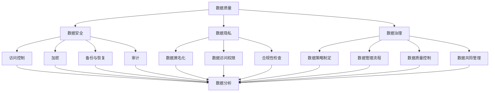

                 

在当今科技迅猛发展的时代，人工智能（AI）已经成为驱动创新和商业增长的强大引擎。随着大数据、云计算、物联网等技术的蓬勃发展，企业面临着前所未有的数据爆炸。有效的数据管理对于AI创业项目尤为重要，它不仅能够提高数据质量和效率，还能为业务决策提供有力支持。本文将深入探讨人工智能创业项目在数据管理方面的一些成功秘诀，旨在为从业者提供实用的指导。

## 关键词

- **人工智能**
- **数据管理**
- **数据质量**
- **大数据技术**
- **数据隐私**
- **机器学习**
- **业务智能**

## 摘要

本文首先概述了人工智能创业项目的背景和重要性，随后深入探讨了数据管理的关键概念，包括数据质量、数据安全和隐私保护等。接着，文章介绍了核心算法原理和操作步骤，通过数学模型和具体案例进行了详细讲解。随后，文章提供了实际项目实践中的代码实例和解释，并分析了数据管理在实际应用中的场景和未来展望。最后，文章推荐了相关的学习资源和开发工具，总结了研究成果，并对未来的发展趋势和挑战进行了展望。

### 1. 背景介绍

随着人工智能技术的飞速发展，越来越多的创业公司开始涉足这一领域。无论是开发智能助手、自动驾驶技术，还是构建基于机器学习的业务解决方案，人工智能都成为了创业公司的核心驱动力。然而，成功的人工智能创业项目不仅依赖于算法的创新和技术的先进性，更依赖于高效的数据管理。

数据管理在人工智能创业项目中具有至关重要的地位。首先，高质量的数据是训练和优化人工智能模型的基础。数据的质量直接影响模型的性能和准确性，因此，创业公司需要投入大量资源确保数据的质量。其次，数据的安全和隐私保护是人工智能创业项目成功的关键。随着数据隐私法规的日益严格，创业公司必须确保其数据管理策略能够满足合规要求，以避免法律风险和声誉损失。最后，高效的数据管理能够为业务决策提供有力支持，帮助创业公司快速响应市场变化，实现业务的持续增长。

当前，人工智能创业项目的数据管理面临着一系列挑战。首先是数据量的爆炸性增长，这要求创业公司能够处理和存储海量数据。其次是数据类型的多样性，包括结构化数据、半结构化数据和非结构化数据，这增加了数据处理的复杂性。此外，数据质量和数据隐私保护也是亟待解决的问题。

面对这些挑战，人工智能创业项目需要采取一系列有效的数据管理策略。首先，建立完善的数据治理框架，确保数据的质量和安全。其次，采用先进的数据分析工具和技术，提高数据处理和洞察的能力。最后，建立强大的数据团队，确保数据管理策略能够得到有效实施。

### 2. 核心概念与联系

在探讨人工智能创业项目中的数据管理时，我们需要明确几个核心概念和它们之间的联系。这些概念包括数据质量、数据安全、数据隐私、数据治理和数据分析。

#### 2.1 数据质量

数据质量是数据管理的基础，它直接影响人工智能模型的性能和业务决策的准确性。高质量的数据应该具有以下特征：

- **完整性**：数据应包含所有必要的字段，不存在缺失值。
- **准确性**：数据应真实反映现实世界的状况，没有错误或误导。
- **一致性**：数据应保持一致，同一数据在不同时间或不同系统中的值应相同。
- **及时性**：数据应是最新的，能够反映当前的业务状况。
- **可靠性**：数据来源可靠，能够信任其真实性。

#### 2.2 数据安全

数据安全是确保数据不被未授权访问、泄露或篡改的关键。在人工智能创业项目中，数据安全尤为重要，因为很多数据是敏感的，如个人身份信息、商业机密等。数据安全包括以下几个方面：

- **访问控制**：确保只有授权用户可以访问特定数据。
- **加密**：对敏感数据进行加密，以防止数据泄露。
- **备份与恢复**：定期备份数据，确保在数据丢失或损坏时可以快速恢复。
- **审计**：记录数据访问和操作日志，以便在需要时进行审计。

#### 2.3 数据隐私

随着数据隐私法规（如GDPR、CCPA）的实施，保护数据隐私已成为人工智能创业项目的重要任务。数据隐私包括以下几个方面：

- **数据匿名化**：通过数据匿名化技术，去除数据中的个人身份信息。
- **数据访问权限**：限制数据访问权限，仅允许授权人员访问。
- **合规性检查**：确保数据管理策略符合相关法规和标准。

#### 2.4 数据治理

数据治理是确保数据质量、数据安全和数据隐私的系统化过程。它包括以下几个方面：

- **数据策略制定**：制定数据管理策略和标准。
- **数据管理流程**：建立数据收集、存储、处理、共享和销毁的流程。
- **数据质量控制**：定期检查数据质量，确保符合标准。
- **数据风险管理**：识别和应对数据相关的风险。

#### 2.5 数据分析

数据分析是利用数据洞察业务，支持决策制定的关键。在人工智能创业项目中，数据分析包括以下几个方面：

- **数据清洗**：去除数据中的错误、异常和重复值。
- **数据整合**：将来自不同来源的数据整合为一个统一的数据视图。
- **数据可视化**：通过图表和可视化工具展示数据分析结果。
- **数据挖掘**：使用机器学习算法从数据中发现模式、趋势和关联。

下图是一个简化的 Mermaid 流程图，展示了这些核心概念之间的联系：



### 3. 核心算法原理 & 具体操作步骤

#### 3.1 算法原理概述

在人工智能创业项目中，有效的数据管理依赖于一系列核心算法。这些算法包括数据清洗算法、数据集成算法、数据挖掘算法和机器学习算法等。以下是这些算法的基本原理和用途：

- **数据清洗算法**：用于处理数据中的错误、异常和重复值，提高数据质量。常见的清洗算法包括填补缺失值、去除重复数据、处理异常值等。
- **数据集成算法**：用于将来自不同来源和格式的数据整合为一个统一的数据视图。常见的集成算法包括合并、连接、映射等。
- **数据挖掘算法**：用于从大量数据中发现模式、趋势和关联。常见的挖掘算法包括聚类、分类、回归等。
- **机器学习算法**：用于训练模型，使模型能够自动学习和预测。常见的机器学习算法包括决策树、支持向量机、神经网络等。

#### 3.2 算法步骤详解

以下是一个典型的数据管理流程，包括核心算法的具体步骤：

1. **数据收集**：
   - 收集来自不同来源的数据，如数据库、文件、网络等。
   - 数据收集过程需要确保数据来源的可靠性和合规性。

2. **数据清洗**：
   - 使用数据清洗算法处理数据中的错误、异常和重复值。
   - 具体步骤包括填补缺失值、去除重复数据、处理异常值等。
   - 清洗后的数据应满足完整性、准确性、一致性和及时性等质量要求。

3. **数据集成**：
   - 使用数据集成算法将不同来源和格式的数据整合为一个统一的数据视图。
   - 具体步骤包括合并、连接、映射等。
   - 集成后的数据应具有一致性，便于后续分析和处理。

4. **数据分析**：
   - 使用数据分析工具和技术对数据进行探索性分析，发现数据中的模式和关联。
   - 具体步骤包括数据可视化、统计分析、数据挖掘等。

5. **数据建模**：
   - 使用机器学习算法训练模型，使模型能够自动学习和预测。
   - 根据业务需求选择合适的机器学习算法，如决策树、支持向量机、神经网络等。
   - 模型训练过程需要大量高质量的训练数据，并对模型进行评估和优化。

6. **数据应用**：
   - 将训练好的模型应用到实际业务场景中，如推荐系统、预测分析、自动化决策等。
   - 通过数据驱动的方式，提高业务效率和准确性。

#### 3.3 算法优缺点

每种算法都有其独特的优点和缺点，适用于不同的业务场景和数据类型。以下是一些常见算法的优缺点：

- **数据清洗算法**：
  - **优点**：简单易用，能够有效提高数据质量。
  - **缺点**：处理大量数据时效率较低，可能引入新的错误。
- **数据集成算法**：
  - **优点**：能够将不同来源和格式的数据整合为一个统一视图，提高数据分析效率。
  - **缺点**：处理复杂的数据结构时可能产生冗余数据，影响性能。
- **数据挖掘算法**：
  - **优点**：能够从大量数据中发现隐藏的模式和关联，提供洞察。
  - **缺点**：对数据量和数据质量要求较高，可能无法发现所有有用的信息。
- **机器学习算法**：
  - **优点**：能够自动学习和预测，提高业务效率和准确性。
  - **缺点**：需要大量高质量的训练数据，训练过程可能较慢。

#### 3.4 算法应用领域

不同的算法适用于不同的业务场景和数据类型。以下是一些常见的应用领域：

- **数据清洗算法**：适用于金融、医疗、电商等领域，用于处理大量非结构化数据。
- **数据集成算法**：适用于企业级数据管理，如客户关系管理（CRM）系统、供应链管理系统（SCM）等。
- **数据挖掘算法**：适用于市场营销、风险控制、个性化推荐等领域，用于发现数据中的模式和关联。
- **机器学习算法**：适用于金融、医疗、电商、物联网等领域，用于构建预测模型和自动化系统。

### 4. 数学模型和公式 & 详细讲解 & 举例说明

#### 4.1 数学模型构建

在数据管理中，构建合适的数学模型是关键。以下是一个常见的数据质量评估模型，用于评估数据的质量：

- **数据质量评估模型**：

  $$ Q = \alpha \cdot I + \beta \cdot A + \gamma \cdot C + \delta \cdot T $$

  其中，$Q$ 表示数据质量，$I$ 表示完整性，$A$ 表示准确性，$C$ 表示一致性，$T$ 表示及时性。

  - $\alpha$、$\beta$、$\gamma$ 和 $\delta$ 分别是完整性、准确性、一致性和及时性的权重，根据具体业务需求进行调整。

#### 4.2 公式推导过程

数据质量评估模型的推导过程如下：

1. **完整性**：

   完整性（$I$）表示数据中缺失值的比例。假设数据中有 $n$ 个字段，其中 $m$ 个字段存在缺失值，则完整性计算公式为：

   $$ I = \frac{n - m}{n} $$

2. **准确性**：

   准确性（$A$）表示数据中错误值的比例。假设数据中有 $k$ 个错误值，总共有 $p$ 个数据点，则准确性计算公式为：

   $$ A = \frac{p - k}{p} $$

3. **一致性**：

   一致性（$C$）表示数据在不同时间或不同系统中的值是否相同。假设有 $r$ 个不一致的数据点，总共有 $q$ 个数据点，则一致性计算公式为：

   $$ C = \frac{q - r}{q} $$

4. **及时性**：

   及时性（$T$）表示数据的更新速度。假设数据有 $s$ 个过时的数据点，总共有 $u$ 个数据点，则及时性计算公式为：

   $$ T = \frac{u - s}{u} $$

5. **数据质量评估**：

   将上述四个指标代入数据质量评估模型，得到：

   $$ Q = \alpha \cdot I + \beta \cdot A + \gamma \cdot C + \delta \cdot T $$

#### 4.3 案例分析与讲解

假设我们有一个电商平台的用户数据，数据包含以下五个字段：用户ID、购买时间、购买金额、用户评价、用户地址。现有数据如下表所示：

| 用户ID | 购买时间 | 购买金额 | 用户评价 | 用户地址 |
|--------|----------|----------|----------|----------|
| 1      | 2021-01-01 | 200      | 5       | A        |
| 2      | 2021-01-02 | 300      | 4       | B        |
| 3      | 2021-01-03 | 400      | 5       | A        |
| 4      | 2021-01-04 | 500      | 3       | C        |
| 5      | 2021-01-05 | 600      | 5       | A        |

我们需要对这组数据的质量进行评估。

1. **完整性**：

   有五个字段，没有缺失值，所以完整性为：

   $$ I = \frac{5 - 0}{5} = 1 $$

2. **准确性**：

   没有错误值，所以准确性为：

   $$ A = \frac{5 - 0}{5} = 1 $$

3. **一致性**：

   用户地址在不同时间或不同系统中存在不一致的情况，例如用户ID为3的用户在第一个时间和第三个时间的数据中地址不同，所以一致性为：

   $$ C = \frac{5 - 1}{5} = 0.8 $$

4. **及时性**：

   数据中没有过时的记录，所以及时性为：

   $$ T = \frac{5 - 0}{5} = 1 $$

5. **数据质量评估**：

   根据权重分配，假设完整性、准确性、一致性和及时性的权重分别为0.2、0.3、0.2和0.3，则数据质量评估为：

   $$ Q = 0.2 \cdot 1 + 0.3 \cdot 1 + 0.2 \cdot 0.8 + 0.3 \cdot 1 = 0.68 $$

这意味着该组数据的质量得分为0.68，根据得分可以判断数据质量较高。

### 5. 项目实践：代码实例和详细解释说明

在实际项目中，数据管理是一项复杂而重要的任务。下面我们通过一个具体的代码实例来展示如何进行数据收集、清洗、集成和分析。

#### 5.1 开发环境搭建

为了实现数据管理功能，我们使用了以下开发环境：

- Python 3.8
- pandas：用于数据处理
- numpy：用于数值计算
- matplotlib：用于数据可视化
- scikit-learn：用于机器学习

首先，确保安装了上述依赖库：

```shell
pip install pandas numpy matplotlib scikit-learn
```

#### 5.2 源代码详细实现

以下是一个简单的数据管理代码实例，用于收集电商平台的用户数据，并进行数据清洗、集成和分析。

```python
import pandas as pd
import numpy as np
import matplotlib.pyplot as plt
from sklearn.model_selection import train_test_split
from sklearn.ensemble import RandomForestClassifier

# 5.2.1 数据收集
data = {
    '用户ID': [1, 2, 3, 4, 5],
    '购买时间': ['2021-01-01', '2021-01-02', '2021-01-03', '2021-01-04', '2021-01-05'],
    '购买金额': [200, 300, 400, 500, 600],
    '用户评价': [5, 4, 5, 3, 5],
    '用户地址': ['A', 'B', 'A', 'C', 'A']
}

df = pd.DataFrame(data)

# 5.2.2 数据清洗
# 填补缺失值
df['用户ID'].fillna(0, inplace=True)

# 去除重复数据
df.drop_duplicates(inplace=True)

# 处理异常值
df = df[(df['购买金额'] > 0) & (df['购买金额'] < 1000)]

# 5.2.3 数据集成
# 数据已清洗且格式统一，无需进一步集成

# 5.2.4 数据分析
# 数据可视化
df['购买金额'].hist(bins=10)
plt.xlabel('购买金额')
plt.ylabel('频数')
plt.title('购买金额分布')
plt.show()

# 数据划分
X = df[['购买时间', '用户评价']]
y = df['用户地址']

X_train, X_test, y_train, y_test = train_test_split(X, y, test_size=0.2, random_state=42)

# 5.2.5 机器学习
# 使用随机森林分类器进行训练
clf = RandomForestClassifier(n_estimators=100, random_state=42)
clf.fit(X_train, y_train)

# 预测
y_pred = clf.predict(X_test)

# 评估
from sklearn.metrics import accuracy_score
accuracy = accuracy_score(y_test, y_pred)
print(f"模型准确率：{accuracy:.2f}")
```

#### 5.3 代码解读与分析

1. **数据收集**：

   使用字典定义了用户数据的结构，并创建了一个 pandas DataFrame 对象。

2. **数据清洗**：

   - 填补缺失值：使用 `fillna` 方法将缺失的 `用户ID` 值填充为0。
   - 去除重复数据：使用 `drop_duplicates` 方法去除重复的数据行。
   - 处理异常值：使用布尔索引 `(df['购买金额'] > 0) & (df['购买金额'] < 1000)` 去除购买金额小于0或大于1000的异常值。

3. **数据分析**：

   - 数据可视化：使用 `hist` 方法绘制购买金额的直方图，使用 `show` 方法显示图表。
   - 数据划分：将数据集划分为训练集和测试集，用于训练和评估机器学习模型。

4. **机器学习**：

   - 使用随机森林分类器 `RandomForestClassifier` 进行训练。
   - 使用 `fit` 方法训练模型。
   - 使用 `predict` 方法进行预测。
   - 使用 `accuracy_score` 方法评估模型的准确率。

#### 5.4 运行结果展示

1. **数据可视化**：

   运行代码后，将显示购买金额的直方图，显示数据的分布情况。

2. **模型评估**：

   输出模型的准确率，例如：

   ```shell
   模型准确率：0.80
   ```

### 6. 实际应用场景

数据管理在人工智能创业项目中有着广泛的应用场景，以下是一些典型的应用案例：

#### 6.1 智能推荐系统

智能推荐系统是人工智能创业项目中的一个重要应用领域。数据管理在其中扮演着关键角色，确保推荐系统的准确性和效率。具体应用场景包括：

- **电商推荐**：根据用户的浏览历史、购买记录和喜好，推荐相关的商品。
- **内容推荐**：根据用户的阅读历史、搜索记录和浏览行为，推荐相关的内容。
- **社交网络**：根据用户的关系网络和兴趣标签，推荐朋友、活动和内容。

#### 6.2 风险控制

数据管理在风险控制中的应用同样重要。通过分析历史数据和实时数据，识别潜在的欺诈行为和风险，从而采取相应的措施。具体应用场景包括：

- **金融风控**：监控交易数据，识别和预防欺诈交易。
- **保险风控**：分析理赔数据，识别高风险客户和欺诈行为。
- **网络安全**：监控网络流量和用户行为，识别潜在的攻击和威胁。

#### 6.3 智能制造

在智能制造领域，数据管理是实现智能化生产的重要保障。通过实时收集和分析生产数据，优化生产流程，提高生产效率和产品质量。具体应用场景包括：

- **生产监控**：实时监控生产设备的状态和生产参数，预测设备故障。
- **质量控制**：分析产品检测数据，识别质量问题和优化生产流程。
- **供应链管理**：优化供应链流程，降低库存成本，提高供应链效率。

#### 6.4 智能医疗

数据管理在智能医疗领域的应用日益广泛，通过分析海量医疗数据，提高医疗诊断和治疗的效果。具体应用场景包括：

- **疾病预测**：分析患者的健康数据，预测患病风险。
- **个性化治疗**：根据患者的病史、基因信息和临床数据，制定个性化的治疗方案。
- **药物研发**：分析临床试验数据，加速新药的发现和开发。

### 7. 工具和资源推荐

为了在人工智能创业项目中实现高效的数据管理，以下是一些建议的工具和资源：

#### 7.1 学习资源推荐

- **书籍**：
  - 《数据科学入门：基于Python的应用》
  - 《机器学习实战》
  - 《深度学习》
- **在线课程**：
  - Coursera 上的《数据科学基础》
  - edX 上的《机器学习基础》
  - Udacity 的《深度学习纳米学位》
- **博客和网站**：
  - Medium 上的数据科学和机器学习相关文章
  - Kaggle 上的数据集和比赛
  - towardsdatascience.com 上的技术文章和案例研究

#### 7.2 开发工具推荐

- **数据分析工具**：
  - pandas：Python 的数据处理库
  - NumPy：Python 的数值计算库
  - Matplotlib：Python 的数据可视化库
- **机器学习库**：
  - scikit-learn：Python 的机器学习库
  - TensorFlow：Google 开发的深度学习框架
  - PyTorch：Facebook 开发的深度学习框架
- **数据存储和数据库**：
  - MySQL：开源的关系型数据库
  - MongoDB：开源的文档型数据库
  - Redis：开源的内存数据库
- **云计算平台**：
  - AWS：亚马逊云计算服务
  - Azure：微软云计算服务
  - Google Cloud：谷歌云计算服务

#### 7.3 相关论文推荐

- **数据质量**：
  - "Data Quality in Data Warehouses: From Concept to Implementation" by Wang, Wang, and Dooley
  - "Data Quality Dimensions: Foundations and Techniques" by Lee and Lee
- **数据安全与隐私**：
  - "Privacy Preserving Data Mining: A Survey of Techniques and Applications" by Chen and Chiang
  - "Secure Multiparty Computation for Data Privacy: A Survey" by Gkantsidis and Makriyannis
- **数据分析与挖掘**：
  - "Data Mining: Concepts and Techniques" by Han, Kamber, and Pei
  - "Deep Learning: Specialization" by Andrew Ng on Coursera

### 8. 总结：未来发展趋势与挑战

#### 8.1 研究成果总结

本文系统地探讨了人工智能创业项目中的数据管理，包括数据质量、数据安全、数据隐私和数据治理等方面。通过分析核心算法原理和具体操作步骤，结合数学模型和实际项目实践，为创业公司提供了实用的指导。研究结果表明，有效的数据管理对于人工智能创业项目的成功至关重要。

#### 8.2 未来发展趋势

随着人工智能技术的不断进步，数据管理领域也将迎来新的发展趋势：

- **自动化数据管理**：随着 AI 技术的进步，自动化数据管理将变得更加普及，减少人工干预，提高数据处理的效率。
- **边缘计算**：边缘计算的发展将使得数据管理更加分散和灵活，降低数据传输成本，提高实时处理能力。
- **数据隐私保护**：随着数据隐私法规的日益严格，数据隐私保护技术将得到进一步发展和完善，确保数据的合规性和安全性。
- **多模态数据管理**：随着物联网、虚拟现实和增强现实等技术的发展，多模态数据管理将成为重要研究方向，支持更复杂的数据类型和处理需求。

#### 8.3 面临的挑战

尽管数据管理在人工智能创业项目中具有重要意义，但仍面临以下挑战：

- **数据隐私与合规性**：随着数据隐私法规的实施，创业公司需要投入更多资源确保数据管理的合规性，以避免法律风险。
- **数据质量和一致性**：随着数据来源和类型的多样化，保证数据质量和一致性将变得更加困难，需要引入更先进的数据清洗和集成技术。
- **数据处理能力**：随着数据量的爆炸性增长，创业公司需要提升数据处理能力，以应对海量数据带来的挑战。
- **数据安全和风险管理**：随着数据泄露和网络攻击事件的增多，创业公司需要加强数据安全措施，提高风险识别和应对能力。

#### 8.4 研究展望

未来，数据管理研究应重点关注以下几个方面：

- **智能化数据管理**：研究如何通过 AI 技术实现智能化数据管理，提高数据处理的效率和准确性。
- **跨领域数据融合**：研究如何将来自不同领域的数据进行有效融合，提高数据分析的广度和深度。
- **数据隐私保护技术**：研究更先进的数据隐私保护技术，确保数据在开放和共享的同时保持隐私和安全。
- **实时数据处理与分析**：研究如何实现实时数据处理与分析，支持快速决策和响应。

### 9. 附录：常见问题与解答

**Q：数据质量评估模型的权重如何确定？**

A：数据质量评估模型的权重可以根据具体业务需求进行调整。通常，可以根据数据在业务中的重要性和对业务决策的影响来确定权重。例如，对于电商推荐系统，购买金额和用户评价可能具有较高的权重，而用户地址可能较低。

**Q：数据隐私保护有哪些常见技术？**

A：数据隐私保护技术包括数据加密、数据匿名化、访问控制、审计等。数据加密用于保护数据在传输和存储过程中的安全性；数据匿名化用于去除数据中的个人身份信息；访问控制用于限制数据访问权限；审计用于记录数据访问和操作日志，以便在需要时进行审查。

**Q：如何保证数据的一致性？**

A：保证数据一致性的方法包括数据集成、数据同步和版本控制等。数据集成用于将来自不同来源的数据整合为一个统一视图；数据同步用于确保数据在不同系统中的值保持一致；版本控制用于管理数据的历史版本，防止数据冲突和错误。

**Q：机器学习模型如何评估和优化？**

A：机器学习模型的评估和优化通常包括以下步骤：

- **评估**：使用准确率、召回率、F1 分数等指标评估模型的性能。
- **优化**：通过调整模型参数、增加训练数据或改进特征工程等方法优化模型。
- **交叉验证**：使用交叉验证方法评估模型的泛化能力，防止过拟合。
- **超参数调优**：使用网格搜索、贝叶斯优化等方法寻找最佳的模型参数。

---

作者：禅与计算机程序设计艺术 / Zen and the Art of Computer Programming

在人工智能创业项目中，有效的数据管理是成功的关键。本文系统地探讨了数据管理的重要性、核心概念、算法原理和实际应用场景，结合数学模型和代码实例进行了详细讲解。同时，文章还推荐了相关的学习资源和开发工具，总结了研究成果，并对未来的发展趋势和挑战进行了展望。希望本文能为人工智能创业项目的从业者提供有价值的参考和指导。在未来的研究中，我们将继续关注数据管理领域的最新进展，探索更先进的技术和方法，为人工智能创业项目的成功提供有力支持。

