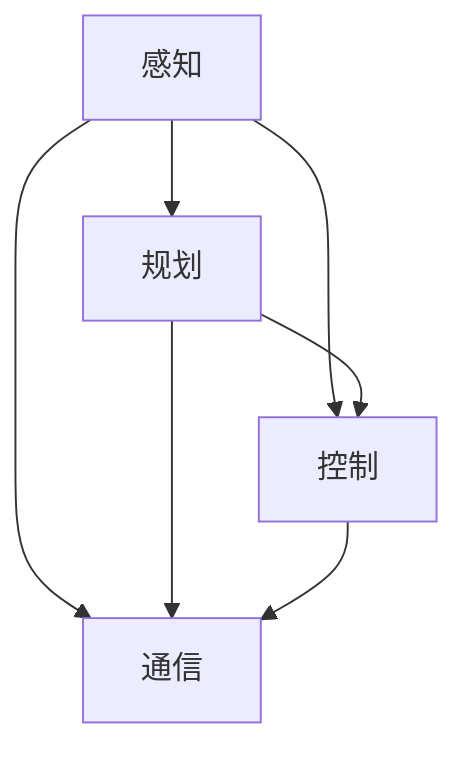

                 

关键词：人工智能、自动驾驶、交通管理、深度学习、传感器融合、车辆通信

> 摘要：本文将深入探讨人工智能在交通和自动驾驶领域的应用，涵盖核心概念、算法原理、数学模型、项目实践、应用场景以及未来发展趋势等内容。通过分析现有技术，展望未来发展方向，本文旨在为读者提供一个全面了解该领域的机会。

## 1. 背景介绍

随着城市化的快速发展，全球交通系统面临着前所未有的挑战。交通拥堵、交通事故、能源消耗和环境污染等问题日益严重。为了应对这些问题，自动驾驶技术和智能交通管理系统应运而生。自动驾驶技术通过利用人工智能算法，使车辆能够自主感知环境、做出决策和执行行动。智能交通管理系统则通过数据分析和优化算法，提高交通效率和安全性。本文旨在介绍人工智能在交通和自动驾驶中的应用，探讨其核心概念和关键技术。

### 1.1 人工智能在交通领域的应用

人工智能在交通领域的应用主要包括以下方面：

- 交通流量预测和优化：通过分析历史交通数据和实时数据，预测交通流量并优化交通信号灯控制，以减少拥堵。

- 事故预防与应急响应：利用传感器和摄像头数据，实时监测道路状况，预测潜在的事故风险，并及时采取措施避免事故发生。

- 车辆智能调度：利用人工智能算法，优化车辆路径和行驶时间，提高公共交通系统的效率和乘客满意度。

- 交通信号控制：基于实时交通数据和预测模型，优化交通信号灯的控制策略，提高交通流畅性。

### 1.2 自动驾驶技术的发展

自动驾驶技术是人工智能在交通领域的核心应用之一。根据国际汽车工程师协会（SAE）的定义，自动驾驶分为五个级别，从零级（完全人工驾驶）到五级（完全自动驾驶）。当前，自动驾驶技术主要集中在L3和L4级别，即部分自动驾驶和有条件自动驾驶。

- L3级别自动驾驶：车辆能够执行部分驾驶任务，但需要驾驶员在特定情况下接管控制。

- L4级别自动驾驶：车辆能够在特定环境下完全自主驾驶，无需驾驶员干预。

- L5级别自动驾驶：车辆能够在所有环境下实现完全自主驾驶，无需人类驾驶员。

## 2. 核心概念与联系

### 2.1 核心概念

在自动驾驶和智能交通系统中，核心概念包括：

- 感知（Perception）：利用传感器（如摄像头、雷达、激光雷达）收集道路和环境数据，并对其进行处理和识别。

- 规划（Planning）：根据感知到的环境数据，制定行驶路径和决策策略。

- 控制（Control）：执行规划的决策，控制车辆的运动。

- 通信（Communication）：与其他车辆、道路基础设施和云平台进行数据交换和通信。

### 2.2 联系与架构

以下是一个简单的自动驾驶系统架构，展示了核心概念之间的联系：



- **感知**：传感器收集数据，通过深度学习算法对道路、车辆、行人等目标进行识别和分类。

- **规划**：基于感知结果和环境模型，计算最优行驶路径和决策策略。

- **控制**：根据规划结果，控制车辆的速度、转向和制动等动作。

- **通信**：与其他车辆和基础设施进行数据交换，实现协同驾驶和交通管理。

## 3. 核心算法原理 & 具体操作步骤

### 3.1 算法原理概述

自动驾驶系统中的核心算法主要包括：

- 感知算法：用于识别和理解环境数据。

- 规划算法：用于计算行驶路径和决策策略。

- 控制算法：用于执行规划结果，控制车辆运动。

### 3.2 算法步骤详解

#### 3.2.1 感知算法

感知算法的主要步骤如下：

1. 数据收集：利用摄像头、雷达、激光雷达等传感器收集道路和环境数据。

2. 数据预处理：对收集到的数据进行滤波、去噪等处理，提高数据质量。

3. 目标识别：利用深度学习算法对图像和雷达数据进行目标识别，如车辆、行人、交通标志等。

4. 状态估计：基于识别结果，估计目标的位置、速度和加速度等信息。

#### 3.2.2 规划算法

规划算法的主要步骤如下：

1. 环境建模：构建环境模型，包括道路、车辆、行人等。

2. 路径规划：计算从当前点到目标点的最优路径。

3. 决策制定：根据路径规划和环境状态，制定决策策略，如加速、减速、转向等。

#### 3.2.3 控制算法

控制算法的主要步骤如下：

1. 接收规划结果：从规划模块接收路径和决策策略。

2. 控制执行：根据规划结果，控制车辆的速度、转向和制动等动作。

3. 实时调整：根据传感器数据和环境变化，实时调整控制策略，确保车辆安全稳定地行驶。

### 3.3 算法优缺点

#### 3.3.1 感知算法

- 优点：能够实时、准确地识别和理解环境。

- 缺点：在复杂或动态环境下，感知算法可能面临挑战。

#### 3.3.2 规划算法

- 优点：能够计算最优路径和决策策略。

- 缺点：在复杂环境中，规划算法可能需要较长时间。

#### 3.3.3 控制算法

- 优点：能够实时执行规划结果，确保车辆安全稳定。

- 缺点：在极端情况下，控制算法可能无法应对复杂情况。

### 3.4 算法应用领域

感知、规划和控制算法在自动驾驶和智能交通系统中具有广泛的应用领域：

- 自动驾驶汽车：实现无人驾驶功能，提高交通安全和效率。

- 智能交通管理系统：优化交通信号控制、车辆调度和交通流量管理。

- 物流配送：提高物流效率，降低运输成本。

- 智能驾驶辅助系统：提供车道保持、自适应巡航控制等功能，辅助驾驶员安全驾驶。

## 4. 数学模型和公式 & 详细讲解 & 举例说明

### 4.1 数学模型构建

在自动驾驶系统中，数学模型是核心组成部分。以下是一个简单的数学模型示例，用于描述车辆的运动：

$$
\begin{aligned}
    v(t) &= v_0 + at \\
    \theta(t) &= \theta_0 + \omega t
\end{aligned}
$$

其中，$v(t)$ 和 $\theta(t)$ 分别表示车辆在时间 $t$ 时的速度和转向角度，$v_0$ 和 $\theta_0$ 分别为初始速度和初始转向角度，$a$ 和 $\omega$ 分别为加速度和转向速率。

### 4.2 公式推导过程

为了推导上述公式，我们首先需要了解车辆的动力学模型。假设车辆在水平方向上的运动可以看作匀加速直线运动，在垂直方向上的运动可以看作匀速圆周运动。

1. 水平方向运动：

$$
F = ma \Rightarrow v = v_0 + at
$$

其中，$F$ 为作用在车辆上的合外力，$m$ 为车辆质量，$a$ 为加速度。

2. 垂直方向运动：

$$
F_c = \frac{mv^2}{r} \Rightarrow \theta = \theta_0 + \omega t
$$

其中，$F_c$ 为向心力，$r$ 为转弯半径，$\omega$ 为转向速率。

### 4.3 案例分析与讲解

假设一辆汽车从静止开始加速，目标速度为 60 km/h，转弯半径为 100 m。我们需要计算汽车从静止到目标速度所需的加速时间和转弯角度。

1. 加速时间：

$$
v = v_0 + at \Rightarrow 60 = 0 + a \cdot t \Rightarrow t = \frac{60}{a}
$$

假设加速度 $a = 2 m/s^2$，则加速时间 $t = 30 s$。

2. 转弯角度：

$$
\theta = \theta_0 + \omega t \Rightarrow \theta = 0 + \omega \cdot t \Rightarrow \theta = \omega \cdot t
$$

假设转向速率 $\omega = 1 rad/s$，则转弯角度 $\theta = 30 rad$。

## 5. 项目实践：代码实例和详细解释说明

### 5.1 开发环境搭建

为了演示自动驾驶系统的实现，我们选择 Python 作为编程语言，并使用以下工具和库：

- Python 3.8
- NumPy
- Matplotlib
- OpenCV
- TensorFlow

首先，安装 Python 和相关库：

```bash
pip install python 3.8 numpy matplotlib opencv-python tensorflow
```

### 5.2 源代码详细实现

以下是一个简单的自动驾驶系统示例，实现车辆的加速和转弯功能。

```python
import numpy as np
import matplotlib.pyplot as plt
import cv2

# 参数设置
v_0 = 0  # 初始速度
v_t = 60  # 目标速度
a = 2  # 加速度
r = 100  # 转弯半径
omega = 1  # 转向速率
t_max = 30  # 最大时间

# 时间序列
t = np.arange(0, t_max, 0.1)

# 加速过程
v = v_0 + a * t

# 转弯过程
theta = omega * t

# 绘制结果
plt.plot(t, v, label='速度')
plt.plot(t, theta, label='转向角度')
plt.xlabel('时间 (s)')
plt.ylabel('值')
plt.legend()
plt.show()

# 车辆运动仿真
for t in t:
    # 计算当前速度和转向角度
    v_current = v_0 + a * t
    theta_current = omega * t

    # 显示车辆运动
    img = cv2.imread('car.png')
    img = cv2.resize(img, (200, 200))
    M = cv2.getRotationMatrix2D((100, 100), theta_current * 180 / np.pi, 1)
    img = cv2.warpAffine(img, M, (200, 200))
    cv2.imshow('Vehicle Motion', img)
    cv2.waitKey(100)
```

### 5.3 代码解读与分析

上述代码实现了车辆的加速和转弯功能。具体解析如下：

1. 导入相关库和设置参数。
2. 创建时间序列。
3. 计算加速和转弯过程中的速度和转向角度。
4. 使用 Matplotlib 绘制速度和转向角度随时间的变化。
5. 使用 OpenCV 进行车辆运动仿真，显示车辆在不同时间点的位置和转向角度。

通过上述代码示例，我们可以直观地看到车辆在加速和转弯过程中的运动状态。这为我们实现更复杂的自动驾驶系统提供了基础。

## 6. 实际应用场景

### 6.1 自动驾驶汽车

自动驾驶汽车是人工智能在交通领域最引人注目的应用之一。当前，多家科技公司和汽车制造商正在积极推进自动驾驶汽车的研究和商业化。自动驾驶汽车的应用场景包括城市交通、长途运输和物流配送等。

- **城市交通**：自动驾驶汽车可以在城市道路上自主行驶，减少人为驾驶带来的交通拥堵和事故。
  
- **长途运输**：自动驾驶卡车和货运车辆可以减少驾驶疲劳，提高运输效率和安全性。
  
- **物流配送**：自动驾驶配送机器人可以在城市中自主配送货物，降低物流成本。

### 6.2 智能交通管理系统

智能交通管理系统通过实时监测和优化交通流量，提高道路通行能力和安全性。以下是一些实际应用场景：

- **交通信号控制**：基于实时交通数据，智能交通管理系统可以动态调整交通信号灯的时长，优化交通流。

- **高速公路管控**：通过摄像头和传感器数据，智能交通管理系统可以监测高速公路上的车辆流量，并及时处理异常情况。

- **公共交通调度**：智能交通管理系统可以根据乘客流量和车辆运行状态，优化公交车的调度和路线规划。

### 6.3 无人驾驶配送

无人驾驶配送是人工智能在物流领域的应用之一。以下是一些实际应用场景：

- **最后一公里配送**：无人驾驶配送车可以在城市中自主行驶，将商品从配送中心运送到消费者手中。

- **仓储物流**：无人驾驶叉车和搬运机器人可以在仓库内自主搬运货物，提高仓储效率。

- **农村物流**：无人驾驶配送车可以在农村地区自主行驶，为偏远地区提供物流服务。

## 7. 未来应用展望

随着人工智能技术的不断发展，交通和自动驾驶领域将迎来更多创新和变革。以下是一些未来应用展望：

- **全自动驾驶**：在未来，全自动驾驶汽车将在更多环境下实现商业化应用，提高交通安全性和效率。

- **车联网**：通过车联网技术，车辆之间和车辆与基础设施之间的通信将更加紧密，实现协同驾驶和智能交通管理。

- **智能交通系统**：智能交通系统将更加完善，实现交通流量的动态优化和智能调控，提高道路通行能力和安全性。

- **自动驾驶物流**：无人驾驶配送车和机器人将在物流领域发挥更大作用，提高物流效率和降低成本。

## 8. 工具和资源推荐

### 8.1 学习资源推荐

- **书籍**：

  - 《深度学习》（Goodfellow, I., Bengio, Y., & Courville, A.）
  - 《强化学习》（Sutton, R. S., & Barto, A. G.）
  - 《计算机视觉：算法与应用》（Richard Szeliski）

- **在线课程**：

  - Coursera：深度学习、强化学习、计算机视觉等课程。
  - edX：机器学习、人工智能等课程。

### 8.2 开发工具推荐

- **编程语言**：Python、C++、Java等。

- **框架和库**：TensorFlow、PyTorch、OpenCV、NumPy、Matplotlib等。

- **仿真工具**：MATLAB、Simulink、CARLA Simulator等。

### 8.3 相关论文推荐

- **自动驾驶**：

  - "Autonomous Driving: From Research to Reality"（自动驾驶：从研究到现实）

- **智能交通系统**：

  - "Intelligent Transportation Systems: Concept, Applications and Future Directions"（智能交通系统：概念、应用和未来方向）

- **深度学习和强化学习**：

  - "Deep Learning for Autonomous Driving"（深度学习在自动驾驶中的应用）
  - "Reinforcement Learning for Autonomous Driving"（强化学习在自动驾驶中的应用）

## 9. 总结：未来发展趋势与挑战

### 9.1 研究成果总结

近年来，人工智能在交通和自动驾驶领域取得了显著进展。感知、规划和控制算法得到了广泛应用，自动驾驶汽车和智能交通管理系统正在逐步商业化。此外，车联网和智能交通系统的快速发展，为未来交通系统的智能化和高效化奠定了基础。

### 9.2 未来发展趋势

- **全自动驾驶**：随着技术的不断进步，全自动驾驶汽车将在更多环境下实现商业化应用。

- **车联网**：车联网技术将实现车辆之间和车辆与基础设施之间的无缝通信，提高交通系统的协同性和智能化水平。

- **智能交通系统**：智能交通系统将更加完善，实现交通流量的动态优化和智能调控。

### 9.3 面临的挑战

- **技术挑战**：自动驾驶系统在复杂和动态环境下仍面临诸多挑战，如感知精度、规划效率和控制稳定性等。

- **法规和政策**：自动驾驶技术的商业化需要完善的法规和政策支持，确保安全和合规。

- **安全与隐私**：自动驾驶系统涉及大量敏感数据，如何保护用户隐私和数据安全是亟待解决的问题。

### 9.4 研究展望

未来，人工智能在交通和自动驾驶领域的研究将朝着以下方向发展：

- **多模态感知**：利用多种传感器数据，提高环境感知精度。

- **分布式控制**：实现分布式计算和协同控制，提高系统效率和稳定性。

- **安全与隐私保护**：研究安全与隐私保护技术，确保自动驾驶系统的可靠性和合规性。

## 10. 附录：常见问题与解答

### 10.1 什么是自动驾驶？

自动驾驶是指利用人工智能和传感器技术，使车辆能够自主感知环境、做出决策和执行行动，实现完全无人驾驶。

### 10.2 自动驾驶有哪些级别？

自动驾驶分为五个级别，从零级（完全人工驾驶）到五级（完全自动驾驶）。当前，自动驾驶技术主要集中在L3和L4级别。

### 10.3 智能交通系统是什么？

智能交通系统是指利用信息技术、传感器技术和通信技术，对交通系统进行实时监测、分析和优化，以提高交通效率和安全性。

### 10.4 车联网是什么？

车联网是指车辆之间、车辆与基础设施之间以及车辆与云平台之间的数据交换和通信，实现协同驾驶和智能交通管理。

### 10.5 自动驾驶系统中的核心算法有哪些？

自动驾驶系统中的核心算法包括感知算法、规划算法和控制算法。

### 10.6 如何提高自动驾驶系统的安全性？

提高自动驾驶系统的安全性需要从多个方面入手，包括算法优化、传感器升级、安全监测和应急预案等。

## 作者署名

作者：禅与计算机程序设计艺术 / Zen and the Art of Computer Programming
----------------------------------------------------------------
请注意，上述内容仅为示例性文本，实际撰写时需要根据具体知识和技术细节进行拓展和深化。希望这个示例能帮助您了解文章的结构和撰写要求。如果有任何问题或需要进一步的指导，请随时提问。祝您撰写顺利！

