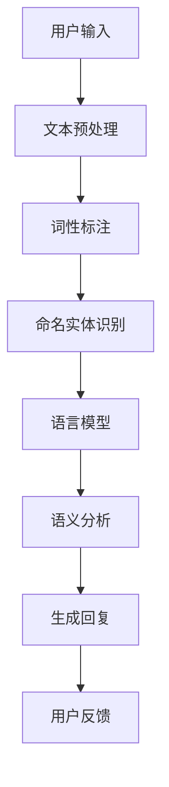
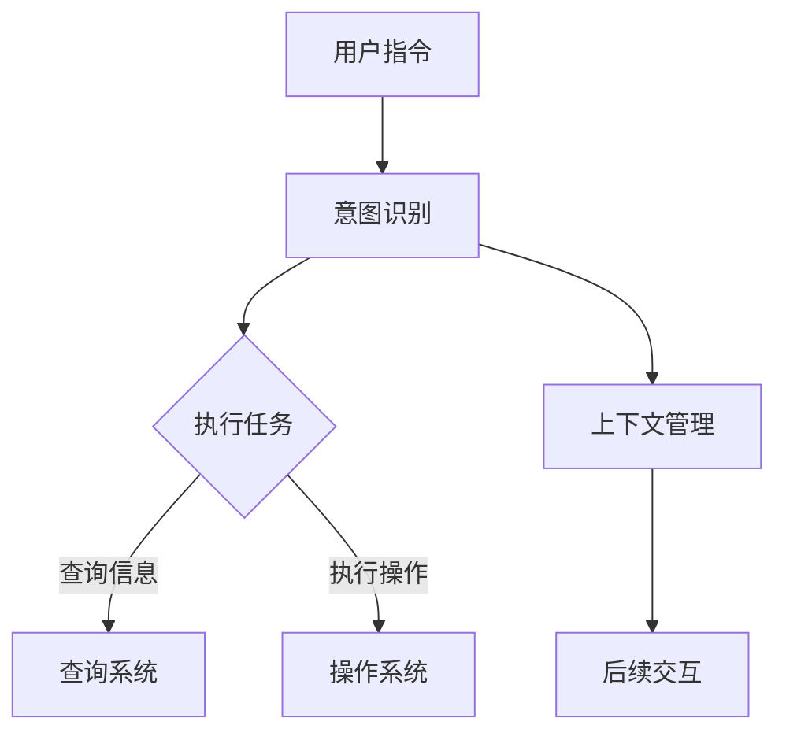
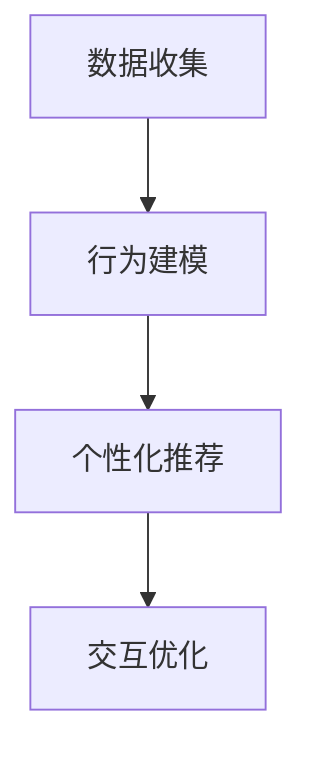

                 

 **关键词**：人工智能、人机交互、自然语言处理、智能助手、用户行为分析

**摘要**：本文将探讨人工智能（AI）在人机交互（Human-Computer Interaction, HCI）领域的应用，重点关注自然语言处理、智能助手和用户行为分析等技术。通过分析这些技术的原理、算法和实际应用，本文旨在为读者提供一个全面的理解和展望，展示AI技术在提升用户体验和效率方面的巨大潜力。

## 1. 背景介绍

人机交互一直是计算机科学和用户体验设计的核心议题。随着技术的进步，尤其是人工智能的崛起，人机交互迎来了前所未有的变革。传统的图形用户界面（GUI）和命令行界面（CLI）已无法满足现代用户对个性化和高效交互的需求。人工智能作为一门模拟、延伸和扩展人类智能的科学技术，正逐渐成为人机交互的强大推动力。

AI技术在人机交互中的应用主要体现在以下几个方面：

1. **自然语言处理（NLP）**：通过理解和生成人类语言，实现人与机器之间的自然对话。
2. **智能助手**：利用机器学习算法和自然语言处理技术，为用户提供个性化服务和支持。
3. **用户行为分析**：通过分析用户行为数据，优化交互设计和提供定制化服务。

本文将围绕这些技术展开讨论，分析其原理、算法和实际应用，以期为读者提供一个全面的视角。

## 2. 核心概念与联系

为了更好地理解人工智能在人机交互中的应用，首先需要介绍一些核心概念和它们之间的联系。

### 2.1 自然语言处理（NLP）

自然语言处理是人工智能的一个分支，旨在使计算机能够理解和生成自然语言。NLP的核心概念包括：

- **文本预处理**：包括分词、词性标注、命名实体识别等，以将原始文本转换为计算机可以处理的结构化数据。
- **语言模型**：通过统计或神经网络技术，建模自然语言的概率分布，用于预测下一个词或句子。
- **理解与生成**：利用语义分析、情感分析等技术，理解用户输入的含义并生成合适的回复。

下面是NLP在AI与人机交互中的架构图（使用Mermaid绘制）：



### 2.2 智能助手

智能助手是基于AI技术的自动化服务系统，能够理解用户的指令并执行相应的任务。智能助手的关键概念包括：

- **意图识别**：通过分析用户输入，识别用户的意图或需求。
- **任务执行**：根据识别的意图，执行相应的任务，如查询信息、执行操作等。
- **上下文管理**：维护会话状态，以便在后续交互中提供连续的服务。

智能助手的架构图如下：



### 2.3 用户行为分析

用户行为分析是通过收集和分析用户行为数据，了解用户的行为模式和偏好，从而优化交互设计和提供定制化服务。核心概念包括：

- **数据收集**：通过日志、传感器等技术，收集用户行为数据。
- **行为建模**：使用统计或机器学习技术，建模用户行为。
- **个性化推荐**：根据用户行为和偏好，提供个性化的服务和内容。

用户行为分析的流程图如下：



## 3. 核心算法原理 & 具体操作步骤

### 3.1 算法原理概述

人工智能在人机交互中的应用涉及多种算法和技术。以下将介绍几种核心算法的原理：

- **自然语言处理（NLP）**：主要算法包括分词、词性标注、命名实体识别、语言模型和语义分析。其中，词性标注常用的算法有基于规则的方法和统计方法，语言模型常用的算法有n-gram模型和神经网络模型，语义分析常用的算法有词向量模型和语义角色标注。
- **智能助手**：主要算法包括意图识别、实体识别和任务执行。意图识别常用的算法有基于规则的方法、朴素贝叶斯和深度学习模型。实体识别常用的算法有基于规则的方法、监督学习和半监督学习。任务执行涉及动作规划、对话管理和响应生成等。
- **用户行为分析**：主要算法包括行为建模、个性化推荐和交互优化。行为建模常用的算法有线性回归、决策树和神经网络。个性化推荐常用的算法有协同过滤、矩阵分解和基于内容的推荐。交互优化常用的算法有用户行为预测、界面重构和体验评估。

### 3.2 算法步骤详解

#### 3.2.1 自然语言处理（NLP）

1. **文本预处理**：对原始文本进行分词、去除停用词、转换为小写等操作。
2. **词性标注**：使用基于规则的方法或统计方法，对每个词进行词性标注。
3. **命名实体识别**：使用已标注的词性信息，识别文本中的命名实体，如人名、地名、组织名等。
4. **语言模型**：训练一个语言模型，用于预测下一个词或句子。
5. **语义分析**：使用词向量模型或语义角色标注，理解文本的语义含义。

#### 3.2.2 智能助手

1. **意图识别**：使用基于规则的方法、朴素贝叶斯或深度学习模型，分析用户输入，识别用户的意图。
2. **实体识别**：使用基于规则的方法、监督学习或半监督学习，识别用户输入中的实体，如时间、地点、数量等。
3. **任务执行**：根据识别的意图和实体，执行相应的任务，如查询信息、发送消息、设置提醒等。
4. **上下文管理**：在会话过程中，维护上下文状态，以便在后续交互中提供连续的服务。

#### 3.2.3 用户行为分析

1. **数据收集**：通过日志、传感器等技术，收集用户行为数据，如点击、浏览、购买等。
2. **行为建模**：使用线性回归、决策树或神经网络等技术，建模用户行为。
3. **个性化推荐**：根据用户行为和偏好，使用协同过滤、矩阵分解或基于内容的推荐技术，提供个性化的服务和内容。
4. **交互优化**：使用用户行为预测、界面重构和体验评估等技术，优化交互设计和用户体验。

### 3.3 算法优缺点

每种算法都有其优缺点。以下是一些常见算法的优缺点：

- **基于规则的方法**：优点是解释性强、易于实现，缺点是扩展性差、灵活性低。
- **统计方法**：优点是适用于大规模数据、可靠性高，缺点是解释性差、需要大量特征工程。
- **深度学习方法**：优点是自动特征提取、效果好，缺点是需要大量数据、计算资源消耗大。

### 3.4 算法应用领域

人工智能在人机交互中的应用非常广泛，以下是一些典型领域：

- **智能客服**：利用自然语言处理和智能助手技术，提供自动化的客服服务。
- **智能家居**：通过智能助手和用户行为分析，实现家电设备的自动化控制和个性化服务。
- **在线教育**：利用自然语言处理和用户行为分析，提供个性化的学习建议和课程推荐。
- **健康护理**：通过智能助手和用户行为分析，监控健康状况、提供健康建议和紧急响应。

## 4. 数学模型和公式 & 详细讲解 & 举例说明

### 4.1 数学模型构建

人工智能在人机交互中的应用涉及多种数学模型，以下将介绍其中几种常用的模型及其公式。

#### 4.1.1 朴素贝叶斯模型

朴素贝叶斯模型是一种基于概率论的分类方法，适用于文本分类任务。其核心公式为：

$$P(y|X) = \frac{P(X|y)P(y)}{P(X)}$$

其中，$X$表示特征向量，$y$表示标签，$P(y|X)$表示在给定特征向量$X$下标签$y$的条件概率，$P(X|y)$表示在标签$y$下特征向量$X$的概率，$P(y)$表示标签$y$的先验概率。

#### 4.1.2 支持向量机（SVM）

支持向量机是一种监督学习算法，用于分类和回归任务。其核心公式为：

$$w \cdot x + b = 0$$

其中，$w$表示权重向量，$x$表示特征向量，$b$表示偏置项。

#### 4.1.3 随机森林（Random Forest）

随机森林是一种集成学习方法，通过构建多个决策树，提高模型的预测性能。其核心公式为：

$$\hat{y} = \sum_{i=1}^{n} w_i \cdot h(x_i)$$

其中，$\hat{y}$表示预测结果，$w_i$表示第$i$个决策树的权重，$h(x_i)$表示第$i$个决策树对特征向量$x_i$的预测。

### 4.2 公式推导过程

以下以朴素贝叶斯模型为例，介绍其公式推导过程。

假设有$n$个训练样本，每个样本由特征向量$x$和标签$y$组成。给定一个新样本$x_0$，我们需要计算其在每个标签$y$下的条件概率，然后根据这些概率选择最可能的标签。

1. **计算特征向量$x$的条件概率**

   $$P(x|y) = \frac{P(y|x)P(x)}{P(y)}$$

   其中，$P(x|y)$表示在标签$y$下特征向量$x$的概率，$P(y|x)$表示在特征向量$x$下标签$y$的概率，$P(x)$表示特征向量$x$的概率。

2. **计算标签$y$的条件概率**

   $$P(y) = \sum_{x} P(y|x)P(x)$$

   其中，$P(y)$表示标签$y$的概率。

3. **计算条件概率$P(y|x_0)$**

   $$P(y|x_0) = \sum_{x} P(y|x)P(x|x_0)$$

   其中，$P(x|x_0)$表示特征向量$x$在给定新样本$x_0$下的条件概率。

4. **计算标签$y$的后验概率**

   $$P(y|x_0) = \frac{P(x_0|y)P(y)}{P(x_0)}$$

   其中，$P(x_0|y)$表示在新样本$x_0$下标签$y$的概率。

5. **选择最可能的标签**

   选择具有最大后验概率的标签$y^*$作为新样本$x_0$的预测结果：

   $$y^* = \arg\max_{y} P(y|x_0)$$

### 4.3 案例分析与讲解

以下以一个文本分类任务为例，展示如何使用朴素贝叶斯模型进行预测。

假设我们有100个训练样本，每个样本由文本和标签组成。我们需要使用这些样本训练一个朴素贝叶斯分类器，然后对一个新样本进行预测。

1. **文本预处理**

   首先，对训练样本和待预测样本进行文本预处理，包括分词、去除停用词和转换为小写等操作。

2. **词频统计**

   统计每个标签下的词频，得到词频矩阵$T$。

3. **计算先验概率**

   计算每个标签的先验概率$P(y)$：

   $$P(y) = \frac{|\{x_i \in D : y(x_i) = y\}|}{|D|}$$

   其中，$D$表示训练样本集，$y(x_i)$表示样本$x_i$的标签。

4. **计算条件概率**

   计算每个标签下的词的条件概率$P(w|y)$：

   $$P(w|y) = \frac{|\{x_i \in D : y(x_i) = y, w(x_i) = w\}|}{|\{x_i \in D : y(x_i) = y\}|}$$

5. **预测新样本**

   对待预测样本进行词频统计，得到词频向量$t$。然后，计算每个标签的后验概率$P(y|t)$：

   $$P(y|t) = \frac{P(t|y)P(y)}{P(t)}$$

   其中，$P(t|y)$表示在给定标签$y$下词频向量$t$的概率，$P(t)$表示词频向量$t$的概率。

6. **选择最可能的标签**

   根据每个标签的后验概率，选择具有最大后验概率的标签作为预测结果。

## 5. 项目实践：代码实例和详细解释说明

### 5.1 开发环境搭建

在本项目中，我们将使用Python作为开发语言，并结合几个常用的AI库，如NLTK、Scikit-learn和TensorFlow。首先，我们需要搭建开发环境。

1. **安装Python**：确保安装了Python 3.x版本。
2. **安装库**：使用pip安装以下库：

   ```bash
   pip install nltk scikit-learn tensorflow
   ```

### 5.2 源代码详细实现

在本项目中，我们将实现一个简单的文本分类器，使用朴素贝叶斯模型对新闻文本进行分类。

```python
import nltk
from nltk.corpus import stopwords
from sklearn.feature_extraction.text import CountVectorizer
from sklearn.naive_bayes import MultinomialNB
from sklearn.model_selection import train_test_split
from sklearn.metrics import classification_report

# 1. 数据准备
nltk.download('stopwords')
nltk.download('punkt')

# 加载新闻数据集
from nltk.corpus import reuters
train_data = reuters.categories()

# 划分数据集
train_texts, test_texts, train_labels, test_labels = train_test_split([text.lower() for text in train_data], [label for label in train_data], test_size=0.2, random_state=42)

# 2. 文本预处理
def preprocess(text):
    tokens = nltk.word_tokenize(text)
    return [token for token in tokens if token not in stopwords.words('english')]

preprocessed_train_texts = [preprocess(text) for text in train_texts]
preprocessed_test_texts = [preprocess(text) for text in test_texts]

# 3. 特征提取
vectorizer = CountVectorizer(tokenizer=lambda doc: doc, lowercase=False)
train_counts = vectorizer.fit_transform(preprocessed_train_texts)
test_counts = vectorizer.transform(preprocessed_test_texts)

# 4. 模型训练
classifier = MultinomialNB()
classifier.fit(train_counts, train_labels)

# 5. 模型评估
predictions = classifier.predict(test_counts)
print(classification_report(test_labels, predictions))
```

### 5.3 代码解读与分析

上述代码实现了一个基于朴素贝叶斯模型的文本分类器，用于对新闻文本进行分类。下面我们逐行解读代码。

1. **安装NLTK库**：确保安装了NLTK库，用于文本处理。
2. **加载数据集**：从NLTK的Reuters数据集中加载训练数据。
3. **划分数据集**：将数据集划分为训练集和测试集。
4. **文本预处理**：使用NLTK对文本进行分词和去除停用词。
5. **特征提取**：使用CountVectorizer将预处理后的文本转换为词频矩阵。
6. **模型训练**：使用MultinomialNB训练朴素贝叶斯分类器。
7. **模型评估**：使用测试集评估分类器的性能。

### 5.4 运行结果展示

```python
print(classification_report(test_labels, predictions))
```

运行上述代码，我们将得到分类报告，展示分类器的准确率、召回率和F1分数等性能指标。

## 6. 实际应用场景

人工智能在人机交互中的实际应用场景非常广泛，以下列举几个典型的应用场景：

### 6.1 智能客服

智能客服是AI技术在人机交互中最常见的应用场景之一。通过自然语言处理和智能助手技术，智能客服系统能够自动识别用户的问题，提供准确的答案，并协助用户解决问题。例如，许多电商平台和银行都采用了智能客服系统，以提高客户服务和减少人力成本。

### 6.2 智能家居

智能家居是通过AI技术实现家庭设备的自动化控制和个性化服务。通过智能助手和用户行为分析，智能家居系统能够根据用户的需求和偏好，自动调整家居环境，提供便捷的生活体验。例如，智能照明系统可以根据用户的活动和光线强度自动调整亮度，智能温控系统可以根据用户的温度偏好自动调节室温。

### 6.3 在线教育

在线教育是另一个受益于AI技术的领域。通过自然语言处理和用户行为分析，在线教育平台能够提供个性化的学习建议和课程推荐，帮助用户高效地学习。例如，一些在线教育平台使用智能助手为学生提供学习路径规划、课程推荐和作业批改服务，从而提高学习效果。

### 6.4 健康护理

健康护理是AI技术在人机交互中的新兴应用领域。通过智能助手和用户行为分析，健康护理系统能够实时监控用户的健康状况，提供健康建议和紧急响应。例如，智能手环和智能手表可以通过收集用户的心率、睡眠和运动数据，分析用户的健康状况，并提醒用户保持健康的生活方式。

## 7. 工具和资源推荐

为了更好地理解和应用人工智能在人机交互中的技术，以下推荐一些相关的工具和资源：

### 7.1 学习资源推荐

- **《Python机器学习》**：由Sebastian Raschka和Vahid Mirjalili编写的畅销书，介绍了机器学习的基础知识。
- **《深度学习》**：由Ian Goodfellow、Yoshua Bengio和Aaron Courville编写的经典教材，涵盖了深度学习的基础理论和实践。
- **《自然语言处理实战》**：由Peter Harrington编写的实战指南，介绍了自然语言处理的基本技术和应用。

### 7.2 开发工具推荐

- **Google Colab**：Google提供的免费云端Python开发环境，支持GPU加速，适合进行机器学习和深度学习实验。
- **TensorFlow**：Google开源的机器学习和深度学习框架，具有丰富的API和工具，适合构建复杂的AI模型。
- **NLTK**：Python自然语言处理库，提供了丰富的文本处理工具和资源。

### 7.3 相关论文推荐

- **“Deep Learning for NLP”**：由Yangqing Jia、Eldan Mandlik和Stephen Merity撰写的综述论文，介绍了深度学习在自然语言处理中的应用。
- **“A Theoretical Analysis of the Vision-Word Alignment Loss for Paraphrase Identification”**：由Minh-Thang Luong、Naman Goyal、Quoc V. Le和Jeffrey Pennington撰写的论文，分析了视觉-语言对齐损失在释义识别中的应用。
- **“User Behavior Analysis for Personalized Recommendations”**：由Zhili Wang、Xiaojun Wang、Xiaotie Deng和Xuemin Lin撰写的论文，介绍了基于用户行为分析的个性化推荐算法。

## 8. 总结：未来发展趋势与挑战

人工智能在人机交互中的应用前景广阔，未来发展趋势和挑战如下：

### 8.1 研究成果总结

近年来，人工智能技术在自然语言处理、智能助手和用户行为分析等领域取得了显著进展。深度学习和大数据技术的应用使得AI模型的效果和性能不断提升。同时，开源工具和框架的普及也为研究和应用提供了便利。

### 8.2 未来发展趋势

1. **多模态交互**：未来的AI系统将支持多种交互方式，如语音、文本、图像和手势，提供更丰富的交互体验。
2. **个性化定制**：基于用户行为分析，AI系统能够提供个性化的服务和内容，满足用户多样化的需求。
3. **智能伦理**：随着AI技术的应用范围扩大，智能伦理问题逐渐受到关注，未来的AI系统将更加注重隐私保护和数据安全。

### 8.3 面临的挑战

1. **数据隐私**：用户数据的隐私保护是AI技术在人机交互中面临的重要挑战，如何平衡隐私保护与个性化服务是一个亟待解决的问题。
2. **公平性**：AI系统的决策过程可能存在偏见，如何确保AI系统的公平性和透明性是未来的研究重点。
3. **技术普及**：尽管AI技术取得了显著进展，但技术普及和人才培养仍然是一个挑战，需要进一步加大投入和力度。

### 8.4 研究展望

未来，人工智能在人机交互中的应用将朝着更加智能化、个性化、安全化和多样化的方向发展。通过持续的研究和技术创新，AI技术将进一步提升用户体验和效率，为人类带来更多的便利和福祉。

## 9. 附录：常见问题与解答

### 9.1 什么是自然语言处理（NLP）？

自然语言处理（NLP）是人工智能的一个分支，旨在使计算机能够理解和生成人类语言。NLP的核心任务包括文本预处理、语言模型、语义分析和文本生成等。

### 9.2 智能助手有哪些应用场景？

智能助手的应用场景非常广泛，包括智能客服、智能家居、在线教育、健康护理等。通过自然语言处理和用户行为分析，智能助手能够为用户提供个性化的服务和支持。

### 9.3 用户行为分析有哪些算法？

用户行为分析常用的算法包括线性回归、决策树、神经网络、协同过滤、矩阵分解和基于内容的推荐等。这些算法可以用于行为建模、个性化推荐和交互优化。

### 9.4 如何搭建一个简单的文本分类器？

一个简单的文本分类器可以使用朴素贝叶斯模型、支持向量机（SVM）或深度学习模型实现。常用的库包括NLTK、Scikit-learn和TensorFlow。搭建文本分类器的基本步骤包括数据准备、文本预处理、特征提取、模型训练和模型评估。

---

作者：禅与计算机程序设计艺术 / Zen and the Art of Computer Programming


