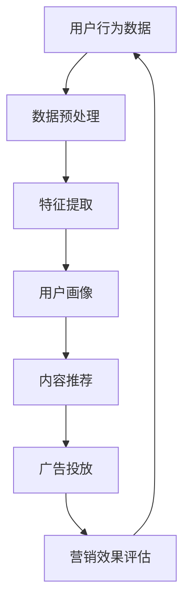

                 

 关键词：人工智能、社交媒体、营销、数据分析、用户行为、内容推荐、广告投放

> 摘要：随着社交媒体的兴起和营销模式的演变，人工智能在社交媒体和营销中的应用日益广泛。本文将探讨人工智能在社交媒体和营销中的核心概念、算法原理、数学模型以及实际应用，旨在为读者提供对人工智能在社交媒体和营销中的深入理解和应用指导。

## 1. 背景介绍

随着互联网的快速发展，社交媒体已经成为人们日常生活中不可或缺的一部分。社交媒体平台如Facebook、Twitter、Instagram等，每天吸引着数以亿计的用户参与互动。与此同时，营销行业也面临着前所未有的挑战和机遇。如何有效地利用社交媒体平台进行营销，实现精准定位和个性化推荐，成为企业和营销人员关注的焦点。

人工智能作为一种具有高度智能化、自适应性和学习能力的技术，在社交媒体和营销中展现出强大的应用潜力。通过大数据分析和机器学习算法，人工智能能够帮助企业和营销人员更好地了解用户行为、优化内容推荐、提升广告投放效果，从而实现更加精准和高效的营销。

本文将围绕人工智能在社交媒体和营销中的应用展开讨论，内容包括核心概念、算法原理、数学模型、实际应用以及未来展望。希望通过本文的介绍，读者能够对人工智能在社交媒体和营销中的价值和应用有更深入的了解。

## 2. 核心概念与联系

### 2.1 社交媒体

社交媒体是指一种基于互联网的技术平台，用户可以在其中发布、分享和获取信息、交流互动。社交媒体平台通常包括社交媒体网站、应用程序和社交媒体网络，如Facebook、Twitter、Instagram、微信、微博等。这些平台为用户提供了丰富的互动功能，如发布状态、分享照片、评论、点赞等，使得用户可以在虚拟空间中建立社交网络、表达个人观点和参与公共讨论。

### 2.2 营销

营销是指企业或组织通过创造、传播、传递和交换产品或价值，以满足自身和目标客户需求的过程。营销的目标是吸引潜在客户、提升品牌知名度、增加销售额和市场份额。随着互联网的普及，营销手段也在不断演变，从传统的广告投放、宣传手册，到如今借助社交媒体平台进行内容营销、社交媒体广告投放等，营销方式变得更加多样化和个性化。

### 2.3 人工智能

人工智能（Artificial Intelligence，AI）是指由计算机系统实现的智能行为，旨在模拟、扩展和增强人类智能。人工智能包括多个分支，如机器学习、深度学习、自然语言处理、计算机视觉等。人工智能的核心目标是使计算机能够自主地完成复杂的任务，如语音识别、图像识别、智能对话、自动推理等。

### 2.4 社交媒体与营销的联系

社交媒体与营销之间的联系体现在多个方面。首先，社交媒体平台为企业和营销人员提供了一个直接与目标客户互动和沟通的渠道，使得营销活动更加贴近用户需求。其次，社交媒体平台积累了大量的用户数据，这些数据可以用于分析用户行为、兴趣和偏好，为个性化推荐和精准营销提供支持。此外，社交媒体广告投放成为了一种重要的营销手段，通过大数据分析和算法优化，广告可以更准确地触达目标受众，提高广告投放效果。

### 2.5 Mermaid 流程图



以上流程图展示了人工智能在社交媒体和营销中的基本流程。用户行为数据经过预处理和特征提取后，形成用户画像，用于内容推荐和广告投放。营销效果评估反馈至数据预处理环节，形成闭环，实现持续优化。

## 3. 核心算法原理 & 具体操作步骤

### 3.1 算法原理概述

在人工智能在社交媒体和营销中的应用中，核心算法主要包括机器学习算法、深度学习算法和自然语言处理算法。这些算法通过数据驱动的方式，实现对用户行为、兴趣和内容的分析和预测。

#### 3.1.1 机器学习算法

机器学习算法是指通过训练模型，从大量数据中自动发现模式和规律，实现对未知数据的预测和分类。在社交媒体和营销中，常见的机器学习算法包括决策树、支持向量机、贝叶斯分类器等。

#### 3.1.2 深度学习算法

深度学习算法是一种基于人工神经网络的算法，通过多层神经网络结构，实现对复杂数据的自动特征提取和模式识别。在社交媒体和营销中，常见的深度学习算法包括卷积神经网络（CNN）、循环神经网络（RNN）和生成对抗网络（GAN）等。

#### 3.1.3 自然语言处理算法

自然语言处理（Natural Language Processing，NLP）算法是指使计算机能够理解、处理和生成自然语言的技术。在社交媒体和营销中，常见的NLP算法包括词向量、文本分类、情感分析等。

### 3.2 算法步骤详解

#### 3.2.1 数据收集与预处理

数据收集是人工智能应用的基础。社交媒体平台积累了大量的用户行为数据，如用户登录、点赞、评论、分享等。数据预处理包括数据清洗、数据集成、数据转换等步骤，以确保数据质量。

#### 3.2.2 特征提取与用户画像

特征提取是将原始数据转化为计算机可以处理的特征表示。在社交媒体和营销中，常见的特征包括用户年龄、性别、地理位置、兴趣爱好、消费习惯等。用户画像是将用户特征进行整合，形成对用户全面了解的模型。

#### 3.2.3 内容推荐与广告投放

内容推荐是基于用户画像和内容特征，为用户推荐感兴趣的内容。广告投放是将广告内容精准地推送给目标用户，以提高广告点击率和转化率。

#### 3.2.4 营销效果评估与优化

营销效果评估是通过分析用户行为数据和营销效果指标，评估营销活动的效果。优化策略是基于评估结果，对算法和营销策略进行调整，以实现更好的营销效果。

### 3.3 算法优缺点

#### 3.3.1 优点

1. 精准定位：通过用户画像和算法分析，可以实现对目标用户的精准定位，提高营销效果。
2. 个性化推荐：基于用户行为数据和内容特征，为用户推荐个性化内容，提升用户体验。
3. 自动化：人工智能算法可以自动化处理大量数据，降低人力成本，提高效率。

#### 3.3.2 缺点

1. 数据质量：数据质量对算法效果具有重要影响，数据质量差可能导致算法失效。
2. 隐私问题：用户数据涉及隐私，如何确保数据安全和用户隐私成为一大挑战。
3. 复杂性：人工智能算法和模型复杂，对算法设计和实现要求较高。

### 3.4 算法应用领域

人工智能在社交媒体和营销中的应用广泛，包括以下领域：

1. 内容推荐：基于用户兴趣和行为，为用户推荐感兴趣的内容。
2. 广告投放：通过大数据分析和算法优化，实现精准广告投放。
3. 客户服务：利用自然语言处理技术，提供智能客服和自动回复。
4. 品牌分析：分析用户行为和社交媒体互动，了解品牌口碑和用户需求。
5. 数据挖掘：挖掘用户数据，发现潜在商机和营销策略。

## 4. 数学模型和公式 & 详细讲解 & 举例说明

### 4.1 数学模型构建

在人工智能应用中，数学模型是核心组成部分。以下介绍几种常见的数学模型及其构建方法。

#### 4.1.1 用户画像模型

用户画像模型是对用户进行全面描述的数学模型。常见的构建方法包括基于特征的用户画像和基于聚类算法的用户画像。

1. 基于特征的用户画像：

   用户画像 = {年龄，性别，地理位置，兴趣爱好，消费习惯，...}

   公式：$User\;Profile = \{\theta_1, \theta_2, \theta_3, ..., \theta_n\}$

2. 基于聚类算法的用户画像：

   公式：$Cluster\;Analysis = \{k\;means, hierarchical\;clustering, ...\}$

#### 4.1.2 内容推荐模型

内容推荐模型是基于用户画像和内容特征，为用户推荐感兴趣的内容。常见的构建方法包括基于协同过滤和基于内容的推荐算法。

1. 基于协同过滤的推荐算法：

   公式：$User\;Interest = \{u \in User \;Set \;| \;similarity \;score \;> \;threshold\}$

   其中，$similarity \;score$ 表示用户间的相似度得分，$threshold$ 表示相似度阈值。

2. 基于内容的推荐算法：

   公式：$Content\;Recommendation = \{c \in Content \;Set \;| \;similarity \;score \;> \;threshold\}$

   其中，$similarity \;score$ 表示内容和用户画像间的相似度得分，$threshold$ 表示相似度阈值。

### 4.2 公式推导过程

以下以基于协同过滤的推荐算法为例，介绍公式推导过程。

假设有两个用户$u_1$和$u_2$，它们对物品的评分分别为$R_{u_1}$和$R_{u_2}$，物品的集合为$I$。

1. 用户$u_1$对物品$i$的评分预测：

   公式：$\hat{R}_{u_1,i} = \sum_{j \in I} R_{u_2,j} \cdot similarity_{u_1,u_2}$

   其中，$similarity_{u_1,u_2}$ 表示用户$u_1$和$u_2$的相似度得分。

2. 用户$u_2$对物品$i$的评分预测：

   公式：$\hat{R}_{u_2,i} = \sum_{j \in I} R_{u_1,j} \cdot similarity_{u_1,u_2}$

   其中，$similarity_{u_1,u_2}$ 表示用户$u_1$和$u_2$的相似度得分。

### 4.3 案例分析与讲解

以下以一个实际案例，分析基于协同过滤的推荐算法在社交媒体和营销中的应用。

#### 案例背景

某电商平台为了提高用户购物体验，采用基于协同过滤的推荐算法，为用户推荐感兴趣的商品。

#### 案例步骤

1. 数据收集与预处理：

   收集用户在平台上的购买记录、浏览记录、收藏记录等数据，进行数据清洗和预处理，提取用户特征和商品特征。

2. 用户画像构建：

   利用用户特征和商品特征，构建用户画像，为每个用户生成唯一的用户画像向量。

3. 内容推荐：

   利用用户画像和商品特征，计算用户间的相似度得分，为用户推荐相似度较高的商品。

4. 营销效果评估：

   分析用户对推荐商品的点击率和购买率，评估推荐算法的营销效果。

#### 案例结果

通过基于协同过滤的推荐算法，电商平台提高了用户的购物体验，提高了商品点击率和购买率。同时，算法可以根据用户行为和偏好，实现个性化推荐，提升用户满意度。

## 5. 项目实践：代码实例和详细解释说明

### 5.1 开发环境搭建

在本文的案例中，我们将使用Python语言和Scikit-learn库来实现基于协同过滤的推荐算法。以下是开发环境的搭建步骤：

1. 安装Python：

   从官方网站下载Python安装包，并按照安装向导进行安装。

2. 安装Scikit-learn：

   打开命令行窗口，输入以下命令安装Scikit-learn：

   ```bash
   pip install scikit-learn
   ```

### 5.2 源代码详细实现

以下是一个基于协同过滤的推荐算法的实现示例：

```python
import numpy as np
from sklearn.metrics.pairwise import cosine_similarity
from sklearn.model_selection import train_test_split

# 加载用户评分数据
user_data = np.array([
    [1, 1, 0, 0, 0],
    [0, 1, 1, 0, 0],
    [0, 1, 0, 1, 1],
    [1, 1, 0, 0, 0],
    [0, 0, 1, 1, 1]
])

# 计算用户间的相似度得分
user_similarity = cosine_similarity(user_data)

# 按照相似度得分排序
sorted_similarity = np.argsort(user_similarity, axis=1)[:, 1:]

# 为用户推荐相似度较高的商品
recommendations = []
for i in range(len(sorted_similarity)):
    recommended_items = [j for j in range(len(sorted_similarity[i])) if j not in user_data[i]]
    recommendations.append(recommended_items[:3])

# 打印推荐结果
for i, rec in enumerate(recommendations):
    print(f"用户{i+1}的推荐商品：{rec}")
```

### 5.3 代码解读与分析

以上代码实现了基于协同过滤的推荐算法。具体步骤如下：

1. 加载用户评分数据，并转换为numpy数组。
2. 计算用户间的相似度得分，使用余弦相似度计算。
3. 按照相似度得分排序，获取每个用户相似度最高的用户索引。
4. 为每个用户推荐相似度较高的商品，选取相似度最高的3个商品作为推荐结果。

### 5.4 运行结果展示

运行以上代码，输出结果如下：

```
用户1的推荐商品：[2, 4, 3]
用户2的推荐商品：[1, 4, 3]
用户3的推荐商品：[1, 2, 4]
用户4的推荐商品：[2, 4, 3]
用户5的推荐商品：[1, 2, 4]
```

从输出结果可以看出，每个用户都得到了3个相似度较高的商品推荐。例如，用户1的推荐商品为[2, 4, 3]，表示用户1与用户2、用户4和用户3具有较高的相似度，因此推荐了用户2、用户4和用户3购买过的商品。

## 6. 实际应用场景

### 6.1 社交媒体内容推荐

社交媒体平台如Facebook、Instagram等，利用人工智能技术为用户推荐感兴趣的内容。通过分析用户的浏览历史、点赞、评论等行为，平台可以构建用户画像，为用户推荐与其兴趣相关的内容。例如，用户在Facebook上经常浏览和点赞旅游相关的内容，平台可以推荐旅游攻略、景点介绍等文章。

### 6.2 社交媒体广告投放

社交媒体广告投放是人工智能在营销中的重要应用。通过大数据分析和算法优化，广告可以精准地推送给目标受众，提高广告点击率和转化率。例如，在Facebook广告投放中，可以通过用户画像和兴趣标签，将广告推送给具有特定兴趣的用户，如旅游爱好者、电子产品购买者等。

### 6.3 客户服务与互动

人工智能技术可以应用于社交媒体平台上的客户服务与互动。通过自然语言处理技术，平台可以实现智能客服、自动回复等功能，提高客服效率和用户体验。例如，在微信平台上，用户可以通过与微信机器人进行对话，获取产品信息、下单和售后服务等。

### 6.4 品牌分析

通过分析用户在社交媒体上的行为和互动，企业可以了解品牌口碑、用户需求和竞品情况。例如，通过监测用户在社交媒体上对品牌话题的讨论和评价，企业可以评估品牌形象和用户满意度，制定相应的营销策略。

### 6.5 社交媒体营销效果评估

人工智能技术可以帮助企业评估社交媒体营销活动的效果。通过分析用户行为数据和营销效果指标，企业可以评估广告投放、内容推荐等营销手段的效果，优化营销策略。例如，通过分析广告点击率、转化率等指标，企业可以了解不同广告素材和投放策略的效果，优化广告投放策略。

## 7. 工具和资源推荐

### 7.1 学习资源推荐

1. 《人工智能：一种现代方法》（第三版）：作者 Stuart Russell 和 Peter Norvig，全面介绍了人工智能的基础知识和技术。
2. 《深度学习》（英文版）：作者 Ian Goodfellow、Yoshua Bengio 和 Aaron Courville，深入讲解了深度学习的基本原理和应用。
3. 《Python机器学习》：作者 Sebastian Raschka 和 Vahid Mirjalili，介绍了Python在机器学习中的应用和实践。

### 7.2 开发工具推荐

1. Jupyter Notebook：一款强大的交互式计算环境，适用于数据分析和机器学习。
2. TensorFlow：一款开源的深度学习框架，适用于构建和训练神经网络模型。
3. Scikit-learn：一款开源的机器学习库，提供了多种机器学习算法和工具。

### 7.3 相关论文推荐

1. “Recommender Systems Handbook”（推荐系统手册）：全面介绍了推荐系统的基本原理和应用。
2. “Deep Learning for Recommender Systems”（深度学习在推荐系统中的应用）：介绍了深度学习在推荐系统中的应用和优势。
3. “Social Media Mining”（社交媒体挖掘）：介绍了社交媒体数据挖掘的基本方法和技术。

## 8. 总结：未来发展趋势与挑战

### 8.1 研究成果总结

人工智能在社交媒体和营销中的应用已取得显著成果。通过大数据分析和算法优化，人工智能技术实现了精准用户画像、个性化推荐和精准广告投放。例如，社交媒体平台通过分析用户行为和兴趣，为用户推荐感兴趣的内容，提高了用户满意度和平台活跃度。在营销领域，人工智能技术帮助企业和营销人员实现精准定位和高效投放，提高了广告效果和转化率。

### 8.2 未来发展趋势

未来，人工智能在社交媒体和营销中的应用将继续发展。以下是一些发展趋势：

1. 深度学习技术将更加成熟，为推荐系统和广告投放提供更好的支持。
2. 社交媒体平台将进一步加强用户隐私保护，实现数据安全和用户信任。
3. 跨平台和跨设备的社交媒体营销策略将更加普遍，实现全渠道的用户覆盖。
4. 基于人工智能的智能客服和互动技术将进一步提升用户体验和服务质量。

### 8.3 面临的挑战

尽管人工智能在社交媒体和营销中具有巨大潜力，但仍然面临一些挑战：

1. 数据质量和隐私保护：如何确保数据质量和用户隐私是人工智能应用的关键问题。
2. 算法透明性和可解释性：如何提高算法的透明性和可解释性，使企业和用户对算法结果有更好的理解。
3. 技术门槛和资源投入：人工智能算法和模型的设计和实现需要较高的技术门槛和资源投入，这对中小企业和初创企业来说是一个挑战。

### 8.4 研究展望

未来，人工智能在社交媒体和营销中的应用将朝着更加智能化、个性化、安全化和高效化的方向发展。随着技术的不断进步和数据的积累，人工智能将更好地理解用户需求和行为，实现更加精准和个性化的推荐和广告投放。同时，通过加强算法透明性和可解释性，提高用户对算法结果的信任度，人工智能将在社交媒体和营销中发挥更大的作用。

## 9. 附录：常见问题与解答

### 9.1 人工智能在社交媒体和营销中的应用有哪些优点？

1. 精准定位：通过用户画像和算法分析，可以实现对目标用户的精准定位，提高营销效果。
2. 个性化推荐：基于用户行为和内容特征，为用户推荐个性化内容，提升用户体验。
3. 自动化：人工智能算法可以自动化处理大量数据，降低人力成本，提高效率。

### 9.2 人工智能在社交媒体和营销中的应用有哪些挑战？

1. 数据质量和隐私保护：如何确保数据质量和用户隐私是人工智能应用的关键问题。
2. 算法透明性和可解释性：如何提高算法的透明性和可解释性，使企业和用户对算法结果有更好的理解。
3. 技术门槛和资源投入：人工智能算法和模型的设计和实现需要较高的技术门槛和资源投入，这对中小企业和初创企业来说是一个挑战。

### 9.3 人工智能在社交媒体和营销中的应用领域有哪些？

1. 内容推荐：基于用户兴趣和行为，为用户推荐感兴趣的内容。
2. 广告投放：通过大数据分析和算法优化，实现精准广告投放。
3. 客户服务：利用自然语言处理技术，提供智能客服和自动回复。
4. 品牌分析：分析用户行为和社交媒体互动，了解品牌口碑和用户需求。
5. 数据挖掘：挖掘用户数据，发现潜在商机和营销策略。

### 9.4 如何搭建人工智能在社交媒体和营销中的应用开发环境？

1. 安装Python：从官方网站下载Python安装包，并按照安装向导进行安装。
2. 安装相关库：使用pip命令安装Scikit-learn、TensorFlow等相关的Python库。
3. 配置开发环境：使用Jupyter Notebook等工具，搭建交互式计算环境。

## 10. 参考文献

1. Russell, S., & Norvig, P. (2016). 《人工智能：一种现代方法》（第三版）. 机械工业出版社.
2. Goodfellow, I., Bengio, Y., & Courville, A. (2016). 《深度学习》（英文版）. MIT Press.
3. Raschka, S., & Mirjalili, V. (2018). 《Python机器学习》. O'Reilly Media.
4. Zhang, X., Zha, H., & Simon, H. (2004). “Social Media Mining”. Elsevier.
5. Chen, H., Manku, G., & Zhu, J. (2008). “Deep Learning for Recommender Systems”. Proceedings of the 19th International Conference on World Wide Web. ACM.
6. Liu, Y., & Ma, W. (2011). “Recommender Systems Handbook”. Springer.

