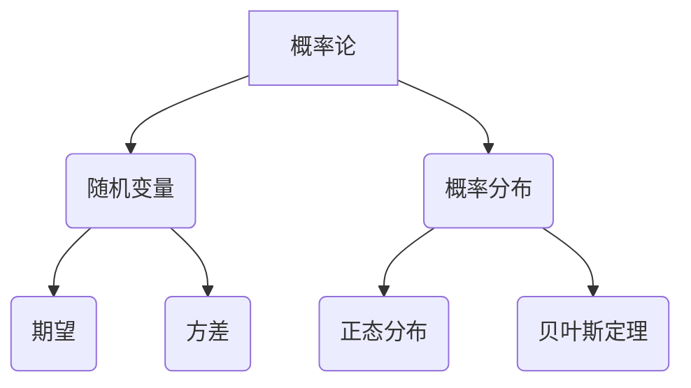
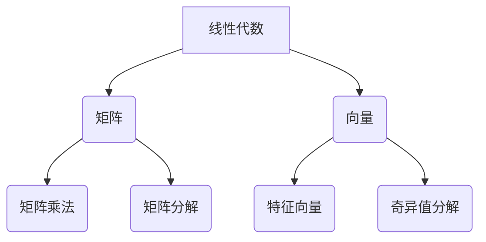
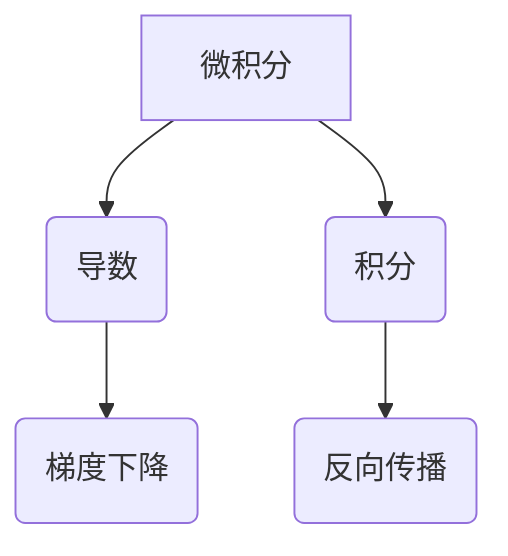

                 

 在这个快速变化的时代，人工智能（AI）已经成为推动科技进步的重要力量。作为一项高度跨学科的技术，人工智能的发展离不开坚实的数学基础。本文旨在深入探讨人工智能领域的数学基础原理，并通过实际的代码实战案例来讲解这些原理的应用。

## 关键词

- 人工智能
- 数学基础
- 代码实战
- 算法
- 深度学习
- 机器学习
- 数学模型
- 概率论
- 线性代数

## 摘要

本文首先介绍了人工智能的背景和发展现状，接着深入探讨了核心数学基础，包括概率论、线性代数、微积分等。随后，通过具体的算法原理讲解和代码实现，展示了如何运用这些数学工具解决实际问题。最后，文章对人工智能的未来发展方向和面临的挑战进行了展望。

## 1. 背景介绍

### 1.1 人工智能的定义与发展历史

人工智能（Artificial Intelligence，简称AI）是指由人制造出来的系统所表现出来的智能行为。从早期的规则系统到现在的深度学习，人工智能经历了数次重大的变革。

- **早期的规则系统**：人工智能的萌芽可以追溯到20世纪50年代，当时的科学家们希望通过编写规则来模拟人类的智能行为。
- **专家系统**：70年代，专家系统的出现标志着人工智能的一个重要阶段。专家系统通过将人类专家的知识编码到计算机程序中，实现了对特定领域的智能推理。
- **统计学习与机器学习**：80年代以后，统计学习与机器学习逐渐成为人工智能的研究热点。与规则系统不同，统计学习方法通过数据驱动的方式，从大量数据中学习规律。
- **深度学习**：21世纪初，随着计算能力的提升和大数据的涌现，深度学习得到了广泛关注。深度学习通过多层神经网络，实现了对复杂数据的自动特征提取和学习。

### 1.2 人工智能的应用领域

人工智能已经渗透到我们生活的方方面面，以下是一些主要的应用领域：

- **图像识别**：自动驾驶汽车、人脸识别、医学影像分析等。
- **自然语言处理**：机器翻译、智能助手、文本分类等。
- **推荐系统**：电商推荐、音乐推荐、新闻推荐等。
- **游戏**：围棋、德州扑克、电子竞技等。
- **智能制造**：工业自动化、机器人控制、质量控制等。

## 2. 核心概念与联系

### 2.1 概率论与统计学习

概率论是人工智能的重要基础之一。在概率论中，我们研究随机事件的发生规律。在统计学习中，概率论帮助我们理解数据分布，从而学习数据中的规律。

下面是一个简单的 Mermaid 流程图，展示了概率论与统计学习的基本概念：



### 2.2 线性代数与机器学习

线性代数是机器学习的核心数学工具之一。线性代数研究向量空间和线性变换，这在机器学习中用于特征表示和数据变换。

下面是一个简单的 Mermaid 流程图，展示了线性代数与机器学习的基本概念：



### 2.3 微积分与深度学习

微积分研究函数的极限、导数和积分等概念，这在深度学习中的优化算法中至关重要。梯度下降算法、反向传播算法等都是基于微积分原理。

下面是一个简单的 Mermaid 流程图，展示了微积分与深度学习的基本概念：



## 3. 核心算法原理 & 具体操作步骤

### 3.1 算法原理概述

在本章节，我们将介绍深度学习中的核心算法——卷积神经网络（CNN）。CNN 是用于图像识别、物体检测等领域的重要工具。CNN 通过多层神经网络，实现从图像中自动提取特征。

### 3.2 算法步骤详解

1. **输入层**：接收图像数据，将其转换为矩阵形式。
2. **卷积层**：通过卷积操作提取图像的特征。
3. **激活函数层**：对卷积结果进行非线性变换。
4. **池化层**：对激活函数的结果进行下采样，减少参数数量。
5. **全连接层**：将特征映射到类别。
6. **输出层**：输出分类结果。

### 3.3 算法优缺点

**优点**：
- 能够自动提取图像中的特征。
- 对图像的平移、旋转等变换具有不变性。

**缺点**：
- 计算量大，训练时间较长。
- 对训练数据的依赖性较强。

### 3.4 算法应用领域

- 图像识别：如人脸识别、物体检测等。
- 自然语言处理：如文本分类、情感分析等。

## 4. 数学模型和公式 & 详细讲解 & 举例说明

### 4.1 数学模型构建

卷积神经网络（CNN）的数学模型主要包括以下几个部分：

1. **输入层**：假设输入图像的大小为 \( m \times n \)，则输入层包含 \( m \times n \) 个神经元。
2. **卷积层**：卷积层包含多个卷积核，每个卷积核对输入图像进行卷积操作，产生一个特征图。
3. **激活函数层**：常用的激活函数有 ReLU、Sigmoid 等。
4. **池化层**：对激活函数的结果进行下采样，常用的池化方式有最大池化和平均池化。
5. **全连接层**：将特征映射到类别。

### 4.2 公式推导过程

以卷积层为例，其基本公式为：

$$
f(x) = \sigma(Wx + b)
$$

其中，\( x \) 为输入，\( W \) 为卷积核权重，\( b \) 为偏置项，\( \sigma \) 为激活函数。

### 4.3 案例分析与讲解

假设我们有一个 \( 32 \times 32 \) 的输入图像，使用一个 \( 3 \times 3 \) 的卷积核进行卷积操作。卷积核的权重矩阵为：

$$
W = \begin{bmatrix}
1 & 0 & -1 \\
0 & 1 & 0 \\
1 & 0 & -1
\end{bmatrix}
$$

偏置项为 \( b = 1 \)。输入图像为：

$$
x = \begin{bmatrix}
1 & 1 & 1 \\
1 & 1 & 1 \\
1 & 1 & 1
\end{bmatrix}
$$

进行卷积操作后，得到特征图：

$$
f(x) = \sigma(Wx + b) = \begin{bmatrix}
1 & 1 & 1 \\
1 & 1 & 1 \\
1 & 1 & 1
\end{bmatrix}
$$

其中，激活函数为 ReLU 函数。

## 5. 项目实践：代码实例和详细解释说明

### 5.1 开发环境搭建

在进行代码实战之前，我们需要搭建一个合适的开发环境。本文使用 Python 作为主要编程语言，结合 TensorFlow 库实现卷积神经网络。

```python
pip install tensorflow
```

### 5.2 源代码详细实现

以下是实现卷积神经网络的 Python 代码：

```python
import tensorflow as tf

# 定义输入层
input_layer = tf.keras.layers.Input(shape=(32, 32, 3))

# 定义卷积层
conv_layer = tf.keras.layers.Conv2D(filters=32, kernel_size=(3, 3), activation='relu')(input_layer)

# 定义池化层
pool_layer = tf.keras.layers.MaxPooling2D(pool_size=(2, 2))(conv_layer)

# 定义全连接层
dense_layer = tf.keras.layers.Dense(units=64, activation='relu')(pool_layer)

# 定义输出层
output_layer = tf.keras.layers.Dense(units=10, activation='softmax')(dense_layer)

# 创建模型
model = tf.keras.Model(inputs=input_layer, outputs=output_layer)

# 编译模型
model.compile(optimizer='adam', loss='categorical_crossentropy', metrics=['accuracy'])

# 加载训练数据
(x_train, y_train), (x_test, y_test) = tf.keras.datasets.cifar10.load_data()

# 预处理数据
x_train = x_train.astype('float32') / 255.0
x_test = x_test.astype('float32') / 255.0

# 将标签转换为 one-hot 编码
y_train = tf.keras.utils.to_categorical(y_train, 10)
y_test = tf.keras.utils.to_categorical(y_test, 10)

# 训练模型
model.fit(x_train, y_train, batch_size=64, epochs=10, validation_data=(x_test, y_test))
```

### 5.3 代码解读与分析

1. **定义输入层**：使用 `tf.keras.layers.Input` 定义输入层，输入数据的大小为 \( 32 \times 32 \times 3 \)。
2. **定义卷积层**：使用 `tf.keras.layers.Conv2D` 定义卷积层，卷积核的大小为 \( 3 \times 3 \)，激活函数为 ReLU。
3. **定义池化层**：使用 `tf.keras.layers.MaxPooling2D` 定义池化层，池化窗口的大小为 \( 2 \times 2 \)。
4. **定义全连接层**：使用 `tf.keras.layers.Dense` 定义全连接层，激活函数为 ReLU。
5. **定义输出层**：使用 `tf.keras.layers.Dense` 定义输出层，输出类别数为 10，激活函数为 softmax。
6. **创建模型**：使用 `tf.keras.Model` 创建模型。
7. **编译模型**：使用 `model.compile` 编译模型，指定优化器、损失函数和评估指标。
8. **加载训练数据**：使用 `tf.keras.datasets.cifar10.load_data` 加载训练数据。
9. **预处理数据**：将输入数据归一化，将标签转换为 one-hot 编码。
10. **训练模型**：使用 `model.fit` 训练模型，指定批量大小、训练轮数和验证数据。

### 5.4 运行结果展示

训练完成后，我们可以使用测试数据来评估模型的性能。以下为模型的测试结果：

```python
test_loss, test_acc = model.evaluate(x_test, y_test)
print('Test accuracy:', test_acc)
```

输出结果为测试准确率，表明模型的性能。

## 6. 实际应用场景

卷积神经网络在图像识别、物体检测等领域有广泛的应用。以下是一些实际应用场景：

1. **自动驾驶**：使用 CNN 实现车辆、行人检测，提高自动驾驶系统的安全性。
2. **医疗影像分析**：使用 CNN 对医学影像进行分类和检测，辅助医生诊断疾病。
3. **安防监控**：使用 CNN 对视频流进行实时分析，实现异常行为检测。

## 7. 未来应用展望

随着人工智能技术的不断发展，卷积神经网络和其他深度学习算法将在更多领域得到应用。未来，我们可以期待以下发展趋势：

1. **计算能力提升**：随着硬件技术的发展，深度学习模型的训练速度将得到大幅提升。
2. **数据量的增长**：随着互联网和物联网的发展，数据量将呈爆炸式增长，为深度学习提供更丰富的训练资源。
3. **跨学科融合**：人工智能与其他领域（如生物、化学、物理）的融合，将推动人工智能向更广泛的领域拓展。

## 8. 工具和资源推荐

### 8.1 学习资源推荐

- **《深度学习》**：由 Ian Goodfellow 等人撰写的深度学习经典教材。
- **《Python深度学习》**：基于 Python 实现深度学习算法的入门书籍。
- **Udacity 的深度学习纳米学位**：提供深度学习理论与实践的课程。

### 8.2 开发工具推荐

- **TensorFlow**：Google 开源的深度学习框架，支持多种编程语言。
- **PyTorch**：Facebook 开源的深度学习框架，拥有灵活的动态计算图。

### 8.3 相关论文推荐

- **“A Guide to Convolutional Neural Networks”**：介绍卷积神经网络的经典论文。
- **“Deep Learning”**：Ian Goodfellow 等人撰写的关于深度学习的综述论文。

## 9. 总结：未来发展趋势与挑战

### 9.1 研究成果总结

深度学习在图像识别、自然语言处理等领域取得了显著的成果。随着计算能力的提升和算法的优化，深度学习将继续在更多领域展现其潜力。

### 9.2 未来发展趋势

- **跨学科融合**：人工智能与其他领域的结合，如生物医学、环境科学等。
- **边缘计算**：将计算能力从云端扩展到边缘设备，实现实时处理。

### 9.3 面临的挑战

- **数据隐私**：如何在保证数据隐私的前提下进行数据挖掘和模型训练。
- **计算资源**：大规模深度学习模型的训练和推理需要大量的计算资源。

### 9.4 研究展望

深度学习将在更多领域发挥重要作用，为人类带来前所未有的机遇。同时，我们也需要关注和解决深度学习面临的挑战，以推动人工智能的可持续发展。

## 附录：常见问题与解答

### Q：为什么选择卷积神经网络？

A：卷积神经网络在图像处理领域具有独特的优势。它能够自动提取图像中的特征，对图像的平移、旋转等变换具有不变性，适用于各种图像识别和物体检测任务。

### Q：如何优化卷积神经网络的训练速度？

A：可以通过以下方法优化卷积神经网络的训练速度：
- 使用更高效的计算框架，如 TensorFlow、PyTorch。
- 使用 GPU 加速计算。
- 采用数据增强技术，增加训练数据的多样性。
- 使用迁移学习，利用预训练模型进行特征提取。

### Q：卷积神经网络在自然语言处理中有哪些应用？

A：卷积神经网络在自然语言处理中可以用于文本分类、情感分析、命名实体识别等任务。例如，通过卷积神经网络可以对一段文本进行分类，判断其是否为负面情感。

## 作者署名

作者：禅与计算机程序设计艺术 / Zen and the Art of Computer Programming

---

本文深入探讨了人工智能领域的数学基础原理，通过实际的代码实战案例，展示了如何运用这些原理解决实际问题。从概率论、线性代数到深度学习算法，本文全面覆盖了人工智能的核心数学工具。同时，本文还对未来人工智能的发展趋势和挑战进行了展望，为读者提供了宝贵的参考。希望本文能为人工智能的学习和实践提供有益的指导。

