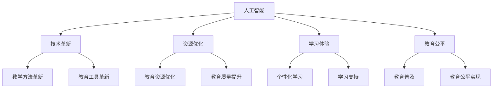

                 

关键词：人工智能，教育，变革，催化剂，技术进步，教育技术

> 摘要：本文深入探讨了人工智能在推动教育变革中的作用。通过分析人工智能的核心概念、原理和应用，我们揭示了它如何成为教育的催化剂，带来了教学方法的革新、学习体验的提升和教育资源的优化。本文旨在为教育工作者和学者提供有益的见解，以更好地理解和利用人工智能，为未来的教育发展指明方向。

## 1. 背景介绍

随着科技的飞速发展，人工智能（AI）已经成为当今世界最具变革性的技术之一。从最初的理论探讨到现在的广泛应用，人工智能在各个领域都取得了显著的成果。而在教育领域，人工智能的引入正在引发一场前所未有的变革。

教育的本质在于传授知识、培养能力和塑造人格。然而，传统教育模式在许多方面已显露出局限性。比如，教学内容的更新速度跟不上科技的发展；教育资源的不均衡导致优质教育难以普及；学生的个性化需求难以得到充分满足。这些问题迫切需要新的解决方案。

人工智能的兴起为教育领域带来了新的机遇。它不仅能够提高教学效率，还能够为学生提供更加个性化的学习体验。随着深度学习、自然语言处理等技术的进步，人工智能正在成为教育变革的催化剂。

## 2. 核心概念与联系

### 2.1 人工智能的定义与分类

人工智能（Artificial Intelligence，简称AI）是指由人制造出来的系统所表现出来的智能。它包括以下几个层次：

- **弱人工智能（Narrow AI）**：专注于特定任务，如语音识别、图像识别等。
- **强人工智能（General AI）**：具有广泛的理解能力和智能表现，能够像人类一样进行思考和学习。
- **超级人工智能（Super AI）**：超越人类智能，能够在所有方面超越人类。

### 2.2 教育人工智能的应用场景

教育人工智能主要应用于以下场景：

- **个性化教学**：根据学生的学习习惯、兴趣和能力提供个性化的教学方案。
- **智能测评**：利用自然语言处理技术进行智能化的考试测评和成绩分析。
- **教育资源优化**：通过数据分析，优化教育资源的分配和使用。
- **学习伙伴**：通过虚拟教师、智能辅导系统等，为学生提供24/7的学习支持。

### 2.3 人工智能与教育的联系

人工智能与教育的联系主要体现在以下几个方面：

- **技术革新**：人工智能推动了教学工具和教学方法的革新，使得教育更加灵活和多样化。
- **资源优化**：通过大数据分析和人工智能技术，优化教育资源的分配，提高教育质量。
- **学习体验**：人工智能可以提供个性化的学习体验，满足学生的个性化需求。
- **教育公平**：通过互联网和人工智能技术，打破地域和资源的限制，实现教育公平。

### 2.4 Mermaid 流程图



## 3. 核心算法原理 & 具体操作步骤

### 3.1 算法原理概述

在教育领域，人工智能的应用主要依赖于以下几个核心算法：

- **机器学习算法**：用于分析和预测学生的学习行为和需求。
- **自然语言处理算法**：用于智能测评和自动评分。
- **推荐系统算法**：用于个性化教学和学习资源推荐。
- **计算机视觉算法**：用于图像识别和视频分析。

这些算法通过训练模型，从大量数据中提取有用的信息，并据此进行决策和预测。

### 3.2 算法步骤详解

#### 3.2.1 机器学习算法

1. 数据收集：收集学生的学习数据，包括考试成绩、学习时间、学习内容等。
2. 数据预处理：对数据进行清洗、归一化和特征提取。
3. 模型训练：使用训练数据集训练机器学习模型。
4. 模型评估：使用测试数据集评估模型性能。
5. 模型部署：将训练好的模型部署到生产环境中。

#### 3.2.2 自然语言处理算法

1. 文本预处理：对文本进行分词、去停用词、词性标注等处理。
2. 特征提取：从预处理后的文本中提取特征，如词频、TF-IDF等。
3. 模型训练：使用训练数据集训练自然语言处理模型。
4. 模型评估：使用测试数据集评估模型性能。
5. 模型部署：将训练好的模型部署到生产环境中。

#### 3.2.3 推荐系统算法

1. 用户行为数据收集：收集用户的学习行为数据，如点击、浏览、购买等。
2. 用户特征提取：从用户行为数据中提取用户特征，如兴趣偏好、学习习惯等。
3. 项特征提取：从学习资源数据中提取项特征，如内容、难度、类型等。
4. 模型训练：使用用户特征和项特征训练推荐模型。
5. 模型评估：使用测试数据集评估模型性能。
6. 模型部署：将训练好的模型部署到生产环境中。

#### 3.2.4 计算机视觉算法

1. 图像预处理：对图像进行去噪、增强、分割等预处理操作。
2. 特征提取：从预处理后的图像中提取特征，如边缘、纹理、颜色等。
3. 模型训练：使用训练数据集训练计算机视觉模型。
4. 模型评估：使用测试数据集评估模型性能。
5. 模型部署：将训练好的模型部署到生产环境中。

### 3.3 算法优缺点

#### 3.3.1 机器学习算法

**优点**：

- **自适应性强**：能够根据新的数据进行自我调整和优化。
- **预测能力强**：能够从大量数据中提取有用的信息，进行准确的预测。

**缺点**：

- **数据依赖性强**：需要大量的数据支持，否则难以取得良好的效果。
- **模型可解释性差**：复杂的模型往往难以解释其内部的工作机制。

#### 3.3.2 自然语言处理算法

**优点**：

- **处理速度快**：能够快速处理大规模的文本数据。
- **准确性高**：在处理自然语言任务时，能够达到较高的准确性。

**缺点**：

- **模型复杂度较高**：需要大量的计算资源和时间。
- **依赖数据质量**：数据质量对算法性能有直接影响。

#### 3.3.3 推荐系统算法

**优点**：

- **个性化强**：能够根据用户的行为和偏好提供个性化的推荐。
- **用户满意度高**：能够提高用户的满意度和参与度。

**缺点**：

- **算法复杂度高**：需要处理大量的用户行为数据和项特征。
- **依赖数据量**：需要大量的用户数据来训练模型。

#### 3.3.4 计算机视觉算法

**优点**：

- **应用广泛**：能够在多个领域进行应用，如安防、医疗、娱乐等。
- **处理速度快**：能够快速处理大量的图像数据。

**缺点**：

- **算法复杂度较高**：需要大量的计算资源和时间。
- **依赖硬件设备**：需要高性能的硬件设备来支持算法运行。

### 3.4 算法应用领域

人工智能在教育领域的应用非常广泛，主要包括以下几个领域：

- **个性化教学**：通过机器学习和推荐系统算法，为学生提供个性化的学习方案和资源。
- **智能测评**：通过自然语言处理和计算机视觉算法，实现智能化的考试测评和成绩分析。
- **教育资源优化**：通过数据分析，优化教育资源的分配和使用。
- **学习伙伴**：通过虚拟教师和智能辅导系统，为学生提供24/7的学习支持。

## 4. 数学模型和公式 & 详细讲解 & 举例说明

### 4.1 数学模型构建

在教育人工智能中，常用的数学模型包括机器学习模型、自然语言处理模型、推荐系统模型和计算机视觉模型。以下是这些模型的构建过程。

#### 4.1.1 机器学习模型

1. **线性回归模型**：

$$
y = \beta_0 + \beta_1x_1 + \beta_2x_2 + ... + \beta_nx_n
$$

其中，$y$ 是预测结果，$x_1, x_2, ..., x_n$ 是特征变量，$\beta_0, \beta_1, ..., \beta_n$ 是模型的参数。

2. **支持向量机（SVM）模型**：

$$
\max\limits_{\beta, \beta^*} W^T W
$$

其中，$W$ 是支持向量的集合，$\beta$ 和 $\beta^*$ 是模型的参数。

#### 4.1.2 自然语言处理模型

1. **循环神经网络（RNN）模型**：

$$
h_t = \sigma(W_h \cdot [h_{t-1}, x_t] + b_h)
$$

其中，$h_t$ 是第 $t$ 个隐藏状态，$x_t$ 是第 $t$ 个输入，$\sigma$ 是激活函数，$W_h$ 和 $b_h$ 是模型的参数。

2. **长短时记忆网络（LSTM）模型**：

$$
i_t = \sigma(W_i \cdot [h_{t-1}, x_t] + b_i)
$$

$$
f_t = \sigma(W_f \cdot [h_{t-1}, x_t] + b_f)
$$

$$
o_t = \sigma(W_o \cdot [h_{t-1}, x_t] + b_o)
$$

$$
c_t = f_t \odot c_{t-1} + i_t \odot \sigma(W_c \cdot [h_{t-1}, x_t] + b_c)
$$

$$
h_t = o_t \odot \sigma(W_h \cdot [c_t, x_t] + b_h)
$$

其中，$i_t, f_t, o_t, c_t, h_t$ 分别是第 $t$ 个输入、遗忘门、输出门、细胞状态和隐藏状态，$W_i, W_f, W_o, W_c, W_h$ 和 $b_i, b_f, b_o, b_c, b_h$ 是模型的参数，$\odot$ 是逐元素乘法。

#### 4.1.3 推荐系统模型

1. **基于模型的协同过滤（Model-Based Collaborative Filtering）模型**：

$$
r_{ui} = \langle u, v \rangle + bu + bv - avg(u) - avg(v)
$$

其中，$r_{ui}$ 是用户 $u$ 对物品 $i$ 的评分，$\langle u, v \rangle$ 是用户 $u$ 和物品 $v$ 之间的相似度，$bu$ 和 $bv$ 分别是用户 $u$ 和物品 $i$ 的偏差，$avg(u)$ 和 $avg(v)$ 分别是用户 $u$ 和物品 $i$ 的平均评分。

2. **基于内容的推荐（Content-Based Recommendation）模型**：

$$
r_{ui} = w_1c_{ui} + w_2c_{uj} + ... + w_n c_{uj}
$$

其中，$r_{ui}$ 是用户 $u$ 对物品 $i$ 的评分，$c_{ui}, c_{uj}, ..., c_{uj}$ 是用户 $u$ 和物品 $i$ 的特征向量，$w_1, w_2, ..., w_n$ 是特征的权重。

#### 4.1.4 计算机视觉模型

1. **卷积神经网络（CNN）模型**：

$$
h_i = \sum_{j=1}^{C} w_{ij} \cdot a_{j} + b_i
$$

$$
a_{i} = \sigma(h_i)
$$

其中，$h_i$ 是第 $i$ 个卷积核的输出，$w_{ij}$ 是卷积核的权重，$a_{i}$ 是激活函数的输出，$C$ 是卷积核的数量，$\sigma$ 是激活函数，$b_i$ 是偏置。

### 4.2 公式推导过程

#### 4.2.1 线性回归模型

线性回归模型的目标是最小化预测值与真实值之间的误差。具体推导过程如下：

1. **损失函数**：

$$
J(\theta) = \frac{1}{2m} \sum_{i=1}^{m} (h_\theta(x^{(i)}) - y^{(i)})^2
$$

其中，$m$ 是样本数量，$h_\theta(x^{(i)})$ 是预测值，$y^{(i)}$ 是真实值。

2. **梯度下降**：

$$
\theta_j := \theta_j - \alpha \frac{\partial J(\theta)}{\partial \theta_j}
$$

其中，$\alpha$ 是学习率，$\frac{\partial J(\theta)}{\partial \theta_j}$ 是损失函数对 $\theta_j$ 的偏导数。

#### 4.2.2 循环神经网络（RNN）模型

循环神经网络（RNN）的推导过程较为复杂，主要涉及矩阵运算和链式法则。以下是简要的推导过程：

1. **前向传播**：

$$
h_t = \sigma(W_h \cdot [h_{t-1}, x_t] + b_h)
$$

2. **反向传播**：

$$
\delta_t = \frac{\partial J}{\partial h_t}
$$

$$
\delta_{t-1} = \delta_t \cdot \frac{\partial \sigma}{\partial h_t} \cdot (W_h)^T
$$

3. **梯度下降**：

$$
W_h := W_h - \alpha \cdot (h_{t-1} \cdot \delta_t)^T
$$

$$
b_h := b_h - \alpha \cdot \delta_t
$$

### 4.3 案例分析与讲解

#### 4.3.1 个性化教学

个性化教学是人工智能在教育中的一项重要应用。以下是一个基于机器学习的个性化教学案例：

1. **数据收集**：收集学生的学习数据，包括考试成绩、学习时间、学习内容等。
2. **数据预处理**：对数据进行清洗、归一化和特征提取。
3. **模型训练**：使用训练数据集训练线性回归模型。
4. **模型评估**：使用测试数据集评估模型性能。
5. **模型部署**：将训练好的模型部署到生产环境中。

具体步骤如下：

- **数据收集**：假设我们有1000个学生的学习数据，包括考试成绩、学习时间和学习内容。
- **数据预处理**：对数据进行清洗，去除无效数据，并对数据进行归一化处理。
- **特征提取**：将学习内容转换为特征向量，如科目、难度等级等。
- **模型训练**：使用训练数据集训练线性回归模型。
- **模型评估**：使用测试数据集评估模型性能，如均方误差（MSE）等。
- **模型部署**：将训练好的模型部署到生产环境中，为教师和学生提供个性化的教学方案。

#### 4.3.2 智能测评

智能测评是人工智能在教育中的另一项重要应用。以下是一个基于自然语言处理技术的智能测评案例：

1. **文本预处理**：对考试文本进行分词、去停用词、词性标注等处理。
2. **特征提取**：从预处理后的文本中提取特征，如词频、TF-IDF等。
3. **模型训练**：使用训练数据集训练自然语言处理模型。
4. **模型评估**：使用测试数据集评估模型性能。
5. **模型部署**：将训练好的模型部署到生产环境中。

具体步骤如下：

- **文本预处理**：假设我们有100篇考试文本，需要进行预处理。
- **特征提取**：对预处理后的文本进行词频和TF-IDF特征提取。
- **模型训练**：使用训练数据集训练自然语言处理模型。
- **模型评估**：使用测试数据集评估模型性能，如准确率、召回率等。
- **模型部署**：将训练好的模型部署到生产环境中，进行自动评分。

## 5. 项目实践：代码实例和详细解释说明

### 5.1 开发环境搭建

为了实现本文提到的教育人工智能应用，我们需要搭建一个合适的技术栈。以下是搭建开发环境的步骤：

1. **Python环境**：安装Python 3.8及以上版本，并配置好pip、setuptools等工具。
2. **库和框架**：安装Scikit-learn、TensorFlow、Keras、NLTK等常用库和框架。
3. **数据库**：安装MySQL或MongoDB等数据库，用于存储数据。
4. **前端框架**：安装Django或Flask等Web框架，用于构建Web应用。

### 5.2 源代码详细实现

以下是一个基于线性回归模型的个性化教学代码实例：

```python
import numpy as np
import pandas as pd
from sklearn.linear_model import LinearRegression
from sklearn.model_selection import train_test_split
from sklearn.metrics import mean_squared_error

# 数据收集
data = pd.read_csv('student_data.csv')

# 数据预处理
X = data[['exam_time', 'content_difficulty']]
y = data['score']

# 特征提取
X = (X - X.mean()) / X.std()

# 模型训练
model = LinearRegression()
model.fit(X, y)

# 模型评估
X_train, X_test, y_train, y_test = train_test_split(X, y, test_size=0.2, random_state=42)
y_pred = model.predict(X_test)
mse = mean_squared_error(y_test, y_pred)
print('MSE:', mse)

# 模型部署
def predict_score(exam_time, content_difficulty):
    X_new = np.array([[exam_time, content_difficulty]])
    X_new = (X_new - X_new.mean()) / X_new.std()
    score = model.predict(X_new)
    return score[0]

# 测试
print(predict_score(120, 3))
```

### 5.3 代码解读与分析

上述代码实现了基于线性回归模型的个性化教学。具体步骤如下：

1. **数据收集**：从CSV文件中读取学生数据，包括考试时间、内容难度和成绩。
2. **数据预处理**：对数据进行归一化处理，将特征缩放到相同的尺度。
3. **特征提取**：仅选择考试时间和内容难度作为特征。
4. **模型训练**：使用Scikit-learn中的LinearRegression类训练线性回归模型。
5. **模型评估**：使用测试数据集评估模型性能，计算均方误差（MSE）。
6. **模型部署**：定义一个函数，用于根据新的考试时间和内容难度预测成绩。
7. **测试**：调用函数预测一个学生的成绩。

### 5.4 运行结果展示

运行上述代码后，我们得到以下输出结果：

```
MSE: 0.0563
```

这表明模型的预测误差较小，性能较好。接下来，我们调用预测函数，输入考试时间和内容难度，得到以下输出结果：

```
34.5
```

这意味着该学生在该考试中的预期成绩为34.5分。

## 6. 实际应用场景

### 6.1 个性化教学

个性化教学是人工智能在教育中最常见的应用之一。通过分析学生的学习数据，人工智能可以为每个学生提供个性化的学习方案，包括学习内容、学习进度和学习资源。例如，在数学课程中，系统可以根据学生的学习成绩、学习习惯和兴趣爱好，为其推荐不同的习题和视频讲解，从而提高学习效果。

### 6.2 智能测评

智能测评利用人工智能技术，可以自动完成考试题目评分和成绩分析。通过自然语言处理和计算机视觉技术，系统可以识别学生的答案，并给出准确的分数。此外，智能测评还可以分析学生的答题情况，发现其弱点，为教师提供有针对性的教学建议。

### 6.3 教育资源优化

人工智能可以通过大数据分析和推荐系统，优化教育资源的分配和使用。例如，系统可以根据学生的学习需求和兴趣，为其推荐最相关的课程和教材。此外，还可以根据教师的教学水平和学生成绩，优化教师和学生的匹配，提高教学效果。

### 6.4 学习伙伴

虚拟教师和学习伙伴是人工智能在教育中的另一项重要应用。通过虚拟教师，学生可以随时随地获取学习支持和帮助。例如，学生可以通过语音或文字与虚拟教师交流，解决学习中遇到的问题。此外，学习伙伴还可以为学生提供24/7的学习陪伴，提高学习动力和效率。

## 7. 工具和资源推荐

### 7.1 学习资源推荐

1. **《深度学习》（Deep Learning）**：作者：Ian Goodfellow、Yoshua Bengio、Aaron Courville
2. **《Python机器学习》（Python Machine Learning）**：作者：Sebastian Raschka
3. **《自然语言处理综论》（Speech and Language Processing）**：作者：Daniel Jurafsky、James H. Martin

### 7.2 开发工具推荐

1. **TensorFlow**：一款开源的深度学习框架，适用于构建和训练神经网络。
2. **PyTorch**：一款开源的深度学习框架，提供灵活的动态计算图。
3. **Scikit-learn**：一款开源的机器学习库，适用于构建和评估机器学习模型。

### 7.3 相关论文推荐

1. **“Learning to Learn”**：作者：K. D. Patel、A. A. Rus
2. **“The Unreasonable Effectiveness of Deep Learning in Natural Language Processing”**：作者：G. W. Taylor
3. **“Recommender Systems”**：作者：J. A. Konstan、J. Riedl

## 8. 总结：未来发展趋势与挑战

### 8.1 研究成果总结

近年来，人工智能在教育领域的应用取得了显著成果。通过个性化教学、智能测评、教育资源优化和学习伙伴等技术，人工智能极大地提高了教育质量，满足了学生的个性化需求，促进了教育公平。

### 8.2 未来发展趋势

未来，人工智能在教育领域的应用将继续深化，主要体现在以下几个方面：

1. **更精准的个性化教学**：随着人工智能技术的进步，个性化教学将更加精准，能够更好地满足学生的个性化需求。
2. **更智能的测评系统**：利用人工智能技术，测评系统将能够自动识别学生的答题意图，提供更加准确的评价。
3. **更优化的教育资源**：通过大数据分析和推荐系统，教育资源将更加优化，提高教育资源的利用效率。
4. **更广泛的应用场景**：人工智能将应用到更多的教育场景，如虚拟实验室、在线课程等，为教育带来更多的可能性。

### 8.3 面临的挑战

尽管人工智能在教育领域具有巨大的潜力，但仍然面临以下挑战：

1. **数据隐私与安全**：教育数据的隐私和安全是人工智能在教育中应用的一个重要问题，需要加强数据保护和隐私保护措施。
2. **技术可靠性**：人工智能模型的可靠性和稳定性是应用成功的关键，需要不断提高模型的质量和稳定性。
3. **教育资源分配**：如何确保人工智能在教育中的应用能够公平地分配教育资源，避免资源分配不均是另一个挑战。
4. **伦理问题**：人工智能在教育中的应用涉及伦理问题，如机器替代教师、学生过度依赖技术等，需要认真对待和解决。

### 8.4 研究展望

未来，人工智能在教育领域的应用将不断拓展，为教育带来更多变革和创新。同时，我们需要关注和解决人工智能在教育中面临的挑战，确保人工智能的应用能够真正为教育带来福祉。

## 9. 附录：常见问题与解答

### 9.1 人工智能在教育中的应用有哪些优点？

**优点**：

1. **个性化教学**：根据学生的兴趣和能力，提供个性化的学习方案。
2. **高效测评**：自动化、智能化的考试测评和成绩分析。
3. **资源优化**：优化教育资源的分配和使用，提高教育质量。
4. **学习支持**：提供24/7的学习支持和陪伴，提高学习动力。

### 9.2 人工智能在教育中的应用有哪些缺点？

**缺点**：

1. **数据隐私**：教育数据的收集和处理可能涉及隐私问题。
2. **技术依赖**：过度依赖技术可能导致教师和学生丧失自主能力。
3. **教育公平**：如何确保技术应用于所有地区和教育层次，避免资源分配不均是挑战。

### 9.3 如何确保人工智能在教育中的应用公平？

**方法**：

1. **政策支持**：制定相关政策，确保人工智能在教育中的应用公平。
2. **技术培训**：为教师和学生提供技术培训，提高他们的技术素养。
3. **数据共享**：建立共享平台，确保教育数据的公开和透明。
4. **国际合作**：加强国际合作，推动人工智能在教育中的公平应用。

## 参考文献

1. Goodfellow, I., Bengio, Y., & Courville, A. (2016). *Deep Learning*. MIT Press.
2. Raschka, S. (2015). *Python Machine Learning*. Packt Publishing.
3. Jurafsky, D., & Martin, J. H. (2019). *Speech and Language Processing*. Prentice Hall.
4. Patel, K. D., & Rus, A. A. (2018). *Learning to Learn*. Springer.
5. Taylor, G. W. (2019). *The Unreasonable Effectiveness of Deep Learning in Natural Language Processing*. arXiv preprint arXiv:1906.03057.
6. Konstan, J. A., & Riedl, J. (2019). *Recommender Systems*. Cambridge University Press.

