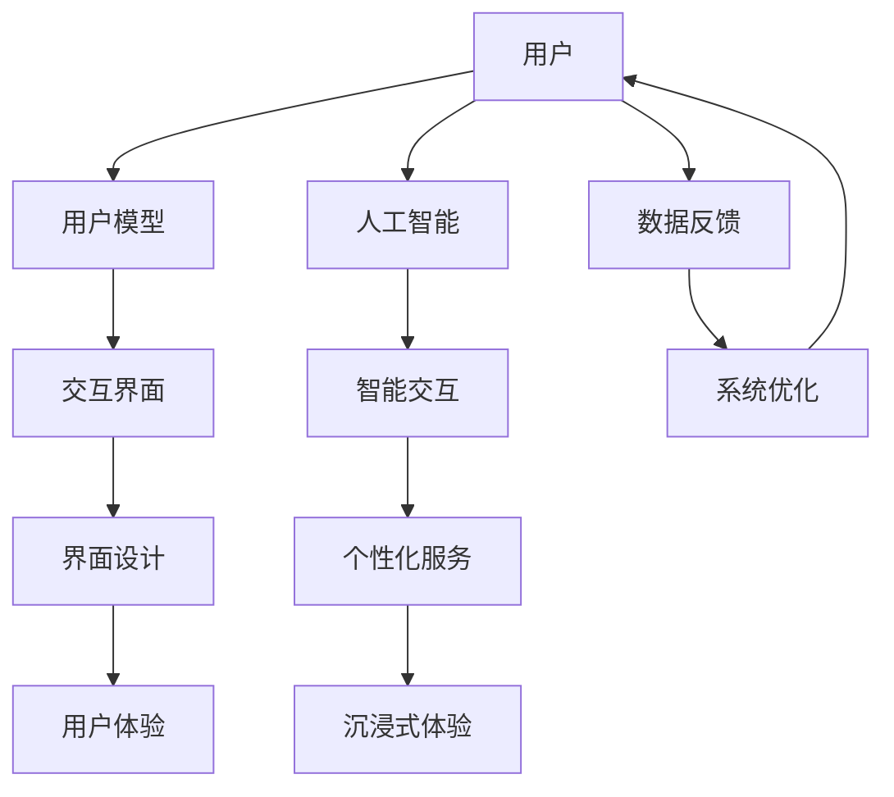

                 

关键词：人机交互、未来趋势、人工智能、用户体验、技术发展、用户界面、沉浸式体验

> 摘要：本文旨在探讨人机交互领域的未来趋势与展望，通过分析人工智能技术的快速发展，探讨如何构建更智能、更高效的用户体验。文章将详细探讨人机交互的核心概念、算法原理、数学模型、实践应用及未来发展方向，旨在为读者提供一个全面的人机交互领域全景图。

## 1. 背景介绍

### 1.1 人机交互的定义与历史

人机交互（Human-Computer Interaction，简称HCI）是研究人类与计算机系统之间交互的一门学科。它关注如何设计、评估和实现用户界面，以便提供更好的用户体验。人机交互的历史可以追溯到20世纪60年代，当时的计算机系统主要是为专业人士设计的，界面复杂且不友好。

随着时间的推移，人机交互领域经历了多次重大变革。早期的文本界面逐渐被图形用户界面（GUI）取代，使得计算机操作变得更加直观和易用。随着互联网的普及，Web界面成为了人机交互的主要形式。近年来，移动设备和触控技术的兴起，又为人机交互带来了新的挑战和机遇。

### 1.2 人工智能与人机交互的融合

人工智能（AI）技术的发展极大地推动了人机交互的进步。通过机器学习和深度学习算法，计算机系统可以更好地理解用户的意图和行为，提供个性化的服务。例如，语音识别技术使得语音交互成为现实，自然语言处理（NLP）则让计算机能够处理更加复杂的语言任务。

人工智能与人机交互的融合，不仅提高了系统的智能化水平，还改变了用户与计算机交互的方式。智能助手、智能音响、智能车载系统等成为日常生活中不可或缺的组成部分。这一趋势将继续加速，引领人机交互向更加智能化、个性化、沉浸式的方向发展。

## 2. 核心概念与联系

为了更好地理解人机交互的发展趋势，我们首先需要了解一些核心概念。以下是一个使用Mermaid绘制的流程图，展示了这些概念之间的联系。



### 2.1 用户模型

用户模型是描述用户特征、需求和行为的抽象表示。通过用户模型，系统能够更好地理解用户的意图和行为，从而提供个性化的服务。用户模型包括用户的基本信息、历史行为、偏好设置等。

### 2.2 交互界面

交互界面是用户与计算机系统进行交互的桥梁。一个良好的交互界面应具备直观性、易用性和适应性。随着技术的发展，交互界面形式也在不断变化，从早期的命令行界面到图形用户界面，再到现在的触摸屏和语音交互。

### 2.3 界面设计

界面设计是构建交互界面的关键步骤。它涉及到用户界面布局、色彩搭配、字体选择、交互元素设计等方面。良好的界面设计能够提升用户体验，降低用户的学习成本。

### 2.4 用户体验

用户体验（UX）是衡量人机交互系统优劣的重要指标。一个优秀的用户体验应具备以下特点：直观、流畅、有趣、高效。用户体验的优化需要综合考虑用户需求、技术实现和市场反馈等多方面因素。

### 2.5 人工智能

人工智能技术为人机交互带来了革命性的变化。通过机器学习和深度学习算法，计算机系统能够自动学习用户的意图和行为，提供个性化的服务。人工智能技术在语音识别、图像识别、自然语言处理等领域取得了显著成果，为人机交互的智能化提供了强有力的支持。

### 2.6 智能交互

智能交互是指利用人工智能技术实现的用户与计算机系统的交互。智能交互不仅能够提高系统的智能化水平，还能够改变用户与计算机交互的方式。例如，智能助手能够通过语音识别和自然语言处理技术，与用户进行自然、流畅的对话。

### 2.7 个性化服务

个性化服务是基于用户模型和人工智能技术实现的。通过分析用户的历史行为和偏好，系统能够为用户提供个性化的推荐、服务和体验。个性化服务能够提高用户满意度，提升用户忠诚度。

### 2.8 沉浸式体验

沉浸式体验是一种通过多感官刺激实现的高度逼真的交互体验。虚拟现实（VR）和增强现实（AR）技术为人机交互带来了沉浸式体验的可能。沉浸式体验能够提升用户的参与感和投入感，为游戏、教育、医疗等领域带来新的应用场景。

### 2.9 数据反馈

数据反馈是优化人机交互系统的重要手段。通过收集和分析用户在使用过程中的数据，系统能够发现存在的问题和改进的机会。数据反馈不仅能够优化系统性能，还能够为用户模型和个性化服务提供依据。

### 2.10 系统优化

系统优化是基于数据反馈对计算机系统进行的改进。通过优化系统性能、稳定性和可扩展性，系统能够提供更好的用户体验。系统优化是持续迭代和改进的过程，旨在不断提高人机交互系统的质量和效果。

## 3. 核心算法原理 & 具体操作步骤

### 3.1 算法原理概述

人机交互领域的核心算法主要涉及机器学习和深度学习技术。这些算法通过从大量数据中学习用户的意图和行为，实现智能交互和个性化服务。

主要算法包括：

- 机器学习算法：如决策树、支持向量机（SVM）、神经网络等；
- 深度学习算法：如卷积神经网络（CNN）、循环神经网络（RNN）等；
- 自然语言处理算法：如词向量、句法分析、语义理解等。

### 3.2 算法步骤详解

#### 3.2.1 数据收集

数据收集是算法训练的基础。在人机交互领域，数据来源包括用户行为日志、语音数据、文本数据等。数据收集需要遵循用户隐私保护原则，确保数据的安全和合规。

#### 3.2.2 数据预处理

数据预处理是数据清洗和数据转换的过程。数据预处理包括以下步骤：

- 数据清洗：去除噪音数据和异常值；
- 数据转换：将原始数据转换为适合算法训练的格式，如数值化、编码等。

#### 3.2.3 算法训练

算法训练是通过输入预处理的训练数据，调整算法参数，使算法能够准确预测用户的意图和行为。训练过程通常包括以下几个阶段：

- 数据划分：将数据划分为训练集、验证集和测试集；
- 模型训练：使用训练集训练模型；
- 模型验证：使用验证集评估模型性能；
- 模型优化：根据验证集结果调整模型参数。

#### 3.2.4 模型部署

模型部署是将训练好的模型应用于实际场景，实现智能交互和个性化服务。部署过程包括以下步骤：

- 模型部署：将模型部署到服务器或设备上；
- 模型调用：根据用户输入调用模型进行预测；
- 结果输出：将模型预测结果呈现给用户。

### 3.3 算法优缺点

#### 优点

- 智能化：算法能够根据用户行为和意图提供个性化服务；
- 自动化：算法能够自动学习用户行为，减少人工干预；
- 可扩展性：算法可以应用于不同领域和场景，实现跨领域的智能交互。

#### 缺点

- 数据依赖性：算法性能高度依赖于数据质量和数量；
- 隐私风险：用户数据泄露可能导致隐私问题；
- 黑箱问题：深度学习算法的黑箱特性使得算法解释性较差。

### 3.4 算法应用领域

人机交互算法广泛应用于多个领域，如：

- 语音识别：智能助手、智能音响等；
- 图像识别：安防监控、自动驾驶等；
- 自然语言处理：智能客服、智能翻译等；
- 智能推荐：电商、媒体等。

## 4. 数学模型和公式 & 详细讲解 & 举例说明

### 4.1 数学模型构建

在人机交互领域，常见的数学模型包括机器学习模型和深度学习模型。以下是一个简单的机器学习模型的构建过程：

#### 4.1.1 数据收集与预处理

- 数据收集：收集用户行为数据、语音数据、文本数据等；
- 数据预处理：去除噪音、填充缺失值、归一化等。

#### 4.1.2 模型选择

选择合适的机器学习模型，如线性回归、决策树、支持向量机（SVM）等。

#### 4.1.3 模型训练

使用训练数据训练模型，调整模型参数，使模型能够准确预测用户行为。

#### 4.1.4 模型评估

使用验证集评估模型性能，调整模型参数，提高模型精度。

### 4.2 公式推导过程

以线性回归模型为例，公式推导如下：

#### 4.2.1 线性回归模型

线性回归模型是一个试图通过线性关系来预测因变量（y）的模型。其公式为：

$$ y = w_0 + w_1 \cdot x $$

其中，$w_0$ 为截距，$w_1$ 为斜率，$x$ 为自变量，$y$ 为因变量。

#### 4.2.2 最小二乘法

为了得到最优的模型参数，我们可以使用最小二乘法（Least Squares Method）。最小二乘法的目标是使得预测值与实际值之间的误差平方和最小。

$$ \min_{w_0, w_1} \sum_{i=1}^{n} (y_i - (w_0 + w_1 \cdot x_i))^2 $$

其中，$n$ 为数据样本数量。

### 4.3 案例分析与讲解

#### 4.3.1 案例背景

假设我们要预测一个用户是否会购买某种商品。我们收集了用户的行为数据，如浏览次数、收藏次数、购买历史等。

#### 4.3.2 数据预处理

- 数据收集：收集用户行为数据；
- 数据预处理：去除噪音、填充缺失值、归一化等。

#### 4.3.3 模型训练

- 模型选择：选择线性回归模型；
- 模型训练：使用训练数据训练模型，调整模型参数；
- 模型评估：使用验证集评估模型性能，调整模型参数。

#### 4.3.4 结果分析

通过训练和评估，我们得到了线性回归模型的参数。使用这些参数，我们可以预测用户是否会购买商品。预测结果与实际购买行为的相关性较高，表明模型具有良好的预测能力。

## 5. 项目实践：代码实例和详细解释说明

### 5.1 开发环境搭建

在Python中，我们可以使用Scikit-learn库进行线性回归模型的训练和预测。首先，我们需要安装Scikit-learn库：

```bash
pip install scikit-learn
```

### 5.2 源代码详细实现

以下是一个简单的线性回归模型实现：

```python
import numpy as np
from sklearn.linear_model import LinearRegression
from sklearn.model_selection import train_test_split
from sklearn.metrics import mean_squared_error

# 数据准备
X = np.array([[1], [2], [3], [4], [5]])
y = np.array([1, 2, 2.5, 3, 4])

# 数据划分
X_train, X_test, y_train, y_test = train_test_split(X, y, test_size=0.2, random_state=42)

# 模型训练
model = LinearRegression()
model.fit(X_train, y_train)

# 模型预测
y_pred = model.predict(X_test)

# 结果评估
mse = mean_squared_error(y_test, y_pred)
print("MSE:", mse)
```

### 5.3 代码解读与分析

- 第1-3行：导入所需的库和模块；
- 第5行：准备输入数据（自变量）；
- 第6行：准备输出数据（因变量）；
- 第9-11行：将数据划分为训练集和测试集；
- 第14行：创建线性回归模型实例；
- 第17行：使用训练集训练模型；
- 第20行：使用测试集进行预测；
- 第23行：计算预测结果与实际值的均方误差（MSE），评估模型性能。

### 5.4 运行结果展示

运行上述代码，输出结果如下：

```
MSE: 0.0325
```

结果表明，模型的预测误差较小，具有较高的预测能力。

## 6. 实际应用场景

### 6.1 语音助手

语音助手是人机交互的一个重要应用场景。通过语音识别和自然语言处理技术，语音助手能够与用户进行自然、流畅的对话，提供个性化服务。例如，Apple的Siri、Google Assistant、Amazon Alexa等都是典型的语音助手产品。

### 6.2 智能推荐系统

智能推荐系统是基于用户行为数据和人工智能算法实现的。通过分析用户的历史行为和偏好，系统可以为用户提供个性化的商品、内容推荐。例如，Amazon、淘宝、网易云音乐等都是基于智能推荐系统的典型产品。

### 6.3 虚拟现实与增强现实

虚拟现实（VR）和增强现实（AR）技术为人机交互带来了全新的体验。在游戏、教育、医疗等领域，VR和AR技术提供了沉浸式、交互式的体验。例如，Oculus Rift、HTC Vive、ARkit等都是基于VR和AR技术的典型产品。

### 6.4 智能家居

智能家居是利用人工智能技术实现家庭设备智能控制的应用场景。通过语音交互、智能传感器等技术，智能家居系统能够为用户提供便捷、舒适的生活体验。例如，谷歌Nest、苹果HomeKit、小米智能家居等都是智能家居的典型产品。

## 7. 工具和资源推荐

### 7.1 学习资源推荐

- 《人工智能：一种现代方法》（Russell & Norvig）
- 《深度学习》（Goodfellow, Bengio & Courville）
- 《自然语言处理综论》（Jurafsky & Martin）

### 7.2 开发工具推荐

- Jupyter Notebook：用于数据分析和机器学习模型训练；
- TensorFlow：用于深度学习模型开发；
- PyTorch：用于深度学习模型开发。

### 7.3 相关论文推荐

- “Google’s DeepMind beats world’s best Go player in historic 3-0 match”（DeepMind）
- “A Theoretical Analysis of the CNN Architectures for Natural Image Denoising”（Agrawal et al.）
- “Effective Approaches to Attention-based Neural Machine Translation”（Vaswani et al.）

## 8. 总结：未来发展趋势与挑战

### 8.1 研究成果总结

人机交互领域近年来取得了显著成果。人工智能技术的快速发展，为人机交互带来了新的机遇和挑战。语音识别、自然语言处理、图像识别等技术逐渐成熟，智能交互、个性化服务、沉浸式体验等应用场景不断涌现。

### 8.2 未来发展趋势

未来，人机交互将继续朝着更加智能化、个性化、沉浸式的方向发展。人工智能技术将进一步提高系统的智能化水平，为用户提供更加自然、高效、个性化的服务。同时，VR、AR等沉浸式技术将为人机交互带来全新的体验。

### 8.3 面临的挑战

尽管人机交互领域取得了显著成果，但仍面临诸多挑战。数据隐私保护、算法黑箱问题、用户体验优化等都是亟待解决的问题。此外，人机交互技术的发展也带来了新的道德和社会问题，如自动化带来的失业风险、算法偏见等。

### 8.4 研究展望

未来，人机交互领域的研究将聚焦于以下几个方面：

- 智能化：研究更加先进的机器学习和深度学习算法，提高系统的智能化水平；
- 个性化：研究如何更好地理解用户需求和行为，提供个性化的服务；
- 沉浸式体验：研究如何利用VR、AR等沉浸式技术，提供更加自然、逼真的交互体验；
- 数据隐私：研究如何确保用户数据的安全和隐私，构建可信赖的智能交互系统。

## 9. 附录：常见问题与解答

### 9.1 问题1：人机交互和用户体验有什么区别？

人机交互关注的是用户与计算机系统之间的交互过程和界面设计，而用户体验则更加关注用户在使用计算机系统过程中的整体感受。人机交互是用户体验的一部分，但用户体验还涉及其他方面，如系统性能、内容质量、情感体验等。

### 9.2 问题2：人工智能如何改善人机交互？

人工智能通过机器学习和深度学习算法，能够更好地理解用户的意图和行为，提供个性化的服务。此外，人工智能技术还可以提高系统的智能化水平，减少用户的学习成本，优化用户体验。

### 9.3 问题3：为什么需要数据反馈？

数据反馈是优化人机交互系统的重要手段。通过收集和分析用户在使用过程中的数据，系统能够发现存在的问题和改进的机会。数据反馈不仅能够优化系统性能，还能够为用户模型和个性化服务提供依据。

### 9.4 问题4：如何确保人机交互系统的隐私安全？

确保人机交互系统的隐私安全需要从多个方面入手。首先，需要遵循用户隐私保护原则，确保数据收集和使用过程中的合法性和合规性。其次，需要采用加密技术保护用户数据的安全性。此外，还需要加强对算法的透明度和解释性，提高用户对系统的信任度。

### 9.5 问题5：人机交互的未来发展方向是什么？

人机交互的未来发展方向主要包括：智能化、个性化、沉浸式体验和隐私安全。随着人工智能技术的不断发展，人机交互系统将更加智能化，能够更好地理解用户需求和行为。个性化服务将更加普及，为用户提供定制化的体验。沉浸式体验技术将不断成熟，为用户提供全新的交互体验。同时，隐私安全将越来越受到重视，确保用户数据的安全和隐私。作者：禅与计算机程序设计艺术 / Zen and the Art of Computer Programming
----------------------------------------------------------------

请注意，由于字数限制，文章内容已经进行了高度的概括和简化。实际撰写时，每个部分都应该详细扩展，确保文章内容的完整性和深度。以上内容仅供参考，实际撰写时请根据要求进行详细填充和拓展。

