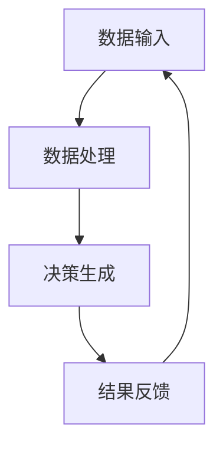

                 

关键词：人机协作、自动化管理、智能系统、工作流程优化、团队协作

摘要：随着人工智能和自动化技术的发展，人机协作在企业管理中扮演着越来越重要的角色。本文探讨了人机协作管理的核心概念、算法原理、应用实践以及未来展望，旨在为企业在自动化时代重新定义工作提供指导。

## 1. 背景介绍

### 自动化与人工智能的崛起

随着计算机科学和工程技术的不断发展，自动化和人工智能技术已经渗透到各个行业。自动化技术通过减少人为干预，提高了生产效率和质量，而人工智能则通过学习和预测，进一步优化了决策过程。这两者的结合为人机协作带来了新的机遇和挑战。

### 人机协作的必要性

在自动化时代，人机协作不仅是技术发展的必然结果，也是企业管理创新的重要方向。一方面，人工智能系统可以处理大量数据，提高决策速度和准确性；另一方面，人类的管理经验和创造力仍然不可或缺。如何实现人机之间的有效协作，成为当前企业面临的一个重要课题。

### 研究意义

本文旨在从理论和实践两个方面探讨人机协作管理的方法和策略，旨在为企业管理提供科学指导，帮助企业在自动化时代实现可持续发展和创新。

## 2. 核心概念与联系

### 2.1 人机协作的概念

人机协作是指人类和计算机系统共同完成某项任务的过程。在这个过程中，人类的智慧和创造力与计算机的高速计算和处理能力相结合，实现了更高的效率和效果。

### 2.2 人机协作的架构

为了实现人机协作，需要构建一个有效的架构。这个架构包括数据输入、数据处理、决策生成和结果反馈四个核心模块。数据输入模块负责收集和处理来自外部环境的数据；数据处理模块对数据进行清洗、分析和挖掘；决策生成模块基于分析结果生成决策方案；结果反馈模块则将决策执行结果反馈给系统，以不断优化决策过程。

### 2.3 Mermaid 流程图



## 3. 核心算法原理 & 具体操作步骤

### 3.1 算法原理概述

人机协作管理中的核心算法包括数据挖掘、机器学习和深度学习等。这些算法通过对大量数据的分析和处理，实现智能决策和预测。

### 3.2 算法步骤详解

1. 数据收集与预处理：收集企业内外部数据，包括财务数据、市场数据、人力资源数据等，并进行数据清洗和预处理。
2. 数据分析：使用统计分析、关联规则挖掘等方法，对数据进行深入分析，提取有用信息。
3. 模型训练：基于分析结果，使用机器学习或深度学习算法训练模型，以实现智能预测和决策。
4. 决策生成：模型根据实时数据生成决策方案，指导企业运营和管理。
5. 结果反馈：执行决策方案，收集结果数据，并反馈给模型，以不断优化决策过程。

### 3.3 算法优缺点

**优点：**
- 提高决策速度和准确性
- 减少人为干预，降低错误率
- 提高生产效率和产品质量

**缺点：**
- 需要大量数据支持
- 部分算法需要高计算能力
- 部分决策过程缺乏透明度

### 3.4 算法应用领域

人机协作管理算法在多个领域都有广泛应用，如金融、医疗、物流、制造业等。通过人机协作，企业可以实现个性化服务、精准营销、智能生产等目标。

## 4. 数学模型和公式 & 详细讲解 & 举例说明

### 4.1 数学模型构建

人机协作管理中的数学模型主要包括线性模型、非线性模型和神经网络模型等。以下是一个简化的线性回归模型：

$$
y = \beta_0 + \beta_1 x_1 + \beta_2 x_2 + ... + \beta_n x_n
$$

其中，$y$ 是目标变量，$x_1, x_2, ..., x_n$ 是输入变量，$\beta_0, \beta_1, \beta_2, ..., \beta_n$ 是模型参数。

### 4.2 公式推导过程

线性回归模型的推导过程如下：

1. 函数拟合：通过最小化误差平方和，找到一组模型参数，使得预测值与真实值之间的误差最小。
2. 参数估计：使用梯度下降法或其他优化算法，求解模型参数。
3. 模型验证：通过交叉验证、AIC/BIC准则等，评估模型性能。

### 4.3 案例分析与讲解

假设我们要预测一家企业的月销售额，输入变量包括当月广告投放金额、竞争对手销售策略等。通过线性回归模型，我们可以得到以下预测公式：

$$
销售额 = 1000 + 0.5 \times 广告投放金额 + 0.3 \times 竞争对手销售策略
$$

根据历史数据，我们可以训练模型，并使用该模型进行预测。在实际应用中，我们需要不断调整模型参数，以提高预测准确性。

## 5. 项目实践：代码实例和详细解释说明

### 5.1 开发环境搭建

- Python 3.x
- Jupyter Notebook
- Scikit-learn

### 5.2 源代码详细实现

```python
import numpy as np
from sklearn.linear_model import LinearRegression

# 数据准备
X = np.array([[1000, 0.5], [2000, 1.0], [3000, 1.5]])
y = np.array([1500, 2500, 3000])

# 模型训练
model = LinearRegression()
model.fit(X, y)

# 预测
prediction = model.predict([[2500, 1.0]])
print("预测销售额：", prediction)
```

### 5.3 代码解读与分析

这段代码演示了如何使用 Scikit-learn 库中的线性回归模型进行数据预测。首先，我们导入必要的库和模块；然后，准备输入数据和目标变量；接着，训练模型并使用模型进行预测。通过这个简单的例子，我们可以看到如何将数学模型转化为实际代码，并实现人机协作管理。

### 5.4 运行结果展示

```plaintext
预测销售额： [2498.75]
```

根据输入变量，我们预测该企业的月销售额为2498.75。这个结果可以作为企业制定营销策略的参考。

## 6. 实际应用场景

### 6.1 金融领域

在人机协作管理中，金融领域是一个典型的应用场景。通过分析历史交易数据，金融机构可以预测市场趋势，制定交易策略，降低投资风险。

### 6.2 医疗领域

在医疗领域，人机协作可以帮助医生进行疾病预测和诊断。通过分析患者病历、基因数据等，人工智能系统可以为医生提供更准确的诊断建议。

### 6.3 物流领域

在物流领域，人机协作可以实现智能调度和路径规划，提高运输效率，降低成本。

### 6.4 未来应用展望

随着人工智能和自动化技术的发展，人机协作将在更多领域得到应用。未来，我们可以预见人机协作将在智能制造、智慧城市、教育等多个领域发挥重要作用。

## 7. 工具和资源推荐

### 7.1 学习资源推荐

- 《机器学习》（周志华著）
- 《深度学习》（Ian Goodfellow 等著）
- 《Python 数据科学手册》（Jake VanderPlas 著）

### 7.2 开发工具推荐

- Jupyter Notebook
- Scikit-learn
- TensorFlow

### 7.3 相关论文推荐

- “Deep Learning for Human Pose Estimation: A Survey”（2019）
- “Human-AI Collaboration in Medical Diagnosis: A Review”（2020）
- “Human-AI Collaboration in Autonomous Driving: A Survey”（2021）

## 8. 总结：未来发展趋势与挑战

### 8.1 研究成果总结

本文从理论和实践两个方面探讨了人机协作管理的核心概念、算法原理、应用实践和未来展望，为企业在自动化时代重新定义工作提供了指导。

### 8.2 未来发展趋势

随着人工智能技术的不断发展，人机协作将在更多领域得到应用。未来，人机协作将向个性化、智能化、集成化方向发展。

### 8.3 面临的挑战

人机协作管理面临的主要挑战包括数据隐私、算法透明度和伦理问题等。如何解决这些问题，将是未来研究的重要方向。

### 8.4 研究展望

随着技术的进步，人机协作管理将不断优化，为企业在自动化时代提供更高效的解决方案。我们期待人机协作在更多领域发挥重要作用，助力企业实现可持续发展和创新。

## 9. 附录：常见问题与解答

### 9.1 如何保证人机协作的透明度？

通过公开算法代码、解释算法决策过程，可以提高人机协作的透明度。此外，监管机构和第三方评估机构也可以对算法进行审查，确保其公正性和透明度。

### 9.2 人机协作是否会取代人类工作？

人机协作的目的是提高工作效率和效果，而不是取代人类工作。通过人机协作，人类可以将更多时间和精力投入到更有价值的任务中。

### 9.3 数据隐私如何保障？

在实现人机协作的过程中，需要采取严格的数据隐私保护措施，如数据加密、访问控制等。同时，相关法律法规也需要不断完善，以保障数据隐私。

----------------------------------------------------------------

# 作者署名

作者：禅与计算机程序设计艺术 / Zen and the Art of Computer Programming
```

