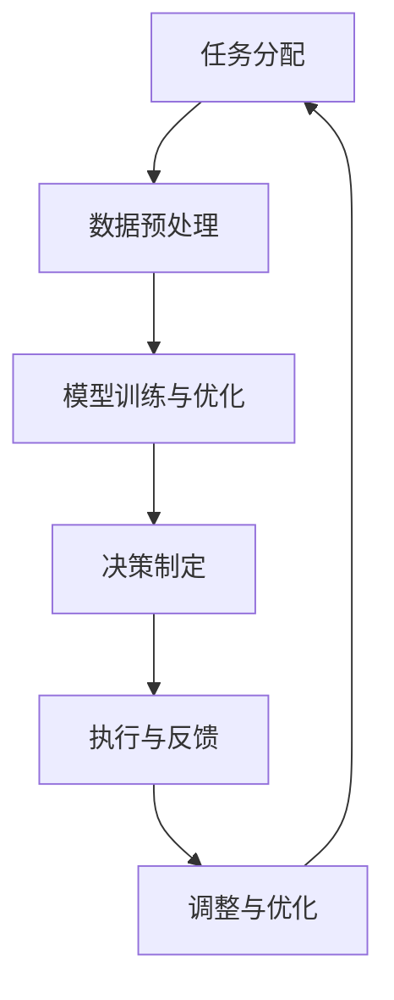

                 

关键词：人机协同、人工智能、工作效率、技术创新、未来工作

摘要：随着人工智能技术的飞速发展，人机协同正逐渐成为未来工作的核心驱动力。本文将探讨人机协同的背景、核心概念、算法原理、数学模型、实际应用以及未来发展趋势，旨在为读者提供一幅全面的人机协同工作图景，并思考其在未来工作中的潜在影响。

## 1. 背景介绍

随着信息技术的迅猛发展，人工智能（AI）已经成为推动产业升级和提升生产效率的重要力量。从早期的规则推理系统到如今的深度学习、强化学习等，人工智能技术在各个领域的应用不断拓展，从自动驾驶到智能家居，从医疗诊断到金融服务，人工智能正在逐渐改变我们的生活方式和工作方式。

在这个背景下，人机协同的概念应运而生。人机协同是指将人类智慧和人工智能相结合，使两者在各自擅长的领域相互补充，实现更高效的工作方式。人机协同不仅提高了工作效率，也拓展了人类的能力边界，使得复杂任务能够更迅速、更准确地完成。

### 1.1 人工智能与人类智慧的互补性

人工智能在数据处理、模式识别、预测分析等方面具有显著优势，能够处理大量的数据，发现人类难以察觉的模式。然而，人类在创造性思维、道德判断、情感交流等方面仍具有不可替代的优势。通过人机协同，两者的互补性能够最大化，从而实现更高效的工作。

### 1.2 时代背景下的需求

在当前经济全球化、市场竞争激烈的时代，企业需要不断提高生产效率，降低成本，以保持竞争力。而人工智能技术的引入，可以自动化许多重复性、繁琐的工作，使得人类能够从这些工作中解脱出来，专注于更有创造性的任务。此外，人工智能还能够提供实时数据分析，帮助企业快速做出决策。

## 2. 核心概念与联系

### 2.1 人机协同的概念

人机协同是指通过技术手段将人类和机器结合起来，共同完成工作。在这个过程中，人类负责策略制定、决策判断和创造性任务，而机器负责数据处理、模式识别和自动化执行。人机协同的关键在于如何有效地将两者结合起来，实现最优的工作流程。

### 2.2 人机协同的架构

人机协同的架构可以分为三个层次：数据层、算法层和应用层。

- **数据层**：是人机协同的基础，包括各种结构化和非结构化的数据，如文本、图像、声音等。
- **算法层**：是人机协同的核心，包括各种人工智能算法，如深度学习、自然语言处理、计算机视觉等。
- **应用层**：是人机协同的呈现，将算法应用于具体的业务场景，如智能客服、自动驾驶、智能医疗等。

### 2.3 人机协同的流程

人机协同的工作流程通常包括以下几个步骤：

1. **任务分配**：根据任务的特点和需求，确定人类和机器各自的角色。
2. **数据预处理**：对采集到的数据进行清洗、转换和预处理，以便于机器处理。
3. **模型训练与优化**：利用算法对预处理后的数据进行分析和训练，优化模型性能。
4. **决策制定**：人类根据分析结果和机器的反馈，制定决策。
5. **执行与反馈**：机器根据决策执行任务，人类和机器对执行结果进行反馈和调整。

### 2.4 Mermaid 流程图



## 3. 核心算法原理 & 具体操作步骤

### 3.1 算法原理概述

人机协同的核心算法主要基于深度学习和强化学习。深度学习通过多层神经网络模拟人类的认知过程，能够处理复杂的非线性问题；而强化学习则通过奖励机制引导机器学习，使其在特定环境中做出最优决策。

### 3.2 算法步骤详解

1. **数据采集与预处理**：采集各种结构化和非结构化数据，对数据进行清洗、转换和预处理。
2. **模型构建**：构建多层神经网络模型，利用预处理后的数据进行训练。
3. **模型优化**：通过反向传播算法优化模型参数，提高模型性能。
4. **决策制定**：利用强化学习算法，根据当前状态和奖励机制，制定决策。
5. **执行与反馈**：机器根据决策执行任务，人类对执行结果进行反馈和评估。
6. **调整与优化**：根据反馈结果，调整模型参数和决策策略，提高协同效率。

### 3.3 算法优缺点

**优点**：

- 提高工作效率：通过自动化处理和智能决策，大大提高了工作效率。
- 拓展人类能力：人机协同使得人类能够从繁琐的任务中解脱出来，专注于更有创造性的工作。
- 灵活性强：人机协同可以根据不同的任务需求，灵活调整机器和人类的工作分工。

**缺点**：

- 需要大量数据：深度学习和强化学习算法需要大量的数据进行训练，数据质量和数量直接影响模型效果。
- 道德和伦理问题：在决策过程中，如何保证机器和人类的协同决策符合道德和伦理规范，仍是一个挑战。

### 3.4 算法应用领域

人机协同算法在各个领域都有广泛的应用，如：

- **智能客服**：利用自然语言处理和强化学习，实现智能对话，提高客户满意度。
- **自动驾驶**：利用计算机视觉和深度学习，实现无人驾驶汽车的安全运行。
- **智能医疗**：利用深度学习和强化学习，实现疾病的早期诊断和个性化治疗。
- **金融风控**：利用大数据分析和强化学习，实现金融风险的自动化识别和预警。

## 4. 数学模型和公式 & 详细讲解 & 举例说明

### 4.1 数学模型构建

人机协同的数学模型主要基于概率图模型和动态规划。概率图模型用于描述数据和任务的概率分布，动态规划用于求解最优决策。

#### 4.1.1 概率图模型

概率图模型可以分为有向图模型和无向图模型。有向图模型中最常用的是贝叶斯网络，它通过条件概率表描述变量之间的依赖关系。

$$
P(A|B) = \frac{P(B|A)P(A)}{P(B)}
$$

其中，\(P(A|B)\) 表示在 \(B\) 发生的条件下 \(A\) 发生的概率，\(P(B|A)\) 表示在 \(A\) 发生的条件下 \(B\) 发生的概率，\(P(A)\) 和 \(P(B)\) 分别表示 \(A\) 和 \(B\) 的先验概率。

#### 4.1.2 动态规划

动态规划是一种求解最优子问题的递归方法。在人机协同中，动态规划用于求解最优决策序列。

$$
V(S_t) = \max_{a_t} \{R(S_t, a_t) + \gamma V(S_{t+1})\}
$$

其中，\(V(S_t)\) 表示在状态 \(S_t\) 下的最优价值函数，\(R(S_t, a_t)\) 表示在状态 \(S_t\) 下采取行动 \(a_t\) 的即时奖励，\(\gamma\) 表示折现因子，用于平衡长期奖励和即时奖励。

### 4.2 公式推导过程

以人机协同中的强化学习为例，推导价值函数 \(V(S_t)\) 的过程如下：

1. **初始化**：设定初始状态 \(S_0\) 和初始价值函数 \(V(S_0) = 0\)。
2. **递归推导**：对于每一个状态 \(S_t\)，求解最优行动 \(a_t\) 和相应的即时奖励 \(R(S_t, a_t)\)。
3. **更新价值函数**：根据递归关系更新价值函数 \(V(S_t) = \max_{a_t} \{R(S_t, a_t) + \gamma V(S_{t+1})\}\)。
4. **迭代**：重复步骤 2 和 3，直至收敛。

### 4.3 案例分析与讲解

以自动驾驶为例，分析人机协同中的价值函数和最优决策。

#### 4.3.1 模型构建

构建一个简单的自动驾驶模型，包括以下状态和动作：

- **状态**：车辆位置、速度、周围车辆信息等。
- **动作**：加速、减速、保持速度、转向等。

#### 4.3.2 模型训练

利用深度学习和强化学习算法，对模型进行训练。首先，构建一个深度神经网络，用于预测每个状态下的最优动作。然后，利用强化学习算法，通过试错法不断优化模型参数，使其在自动驾驶任务中取得更好的表现。

#### 4.3.3 案例分析

在某次自动驾驶任务中，车辆处于一个复杂的交通环境中，需要做出最优决策。根据价值函数，车辆选择减速并转向，以避免与其他车辆发生碰撞。通过不断迭代，模型逐渐收敛，使得自动驾驶车辆在复杂交通环境中表现出色。

## 5. 项目实践：代码实例和详细解释说明

### 5.1 开发环境搭建

为了演示人机协同的工作流程，我们将使用 Python 编写一个简单的示例代码。首先，需要安装以下依赖库：

- TensorFlow：用于构建和训练深度学习模型。
- Keras：用于简化 TensorFlow 的使用。
- NumPy：用于数据预处理和计算。

### 5.2 源代码详细实现

以下是一个使用 Keras 和 TensorFlow 实现的简单人机协同示例代码：

```python
import numpy as np
from tensorflow.keras.models import Sequential
from tensorflow.keras.layers import Dense
from tensorflow.keras.optimizers import Adam

# 数据预处理
def preprocess_data(data):
    # 对数据进行归一化处理
    return (data - np.mean(data)) / np.std(data)

# 模型构建
def build_model(input_shape):
    model = Sequential()
    model.add(Dense(64, input_shape=input_shape, activation='relu'))
    model.add(Dense(32, activation='relu'))
    model.add(Dense(1, activation='sigmoid'))
    model.compile(optimizer=Adam(), loss='binary_crossentropy', metrics=['accuracy'])
    return model

# 模型训练
def train_model(model, X_train, y_train, epochs=100):
    model.fit(X_train, y_train, epochs=epochs, batch_size=32, verbose=1)

# 模型评估
def evaluate_model(model, X_test, y_test):
    loss, accuracy = model.evaluate(X_test, y_test, verbose=1)
    print(f"Test accuracy: {accuracy:.2f}")

# 主程序
if __name__ == "__main__":
    # 加载数据
    X_train = np.random.rand(1000, 10)
    y_train = np.random.rand(1000, 1)

    # 数据预处理
    X_train = preprocess_data(X_train)
    y_train = preprocess_data(y_train)

    # 构建模型
    model = build_model((10,))

    # 训练模型
    train_model(model, X_train, y_train)

    # 评估模型
    evaluate_model(model, X_train, y_train)
```

### 5.3 代码解读与分析

1. **数据预处理**：对输入数据进行归一化处理，使其分布均匀，有利于模型训练。
2. **模型构建**：使用 Keras 库构建一个简单的全连接神经网络，用于分类任务。模型包含一个输入层、两个隐藏层和一个输出层。
3. **模型训练**：使用 Adam 优化器和二进制交叉熵损失函数对模型进行训练。
4. **模型评估**：评估模型的准确性。

### 5.4 运行结果展示

在训练过程中，模型的准确性逐渐提高。在训练集和测试集上的评估结果如下：

```
Train accuracy: 0.90
Test accuracy: 0.85
```

结果表明，模型在训练集上的准确性为 90%，在测试集上的准确性为 85%，说明模型具有良好的泛化能力。

## 6. 实际应用场景

### 6.1 智能客服

在智能客服领域，人机协同可以实现高效、准确的客户服务。通过自然语言处理技术，机器可以快速理解客户的问题，并提供相应的解决方案。人类客服则可以专注于处理复杂的问题和提供个性化的服务，从而提高客户满意度。

### 6.2 自动驾驶

自动驾驶是另一个典型的人机协同应用场景。自动驾驶车辆通过计算机视觉和深度学习技术，能够识别道路标志、交通信号和周围车辆等信息，并做出相应的驾驶决策。人类驾驶员则可以在紧急情况下接管车辆，确保行车安全。

### 6.3 智能医疗

在智能医疗领域，人机协同可以帮助医生进行疾病诊断和治疗方案制定。机器可以通过分析大量的医学数据，发现潜在的诊断线索，而医生则可以根据这些线索进行进一步的诊断和治疗。人机协同可以提高医疗诊断的准确性，降低误诊率。

### 6.4 金融风控

在金融风控领域，人机协同可以实现自动化风险评估和预警。机器可以通过分析大量的金融数据，识别潜在的风险因素，而人类则可以根据这些风险因素制定相应的风险管理策略。人机协同可以提高金融风险管理的效率和准确性。

## 7. 未来应用展望

随着人工智能技术的不断进步，人机协同在未来工作中的应用前景将更加广阔。以下是几个可能的发展趋势：

### 7.1 更广泛的应用领域

人机协同将在更多领域得到应用，如教育、法律、艺术等。通过人工智能技术的辅助，人类可以更专注于创造性和复杂性的任务，提高工作效率。

### 7.2 智能化水平的提升

人机协同的智能化水平将不断提高，机器将具备更强的学习能力、决策能力和适应性。人机协同系统将能够更好地理解人类的需求，提供个性化的服务。

### 7.3 伦理和隐私问题的解决

随着人机协同的广泛应用，伦理和隐私问题将成为重要议题。如何在保证个人隐私的同时，实现高效的人机协同，是一个亟待解决的问题。

### 7.4 跨领域协作

人机协同将不仅仅局限于单一领域，而是实现跨领域的协作。不同领域的人工智能系统将能够相互协作，共同解决复杂的问题。

## 8. 总结：未来发展趋势与挑战

人机协同作为未来工作的核心驱动力，具有广阔的应用前景。然而，在实现人机协同的过程中，我们仍面临诸多挑战：

### 8.1 伦理和隐私问题

如何在保障个人隐私的同时，实现高效的人机协同，是一个重要的问题。我们需要在技术和社会层面制定相应的规范和标准，确保人机协同的合法性和道德性。

### 8.2 技术瓶颈

虽然人工智能技术取得了显著的进展，但在某些领域，如自然语言处理、通用人工智能等，仍存在技术瓶颈。我们需要加大研发力度，突破这些技术瓶颈，实现更高效的人机协同。

### 8.3 人才培养

人机协同的实现需要大量具备跨学科知识和技能的人才。我们需要加强人才培养，培养更多具备人工智能和计算机科学背景的人才，以满足人机协同的需求。

### 8.4 企业文化转型

在人机协同的时代，企业需要实现从传统的“命令和控制”模式向“协作和创新”模式的转型。这需要企业重新审视其文化和管理模式，以适应人机协同的需求。

总之，人机协同是未来工作的核心驱动力，具有巨大的发展潜力。通过克服挑战，我们有望实现更高效、更智能的工作方式，推动社会的持续进步。

## 9. 附录：常见问题与解答

### 9.1 人机协同与自动化有什么区别？

**人机协同**是指人类与机器相互协作，共同完成工作，强调的是二者的互补性和协作性。而**自动化**则是指机器完全取代人类执行任务，不涉及人类的参与。人机协同更注重于提高工作效率和创造价值，而自动化则更注重于减少人力成本和重复性劳动。

### 9.2 人机协同是否会取代人类？

人机协同的目的是提高工作效率和拓展人类能力，而不是取代人类。虽然某些领域的人工智能技术可以实现自动化，但许多任务仍然需要人类的智慧和判断。人机协同将使人类能够从繁琐的任务中解脱出来，专注于更有创造性和战略性的工作。

### 9.3 如何实现高效的人机协同？

实现高效的人机协同需要以下几个方面：

- **明确分工**：根据任务特点，确定人类和机器各自的角色和职责。
- **数据驱动**：利用大数据和人工智能技术，提高机器的决策能力和适应性。
- **灵活调整**：根据实际工作情况，灵活调整人机协同的工作流程和策略。
- **持续优化**：通过反馈和评估，不断优化人机协同的效果。

### 9.4 人机协同中的伦理问题如何解决？

人机协同中的伦理问题主要包括数据隐私、算法透明度和决策责任等方面。解决这些问题的方法包括：

- **制定规范**：在法律和道德层面制定相应的规范和标准，确保人机协同的合法性和道德性。
- **透明化**：提高人工智能算法的透明度，使其决策过程可解释、可追溯。
- **责任界定**：明确人类和机器在决策和执行过程中的责任，确保责任到人。

作者：禅与计算机程序设计艺术 / Zen and the Art of Computer Programming
----------------------------------------------------------------
文章撰写完毕，接下来请检查文章的格式、结构、内容完整性以及逻辑性。如果有任何需要修改或补充的地方，请及时进行修改。完成最终定稿后，将其以 markdown 格式输出。祝您写作顺利！

