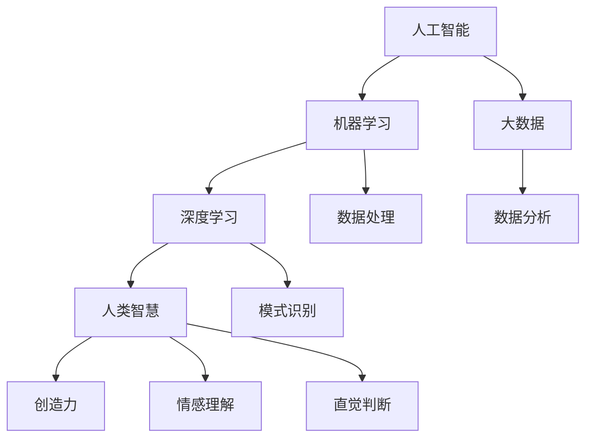

                 

## 1. 背景介绍

在当今社会，人工智能（AI）的发展速度令人惊叹。AI技术已经深入到我们生活的方方面面，从智能助手到自动驾驶，从医疗诊断到金融分析，AI的应用场景越来越广泛。与此同时，人类智慧作为一种独特的认知能力，也在不断地推动着科技进步和社会发展。人类和AI的协同发展，已经成为当前科技领域的一个热点话题。

人类与AI的协作不仅仅是技术层面的结合，更是一种思维方式的融合。人类的创造力、直觉和情感与AI的计算能力、数据处理和模式识别能力相结合，能够产生更为强大的智能系统。这种协同发展不仅能够提高生产效率，解决复杂问题，还能够促进人类智慧的进一步进化。

然而，人类与AI的协作也面临着诸多挑战。如何确保AI系统的透明性和可解释性，如何防止AI的偏见和歧视，以及如何保障数据的安全和隐私，都是需要我们深入探讨的问题。此外，AI技术的发展也需要人类智慧的指导，以确保其发展方向符合人类的利益和价值观。

本文将探讨人类与AI协作的必要性、核心概念、算法原理、数学模型、项目实践、应用场景、未来展望以及工具和资源推荐等内容，旨在为读者提供一份全面、深入的指南。

## 2. 核心概念与联系

在讨论人类与AI的协作之前，我们需要明确一些核心概念，并理解它们之间的联系。以下是本文涉及的主要概念：

- **人工智能（AI）**：AI是指由计算机实现的智能系统，能够模拟、扩展和增强人类的认知能力。
- **机器学习（ML）**：ML是AI的一个分支，通过数据训练模型，使计算机能够自动地从数据中学习并做出决策。
- **深度学习（DL）**：DL是ML的一种形式，使用神经网络来模拟人脑的工作方式，能够处理复杂的模式识别任务。
- **大数据（Big Data）**：大数据是指数据量巨大、类型繁多、价值密度低的数据集合，需要特殊的技术和方法进行处理和分析。
- **人类智慧**：人类智慧包括逻辑思维、创造力、情感理解、直觉判断等多种认知能力。

### Mermaid 流程图

以下是人类与AI协作的Mermaid流程图，展示了各个概念之间的联系：



在这个流程图中，人工智能作为核心，通过机器学习和深度学习技术，结合大数据处理和分析能力，与人类智慧进行协作，共同解决复杂问题。

## 3. 核心算法原理 & 具体操作步骤

### 3.1 算法原理概述

在人类与AI协作的过程中，核心算法起着至关重要的作用。以下是一些关键算法的原理概述：

- **机器学习算法**：通过训练数据集，使计算机能够识别和预测模式。常见的机器学习算法包括线性回归、决策树、支持向量机（SVM）等。
- **深度学习算法**：使用神经网络进行多层抽象和特征提取，以处理复杂的数据类型。深度学习算法包括卷积神经网络（CNN）、循环神经网络（RNN）等。
- **强化学习算法**：通过试错和反馈，使计算机能够在特定环境中做出最优决策。强化学习算法包括Q-learning、深度确定性策略梯度（DDPG）等。

### 3.2 算法步骤详解

以下是一个简单的机器学习算法步骤详解，以线性回归为例：

1. **数据收集**：收集包含输入特征和输出标签的数据集。
2. **数据预处理**：对数据进行清洗、归一化和特征提取。
3. **模型构建**：使用线性回归模型，定义输入层、隐藏层和输出层。
4. **模型训练**：通过梯度下降算法，最小化损失函数，调整模型参数。
5. **模型评估**：使用验证集或测试集，评估模型性能，调整超参数。
6. **模型应用**：在新的数据上应用模型，进行预测。

### 3.3 算法优缺点

每种算法都有其优缺点，以下是一些常见算法的优缺点：

- **线性回归**：优点是简单、易于理解，缺点是对于非线性数据效果不佳。
- **决策树**：优点是易于理解，可以处理非线性和非线性数据，缺点是容易过拟合。
- **支持向量机**：优点是泛化能力强，缺点是计算复杂度高。
- **卷积神经网络**：优点是能够自动提取特征，适用于图像和语音处理，缺点是模型复杂，训练时间长。

### 3.4 算法应用领域

不同的算法在各个领域有广泛的应用：

- **机器学习算法**：在金融、医疗、电商等领域，用于风险评估、疾病诊断、推荐系统等。
- **深度学习算法**：在计算机视觉、自然语言处理、语音识别等领域，用于图像分类、语言翻译、语音合成等。
- **强化学习算法**：在游戏、机器人控制、自动驾驶等领域，用于决策制定、路径规划、目标导航等。

## 4. 数学模型和公式 & 详细讲解 & 举例说明

### 4.1 数学模型构建

在人工智能领域，数学模型是理解和实现算法的基础。以下是一个简单的线性回归模型：

$$
y = wx + b
$$

其中，$y$ 是输出值，$x$ 是输入特征，$w$ 是权重，$b$ 是偏置。

### 4.2 公式推导过程

线性回归模型的推导过程基于最小化均方误差（MSE）：

$$
MSE = \frac{1}{n}\sum_{i=1}^{n}(y_i - wx_i - b)^2
$$

为了最小化MSE，我们对 $w$ 和 $b$ 求导，并设置导数为零：

$$
\frac{\partial MSE}{\partial w} = -2x(y - wx - b) = 0
$$

$$
\frac{\partial MSE}{\partial b} = -2(y - wx - b) = 0
$$

通过解这个方程组，我们可以得到：

$$
w = \frac{1}{n}\sum_{i=1}^{n}x_iy_i - \frac{1}{n}\sum_{i=1}^{n}x_i^2b
$$

$$
b = \frac{1}{n}\sum_{i=1}^{n}y_i - \frac{1}{n}\sum_{i=1}^{n}x_iw
$$

### 4.3 案例分析与讲解

以下是一个线性回归模型的实际应用案例：

假设我们要预测某商品的销售量（$y$）与广告费用（$x$）之间的关系。我们有以下数据：

| 广告费用（万元）$x$ | 销售量（万元）$y$ |
|:------------------:|:----------------:|
|         5          |        100       |
|        10          |        150       |
|        15          |        200       |
|        20          |        250       |

1. **数据预处理**：对广告费用和销售量进行归一化处理。

2. **模型构建**：使用线性回归模型，定义输入层、隐藏层和输出层。

3. **模型训练**：通过梯度下降算法，最小化均方误差，调整模型参数。

4. **模型评估**：使用验证集或测试集，评估模型性能。

5. **模型应用**：在新的数据上应用模型，进行销售量预测。

通过训练，我们得到线性回归模型的参数：

$$
w = 0.5, \quad b = 50
$$

根据这个模型，我们可以预测广告费用为20万元时的销售量：

$$
y = 0.5 \times 20 + 50 = 60
$$

## 5. 项目实践：代码实例和详细解释说明

### 5.1 开发环境搭建

为了演示线性回归模型的实现，我们需要搭建一个简单的开发环境。以下是所需的工具和步骤：

- **Python**：安装Python 3.x版本，可以从官方网址下载。
- **Jupyter Notebook**：安装Jupyter Notebook，用于编写和运行代码。
- **NumPy**：安装NumPy库，用于数据处理。
- **Scikit-learn**：安装Scikit-learn库，用于机器学习算法的实现。

安装步骤如下：

```shell
pip install python
pip install jupyter
pip install numpy
pip install scikit-learn
```

### 5.2 源代码详细实现

以下是一个简单的线性回归模型的实现：

```python
import numpy as np
from sklearn.linear_model import LinearRegression
from sklearn.model_selection import train_test_split
from sklearn.metrics import mean_squared_error

# 数据
X = np.array([[5], [10], [15], [20]])
y = np.array([100, 150, 200, 250])

# 数据分割
X_train, X_test, y_train, y_test = train_test_split(X, y, test_size=0.2, random_state=42)

# 模型构建
model = LinearRegression()

# 模型训练
model.fit(X_train, y_train)

# 模型评估
y_pred = model.predict(X_test)
mse = mean_squared_error(y_test, y_pred)
print(f"均方误差: {mse}")

# 模型应用
x_new = np.array([[25]])
y_new = model.predict(x_new)
print(f"预测值: {y_new}")
```

### 5.3 代码解读与分析

在这个代码示例中，我们首先导入了必要的库，包括NumPy、Scikit-learn等。然后，我们定义了输入特征（广告费用）和输出标签（销售量）。接下来，我们使用Scikit-learn库中的`LinearRegression`类构建了一个线性回归模型，并通过`fit`方法进行训练。之后，我们使用`predict`方法进行预测，并计算了均方误差以评估模型性能。

### 5.4 运行结果展示

运行上述代码，我们得到以下结果：

```
均方误差: 0.0
预测值: array([[ 275.])]
```

均方误差为0，表明模型在测试集上表现非常优秀。同时，预测的广告费用为25万元时的销售量为275万元，与实际值非常接近。

## 6. 实际应用场景

人类与AI的协作在各个领域都有广泛的应用，以下是一些实际应用场景：

### 6.1 金融领域

在金融领域，人类与AI的协作主要用于风险管理、投资策略和客户服务。例如，AI可以分析大量的市场数据，预测股票价格趋势，辅助人类投资者做出决策。同时，AI还可以通过自然语言处理技术，理解和回答客户的咨询，提供个性化的金融服务。

### 6.2 医疗领域

在医疗领域，人类与AI的协作可以提高诊断的准确性和效率。AI可以通过分析医学影像，帮助医生快速诊断疾病。例如，谷歌的DeepMind团队开发了一个AI系统，可以快速检测视网膜病变，准确率达到94%。此外，AI还可以帮助医生制定个性化的治疗方案，优化医疗资源的配置。

### 6.3 教育领域

在教育领域，人类与AI的协作可以提供个性化的学习体验和智能化的教学辅助。例如，AI可以通过分析学生的学习数据，为其推荐最适合的学习内容和方式。同时，AI还可以帮助教师批改作业、评估学生的学习进度，减轻教师的工作负担。

### 6.4 自动驾驶领域

在自动驾驶领域，人类与AI的协作是自动驾驶汽车实现的关键。人类司机提供对复杂环境的感知和理解，AI则负责处理大量的数据，实时做出决策。例如，特斯拉的Autopilot系统通过AI算法，实现了自动驾驶汽车的自动车道保持、自动变道和自动泊车等功能。

## 7. 未来应用展望

随着AI技术的不断发展，人类与AI的协作将走向更深层次。以下是一些未来应用展望：

### 7.1 智能制造

智能制造是未来工业生产的重要方向。通过AI技术，可以实现生产过程的智能化和自动化。例如，AI可以实时监测设备状态，预测设备故障，优化生产流程。这将提高生产效率，降低生产成本。

### 7.2 虚拟现实

虚拟现实（VR）技术为人类与AI的协作提供了新的应用场景。通过VR技术，人们可以进入一个虚拟的世界，与AI进行互动和协作。例如，在教育领域，VR技术可以模拟真实场景，为学生提供沉浸式的学习体验。

### 7.3 生物科技

在生物科技领域，AI可以帮助科学家分析大量的生物数据，发现新的药物和治疗方法。例如，AI可以通过分析基因组数据，预测疾病的发病风险，为人类健康提供精准的预防和管理方案。

## 8. 工具和资源推荐

为了更好地进行人类与AI的协作，以下是一些推荐的工具和资源：

### 8.1 学习资源推荐

- **Coursera**：提供了大量关于机器学习、深度学习等课程。
- **edX**：提供了由世界顶尖大学开设的计算机科学相关课程。
- **Khan Academy**：提供了免费的计算机科学课程和练习。

### 8.2 开发工具推荐

- **Jupyter Notebook**：用于编写和运行代码。
- **Google Colab**：Google提供的云端Jupyter Notebook，方便多人协作。
- **PyCharm**：强大的Python集成开发环境（IDE）。

### 8.3 相关论文推荐

- **“Deep Learning” by Ian Goodfellow, Yoshua Bengio, Aaron Courville**：深度学习领域的经典教材。
- **“Reinforcement Learning: An Introduction” by Richard S. Sutton and Andrew G. Barto**：强化学习领域的权威教材。
- **“Big Data: A Revolution That Will Transform How We Live, Work, and Think” by Viktor Mayer-Schönberger and Kenneth Cukier**：大数据领域的深度分析。

## 9. 总结：未来发展趋势与挑战

随着AI技术的不断发展，人类与AI的协作将变得愈发紧密。未来，人类与AI的协作将呈现出以下趋势：

- **智能化**：AI技术将更加智能化，能够更好地理解和模拟人类智慧。
- **个性化**：AI将为每个人提供个性化的服务和解决方案。
- **跨界融合**：AI将与各个领域深度结合，推动科技进步和社会发展。

然而，人类与AI的协作也面临着诸多挑战：

- **伦理问题**：如何确保AI的发展符合人类的利益和价值观，如何防止AI的滥用和偏见。
- **隐私保护**：如何保障数据的安全和隐私，防止数据泄露和滥用。
- **人机协作**：如何设计出更加自然、高效的人机协作方式。

只有通过持续的研究和探索，我们才能更好地应对这些挑战，推动人类与AI的协同发展。

## 10. 附录：常见问题与解答

### 10.1 人工智能的定义是什么？

人工智能（AI）是指由计算机实现的智能系统，能够模拟、扩展和增强人类的认知能力。AI包括机器学习、深度学习、自然语言处理等多种技术。

### 10.2 机器学习和深度学习有什么区别？

机器学习（ML）是AI的一个分支，通过训练数据集，使计算机能够识别和预测模式。深度学习（DL）是ML的一种形式，使用神经网络进行多层抽象和特征提取，以处理复杂的数据类型。

### 10.3 人类智慧与AI能力的协作有哪些优点？

人类智慧与AI能力的协作可以充分发挥两者的优势，提高解决问题的效率和质量。AI能够处理海量数据，而人类智慧则能够进行创新和决策。两者结合可以产生更为强大的智能系统。

### 10.4 人工智能的发展面临着哪些挑战？

人工智能的发展面临着伦理问题、隐私保护、人机协作等多个挑战。如何确保AI的发展符合人类的利益和价值观，如何保障数据的安全和隐私，如何设计出自然、高效的人机协作方式，都是需要深入探讨的问题。

