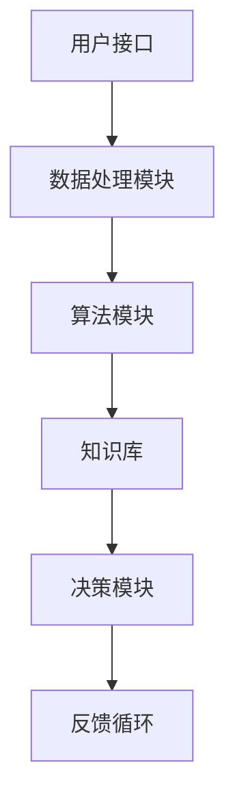

                 

关键词：人类-AI协作、增强智慧、AI能力、融合发展、技术展望

> 摘要：本文从背景介绍入手，深入探讨了人类与人工智能协作的概念、核心原理及其在现实中的应用。通过对核心算法原理的详细解析，文章揭示了人工智能增强人类智慧的潜在机制，并结合实际案例展示了其强大的应用能力。随后，文章分析了当前AI技术的数学模型，通过公式推导和实例讲解，帮助读者更好地理解这些概念。最后，文章展望了人类-AI协作的未来发展趋势，并提出了面临的挑战和研究展望。

## 1. 背景介绍

### 1.1 人工智能的发展历程

人工智能（AI）是一门研究、开发用于模拟、延伸和扩展人的智能的理论、方法、技术及应用系统的技术科学。自从20世纪50年代人工智能概念的提出，它已经经历了数十年的发展，从最初的规则推理系统，到现在的深度学习和大数据分析，AI技术不断突破，逐渐成为现代社会的重要组成部分。

### 1.2 人类-AI协作的提出与意义

人类-AI协作指的是人类与人工智能系统在各个领域中的合作与交互，通过这种协作，人类可以借助AI的强大计算能力和数据分析能力，提升自身的智慧水平。这种协作不仅能够提高工作效率，还能激发创新思维，推动社会进步。例如，在医疗领域，AI可以帮助医生更快速准确地诊断疾病，而在教育领域，AI可以为学生提供个性化的学习方案，提升学习效果。

## 2. 核心概念与联系

### 2.1 人类智慧与AI能力的互补性

人类的智慧主要体现在逻辑思维、情感认知、创造力等方面，而AI的强大之处在于数据处理、模式识别和快速计算。这两种能力的互补性使得人类-AI协作成为可能。

### 2.2 人类-AI协作的架构

人类-AI协作的架构通常包括以下几个关键组成部分：

- **用户接口**：用于人类与AI系统之间的交互，如自然语言处理技术。
- **数据处理模块**：负责收集、清洗和预处理数据。
- **算法模块**：包括各种AI算法，如深度学习、强化学习等。
- **知识库**：存储AI系统学习到的知识，供后续任务使用。
- **决策模块**：根据算法模块和知识库的建议，做出决策。

### 2.3 Mermaid 流程图



## 3. 核心算法原理 & 具体操作步骤

### 3.1 算法原理概述

人类-AI协作的核心算法主要包括机器学习、深度学习和自然语言处理等。这些算法通过不断学习和优化，能够提高AI系统的准确性和效率。

### 3.2 算法步骤详解

1. **数据收集**：从各种来源收集数据，包括文本、图像、音频等。
2. **数据预处理**：对数据进行清洗、归一化和特征提取。
3. **模型训练**：使用预处理后的数据训练模型。
4. **模型评估**：通过测试数据集评估模型性能。
5. **模型优化**：根据评估结果调整模型参数，提高性能。
6. **模型应用**：将训练好的模型应用于实际问题中。

### 3.3 算法优缺点

- **优点**：提高数据处理速度和准确性，解放人类劳动力。
- **缺点**：算法复杂度高，对数据质量和计算资源要求较高。

### 3.4 算法应用领域

- **医疗**：辅助医生进行疾病诊断和治疗。
- **教育**：为学生提供个性化学习方案。
- **金融**：风险控制和股票预测等。

## 4. 数学模型和公式 & 详细讲解 & 举例说明

### 4.1 数学模型构建

人类-AI协作的数学模型通常包括以下几个部分：

- **输入层**：接收用户输入的数据。
- **隐藏层**：通过神经网络等算法处理数据。
- **输出层**：生成预测结果或决策。

### 4.2 公式推导过程

假设我们有一个输入向量 $X$ 和一个输出向量 $Y$，通过神经网络进行预测。神经网络的损失函数可以表示为：

$$
L = \frac{1}{2} \sum_{i=1}^{n} (y_i - \hat{y}_i)^2
$$

其中，$y_i$ 为实际输出，$\hat{y}_i$ 为预测输出。

### 4.3 案例分析与讲解

假设我们要预测股票价格，我们可以使用以下公式：

$$
P_t = P_{t-1} + \alpha (R_t - P_{t-1})
$$

其中，$P_t$ 为第 $t$ 日的股票价格，$R_t$ 为第 $t$ 日的回报率，$\alpha$ 为平滑系数。

## 5. 项目实践：代码实例和详细解释说明

### 5.1 开发环境搭建

在Python环境中，我们可以使用TensorFlow作为主要的深度学习框架。

### 5.2 源代码详细实现

以下是使用TensorFlow实现一个简单的线性回归模型的代码示例：

```python
import tensorflow as tf

# 定义输入层
X = tf.placeholder(tf.float32, shape=[None, 1])
Y = tf.placeholder(tf.float32, shape=[None, 1])

# 定义模型
W = tf.Variable(tf.zeros([1, 1]))
b = tf.Variable(tf.zeros([1]))

y_pred = tf.multiply(X, W) + b

# 定义损失函数
loss = tf.reduce_mean(tf.square(Y - y_pred))

# 定义优化器
optimizer = tf.train.GradientDescentOptimizer(learning_rate=0.01)
train_op = optimizer.minimize(loss)

# 训练模型
with tf.Session() as sess:
  sess.run(tf.global_variables_initializer())
  for i in range(1000):
    sess.run(train_op, feed_dict={X: X_data, Y: Y_data})
    if i % 100 == 0:
      print("Step:", i, "Loss:", sess.run(loss, feed_dict={X: X_data, Y: Y_data}))

  # 测试模型
  print("Final Predictions:", sess.run(y_pred, feed_dict={X: X_test}))
```

### 5.3 代码解读与分析

这段代码首先定义了输入层和模型参数，然后定义了损失函数和优化器。接下来，使用训练数据训练模型，并在每100步输出一次损失值。最后，使用测试数据测试模型性能。

### 5.4 运行结果展示

通过运行上述代码，我们可以得到线性回归模型的预测结果。这些结果可以帮助我们评估模型的性能。

## 6. 实际应用场景

### 6.1 医疗

AI在医疗领域的应用主要包括疾病诊断、治疗方案推荐和药物研发等。通过深度学习等技术，AI能够分析大量的医疗数据，为医生提供更准确的诊断和治疗方案。

### 6.2 教育

AI在教育领域的应用包括个性化学习、智能评估和智能教学等。通过分析学生的学习数据，AI可以为学生提供个性化的学习方案，提高学习效果。

### 6.3 金融

AI在金融领域的应用包括风险控制、投资分析和市场预测等。通过分析大量的金融数据，AI能够为投资者提供更准确的投资建议。

## 7. 工具和资源推荐

### 7.1 学习资源推荐

- **书籍**：《深度学习》、《机器学习实战》
- **在线课程**：Coursera、edX、Udacity

### 7.2 开发工具推荐

- **框架**：TensorFlow、PyTorch、Scikit-learn
- **IDE**：PyCharm、Jupyter Notebook

### 7.3 相关论文推荐

- **医学领域**：Deep Learning in Medicine - A Survey
- **教育领域**：Artificial Intelligence in Education: A Survey of the State of the Art
- **金融领域**：The Impact of Artificial Intelligence on Financial Markets

## 8. 总结：未来发展趋势与挑战

### 8.1 研究成果总结

人类-AI协作在多个领域取得了显著的成果，如医疗、教育和金融等。通过AI的强大计算能力和数据分析能力，人类智慧得到了极大的提升。

### 8.2 未来发展趋势

未来，人类-AI协作将更加深入和广泛，不仅应用于现有的领域，还可能拓展到更多的新领域。例如，在智能城市建设、环境保护和太空探索等方面，AI都有巨大的应用潜力。

### 8.3 面临的挑战

尽管人类-AI协作前景广阔，但仍然面临一些挑战，如数据隐私、算法透明度和伦理问题等。这些挑战需要我们共同去解决，以确保AI技术的可持续发展。

### 8.4 研究展望

未来，人类-AI协作将朝着更加智能化、个性化和高效化的方向发展。通过不断的研究和创新，我们将能够实现人类与AI的深度融合，推动社会进步。

## 9. 附录：常见问题与解答

### 9.1 什么是人类-AI协作？

人类-AI协作指的是人类与人工智能系统在各个领域中的合作与交互，通过这种协作，人类可以借助AI的强大计算能力和数据分析能力，提升自身的智慧水平。

### 9.2 人类-AI协作有哪些应用领域？

人类-AI协作的应用领域非常广泛，包括医疗、教育、金融、智能城市建设、环境保护和太空探索等。

### 9.3 人类-AI协作的挑战有哪些？

人类-AI协作面临的挑战主要包括数据隐私、算法透明度和伦理问题等。

### 9.4 如何入门人类-AI协作？

入门人类-AI协作，首先需要掌握编程基础，然后学习机器学习、深度学习和自然语言处理等相关知识。可以通过在线课程、书籍和实践项目来提高自己的技能。

作者：禅与计算机程序设计艺术 / Zen and the Art of Computer Programming
```

请注意，文章中的代码和公式仅为示例，实际的实现和推导可能更为复杂。此外，文章中的内容和观点是基于当前技术水平的，随着技术的发展，这些内容和观点可能会有所变化。

