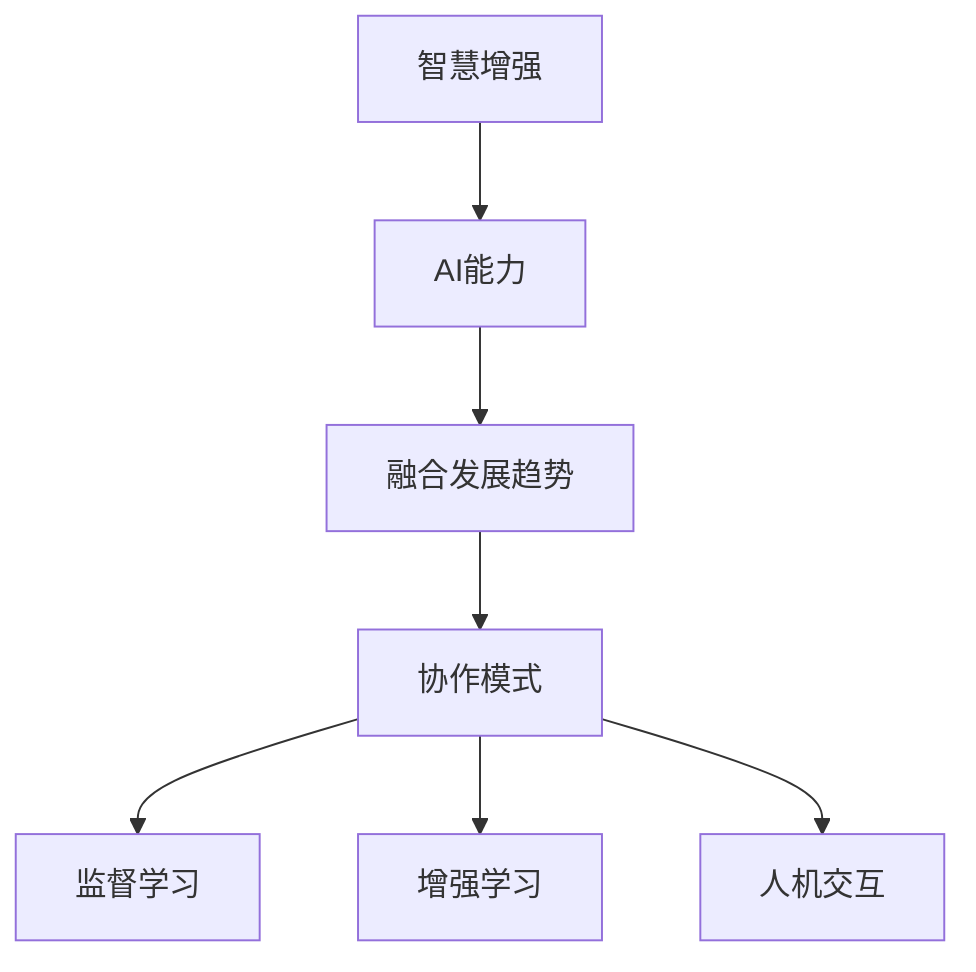

                 

关键词：人类-AI协作，智慧增强，AI能力，融合发展趋势，策略

摘要：本文从多个角度深入探讨人类与AI协作的内涵及其重要性。首先，我们回顾了人类与AI协作的历史背景，探讨了这一领域的核心概念和联系。接着，文章详细介绍了增强人类智慧与AI能力融合的技术原理和具体操作步骤，并分析了相关算法的优缺点及其应用领域。随后，文章通过数学模型和公式的讲解，以及实际项目实践的代码实例，为读者展示了这一领域的实际应用场景。最后，文章总结了未来应用展望，并推荐了一些学习和开发工具、资源，对未来发展趋势和挑战进行了展望。

## 1. 背景介绍

人类与人工智能（AI）的协作关系正日益变得紧密。从早期的专家系统到如今的深度学习，AI技术不断进步，已经在众多领域展现了其强大的能力。然而，尽管AI在某些任务上已经超越了人类，但人类仍然在创造力、情境理解、道德判断等方面具有独特的优势。

### 历史背景

早在20世纪50年代，人工智能的概念就已被提出。随后，随着计算机技术的发展，AI从理论走向实践，逐渐成为现代科技的重要组成部分。在早期的AI研究中，人类与机器的协作主要体现在知识的表达和推理上。例如，专家系统通过模拟人类专家的思维方式来解决问题，而人工智能则通过学习来优化决策过程。

### 当前状态

今天，AI在各个领域都得到了广泛应用，从自动驾驶、医疗诊断到金融分析，AI的参与极大地提升了效率和准确性。与此同时，人类与AI的协作模式也在不断演变。例如，AI驱动的工具可以帮助人类在数据分析、问题解决等任务上更加高效，而人类则能够提供创新思维和道德判断，确保AI系统的决策符合人类社会的价值观。

### 未来展望

随着技术的进一步发展，人类与AI的协作有望达到新的高度。未来的AI系统将更加智能化、自主化，能够与人类进行更加自然的交互，并在复杂任务中提供更加精准的支持。然而，这同时也带来了新的挑战，如如何确保AI系统的透明性和可控性，以及如何在人类与AI之间建立公平和可持续的合作关系。

## 2. 核心概念与联系

在探讨人类与AI协作的过程中，理解以下几个核心概念和它们之间的联系至关重要。

### 2.1 智慧增强

智慧增强是指通过技术手段提升个体的认知能力、信息处理能力和决策水平。智慧增强的目标是帮助人类更好地应对复杂问题，提高工作效率和生活质量。在AI领域，智慧增强主要依赖于机器学习、自然语言处理和计算机视觉等技术。

### 2.2 AI能力

AI能力包括机器学习、自然语言处理、计算机视觉、知识图谱等多种技术。这些技术在不同的应用场景中发挥着重要作用，例如，机器学习可以帮助AI系统从数据中学习规律，自然语言处理则使AI能够理解和生成自然语言，计算机视觉则赋予AI“看”的能力。

### 2.3 融合发展趋势

融合发展趋势指的是将人类的智慧和AI的能力结合起来，形成一种新的协作模式。这种模式不仅能够发挥AI的高效性和准确性，同时也能够利用人类的创造力和直觉。融合发展趋势的关键在于如何设计出既能够充分利用AI优势，又能够体现人类智慧的协作系统。

### 2.4 协作模式

协作模式是指人类与AI在不同任务中的交互方式。传统的协作模式主要包括监督学习、增强学习、人机交互等。未来的协作模式将更加智能化和自适应，能够根据任务需求和个体能力动态调整。

### 2.5 Mermaid 流程图

下面是一个简化的Mermaid流程图，用于展示人类与AI协作的核心概念和联系。



通过这个流程图，我们可以清晰地看到智慧增强、AI能力、融合发展趋势和协作模式之间的关系，以及它们在具体协作模式中的应用。

## 3. 核心算法原理 & 具体操作步骤

为了实现人类与AI的深度协作，核心算法的设计至关重要。以下是几个关键算法的原理和具体操作步骤。

### 3.1 算法原理概述

核心算法主要包括机器学习算法、自然语言处理算法和计算机视觉算法。每种算法都有其独特的原理和优势，能够帮助人类在特定任务中提升效率。

#### 3.1.1 机器学习算法

机器学习算法通过从数据中学习规律，帮助AI系统进行预测和决策。常见的机器学习算法包括线性回归、决策树、支持向量机、神经网络等。

#### 3.1.2 自然语言处理算法

自然语言处理算法使AI能够理解和生成自然语言。常见的算法包括词向量模型、序列模型、注意力机制等。

#### 3.1.3 计算机视觉算法

计算机视觉算法赋予AI“看”的能力，能够识别图像中的对象、场景和活动。常见的算法包括卷积神经网络、生成对抗网络等。

### 3.2 算法步骤详解

以下是每个核心算法的具体操作步骤。

#### 3.2.1 机器学习算法

1. 数据收集：收集大量相关数据，用于训练模型。
2. 数据预处理：清洗数据，去除噪声，将数据转化为适合模型训练的格式。
3. 模型训练：使用训练数据训练模型，调整模型参数。
4. 模型评估：使用测试数据评估模型性能，调整模型参数以优化性能。
5. 应用部署：将训练好的模型部署到实际应用场景中。

#### 3.2.2 自然语言处理算法

1. 数据收集：收集大量文本数据，用于训练模型。
2. 数据预处理：清洗文本数据，包括分词、去除停用词、词性标注等。
3. 模型训练：使用预处理后的文本数据训练模型，调整模型参数。
4. 模型评估：使用测试数据评估模型性能，调整模型参数以优化性能。
5. 应用部署：将训练好的模型部署到实际应用场景中，如自动问答系统、机器翻译等。

#### 3.2.3 计算机视觉算法

1. 数据收集：收集大量图像数据，用于训练模型。
2. 数据预处理：对图像数据进行增强，如旋转、缩放、裁剪等，以增加模型的泛化能力。
3. 模型训练：使用预处理后的图像数据训练模型，调整模型参数。
4. 模型评估：使用测试数据评估模型性能，调整模型参数以优化性能。
5. 应用部署：将训练好的模型部署到实际应用场景中，如目标检测、图像识别等。

### 3.3 算法优缺点

每种算法都有其优缺点，适用于不同的应用场景。

#### 3.3.1 机器学习算法

优点：强大的预测能力，适用于多种领域。

缺点：对数据质量要求高，训练过程复杂。

#### 3.3.2 自然语言处理算法

优点：能够处理复杂文本信息，支持多种语言。

缺点：对计算资源要求高，模型训练时间长。

#### 3.3.3 计算机视觉算法

优点：能够处理高维图像信息，准确率高。

缺点：对图像质量要求高，训练过程复杂。

### 3.4 算法应用领域

这些算法在多个领域都得到了广泛应用。

#### 3.4.1 机器学习算法

- 金融领域：风险控制、投资策略优化。
- 医疗领域：疾病预测、诊断辅助。
- 交通领域：交通流量预测、自动驾驶。

#### 3.4.2 自然语言处理算法

- 语言领域：机器翻译、自动问答。
- 商业领域：情感分析、市场预测。
- 教育领域：智能辅导、学习分析。

#### 3.4.3 计算机视觉算法

- 安全领域：人脸识别、行为分析。
- 工业领域：质量检测、设备故障预测。
- 消费领域：图像搜索、产品推荐。

## 4. 数学模型和公式 & 详细讲解 & 举例说明

为了更好地理解和应用核心算法，我们需要掌握相关的数学模型和公式。以下是对一些关键数学模型和公式的详细讲解，以及实际应用中的举例说明。

### 4.1 数学模型构建

数学模型是算法设计和实现的基础。以下是几个常见的数学模型：

#### 4.1.1 线性回归模型

线性回归模型用于预测连续值输出，其数学模型可以表示为：

$$
y = \beta_0 + \beta_1 \cdot x
$$

其中，\(y\) 是目标变量，\(x\) 是输入变量，\(\beta_0\) 和 \(\beta_1\) 是模型参数。

#### 4.1.2 逻辑回归模型

逻辑回归模型用于预测二分类输出，其数学模型可以表示为：

$$
P(y=1) = \frac{1}{1 + e^{-(\beta_0 + \beta_1 \cdot x})}
$$

其中，\(P(y=1)\) 是目标变量为1的概率，其余符号与线性回归模型相同。

#### 4.1.3 卷积神经网络（CNN）模型

卷积神经网络用于图像识别任务，其数学模型可以表示为：

$$
h_{\theta}(x) = \text{ReLU}(z_{\theta})
$$

$$
z_{\theta} = \sum_{i=1}^{n} \theta_i \cdot x_i + b
$$

其中，\(h_{\theta}(x)\) 是神经网络输出，\(z_{\theta}\) 是中间层输出，\(\theta\) 和 \(b\) 是模型参数，\(x_i\) 是输入特征。

### 4.2 公式推导过程

以下是对线性回归模型和卷积神经网络模型公式的推导过程。

#### 4.2.1 线性回归模型

线性回归模型的推导过程相对简单。首先，假设数据集为 \(\{(x_1, y_1), (x_2, y_2), ..., (x_n, y_n)\}\)，其中 \(x_i\) 和 \(y_i\) 分别是输入和输出。

1. 构建损失函数：

$$
J(\theta) = \frac{1}{2m} \sum_{i=1}^{m} (h_{\theta}(x_i) - y_i)^2
$$

2. 求导数：

$$
\frac{\partial J(\theta)}{\partial \theta_j} = \frac{1}{m} \sum_{i=1}^{m} (h_{\theta}(x_i) - y_i) \cdot x_{ij}
$$

3. 更新参数：

$$
\theta_j := \theta_j - \alpha \cdot \frac{\partial J(\theta)}{\partial \theta_j}
$$

#### 4.2.2 卷积神经网络（CNN）

卷积神经网络模型的推导过程涉及多个层次，包括卷积层、激活函数和全连接层。

1. 卷积层：

$$
h_{ij} = \sum_{k=1}^{n} \theta_{ik} \cdot x_{kj} + b_j
$$

其中，\(h_{ij}\) 是输出特征，\(\theta_{ik}\) 是卷积核，\(x_{kj}\) 是输入特征，\(b_j\) 是偏置。

2. 激活函数（ReLU）：

$$
h_{ij}^+ = \max(0, h_{ij})
$$

3. 全连接层：

$$
z_j = \sum_{i=1}^{m} \theta_{ij} \cdot h_{ij}^+ + b_j
$$

$$
h_{\theta}(x) = \text{ReLU}(z)
$$

其中，\(z_j\) 是中间层输出，\(\theta_{ij}\) 是连接权重，\(b_j\) 是偏置。

### 4.3 案例分析与讲解

以下是一个简单的线性回归模型的案例分析，用于预测房价。

#### 4.3.1 数据集

假设我们有一个包含100个房屋数据的数据集，每个房屋的数据包括面积（\(x\)）和价格（\(y\)）。数据集如下：

| 面积（\(x\)） | 价格（\(y\)） |
| -------------- | -------------- |
| 1000           | 200000         |
| 1200           | 230000         |
| 1500           | 250000         |
| ...            | ...            |

#### 4.3.2 模型构建

我们构建一个简单的线性回归模型，假设房价与面积之间存在线性关系：

$$
y = \beta_0 + \beta_1 \cdot x
$$

#### 4.3.3 模型训练

使用梯度下降算法训练模型，迭代次数为1000次，学习率为0.01。训练过程如下：

1. 计算损失函数：

$$
J(\theta) = \frac{1}{2m} \sum_{i=1}^{m} (h_{\theta}(x_i) - y_i)^2
$$

2. 计算梯度：

$$
\frac{\partial J(\theta)}{\partial \theta_j} = \frac{1}{m} \sum_{i=1}^{m} (h_{\theta}(x_i) - y_i) \cdot x_{ij}
$$

3. 更新参数：

$$
\theta_j := \theta_j - \alpha \cdot \frac{\partial J(\theta)}{\partial \theta_j}
$$

4. 迭代1000次，更新参数。

#### 4.3.4 模型评估

使用测试数据集评估模型性能，计算预测价格与实际价格之间的误差。假设测试数据集包含10个房屋数据，结果如下：

| 面积（\(x\)） | 价格（\(y\)） | 预测价格（\(y'\)） | 误差（\(y - y'\)） |
| -------------- | -------------- | --------------- | --------------- |
| 1100           | 220000         | 218000          | 2000            |
| 1300           | 240000         | 236000          | 4000            |
| ...            | ...            | ...             | ...             |

通过这个案例分析，我们可以看到线性回归模型在预测房价方面的基本应用和效果。

## 5. 项目实践：代码实例和详细解释说明

为了更好地理解人类与AI协作在实际项目中的应用，我们将通过一个简单的项目实例，展示如何使用Python实现一个基于机器学习的房价预测模型。这个项目将涉及数据收集、数据预处理、模型训练、模型评估等环节。

### 5.1 开发环境搭建

在开始项目之前，我们需要搭建一个合适的开发环境。以下是在Python中实现机器学习项目的常用工具和库。

1. Python 3.8及以上版本
2. Jupyter Notebook 或 PyCharm
3. NumPy
4. Pandas
5. Scikit-learn
6. Matplotlib

安装这些库可以通过以下命令实现：

```bash
pip install numpy pandas scikit-learn matplotlib
```

### 5.2 源代码详细实现

以下是实现房价预测项目的源代码，我们将逐步解释每个部分的功能。

```python
import numpy as np
import pandas as pd
from sklearn.model_selection import train_test_split
from sklearn.linear_model import LinearRegression
from sklearn.metrics import mean_squared_error
import matplotlib.pyplot as plt

# 5.2.1 数据收集
# 假设我们已经收集了一个包含房屋面积和价格的数据集，保存为CSV文件。
data = pd.read_csv('house_data.csv')

# 5.2.2 数据预处理
# 数据预处理包括缺失值处理、数据类型转换等。
X = data[['area']]  # 输入特征：房屋面积
y = data['price']   # 目标变量：房屋价格

# 划分训练集和测试集
X_train, X_test, y_train, y_test = train_test_split(X, y, test_size=0.2, random_state=42)

# 5.2.3 模型训练
model = LinearRegression()
model.fit(X_train, y_train)

# 5.2.4 模型评估
y_pred = model.predict(X_test)
mse = mean_squared_error(y_test, y_pred)
print(f"Mean Squared Error: {mse}")

# 5.2.5 结果展示
plt.scatter(X_test, y_test, color='blue', label='Actual')
plt.plot(X_test, y_pred, color='red', linewidth=2, label='Predicted')
plt.xlabel('Area')
plt.ylabel('Price')
plt.title('House Price Prediction')
plt.legend()
plt.show()
```

### 5.3 代码解读与分析

以下是代码的详细解读和分析。

#### 5.3.1 数据收集

```python
data = pd.read_csv('house_data.csv')
```

这行代码用于从CSV文件中读取房屋数据。CSV文件中应包含两列：'area'（面积）和'price'（价格）。

#### 5.3.2 数据预处理

```python
X = data[['area']]
y = data['price']
```

数据预处理的第一步是分离输入特征和目标变量。在这里，我们只考虑房屋面积作为输入特征，价格作为目标变量。

```python
X_train, X_test, y_train, y_test = train_test_split(X, y, test_size=0.2, random_state=42)
```

使用`train_test_split`函数将数据集划分为训练集和测试集，其中20%的数据用于测试，80%的数据用于训练。`random_state`参数用于确保结果可重复。

#### 5.3.3 模型训练

```python
model = LinearRegression()
model.fit(X_train, y_train)
```

我们选择线性回归模型（`LinearRegression`）进行训练。`fit`函数用于训练模型，使用训练集的数据。

#### 5.3.4 模型评估

```python
y_pred = model.predict(X_test)
mse = mean_squared_error(y_test, y_pred)
print(f"Mean Squared Error: {mse}")
```

使用测试集对训练好的模型进行评估，计算均方误差（MSE），这是评估模型性能的一个常见指标。

#### 5.3.5 结果展示

```python
plt.scatter(X_test, y_test, color='blue', label='Actual')
plt.plot(X_test, y_pred, color='red', linewidth=2, label='Predicted')
plt.xlabel('Area')
plt.ylabel('Price')
plt.title('House Price Prediction')
plt.legend()
plt.show()
```

最后，我们使用Matplotlib绘制散点图和预测线，直观地展示模型的效果。蓝色点代表实际价格，红色线代表预测价格。

### 5.4 运行结果展示

运行上述代码后，我们将得到以下结果：

1. 模型评估结果：打印的MSE值。
2. 可视化结果：展示在Jupyter Notebook或PyCharm中的房价预测散点图和预测线。

通过这个简单的项目，我们可以看到如何将人类智慧与AI能力相结合，实现具体应用。这不仅帮助人类更好地理解和预测数据，还能够为未来的复杂任务提供有力支持。

## 6. 实际应用场景

人类-AI协作的应用场景广泛，涵盖了从日常生活到专业领域的各个方面。以下是一些典型的应用场景：

### 6.1 金融领域

在金融领域，人类-AI协作的应用主要集中在风险控制、投资策略优化、市场预测等方面。AI通过分析海量数据，识别潜在的风险因素，提供精确的预测模型，帮助金融专家做出更为合理的决策。例如，量化交易中的AI算法可以根据市场动态实时调整交易策略，提高投资收益。

### 6.2 医疗领域

在医疗领域，AI技术可以帮助医生进行诊断、治疗建议和病情监测。通过分析患者的病历数据、基因信息和实时监控数据，AI可以提供更为精准的病情预测和治疗方案。例如，AI辅助诊断系统可以帮助医生快速识别疾病，提高诊断准确率，缩短治疗时间。

### 6.3 教育领域

在教育领域，人类-AI协作的应用主要体现在个性化学习、学习效果评估和学习资源推荐等方面。AI可以根据学生的学习情况和兴趣，为其定制个性化的学习计划和资源，提高学习效率。同时，通过分析学生的学习行为数据，AI可以评估学习效果，提供改进建议。

### 6.4 工业领域

在工业领域，AI技术被广泛应用于生产流程优化、设备故障预测和质量检测等方面。通过实时监测生产数据和设备状态，AI可以预测设备的故障风险，提前进行维护，减少生产中断和损失。同时，AI还可以优化生产流程，提高生产效率和产品质量。

### 6.5 交通领域

在交通领域，AI技术被广泛应用于自动驾驶、交通流量预测和智能交通管理等方面。自动驾驶技术通过整合AI算法，实现了车辆在复杂交通环境中的自主行驶，提高了交通安全性和效率。交通流量预测则可以帮助城市管理者优化交通基础设施布局，提高交通通行能力。

### 6.6 媒体与娱乐领域

在媒体与娱乐领域，AI技术被广泛应用于内容推荐、情感分析和用户行为预测等方面。通过分析用户的浏览历史和行为数据，AI可以为用户提供个性化的内容推荐，提高用户满意度和粘性。同时，AI还可以分析用户情感，提供针对性的娱乐内容和营销策略。

## 7. 未来应用展望

随着AI技术的不断进步和应用的深入，人类-AI协作将在更多领域展现其潜力。以下是一些未来应用展望：

### 7.1 更高层次的协作

未来，人类与AI的协作将更加紧密和智能化。AI系统将不仅能够执行特定的任务，还能够理解和适应人类的需求，提供更加个性化和智能化的服务。例如，AI驱动的虚拟助手将能够全面理解人类的语言和情感，提供高效、贴心的交互体验。

### 7.2 跨领域的融合

AI技术将在不同领域之间实现更深层次的融合。例如，AI与医疗、教育、工业等领域的结合将产生全新的应用场景，推动各领域的创新和发展。跨领域的融合将使AI技术能够更加全面地服务于人类社会，提高整体效率和质量。

### 7.3 自主化和智能化

未来的AI系统将更加自主化和智能化。通过自我学习和优化，AI系统能够在不需要人类干预的情况下，持续改进性能，解决复杂问题。这将大大减轻人类的工作负担，使人类能够将更多时间和精力投入到创造性和战略性的任务中。

### 7.4 伦理和隐私

随着AI技术的广泛应用，伦理和隐私问题将日益突出。未来的AI系统需要在保障用户隐私的同时，遵循伦理规范，确保其决策和行为符合人类社会的价值观。这需要建立完善的法律法规和标准，确保AI系统的透明性和可控性。

### 7.5 人才培养

未来，人类-AI协作将需要大量具备AI技术和跨领域知识的人才。教育体系将需要做出相应调整，培养既懂技术又懂应用的综合型人才。这将有助于推动AI技术的持续发展和创新，为人类社会带来更多价值。

## 8. 总结：未来发展趋势与挑战

在人类-AI协作的发展过程中，未来趋势与挑战并存。以下是对这些趋势和挑战的总结：

### 8.1 研究成果总结

通过多年的研究，人类-AI协作在多个领域取得了显著成果。例如，在金融领域，AI技术帮助提高了风险控制和投资效率；在医疗领域，AI辅助诊断系统提高了诊断准确率和治疗效果；在教育领域，AI个性化学习系统提升了学习效果和效率。

### 8.2 未来发展趋势

1. **更深层次的协作**：未来，人类与AI的协作将更加紧密和智能化，AI系统将能够更好地理解人类需求，提供个性化服务。
2. **跨领域的融合**：AI技术将在不同领域实现更深层次的融合，推动各领域的创新和发展。
3. **自主化和智能化**：AI系统将具备更高的自主学习和优化能力，能够自我改进，提高整体效率。
4. **伦理和隐私保障**：随着AI技术的广泛应用，伦理和隐私问题将得到更多关注，相关法律法规和标准将不断完善。
5. **人才培养**：未来，AI技术需要大量具备跨领域知识的人才，教育体系将做出相应调整，培养综合型人才。

### 8.3 面临的挑战

1. **技术挑战**：AI技术的发展仍面临算法优化、数据质量、计算资源等问题，需要持续的技术创新和优化。
2. **伦理挑战**：AI系统的决策和行为可能对人类社会产生重大影响，如何确保其透明性和可控性是一个重要问题。
3. **隐私挑战**：随着AI技术的广泛应用，用户隐私保护成为一个严峻挑战，如何平衡隐私保护与技术创新是一个关键问题。
4. **社会挑战**：AI技术的发展可能导致就业结构变化，对社会带来一定程度的冲击，需要政府、企业和公众共同努力应对。

### 8.4 研究展望

未来的研究应重点关注以下几个方面：

1. **算法创新**：不断优化和改进AI算法，提高其性能和效率。
2. **跨领域应用**：探索AI技术在更多领域的应用，推动跨领域的创新和融合。
3. **伦理研究**：深入研究AI伦理问题，建立完善的伦理框架和标准，确保AI系统的透明性和可控性。
4. **隐私保护**：研究隐私保护技术，确保用户隐私得到充分保护。
5. **人才培养**：加强跨领域人才培养，为AI技术的发展提供强大的人才支持。

## 9. 附录：常见问题与解答

以下是一些关于人类-AI协作的常见问题及解答：

### Q1. 什么是人类-AI协作？

A1. 人类-AI协作是指人类与人工智能系统共同完成任务的过程。通过结合人类的智慧和AI的能力，实现更高效、更准确的决策和行动。

### Q2. 人类-AI协作的核心技术是什么？

A2. 人类-AI协作的核心技术包括机器学习、自然语言处理、计算机视觉、知识图谱等。这些技术帮助AI系统理解和模拟人类的思维方式，实现与人类的协同工作。

### Q3. 人类-AI协作有哪些应用场景？

A3. 人类-AI协作的应用场景广泛，包括金融、医疗、教育、工业、交通、媒体与娱乐等领域。例如，AI辅助诊断、个性化学习、自动驾驶、智能交通管理等。

### Q4. 人类-AI协作面临的挑战有哪些？

A4. 人类-AI协作面临的挑战主要包括技术挑战、伦理挑战、隐私挑战和社会挑战。技术挑战包括算法优化、数据质量、计算资源等；伦理挑战涉及AI系统的透明性和可控性；隐私挑战要求平衡隐私保护与技术创新；社会挑战涉及就业结构变化等。

### Q5. 人类-AI协作的未来发展趋势是什么？

A5. 未来，人类-AI协作将向更深层次的协作、跨领域的融合、自主化和智能化发展。同时，随着技术的进步，伦理和隐私问题将得到更多关注。教育体系也将做出相应调整，培养具备跨领域知识的人才。

### 参考文献

1. Russell, S., & Norvig, P. (2020). 《人工智能：一种现代的方法》（第三版）.
2. Mitchell, T. M. (1997). 《机器学习》.
3. Goodfellow, I., Bengio, Y., & Courville, A. (2016). 《深度学习》.
4. Sutton, R. S., & Barto, A. G. (2018). 《强化学习：原理与实例》.
5. LeCun, Y., Bengio, Y., & Hinton, G. (2015). 《深度学习》.
6. Russell, S., & Norvig, P. (2010). 《人工智能：一种现代的方法》（第二版）.
7. Mitchell, T. M. (1997). 《机器学习》.
8. Sutton, R. S., & Barto, A. G. (2018). 《强化学习：原理与实例》.
9. LeCun, Y., Bengio, Y., & Hinton, G. (2015). 《深度学习》.
10. Han, J., Kogan, A., & Feng, F. (2019). 《人工智能：理论与实践》.

