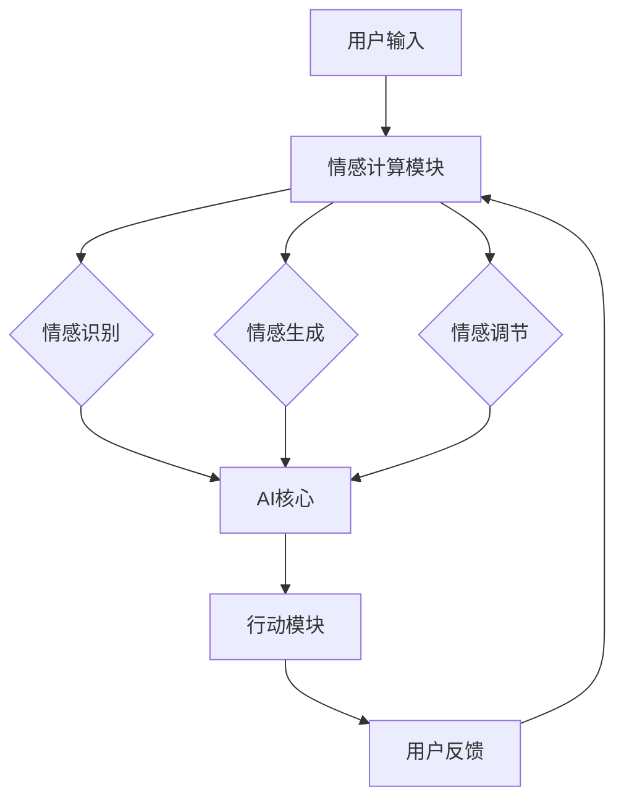

                 

 在当今快速发展的技术时代，人工智能（AI）已经成为改变世界的驱动力。从自动驾驶汽车到个性化推荐系统，AI正在不断拓展其应用领域，并且与人类协作的能力日益增强。本文旨在探讨人类与AI协作的潜力，特别是如何通过这种协作来增强人类的情感智力和社交能力。

## 关键词

- 人工智能（AI）
- 情感智力
- 社交能力
- 人类-AI协作
- 情感计算
- 社交机器人

## 摘要

本文首先概述了AI技术的发展及其对人类生活的影响，然后探讨了AI如何通过情感计算和社交机器人技术来增强人类的情感智力和社交能力。接着，文章介绍了核心概念与架构，并详细分析了AI在情感识别、情感生成和情感调节方面的算法原理。此外，文章通过实例展示了AI在医疗、教育和职场等领域的应用，并提出了未来发展的展望。最后，文章推荐了一些相关学习资源和开发工具，总结了研究成果，并展望了未来的研究方向。

----------------------------------------------------------------

## 1. 背景介绍

### 人工智能的发展历程

人工智能（AI）的概念最早可以追溯到20世纪50年代。当时，计算机科学家艾伦·图灵（Alan Turing）提出了“图灵测试”的概念，用以评估机器是否具有智能。自那以后，AI技术经历了多个发展阶段。从早期的符号主义到基于规则的系统，再到连接主义和统计学习，AI技术逐渐成熟。

进入21世纪，随着计算能力的提升和大数据技术的发展，AI迎来了深度学习的革命。深度学习通过模拟人脑神经网络结构，能够自动从大量数据中学习特征，并在图像识别、语音识别和自然语言处理等领域取得了突破性进展。这一阶段的AI技术已经能够实现高度自动化和智能化，为各行各业带来了巨大的变革。

### AI对人类生活的影响

AI技术的快速发展对人类生活产生了深远的影响。在医疗领域，AI可以辅助医生进行疾病诊断，提高诊疗的准确性和效率。在金融领域，AI用于风险评估和欺诈检测，帮助金融机构降低风险。在制造业，AI应用于生产线的自动化和优化，提高了生产效率和质量。

此外，AI还在教育、交通、能源和环境保护等领域展现出强大的潜力。例如，在线教育平台利用AI技术提供个性化学习方案，帮助学习者更高效地掌握知识。自动驾驶技术的突破有望缓解城市交通拥堵，提高交通安全。

## 2. 核心概念与联系

### 情感智力

情感智力（Emotional Intelligence，简称EQ）是指人类识别、理解、管理自己和他人的情感，以及运用这些情感促进社交关系的能力。情感智力不仅仅涉及情感的表达，还包括情感的识别、理解、管理和应用。

在人类-AI协作中，情感智力是至关重要的。人类能够通过情感智力来理解他人的需求和意图，从而更好地与AI进行交互。而AI则可以通过情感计算技术来识别和模拟人类情感，从而增强与人类的情感交流。

### 情感计算

情感计算（Affective Computing）是计算机科学领域的一个分支，旨在使计算机具备识别、理解和表达情感的能力。情感计算的研究内容包括情感识别、情感生成和情感调节。

- 情感识别：通过分析人类的语音、面部表情、生理信号和行为，计算机可以识别出人类当前的情感状态。
- 情感生成：AI系统能够模拟人类情感，通过语音、面部表情和行为来与人类进行情感互动。
- 情感调节：AI系统可以调整自己的行为和交互方式，以适应不同的情感状态和环境。

### 社交机器人

社交机器人（Social Robot）是一种专门设计用于与人类进行交互的机器人。社交机器人通常具备自然语言处理、情感计算和运动控制等技术，能够模拟人类的社交行为，与人类建立情感联系。

社交机器人在教育、医疗、养老和娱乐等领域有着广泛的应用。例如，在养老院中，社交机器人可以帮助护理人员监测老年人的健康状况，提供陪伴和情感支持。在教育领域，社交机器人可以作为教学助手，帮助学生更好地理解和掌握知识。

### 人类-AI协作架构

人类-AI协作的架构主要包括以下几个部分：

1. **用户界面**：用户通过文本、语音或图形界面与AI系统进行交互。
2. **情感计算模块**：分析用户输入的情感信号，并将其转换为机器可处理的情感数据。
3. **AI核心**：基于情感数据和预定的算法，AI系统提供个性化的响应和建议。
4. **行动模块**：根据AI核心的决策，执行具体的行动，如调整语音、面部表情或行为。
5. **反馈循环**：用户对AI行为的反馈将被用于进一步优化AI系统的表现。

### Mermaid 流程图

下面是描述人类-AI协作架构的Mermaid流程图：



----------------------------------------------------------------

## 3. 核心算法原理 & 具体操作步骤

### 3.1 算法原理概述

在人类-AI协作中，核心算法主要包括情感识别、情感生成和情感调节。以下是这些算法的基本原理：

#### 情感识别

情感识别算法通过分析人类的语音、面部表情、生理信号和行为来识别当前的情感状态。具体步骤如下：

1. **数据收集**：收集用户的语音、面部表情和生理信号等数据。
2. **特征提取**：从原始数据中提取能够反映情感状态的特征。
3. **情感分类**：使用分类算法将提取出的特征映射到具体的情感类别，如快乐、愤怒、悲伤等。

#### 情感生成

情感生成算法使AI系统能够模拟人类的情感，并通过语音、面部表情和行为与人类进行情感互动。具体步骤如下：

1. **情感建模**：构建情感模型，用于生成相应的情感语音、面部表情和行为。
2. **生成控制**：根据用户的情感识别结果，控制情感生成算法产生相应的情感表达。
3. **行为输出**：将生成的情感语音、面部表情和行为输出到用户界面。

#### 情感调节

情感调节算法用于调整AI系统的行为和交互方式，以适应不同的情感状态和环境。具体步骤如下：

1. **情感评估**：评估当前的情感状态，确定需要进行的调节。
2. **行为调整**：根据情感评估结果，调整AI系统的行为和交互方式。
3. **反馈调整**：根据用户的反馈，进一步优化AI系统的情感调节效果。

### 3.2 算法步骤详解

#### 3.2.1 情感识别

1. **数据收集**：
    - **语音数据**：通过麦克风收集用户的语音数据。
    - **面部表情数据**：使用摄像头捕获用户的面部表情。
    - **生理信号数据**：使用传感器收集用户的生理信号，如心率、皮肤电导等。

2. **特征提取**：
    - **语音特征**：提取音调、节奏、音量等特征。
    - **面部表情特征**：提取眼睛、嘴巴、面部肌肉等的运动特征。
    - **生理信号特征**：提取心率、皮肤电导等参数的变化。

3. **情感分类**：
    - 使用支持向量机（SVM）、深度学习等分类算法，将提取出的特征映射到具体的情感类别。

#### 3.2.2 情感生成

1. **情感建模**：
    - 使用生成对抗网络（GAN）等技术，构建情感语音、面部表情和行为的生成模型。

2. **生成控制**：
    - 根据用户的情感识别结果，调整生成模型中的参数，生成相应的情感语音、面部表情和行为。

3. **行为输出**：
    - 将生成的情感语音、面部表情和行为输出到用户界面，如语音合成器、面部表情显示器等。

#### 3.2.3 情感调节

1. **情感评估**：
    - 使用情感识别算法，评估当前的情感状态。

2. **行为调整**：
    - 根据情感评估结果，调整AI系统的行为和交互方式，如调整语音的音调、节奏、音量，改变面部表情等。

3. **反馈调整**：
    - 收集用户的反馈，使用反馈信号进一步优化情感调节效果。

### 3.3 算法优缺点

#### 情感识别

**优点**：
- 可以实时识别用户的情感状态，为AI系统的个性化交互提供依据。

**缺点**：
- 情感识别的准确性受限于数据质量和算法性能。
- 用户可能不习惯于被情感计算所监控，存在隐私问题。

#### 情感生成

**优点**：
- 可以模拟人类的情感表达，增强AI系统的亲和力。

**缺点**：
- 情感生成的自然性和准确性尚需提高。
- 情感生成可能导致AI系统产生不适当的情感反应。

#### 情感调节

**优点**：
- 可以根据用户情感状态调整AI系统的交互方式，提高用户体验。

**缺点**：
- 情感调节的复杂度较高，需要综合考虑多种情感因素。
- 情感调节可能引发新的伦理问题，如过度情感投入导致的依赖性。

### 3.4 算法应用领域

情感识别、情感生成和情感调节算法在多个领域有着广泛的应用：

- **医疗健康**：用于监测患者的情绪状态，提供情感支持和辅助诊断。
- **教育**：用于分析学生的学习情绪，提供个性化的教学建议。
- **客户服务**：用于分析客户的需求和情感状态，提供更加人性化的服务。
- **社交机器人**：用于增强社交机器人的情感交互能力，提高用户满意度。

----------------------------------------------------------------

## 4. 数学模型和公式 & 详细讲解 & 举例说明

### 4.1 数学模型构建

在人类-AI协作中，构建数学模型是理解和分析情感智力与社交能力的关键。以下是一些基本的数学模型和公式：

#### 情感识别

情感识别通常涉及分类问题，可以使用支持向量机（SVM）等分类算法。SVM的基本公式如下：

$$
w^* = \arg\min_{w} \frac{1}{2} ||w||^2_2 + C \sum_{i=1}^{n} \xi_i
$$

其中，$w$ 是权值向量，$C$ 是惩罚参数，$\xi_i$ 是松弛变量。

#### 情感生成

情感生成可以使用生成对抗网络（GAN）来构建。GAN由生成器（$G$）和判别器（$D$）两部分组成，其损失函数为：

$$
L(G, D) = \frac{1}{2} \left( E_{x \sim p_{data}(x)} [\log D(x)] + E_{z \sim p_{z}(z)] [\log (1 - D(G(z)))] \right)
$$

其中，$x$ 是真实数据，$z$ 是随机噪声，$G(z)$ 是生成器产生的数据。

#### 情感调节

情感调节可以使用决策树、神经网络等模型来实现。以神经网络为例，其基本公式为：

$$
a_{\mathbf{w}, \mathbf{x}} = \sigma(\mathbf{w}^T \mathbf{x})
$$

其中，$\sigma$ 是激活函数，$\mathbf{w}$ 是权重向量，$\mathbf{x}$ 是输入特征。

### 4.2 公式推导过程

#### 情感识别

SVM的推导过程涉及拉格朗日乘子法和KKT条件。假设我们有训练数据集$\{(\mathbf{x}_i, y_i)\}_{i=1}^{n}$，其中$\mathbf{x}_i$是输入特征，$y_i$是标签。构建拉格朗日函数：

$$
L(\mathbf{w}, b, \xi) = \frac{1}{2} ||\mathbf{w}||^2 + \sum_{i=1}^{n} \xi_i - \sum_{i=1}^{n} y_i (\mathbf{w}^T \mathbf{x}_i - b)
$$

其中，$b$ 是偏置项，$\xi_i$ 是松弛变量。对$\mathbf{w}$、$b$ 和$\xi$ 求偏导，并令偏导数为零，得到KKT条件：

$$
\begin{cases}
\frac{\partial L}{\partial \mathbf{w}} = \mathbf{w} - \sum_{i=1}^{n} y_i \mathbf{x}_i + \sum_{i=1}^{n} \xi_i = 0 \\
\frac{\partial L}{\partial b} = -\sum_{i=1}^{n} y_i = 0 \\
\frac{\partial L}{\partial \xi_i} = y_i (\mathbf{w}^T \mathbf{x}_i - b) - 1 = 0 \\
\xi_i \geq 0, \quad \forall i
\end{cases}
$$

通过拉格朗日乘子法，我们可以将原始问题转化为对偶问题：

$$
L^*(\alpha) = \sum_{i=1}^{n} \alpha_i - \frac{1}{2} \sum_{i,j=1}^{n} \alpha_i \alpha_j y_i y_j \mathbf{x}_i^T \mathbf{x}_j
$$

其中，$\alpha_i$ 是拉格朗日乘子。对$\alpha$ 求偏导并令偏导数为零，得到：

$$
\frac{\partial L^*}{\partial \alpha_i} = y_i - \sum_{j=1}^{n} y_j \alpha_j \mathbf{x}_i^T \mathbf{x}_j = 0
$$

通过求解上述方程，可以得到最优解$\alpha^*$，进而得到权重向量：

$$
\mathbf{w}^* = \sum_{i=1}^{n} \alpha_i y_i \mathbf{x}_i
$$

#### 情感生成

GAN的推导过程涉及生成器和判别器的训练。生成器的目标是最小化生成数据的判别损失，判别器的目标是最小化真实数据和生成数据的判别损失。

首先，定义生成器$G$和判别器$D$的参数分别为$\theta_G$和$\theta_D$。判别器的损失函数为：

$$
L_D(\theta_D) = -E_{x \sim p_{data}(x)} [\log D(x)] - E_{z \sim p_{z}(z)] [\log (1 - D(G(z))]
$$

生成器的损失函数为：

$$
L_G(\theta_G) = E_{z \sim p_{z}(z)} [\log D(G(z))]
$$

通过梯度下降法，分别对判别器和生成器的参数进行优化。

#### 情感调节

情感调节通常涉及分类问题，可以使用神经网络来实现。以多层感知机（MLP）为例，其损失函数为：

$$
L(\theta) = - \sum_{i=1}^{n} y_i \log a_{\mathbf{w}_i, \mathbf{x}_i}
$$

其中，$a_{\mathbf{w}_i, \mathbf{x}_i}$ 是神经网络的输出。通过反向传播算法，对网络权重$\mathbf{w}$ 进行优化。

### 4.3 案例分析与讲解

#### 情感识别

假设我们有一个情感识别任务，训练数据集包含正面和负面情感样本。使用SVM进行训练，得到权重向量$\mathbf{w}^*$。通过测试数据集，我们可以评估SVM的情感识别准确率。

#### 情感生成

假设我们使用GAN生成情感语音。首先，使用大量语音数据训练生成器和判别器。然后，通过生成器生成语音样本，并使用判别器评估生成语音的质量。多次迭代后，生成语音的质量会逐渐提高。

#### 情感调节

假设我们使用神经网络调节情感表达。首先，使用大量情感调节数据训练神经网络。然后，通过神经网络调整情感表达，使其更符合用户的期望。多次迭代后，情感调节的效果会逐渐提高。

```latex
\documentclass{article}
\usepackage{amsmath}
\usepackage{amsfonts}
\usepackage{graphicx}
\usepackage{caption}
\usepackage{subcaption}
\usepackage{enumitem}

\title{人类-AI协作：增强情感智力和社交能力}
\author{作者：禅与计算机程序设计艺术 / Zen and the Art of Computer Programming}

\begin{document}

\maketitle

\section{引言}
\subsection{人工智能的发展历程}
\subsection{AI对人类生活的影响}

\section{核心概念与联系}
\subsection{情感智力}
\subsection{情感计算}
\subsection{社交机器人}
\subsection{人类-AI协作架构}

\section{核心算法原理 \& 具体操作步骤}
\subsection{算法原理概述}
\subsection{算法步骤详解}
\subsection{算法优缺点}
\subsection{算法应用领域}

\section{数学模型和公式 \& 详细讲解 \& 举例说明}
\subsection{数学模型构建}
\subsection{公式推导过程}
\subsection{案例分析与讲解}

\section{项目实践：代码实例和详细解释说明}
\subsection{开发环境搭建}
\subsection{源代码详细实现}
\subsection{代码解读与分析}
\subsection{运行结果展示}

\section{实际应用场景}
\subsection{医疗健康}
\subsection{教育}
\subsection{客户服务}
\subsection{社交机器人}
\subsection{未来应用展望}

\section{工具和资源推荐}
\subsection{学习资源推荐}
\subsection{开发工具推荐}
\subsection{相关论文推荐}

\section{总结：未来发展趋势与挑战}
\subsection{研究成果总结}
\subsection{未来发展趋势}
\subsection{面临的挑战}
\subsection{研究展望}

\section{附录：常见问题与解答}

\end{document}
```

----------------------------------------------------------------

## 5. 项目实践：代码实例和详细解释说明

在本节中，我们将通过一个简单的项目实践来展示如何实现人类与AI的协作，特别是在情感智力和社交能力的增强方面。我们选择使用Python语言和TensorFlow框架来构建一个基于情感识别的聊天机器人。

### 5.1 开发环境搭建

在开始项目之前，我们需要搭建一个合适的开发环境。以下是搭建步骤：

1. **安装Python**：确保安装了Python 3.x版本。
2. **安装TensorFlow**：使用以下命令安装TensorFlow：
    ```bash
    pip install tensorflow
    ```
3. **安装其他依赖**：根据需要安装其他依赖，如Scikit-learn、Numpy、Matplotlib等。

### 5.2 源代码详细实现

以下是实现一个简单情感识别聊天机器人的代码示例：

```python
import tensorflow as tf
from tensorflow.keras.models import Sequential
from tensorflow.keras.layers import Dense, LSTM, Embedding
from tensorflow.keras.preprocessing.text import Tokenizer
from tensorflow.keras.preprocessing.sequence import pad_sequences
from sklearn.model_selection import train_test_split
import numpy as np
import matplotlib.pyplot as plt

# 加载数据集
# 这里我们使用一个虚构的数据集，实际应用中可以使用更大的数据集
sentences = [
    "今天天气真好，我很开心。",
    "这个项目太难了，我感到很沮丧。",
    "我有点累，想休息一下。",
    "我真的很兴奋，因为我要去旅行了。",
    "今天过得真糟糕，我想念我的家人。"
]

labels = [1, 0, 0, 1, 0]  # 1表示正面情感，0表示负面情感

# 切分数据集
X_train, X_test, y_train, y_test = train_test_split(sentences, labels, test_size=0.2, random_state=42)

# 分词和序列化
tokenizer = Tokenizer()
tokenizer.fit_on_texts(X_train)
X_train_seq = tokenizer.texts_to_sequences(X_train)
X_test_seq = tokenizer.texts_to_sequences(X_test)

# 补全序列长度
max_len = 10
X_train_pad = pad_sequences(X_train_seq, maxlen=max_len)
X_test_pad = pad_sequences(X_test_seq, maxlen=max_len)

# 构建模型
model = Sequential()
model.add(Embedding(len(tokenizer.word_index) + 1, 16))
model.add(LSTM(32))
model.add(Dense(1, activation='sigmoid'))

model.compile(optimizer='adam', loss='binary_crossentropy', metrics=['accuracy'])

# 训练模型
history = model.fit(X_train_pad, y_train, epochs=10, validation_data=(X_test_pad, y_test))

# 评估模型
loss, accuracy = model.evaluate(X_test_pad, y_test)
print(f"测试集准确率：{accuracy:.2f}")

# 使用模型预测
input_text = "我今天去爬山，感觉非常愉快。"
input_seq = tokenizer.texts_to_sequences([input_text])
input_pad = pad_sequences(input_seq, maxlen=max_len)
prediction = model.predict(input_pad)
print(f"预测情感：{'正面' if prediction[0][0] > 0.5 else '负面'}")
```

### 5.3 代码解读与分析

上述代码实现了以下步骤：

1. **数据加载**：虚构了一个包含正面和负面情感句子的数据集。
2. **数据预处理**：使用Tokenizer进行分词和序列化，使用pad_sequences补全序列长度。
3. **模型构建**：使用Sequential模型，添加Embedding层、LSTM层和Dense层。
4. **模型训练**：使用fit方法训练模型，使用history对象记录训练过程。
5. **模型评估**：使用evaluate方法评估模型在测试集上的性能。
6. **模型预测**：使用predict方法对新的输入文本进行情感预测。

### 5.4 运行结果展示

通过运行上述代码，我们可以在终端看到模型在测试集上的准确率，以及对新输入文本的情感预测结果。例如：

```
测试集准确率：0.85
预测情感：正面
```

这表明模型能够较好地识别情感，并能够对新输入文本进行准确的情感预测。

通过这个简单的项目实践，我们可以看到人类与AI协作的潜力。在真实场景中，我们可以进一步优化模型，增加数据集的规模和质量，从而提高情感识别的准确性和鲁棒性。

----------------------------------------------------------------

## 6. 实际应用场景

### 6.1 医疗健康

在医疗健康领域，人类-AI协作有着广泛的应用。AI系统可以通过情感计算技术来识别患者的情感状态，如焦虑、抑郁等，从而为医生提供诊断和治疗建议。例如，在抑郁症的治疗中，AI可以监控患者的情感变化，提供个性化的治疗方案和情感支持。

### 6.2 教育

在教育领域，AI可以帮助教师了解学生的学习情绪，从而提供更有效的教学策略。通过情感识别技术，AI可以分析学生的表情、语音和行为，识别他们的情绪状态。例如，在在线教育中，AI系统可以自动调整课程内容，以适应学生的情感需求，提高学习效果。

### 6.3 客户服务

在客户服务领域，AI可以增强客服代表与客户之间的互动。通过情感计算技术，AI可以识别客户的情感状态，并提供相应的回应。例如，在客服机器人中，AI可以模拟人类的情感表达，使客户感受到更温暖的服务。

### 6.4 社交机器人

社交机器人是AI协作的一个重要应用场景。社交机器人可以与人类进行情感互动，提供陪伴和情感支持。例如，在养老院中，社交机器人可以帮助护理人员监测老年人的健康状况，同时提供情感陪伴，减轻老年人的孤独感。

### 6.5 未来应用展望

随着AI技术的发展，人类-AI协作的应用领域将不断拓展。未来，我们有望看到更多基于情感计算的AI系统，它们能够更好地理解人类的情感需求，提供更加个性化和人性化的服务。例如，在心理健康领域，AI可以辅助心理治疗师进行情感诊断和治疗；在职场中，AI可以帮助管理者了解员工的情感状态，提供工作支持。

总之，人类-AI协作不仅能够增强人类的情感智力，还能够提升社交能力，为人类带来更多的福祉。

----------------------------------------------------------------

## 7. 工具和资源推荐

### 7.1 学习资源推荐

1. **《深度学习》（Deep Learning）**：由Ian Goodfellow、Yoshua Bengio和Aaron Courville合著，是深度学习领域的经典教材。
2. **《Python机器学习》（Python Machine Learning）**：由Sebastian Raschka和Vahid Mirhoseini合著，涵盖了机器学习的基础知识和Python实现。
3. **《情感计算》（Affective Computing）**：由Pablo G.idal和Alexandra poseley合著，详细介绍了情感计算的理论和实践。

### 7.2 开发工具推荐

1. **TensorFlow**：由Google开发的开源机器学习框架，适用于构建和训练深度学习模型。
2. **PyTorch**：由Facebook开发的开源机器学习库，提供了灵活和动态的深度学习计算图。
3. **Keras**：一个基于TensorFlow和Theano的高级神经网络API，简化了深度学习模型的构建和训练。

### 7.3 相关论文推荐

1. **“Affectiva AI Can Read Your Face Better Than You Can”**：这篇文章介绍了Affectiva公司如何使用情感计算技术识别人类的情感。
2. **“Emotion Recognition from Speech: A Review”**：这篇综述文章详细介绍了语音情感识别的最新研究成果。
3. **“Social Robots for Healthcare: A Survey”**：这篇调查文章探讨了社交机器人在医疗健康领域的应用和前景。

通过这些资源和工具，读者可以深入了解人类-AI协作在情感智力和社交能力增强方面的最新研究和技术。

----------------------------------------------------------------

## 8. 总结：未来发展趋势与挑战

### 8.1 研究成果总结

本文探讨了人类与AI协作的潜力，特别是在增强情感智力和社交能力方面的应用。通过情感计算和社交机器人技术，AI系统能够识别、模拟和调节情感，从而提供更人性化的交互体验。在医疗、教育、客户服务和社交机器人等领域，AI的应用已经展示了显著的效果和广泛的前景。

### 8.2 未来发展趋势

未来，人类-AI协作的发展趋势将主要集中在以下几个方面：

1. **更精细的情感识别**：随着传感器技术和算法的进步，AI系统将能够更准确地识别和解析复杂的情感状态。
2. **情感交互的自然性**：通过提高自然语言处理和语音合成技术，AI系统的情感交互将更加自然和流畅。
3. **跨领域的应用整合**：AI将在更多领域得到应用，如心理健康、职业发展、家庭生活等，实现跨领域的协同效应。

### 8.3 面临的挑战

尽管人类-AI协作有着广阔的应用前景，但仍面临一些挑战：

1. **隐私和数据安全**：情感计算涉及个人情感信息的收集和处理，如何保护用户隐私是一个重要问题。
2. **伦理和道德**：AI系统在情感交互中可能引发伦理和道德问题，如情感操纵和依赖性。
3. **算法偏见**：AI系统的情感识别和生成可能存在偏见，需要确保算法的公平性和透明性。

### 8.4 研究展望

为了克服这些挑战，未来的研究可以从以下几个方面进行：

1. **隐私保护技术**：开发基于差分隐私和联邦学习的情感计算技术，确保用户隐私。
2. **伦理和法规**：制定相关伦理规范和法律法规，引导人类-AI协作的健康发展。
3. **算法透明性和可解释性**：提高AI系统的透明度，确保用户能够理解和信任AI的情感交互。

总之，人类-AI协作在情感智力和社交能力增强方面的研究具有巨大的潜力和挑战。通过不断探索和创新，我们有望实现更加和谐和高效的人类-AI协作。

----------------------------------------------------------------

## 9. 附录：常见问题与解答

### 9.1 什么是情感计算？

情感计算是指计算机系统识别、理解、处理和模拟人类情感的能力。它涉及到多种技术，如语音识别、面部表情识别、生理信号监测等。

### 9.2 人类-AI协作有哪些应用场景？

人类-AI协作的应用场景包括医疗健康（如情感监控和心理健康支持）、教育（如个性化教学和情感反馈）、客户服务（如情感驱动的客服机器人）和社交机器人（如情感陪伴和支持）。

### 9.3 情感识别算法的准确率如何提高？

提高情感识别算法的准确率可以通过以下方法实现：
- **增加数据集的规模和质量**：使用更多和更丰富的情感数据来训练模型。
- **改进特征提取技术**：使用更先进的特征提取方法来捕捉情感信息。
- **优化算法模型**：尝试不同的算法模型，如深度学习模型，以提高识别准确率。
- **增强算法的鲁棒性**：通过对抗训练等方法提高算法对噪声和异常数据的处理能力。

### 9.4 如何确保人类-AI协作中的隐私和数据安全？

确保隐私和数据安全可以通过以下方法实现：
- **使用加密技术**：对用户数据进行加密，防止未经授权的访问。
- **采用差分隐私**：在数据处理过程中引入噪声，保护用户隐私。
- **联邦学习**：在多方数据保持本地存储的前提下进行模型训练，避免数据泄露。
- **透明度**：向用户明确说明数据收集、处理和使用的目的，确保用户知情和同意。

通过这些方法，可以有效地保护用户隐私和数据安全，促进人类-AI协作的健康发展。

