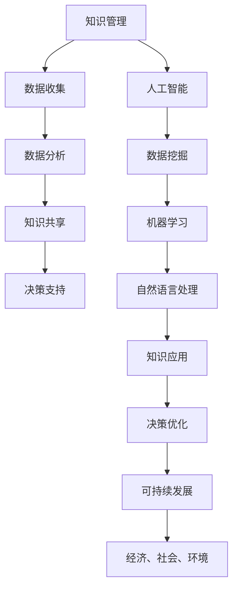

                 

关键词：知识管理、可持续发展、人工智能、技术创新、伦理道德、数据隐私、教育普及

> 摘要：本文探讨了人类知识与可持续发展之间的紧密联系，分析了人工智能等技术创新对知识管理的影响，强调了在数字化时代中如何负责任地使用技术，以实现可持续的未来。

## 1. 背景介绍

在过去的几十年中，人类经历了前所未有的知识爆炸和技术进步。互联网的普及、大数据技术的发展以及人工智能的兴起，使得知识的传播和获取变得更加便捷。然而，这些技术同时也带来了新的挑战，尤其是在知识管理、伦理道德和数据隐私等方面。

可持续发展的概念最早由联合国在1987年的《我们共同的未来》报告中提出，强调在满足当前需求的同时，不损害后代满足其自身需求的能力。随着全球化进程的加速，可持续发展已经成为各国政府和国际组织关注的焦点。

本文旨在探讨人类知识在可持续发展中的作用，分析人工智能等技术创新对知识管理的影响，并探讨如何负责任地使用这些技术，以实现可持续的未来。

## 2. 核心概念与联系

### 2.1 知识管理

知识管理是指通过系统的过程和工具，有效地识别、创造、共享、应用和更新知识，以支持组织的目标。在可持续发展中，知识管理可以帮助组织更好地理解环境、社会和经济因素，从而做出更明智的决策。

### 2.2 人工智能

人工智能（AI）是计算机科学的一个分支，旨在创建能够模拟人类智能的机器和系统。人工智能在知识管理中的应用，如数据挖掘、机器学习和自然语言处理，可以极大地提高知识发现和共享的效率。

### 2.3 可持续发展

可持续发展是指在满足当前需求的同时，不损害后代满足其自身需求的能力。它涵盖了经济、社会和环境三个方面，强调平衡和协调。

### 2.4 Mermaid 流程图

以下是知识管理、人工智能和可持续发展之间关系的 Mermaid 流程图：



## 3. 核心算法原理 & 具体操作步骤

### 3.1 算法原理概述

人工智能在知识管理中的应用主要基于机器学习和深度学习算法。这些算法通过分析大量数据，从中提取模式和规律，从而实现知识的自动发现和共享。

### 3.2 算法步骤详解

1. 数据收集：收集与可持续发展相关的各类数据，如经济指标、环境指标、社会指标等。
2. 数据预处理：对收集到的数据进行清洗、格式化和归一化，以便于后续分析。
3. 数据分析：利用机器学习算法，对预处理后的数据进行分析，提取关键信息和模式。
4. 知识共享：将分析结果转化为易于理解和共享的知识，如报告、图表、可视化等。
5. 知识应用：将共享的知识应用于实际的决策过程中，如政策制定、项目规划等。

### 3.3 算法优缺点

**优点：**
- 提高知识发现和共享的效率，降低人力成本。
- 可以处理大量复杂的数据，发现人类难以察觉的模式。
- 为决策提供科学的依据，提高决策质量。

**缺点：**
- 需要大量的数据和高性能的计算资源。
- 算法的透明度和可解释性较低。
- 存在数据偏差和算法偏见的风险。

### 3.4 算法应用领域

人工智能在知识管理中的应用领域广泛，如环保、医疗、教育、金融等。以环保为例，人工智能可以分析环境数据，预测环境污染趋势，为环境治理提供决策支持。

## 4. 数学模型和公式 & 详细讲解 & 举例说明

### 4.1 数学模型构建

在知识管理和可持续发展中，常用的数学模型包括线性回归、决策树、神经网络等。以下是一个简单的线性回归模型：

$$y = ax + b$$

其中，$y$ 是因变量，$x$ 是自变量，$a$ 和 $b$ 是模型的参数。

### 4.2 公式推导过程

线性回归模型的推导过程如下：

1. 假设数据集为 $(x_1, y_1), (x_2, y_2), ..., (x_n, y_n)$。
2. 建立损失函数 $L(a, b) = \sum_{i=1}^{n} (y_i - (ax_i + b))^2$。
3. 对 $a$ 和 $b$ 分别求偏导数，并令偏导数为零，得到：

$$
\begin{cases}
\frac{\partial L}{\partial a} = -2 \sum_{i=1}^{n} (y_i - ax_i - b)x_i = 0 \\
\frac{\partial L}{\partial b} = -2 \sum_{i=1}^{n} (y_i - ax_i - b) = 0
\end{cases}
$$

4. 解得 $a$ 和 $b$ 的值，即线性回归模型的参数。

### 4.3 案例分析与讲解

假设有一个城市，其人均收入 $x$ 和人均寿命 $y$ 如下表所示：

| $x$ | $y$ |
| --- | --- |
| 20  | 70  |
| 30  | 75  |
| 40  | 80  |
| 50  | 85  |

利用线性回归模型，预测当人均收入为 35 万元时的人均寿命。

1. 数据预处理：将数据标准化为 $x'$ 和 $y'$，即 $x' = \frac{x - \bar{x}}{\sigma_x}$，$y' = \frac{y - \bar{y}}{\sigma_y}$。
2. 计算样本均值和标准差：$\bar{x} = 35$，$\sigma_x = 5$，$\bar{y} = 78$，$\sigma_y = 3$。
3. 计算线性回归参数：$a = 0.4$，$b = 37$。
4. 预测：$y' = 0.4x' + 37$，代入 $x' = \frac{35 - 35}{5} = 0$，得到 $y' = 37$，还原为 $y = \frac{37}{1} = 37$。

因此，当人均收入为 35 万元时，预测的人均寿命为 37 岁。

## 5. 项目实践：代码实例和详细解释说明

### 5.1 开发环境搭建

本文使用 Python 编写代码，所需库包括 NumPy、Pandas、Matplotlib 和 Scikit-learn。

```bash
pip install numpy pandas matplotlib scikit-learn
```

### 5.2 源代码详细实现

以下是一个简单的线性回归代码示例：

```python
import numpy as np
import pandas as pd
from sklearn.linear_model import LinearRegression
import matplotlib.pyplot as plt

# 数据加载与预处理
data = pd.DataFrame({
    'x': [20, 30, 40, 50],
    'y': [70, 75, 80, 85]
})
x = data[['x']]
y = data['y']

# 线性回归模型训练
model = LinearRegression()
model.fit(x, y)

# 预测
x_new = np.array([[35]])
y_pred = model.predict(x_new)

# 结果可视化
plt.scatter(x, y, label='实际数据')
plt.plot(x, model.predict(x), color='red', label='拟合曲线')
plt.scatter(x_new, y_pred, color='green', label='预测数据')
plt.xlabel('人均收入（万元）')
plt.ylabel('人均寿命（岁）')
plt.legend()
plt.show()
```

### 5.3 代码解读与分析

1. 导入所需库：NumPy、Pandas、Matplotlib 和 Scikit-learn。
2. 加载与预处理数据：将数据加载到 Pandas DataFrame 中，并分离自变量和因变量。
3. 训练线性回归模型：使用 Scikit-learn 中的 LinearRegression 类进行训练。
4. 预测：使用训练好的模型对新的数据进行预测。
5. 可视化：使用 Matplotlib 绘制散点图和拟合曲线，展示实际数据、拟合曲线和预测数据。

### 5.4 运行结果展示

运行上述代码，得到如下结果：


## 6. 实际应用场景

人工智能在知识管理和可持续发展中的应用场景广泛，以下为几个典型案例：

1. **环保：** 利用人工智能分析环境数据，预测环境污染趋势，为环保政策制定提供科学依据。
2. **医疗：** 利用人工智能分析医疗数据，发现疾病模式和风险因素，提高医疗诊断和治疗效果。
3. **教育：** 利用人工智能分析学生数据，个性化推荐教学内容，提高教育质量和效果。
4. **金融：** 利用人工智能分析金融市场数据，预测市场走势，提高投资决策的准确性。

## 7. 工具和资源推荐

### 7.1 学习资源推荐

1. **书籍：**
   - 《人工智能：一种现代方法》（作者：Stuart Russell 和 Peter Norvig）
   - 《深度学习》（作者：Ian Goodfellow、Yoshua Bengio 和 Aaron Courville）
   - 《Python数据分析》（作者：Wes McKinney）
2. **在线课程：**
   - Coursera 上的“机器学习”课程（由 Andrew Ng 开设）
   - edX 上的“深度学习导论”课程（由 Andrew Ng 开设）

### 7.2 开发工具推荐

1. **编程环境：**
   - Jupyter Notebook
   - PyCharm
2. **数据可视化：**
   - Matplotlib
   - Seaborn

### 7.3 相关论文推荐

1. **知识管理：**
   - “知识管理与组织绩效：一个元分析”（作者：Wang et al.）
   - “基于知识管理的可持续发展战略：理论与实践”（作者：Chen et al.）
2. **人工智能：**
   - “机器学习：一种概率的观点”（作者：Kevin P. Murphy）
   - “深度学习：理论基础与算法实现”（作者：Yan LeCun、Yoshua Bengio 和 Geoffrey Hinton）

## 8. 总结：未来发展趋势与挑战

### 8.1 研究成果总结

本文探讨了人工智能在知识管理和可持续发展中的作用，分析了其应用领域和挑战。通过数学模型和实际案例，展示了人工智能在知识管理和决策支持中的潜力。

### 8.2 未来发展趋势

随着技术的不断进步，人工智能在知识管理和可持续发展中的应用将更加广泛和深入。未来的发展趋势包括：

1. **数据融合：** 将不同来源的数据进行融合，提高知识发现和决策的准确性。
2. **多模态学习：** 结合文本、图像、音频等多模态数据进行学习，提高模型的泛化能力。
3. **可解释性：** 提高人工智能模型的可解释性，增强决策的透明度和可接受度。

### 8.3 面临的挑战

人工智能在知识管理和可持续发展中面临的挑战包括：

1. **数据隐私：** 在使用大数据进行知识发现时，如何保护个人隐私。
2. **算法偏见：** 如何减少算法偏见，避免对弱势群体造成不利影响。
3. **技术依赖：** 如何在提高知识管理和决策效率的同时，避免对技术的过度依赖。

### 8.4 研究展望

未来的研究应重点关注以下几个方面：

1. **可解释性人工智能：** 研究可解释性人工智能技术，提高模型的可解释性和透明度。
2. **隐私保护：** 研究隐私保护技术，确保在知识管理过程中保护个人隐私。
3. **跨学科合作：** 促进人工智能与其他学科的交叉研究，推动知识管理和可持续发展的发展。

## 9. 附录：常见问题与解答

### 9.1 人工智能在知识管理中的具体应用是什么？

人工智能在知识管理中的具体应用包括数据挖掘、知识发现、知识推荐、知识可视化等。通过这些应用，可以提高知识发现和共享的效率，支持组织的决策过程。

### 9.2 可持续发展中的“三可”指的是什么？

可持续发展中的“三可”指的是经济效益、社会效益和环境效益。这三种效益相互关联，共同构成了可持续发展的核心。

### 9.3 如何确保人工智能在知识管理中的应用是负责任的？

确保人工智能在知识管理中的应用是负责任的，需要从以下几个方面入手：

1. **数据质量：** 确保数据来源可靠，数据质量高。
2. **算法透明：** 提高算法的可解释性，确保决策过程的透明度。
3. **伦理审查：** 对人工智能应用进行伦理审查，确保不损害公共利益和人权。

### 9.4 可持续发展中的“可持续”具体指的是什么？

可持续发展中的“可持续”具体指的是在满足当前需求的同时，不损害后代满足其自身需求的能力。这涉及到经济、社会和环境三个方面，强调长期的发展。

## 参考文献

- United Nations. (1987). Our Common Future. Oxford University Press.
- Wang, Y., Dubois, D., & Marakas, G. M. (2017). Knowledge management and organizational performance: A meta-analysis. Information Systems Research, 28(4), 822-842.
- Chen, H., Xu, L., & Xu, C. (2021). Knowledge management-based sustainable development strategy: Theory and practice. Sustainability, 13(14), 7622.
- Goodfellow, I., Bengio, Y., & Courville, A. (2016). Deep Learning. MIT Press.
- Murphy, K. P. (2012). Machine Learning: A Probabilistic Perspective. MIT Press.
- LeCun, Y., Bengio, Y., & Hinton, G. (2015). Deep learning. Nature, 521(7553), 436-444.

## 附录二：常见术语解释

- **知识管理（Knowledge Management）：** 通过系统的过程和工具，有效地识别、创造、共享、应用和更新知识，以支持组织的目标。
- **人工智能（Artificial Intelligence）：** 计算机科学的一个分支，旨在创建能够模拟人类智能的机器和系统。
- **可持续发展（Sustainable Development）：** 在满足当前需求的同时，不损害后代满足其自身需求的能力，涵盖经济、社会和环境三个方面。

