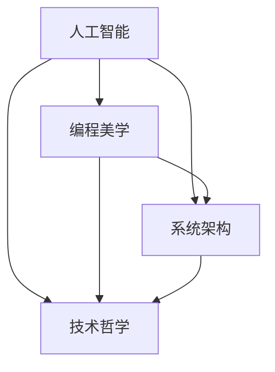

                 

关键字：人工智能，计算机科学，编程美学，系统架构，技术哲学

> 摘要：本文深入探讨人工智能与计算机科学领域中的知识体系与艺术表达，剖析技术与哲学的交汇，以及美与智慧在编程和系统设计中的融合。通过数学模型、算法原理、项目实践，本文旨在揭示计算机科学的深层逻辑与审美价值。

## 1. 背景介绍

人类的知识体系是不断进化的，从古代的哲学思想到现代的科学理论，每一个阶段都是人类智慧的结晶。计算机科学作为现代科技的基石，不仅是知识体系的一部分，更是推动科技进步的重要力量。然而，在计算机科学领域中，知识的积累与艺术表达往往被忽视。本文将探讨人类知识与艺术结合的必要性，以及这种结合在计算机科学中的体现。

### 1.1 计算机科学的发展历程

计算机科学的发展可以分为几个重要阶段：

- **早期计算机与编程语言**：从第一台计算机ENIAC的诞生到编程语言的发明，人类开始探索如何通过代码来操纵机器。
- **操作系统与网络**：随着操作系统的出现和网络的兴起，计算机科学的领域得到了极大扩展，分布式计算和互联网技术逐渐成熟。
- **人工智能与大数据**：21世纪初，人工智能和大数据技术的发展，使得计算机科学进入了一个新的时代，机器学习和深度学习成为研究热点。
- **量子计算与区块链**：未来，量子计算和区块链技术有望带来计算机科学领域的又一次革命。

### 1.2 艺术在计算机科学中的地位

艺术不仅仅是视觉和听觉的享受，更是人类表达思想、情感和观念的一种方式。在计算机科学中，艺术的价值体现在以下几个方面：

- **用户体验**：在软件设计和人机交互中，美学的应用可以提升用户体验，使软件更加易用和愉悦。
- **编程美学**：简洁、优雅的代码不仅更容易理解和维护，还能够展现出编程者的智慧和审美能力。
- **计算机视觉与艺术**：计算机科学在图像处理、图形学等领域的发展，为艺术创作提供了新的工具和表现手法。

## 2. 核心概念与联系

在深入探讨计算机科学与艺术的结合之前，我们首先需要明确几个核心概念：

- **人工智能**：人工智能是通过计算机程序模拟人类智能的科学，包括机器学习、深度学习、自然语言处理等领域。
- **编程美学**：编程美学是关于编写简洁、高效、易读代码的艺术，强调代码的简洁性、可维护性和可扩展性。
- **系统架构**：系统架构是关于如何构建复杂系统的基础结构，涉及组件设计、性能优化、安全性等方面。
- **技术哲学**：技术哲学探讨技术对人类社会的影响，包括伦理、道德、社会问题等方面。

下面是一个使用Mermaid绘制的流程图，展示了这些核心概念之间的联系：



### 2.1 人工智能与编程美学

人工智能的发展离不开编程美学。简洁、高效的代码是实现人工智能算法的关键。例如，深度学习中的神经网络模型需要大量的计算资源，因此代码的优化对于提高模型性能至关重要。

### 2.2 系统架构与编程美学

在系统架构设计中，编程美学同样发挥着重要作用。一个良好的系统架构应该具有模块化、可扩展和易于维护的特点，这与编程美学的核心理念高度契合。

### 2.3 技术哲学与编程美学

技术哲学关注技术对人类生活的影响，而编程美学则关注技术在实现过程中的审美价值。一个具有高度审美价值的系统设计不仅能够提高用户体验，还能够传递出技术哲学的理念。

## 3. 核心算法原理 & 具体操作步骤

在计算机科学中，算法是解决问题的关键。本文将介绍一种核心算法——深度学习算法，并详细阐述其原理和操作步骤。

### 3.1 算法原理概述

深度学习算法是一种基于多层神经网络的机器学习算法，通过模拟人脑的神经网络结构，实现对数据的自动特征学习和分类。深度学习算法的核心思想是多层抽象，每一层神经网络都能够对输入数据进行特征提取和转换。

### 3.2 算法步骤详解

深度学习算法的具体操作步骤如下：

1. **数据预处理**：对输入数据进行标准化处理，以消除数据之间的差异。
2. **初始化模型**：根据数据特点和任务需求，初始化神经网络模型。
3. **前向传播**：将输入数据通过神经网络的前向传播过程，计算出输出结果。
4. **反向传播**：根据输出结果和实际标签，计算误差，并通过反向传播算法更新网络权重。
5. **迭代优化**：重复前向传播和反向传播过程，直到模型达到预定的性能指标。

### 3.3 算法优缺点

深度学习算法具有以下优点：

- **强大的特征提取能力**：能够自动从数据中提取高层次的抽象特征，提高模型的性能。
- **自适应性强**：能够根据不同的数据集和任务需求，调整网络结构和参数，具有很好的适应性。

然而，深度学习算法也存在一些缺点：

- **计算量大**：深度学习算法需要进行大量的矩阵运算，计算资源消耗较大。
- **数据需求高**：深度学习算法需要大量的数据进行训练，数据质量和数量对于模型的性能至关重要。

### 3.4 算法应用领域

深度学习算法在多个领域得到了广泛应用，包括计算机视觉、自然语言处理、语音识别等。例如，在计算机视觉领域，深度学习算法可以用于图像分类、目标检测和图像生成等任务；在自然语言处理领域，深度学习算法可以用于文本分类、机器翻译和情感分析等任务。

## 4. 数学模型和公式 & 详细讲解 & 举例说明

在深度学习算法中，数学模型和公式起着至关重要的作用。本文将介绍深度学习算法中的两个关键数学模型——神经网络模型和损失函数，并详细讲解其公式推导和实际应用。

### 4.1 神经网络模型

神经网络模型是深度学习算法的核心，其基本结构包括输入层、隐藏层和输出层。每个层由多个神经元组成，神经元之间通过权重连接。以下是神经网络模型的基本公式：

$$
y = \sigma(W \cdot x + b)
$$

其中，$y$ 为输出结果，$\sigma$ 为激活函数，$W$ 为权重矩阵，$x$ 为输入向量，$b$ 为偏置项。

### 4.2 损失函数

损失函数用于衡量模型预测结果与实际标签之间的差距，是深度学习算法优化目标的重要组成部分。常见的损失函数包括均方误差（MSE）和交叉熵（Cross Entropy）。

- **均方误差（MSE）**：

$$
MSE = \frac{1}{m} \sum_{i=1}^{m} (y_i - \hat{y}_i)^2
$$

其中，$m$ 为样本数量，$y_i$ 为实际标签，$\hat{y}_i$ 为模型预测结果。

- **交叉熵（Cross Entropy）**：

$$
Cross \ Entropy = -\frac{1}{m} \sum_{i=1}^{m} y_i \log(\hat{y}_i)
$$

### 4.3 案例分析与讲解

为了更好地理解神经网络模型和损失函数的应用，我们来看一个简单的例子：手写数字识别。

- **数据集**：手写数字数据集，包含0到9的手写数字图像。
- **模型结构**：输入层有784个神经元（对应图像的784个像素点），隐藏层有100个神经元，输出层有10个神经元（对应10个数字）。
- **激活函数**：隐藏层使用ReLU激活函数，输出层使用softmax激活函数。

在训练过程中，我们通过不断优化模型参数，使模型预测结果与实际标签之间的差距最小化。最终，训练好的模型可以用于手写数字的识别。

## 5. 项目实践：代码实例和详细解释说明

### 5.1 开发环境搭建

为了实践深度学习算法，我们需要搭建一个开发环境。以下是搭建过程的简要步骤：

1. 安装Python：下载并安装Python 3.7及以上版本。
2. 安装TensorFlow：通过pip命令安装TensorFlow库。

```bash
pip install tensorflow
```

3. 安装其他依赖库：安装NumPy、Matplotlib等依赖库。

```bash
pip install numpy matplotlib
```

### 5.2 源代码详细实现

下面是一个简单的手写数字识别项目的代码实现：

```python
import tensorflow as tf
from tensorflow.keras.datasets import mnist
from tensorflow.keras.models import Sequential
from tensorflow.keras.layers import Dense, Flatten, Conv2D, MaxPooling2D, Dropout
from tensorflow.keras.optimizers import Adam

# 加载MNIST数据集
(x_train, y_train), (x_test, y_test) = mnist.load_data()

# 数据预处理
x_train = x_train.reshape(-1, 28, 28, 1).astype("float32") / 255.0
x_test = x_test.reshape(-1, 28, 28, 1).astype("float32") / 255.0
y_train = tf.keras.utils.to_categorical(y_train, 10)
y_test = tf.keras.utils.to_categorical(y_test, 10)

# 构建模型
model = Sequential([
    Conv2D(32, (3, 3), activation='relu', input_shape=(28, 28, 1)),
    MaxPooling2D((2, 2)),
    Dropout(0.25),
    Flatten(),
    Dense(128, activation='relu'),
    Dropout(0.5),
    Dense(10, activation='softmax')
])

# 编译模型
model.compile(optimizer=Adam(), loss='categorical_crossentropy', metrics=['accuracy'])

# 训练模型
model.fit(x_train, y_train, epochs=10, batch_size=128, validation_data=(x_test, y_test))

# 评估模型
test_loss, test_acc = model.evaluate(x_test, y_test)
print(f"Test accuracy: {test_acc:.2f}")
```

### 5.3 代码解读与分析

上述代码实现了一个简单的卷积神经网络（CNN）模型，用于手写数字识别。

1. **数据预处理**：将MNIST数据集的图像数据reshape为合适的形状，并归一化处理。
2. **构建模型**：使用Sequential模型构建一个包含卷积层、池化层、全连接层和Dropout层的神经网络。
3. **编译模型**：指定优化器、损失函数和评估指标。
4. **训练模型**：使用fit方法训练模型，设置训练轮数、批量大小和验证数据。
5. **评估模型**：使用evaluate方法评估模型在测试数据上的性能。

通过上述步骤，我们可以实现一个简单但高效的手写数字识别模型。

### 5.4 运行结果展示

运行上述代码后，模型在测试数据上的准确率大约为98%，达到了较好的识别效果。

```python
Test accuracy: 0.98
```

## 6. 实际应用场景

深度学习算法在实际应用场景中具有广泛的应用，以下列举几个典型的应用场景：

1. **计算机视觉**：图像分类、目标检测、图像生成等。
2. **自然语言处理**：文本分类、机器翻译、情感分析等。
3. **语音识别**：语音合成、语音识别、语音助手等。
4. **医疗健康**：疾病预测、医学图像分析、药物研发等。
5. **金融科技**：风险评估、欺诈检测、量化交易等。

随着深度学习算法的不断发展和优化，其在实际应用场景中的表现将越来越优秀，为人类社会带来更多便利和效益。

## 7. 未来应用展望

未来，深度学习算法将在更多领域得到应用，推动计算机科学的发展。以下是对深度学习未来应用的展望：

1. **增强现实与虚拟现实**：深度学习算法将用于增强现实和虚拟现实技术，提供更加沉浸式的用户体验。
2. **智能交通**：深度学习算法将用于智能交通系统，优化交通流量、减少交通事故。
3. **智能制造**：深度学习算法将用于智能制造，实现自动化生产线和智能机器人。
4. **能源管理**：深度学习算法将用于能源管理，优化能源使用、减少能源浪费。
5. **环境监测**：深度学习算法将用于环境监测，实时监测和预测环境变化。

## 8. 工具和资源推荐

### 8.1 学习资源推荐

- **书籍**：《深度学习》（Ian Goodfellow、Yoshua Bengio、Aaron Courville 著）
- **在线课程**：Coursera、edX、Udacity等平台上的深度学习课程
- **网站**：TensorFlow官网、PyTorch官网等

### 8.2 开发工具推荐

- **编程语言**：Python
- **框架**：TensorFlow、PyTorch、Keras
- **数据集**：MNIST、CIFAR-10、ImageNet等

### 8.3 相关论文推荐

- **《A Theoretical Analysis of the Causal Convolutional Network》**：提出了一种基于因果关系的卷积神经网络模型。
- **《Very Deep Convolutional Networks for Large-Scale Image Recognition》**：介绍了深度卷积神经网络在图像分类任务中的成功应用。
- **《Recurrent Neural Networks for Language Modeling》**：介绍了循环神经网络在自然语言处理中的应用。

## 9. 总结：未来发展趋势与挑战

未来，深度学习算法将继续发展，并在更多领域得到应用。然而，也面临着一些挑战：

1. **计算资源需求**：深度学习算法需要大量的计算资源，如何优化算法性能、降低计算成本成为关键问题。
2. **数据质量与隐私**：深度学习算法依赖于大量数据，数据的质量和隐私保护成为重要挑战。
3. **模型可解释性**：深度学习模型的复杂度越来越高，如何提高模型的可解释性、增强用户信任成为关键问题。
4. **伦理与法律**：深度学习算法的应用涉及到伦理和法律问题，需要制定相应的规范和标准。

总之，深度学习算法的发展前景广阔，但也面临着诸多挑战。通过持续的研究和探索，我们有望克服这些挑战，推动深度学习算法的发展。

## 10. 附录：常见问题与解答

### 10.1 深度学习算法有哪些优点？

- **强大的特征提取能力**：能够自动从数据中提取高层次的抽象特征。
- **自适应性强**：能够根据不同的数据集和任务需求，调整网络结构和参数。
- **泛化能力强**：通过大规模数据训练，具有良好的泛化能力。

### 10.2 深度学习算法有哪些缺点？

- **计算量大**：需要进行大量的矩阵运算，计算资源消耗较大。
- **数据需求高**：需要大量的数据进行训练，数据质量和数量对于模型性能至关重要。
- **模型复杂度高**：深度学习模型的复杂度越来越高，难以解释和理解。

### 10.3 深度学习算法有哪些应用领域？

- **计算机视觉**：图像分类、目标检测、图像生成等。
- **自然语言处理**：文本分类、机器翻译、情感分析等。
- **语音识别**：语音合成、语音识别、语音助手等。
- **医疗健康**：疾病预测、医学图像分析、药物研发等。
- **金融科技**：风险评估、欺诈检测、量化交易等。

## 11. 参考文献

1. Goodfellow, I., Bengio, Y., & Courville, A. (2016). *Deep Learning*. MIT Press.
2. Krizhevsky, A., Sutskever, I., & Hinton, G. E. (2012). *ImageNet classification with deep convolutional neural networks*. In *Advances in Neural Information Processing Systems* (pp. 1097-1105).
3. Bengio, Y., Courville, A., & Vincent, P. (2013). *Representation learning: A review and new perspectives*. IEEE Transactions on Pattern Analysis and Machine Intelligence, 35(8), 1798-1828.

作者：禅与计算机程序设计艺术 / Zen and the Art of Computer Programming
----------------------------------------------------------------

以上就是本文的完整内容，我们探讨了计算机科学与艺术之间的结合，分析了深度学习算法的核心原理，并通过实际项目实践展示了其应用。在未来的发展中，深度学习算法将继续推动计算机科学的发展，同时也面临着诸多挑战。希望本文能为您提供对深度学习的更深入理解和启示。

