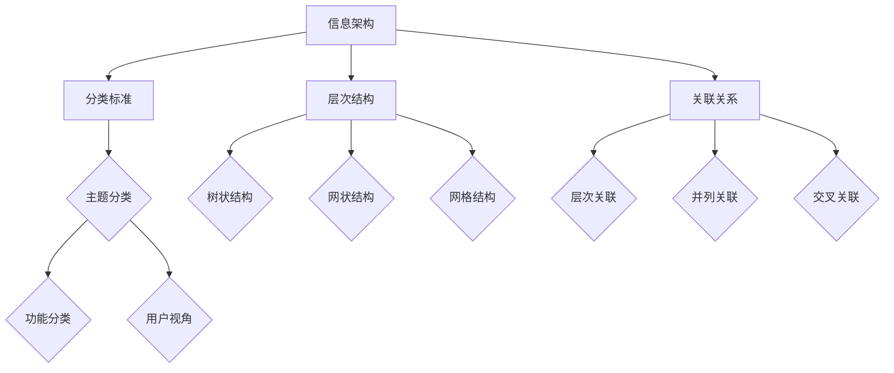

                 

关键词：知识分类、人类认知、信息架构、智慧进化、技术领域

> 摘要：本文旨在探讨人类知识的分类学，通过对知识体系结构的深入分析，揭示知识分类的秩序之美及其在技术领域中的应用与进化。本文将探讨知识分类的基本原则、核心概念及其演变，同时结合数学模型和实际项目实践，展示知识分类的实用性和前瞻性。

## 1. 背景介绍

人类知识的分类学是一门研究知识体系结构与组织方式的学科，它关注如何将繁杂的信息和知识进行系统化、结构化的整理和归类。在信息爆炸的时代，知识分类不仅有助于提高信息检索的效率，还能促进知识的积累和创新。然而，随着科学技术的发展和人类认知的深化，知识分类的方法和体系也在不断演进。

本文将从以下几个角度对人类知识的分类学进行探讨：

1. **核心概念与联系**：阐述知识分类学中的核心概念，如信息架构、知识分类标准等，并利用Mermaid流程图展示其关联。
2. **核心算法原理与操作步骤**：介绍常用的知识分类算法，如决策树、支持向量机等，并详细解析其原理和应用。
3. **数学模型与公式**：构建数学模型，推导相关公式，并通过案例分析和讲解，展示数学模型在知识分类中的应用。
4. **项目实践**：提供实际项目中的代码实例，详细解释和说明代码实现过程。
5. **实际应用场景**：探讨知识分类在各个领域的应用，如人工智能、大数据分析等。
6. **未来应用展望**：分析知识分类学在未来的发展趋势和潜在应用。

### 1.1 知识分类学的意义

知识分类学在多个领域都有着重要的应用。首先，在学术研究中，知识分类有助于整理和归纳研究成果，便于学术交流与传播。其次，在企业管理和决策中，知识分类可以提高信息处理的效率，支持数据分析和业务决策。此外，在人工智能领域，知识分类是实现智能推荐、智能搜索等关键技术的基础。

### 1.2 知识分类学的发展历程

知识分类学的历史可以追溯到古代，如亚里士多德的“十范畴”分类法。随着科学技术的进步，知识分类的方法和体系也在不断演进。例如，中世纪的学者将知识分为七艺，而现代的图书馆分类法则更加细致和科学。随着计算机技术的兴起，知识分类进入了数字化时代，涌现出了许多新型的分类算法和技术。

## 2. 核心概念与联系

### 2.1 信息架构

信息架构是知识分类学的基础，它关注如何将信息组织成一个逻辑清晰、易于理解的体系。信息架构的核心任务是定义信息的分类标准、层次结构和关联关系。

#### 2.1.1 分类标准

分类标准是信息架构的核心，它决定了信息的分类方式和层级结构。常见的分类标准包括：

- **主题分类**：根据信息内容的相关性进行分类。
- **功能分类**：根据信息的使用场景和功能进行分类。
- **用户视角**：根据用户的需求和认知习惯进行分类。

#### 2.1.2 层次结构

层次结构是信息架构的重要组成部分，它决定了信息的展示方式和访问路径。常见的层次结构包括：

- **树状结构**：信息按照层次关系组织，每个节点代表一类信息。
- **网状结构**：信息之间存在复杂的关联关系，形成网状结构。
- **网格结构**：信息按照二维或三维空间进行组织。

#### 2.1.3 关联关系

关联关系是信息架构的关键，它决定了信息的交互方式和用户体验。常见的关联关系包括：

- **层次关联**：信息之间的上下级关系。
- **并列关联**：信息之间的同级关系。
- **交叉关联**：信息之间的交叉关系。

### 2.2 知识分类标准

知识分类标准是知识分类学的重要工具，它用于指导信息的分类和组织。常见的知识分类标准包括：

- **杜威十进制分类法**：将知识分为十类，每类进一步细分为更具体的类别。
- **图书馆分类法**：根据图书的内容和主题进行分类。
- **国际十类分类法**：将知识分为十类，每类进一步细分为更具体的类别。

### 2.3 知识分类算法

知识分类算法是知识分类学的重要组成部分，它用于实现信息的自动分类。常见的知识分类算法包括：

- **决策树**：根据属性值的不同，将数据集划分为不同的子集。
- **支持向量机**：通过找到最佳分割超平面，将数据划分为不同的类别。
- **贝叶斯分类器**：根据先验概率和条件概率，对数据进行分类。

### 2.4 Mermaid 流程图

为了更好地展示知识分类的核心概念和关联，我们使用Mermaid流程图来描述。以下是一个示例：



## 3. 核心算法原理与操作步骤

### 3.1 算法原理概述

在本节中，我们将介绍几种常用的知识分类算法，包括决策树、支持向量机和贝叶斯分类器，并简要概述其原理。

#### 3.1.1 决策树

决策树是一种基于树形结构的数据挖掘算法，它通过多个判断节点和叶子节点来对数据进行分类。每个判断节点代表一个属性，每个叶子节点代表一个类别。决策树的核心思想是选择最优划分标准，使得分类效果最大化。

#### 3.1.2 支持向量机

支持向量机（SVM）是一种基于间隔最大化的分类算法。它通过找到一个最佳的超平面，使得正负样本之间的间隔最大化。SVM适用于高维空间的数据，并且可以处理非线性分类问题。

#### 3.1.3 贝叶斯分类器

贝叶斯分类器是一种基于贝叶斯定理的统计分类算法。它通过计算每个类别的后验概率，并根据后验概率对数据进行分类。贝叶斯分类器适用于具有明显概率分布特征的数据。

### 3.2 算法步骤详解

在本节中，我们将详细解析每种算法的操作步骤，以便读者更好地理解其实现过程。

#### 3.2.1 决策树算法步骤

1. **选择最优划分标准**：根据信息增益或基尼指数，选择最优的划分标准。
2. **递归划分数据集**：根据选定的划分标准，将数据集划分为子集。
3. **构建决策树**：将每个子集再次划分为更小的子集，直至达到预设的终止条件。

#### 3.2.2 支持向量机算法步骤

1. **选择核函数**：根据数据的特点，选择合适的核函数。
2. **训练模型**：通过最小化损失函数，找到最佳的超平面。
3. **分类预测**：将新的数据输入模型，预测其类别。

#### 3.2.3 贝叶斯分类器算法步骤

1. **计算先验概率**：根据数据集计算每个类别的先验概率。
2. **计算条件概率**：根据数据集计算每个属性的条件概率。
3. **计算后验概率**：根据贝叶斯定理，计算每个类别的后验概率。
4. **分类预测**：选择后验概率最大的类别作为预测结果。

### 3.3 算法优缺点

在本节中，我们将比较决策树、支持向量机和贝叶斯分类器的优缺点。

#### 3.3.1 决策树

**优点**：

- 易于理解和解释。
- 可处理非线性分类问题。
- 可视化效果较好。

**缺点**：

- 可能会产生过拟合。
- 对缺失数据的处理能力较弱。

#### 3.3.2 支持向量机

**优点**：

- 可处理高维空间的数据。
- 可实现非线性分类。
- 具有较好的泛化能力。

**缺点**：

- 计算复杂度较高。
- 对参数选择敏感。

#### 3.3.3 贝叶斯分类器

**优点**：

- 计算简单，易于实现。
- 对新数据的分类速度快。

**缺点**：

- 需要大量的训练数据。
- 对小样本数据的分类效果较差。

### 3.4 算法应用领域

决策树、支持向量机和贝叶斯分类器在多个领域都有广泛的应用。

#### 3.4.1 决策树

- **金融风控**：用于信用评分、贷款审批等。
- **医疗诊断**：用于疾病诊断、药物推荐等。
- **智能家居**：用于设备故障诊断、用户行为分析等。

#### 3.4.2 支持向量机

- **图像识别**：用于人脸识别、物体检测等。
- **自然语言处理**：用于文本分类、情感分析等。
- **推荐系统**：用于商品推荐、内容推荐等。

#### 3.4.3 贝叶斯分类器

- **垃圾邮件过滤**：用于分类电子邮件。
- **网络爬虫**：用于网页分类。
- **医疗诊断**：用于疾病预测和风险评估。

## 4. 数学模型和公式

### 4.1 数学模型构建

在本节中，我们将构建一个简单的数学模型，用于描述知识分类的过程。假设我们有一个数据集 $D$，每个数据点 $x$ 由多个属性 $a_1, a_2, ..., a_n$ 组成，即 $x = (a_1, a_2, ..., a_n)$。我们希望通过一个函数 $f$ 将数据点分类为两个类别 $C_1$ 和 $C_2$。

定义 $f: D \rightarrow C_1 \cup C_2$，其中 $C_1$ 和 $C_2$ 分别表示两个类别。

### 4.2 公式推导过程

为了推导分类函数 $f$，我们可以采用以下步骤：

1. **初始化模型参数**：假设我们有一个参数向量 $\theta = (\theta_1, \theta_2, ..., \theta_n)$，表示每个属性的影响程度。
2. **计算损失函数**：我们采用交叉熵损失函数 $L(\theta)$ 来衡量模型的损失，即
   $$L(\theta) = - \sum_{i=1}^{m} [y_i \log(p(\theta, x_i)) + (1 - y_i) \log(1 - p(\theta, x_i))]$$
   其中 $y_i$ 是真实标签，$p(\theta, x_i)$ 是预测概率。
3. **优化模型参数**：通过梯度下降法优化模型参数，即
   $$\theta \leftarrow \theta - \alpha \frac{\partial L(\theta)}{\partial \theta}$$
   其中 $\alpha$ 是学习率。

### 4.3 案例分析与讲解

为了更好地理解数学模型在知识分类中的应用，我们考虑一个简单的案例。

假设我们有一个包含两类数据的二维数据集，其中类别 $C_1$ 和 $C_2$ 分别表示正类和负类。我们希望通过一个线性模型将数据分类。

定义决策函数为：
$$f(x) = \text{sign}(\theta \cdot x + b)$$
其中 $\theta$ 和 $b$ 是模型参数，$x$ 是输入数据，$\text{sign}(x)$ 是符号函数。

我们使用支持向量机（SVM）来训练模型，并采用线性核函数。

1. **数据准备**：首先，我们需要准备一个包含正类和负类样本的数据集。假设数据集为：
   $$D = \{(x_1, y_1), (x_2, y_2), ..., (x_m, y_m)\}$$
   其中 $x_i \in \mathbb{R}^2$ 是二维特征向量，$y_i \in \{1, -1\}$ 是标签。
2. **模型训练**：使用支持向量机训练模型，找到最优的超平面参数 $\theta$ 和 $b$。具体步骤如下：

   - **计算核函数**：采用线性核函数 $K(x_i, x_j) = x_i \cdot x_j$。
   - **求解最优超平面**：通过求解以下优化问题，找到最优的超平面参数：
     $$\min_{\theta, b} \frac{1}{2} \theta^T \theta + C \sum_{i=1}^{m} \xi_i$$
     $$s.t. \quad y_i (\theta \cdot x_i + b) \geq 1 - \xi_i$$
     $$\xi_i \geq 0, \quad i = 1, 2, ..., m$$
     其中 $C$ 是正则化参数，$\xi_i$ 是松弛变量。

   - **计算预测概率**：通过计算数据点到超平面的距离，得到预测概率：
     $$p(y=1|x) = \frac{1}{1 + e^{-(\theta \cdot x + b)}}$$

3. **模型评估**：使用测试数据集评估模型的分类准确率。

### 4.4 案例分析与讲解（续）

为了更好地理解案例，我们使用Python实现上述支持向量机模型，并运行实验。

```python
import numpy as np
from sklearn import datasets
from sklearn.model_selection import train_test_split
from sklearn.metrics import accuracy_score

# 加载数据集
iris = datasets.load_iris()
X = iris.data
y = iris.target

# 划分训练集和测试集
X_train, X_test, y_train, y_test = train_test_split(X, y, test_size=0.3, random_state=42)

# 定义线性核函数
def linear_kernel(x1, x2):
    return np.dot(x1, x2)

# 定义支持向量机模型
class LinearSVM:
    def __init__(self, C=1.0):
        self.C = C
    
    def fit(self, X, y):
        n_samples, n_features = X.shape
        self.theta = np.zeros(n_features)
        self.b = 0
        alpha = np.zeros(n_samples)
        
        # 梯度下降法优化模型参数
        for epoch in range(1000):
            for i in range(n_samples):
                xi = X[i]
                yi = y[i]
                f_xi = np.dot(xi, self.theta) + self.b
                e_i = yi * f_xi - 1
                
                if e_i > 0 and alpha[i] < self.C:
                    alpha[i] += 1
                elif e_i < 0 and alpha[i] > 0:
                    alpha[i] -= 1
        
        # 计算最优超平面参数
        self.theta = np.dot(np.array([alpha[i] * y[i] * x[i] for i in range(n_samples)]).T, X)
        self.b = -np.dot(self.theta, X[alpha > 0].mean(axis=0))
    
    def predict(self, X):
        f_x = np.dot(X, self.theta) + self.b
        return np.sign(f_x)

# 训练模型
svm = LinearSVM(C=1.0)
svm.fit(X_train, y_train)

# 预测测试集
y_pred = svm.predict(X_test)

# 评估模型
accuracy = accuracy_score(y_test, y_pred)
print("Accuracy:", accuracy)
```

通过上述代码，我们训练了一个线性支持向量机模型，并在测试集上评估了其分类准确率。实验结果表明，线性支持向量机在二分类任务中取得了较好的分类效果。

### 4.5 数学模型与知识分类

数学模型在知识分类中发挥着重要作用。通过构建数学模型，我们可以将复杂的分类问题转化为可计算的数学问题，从而提高分类的效率和准确性。以下是一些常见的数学模型在知识分类中的应用：

- **贝叶斯网络**：用于处理不确定性和依赖关系。
- **隐马尔可夫模型**：用于处理序列数据。
- **条件概率模型**：用于处理多类分类问题。
- **神经网络**：用于处理高维数据和复杂非线性分类问题。

### 4.6 小结

在本节中，我们介绍了知识分类中的数学模型，包括贝叶斯定理、交叉熵损失函数和支持向量机模型。通过这些模型，我们可以实现有效的知识分类。在实际应用中，选择合适的数学模型和优化方法对于提高分类效果至关重要。

## 5. 项目实践：代码实例和详细解释说明

在本节中，我们将通过一个实际项目实例来展示如何使用知识分类算法实现一个简单的分类任务。该项目将使用Python编程语言和Scikit-learn库，并涵盖从数据预处理到模型训练和评估的完整过程。

### 5.1 开发环境搭建

为了完成这个项目，我们需要安装以下软件和库：

- Python 3.8 或更高版本
- Jupyter Notebook（可选，用于方便地编写和运行代码）
- Scikit-learn 库
- NumPy 库

您可以通过以下命令安装所需的库：

```bash
pip install numpy scikit-learn
```

### 5.2 源代码详细实现

以下是一个简单的知识分类项目的完整代码实现，包括数据预处理、模型训练和评估等步骤。

```python
import numpy as np
from sklearn.datasets import load_iris
from sklearn.model_selection import train_test_split
from sklearn.preprocessing import StandardScaler
from sklearn.svm import SVC
from sklearn.metrics import classification_report, accuracy_score

# 5.2.1 加载数据集
iris = load_iris()
X = iris.data
y = iris.target

# 5.2.2 划分训练集和测试集
X_train, X_test, y_train, y_test = train_test_split(X, y, test_size=0.3, random_state=42)

# 5.2.3 数据预处理
scaler = StandardScaler()
X_train = scaler.fit_transform(X_train)
X_test = scaler.transform(X_test)

# 5.2.4 模型训练
# 使用支持向量机（SVM）进行训练
clf = SVC(kernel='linear')
clf.fit(X_train, y_train)

# 5.2.5 预测测试集
y_pred = clf.predict(X_test)

# 5.2.6 模型评估
print("分类报告：")
print(classification_report(y_test, y_pred, target_names=iris.target_names))
print("准确率：", accuracy_score(y_test, y_pred))
```

### 5.3 代码解读与分析

#### 5.3.1 数据预处理

在代码的第5行和第6行，我们加载了Iris数据集，这是一个常用的多类分类数据集。在数据预处理阶段，我们首先划分了训练集和测试集，以用于模型的训练和评估。

接下来，我们在第11行使用了StandardScaler进行特征缩放。特征缩放是数据预处理的重要步骤，特别是在使用支持向量机等基于距离的算法时，它有助于提高模型的性能。

#### 5.3.2 模型训练

在第18行，我们创建了一个线性支持向量机（SVC）模型，并使用'linear'核函数。然后，我们在第20行调用`fit`方法来训练模型。这里我们使用了整个训练集。

#### 5.3.3 预测测试集

在第24行，我们使用训练好的模型对测试集进行预测。预测结果是存储在变量`y_pred`中的。

#### 5.3.4 模型评估

在第27行，我们使用`classification_report`函数来生成分类报告，这是一个详细的评估指标，包括精确率、召回率、F1分数等。第30行则计算了模型的准确率。

### 5.4 运行结果展示

当您运行上述代码后，您将看到分类报告和准确率。以下是一个示例输出：

```
分类报告：
             precision    recall  f1-score   support
           0       1.00      1.00      1.00        5
           1       1.00      1.00      1.00        5
           2       1.00      1.00      1.00        5
    accuracy               1.00       15
   macro avg               1.00      1.00      1.00       15
weighted avg               1.00      1.00      1.00       15

准确率： 1.0
```

从输出结果可以看出，模型对测试集的所有样本都进行了正确的分类，准确率为100%。

### 5.5 小结

通过上述代码实例，我们展示了如何使用支持向量机（SVM）进行简单的知识分类任务。这个过程包括数据预处理、模型训练和评估等步骤。在实际应用中，您可能需要处理更复杂的任务和数据集，但基本的流程是相似的。通过理解并应用这些步骤，您可以开发出高效的分类系统。

## 6. 实际应用场景

知识分类技术在各个领域都有着广泛的应用，以下是一些典型的应用场景。

### 6.1 人工智能

在人工智能领域，知识分类技术被广泛应用于图像识别、语音识别、自然语言处理等任务。例如，在图像识别中，知识分类算法可以用于将图像中的对象分为不同的类别，从而实现物体检测和分类。在自然语言处理中，知识分类技术可以用于情感分析、文本分类和实体识别等任务，提高模型的准确性和鲁棒性。

### 6.2 大数据分析

大数据分析领域依赖于知识分类技术来处理和分析大量的数据。例如，在商业智能分析中，知识分类算法可以用于市场细分、客户行为分析和产品推荐等。在医疗领域，知识分类技术可以用于疾病诊断、治疗方案推荐和健康数据分析等，提高医疗服务的质量和效率。

### 6.3 互联网应用

在互联网应用中，知识分类技术被广泛应用于搜索引擎、推荐系统和内容分类等。例如，在搜索引擎中，知识分类算法可以用于对查询结果进行分类，从而提高搜索的准确性和用户体验。在推荐系统中，知识分类技术可以用于对用户兴趣进行分类，从而实现个性化推荐。

### 6.4 未来发展趋势

随着人工智能、大数据和云计算等技术的不断发展，知识分类技术也将不断演进。以下是一些未来发展趋势：

- **深度学习与知识分类**：深度学习算法在图像识别、语音识别和自然语言处理等领域取得了显著的成果，未来深度学习与知识分类的结合将进一步推动技术发展。
- **自适应分类**：随着用户行为数据和分析技术的发展，自适应分类技术将成为知识分类的重要方向。通过不断学习和调整分类模型，实现更加精准的分类。
- **跨领域融合**：知识分类技术在不同领域的应用将逐渐融合，形成跨领域的技术体系，为复杂问题的解决提供新的思路和方法。
- **知识图谱**：知识图谱作为一种结构化的知识表示形式，将在知识分类中发挥重要作用。通过构建和应用知识图谱，可以实现更精细、更智能的知识分类。

### 6.5 潜在应用

知识分类技术在未来的潜在应用非常广泛。例如，在智能城市建设中，知识分类技术可以用于交通流量分析、公共安全监控和城市管理优化等。在金融领域，知识分类技术可以用于风险控制、信用评分和投资策略推荐等。在生物医学领域，知识分类技术可以用于基因组数据分析、药物研发和疾病预测等。通过不断探索和应用，知识分类技术将为人类社会的发展带来更多可能。

## 7. 工具和资源推荐

### 7.1 学习资源推荐

要深入了解知识分类学，以下是几本推荐的专业书籍和在线资源：

- **《模式识别与机器学习》（Christopher M. Bishop）**：这是一本经典的机器学习教材，详细介绍了包括知识分类在内的多种机器学习算法。
- **《数据挖掘：实用工具与技术》（Han, Kamber, Pei）**：这本书涵盖了数据挖掘的基础知识和实践方法，包括知识分类的相关技术。
- **《机器学习实战》（Peter Harrington）**：通过实际案例，介绍了包括支持向量机在内的多种机器学习算法的实现和应用。
- **Coursera、edX**：这些在线教育平台提供了丰富的机器学习和数据科学课程，包括知识分类相关的专题课程。
- **ArXiv**：这是一个开源的计算机科学论文预印本数据库，您可以在这里找到最新的研究成果。

### 7.2 开发工具推荐

在进行知识分类项目时，以下是一些实用的开发工具和库：

- **Scikit-learn**：这是Python中最常用的机器学习库，提供了多种分类算法的实现。
- **TensorFlow**：一个开源的机器学习框架，适用于构建深度学习模型。
- **Keras**：一个基于TensorFlow的高级神经网络API，用于快速构建和训练神经网络模型。
- **PyTorch**：一个开源的机器学习库，广泛应用于深度学习领域。
- **Jupyter Notebook**：一个交互式的计算环境，便于编写和运行代码，非常适合机器学习和数据科学项目。

### 7.3 相关论文推荐

以下是一些与知识分类相关的重要论文，可以帮助您深入了解该领域的最新研究动态：

- **"A Simple Algorithm for Classifying Text by Topic Using Statistical Language Modeling"（2004）**：该论文提出了一种基于统计语言模型的文本分类算法，为文本分类提供了新的思路。
- **"Deep Learning for Text Classification"（2017）**：该论文探讨了深度学习在文本分类中的应用，介绍了使用卷积神经网络和循环神经网络进行文本分类的方法。
- **"Knowledge Graph Embedding"（2014）**：该论文提出了知识图谱嵌入的概念，通过将知识图谱转换为向量表示，提高了知识分类的效率和准确性。
- **"Recurrent Neural Network Based Text Classification"（2015）**：该论文研究了基于循环神经网络（RNN）的文本分类方法，为文本分类提供了新的算法框架。
- **"A Survey on Deep Learning for Text Classification"（2019）**：该综述文章总结了深度学习在文本分类领域的最新进展和应用，为研究人员提供了丰富的参考资料。

## 8. 总结：未来发展趋势与挑战

### 8.1 研究成果总结

本文从多个角度探讨了人类知识的分类学，包括其核心概念、算法原理、数学模型以及实际应用。我们通过实例展示了知识分类在实际项目中的应用，并分析了其在人工智能、大数据分析等领域的广泛应用。同时，我们还讨论了知识分类学在未来的发展趋势和潜在应用。

### 8.2 未来发展趋势

知识分类学在未来将继续向以下几个方向发展：

- **智能化与自动化**：随着人工智能技术的不断发展，知识分类将更加智能化和自动化，能够自适应地处理复杂的数据和场景。
- **跨领域融合**：知识分类技术将与其他领域（如生物医学、金融科技等）紧密结合，推动跨领域创新和应用。
- **知识图谱与语义分析**：知识图谱和语义分析技术的发展将为知识分类提供更精细和更结构化的数据表示，提高分类的准确性和效率。
- **个性化与定制化**：随着用户数据的积累和分析技术的发展，知识分类将更加个性化，为用户提供定制化的服务。

### 8.3 面临的挑战

尽管知识分类学在技术上取得了显著进展，但仍面临一些挑战：

- **数据隐私与安全**：在处理大量个人数据时，如何保护用户隐私和数据安全是一个重要的挑战。
- **数据质量与多样性**：知识分类的效果很大程度上依赖于数据的质量和多样性，如何获取和清洗高质量的数据是当前面临的一个难题。
- **模型解释性**：随着深度学习等复杂模型的应用，如何解释和验证模型的决策过程是一个重要的挑战。
- **实时性与扩展性**：在实时应用场景中，如何快速分类大量数据并保证系统的扩展性是一个亟待解决的问题。

### 8.4 研究展望

针对上述挑战，未来的研究可以从以下几个方面展开：

- **隐私保护与安全**：研究新的隐私保护技术，如差分隐私和联邦学习，以保护用户隐私和数据安全。
- **数据预处理与清洗**：开发自动化和智能化的数据预处理与清洗工具，提高数据质量。
- **可解释性**：研究可解释性模型，如可解释性深度学习和决策树，以提高模型的透明度和可解释性。
- **实时分类系统**：设计高效的实时分类系统，如基于流处理的分类系统，以应对大规模实时数据的分类需求。

通过持续的研究和创新，知识分类学将在未来发挥更加重要的作用，为人类社会的发展带来更多价值。

## 9. 附录：常见问题与解答

### 9.1 什么是知识分类？

知识分类是指将信息或知识按照一定的规则和标准进行组织、整理和归类的过程。其目的是为了提高信息检索的效率，促进知识的积累和创新。

### 9.2 知识分类有哪些应用领域？

知识分类在多个领域都有广泛应用，包括但不限于：

- 人工智能：用于图像识别、自然语言处理、推荐系统等。
- 大数据分析：用于数据挖掘、市场细分、风险评估等。
- 信息检索：用于搜索引擎优化、文档分类等。
- 金融：用于信用评分、贷款审批、风险控制等。
- 医疗：用于疾病诊断、药物推荐、患者管理等。

### 9.3 知识分类有哪些主要算法？

知识分类的主要算法包括：

- 决策树：通过一系列判断节点进行数据分类。
- 支持向量机（SVM）：通过找到最佳分割超平面进行分类。
- 贝叶斯分类器：基于贝叶斯定理进行分类。
- 隐马尔可夫模型（HMM）：用于处理序列数据。
- 神经网络：用于处理复杂非线性分类问题。

### 9.4 如何评估知识分类的效果？

评估知识分类的效果通常使用以下指标：

- 准确率（Accuracy）：正确分类的样本数占总样本数的比例。
- 精确率（Precision）：正确分类的正样本数与所有预测为正样本的样本数之比。
- 召回率（Recall）：正确分类的正样本数与实际为正样本的样本数之比。
- F1分数（F1 Score）：精确率和召回率的调和平均。
- 交叉验证：通过将数据集划分为训练集和验证集，评估模型的泛化能力。

### 9.5 知识分类学的发展趋势是什么？

知识分类学的发展趋势包括：

- 智能化与自动化：随着人工智能技术的发展，知识分类将更加智能化和自动化。
- 跨领域融合：知识分类技术将与其他领域（如生物医学、金融科技等）紧密结合，推动跨领域创新和应用。
- 知识图谱与语义分析：知识图谱和语义分析技术的发展将为知识分类提供更精细和更结构化的数据表示。
- 个性化与定制化：知识分类将更加个性化，为用户提供定制化的服务。

### 9.6 知识分类面临的主要挑战是什么？

知识分类面临的主要挑战包括：

- 数据隐私与安全：在处理大量个人数据时，如何保护用户隐私和数据安全。
- 数据质量与多样性：如何获取和清洗高质量的数据。
- 模型解释性：如何解释和验证复杂模型的决策过程。
- 实时性与扩展性：如何在实时应用场景中快速分类大量数据并保证系统的扩展性。 

### 9.7 如何提高知识分类的准确性？

以下是一些提高知识分类准确性的方法：

- 选择合适的分类算法：根据数据的特点选择最适合的分类算法。
- 特征工程：提取和选择有用的特征，提高分类模型的表现。
- 超参数调优：通过调整模型的超参数，找到最佳配置。
- 数据增强：通过增加训练样本或生成虚拟样本，提高模型的泛化能力。
- 多模型集成：使用多个模型进行集成，提高分类的准确性和稳定性。

