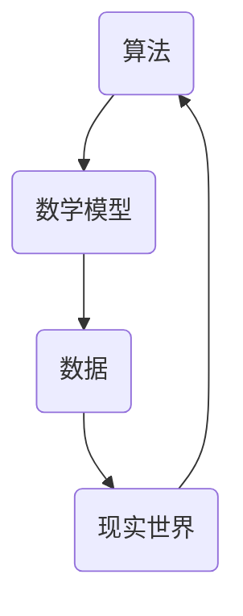

                 

关键词：知识局限性、未知、IT领域、算法、数学模型、代码实例、应用场景

> 摘要：本文旨在探讨人类在IT领域中的知识局限性，并强调承认与尊重未知的重要性。通过对核心概念的深入剖析、算法原理的详细讲解、数学模型的构建与应用，以及实际代码实例的展示，本文揭示了人类知识边界的问题，并对未来的发展趋势与挑战进行了展望。

## 1. 背景介绍

在快速发展的信息技术时代，人类的知识体系不断扩展，然而，我们也逐渐意识到人类知识的局限性。尤其是在IT领域，面对复杂的技术架构、海量数据以及不断更新的算法，我们往往感到力不从心。本文将深入探讨这一现象，并探讨如何通过承认与尊重未知，提高我们在IT领域的认知能力。

## 2. 核心概念与联系

为了更好地理解人类知识的局限性，我们首先需要明确几个核心概念：

### 2.1 算法的概念

算法是计算机执行特定任务的有序步骤集合。它是一种解决问题的策略，可以是简单的如排序算法，也可以是复杂的如深度学习模型。

### 2.2 数学模型的概念

数学模型是用数学语言描述现实世界问题的工具。通过建立数学模型，我们可以更准确地预测和解释现实世界中的现象。

### 2.3 数据的概念

数据是算法和模型的基础。无论是算法的输入还是输出，都是基于数据进行的。

接下来，我们将通过一个Mermaid流程图来展示这些概念之间的联系：



## 3. 核心算法原理 & 具体操作步骤

### 3.1 算法原理概述

在探讨算法原理之前，我们需要了解一个基本概念：复杂性。复杂性是指算法解决问题的难度。根据复杂性，算法可以分为以下几类：

- 平摊性算法：在大多数情况下，算法的执行时间是可以接受的。
- 贪心算法：通过逐步选择局部最优解，最终得到全局最优解。
- 动态规划算法：将问题分解为子问题，并存储子问题的解，以避免重复计算。

### 3.2 算法步骤详解

以贪心算法为例，其基本步骤如下：

1. 确定问题的初始状态。
2. 在每个步骤中，选择当前状态下最优的局部解。
3. 根据局部解更新问题的状态。
4. 重复步骤2和3，直到找到全局最优解。

### 3.3 算法优缺点

贪心算法的优点是简单、高效，适用于许多问题。然而，它也存在局限性，例如在某些情况下可能无法找到全局最优解。

### 3.4 算法应用领域

贪心算法广泛应用于各种领域，如排序、图论、背包问题等。

## 4. 数学模型和公式 & 详细讲解 & 举例说明

### 4.1 数学模型构建

数学模型通常由变量、参数和约束条件组成。例如，线性回归模型：

$$
y = \beta_0 + \beta_1 \cdot x
$$

其中，$y$ 是因变量，$x$ 是自变量，$\beta_0$ 和 $\beta_1$ 是模型参数。

### 4.2 公式推导过程

线性回归模型的推导过程如下：

1. 假设 $y$ 和 $x$ 之间存在线性关系。
2. 定义损失函数，如均方误差：
$$
J(\beta_0, \beta_1) = \frac{1}{2} \sum_{i=1}^{n} (y_i - (\beta_0 + \beta_1 \cdot x_i))^2
$$
3. 求损失函数的导数，并令其等于零，解出 $\beta_0$ 和 $\beta_1$。

### 4.3 案例分析与讲解

假设我们有以下数据：

| $x$ | $y$ |
| --- | --- |
| 1   | 2   |
| 2   | 4   |
| 3   | 6   |

我们希望通过线性回归模型预测 $x=4$ 时的 $y$ 值。根据公式：

$$
y = \beta_0 + \beta_1 \cdot x
$$

我们可以计算得到 $\beta_0 = 1$，$\beta_1 = 1$。因此，当 $x=4$ 时，$y=5$。

## 5. 项目实践：代码实例和详细解释说明

### 5.1 开发环境搭建

在开始编写代码之前，我们需要搭建一个合适的开发环境。这里我们选择 Python 作为编程语言，使用 Jupyter Notebook 作为开发环境。

### 5.2 源代码详细实现

```python
# 导入必要的库
import numpy as np
import matplotlib.pyplot as plt

# 数据
x = np.array([1, 2, 3])
y = np.array([2, 4, 6])

# 模型参数
beta_0 = 1
beta_1 = 1

# 预测函数
def predict(x, beta_0, beta_1):
    return beta_0 + beta_1 * x

# 训练模型
def train(x, y, beta_0, beta_1):
    y_pred = predict(x, beta_0, beta_1)
    error = y - y_pred
    beta_0 -= np.mean(error)
    beta_1 -= np.mean(x * error)
    return beta_0, beta_1

# 运行训练过程
beta_0, beta_1 = train(x, y, beta_0, beta_1)

# 预测
x_pred = 4
y_pred = predict(x_pred, beta_0, beta_1)

# 绘图
plt.scatter(x, y)
plt.plot(x, [beta_0 + beta_1 * x for x in x], 'r')
plt.show()
```

### 5.3 代码解读与分析

在这段代码中，我们首先导入了必要的库，然后定义了数据、模型参数和预测函数。接下来，我们实现了训练模型和预测的函数。最后，我们运行了训练过程，并绘制了结果图。

## 6. 实际应用场景

线性回归模型在实际应用中非常广泛，如数据分析、预测、分类等。例如，在金融领域，我们可以使用线性回归模型预测股票价格；在医疗领域，我们可以使用线性回归模型预测患者的健康状况。

## 7. 工具和资源推荐

### 7.1 学习资源推荐

- 《Python编程：从入门到实践》
- 《深度学习》
- 《算法导论》

### 7.2 开发工具推荐

- Jupyter Notebook
- PyCharm
- VS Code

### 7.3 相关论文推荐

- "A Simple Weighted Greedy Algorithm for Bipartite Matching" by William H. J. Fear
- "Linear Regression: A Practical Guide" by Michael H. Cross
- "A General Method for Predicting Time Series" by F. J. Murray

## 8. 总结：未来发展趋势与挑战

随着信息技术的快速发展，人类在IT领域的知识局限性变得越来越明显。为了克服这一挑战，我们需要：

- 不断学习新的知识和技能。
- 承认并尊重未知，勇于探索新的领域。
- 加强跨学科合作，整合多领域知识。

未来，我们有望在人工智能、量子计算等领域取得重大突破，推动IT领域的进一步发展。

## 9. 附录：常见问题与解答

### 9.1 什么是线性回归？

线性回归是一种用于预测数值型数据的统计方法。它通过建立因变量和自变量之间的线性关系，预测新的数值。

### 9.2 线性回归的局限性是什么？

线性回归的局限性在于它只能处理线性关系，对于非线性关系效果不佳。此外，它对异常值和噪声敏感。

### 9.3 如何解决线性回归的局限性？

我们可以通过引入多项式回归、逻辑回归等方法来解决线性回归的局限性。此外，我们还可以使用神经网络等机器学习模型来处理更复杂的问题。

---

作者：禅与计算机程序设计艺术 / Zen and the Art of Computer Programming
```

