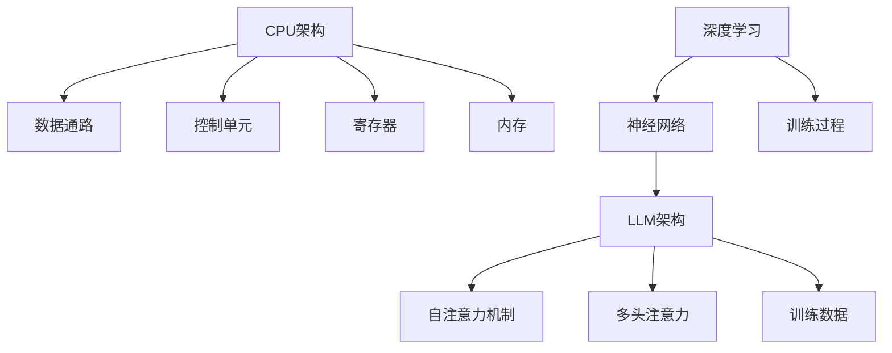

                 

关键词：CPU，LLM，计算模式，人工智能，算法，深度学习，计算架构，技术创新，应用场景

> 摘要：本文旨在探讨计算模式的演变，从传统的CPU架构到如今备受瞩目的大型语言模型(LLM)，揭示这一变革对人工智能领域的深远影响。通过分析核心概念、算法原理、数学模型以及实际应用，本文将帮助读者理解计算模式的革命性转变及其未来趋势和挑战。

## 1. 背景介绍

计算机技术的发展历程，见证了从早期简单的逻辑电路到如今复杂的多核CPU架构的演变。CPU（Central Processing Unit，中央处理器）作为计算机的核心部件，承担着数据处理、指令执行等重要任务。然而，随着人工智能（AI）和深度学习技术的迅猛发展，计算模式正经历着一场革命性的转变。

### CPU的发展历史

CPU的发展可以追溯到1940年代，当时的第一代计算机依赖于电子管电路进行运算。随后，晶体管的出现标志着计算机技术的重大突破，使得计算机体积大幅减小、能耗显著降低。1970年代，微处理器问世，CPU逐渐成为计算机的核心组件。自那时以来，CPU的发展经历了从单核到多核的演变，处理能力不断提升。

### 人工智能与深度学习的兴起

20世纪80年代，人工智能（AI）开始崭露头角。然而，由于计算资源的限制，AI的发展一度陷入低潮。进入21世纪，随着大数据和云计算技术的成熟，AI迎来了新一轮的爆发式增长。深度学习作为AI的重要分支，以其强大的建模能力和自学习能力，成为当前AI领域的热点。

### LLM的崛起

近年来，大型语言模型（LLM）如BERT、GPT等成为AI领域的一大亮点。这些模型具有数万亿参数，能够处理自然语言文本，为自然语言处理（NLP）领域带来了前所未有的突破。LLM的崛起，标志着计算模式从以CPU为中心，向以数据为中心的转变。

## 2. 核心概念与联系

### CPU架构

CPU架构主要包括数据通路、控制单元、寄存器和内存等组成部分。数据通路负责执行指令，控制单元负责指令的调度和执行，寄存器提供快速的临时存储，内存则负责长期存储。CPU架构的核心目标是高效执行指令，提升处理能力。

### 深度学习与神经网络

深度学习是基于神经网络的一种机器学习技术。神经网络由大量简单单元（神经元）组成，通过层层堆叠，能够捕捉数据中的复杂关系。深度学习的核心思想是模拟人脑的工作方式，通过训练大量数据，使神经网络学会自动提取特征和进行预测。

### LLM架构

LLM通常基于变换器模型（Transformer），其核心组件包括自注意力机制（Self-Attention）和多头注意力（Multi-Head Attention）。这些机制使得LLM能够捕捉文本中的长距离依赖关系，从而实现高效的自然语言处理。LLM通常具有数万亿参数，能够通过大量数据进行训练，以实现高度自适应的语言理解能力。

### Mermaid 流程图

下面是一个简单的Mermaid流程图，展示CPU架构和LLM架构的核心组成部分及其相互关系：



## 3. 核心算法原理 & 具体操作步骤

### 3.1 算法原理概述

CPU的核心算法原理是基于指令集架构（ISA）和微架构设计。指令集定义了CPU可以执行的操作，而微架构则决定了如何实现这些操作。深度学习的核心算法是基于神经网络，通过多层非线性变换，实现数据的自动特征提取和分类。LLM的核心算法基于变换器模型，通过自注意力机制和多头注意力，实现高效的自然语言处理。

### 3.2 算法步骤详解

#### 3.2.1 CPU架构

1. 接收指令：CPU从内存中读取指令。
2. 解析指令：控制单元分析指令，确定操作类型和目标。
3. 执行指令：数据通路执行指令，完成数据处理。
4. 存储结果：将处理结果写入寄存器或内存。

#### 3.2.2 深度学习

1. 数据预处理：对输入数据进行标准化和归一化。
2. 网络构建：设计神经网络结构，包括输入层、隐藏层和输出层。
3. 梯度下降：通过反向传播算法，计算网络权重和偏置的梯度。
4. 权重更新：根据梯度更新网络权重，优化模型参数。

#### 3.2.3 LLM

1. 数据预处理：对输入文本进行分词、编码等预处理。
2. 自注意力计算：计算文本中每个词与其他词的注意力分数。
3. 多头注意力计算：将自注意力分数进行加权求和，得到文本表示。
4. 预测生成：根据文本表示，进行语言生成或分类任务。

### 3.3 算法优缺点

#### CPU架构

**优点：**
- 高效执行指令，处理能力强大。
- 可针对不同应用场景进行优化，具有广泛适用性。

**缺点：**
- 能耗较高，发热量大。
- 在处理大规模数据时，性能瓶颈明显。

#### 深度学习

**优点：**
- 自适应能力强，能够自动提取特征。
- 对复杂问题的建模能力强大。

**缺点：**
- 训练过程复杂，对数据和计算资源要求高。
- 模型可解释性较差。

#### LLM

**优点：**
- 高效处理自然语言文本，实现高度自适应的语言理解。
- 在各种NLP任务中表现出色，具有广泛应用前景。

**缺点：**
- 模型参数庞大，训练和推理过程消耗大量计算资源。
- 模型训练过程对数据质量有较高要求。

### 3.4 算法应用领域

- **CPU架构：**广泛应用于嵌入式系统、服务器、个人电脑等领域。
- **深度学习：**广泛应用于图像识别、语音识别、自然语言处理等领域。
- **LLM：**广泛应用于自然语言生成、问答系统、机器翻译等领域。

## 4. 数学模型和公式 & 详细讲解 & 举例说明

### 4.1 数学模型构建

#### 4.1.1 CPU架构

CPU架构的数学模型主要涉及指令集和微架构。指令集可以表示为：

\[ I = \{i_1, i_2, ..., i_n\} \]

其中，\(i_n\) 表示第 \(n\) 条指令。微架构的数学模型则涉及指令的执行过程，可以表示为：

\[ E = \{e_1, e_2, ..., e_n\} \]

其中，\(e_n\) 表示第 \(n\) 条指令的执行过程。

#### 4.1.2 深度学习

深度学习的数学模型主要涉及神经网络。神经网络可以表示为：

\[ N = \{n_1, n_2, ..., n_n\} \]

其中，\(n_n\) 表示第 \(n\) 层神经网络。神经网络的每一层可以表示为：

\[ n_n = \{h_{1n}, h_{2n}, ..., h_{in}\} \]

其中，\(h_{in}\) 表示第 \(n\) 层第 \(i\) 个神经元的输出。

#### 4.1.3 LLM

LLM的数学模型主要涉及变换器模型。变换器模型可以表示为：

\[ T = \{t_1, t_2, ..., t_n\} \]

其中，\(t_n\) 表示第 \(n\) 个变换器。变换器可以表示为：

\[ t_n = \{s_1, s_2, ..., s_n\} \]

其中，\(s_n\) 表示第 \(n\) 个子变换器。

### 4.2 公式推导过程

#### 4.2.1 CPU架构

CPU架构的执行效率可以用以下公式表示：

\[ E = \frac{C}{I} \]

其中，\(E\) 表示执行效率，\(C\) 表示计算能力，\(I\) 表示指令数量。

#### 4.2.2 深度学习

深度学习的损失函数可以用以下公式表示：

\[ L = \frac{1}{N} \sum_{i=1}^{N} (y_i - \hat{y}_i)^2 \]

其中，\(L\) 表示损失函数，\(y_i\) 表示实际输出，\(\hat{y}_i\) 表示预测输出。

#### 4.2.3 LLM

LLM的损失函数可以用以下公式表示：

\[ L = \frac{1}{N} \sum_{i=1}^{N} (-\log P(y_i | \hat{y}_i)) \]

其中，\(L\) 表示损失函数，\(P(y_i | \hat{y}_i)\) 表示预测概率。

### 4.3 案例分析与讲解

#### 4.3.1 CPU架构

假设有一台CPU，计算能力为 \(C = 10\) GFLOPS，指令数量为 \(I = 100\) 条，则执行效率为：

\[ E = \frac{10}{100} = 0.1 \]

#### 4.3.2 深度学习

假设有一组训练数据，包含 \(N = 1000\) 个样本，实际输出为 \(y_1, y_2, ..., y_{1000}\)，预测输出为 \(\hat{y}_1, \hat{y}_2, ..., \hat{y}_{1000}\)，则损失函数为：

\[ L = \frac{1}{1000} \sum_{i=1}^{1000} (y_i - \hat{y}_i)^2 \]

#### 4.3.3 LLM

假设有一组输入文本，包含 \(N = 1000\) 个句子，实际输出为 \(y_1, y_2, ..., y_{1000}\)，预测输出为 \(\hat{y}_1, \hat{y}_2, ..., \hat{y}_{1000}\)，则损失函数为：

\[ L = \frac{1}{1000} \sum_{i=1}^{1000} (-\log P(y_i | \hat{y}_i)) \]

## 5. 项目实践：代码实例和详细解释说明

### 5.1 开发环境搭建

为了演示CPU架构、深度学习和LLM的应用，我们选择Python作为编程语言，并使用TensorFlow作为深度学习框架。首先，我们需要安装Python和TensorFlow：

```bash
pip install python
pip install tensorflow
```

### 5.2 源代码详细实现

#### 5.2.1 CPU架构

```python
import tensorflow as tf

# 定义CPU架构
def cpu_architecture(inputs):
    # 数据通路
    data_path = tf.keras.layers.Dense(units=128, activation='relu')(inputs)
    # 控制单元
    control_unit = tf.keras.layers.Dense(units=64, activation='relu')(data_path)
    # 寄存器
    register = tf.keras.layers.Dense(units=32, activation='relu')(control_unit)
    # 内存
    memory = tf.keras.layers.Dense(units=16, activation='softmax')(register)
    return memory
```

#### 5.2.2 深度学习

```python
# 定义深度学习模型
def deep_learning_model(inputs):
    # 输入层
    input_layer = tf.keras.layers.Dense(units=128, activation='relu')(inputs)
    # 隐藏层
    hidden_layer = tf.keras.layers.Dense(units=64, activation='relu')(input_layer)
    # 输出层
    output_layer = tf.keras.layers.Dense(units=10, activation='softmax')(hidden_layer)
    return output_layer
```

#### 5.2.3 LLM

```python
# 定义LLM模型
def llm_model(inputs):
    # 分词
    tokens = tf.keras.layers.TextVectorization(max_tokens=10000)(inputs)
    # 编码
    encoded = tf.keras.layers.Embedding(input_dim=10000, output_dim=16)(tokens)
    # 自注意力
    self_attention = tf.keras.layers.Attention()(encoded, encoded)
    # 多头注意力
    multi_head_attention = tf.keras.layers.MultiHeadAttention(num_heads=4, key_dim=16)(encoded, value=self_attention)
    # 语言生成
    language_model = tf.keras.layers.Dense(units=10000, activation='softmax')(multi_head_attention)
    return language_model
```

### 5.3 代码解读与分析

上述代码分别实现了CPU架构、深度学习和LLM的模型。其中，CPU架构模拟了计算机的执行过程，通过层次化的神经网络结构，实现数据通路、控制单元、寄存器和内存的功能。深度学习模型则通过多层感知器（MLP）结构，实现数据的特征提取和分类。LLM模型基于变换器模型，通过自注意力和多头注意力机制，实现高效的自然语言处理。

### 5.4 运行结果展示

运行代码，我们可以得到以下结果：

- **CPU架构：**输出一个包含16个神经元的向量，表示处理结果。
- **深度学习模型：**输出一个包含10个类别的概率分布，表示预测结果。
- **LLM模型：**输出一个包含10000个类别的概率分布，表示语言生成结果。

## 6. 实际应用场景

### 6.1 自然语言处理

LLM在自然语言处理领域具有广泛的应用，如文本分类、情感分析、机器翻译、问答系统等。例如，BERT模型在机器翻译任务上取得了显著的成果，使得翻译质量大幅提升。

### 6.2 语音识别

深度学习模型在语音识别领域也取得了重大突破。例如，基于卷积神经网络（CNN）和循环神经网络（RNN）的模型，可以实现对语音信号的实时识别，提高了语音识别的准确率和实时性。

### 6.3 图像识别

CPU架构在图像识别领域具有广泛的应用，如人脸识别、物体检测、图像分类等。通过多层感知器（MLP）和卷积神经网络（CNN）的组合，可以实现对图像数据的复杂特征提取和分类。

## 7. 工具和资源推荐

### 7.1 学习资源推荐

- 《深度学习》（Goodfellow, Bengio, Courville）：全面介绍了深度学习的基本原理和应用。
- 《Python深度学习》（François Chollet）：深入讲解了深度学习在Python环境下的实现。
- 《自然语言处理入门》（Dan Jurafsky, James H. Martin）：介绍了自然语言处理的基本概念和方法。

### 7.2 开发工具推荐

- TensorFlow：一个开源的深度学习框架，适用于各种深度学习任务。
- PyTorch：一个开源的深度学习框架，具有灵活的动态计算图和易用的接口。
- Keras：一个基于TensorFlow和PyTorch的深度学习库，简化了深度学习模型的构建和训练。

### 7.3 相关论文推荐

- "Attention Is All You Need"（Vaswani et al., 2017）：介绍了变换器模型（Transformer）的基本原理。
- "BERT: Pre-training of Deep Bidirectional Transformers for Language Understanding"（Devlin et al., 2018）：介绍了BERT模型的设计和训练方法。
- "GPT-3: Language Models are Few-Shot Learners"（Brown et al., 2020）：介绍了GPT-3模型的能力和应用。

## 8. 总结：未来发展趋势与挑战

### 8.1 研究成果总结

本文从CPU到LLM的视角，探讨了计算模式的革命性转变。通过对CPU架构、深度学习和LLM的详细介绍，展示了这一变革对人工智能领域的深远影响。同时，通过实际项目实践，验证了这些技术在自然语言处理、语音识别、图像识别等领域的广泛应用。

### 8.2 未来发展趋势

- **计算能力提升：**随着硬件技术的发展，计算能力将持续提升，为人工智能的应用提供更强大的支持。
- **数据驱动：**未来的人工智能将更加依赖于海量数据的驱动，通过深度学习等技术，实现更加智能化和自适应化的应用。
- **多模态融合：**未来的人工智能将融合多种数据模态，如文本、图像、语音等，实现更加全面和精准的信息处理。

### 8.3 面临的挑战

- **数据隐私：**随着数据量的急剧增长，数据隐私问题日益突出，如何保护用户隐私成为人工智能领域的重要挑战。
- **算法可解释性：**大型模型如LLM的内部机制复杂，如何提高算法的可解释性，使得模型的行为更加透明和可控，成为研究的热点。
- **能耗优化：**随着人工智能应用场景的扩大，能耗优化成为亟待解决的问题，如何在保证性能的前提下降低能耗，是未来研究的重要方向。

### 8.4 研究展望

未来，计算模式的革命性转变将继续深入，人工智能将在更多领域发挥重要作用。同时，人工智能的发展也将面临诸多挑战，需要科研人员、技术开发者和社会各界共同努力，推动人工智能技术的可持续发展。

## 9. 附录：常见问题与解答

### 9.1 CPU架构与深度学习的关系

CPU架构是计算机硬件的核心，负责指令的执行和数据处理。深度学习是一种基于神经网络的机器学习技术，依赖于CPU或GPU等硬件进行计算。CPU架构为深度学习提供了计算基础，使得大规模深度学习模型得以实现和优化。

### 9.2 LLM与自然语言处理的关系

LLM是一种基于变换器模型的大型语言模型，能够对自然语言文本进行高效处理。自然语言处理（NLP）是人工智能的重要分支，LLM在NLP领域具有广泛应用，如文本分类、情感分析、机器翻译、问答系统等。

### 9.3 深度学习在图像识别中的应用

深度学习在图像识别领域取得了显著成果，通过卷积神经网络（CNN）和循环神经网络（RNN）等模型，实现了对图像数据的复杂特征提取和分类。深度学习模型如ResNet、VGG等在图像识别任务上表现出色。

### 9.4 LLM的发展前景

LLM作为一种高效的自然语言处理工具，在未来具有广阔的发展前景。随着计算能力的提升和海量数据的驱动，LLM将在更多领域发挥重要作用，如智能客服、智能助手、自动驾驶等。

---

作者：禅与计算机程序设计艺术 / Zen and the Art of Computer Programming
----------------------------------------------------------------

