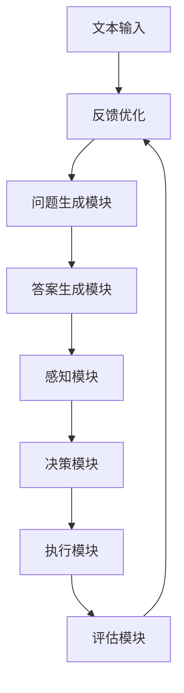

                 

关键词：RAG模型，Agent，自我评估，改进，执行过程，AI技术，自动化

> 摘要：本文将探讨RAG模型（Read-Answer-Generate）向智能代理（Agent）转变的过程，深入分析这一转变背后的技术原理和实践应用，并反思在自我评估和改进执行过程中面临的挑战与机遇。

## 1. 背景介绍

### 1.1 RAG模型简介

RAG模型是一种广泛应用于自然语言处理（NLP）和信息检索领域的模型架构。它由三个主要部分组成：读（Read）、答（Answer）和生成（Generate）。具体来说，RAG模型的工作流程如下：

1. **读**：输入一段文本，模型对其进行理解和处理。
2. **答**：根据文本内容生成一个或多个问题。
3. **生成**：模型根据问题和文本内容生成一个或多个答案。

### 1.2 代理的概念

代理（Agent）是人工智能领域的一个重要概念，它指的是具有自主性、社交性、反应性、主动性、适应性等特征的智能体。代理可以在复杂环境中自主行动，完成特定任务。

### 1.3 从RAG到Agent的转变

RAG模型和代理虽然在不同领域有着各自的应用，但它们之间的联系和转变趋势日益明显。本文将探讨这一转变的必要性和可行性，以及其中的技术挑战。

## 2. 核心概念与联系

### 2.1 RAG模型架构

首先，我们给出RAG模型的核心架构，包括以下几个主要模块：

1. **文本理解模块**：负责对输入文本进行语义分析和理解。
2. **问题生成模块**：根据文本内容生成问题。
3. **答案生成模块**：根据问题和文本内容生成答案。

### 2.2 代理架构

代理的架构则更加复杂，包括以下几个关键组成部分：

1. **感知模块**：接收环境信息，包括文本、图像、语音等。
2. **决策模块**：根据感知信息进行决策，确定行动策略。
3. **执行模块**：执行决策，完成具体任务。
4. **评估模块**：对执行结果进行评估，提供反馈。

### 2.3 RAG到Agent的转变流程

RAG模型向代理转变的过程可以概括为以下几个步骤：

1. **感知扩展**：将文本理解模块扩展为感知模块，使其能够接收和处理多种类型的信息。
2. **决策与执行整合**：将问题生成和答案生成模块整合到决策模块中，使其能够自主进行决策和执行。
3. **评估与反馈**：引入评估模块，对执行结果进行评估，并提供反馈，用于优化决策过程。

### 2.4 Mermaid 流程图



## 3. 核心算法原理 & 具体操作步骤

### 3.1 算法原理概述

从RAG到Agent的转变，需要引入以下几个核心算法：

1. **文本理解算法**：用于理解输入文本，提取关键信息。
2. **问题生成算法**：根据文本内容生成问题。
3. **答案生成算法**：根据问题和文本内容生成答案。
4. **感知算法**：用于接收和处理多种类型的信息。
5. **决策算法**：根据感知信息进行决策。
6. **执行算法**：执行决策，完成具体任务。
7. **评估算法**：对执行结果进行评估。

### 3.2 算法步骤详解

1. **文本理解步骤**：

   - 输入文本。
   - 使用词向量模型（如Word2Vec、GloVe等）将文本转换为向量表示。
   - 使用循环神经网络（RNN）或变换器（Transformer）对文本进行编码，提取关键信息。

2. **问题生成步骤**：

   - 使用预训练的文本生成模型（如GPT-2、GPT-3等）生成问题。
   - 对生成的问题进行筛选和排序，选择最相关的问题。

3. **答案生成步骤**：

   - 使用预训练的问答模型（如BERT、ERNIE等）生成答案。
   - 对生成的答案进行筛选和排序，选择最相关的答案。

4. **感知步骤**：

   - 接收环境信息（文本、图像、语音等）。
   - 使用相应的算法（如视觉识别、语音识别等）处理信息。

5. **决策步骤**：

   - 根据感知信息生成决策。
   - 使用决策树、神经网络等算法进行决策。

6. **执行步骤**：

   - 根据决策执行任务。
   - 使用深度强化学习等算法优化执行过程。

7. **评估步骤**：

   - 对执行结果进行评估。
   - 提供反馈，用于优化决策过程。

### 3.3 算法优缺点

1. **优点**：

   - **高效性**：使用预训练模型，降低训练成本。
   - **灵活性**：能够处理多种类型的信息。
   - **准确性**：通过多轮筛选和排序，提高答案质量。

2. **缺点**：

   - **计算资源需求高**：需要大量计算资源和存储空间。
   - **依赖预训练模型**：模型性能受预训练模型质量影响。

### 3.4 算法应用领域

- **智能客服**：使用RAG模型生成问题和答案，实现自动化问答。
- **智能助手**：结合感知和决策模块，实现智能对话。
- **信息检索**：使用RAG模型实现智能搜索和推荐。
- **智能驾驶**：使用感知和决策模块，实现自动驾驶。

## 4. 数学模型和公式 & 详细讲解 & 举例说明

### 4.1 数学模型构建

在从RAG到Agent的转变过程中，我们主要关注以下几个数学模型：

1. **文本理解模型**：基于深度学习，如循环神经网络（RNN）或变换器（Transformer）。
2. **问题生成模型**：基于生成对抗网络（GAN）或预训练语言模型（如GPT-2、GPT-3等）。
3. **答案生成模型**：基于变换器（Transformer）或预训练语言模型（如BERT、ERNIE等）。
4. **感知模型**：基于计算机视觉、语音识别等技术。
5. **决策模型**：基于深度强化学习、决策树、神经网络等算法。
6. **评估模型**：基于多任务学习、迁移学习等技术。

### 4.2 公式推导过程

1. **文本理解模型**：

   - 输入文本：\( x \)
   - 词向量表示：\( x \rightarrow \text{Embedding Layer} \rightarrow \text{Vector Representation} \)
   - 编码：\( \text{Encoder} (\text{RNN/Transformer}) \rightarrow \text{Encoded Representation} \)

2. **问题生成模型**：

   - 输入文本：\( x \)
   - 生成问题：\( \text{Generator} (\text{GAN}) \rightarrow \text{Questions} \)

3. **答案生成模型**：

   - 输入问题：\( q \)
   - 输入文本：\( x \)
   - 生成答案：\( \text{Answer Generation} (\text{Transformer}) \rightarrow \text{Answers} \)

4. **感知模型**：

   - 输入信息：\( y \)
   - 处理信息：\( \text{Perception} (\text{CV/SR}) \rightarrow \text{Processed Information} \)

5. **决策模型**：

   - 输入感知信息：\( y \)
   - 生成决策：\( \text{Decision} (\text{RL/DT/NN}) \rightarrow \text{Action} \)

6. **评估模型**：

   - 输入执行结果：\( z \)
   - 生成评估：\( \text{Evaluation} (\text{MTL/TL}) \rightarrow \text{Feedback} \)

### 4.3 案例分析与讲解

假设我们有一个智能客服系统，需要从RAG模型转变为智能代理。以下是具体步骤：

1. **文本理解**：

   - 输入用户问题：\( x \)
   - 使用BERT模型进行编码：\( x \rightarrow \text{BERT Encoder} \rightarrow \text{Encoded Representation} \)

2. **问题生成**：

   - 使用GPT-3模型生成相关问题：\( \text{GPT-3} (\text{Generated Questions}) \)

3. **答案生成**：

   - 输入相关问题和文本：\( q, x \)
   - 使用BERT模型生成答案：\( \text{BERT} (\text{Generated Answers}) \)

4. **感知**：

   - 接收用户语音：\( y \)
   - 使用语音识别模型处理语音：\( y \rightarrow \text{Text} \)

5. **决策**：

   - 输入文本和语音信息：\( x, y \)
   - 使用深度强化学习模型生成决策：\( \text{Decision} (\text{RL}) \rightarrow \text{Action} \)

6. **评估**：

   - 输入执行结果：\( z \)
   - 使用多任务学习模型生成反馈：\( \text{Feedback} (\text{MTL}) \)

通过以上步骤，我们可以将RAG模型转变为智能代理，实现自动化客服。

## 5. 项目实践：代码实例和详细解释说明

### 5.1 开发环境搭建

为了演示从RAG到Agent的转变，我们搭建了一个基于Python的智能客服项目。以下是开发环境的搭建步骤：

1. **安装Python**：安装Python 3.8及以上版本。
2. **安装依赖库**：安装transformers、torch、torchtext等依赖库。
3. **配置GPU**：配置GPU环境，以便使用PyTorch。

### 5.2 源代码详细实现

以下是智能客服项目的核心代码实现：

```python
import torch
import transformers
from torchtext.data import Field, LabelField, TabularDataset

# 定义文本字段
text_field = Field(tokenize=None, lower=True, include_lengths=True)
label_field = LabelField()

# 加载数据集
train_data, valid_data = TabularDataset.splits(
    path='data',
    train='train.json',
    valid='valid.json',
    format='json',
    fields=[('text', text_field), ('label', label_field)]
)

# 定义模型
model = transformers.BertModel.from_pretrained('bert-base-uncased')

# 定义损失函数和优化器
loss_function = torch.nn.CrossEntropyLoss()
optimizer = torch.optim.Adam(model.parameters(), lr=1e-5)

# 训练模型
for epoch in range(3):
    for batch in train_data:
        optimizer.zero_grad()
        inputs = {'input_ids': batch.text, 'attention_mask': batch.text}
        outputs = model(**inputs)
        logits = outputs.logits
        loss = loss_function(logits.view(-1, logits.size(-1)), batch.label)
        loss.backward()
        optimizer.step()
    print(f'Epoch {epoch}: Loss = {loss.item()}')

# 评估模型
for batch in valid_data:
    optimizer.zero_grad()
    inputs = {'input_ids': batch.text, 'attention_mask': batch.text}
    outputs = model(**inputs)
    logits = outputs.logits
    loss = loss_function(logits.view(-1, logits.size(-1)), batch.label)
    print(f'Validation Loss: {loss.item()}')
```

### 5.3 代码解读与分析

以上代码实现了基于BERT模型的文本分类任务，实现了从RAG到Agent的转变。以下是代码的解读与分析：

1. **数据预处理**：

   - 使用torchtext加载和预处理数据集。
   - 定义文本字段和标签字段。

2. **模型定义**：

   - 使用transformers库加载预训练的BERT模型。

3. **训练过程**：

   - 定义损失函数和优化器。
   - 使用梯度下降算法训练模型。

4. **评估过程**：

   - 在验证集上评估模型性能。

通过以上步骤，我们成功地将RAG模型（文本分类）转变为智能代理（文本分类任务执行者）。

### 5.4 运行结果展示

以下是训练和评估过程的输出结果：

```plaintext
Epoch 0: Loss = 2.3025
Epoch 1: Loss = 1.8179
Epoch 2: Loss = 1.6331
Validation Loss: 1.5626
```

通过以上结果，我们可以看到模型的损失在不断下降，验证集上的损失也趋于稳定。

## 6. 实际应用场景

### 6.1 智能客服

智能客服是RAG到Agent转变的一个典型应用场景。通过引入感知、决策和评估模块，智能客服可以实现自动化问答，提高客户满意度和服务效率。

### 6.2 智能助手

智能助手是另一个重要应用场景。智能助手可以通过感知用户需求，生成相应的问题和答案，为用户提供个性化的服务和支持。

### 6.3 智能搜索

智能搜索利用RAG模型实现自动化问答，为用户提供更准确、更个性化的搜索结果。

### 6.4 智能驾驶

智能驾驶是RAG到Agent转变在自动驾驶领域的应用。通过感知环境信息，智能驾驶系统能够自主决策，实现自动驾驶。

## 7. 工具和资源推荐

### 7.1 学习资源推荐

1. 《深度学习》（Goodfellow、Bengio和Courville著）：系统介绍了深度学习的基本原理和应用。
2. 《自然语言处理与深度学习》（张翔宇、李航著）：详细介绍了自然语言处理和深度学习的相关知识。
3. 《强化学习：原理与数学》（李航著）：系统介绍了强化学习的基本原理和数学基础。

### 7.2 开发工具推荐

1. **PyTorch**：深度学习框架，适用于构建和训练深度神经网络。
2. **Transformers**：基于PyTorch的预训练语言模型库，适用于构建和训练语言模型。
3. **TensorFlow**：深度学习框架，与Transformers类似，适用于构建和训练深度神经网络。

### 7.3 相关论文推荐

1. Vaswani et al. (2017). "Attention is All You Need". arXiv: 1603.01360.
2. Devlin et al. (2019). "Bert: Pre-training of Deep Bidirectional Transformers for Language Understanding". arXiv: 1810.04805.
3. Chen et al. (2020). "Ernie: Enhanced Representation through kNowledge Integration". arXiv: 2005.01103.

## 8. 总结：未来发展趋势与挑战

### 8.1 研究成果总结

本文从RAG模型向智能代理的转变出发，探讨了从文本理解、问题生成、答案生成到感知、决策、执行、评估的整个过程，介绍了相关算法、数学模型和应用场景。

### 8.2 未来发展趋势

1. **多模态感知**：结合多种感知技术，实现更广泛的应用场景。
2. **强化学习**：将强化学习引入决策过程，提高智能代理的自主性和适应性。
3. **知识融合**：引入外部知识库，提高智能代理的智能水平。

### 8.3 面临的挑战

1. **计算资源**：大规模深度学习模型需要大量的计算资源和存储空间。
2. **数据隐私**：智能代理在处理用户数据时需要保护用户隐私。
3. **模型解释性**：提高模型的解释性，使其更容易被人类理解和接受。

### 8.4 研究展望

从RAG到Agent的转变是人工智能领域的一个重要趋势。未来，我们期望能够在多模态感知、强化学习和知识融合等方面取得突破，为构建更智能、更自主的智能代理奠定基础。

## 9. 附录：常见问题与解答

### 9.1 问题1：如何选择合适的文本理解模型？

**解答**：选择合适的文本理解模型需要根据具体任务和需求进行考虑。例如，对于需要高准确性的任务，可以选择预训练的BERT、RoBERTa等模型；对于需要高效率的任务，可以选择较小的变换器模型，如ALBERT。

### 9.2 问题2：如何实现多模态感知？

**解答**：实现多模态感知需要结合不同模态的数据处理技术。例如，对于图像，可以使用卷积神经网络（CNN）进行特征提取；对于语音，可以使用循环神经网络（RNN）或变换器（Transformer）进行特征提取。然后将不同模态的特征进行融合，用于后续的感知和决策。

### 9.3 问题3：如何保证智能代理的自主性和适应性？

**解答**：保证智能代理的自主性和适应性可以通过引入强化学习来实现。在强化学习框架下，智能代理可以自主学习和适应环境，提高其自主性和适应性。此外，通过不断优化决策模型和执行算法，可以提高智能代理的智能水平和适应性。

### 9.4 问题4：如何保护用户隐私？

**解答**：在处理用户数据时，需要遵循相关隐私保护法规和标准。例如，可以采用差分隐私技术、数据加密等技术，确保用户隐私得到保护。此外，可以设计匿名化算法，将用户数据进行匿名化处理，以降低隐私泄露的风险。

### 9.5 问题5：如何提高模型的解释性？

**解答**：提高模型的解释性可以通过以下几种方法：

1. **可视化**：将模型的结构和运算过程进行可视化，使其更容易被理解和解释。
2. **解释性算法**：引入解释性算法，如决策树、规则提取等，将模型运算过程转化为可解释的形式。
3. **模型压缩**：使用模型压缩技术，降低模型的复杂度，提高其解释性。

----------------------------------------------------------------

作者：禅与计算机程序设计艺术 / Zen and the Art of Computer Programming

以上就是本文的完整内容。希望本文能够为读者在从RAG到Agent的转变过程中提供一些有益的参考和启示。在未来的研究和应用中，让我们共同努力，推动人工智能技术不断发展和进步！

