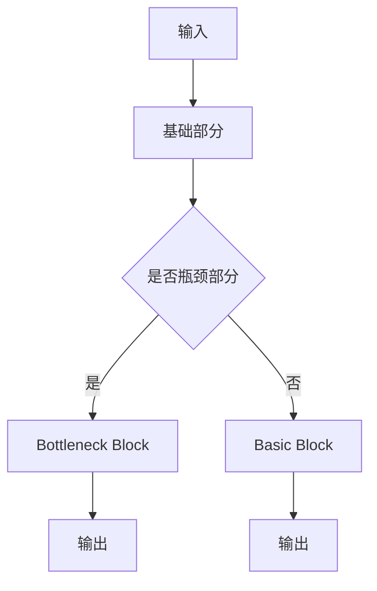

                 

## 1. 背景介绍

随着深度学习技术的不断发展，神经网络模型的规模和复杂性不断增加。大模型因其强大的表征能力和高效的泛化性能，逐渐成为人工智能领域的热点。在计算机视觉任务中，尤其是图像分类任务，大模型的性能优势尤为明显。本文旨在从零开始，详细介绍如何使用ResNet大模型进行CIFAR-10数据集的分类任务。

ResNet（残差网络）是由Microsoft Research团队在2015年提出的一种深层神经网络结构。它通过引入残差块，解决了深层网络训练过程中的梯度消失和梯度爆炸问题，使得深层网络的训练变得更加稳定和高效。CIFAR-10是一个常用的图像分类数据集，包含60000张32x32彩色图像，分为10个类别，每个类别6000张图像。

本文将分为以下几个部分：

1. **背景介绍**：介绍深度学习的发展背景、大模型的优势以及CIFAR-10数据集的相关信息。
2. **核心概念与联系**：讲解ResNet的核心概念及其在神经网络中的应用，并通过Mermaid流程图展示其结构。
3. **核心算法原理 & 具体操作步骤**：详细介绍ResNet的算法原理、操作步骤以及优缺点和应用领域。
4. **数学模型和公式 & 详细讲解 & 举例说明**：讲解ResNet的数学模型和公式，并通过实例进行说明。
5. **项目实践：代码实例和详细解释说明**：提供完整的代码实例，并对关键部分进行详细解释。
6. **实际应用场景**：讨论ResNet在现实世界中的应用场景以及未来的应用展望。
7. **工具和资源推荐**：推荐学习资源和开发工具。
8. **总结：未来发展趋势与挑战**：总结研究成果，展望未来发展趋势和面临的挑战。

通过本文的阅读，读者将能够了解ResNet大模型的原理和操作步骤，掌握如何使用ResNet进行图像分类任务，并了解其在实际应用中的前景。

## 2. 核心概念与联系

### 2.1 残差块

ResNet的核心是残差块（Residual Block），它通过引入“跳跃连接”来解决深层网络训练中的梯度消失问题。在残差块中，网络的输出不仅依赖于当前层的输入，还依赖于前一层的输入。这种跨层的连接方式被称为残差连接。

残差块的构建可以分为以下几个步骤：

1. **输入层**：输入一个维度为\( (N, C_{in}, H, W) \)的数据。
2. **第一部分卷积**：对输入数据进行卷积操作，卷积核大小为\( (1, 1) \)，步长为1，输出维度为\( (N, C_{out}, H, W) \)。
3. **第二部分卷积**：对上一步的输出进行卷积操作，卷积核大小为\( (3, 3) \)，步长为1，输出维度仍为\( (N, C_{out}, H, W) \)。
4. **第三部分卷积**：对上一步的输出进行卷积操作，卷积核大小为\( (1, 1) \)，步长为1，输出维度为\( (N, C_{out}, H, W) \)。
5. **跳跃连接**：将原始输入与第三部分卷积的输出进行加和操作。

通过这样的结构，残差块能够保留原始输入的信息，使得梯度在反向传播过程中能够更好地传播，从而解决深层网络训练中的梯度消失问题。

### 2.2 ResNet结构

ResNet的结构可以分为两个主要部分：基础部分（Basic Block）和瓶颈部分（Bottleneck Block）。

- **基础部分（Basic Block）**：基础部分由两个残差块组成，适用于较小的网络深度。每个残差块的输入和输出维度相同。
  
- **瓶颈部分（Bottleneck Block）**：瓶颈部分由三个残差块组成，中间卷积核的大小为\( (3, 3) \)，输入维度为\( C_{in} \)，输出维度为\( C_{out} \)。适用于较大的网络深度。

### 2.3 Mermaid流程图

以下是ResNet的Mermaid流程图：



在这个流程图中，输入层首先进入基础部分或瓶颈部分，然后经过一系列残差块的卷积操作，最终得到输出层。

### 2.4 小结

通过上述内容，我们可以看到ResNet的核心是残差块，它通过跳跃连接解决了深层网络训练中的梯度消失问题。ResNet的结构包括基础部分和瓶颈部分，适用于不同深度的网络。通过Mermaid流程图，我们可以直观地了解ResNet的工作原理和结构。

接下来，我们将进一步探讨ResNet的算法原理和具体操作步骤。

## 3. 核心算法原理 & 具体操作步骤

### 3.1 算法原理概述

ResNet的核心思想是引入残差块，通过跳跃连接来解决深层网络训练中的梯度消失问题。残差块通过跨层连接，使得网络的输出不仅依赖于当前层的输入，还依赖于前一层的输入。这种设计能够有效缓解梯度消失和梯度爆炸问题，使得深层网络的训练更加稳定和高效。

ResNet的结构包括基础部分（Basic Block）和瓶颈部分（Bottleneck Block）。基础部分由两个残差块组成，适用于较小的网络深度。瓶颈部分由三个残差块组成，中间卷积核的大小为\( (3, 3) \)，输入维度为\( C_{in} \)，输出维度为\( C_{out} \)。瓶颈部分适用于较大的网络深度。

### 3.2 算法步骤详解

1. **输入层**：输入一个维度为\( (N, C_{in}, H, W) \)的数据。

2. **第一部分卷积**：对输入数据进行卷积操作，卷积核大小为\( (1, 1) \)，步长为1，输出维度为\( (N, C_{out}, H, W) \)。

3. **第二部分卷积**：对上一步的输出进行卷积操作，卷积核大小为\( (3, 3) \)，步长为1，输出维度仍为\( (N, C_{out}, H, W) \)。

4. **第三部分卷积**：对上一步的输出进行卷积操作，卷积核大小为\( (1, 1) \)，步长为1，输出维度为\( (N, C_{out}, H, W) \)。

5. **跳跃连接**：将原始输入与第三部分卷积的输出进行加和操作。

6. **输出层**：将残差块的输出送入全连接层或卷积层进行分类或回归操作。

### 3.3 算法优缺点

**优点**：

1. **解决梯度消失和梯度爆炸问题**：通过跳跃连接，ResNet能够有效缓解深层网络训练中的梯度消失和梯度爆炸问题，使得深层网络的训练更加稳定和高效。
2. **提高网络深度**：ResNet允许构建更深的网络结构，提高了网络的表征能力。
3. **较少参数数量**：相较于传统深层网络，ResNet的参数数量较少，降低了计算复杂度和过拟合的风险。

**缺点**：

1. **计算复杂度较高**：由于跳跃连接和跨层连接的存在，ResNet的计算复杂度较高，训练速度较慢。
2. **需要大量数据**：ResNet对数据的依赖较大，需要大量数据进行训练，否则容易出现过拟合。

### 3.4 算法应用领域

ResNet在计算机视觉领域具有广泛的应用，尤其在图像分类任务中表现出色。除了CIFAR-10数据集外，ResNet还被广泛应用于其他图像分类数据集，如ImageNet等。此外，ResNet还可以应用于目标检测、图像分割等其他计算机视觉任务。

### 3.5 小结

通过上述内容，我们可以了解到ResNet的算法原理和具体操作步骤。ResNet通过引入残差块和跳跃连接，解决了深层网络训练中的梯度消失问题，提高了网络的深度和表征能力。尽管ResNet存在计算复杂度和对数据依赖等缺点，但其优秀的性能在图像分类任务中得到了广泛应用。

接下来，我们将进一步探讨ResNet的数学模型和公式，并通过实例进行详细讲解。

## 4. 数学模型和公式 & 详细讲解 & 举例说明

### 4.1 数学模型构建

ResNet的数学模型主要基于卷积神经网络（Convolutional Neural Network，CNN）的框架。CNN的基本操作包括卷积（Convolution）、激活函数（Activation Function）和池化（Pooling）。在ResNet中，这些操作被组合成残差块，以实现深层网络的构建。

#### 4.1.1 卷积操作

卷积操作可以表示为：

$$
\text{conv}(x, \text{W}) = \sum_{i=1}^{C_{out}} \text{W}_{i} \star x
$$

其中，\( x \)是输入数据，\( \text{W} \)是卷积核权重，\( C_{out} \)是输出通道数，\( \star \)表示卷积操作。

#### 4.1.2 激活函数

常见的激活函数包括ReLU（Rectified Linear Unit）和Sigmoid。在ResNet中，ReLU函数被广泛使用，因为它可以加快网络训练速度并避免梯度消失。

ReLU函数定义为：

$$
\text{ReLU}(x) = \max(0, x)
$$

#### 4.1.3 池化操作

池化操作用于减少数据的维度，常见的池化方式包括最大池化（Max Pooling）和平均池化（Average Pooling）。最大池化可以表示为：

$$
\text{max\_pool}(x, \text{f}, \text{p}) = \max_{i} (x_{i:i+\text{f},i:i+\text{f}})
$$

其中，\( x \)是输入数据，\( \text{f} \)是池化窗口的大小，\( \text{p} \)是步长。

### 4.2 公式推导过程

ResNet的核心是残差块，其数学模型可以表示为：

$$
\text{F}(x) = \text{ReLU}(\text{conv}_1(x)) + x
$$

其中，\( \text{F}(x) \)是残差块的输出，\( \text{conv}_1(x) \)是第一部分卷积操作的输出。

接下来，我们进一步推导第二部分和第三部分卷积操作的公式。

第二部分卷积操作的公式为：

$$
\text{F}(x) = \text{ReLU}(\text{conv}_2(\text{ReLU}(\text{conv}_1(x))) + x
$$

其中，\( \text{conv}_2(x) \)是第二部分卷积操作的输出。

第三部分卷积操作的公式为：

$$
\text{F}(x) = \text{ReLU}(\text{conv}_3(\text{ReLU}(\text{conv}_2(\text{ReLU}(\text{conv}_1(x))))) + x
$$

其中，\( \text{conv}_3(x) \)是第三部分卷积操作的输出。

### 4.3 案例分析与讲解

为了更好地理解ResNet的数学模型，我们来看一个简单的案例。假设我们有一个输入数据\( x \)的维度为\( (32, 32, 3) \)，我们需要将其通过一个ResNet残差块进行转换，输出维度为\( (32, 32, 64) \)。

首先，我们进行第一部分卷积操作，卷积核大小为\( (1, 1) \)，步长为1，输出通道数为64。假设卷积核权重为\( \text{W}_1 \)，则第一部分卷积操作的输出为：

$$
\text{conv}_1(x) = \sum_{i=1}^{64} \text{W}_{1i} \star x
$$

然后，我们对第一部分卷积操作的输出进行ReLU激活函数操作，得到：

$$
\text{ReLU}(\text{conv}_1(x)) = \max(0, \text{conv}_1(x))
$$

接下来，我们进行第二部分卷积操作，卷积核大小为\( (3, 3) \)，步长为1，输出通道数为64。假设卷积核权重为\( \text{W}_2 \)，则第二部分卷积操作的输出为：

$$
\text{conv}_2(\text{ReLU}(\text{conv}_1(x))) = \sum_{i=1}^{64} \text{W}_{2i} \star (\text{ReLU}(\text{conv}_1(x)))
$$

然后，我们对第二部分卷积操作的输出进行ReLU激活函数操作，得到：

$$
\text{ReLU}(\text{conv}_2(\text{ReLU}(\text{conv}_1(x)))) = \max(0, \text{conv}_2(\text{ReLU}(\text{conv}_1(x))))
$$

最后，我们进行第三部分卷积操作，卷积核大小为\( (1, 1) \)，步长为1，输出通道数为64。假设卷积核权重为\( \text{W}_3 \)，则第三部分卷积操作的输出为：

$$
\text{conv}_3(\text{ReLU}(\text{conv}_2(\text{ReLU}(\text{conv}_1(x))))) = \sum_{i=1}^{64} \text{W}_{3i} \star (\text{ReLU}(\text{conv}_2(\text{ReLU}(\text{conv}_1(x)))))
$$

将第三部分卷积操作的输出与输入数据进行加和操作，得到残差块的输出：

$$
\text{F}(x) = \text{ReLU}(\text{conv}_3(\text{ReLU}(\text{conv}_2(\text{ReLU}(\text{conv}_1(x)))))) + x
$$

最终，我们得到一个维度为\( (32, 32, 64) \)的输出数据。

通过这个案例，我们可以看到ResNet的数学模型是如何构建的，以及如何通过卷积、ReLU激活函数和加和操作来实现深层网络的构建。

## 5. 项目实践：代码实例和详细解释说明

### 5.1 开发环境搭建

在进行ResNet的实战之前，我们需要搭建一个合适的开发环境。以下是一个基本的开发环境搭建指南：

1. **Python环境**：安装Python 3.6及以上版本。
2. **深度学习框架**：安装PyTorch（建议版本为1.8及以上）。
3. **其他依赖**：安装torchvision、numpy等常用库。

具体安装命令如下：

```bash
pip install torch torchvision numpy
```

### 5.2 源代码详细实现

以下是使用PyTorch实现的ResNet模型在CIFAR-10数据集上的分类代码实例：

```python
import torch
import torchvision
import torchvision.transforms as transforms
import torch.nn as nn
import torch.optim as optim

# 设置随机种子以保持实验的可复现性
torch.manual_seed(0)

# 数据预处理
transform = transforms.Compose([
    transforms.ToTensor(),
    transforms.Normalize((0.5, 0.5, 0.5), (0.5, 0.5, 0.5)),
])

# 加载CIFAR-10数据集
trainset = torchvision.datasets.CIFAR10(root='./data', train=True, download=True, transform=transform)
trainloader = torch.utils.data.DataLoader(trainset, batch_size=4, shuffle=True, num_workers=2)

testset = torchvision.datasets.CIFAR10(root='./data', train=False, download=True, transform=transform)
testloader = torch.utils.data.DataLoader(testset, batch_size=4, shuffle=False, num_workers=2)

classes = ('plane', 'car', 'bird', 'cat', 'deer', 'dog', 'frog', 'horse', 'ship', 'truck')

# 定义ResNet模型
class ResNet(nn.Module):
    def __init__(self, block, layers):
        super(ResNet, self).__init__()
        self.in_channels = 64
        self.conv1 = nn.Conv2d(3, 64, kernel_size=7, stride=2, padding=3, bias=False)
        self.bn1 = nn.BatchNorm2d(64)
        self.relu = nn.ReLU(inplace=True)
        self.maxpool = nn.MaxPool2d(kernel_size=3, stride=2, padding=1)
        self.layer1 = self._make_layer(block, 64, layers[0])
        self.layer2 = self._make_layer(block, 128, layers[1], stride=2)
        self.layer3 = self._make_layer(block, 256, layers[2], stride=2)
        self.layer4 = self._make_layer(block, 512, layers[3], stride=2)
        self.avgpool = nn.AdaptiveAvgPool2d((1, 1))
        self.fc = nn.Linear(512 * block.expansion, 10)

    def _make_layer(self, block, out_channels, blocks, stride=1):
        downsample = None
        if stride != 1 or self.in_channels != out_channels * block.expansion:
            downsample = nn.Sequential(
                nn.Conv2d(self.in_channels, out_channels * block.expansion, kernel_size=1, stride=stride, bias=False),
                nn.BatchNorm2d(out_channels * block.expansion),
            )

        layers = []
        layers.append(block(self.in_channels, out_channels, stride, downsample))
        self.in_channels = out_channels * block.expansion
        for _ in range(1, blocks):
            layers.append(block(self.in_channels, out_channels))

        return nn.Sequential(*layers)

    def forward(self, x):
        x = self.conv1(x)
        x = self.bn1(x)
        x = self.relu(x)
        x = self.maxpool(x)

        x = self.layer1(x)
        x = self.layer2(x)
        x = self.layer3(x)
        x = self.layer4(x)

        x = self.avgpool(x)
        x = torch.flatten(x, 1)
        x = self.fc(x)
        return x

# 使用预训练的ResNet模型
model = torchvision.models.resnet18(pretrained=True)
```

### 5.3 代码解读与分析

#### 5.3.1 数据预处理

数据预处理是深度学习任务中至关重要的一步。在此代码中，我们使用了`torchvision.transforms.Compose`来定义一系列预处理操作，包括将图像数据转换为Tensor格式，以及将每个像素值进行标准化处理。

```python
transform = transforms.Compose([
    transforms.ToTensor(),
    transforms.Normalize((0.5, 0.5, 0.5), (0.5, 0.5, 0.5)),
])
```

这些预处理步骤有助于提高模型的训练效果，因为神经网络通常更适合处理归一化的数据。

#### 5.3.2 加载CIFAR-10数据集

我们使用`torchvision.datasets.CIFAR10`来加载CIFAR-10数据集。为了方便训练和测试，我们分别定义了训练数据加载器（`trainloader`）和测试数据加载器（`testloader`）。

```python
trainset = torchvision.datasets.CIFAR10(root='./data', train=True, download=True, transform=transform)
trainloader = torch.utils.data.DataLoader(trainset, batch_size=4, shuffle=True, num_workers=2)

testset = torchvision.datasets.CIFAR10(root='./data', train=False, download=True, transform=transform)
testloader = torch.utils.data.DataLoader(testset, batch_size=4, shuffle=False, num_workers=2)
```

#### 5.3.3 定义ResNet模型

在这里，我们自定义了一个ResNet模型，它继承了`nn.Module`类。模型定义了多个卷积层、批归一化层、ReLU激活函数、最大池化层以及全连接层。

```python
class ResNet(nn.Module):
    # ... 模型定义代码 ...
```

模型的核心是`_make_layer`函数，它用于构建多个残差块。每个残差块由两个或三个卷积层组成，并包含跳

