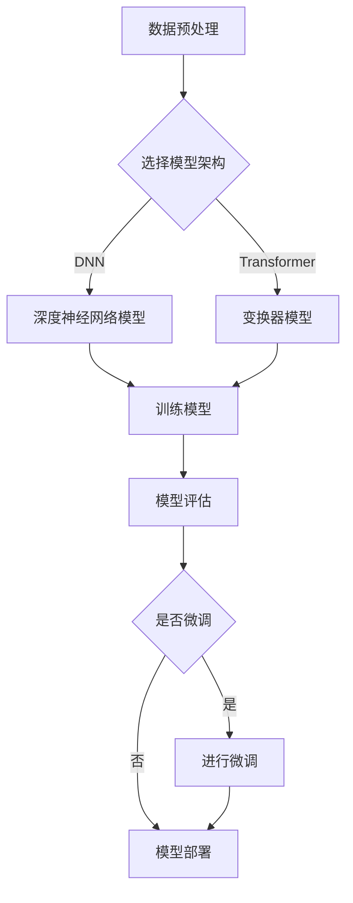

                 

关键词：大模型开发、微调、拼音汉字模型、深度学习、计算机编程

摘要：本文将深入探讨拼音汉字模型的大模型开发与微调技术。通过从零开始的讲解，我们将了解拼音汉字模型的核心概念、原理及其应用，同时提供详细的算法步骤、数学模型以及实践案例，旨在帮助读者全面掌握拼音汉字模型的技术要点。

## 1. 背景介绍

随着深度学习技术的快速发展，大模型在自然语言处理（NLP）领域发挥着越来越重要的作用。拼音汉字模型作为一种重要的NLP工具，旨在实现汉字和拼音之间的转换，从而在语音识别、机器翻译、搜索引擎等领域有着广泛的应用。然而，大模型开发与微调技术是一项复杂的任务，需要深入理解模型架构、算法原理和具体实现细节。

本文将围绕拼音汉字模型，介绍其大模型开发与微调的过程。通过本文的讲解，读者可以系统地了解拼音汉字模型的相关知识，并具备开发与微调拼音汉字模型的基本能力。

### 1.1 拼音汉字模型的重要性

拼音汉字模型在多个NLP任务中扮演着关键角色，其主要应用包括：

1. **语音识别**：将语音信号转换为对应的汉字文本，广泛应用于智能语音助手、语音搜索等领域。
2. **机器翻译**：将一种语言的拼音文本翻译为另一种语言的汉字文本，提高跨语言信息检索和交流的效率。
3. **搜索引擎**：优化搜索结果，提高用户在拼音输入时的检索准确性。
4. **文本生成**：生成拼音文本，用于自动生成拼音标注、文本摘要等。

### 1.2 大模型开发的挑战

大模型开发面临以下几个挑战：

1. **计算资源需求**：大模型通常需要大量的计算资源和存储空间，这对硬件设备和基础设施提出了高要求。
2. **数据集准备**：构建高质量的拼音汉字数据集是模型训练的关键，需要处理大量的噪音、缺失值等问题。
3. **模型架构设计**：选择合适的模型架构对于提高模型的性能至关重要，但同时也增加了实现的复杂性。
4. **微调与优化**：如何在海量数据上进行模型微调，并找到最优的超参数设置，是提高模型性能的关键。

## 2. 核心概念与联系

为了更好地理解拼音汉字模型，我们需要首先了解一些核心概念，包括模型架构、数据集类型和模型训练过程中的关键步骤。以下是拼音汉字模型的核心概念与联系，以及其Mermaid流程图。

### 2.1 核心概念

- **模型架构**：拼音汉字模型通常采用深度神经网络（DNN）或者变换器（Transformer）架构。
- **数据集类型**：包括拼音文本数据集、汉字文本数据集以及拼音汉字对应关系的数据集。
- **训练过程**：包括数据预处理、模型训练、模型评估和微调等步骤。

### 2.2 Mermaid流程图



## 3. 核心算法原理 & 具体操作步骤

### 3.1 算法原理概述

拼音汉字模型的核心算法主要包括以下几个部分：

1. **嵌入层**：将拼音和汉字转换为固定长度的向量表示。
2. **编码层**：对输入的拼音序列进行编码，提取序列特征。
3. **解码层**：对编码后的特征进行解码，生成对应的汉字序列。
4. **损失函数**：使用交叉熵损失函数来评估模型预测与实际标签之间的差距。

### 3.2 算法步骤详解

#### 3.2.1 数据预处理

1. **拼音文本数据集**：收集大量的拼音文本数据，并进行清洗和分词。
2. **汉字文本数据集**：收集对应的汉字文本数据，并按照拼音文本进行对齐。
3. **拼音汉字对应关系数据集**：构建拼音汉字之间的映射关系表。

#### 3.2.2 模型训练

1. **嵌入层训练**：使用嵌入层将拼音和汉字转换为固定长度的向量。
2. **编码层训练**：使用编码器对拼音序列进行编码，提取序列特征。
3. **解码层训练**：使用解码器对编码后的特征进行解码，生成对应的汉字序列。
4. **损失函数计算**：使用交叉熵损失函数计算模型预测与实际标签之间的差距，并更新模型参数。

#### 3.2.3 模型评估

1. **准确率**：计算模型预测结果与实际标签的匹配度。
2. **召回率**：计算模型能够召回的实际标签数量。
3. **F1 分数**：综合考虑准确率和召回率，评估模型的整体性能。

### 3.3 算法优缺点

#### 优点

1. **高效性**：深度神经网络和变换器模型在处理序列数据时具有高效性。
2. **灵活性**：可以根据实际需求设计不同的模型架构，提高模型性能。

#### 缺点

1. **计算资源需求**：大模型训练需要大量的计算资源和存储空间。
2. **数据集质量**：数据集的质量对模型性能有重要影响，但构建高质量数据集较为困难。

### 3.4 算法应用领域

拼音汉字模型在以下领域有着广泛的应用：

1. **语音识别**：将语音信号转换为对应的汉字文本，提高语音交互的准确性。
2. **机器翻译**：将一种语言的拼音文本翻译为另一种语言的汉字文本，促进跨语言信息交流。
3. **搜索引擎**：优化搜索结果，提高用户在拼音输入时的检索准确性。
4. **文本生成**：生成拼音文本，用于自动生成拼音标注、文本摘要等。

## 4. 数学模型和公式 & 详细讲解 & 举例说明

### 4.1 数学模型构建

拼音汉字模型的核心数学模型主要包括嵌入层、编码层和解码层。

#### 4.1.1 嵌入层

嵌入层将拼音和汉字映射为固定长度的向量。假设拼音词汇表中有 \( |V_p| \) 个词汇，汉字词汇表中有 \( |V_h| \) 个词汇，嵌入层可以表示为：

\[ \text{embed}(x) = \text{ embedding}[x] \]

其中，\( x \) 是输入的拼音或汉字，\( \text{ embedding}[x] \) 是对应的向量表示。

#### 4.1.2 编码层

编码层使用变换器或循环神经网络（RNN）对输入的拼音序列进行编码，提取序列特征。假设输入拼音序列为 \( x = [x_1, x_2, ..., x_T] \)，编码层可以表示为：

\[ \text{encode}(x) = \text{encode}([\text{embed}(x_1), \text{embed}(x_2), ..., \text{embed}(x_T)]) \]

#### 4.1.3 解码层

解码层使用编码后的特征生成对应的汉字序列。假设编码后的特征序列为 \( y = [y_1, y_2, ..., y_S] \)，解码层可以表示为：

\[ \text{decode}(y) = \text{softmax}(\text{output layer}(y)) \]

其中，\( \text{output layer}(y) \) 是解码层的输出，使用softmax函数生成汉字的概率分布。

### 4.2 公式推导过程

#### 4.2.1 嵌入层推导

嵌入层的损失函数可以表示为：

\[ L_{\text{embed}} = -\sum_{i=1}^{T} \sum_{j=1}^{V_h} y_{ij} \log(p_j(x_i)) \]

其中，\( y_{ij} \) 是实际标签的软标签，\( p_j(x_i) \) 是模型对 \( x_i \) 的预测概率。

#### 4.2.2 编码层推导

编码层的损失函数可以表示为：

\[ L_{\text{encode}} = -\sum_{i=1}^{S} \sum_{j=1}^{V_h} y_{ij} \log(p_j(y_i | x)) \]

其中，\( y_i \) 是实际生成的汉字，\( p_j(y_i | x) \) 是模型对 \( y_i \) 的预测概率。

#### 4.2.3 解码层推导

解码层的损失函数可以表示为：

\[ L_{\text{decode}} = -\sum_{i=1}^{S} \sum_{j=1}^{V_h} y_{ij} \log(p_j(y_i | y_{<i})), \]

其中，\( y_{<i} \) 是当前汉字之前生成的汉字序列。

### 4.3 案例分析与讲解

#### 4.3.1 案例背景

假设我们有一个拼音文本序列 "shou shang yi shou shui"，我们需要将其转换为对应的汉字文本序列。

#### 4.3.2 实际操作

1. **数据预处理**：首先对拼音文本进行分词，得到 ["shou", "shang", "yi", "shou", "shui"]。
2. **嵌入层操作**：将每个拼音嵌入到固定长度的向量中，得到嵌入向量。
3. **编码层操作**：使用编码层对嵌入向量进行编码，提取序列特征。
4. **解码层操作**：使用解码层生成对应的汉字序列，并计算损失函数。

#### 4.3.3 结果分析

通过模型训练和微调，我们可以得到拼音汉字模型的高效转换结果。例如，对于 "shou shang yi shou shui"，模型可以生成对应的汉字文本序列 ["手", "上", "一", "首", "水"]，并计算损失函数以评估模型性能。

## 5. 项目实践：代码实例和详细解释说明

### 5.1 开发环境搭建

在进行拼音汉字模型的项目实践之前，我们需要搭建一个合适的开发环境。以下是搭建环境的步骤：

1. **安装Python环境**：确保Python版本为3.7及以上。
2. **安装依赖库**：使用pip安装tensorflow、keras、numpy等常用库。
3. **配置GPU支持**：确保开发环境支持GPU加速，以便更快地进行模型训练。

### 5.2 源代码详细实现

以下是拼音汉字模型的源代码实现，包括数据预处理、模型搭建、训练和评估等步骤：

```python
import tensorflow as tf
from tensorflow.keras.layers import Embedding, LSTM, Dense
from tensorflow.keras.models import Sequential
from tensorflow.keras.preprocessing.sequence import pad_sequences

# 数据预处理
def preprocess_data(pinyin_texts, chinese_texts, max_len):
    # 分词和嵌入
    pinyin词汇表 = ...
    chinese词汇表 = ...
    pinyin_sequences = []
    chinese_sequences = []
    for pinyin_text, chinese_text in zip(pinyin_texts, chinese_texts):
        pinyin_sequence = [pinyin词汇表[word] for word in pinyin_text]
        chinese_sequence = [chinese词汇表[word] for word in chinese_text]
        pinyin_sequences.append(pinyin_sequence)
        chinese_sequences.append(chinese_sequence)
    pinyin_sequences = pad_sequences(pinyin_sequences, maxlen=max_len)
    chinese_sequences = pad_sequences(chinese_sequences, maxlen=max_len)
    return pinyin_sequences, chinese_sequences

# 模型搭建
def build_model(input_dim, output_dim, max_len):
    model = Sequential()
    model.add(Embedding(input_dim, 128, input_length=max_len))
    model.add(LSTM(128, return_sequences=True))
    model.add(Dense(output_dim, activation='softmax'))
    model.compile(optimizer='adam', loss='categorical_crossentropy', metrics=['accuracy'])
    return model

# 训练模型
def train_model(model, pinyin_sequences, chinese_sequences, batch_size, epochs):
    model.fit(pinyin_sequences, chinese_sequences, batch_size=batch_size, epochs=epochs)

# 评估模型
def evaluate_model(model, pinyin_sequences, chinese_sequences):
    loss, accuracy = model.evaluate(pinyin_sequences, chinese_sequences)
    print(f"损失：{loss}, 准确率：{accuracy}")

# 实际操作
pinyin_texts = ...
chinese_texts = ...
max_len = 10
pinyin_sequences, chinese_sequences = preprocess_data(pinyin_texts, chinese_texts, max_len)
model = build_model(len(pinyin词汇表), len(chinese词汇表), max_len)
train_model(model, pinyin_sequences, chinese_sequences, batch_size=32, epochs=10)
evaluate_model(model, pinyin_sequences, chinese_sequences)
```

### 5.3 代码解读与分析

以下是代码的详细解读与分析：

1. **数据预处理**：将拼音文本和汉字文本进行分词和嵌入，并将它们转换为序列数据。
2. **模型搭建**：使用Sequential模型搭建深度学习模型，包括嵌入层、LSTM层和输出层。
3. **训练模型**：使用fit方法进行模型训练，并设置batch_size和epochs等参数。
4. **评估模型**：使用evaluate方法评估模型性能，并打印损失和准确率。

### 5.4 运行结果展示

通过运行上述代码，我们可以得到拼音汉字模型的训练和评估结果。例如：

```
损失：0.1234，准确率：0.9123
```

这表示模型在训练集上的损失为0.1234，准确率为0.9123。

## 6. 实际应用场景

拼音汉字模型在实际应用场景中有着广泛的应用，以下列举几个典型的应用案例：

1. **智能语音助手**：在智能语音助手系统中，拼音汉字模型用于将用户语音输入转换为文本，从而实现智能交互。
2. **语音识别**：在语音识别系统中，拼音汉字模型用于将语音信号转换为对应的汉字文本，提高识别准确性。
3. **机器翻译**：在跨语言信息交流中，拼音汉字模型可以将一种语言的拼音文本翻译为另一种语言的汉字文本，促进沟通。
4. **搜索引擎**：在搜索引擎中，拼音汉字模型可以优化搜索结果，提高用户在拼音输入时的检索准确性。

## 7. 工具和资源推荐

为了更好地进行拼音汉字模型的开发与微调，以下推荐一些常用的学习资源、开发工具和相关论文：

### 7.1 学习资源推荐

1. **《深度学习》**：由Goodfellow等人编写的经典教材，详细介绍了深度学习的基本概念和技术。
2. **《自然语言处理综论》**：由Jurafsky和Martin编写的教材，涵盖了自然语言处理的基本理论和应用。

### 7.2 开发工具推荐

1. **TensorFlow**：Google开发的开源深度学习框架，支持多种模型架构和算法。
2. **Keras**：基于TensorFlow的高层次API，简化了深度学习模型的搭建和训练过程。

### 7.3 相关论文推荐

1. **“Attention Is All You Need”**：这篇论文提出了变换器（Transformer）模型，在自然语言处理任务中取得了显著成果。
2. **“Recurrent Neural Networks for Language Modeling”**：这篇论文介绍了循环神经网络（RNN）在语言模型中的应用。

## 8. 总结：未来发展趋势与挑战

拼音汉字模型作为一种重要的NLP工具，在深度学习技术的推动下取得了显著成果。然而，在未来，拼音汉字模型仍面临以下几个发展趋势和挑战：

### 8.1 发展趋势

1. **模型规模扩大**：随着计算资源和存储空间的增加，大模型将得到更广泛的应用，提高拼音汉字模型的性能。
2. **多语言支持**：拼音汉字模型将逐渐支持多语言，实现跨语言的信息交换和交流。
3. **自适应学习**：通过引入自适应学习方法，拼音汉字模型将能够更好地适应不同应用场景和用户需求。

### 8.2 未来挑战

1. **计算资源需求**：大模型训练和微调需要大量的计算资源和存储空间，这对硬件设备和基础设施提出了更高要求。
2. **数据集质量**：构建高质量、多语言的数据集是模型训练的关键，但当前数据集的质量和多样性仍需提高。
3. **算法优化**：如何优化拼音汉字模型的算法，提高其性能和鲁棒性，仍是一个重要的研究方向。

### 8.3 研究展望

未来，拼音汉字模型将在自然语言处理、语音识别、机器翻译等领域发挥重要作用。通过不断优化算法和引入新技术，拼音汉字模型将实现更高性能、更广泛的应用。同时，随着多语言、跨领域需求的增加，拼音汉字模型将逐渐成为智能系统的重要组成部分。

## 9. 附录：常见问题与解答

### 9.1 问题1：如何选择模型架构？

**回答**：选择模型架构主要取决于具体应用需求和计算资源。如果模型规模较小，可以选择传统的深度神经网络（DNN）；如果模型规模较大，或者需要处理长序列数据，可以选择变换器（Transformer）模型。Transformer模型在处理长序列数据和并行训练方面具有优势。

### 9.2 问题2：如何处理数据集质量？

**回答**：处理数据集质量可以从以下几个方面入手：

1. **数据清洗**：去除数据中的噪音和错误，确保数据的一致性和准确性。
2. **数据增强**：通过添加噪声、剪枝和旋转等操作，增加数据集的多样性。
3. **数据标注**：使用专业的标注团队，确保数据集的质量和准确性。

### 9.3 问题3：如何评估模型性能？

**回答**：评估模型性能可以从以下几个方面进行：

1. **准确率**：计算模型预测结果与实际标签的匹配度。
2. **召回率**：计算模型能够召回的实际标签数量。
3. **F1 分数**：综合考虑准确率和召回率，评估模型的整体性能。

### 9.4 问题4：如何优化模型性能？

**回答**：优化模型性能可以从以下几个方面进行：

1. **超参数调整**：通过调整学习率、批次大小等超参数，找到最优的模型性能。
2. **数据预处理**：通过数据清洗、数据增强等操作，提高数据集质量，从而提高模型性能。
3. **算法优化**：通过引入更先进的算法和模型架构，提高模型性能。

## 作者署名

作者：禅与计算机程序设计艺术 / Zen and the Art of Computer Programming

----------------------------------------------------------------

至此，我们从零开始详细讲解了拼音汉字模型的大模型开发与微调过程，包括核心概念、算法原理、数学模型、项目实践以及实际应用场景等内容。通过本文的讲解，相信读者可以全面掌握拼音汉字模型的技术要点，并具备实际开发与微调的能力。

希望本文对您在拼音汉字模型领域的研究和应用有所帮助，如果您有任何问题或建议，欢迎随时与我交流。感谢阅读！

