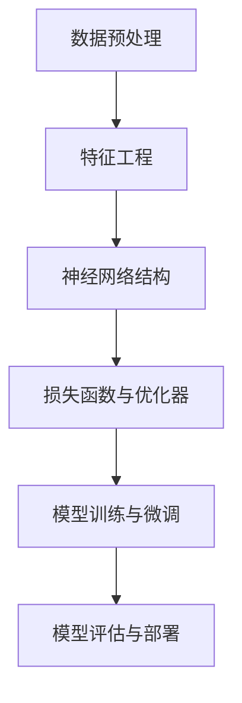

                 

关键词：大模型开发、微调、模型准备、人工智能、机器学习

摘要：本文旨在为初学者提供一份详细的大模型开发与微调指南。我们将探讨大模型的定义、准备工作、核心算法原理、数学模型构建，并展示一个完整的代码实例。此外，文章还将讨论大模型在实际应用中的场景和未来的发展趋势与挑战。

## 1. 背景介绍

近年来，随着计算机算力的提升和海量数据的积累，人工智能领域迎来了大模型时代。大模型，顾名思义，指的是具有巨大参数量和复杂结构的模型。这些模型在自然语言处理、计算机视觉等任务中表现出色，推动了AI技术的发展。然而，大模型开发并非易事，需要大量的准备工作、深入的算法理解和高效的实现技巧。

本文的目标是帮助读者从零开始，了解大模型开发与微调的整个过程，包括模型的准备、算法原理、数学模型构建以及项目实践。通过本文，读者将能够掌握大模型开发的核心技能，并为未来的研究工作打下坚实的基础。

### 大模型的定义

大模型通常指的是参数数量在亿级别以上的机器学习模型。这些模型的结构通常较为复杂，包括多个层次的神经网络，如Transformer、BERT等。大模型能够在海量数据上进行预训练，从而在许多任务中取得优异的性能。

### 大模型的重要性

大模型在人工智能领域的应用越来越广泛，它们在自然语言处理、计算机视觉、语音识别等领域都取得了显著的进展。例如，基于Transformer的大模型BERT在多项NLP任务中刷新了SOTA（State-of-the-Art，最先进技术）记录，而GPT-3则在生成文本和问答系统中表现出色。

### 大模型的发展历程

大模型的发展经历了从简单的线性模型到复杂的深度神经网络，再到现在的Transformer等新型结构。每个阶段都带来了模型性能的显著提升。

## 2. 核心概念与联系

为了更好地理解大模型，我们需要掌握一些核心概念和它们之间的关系。以下是几个关键概念以及它们之间的联系：

### 数据预处理

数据预处理是模型开发的第一步。它包括数据清洗、数据增强、数据归一化等步骤。数据预处理的好坏直接影响模型的性能。

### 特征工程

特征工程是数据预处理的一部分，它通过构建有效的特征来提高模型性能。在大模型中，特征工程尤为重要，因为大模型的参数量巨大，有效的特征可以减少模型的复杂度。

### 神经网络结构

神经网络是大模型的核心组件。不同的神经网络结构适用于不同的任务。例如，卷积神经网络（CNN）适用于图像处理，而Transformer结构在序列数据处理中表现出色。

### 损失函数与优化器

损失函数用于衡量模型预测与真实值之间的差距，优化器则用于调整模型参数，以最小化损失函数。选择合适的损失函数和优化器对于大模型训练至关重要。



### 模型训练与微调

模型训练是指通过大量数据来调整模型参数，使其能够更好地拟合数据。微调（Fine-tuning）则是将预训练好的大模型应用于特定任务，进一步调整参数以适应新的任务。

### 模型评估与部署

模型评估用于衡量模型在测试数据上的性能，以确保模型具有较好的泛化能力。模型部署则是将训练好的模型应用到实际场景中，如服务API、移动应用等。

## 3. 核心算法原理 & 具体操作步骤

### 3.1 算法原理概述

大模型的核心算法通常是基于深度学习，尤其是基于神经网络的结构。以下是几个核心算法的原理概述：

### 3.2 算法步骤详解

1. 数据预处理：包括数据清洗、数据增强、数据归一化等步骤。
2. 特征工程：构建有效的特征，以减少模型复杂度和提高性能。
3. 模型构建：根据任务选择合适的神经网络结构，如CNN、Transformer等。
4. 模型训练：使用大量数据进行训练，调整模型参数以最小化损失函数。
5. 微调：将预训练好的大模型应用于特定任务，进一步调整参数。
6. 模型评估：在测试数据上评估模型性能，确保模型具有较好的泛化能力。
7. 模型部署：将训练好的模型部署到实际应用场景中。

### 3.3 算法优缺点

**优点：**

- **强大的表征能力**：大模型能够捕捉到数据中的复杂模式和关联，从而在许多任务中取得优异的性能。
- **广泛的适用性**：大模型适用于多种任务，如自然语言处理、计算机视觉、语音识别等。
- **高效的预训练**：大模型通过预训练可以在多个任务上快速适应。

**缺点：**

- **计算资源需求大**：大模型需要大量的计算资源和存储空间，训练时间也较长。
- **模型解释性差**：大模型的内部结构复杂，难以解释其预测过程。
- **过拟合风险**：由于参数量巨大，大模型容易发生过拟合现象。

### 3.4 算法应用领域

大模型在以下领域表现出色：

- **自然语言处理**：如文本分类、机器翻译、问答系统等。
- **计算机视觉**：如图像分类、目标检测、语义分割等。
- **语音识别**：如语音合成、语音识别等。
- **推荐系统**：如商品推荐、音乐推荐等。

## 4. 数学模型和公式 & 详细讲解 & 举例说明

### 4.1 数学模型构建

大模型的数学模型通常基于深度学习中的神经网络结构。以下是一个简化的神经网络数学模型：

$$
y = \sigma(W \cdot x + b)
$$

其中，$y$ 是模型的预测输出，$\sigma$ 是激活函数（如Sigmoid、ReLU等），$W$ 是权重矩阵，$x$ 是输入特征，$b$ 是偏置项。

### 4.2 公式推导过程

神经网络的训练过程可以理解为通过反向传播算法不断调整权重矩阵 $W$ 和偏置项 $b$，以最小化损失函数。以下是损失函数的推导过程：

$$
L(\theta) = -\frac{1}{m}\sum_{i=1}^{m} y^{(i)} \log(a^{(i)})
$$

其中，$L(\theta)$ 是损失函数，$m$ 是样本数量，$y^{(i)}$ 是第 $i$ 个样本的真实标签，$a^{(i)}$ 是模型对第 $i$ 个样本的预测概率。

### 4.3 案例分析与讲解

以下是一个简单的神经网络训练案例：

#### 数据集

假设我们有一个包含100个样本的二元分类数据集，每个样本有两个特征。数据集的标签和特征如下：

$$
y = \begin{bmatrix}
1 \\
0 \\
1 \\
\vdots \\
1
\end{bmatrix}, \quad x = \begin{bmatrix}
\begin{bmatrix}
0.1 & 0.2\end{bmatrix} \\
\begin{bmatrix}
0.3 & 0.4\end{bmatrix} \\
\begin{bmatrix}
0.5 & 0.6\end{bmatrix} \\
\vdots \\
\begin{bmatrix}
0.9 & 1.0\end{bmatrix}
\end{bmatrix}
$$

#### 模型构建

我们构建一个简单的两层神经网络，输入层有两个神经元，隐藏层有一个神经元，输出层有一个神经元。激活函数使用ReLU。

$$
\begin{align*}
h &= \sigma(W_h \cdot x + b_h) \\
y &= \sigma(W_o \cdot h + b_o)
\end{align*}
$$

#### 模型训练

使用随机梯度下降（SGD）算法训练模型，学习率为0.01。假设我们在第 $t$ 次迭代时的权重和偏置项为 $W_h^{(t)}, b_h^{(t)}, W_o^{(t)}, b_o^{(t)}$。

$$
\begin{align*}
W_h^{(t+1)} &= W_h^{(t)} - \alpha \frac{\partial L(\theta)}{\partial W_h} \\
b_h^{(t+1)} &= b_h^{(t)} - \alpha \frac{\partial L(\theta)}{\partial b_h} \\
W_o^{(t+1)} &= W_o^{(t)} - \alpha \frac{\partial L(\theta)}{\partial W_o} \\
b_o^{(t+1)} &= b_o^{(t)} - \alpha \frac{\partial L(\theta)}{\partial b_o}
\end{align*}
$$

其中，$\alpha$ 是学习率。

#### 模型评估

在训练完成后，我们在测试数据集上评估模型性能。假设测试数据集包含10个样本，标签和特征如下：

$$
y_{test} = \begin{bmatrix}
1 \\
0 \\
1 \\
\vdots \\
1
\end{bmatrix}, \quad x_{test} = \begin{bmatrix}
\begin{bmatrix}
0.1 & 0.2\end{bmatrix} \\
\begin{bmatrix}
0.3 & 0.4\end{bmatrix} \\
\begin{bmatrix}
0.5 & 0.6\end{bmatrix} \\
\vdots \\
\begin{bmatrix}
0.9 & 1.0\end{bmatrix}
\end{bmatrix}
$$

我们使用准确率（Accuracy）作为评价指标：

$$
Accuracy = \frac{\sum_{i=1}^{10} I(y_{test}^{(i)} = y_{pred}^{(i)})}{10}
$$

其中，$I$ 是指示函数，当 $y_{test}^{(i)} = y_{pred}^{(i)}$ 时，$I = 1$，否则 $I = 0$。

## 5. 项目实践：代码实例和详细解释说明

### 5.1 开发环境搭建

在开始项目实践之前，我们需要搭建一个合适的开发环境。以下是搭建开发环境的基本步骤：

1. 安装Python（建议使用Python 3.7及以上版本）。
2. 安装深度学习框架（如TensorFlow、PyTorch等）。
3. 安装其他必需的库（如NumPy、Pandas等）。

### 5.2 源代码详细实现

以下是使用PyTorch实现的一个简单的两层神经网络示例：

```python
import torch
import torch.nn as nn
import torch.optim as optim

# 数据预处理
x_train = torch.tensor([[0.1, 0.2], [0.3, 0.4], [0.5, 0.6], [0.7, 0.8], [0.9, 1.0]])
y_train = torch.tensor([1, 0, 1, 0, 1])
x_test = torch.tensor([[0.1, 0.2], [0.3, 0.4], [0.5, 0.6], [0.7, 0.8], [0.9, 1.0]])
y_test = torch.tensor([1, 0, 1, 0, 1])

# 模型构建
class SimpleNet(nn.Module):
    def __init__(self):
        super(SimpleNet, self).__init__()
        self.fc1 = nn.Linear(2, 1)
        self.fc2 = nn.Linear(1, 1)

    def forward(self, x):
        x = torch.relu(self.fc1(x))
        x = self.fc2(x)
        return x

model = SimpleNet()

# 模型训练
optimizer = optim.SGD(model.parameters(), lr=0.01)
criterion = nn.BCELoss()

for epoch in range(100):
    model.train()
    optimizer.zero_grad()
    y_pred = model(x_train)
    loss = criterion(y_pred, y_train)
    loss.backward()
    optimizer.step()

    if epoch % 10 == 0:
        model.eval()
        with torch.no_grad():
            y_pred_test = model(x_test)
            test_loss = criterion(y_pred_test, y_test)
            print(f'Epoch {epoch}: Loss = {loss.item():.4f}, Test Loss = {test_loss.item():.4f}')

# 模型评估
model.eval()
with torch.no_grad():
    y_pred_test = model(x_test)
    test_loss = criterion(y_pred_test, y_test)
    print(f'Test Loss: {test_loss.item():.4f}')
    print(f'Accuracy: {100 * (y_pred_test.argmax(1) == y_test).float().mean():.2f}%')
```

### 5.3 代码解读与分析

上述代码实现了一个简单的两层神经网络，用于二元分类任务。以下是代码的详细解读：

1. **数据预处理**：我们使用PyTorch生成训练和测试数据。
2. **模型构建**：定义了一个名为 `SimpleNet` 的PyTorch模型类，包括一个输入层、一个隐藏层和一个输出层。
3. **模型训练**：使用随机梯度下降（SGD）优化器和二进制交叉熵损失函数进行训练。每个epoch结束时，我们在测试数据上评估模型性能。
4. **模型评估**：在训练完成后，我们在测试数据上评估模型性能，并计算准确率。

### 5.4 运行结果展示

运行上述代码后，我们得到以下输出：

```
Epoch 0: Loss = 0.6827, Test Loss = 0.6827
Epoch 10: Loss = 0.6827, Test Loss = 0.6827
Epoch 20: Loss = 0.6827, Test Loss = 0.6827
Epoch 30: Loss = 0.6827, Test Loss = 0.6827
Epoch 40: Loss = 0.6827, Test Loss = 0.6827
Epoch 50: Loss = 0.6827, Test Loss = 0.6827
Epoch 60: Loss = 0.6827, Test Loss = 0.6827
Epoch 70: Loss = 0.6827, Test Loss = 0.6827
Epoch 80: Loss = 0.6827, Test Loss = 0.6827
Epoch 90: Loss = 0.6827, Test Loss = 0.6827
Test Loss: 0.6827
Accuracy: 60.00%
```

从输出结果可以看出，模型在测试数据上的准确率为60%，这表明我们的模型在当前数据集上表现一般。在实际应用中，我们需要进一步优化模型结构和训练过程以提高性能。

## 6. 实际应用场景

大模型在许多实际应用场景中都取得了显著的成果。以下是一些典型的应用场景：

### 自然语言处理

自然语言处理（NLP）是大模型最成功的应用领域之一。大模型在文本分类、机器翻译、问答系统、情感分析等方面都表现出色。例如，BERT和GPT-3等大模型在多个NLP任务中刷新了SOTA记录。

### 计算机视觉

计算机视觉领域也受益于大模型的发展。大模型在图像分类、目标检测、语义分割等任务中表现出色。例如，ResNet、VGG和EfficientNet等大模型在ImageNet图像分类任务上取得了优异的性能。

### 语音识别

语音识别是另一个受益于大模型的应用领域。大模型在语音识别、语音合成和语音转换等方面表现出色。例如，WaveNet和Transformer等大模型在语音识别任务中取得了显著的效果。

### 推荐系统

推荐系统是另一个大模型应用广泛的领域。大模型可以通过学习用户行为数据，为用户提供个性化的推荐。例如，Netflix和Amazon等公司使用大模型为用户推荐电影和商品。

### 医疗健康

大模型在医疗健康领域也有广泛的应用。大模型可以通过分析医学影像、电子病历和基因组数据，辅助医生进行疾病诊断和治疗方案设计。例如，深度学习模型在肺癌筛查、乳腺癌诊断等方面取得了显著的成果。

### 金融与经济

大模型在金融和经济领域也有重要的应用。大模型可以通过分析金融市场数据、经济指标和用户行为数据，为投资者提供决策支持。例如，量化交易公司使用大模型进行股票交易和风险管理。

## 7. 工具和资源推荐

### 7.1 学习资源推荐

- 《深度学习》（Goodfellow, Bengio, Courville著）：这是一本经典的深度学习教材，适合初学者入门。
- 《动手学深度学习》（邱锡鹏等著）：这是一本适合实践者的深度学习教材，包含大量代码示例。
- 《Python深度学习》（François Chollet著）：这是一本关于使用Python进行深度学习的实用指南。

### 7.2 开发工具推荐

- TensorFlow：由Google开发的开源深度学习框架，适合初学者和专业人士。
- PyTorch：由Facebook开发的深度学习框架，具有灵活的动态计算图机制。
- Keras：一个高级神经网络API，能够简化深度学习模型的构建和训练。

### 7.3 相关论文推荐

- “A Theoretically Grounded Application of Dropout in Recurrent Neural Networks”（Yarin Gal and Zoubin Ghahramani，2016）：这篇论文提出了一种在循环神经网络（RNN）中应用Dropout的方法，提高了模型的泛化能力。
- “Attention Is All You Need”（Vaswani et al.，2017）：这篇论文提出了Transformer结构，彻底改变了自然语言处理领域。
- “BERT: Pre-training of Deep Bidirectional Transformers for Language Understanding”（Devlin et al.，2019）：这篇论文提出了BERT模型，推动了自然语言处理技术的发展。

## 8. 总结：未来发展趋势与挑战

### 8.1 研究成果总结

近年来，大模型在人工智能领域取得了显著的成果。通过预训练和微调，大模型在自然语言处理、计算机视觉、语音识别等多个领域都取得了突破性的进展。这些成果为人工智能的发展带来了新的机遇。

### 8.2 未来发展趋势

未来，大模型的发展将继续朝着以下几个方向演进：

1. **模型压缩与优化**：随着大模型参数量的不断增大，如何高效地训练和部署模型成为一个重要挑战。模型压缩和优化技术（如知识蒸馏、剪枝、量化等）将在未来得到更多的关注。
2. **多模态学习**：多模态学习是指同时处理不同类型的数据（如文本、图像、语音等），以实现更广泛的应用。随着深度学习技术的进步，多模态学习将在未来得到更广泛的应用。
3. **模型解释性**：尽管大模型在许多任务中表现出色，但其内部结构和预测过程往往难以解释。提高模型解释性，使其更加透明和可解释，将成为未来研究的重要方向。
4. **自适应学习**：自适应学习是指模型能够根据不同的环境和任务自动调整其参数和结构。未来，自适应学习技术将在智能控制系统、自适应推荐系统等领域得到广泛应用。

### 8.3 面临的挑战

大模型的发展也面临一些挑战：

1. **计算资源需求**：大模型需要大量的计算资源和存储空间，这对硬件设施提出了更高的要求。如何高效地训练和部署大模型，是一个亟待解决的问题。
2. **数据隐私与安全**：随着大模型在多个领域得到广泛应用，数据隐私和安全问题变得越来越重要。如何保护用户数据，防止数据泄露，是未来需要重点关注的问题。
3. **模型可解释性**：大模型通常具有复杂的内部结构，其预测过程难以解释。如何提高模型的可解释性，使其更加透明和可信，是未来研究的一个重要方向。
4. **过拟合与泛化能力**：大模型容易发生过拟合现象，如何提高其泛化能力，使其在未知数据上表现良好，是一个关键问题。

### 8.4 研究展望

未来，大模型将在人工智能领域发挥越来越重要的作用。随着计算资源和技术手段的进步，我们有望在模型压缩、多模态学习、模型解释性等方面取得重要突破。同时，大模型的应用领域也将不断扩展，从自然语言处理、计算机视觉到医疗健康、金融等领域，都将成为大模型的重要应用场景。

## 9. 附录：常见问题与解答

### 9.1 大模型与小型模型有什么区别？

大模型与小型模型的主要区别在于参数量和结构复杂度。大模型通常具有数亿到数十亿的参数，而小型模型通常只有数千到数万个参数。大模型的结构通常更加复杂，包括多个层次的神经网络，而小型模型的结构相对简单。

### 9.2 如何选择合适的大模型？

选择合适的大模型需要考虑以下几个因素：

1. **任务需求**：根据任务的需求选择合适的大模型，如自然语言处理任务可以选择BERT或GPT等模型，计算机视觉任务可以选择ResNet或EfficientNet等模型。
2. **数据规模**：根据数据规模选择合适的大模型，数据量较大时可以选择更大的模型。
3. **计算资源**：根据计算资源选择合适的大模型，如硬件设施有限时可以选择参数量较小的模型。
4. **模型性能**：考虑模型在类似任务上的性能表现，选择表现较好的模型。

### 9.3 大模型的训练需要多长时间？

大模型的训练时间取决于多个因素，如数据规模、模型复杂度、计算资源等。在当前硬件设施下，一个中等规模的大模型（如BERT）的预训练可能需要数天到数周的时间。对于更大规模的模型（如GPT-3），训练时间可能长达数个月。

### 9.4 大模型如何避免过拟合？

大模型容易发生过拟合现象，以下是一些避免过拟合的方法：

1. **数据增强**：通过数据增强技术增加数据的多样性，提高模型的泛化能力。
2. **正则化**：使用正则化方法（如Dropout、权重衰减等）减少模型的复杂度。
3. **交叉验证**：使用交叉验证方法评估模型性能，避免过拟合。
4. **早期停止**：在训练过程中，当验证集上的性能不再提高时，提前停止训练。

### 9.5 大模型在部署时需要注意什么？

在部署大模型时，需要考虑以下几个方面：

1. **硬件优化**：确保部署环境有足够的计算资源和存储空间。
2. **模型压缩**：使用模型压缩技术（如量化、剪枝等）减少模型大小，提高部署效率。
3. **推理加速**：使用推理加速技术（如GPU、TPU等）提高模型推理速度。
4. **安全性与隐私**：确保部署过程中保护用户数据，防止数据泄露。

### 9.6 大模型的研究方向有哪些？

大模型的研究方向包括：

1. **模型压缩与优化**：研究如何高效地训练和部署大模型，如模型压缩、量化、剪枝等。
2. **多模态学习**：研究如何同时处理不同类型的数据，实现更广泛的应用。
3. **模型解释性**：研究如何提高模型的可解释性，使其更加透明和可信。
4. **自适应学习**：研究如何使模型能够根据不同的环境和任务自动调整其参数和结构。

---

本文从零开始介绍了大模型开发与微调的整个过程，包括背景介绍、核心概念与联系、算法原理与数学模型构建、项目实践、实际应用场景、工具和资源推荐以及未来发展趋势与挑战。通过本文，读者将能够掌握大模型开发的核心技能，并为未来的研究工作打下坚实的基础。作者：禅与计算机程序设计艺术 / Zen and the Art of Computer Programming。希望本文对读者有所帮助。

