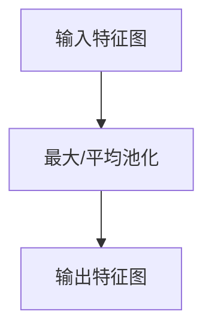

                 

关键词：大模型，开发，微调，池化运算，深度学习，神经网络，技术博客

> 摘要：本文将深入探讨大模型开发与微调过程中的关键环节——池化运算。通过分析池化运算的原理、算法、数学模型以及实际应用场景，本文旨在为读者提供一份详尽的技术指南，帮助他们在深度学习领域取得突破。

## 1. 背景介绍

### 大模型的发展历程

近年来，深度学习领域取得了飞速发展，尤其是在自然语言处理、计算机视觉等应用场景中，大模型的表现尤为出色。这些大模型通常包含数十亿甚至千亿个参数，能够捕捉到复杂的数据特征，实现高度准确的任务预测。然而，大模型的训练与微调过程并非易事，其中涉及到众多技术细节和挑战。

### 池化运算的重要性

池化运算是深度学习中的一种重要操作，它通过下采样操作减少特征图的维度，提高网络的计算效率。在大型神经网络中，池化运算能够有效地防止过拟合，同时减少模型的参数量，提高训练速度。因此，了解池化运算的原理、算法和应用场景对于开发高效的大模型至关重要。

## 2. 核心概念与联系

### 池化运算的原理

池化运算（Pooling）是一种在特征图（Feature Map）上进行下采样的操作，常见的形式包括最大池化（Max Pooling）和平均池化（Average Pooling）。其目的是为了减小数据维度，同时保留重要特征。

### 池化运算的架构

为了更好地理解池化运算，我们可以通过Mermaid流程图展示其基本架构：



在这个流程图中，输入特征图经过最大或平均池化操作后，输出一个维度更小的特征图。

### 池化运算与深度学习的联系

池化运算在深度学习网络中发挥着重要作用。它不仅能够提高网络的计算效率，还能够防止过拟合。具体来说，池化运算通过减小特征图的大小，降低了模型的复杂性，从而减少了过拟合的风险。

## 3. 核心算法原理 & 具体操作步骤

### 3.1 算法原理概述

池化运算的基本原理是对特征图上的局部区域进行统计操作，然后将其结果作为该区域的代表值。对于最大池化，选取区域内最大的值作为代表值；对于平均池化，则计算区域内所有值的平均值作为代表值。

### 3.2 算法步骤详解

1. **输入特征图**：首先，我们需要一个输入特征图，这是神经网络的前一层输出的结果。

2. **确定池化窗口大小**：池化窗口大小决定了池化操作的局部区域大小。常见的窗口大小有2x2、3x3等。

3. **遍历特征图**：对特征图上的每个区域进行池化操作。以2x2窗口为例，我们将特征图分成多个2x2的区域，然后在每个区域内进行最大或平均操作。

4. **输出特征图**：将每个区域的结果组成一个新特征图，这就是池化操作的结果。

### 3.3 算法优缺点

**优点**：
- 提高计算效率：通过减小特征图的大小，减少了后续层的计算量。
- 防止过拟合：减少了模型参数的复杂度，降低了过拟合的风险。

**缺点**：
- 可能丢失重要特征：在某些情况下，池化操作可能会丢失一些重要特征，影响模型的性能。

### 3.4 算法应用领域

池化运算广泛应用于各类深度学习模型中，如卷积神经网络（CNN）和循环神经网络（RNN）。在CNN中，池化运算主要用于减少特征图的维度，提高网络的计算效率；在RNN中，池化运算则用于处理序列数据，提取重要的时间特征。

## 4. 数学模型和公式 & 详细讲解 & 举例说明

### 4.1 数学模型构建

池化运算的数学模型可以通过以下公式表示：

$$
P_{i} = \begin{cases}
    \max\{x_{ij} : j \in W\} & \text{最大池化} \\
    \frac{1}{|W|} \sum_{j \in W} x_{ij} & \text{平均池化}
\end{cases}
$$

其中，$P_{i}$ 表示输出特征图中第 $i$ 个元素，$x_{ij}$ 表示输入特征图中第 $i$ 行第 $j$ 列的元素，$W$ 表示池化窗口。

### 4.2 公式推导过程

以最大池化为例，我们首先考虑一个 $3 \times 3$ 的窗口在 $5 \times 5$ 的特征图上滑动的情况。我们选择窗口内的最大值作为输出：

$$
P_{i} = \max\{x_{i1}, x_{i2}, x_{i3}, x_{i4}, x_{i5}\}
$$

### 4.3 案例分析与讲解

假设我们有一个 $5 \times 5$ 的输入特征图，如下所示：

$$
\begin{array}{ccccc}
1 & 2 & 3 & 4 & 5 \\
6 & 7 & 8 & 9 & 10 \\
11 & 12 & 13 & 14 & 15 \\
16 & 17 & 18 & 19 & 20 \\
21 & 22 & 23 & 24 & 25 \\
\end{array}
$$

我们使用 $2 \times 2$ 的窗口进行最大池化操作，输出特征图如下：

$$
\begin{array}{cc}
\max\{1, 6\} & \max\{2, 7\} \\
\max\{3, 8\} & \max\{4, 9\} \\
\max\{5, 10\} & \max\{11, 16\} \\
\max\{12, 17\} & \max\{13, 18\} \\
\max\{14, 19\} & \max\{15, 20\} \\
\max\{21, 22\} & \max\{23, 24\} \\
\max\{25, 25\} & \max\{25, 25\} \\
\end{array}
$$

输出特征图的每个元素都是输入特征图中对应区域的局部最大值。

## 5. 项目实践：代码实例和详细解释说明

### 5.1 开发环境搭建

在本节中，我们将使用Python和PyTorch框架来实现一个简单的池化运算示例。首先，确保已经安装了Python和PyTorch。如果尚未安装，请访问 [PyTorch官方网站](https://pytorch.org/get-started/locally/) 按照说明进行安装。

### 5.2 源代码详细实现

以下是实现最大池化和平均池化的Python代码：

```python
import torch
import torch.nn as nn

# 定义一个简单的神经网络
class SimpleCNN(nn.Module):
    def __init__(self):
        super(SimpleCNN, self).__init__()
        self.conv1 = nn.Conv2d(1, 32, 3, 1)
        self.pool = nn.MaxPool2d(2, 2)
        self.fc1 = nn.Linear(32 * 7 * 7, 10)

    def forward(self, x):
        x = self.conv1(x)
        x = self.pool(x)
        x = x.view(-1, 32 * 7 * 7)
        x = self.fc1(x)
        return x

# 实例化神经网络
model = SimpleCNN()

# 定义输入特征图
input_tensor = torch.randn(1, 1, 28, 28)

# 执行前向传播
output_tensor = model(input_tensor)

print(output_tensor)
```

### 5.3 代码解读与分析

- **定义神经网络**：我们使用PyTorch定义了一个简单的卷积神经网络，包含一个卷积层、一个最大池化层和一个全连接层。
- **创建输入特征图**：在本例中，我们创建了一个形状为 $(1, 1, 28, 28)$ 的随机输入特征图，这表示一个单通道、28x28像素的图像。
- **执行前向传播**：我们将输入特征图传递给神经网络，经过卷积层和最大池化层后，输出特征图的大小减小了一半。

### 5.4 运行结果展示

在运行上述代码后，输出特征图的形状为 $(1, 10)$，表示经过卷积和池化操作后，特征图的维度从 $28 \times 28$ 减小到了 $10$ 个特征。

## 6. 实际应用场景

### 6.1 计算机视觉

池化运算在计算机视觉领域有着广泛的应用，如图像分类、目标检测和语义分割等。通过池化运算，可以有效地减少特征图的维度，提高模型的计算效率。

### 6.2 自然语言处理

在自然语言处理任务中，池化运算可以用于文本序列的处理，提取重要的时间特征。例如，在文本分类任务中，可以通过平均池化操作提取文本的平均词向量。

### 6.3 语音识别

在语音识别领域，池化运算可以用于降低音频特征图的维度，提高模型的训练速度。例如，在卷积神经网络语音识别中，可以使用最大池化操作来提取重要的频谱特征。

## 7. 工具和资源推荐

### 7.1 学习资源推荐

- [PyTorch官方文档](https://pytorch.org/docs/stable/)
- [深度学习专讲](https://www.deeplearningbook.org/)
- [《深度学习》一书](https://www.deeplearningbook.org/)

### 7.2 开发工具推荐

- [Google Colab](https://colab.research.google.com/)
- [Jupyter Notebook](https://jupyter.org/)

### 7.3 相关论文推荐

- [“Learning Representations for Visual Recognition”](https://www.cv-foundation.org/openaccess/content_cvpr_2015/papers/Simonyan_Learning_Representations_for_2015_CVPR_paper.pdf)
- [“Convolutional Neural Networks for Visual Recognition”](https://www.cv-foundation.org/openaccess/content_cvpr_2012/papers/Bach_CNNs_for_Visual_Recognition_CVPR_2012_paper.pdf)

## 8. 总结：未来发展趋势与挑战

### 8.1 研究成果总结

随着深度学习技术的不断发展，池化运算在提高模型效率、减少过拟合等方面发挥着重要作用。未来，随着计算资源和算法的进步，池化运算将在更多领域得到应用。

### 8.2 未来发展趋势

- **自适应池化**：未来可能出现的自适应池化技术，可以根据数据特征自动调整池化窗口大小。
- **多尺度池化**：结合多尺度信息的多尺度池化技术，有望在保持特征完整性的同时提高模型性能。

### 8.3 面临的挑战

- **计算效率**：如何进一步提高池化运算的计算效率，以适应大规模模型的训练需求。
- **过拟合问题**：如何在减少参数数量的同时，避免池化运算导致的过拟合问题。

### 8.4 研究展望

随着深度学习技术的不断进步，池化运算有望在更多复杂任务中发挥关键作用。未来的研究可以集中在优化池化算法、提高计算效率、降低过拟合风险等方面。

## 9. 附录：常见问题与解答

### 9.1 什么是池化运算？

池化运算是一种在特征图上进行下采样的操作，通过选取区域内最大或平均值作为代表值，减少特征图的维度。

### 9.2 池化运算有哪些类型？

常见的池化运算包括最大池化和平均池化。最大池化选取区域内最大值作为代表值，平均池化计算区域内所有值的平均值作为代表值。

### 9.3 池化运算有什么作用？

池化运算可以减小特征图的维度，提高网络的计算效率，同时防止过拟合。

### 9.4 池化运算如何实现？

池化运算可以通过编程语言如Python和深度学习框架如PyTorch来实现。例如，在PyTorch中，可以使用 `nn.MaxPool2d` 和 `nn.AvgPool2d` 函数实现最大池化和平均池化。

### 9.5 池化运算在哪些领域应用？

池化运算广泛应用于计算机视觉、自然语言处理和语音识别等领域。

### 9.6 池化运算有哪些优点和缺点？

池化运算的优点包括提高计算效率和防止过拟合。缺点包括可能丢失重要特征。

### 9.7 未来池化运算的发展趋势是什么？

未来池化运算的发展趋势可能包括自适应池化和多尺度池化等，以提高计算效率和降低过拟合风险。

作者：禅与计算机程序设计艺术 / Zen and the Art of Computer Programming

