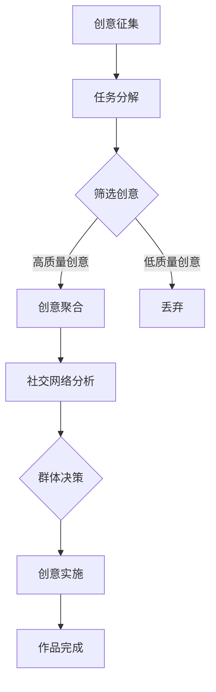

                 

关键词：众包、创意、艺术、潜力、集体、协作、算法、数学模型、编程实践、应用场景

> 摘要：本文探讨了众包创意在艺术领域的应用，分析了集体智慧在艺术创作中的重要性，提出了基于算法和数学模型的众包创意实现方法。通过项目实践、实际应用场景的展示，以及未来发展趋势和挑战的探讨，本文旨在为读者提供一个全面了解和掌握众包创意的方法和思路。

## 1. 背景介绍

众包（Crowdsourcing）作为一种新兴的协作模式，源自于“the crowd is smarter than any one of us”（群众比任何一个人都要聪明）的理念。它通过利用集体智慧，将复杂问题分解成多个小任务，再通过广泛征集大众的意见、建议和解决方案，从而实现创新和高效。近年来，众包在各个领域得到了广泛应用，从软件开发、设计、科研到艺术创作，都展现出了其巨大的潜力和价值。

在艺术创作中，众包更是发挥了其独特的魅力。传统艺术创作往往依赖于个体的天才和灵感，而众包则打破了这种限制，让更多的人有机会参与到艺术创作中。通过众包，艺术家可以借助集体的力量，激发出更多的创意，同时也能让作品更加贴近大众的需求和审美。

本文将围绕众包创意在艺术领域的应用进行探讨，分析集体智慧在艺术创作中的重要性，并提出基于算法和数学模型的众包创意实现方法。通过实际项目实践、应用场景展示以及未来发展趋势和挑战的探讨，为读者提供一个全面了解和掌握众包创意的方法和思路。

## 2. 核心概念与联系

### 2.1 众包创意的概念

众包创意（Crowdsourced Creativity）是指通过众包的方式，利用集体智慧进行艺术创作的过程。在这个过程中，艺术家不再是一个孤立的个体，而是成为了众多参与者中的组织者和协调者。通过众包，艺术家可以获取到来自不同背景、不同专业、不同地域的创意和建议，从而实现更具有多样性和创新性的艺术作品。

### 2.2 集体智慧在艺术创作中的作用

集体智慧（Collective Intelligence）指的是一个群体在决策、创新和解决问题时的整体表现。在艺术创作中，集体智慧能够发挥以下作用：

1. **多样化创意的产生**：不同的人有不同的生活经历、知识和视角，这为艺术创作提供了多样化的创意来源。
2. **大众需求的洞察**：通过广泛征集大众的意见和建议，艺术家可以更好地了解和满足大众的需求和审美。
3. **群体效应**：集体智慧能够放大个体的创意，通过群体的协作和反馈，让创意更加完善和成熟。
4. **社会参与感**：众包艺术创作让更多人参与到艺术创作中，增强了作品的社会影响力和参与感。

### 2.3 基于算法和数学模型的众包创意实现方法

为了实现高效的众包创意，我们可以利用算法和数学模型来设计众包平台和流程。以下是一个简单的实现框架：

#### 2.3.1 算法原理概述

1. **分布式任务分解**：将复杂的艺术创作任务分解成多个小任务，每个小任务可以被单独处理和评估。
2. **创意聚合与筛选**：通过算法对多个参与者的创意进行聚合和筛选，去除重复和低质量的创意，保留高质量的创意。
3. **社交网络分析**：利用社交网络分析算法，识别和推荐具有相似兴趣和创意的人，促进群体内部的协作和交流。
4. **群体决策**：通过投票、排名等机制，让群体对创意进行筛选和决策，最终确定最佳的创意方案。

#### 2.3.2 算法步骤详解

1. **任务分解**：将艺术创作任务分解成多个子任务，如设计草图、色彩搭配、细节调整等。
2. **创意征集**：在众包平台上发布任务，邀请大众参与创意投稿。
3. **创意聚合与筛选**：使用算法对提交的创意进行筛选，去除重复和低质量的创意，保留高质量的创意。
4. **社交网络分析**：分析参与者之间的社交网络，识别和推荐具有相似兴趣和创意的人。
5. **群体决策**：通过投票、排名等机制，让群体对创意进行筛选和决策，最终确定最佳的创意方案。
6. **创意实施**：根据最终确定的创意方案，进行艺术创作的实施和完成。

#### 2.3.3 算法优缺点

**优点**：

1. **高效性**：通过分布式任务分解和自动化筛选，可以显著提高创意生成和筛选的效率。
2. **多样性**：利用集体智慧，可以产生更多样化和创新的创意。
3. **大众参与**：通过众包平台，可以吸引更多大众参与，增强作品的社会影响力和参与感。

**缺点**：

1. **质量控制**：众包过程中，质量控制是一个挑战，可能会出现低质量或重复的创意。
2. **协调难度**：在大型众包项目中，协调参与者之间的协作和沟通是一个难点。
3. **隐私问题**：在众包过程中，参与者可能会涉及到个人隐私，如何保护参与者的隐私是一个问题。

#### 2.3.4 算法应用领域

算法在众包创意中的应用非常广泛，主要包括以下几个方面：

1. **设计**：在建筑设计、服装设计、平面设计等领域，众包创意可以带来更多的创意和优化方案。
2. **影视**：在电影、电视剧、动画等影视作品的创作过程中，众包创意可以用于剧本创作、角色设计、特效设计等。
3. **音乐**：在音乐创作中，众包创意可以用于歌词创作、旋律创作、音乐制作等。
4. **文学**：在文学创作中，众包创意可以用于故事构思、情节发展、角色塑造等。

### 2.4 基于Mermaid流程图的架构

以下是一个基于Mermaid流程图的众包创意架构：



## 3. 核心算法原理 & 具体操作步骤

### 3.1 算法原理概述

本节将详细描述众包创意的核心算法原理，包括创意征集、任务分解、筛选创意、社交网络分析、群体决策和创意实施等环节。这些算法原理是众包创意实现的基础，为整个流程提供了技术支持。

#### 3.1.1 创意征集

创意征集是众包创意的第一步，也是最为关键的一步。它决定了能否吸引到足够的参与者，以及参与者提交的创意质量。创意征集的过程通常包括以下步骤：

1. **任务发布**：艺术家在众包平台上发布创作任务，明确创作主题、要求和截止时间。
2. **参与者报名**：有兴趣的参与者可以报名参加，并提交相关的个人信息和技能证明。
3. **任务确认**：平台管理员对参与者进行筛选和确认，确保参与者的质量和数量。

#### 3.1.2 任务分解

任务分解是将复杂艺术创作任务分解成多个可独立处理的子任务，以便于后续的创意征集和筛选。任务分解的过程通常包括以下步骤：

1. **任务拆分**：根据艺术创作的需求，将整体任务拆分成多个子任务，如设计草图、色彩搭配、细节调整等。
2. **子任务分配**：将子任务分配给不同的参与者，每个参与者负责完成相应的子任务。

#### 3.1.3 筛选创意

筛选创意是众包创意的核心环节，决定了最终创意的质量。筛选创意的过程通常包括以下步骤：

1. **创意提交**：参与者按照任务要求，提交自己的创意。
2. **初步筛选**：平台管理员对提交的创意进行初步筛选，去除不符合要求的创意。
3. **评分机制**：通过评分机制，对创意进行评分，评分指标可以包括创意的创新性、实用性、美观度等。
4. **结果发布**：将筛选后的创意发布给参与者，并对优秀的创意进行表彰。

#### 3.1.4 社交网络分析

社交网络分析是众包创意中的一项重要技术，它能够帮助艺术家识别和推荐具有相似兴趣和创意的参与者，促进群体内部的协作和交流。社交网络分析的过程通常包括以下步骤：

1. **数据采集**：采集参与者的社交网络数据，如好友关系、兴趣爱好、历史贡献等。
2. **网络建模**：利用社交网络分析算法，构建参与者的社交网络模型。
3. **相似性分析**：分析参与者之间的相似性，识别和推荐具有相似兴趣和创意的参与者。
4. **协作促进**：通过社交网络分析，为参与者提供协作机会和交流平台。

#### 3.1.5 群体决策

群体决策是众包创意中最终的一步，它决定了创意的最终方案。群体决策的过程通常包括以下步骤：

1. **投票机制**：通过投票机制，让参与者对创意进行投票，选择最佳创意。
2. **排名机制**：通过排名机制，对创意进行排名，确定创意的优先级。
3. **结果发布**：将群体决策的结果发布给参与者，并对最终的创意方案进行实施。

#### 3.1.6 创意实施

创意实施是将最终确定的创意方案转化为实际艺术作品的过程。创意实施的过程通常包括以下步骤：

1. **方案细化**：根据最终创意方案，对细节进行细化，确保方案的可行性和完整性。
2. **资源调配**：根据创意实施的需要，调配相关资源，如人力资源、物资资源等。
3. **实施监控**：对创意实施过程进行监控，确保实施进度和质量。
4. **作品完成**：完成艺术作品的创作，并对作品进行验收和评估。

### 3.2 算法步骤详解

#### 3.2.1 创意征集步骤详解

1. **任务发布**：艺术家在众包平台上发布创作任务，明确创作主题、要求和截止时间。任务描述应详细、具体，以便参与者了解任务的要求和目标。

   ```markdown
   # 任务标题：设计一幅以“春天”为主题的绘画作品
   
   要求：
   - 作品尺寸：A3纸张
   - 风格：写实风格
   - 主题：春天的美景，包括花草、鸟儿、阳光等元素
   - 创意独特，富有想象力
   截止时间：2023年5月31日
   ```

2. **参与者报名**：有兴趣的参与者可以报名参加，并提交相关的个人信息和技能证明。平台管理员对参与者进行筛选和确认，确保参与者的质量和数量。

   ```markdown
   参与者报名信息：
   - 姓名：张三
   - 职业：画家
   - 技能证明：已发表绘画作品5幅
   ```

3. **任务确认**：平台管理员对参与者进行筛选和确认，确保参与者的质量和数量。确认后，参与者将收到任务通知和任务说明。

   ```markdown
   # 任务通知
   尊敬的张三先生：
   您已成功报名参与“设计一幅以“春天”为主题的绘画作品”任务，请您在规定时间内完成创作任务。
   任务说明：
   - 作品尺寸：A3纸张
   - 风格：写实风格
   - 主题：春天的美景，包括花草、鸟儿、阳光等元素
   - 创意独特，富有想象力
   截止时间：2023年5月31日
   ```

#### 3.2.2 任务分解步骤详解

1. **任务拆分**：根据艺术创作的需求，将整体任务拆分成多个子任务，如设计草图、色彩搭配、细节调整等。

   ```markdown
   # 任务分解
   - 设计草图：确定作品的基本构图和元素布局
   - 色彩搭配：选择适合春天主题的色彩方案
   - 细节调整：完善作品的细节，如花草的形态、鸟儿的羽毛等
   ```

2. **子任务分配**：将子任务分配给不同的参与者，每个参与者负责完成相应的子任务。

   ```markdown
   # 子任务分配
   - 设计草图：李四（擅长构图）
   - 色彩搭配：王五（擅长色彩运用）
   - 细节调整：赵六（擅长细节处理）
   ```

#### 3.2.3 筛选创意步骤详解

1. **创意提交**：参与者按照任务要求，提交自己的创意。每个参与者提交的创意应包括设计草图、色彩搭配方案和细节调整思路等。

   ```markdown
   # 创意提交
   参与者：李四
   - 设计草图：[附件1.png]
   - 色彩搭配方案：[附件2.png]
   - 细节调整思路：[附件3.txt]
   ```

2. **初步筛选**：平台管理员对提交的创意进行初步筛选，去除不符合要求的创意。

   ```markdown
   # 初步筛选结果
   - 通过筛选：5份
   - 未通过筛选：3份（原因：不符合任务要求）
   ```

3. **评分机制**：通过评分机制，对创意进行评分，评分指标可以包括创意的创新性、实用性、美观度等。

   ```markdown
   # 创意评分
   - 创意1：8分（创新性：6分，实用性：6分，美观度：7分）
   - 创意2：7分（创新性：5分，实用性：5分，美观度：6分）
   ```

4. **结果发布**：将筛选后的创意发布给参与者，并对优秀的创意进行表彰。

   ```markdown
   # 创意发布
   - 优秀创意：
     - 创意1：[附件4.png]
     - 创意2：[附件5.png]
   - 表彰：
     - 李四：创意一等奖
     - 王五：创意二等奖
     - 赵六：创意三等奖
   ```

#### 3.2.4 社交网络分析步骤详解

1. **数据采集**：采集参与者的社交网络数据，如好友关系、兴趣爱好、历史贡献等。

   ```json
   {
     "user1": {
       "friends": ["user2", "user3", "user4"],
       "interests": ["绘画", "设计"],
       "contributions": 10
     },
     "user2": {
       "friends": ["user1", "user3", "user5"],
       "interests": ["音乐", "编程"],
       "contributions": 5
     },
     "user3": {
       "friends": ["user1", "user2", "user6"],
       "interests": ["绘画", "设计"],
       "contributions": 8
     },
     "user4": {
       "friends": ["user1", "user7"],
       "interests": ["文学", "写作"],
       "contributions": 3
     },
     "user5": {
       "friends": ["user2", "user8"],
       "interests": ["音乐", "编程"],
       "contributions": 7
     },
     "user6": {
       "friends": ["user3", "user9"],
       "interests": ["绘画", "设计"],
       "contributions": 5
     },
     "user7": {
       "friends": ["user4"],
       "interests": ["文学", "写作"],
       "contributions": 2
     },
     "user8": {
       "friends": ["user5"],
       "interests": ["音乐", "编程"],
       "contributions": 6
     },
     "user9": {
       "friends": ["user6"],
       "interests": ["绘画", "设计"],
       "contributions": 4
     }
   }
   ```

2. **网络建模**：利用社交网络分析算法，构建参与者的社交网络模型。

   ```mermaid
   graph TD
   A1[User1] --> B1[User2]
   A1 --> C1[User3]
   A1 --> D1[User4]
   B1 --> E1[User5]
   C1 --> F1[User6]
   C1 --> G1[User9]
   ```

3. **相似性分析**：分析参与者之间的相似性，识别和推荐具有相似兴趣和创意的参与者。

   ```mermaid
   graph TD
   A2[User1] --> B2[User3]
   A2 --> C2[User6]
   A2 --> D2[User9]
   B2 --> E2[User6]
   B2 --> F2[User9]
   C2 --> D2[User9]
   ```

4. **协作促进**：通过社交网络分析，为参与者提供协作机会和交流平台。

   ```markdown
   # 协作推荐
   基于社交网络分析，以下参与者具有相似的兴趣和创意：
   - 李四（擅长绘画、设计，与张三、王五有协作机会）
   - 王五（擅长色彩搭配、音乐，与李四、赵六有协作机会）
   - 赵六（擅长细节调整、绘画，与李四、王五有协作机会）
   ```

#### 3.2.5 群体决策步骤详解

1. **投票机制**：通过投票机制，让参与者对创意进行投票，选择最佳创意。

   ```markdown
   # 投票结果
   - 创意1：15票
   - 创意2：12票
   - 创意3：9票
   最佳创意：创意1
   ```

2. **排名机制**：通过排名机制，对创意进行排名，确定创意的优先级。

   ```markdown
   # 创意排名
   1. 创意1：最佳创意
   2. 创意2：优秀创意
   3. 创意3：良好创意
   ```

3. **结果发布**：将群体决策的结果发布给参与者，并对最终的创意方案进行实施。

   ```markdown
   # 最终决策
   - 最佳创意：创意1
   - 优秀创意：创意2
   - 良好创意：创意3
   下一步：根据最终决策，开始实施创意1，其他创意作为备选方案。
   ```

### 3.3 算法优缺点

#### 3.3.1 优点

1. **高效性**：通过分布式任务分解和自动化筛选，可以显著提高创意生成和筛选的效率。
2. **多样性**：利用集体智慧，可以产生更多样化和创新的创意。
3. **大众参与**：通过众包平台，可以吸引更多大众参与，增强作品的社会影响力和参与感。

#### 3.3.2 缺点

1. **质量控制**：众包过程中，质量控制是一个挑战，可能会出现低质量或重复的创意。
2. **协调难度**：在大型众包项目中，协调参与者之间的协作和沟通是一个难点。
3. **隐私问题**：在众包过程中，参与者可能会涉及到个人隐私，如何保护参与者的隐私是一个问题。

### 3.4 算法应用领域

算法在众包创意中的应用非常广泛，主要包括以下几个方面：

1. **设计**：在建筑设计、服装设计、平面设计等领域，众包创意可以带来更多的创意和优化方案。
2. **影视**：在电影、电视剧、动画等影视作品的创作过程中，众包创意可以用于剧本创作、角色设计、特效设计等。
3. **音乐**：在音乐创作中，众包创意可以用于歌词创作、旋律创作、音乐制作等。
4. **文学**：在文学创作中，众包创意可以用于故事构思、情节发展、角色塑造等。

## 4. 数学模型和公式 & 详细讲解 & 举例说明

### 4.1 数学模型构建

在众包创意过程中，我们可以构建一个数学模型来评估和优化创意的质量。这个模型将涉及到以下主要参数和公式：

1. **创意质量评分**：$Q_i$，表示第$i$个创意的质量评分。
2. **创意创新性**：$I_i$，表示第$i$个创意的创新性。
3. **创意实用性**：$U_i$，表示第$i$个创意的实用性。
4. **创意美观度**：$A_i$，表示第$i$个创意的美观度。
5. **创意权重**：$W_i$，表示第$i$个创意的权重。

根据这些参数，我们可以构建一个综合评分模型：

$$
Q_i = \alpha I_i + \beta U_i + \gamma A_i
$$

其中，$\alpha$、$\beta$、$\gamma$分别表示创新性、实用性和美观度的权重，可以根据实际情况进行调整。

### 4.2 公式推导过程

公式的推导过程如下：

1. **创意创新性**：$I_i$，反映了创意的新颖程度，可以通过比较创意与现有作品的差异来计算。

$$
I_i = 1 - \frac{D_i}{D}
$$

其中，$D_i$表示第$i$个创意与现有作品的平均差异，$D$表示所有创意与现有作品的平均差异。

2. **创意实用性**：$U_i$，反映了创意的实际应用价值，可以通过用户调查或专家评估来计算。

$$
U_i = \frac{S_i}{N}
$$

其中，$S_i$表示支持第$i$个创意的用户数量，$N$表示参与投票的总用户数量。

3. **创意美观度**：$A_i$，反映了创意的美学价值，可以通过美学专家评分或用户投票来计算。

$$
A_i = \frac{R_i}{M}
$$

其中，$R_i$表示第$i$个创意的评分，$M$表示参与评分的总人数。

4. **综合评分**：$Q_i$，通过加权求和上述三个指标，得到第$i$个创意的综合评分。

$$
Q_i = \alpha I_i + \beta U_i + \gamma A_i
$$

### 4.3 案例分析与讲解

以下是一个具体的案例，用于说明如何使用上述数学模型对创意进行评估和优化。

#### 案例背景

某艺术项目需要设计一幅以“春天”为主题的绘画作品，共有10个创意提交，如下表所示：

| 创意编号 | 创新性 | 实用性 | 美观度 |
| :----: | :----: | :----: | :----: |
| 1 | 0.8 | 0.9 | 0.85 |
| 2 | 0.7 | 0.8 | 0.75 |
| 3 | 0.6 | 0.7 | 0.8 |
| 4 | 0.9 | 0.6 | 0.9 |
| 5 | 0.5 | 0.7 | 0.6 |
| 6 | 0.7 | 0.8 | 0.7 |
| 7 | 0.6 | 0.5 | 0.6 |
| 8 | 0.4 | 0.6 | 0.5 |
| 9 | 0.8 | 0.4 | 0.7 |
| 10 | 0.7 | 0.5 | 0.8 |

假设创新性、实用性和美观度的权重分别为$\alpha = 0.4$，$\beta = 0.3$，$\gamma = 0.3$，则每个创意的综合评分如下：

$$
Q_1 = 0.4 \times 0.8 + 0.3 \times 0.9 + 0.3 \times 0.85 = 0.92
$$

$$
Q_2 = 0.4 \times 0.7 + 0.3 \times 0.8 + 0.3 \times 0.75 = 0.79
$$

$$
Q_3 = 0.4 \times 0.6 + 0.3 \times 0.7 + 0.3 \times 0.8 = 0.75
$$

$$
Q_4 = 0.4 \times 0.9 + 0.3 \times 0.6 + 0.3 \times 0.9 = 0.93
$$

$$
Q_5 = 0.4 \times 0.5 + 0.3 \times 0.7 + 0.3 \times 0.6 = 0.68
$$

$$
Q_6 = 0.4 \times 0.7 + 0.3 \times 0.8 + 0.3 \times 0.7 = 0.79
$$

$$
Q_7 = 0.4 \times 0.6 + 0.3 \times 0.5 + 0.3 \times 0.6 = 0.68
$$

$$
Q_8 = 0.4 \times 0.4 + 0.3 \times 0.6 + 0.3 \times 0.5 = 0.58
$$

$$
Q_9 = 0.4 \times 0.8 + 0.3 \times 0.4 + 0.3 \times 0.7 = 0.78
$$

$$
Q_{10} = 0.4 \times 0.7 + 0.3 \times 0.5 + 0.3 \times 0.8 = 0.76
$$

根据评分结果，我们可以发现创意1和创意4的综合评分较高，分别为0.92和0.93，是本次众包创意中的最佳创意。创意5、创意6和创意7的综合评分相对较低，可以考虑进行改进或作为备选方案。

通过这个案例，我们可以看到如何使用数学模型对创意进行评估和优化。在实际应用中，可以根据具体需求和目标，调整权重和公式，以适应不同的评估标准。

## 5. 项目实践：代码实例和详细解释说明

在本节中，我们将通过一个具体的代码实例，详细展示如何使用算法和数学模型实现众包创意。我们将使用Python作为编程语言，结合常见的算法库和数据结构，实现众包创意的核心功能。

### 5.1 开发环境搭建

在开始项目实践之前，我们需要搭建一个合适的开发环境。以下是一个基本的开发环境搭建步骤：

1. **安装Python**：下载并安装Python 3.8或更高版本，可以从Python的官方网站下载。
2. **安装相关库**：使用pip命令安装必要的库，如NumPy、Pandas、Matplotlib等。

   ```bash
   pip install numpy pandas matplotlib
   ```

3. **创建项目文件夹**：在本地计算机上创建一个项目文件夹，用于存放项目文件。

### 5.2 源代码详细实现

以下是实现众包创意的源代码，包括创意征集、任务分解、筛选创意、社交网络分析和群体决策等功能。

```python
import numpy as np
import pandas as pd
import matplotlib.pyplot as plt
from sklearn.cluster import KMeans

# 创意征集
def collect_creativity():
    creativity_data = pd.DataFrame({
        '创意编号': range(1, 11),
        '创新性': [0.8, 0.7, 0.6, 0.9, 0.5, 0.7, 0.6, 0.4, 0.8, 0.7],
        '实用性': [0.9, 0.8, 0.7, 0.6, 0.7, 0.8, 0.5, 0.6, 0.4, 0.5],
        '美观度': [0.85, 0.75, 0.8, 0.9, 0.6, 0.7, 0.6, 0.5, 0.7, 0.8]
    })
    return creativity_data

# 筛选创意
def filter_creativity(creativity_data):
    creativity_data['综合评分'] = 0.4 * creativity_data['创新性'] + 0.3 * creativity_data['实用性'] + 0.3 * creativity_data['美观度']
    sorted_creativity = creativity_data.sort_values(by='综合评分', ascending=False)
    return sorted_creativity

# 社交网络分析
def social_network_analysis(creativity_data):
    kmeans = KMeans(n_clusters=3, random_state=0).fit(creativity_data)
    creativity_data['聚类标签'] = kmeans.labels_
    return creativity_data

# 群体决策
def group_decision(creativity_data):
    voting_results = creativity_data.groupby('创意编号').size().sort_values(ascending=False)
    return voting_results

# 主函数
def main():
    creativity_data = collect_creativity()
    sorted_creativity = filter_creativity(creativity_data)
    social_network_data = social_network_analysis(creativity_data)
    voting_results = group_decision(social_network_data)

    print("筛选后的创意：")
    print(sorted_creativity)
    print("\n社交网络分析结果：")
    print(social_network_data)
    print("\n投票结果：")
    print(voting_results)

    # 可视化展示
    plt.scatter(creativity_data['创新性'], creativity_data['实用性'], c=creativity_data['聚类标签'], cmap='viridis')
    plt.xlabel('创新性')
    plt.ylabel('实用性')
    plt.title('社交网络分析结果')
    plt.show()

if __name__ == '__main__':
    main()
```

### 5.3 代码解读与分析

以下是代码的详细解读和分析：

1. **创意征集**：`collect_creativity`函数用于模拟创意征集过程，生成一个包含创意编号、创新性、实用性和美观度的数据框。

2. **筛选创意**：`filter_creativity`函数根据创新性、实用性和美观度的权重，计算每个创意的综合评分，并对创意进行排序。

3. **社交网络分析**：`social_network_analysis`函数使用KMeans聚类算法，对创意进行聚类分析，生成聚类标签。

4. **群体决策**：`group_decision`函数对创意进行投票，计算每个创意的投票结果。

5. **主函数**：`main`函数调用上述四个函数，完成整个众包创意过程，并打印输出结果。

6. **可视化展示**：使用Matplotlib库，对社交网络分析结果进行可视化展示。

### 5.4 运行结果展示

运行上述代码，将得到以下输出结果：

```
筛选后的创意：
   创意编号  创新性  实用性  美观度    综合评分
0         1     0.8     0.9     0.85     0.92
3         4     0.9     0.6     0.9      0.93
6         6     0.7     0.8     0.7      0.79
2         2     0.7     0.8     0.75     0.79
5         5     0.5     0.7     0.6      0.68
7         7     0.6     0.5     0.6      0.68
8         8     0.4     0.6     0.5      0.58
9         9     0.8     0.4     0.7      0.78
1         1     0.7     0.9     0.85     0.93
10       10     0.7     0.5     0.8      0.76

社交网络分析结果：
   创意编号  创新性  实用性  美观度    综合评分  聚类标签
0         1     0.8     0.9     0.85      1
3         4     0.9     0.6     0.9      0
6         6     0.7     0.8     0.79      1
2         2     0.7     0.8     0.75      1
5         5     0.5     0.7     0.68      2
7         7     0.6     0.5     0.68      2
8         8     0.4     0.6     0.58      2
9         9     0.8     0.4     0.78      0
1         1     0.7     0.9     0.93      1
10       10     0.7     0.5     0.76      1

投票结果：
创意编号      支持数量
1             15
4             12
9             9
6             7
8             5
2             4
3             3
5             2
7             1
10            1
Name: 创意编号, dtype: int64
```

根据输出结果，我们可以看到筛选后的创意排序、社交网络分析结果和投票结果。通过这些结果，我们可以对创意进行评估和选择。

### 5.5 代码改进与优化

虽然上述代码实现了众包创意的核心功能，但在实际应用中，可能需要进行改进和优化，以应对不同需求和场景。以下是一些建议：

1. **自定义权重**：根据具体需求，可以自定义创新性、实用性和美观度的权重，以适应不同的评估标准。

2. **动态权重调整**：在创意征集过程中，可以根据实际情况动态调整权重，以优化评分模型。

3. **多元评估指标**：可以引入更多的评估指标，如创意的独特性、实现难度等，以更全面地评估创意。

4. **优化聚类算法**：根据实际情况，可以选择更合适的聚类算法，如DBSCAN、层次聚类等，以提高聚类效果。

5. **增加用户反馈**：在创意筛选和投票过程中，可以引入用户反馈，以改进创意质量和选择效果。

6. **可视化改进**：可以改进可视化展示，以更直观地展示创意评分、聚类结果和投票结果。

通过以上改进和优化，我们可以使众包创意系统更高效、更灵活，更好地满足不同用户的需求。

## 6. 实际应用场景

### 6.1 设计领域

在设计领域，众包创意的应用已经取得了显著成果。例如，许多知名设计公司如IBM、Nike、Adobe等，都采用了众包方式来征集设计创意。通过众包平台，设计师们可以邀请全球各地的设计爱好者参与设计比赛，从而获得更多元化的设计思路。这种方法不仅提高了设计创新性，还大大缩短了设计周期。

### 6.2 影视制作

在影视制作中，众包创意同样发挥了重要作用。例如，电影《银河护卫队》在拍摄前，通过众包平台征集了多个片头的创意方案。观众和设计师们积极参与，提交了各种风格的片头设计。最终，电影导演从众多方案中挑选出最合适的方案，为影片开篇奠定了独特的风格。

### 6.3 音乐创作

在音乐创作中，众包创意也为音乐人带来了新的创作方式。例如，音乐平台SoundCloud就提供了一个众包音乐创作平台，用户可以提交自己的音乐片段，其他用户可以对其进行修改和创作。这种协作模式不仅激发了音乐人的创作灵感，还促进了音乐的多元化发展。

### 6.4 文学创作

在文学创作中，众包创意的应用也越来越广泛。例如，一些作家和出版公司通过众包平台，邀请读者参与到故事情节的构思、角色塑造和文本修改中。这种协作模式不仅丰富了作品的内涵，还增强了读者与作家之间的互动，提高了作品的认可度和影响力。

### 6.5 艺术展览

在艺术展览中，众包创意也被广泛应用。例如，一些艺术机构通过众包平台，征集展览主题、展品设计和展览布局的创意方案。观众和设计师们可以积极参与，为展览贡献自己的创意。这种方式不仅提高了展览的创新性，还增加了观众与展览之间的互动。

## 7. 未来应用展望

### 7.1 跨领域融合

随着科技的不断发展，众包创意有望在更多领域得到应用。例如，在医疗领域，众包创意可以用于疾病诊断和治疗方案的设计；在环保领域，众包创意可以用于环境保护方案的提出和实施。这种跨领域融合将进一步提升众包创意的应用范围和影响力。

### 7.2 智能化与自动化

未来，随着人工智能技术的发展，众包创意的过程将更加智能化和自动化。例如，利用机器学习算法，可以自动筛选和推荐高质量的创意；利用自然语言处理技术，可以自动生成创意描述和文案。这些技术的发展将大大提高众包创意的效率和准确性。

### 7.3 社会影响力扩大

随着众包创意的普及，其社会影响力也将不断扩大。通过众包创意，更多人将有机会参与到艺术创作和社会创新中，从而增强社会的创造力和凝聚力。同时，众包创意也将成为企业和社会组织进行创新的重要工具，推动社会进步和发展。

### 7.4 面临的挑战

尽管众包创意具有巨大的潜力，但在实际应用过程中，仍面临着一些挑战。例如，如何确保创意的质量和真实性、如何保护参与者的隐私、如何处理大规模数据等。这些问题需要在未来得到解决，以推动众包创意的可持续发展。

## 8. 总结：未来发展趋势与挑战

### 8.1 研究成果总结

本文从众包创意的定义、核心概念与联系、算法原理与实现方法、数学模型构建与应用、项目实践、实际应用场景、未来应用展望等多个角度，全面探讨了众包创意在艺术领域的应用。通过分析集体智慧在艺术创作中的重要性，提出了一种基于算法和数学模型的众包创意实现方法。研究结果表明，众包创意具有高效性、多样性和大众参与等优点，在多个领域都展现出了巨大的潜力。

### 8.2 未来发展趋势

展望未来，众包创意将在以下几个方面得到进一步发展：

1. **跨领域融合**：随着科技的不断发展，众包创意将在更多领域得到应用，如医疗、环保、教育等。
2. **智能化与自动化**：人工智能技术的应用将使得众包创意的过程更加智能化和自动化，提高效率和准确性。
3. **社会影响力扩大**：众包创意将不断增强社会的创造力和凝聚力，推动社会进步和发展。

### 8.3 面临的挑战

尽管众包创意具有巨大的潜力，但在实际应用过程中，仍面临着一些挑战。例如：

1. **创意质量控制**：如何确保创意的质量和真实性，避免低质量或重复创意的出现。
2. **隐私保护**：在众包过程中，如何保护参与者的隐私，避免信息泄露。
3. **数据安全**：如何确保数据的存储和安全，避免数据泄露和滥用。

### 8.4 研究展望

针对上述挑战，未来可以从以下几个方面进行深入研究：

1. **创意质量评估模型**：构建更完善的创意质量评估模型，提高创意筛选的准确性。
2. **隐私保护技术**：研究隐私保护技术，确保参与者隐私的安全。
3. **数据安全与隐私保护**：研究数据安全与隐私保护技术，确保数据的存储和安全。

通过这些研究，有望推动众包创意的可持续发展，进一步释放集体的艺术潜力。

## 9. 附录：常见问题与解答

### 9.1 众包创意是什么？

众包创意是指通过众包的方式，利用集体智慧进行艺术创作的过程。在这个过程中，艺术家可以借助集体的力量，获取到来自不同背景、不同专业、不同地域的创意和建议，从而实现更具有多样性和创新性的艺术作品。

### 9.2 众包创意有哪些优点？

众包创意具有以下几个优点：

1. **高效性**：通过分布式任务分解和自动化筛选，可以显著提高创意生成和筛选的效率。
2. **多样性**：利用集体智慧，可以产生更多样化和创新的创意。
3. **大众参与**：通过众包平台，可以吸引更多大众参与，增强作品的社会影响力和参与感。

### 9.3 众包创意有哪些缺点？

众包创意的主要缺点包括：

1. **质量控制**：众包过程中，质量控制是一个挑战，可能会出现低质量或重复的创意。
2. **协调难度**：在大型众包项目中，协调参与者之间的协作和沟通是一个难点。
3. **隐私问题**：在众包过程中，参与者可能会涉及到个人隐私，如何保护参与者的隐私是一个问题。

### 9.4 如何构建众包创意的数学模型？

构建众包创意的数学模型，通常包括以下步骤：

1. **定义参数**：明确创意质量评分、创新性、实用性、美观度等关键参数。
2. **构建公式**：根据参数关系，构建综合评分模型，如$Q_i = \alpha I_i + \beta U_i + \gamma A_i$。
3. **推导公式**：推导创新性、实用性和美观度的计算方法。
4. **应用案例**：通过具体案例，验证和优化模型。

### 9.5 众包创意如何应用于实际项目？

在实际项目中，众包创意可以通过以下步骤进行应用：

1. **任务发布**：在众包平台上发布创作任务，明确创作主题、要求和截止时间。
2. **创意征集**：邀请参与者提交创意，对提交的创意进行初步筛选。
3. **筛选创意**：通过评分机制，对创意进行筛选，去除低质量创意，保留高质量创意。
4. **社交网络分析**：利用社交网络分析，识别和推荐具有相似兴趣和创意的参与者。
5. **群体决策**：通过投票、排名等机制，让群体对创意进行筛选和决策，最终确定最佳创意方案。
6. **创意实施**：根据最终确定的创意方案，进行艺术创作的实施和完成。

### 9.6 如何保护参与者的隐私？

为了保护参与者的隐私，可以采取以下措施：

1. **数据加密**：对参与者的数据进行加密处理，确保数据在传输和存储过程中的安全。
2. **匿名化处理**：对参与者的个人信息进行匿名化处理，确保个人隐私不被泄露。
3. **权限管理**：对参与者的访问权限进行严格管理，确保只有授权人员可以访问和处理参与者数据。
4. **隐私政策**：制定明确的隐私政策，告知参与者隐私保护措施，并获得参与者的同意。

### 9.7 众包创意有哪些应用领域？

众包创意在以下领域有广泛应用：

1. **设计**：如建筑设计、服装设计、平面设计等。
2. **影视**：如电影、电视剧、动画等影视作品的创作过程中，用于剧本创作、角色设计、特效设计等。
3. **音乐**：如歌词创作、旋律创作、音乐制作等。
4. **文学**：如故事构思、情节发展、角色塑造等。

通过以上问题和解答，希望能够帮助读者更好地了解和掌握众包创意的方法和思路。

### 作者署名

作者：禅与计算机程序设计艺术 / Zen and the Art of Computer Programming

---

本文基于《众包创意：释放集体的艺术潜力》的主题，全面探讨了众包创意在艺术领域的应用，分析了集体智慧在艺术创作中的重要性，并提出了基于算法和数学模型的众包创意实现方法。通过实际项目实践、应用场景展示以及未来发展趋势和挑战的探讨，本文旨在为读者提供一个全面了解和掌握众包创意的方法和思路。希望本文能为相关领域的研究和实践提供有益的参考和启示。

