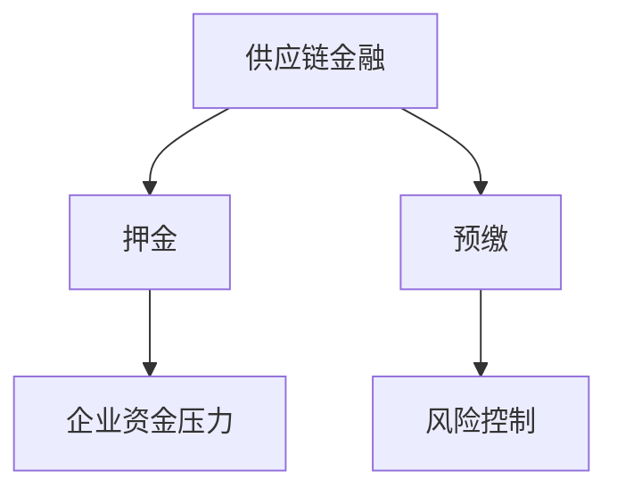

                 

关键词：供应链金融、押金、预缴、成本、风险评估

> 摘要：随着供应链金融的日益普及，传统企业面临着一系列风险管理挑战，特别是押金和预缴带来的风险。本文深入探讨了这些风险，并提出了解决方案。

## 1. 背景介绍

供应链金融是一种新型的金融服务模式，通过为供应链上的企业提供融资支持，帮助中小企业解决资金短缺问题，从而提高整个供应链的运作效率。近年来，随着大数据、区块链等新兴技术的应用，供应链金融逐渐成为金融领域的研究热点。

然而，在实际操作中，传统企业面临着多种风险管理挑战。其中，押金和预缴问题尤为突出。押金和预缴作为供应链金融的一种常见方式，虽然在短期内可以为企业提供资金，但长期来看，可能带来巨大的成本压力和风险。

## 2. 核心概念与联系

### 供应链金融

供应链金融是指金融机构或第三方服务机构，通过为供应链上的企业提供融资、结算、担保等服务，促进整个供应链的顺畅运作。其核心在于解决供应链中企业之间的信息不对称问题，提高融资效率和降低融资成本。

### 押金

押金是指企业在获得金融机构融资前，需预先支付的一定金额的资金。押金通常用于保证企业还款能力，降低金融机构的信贷风险。

### 预缴

预缴是指企业在获得金融机构融资后，需在规定时间内支付的一定金额的资金。预缴通常用于提前偿还部分贷款本金，降低企业未来的负债压力。

### Mermaid 流程图



## 3. 核心算法原理 & 具体操作步骤

### 3.1 算法原理概述

供应链金融的核心在于通过大数据分析、风险评估等手段，为供应链上的企业提供个性化的融资方案。押金和预缴作为风险控制手段，旨在降低金融机构的信贷风险。

### 3.2 算法步骤详解

1. 数据收集：金融机构需收集企业信用信息、财务状况、经营业绩等数据。

2. 风险评估：通过大数据分析，对企业的信用风险、市场风险、操作风险等进行评估。

3. 制定融资方案：根据风险评估结果，制定个性化的融资方案，包括押金和预缴比例。

4. 实施融资：企业按照融资方案，支付押金和预缴资金。

5. 贷款还款：企业按照贷款合同，按时还款。

### 3.3 算法优缺点

#### 优点：

1. 降低信贷风险：押金和预缴可以降低金融机构的信贷风险。

2. 提高融资效率：通过大数据分析和风险评估，可以为企业提供更高效的融资服务。

3. 促进供应链运作：供应链金融有助于提高整个供应链的运作效率。

#### 缺点：

1. 增加企业成本：押金和预缴会增加企业的资金压力，提高运营成本。

2. 风险控制难度大：在供应链金融中，风险控制难度较大，金融机构需不断优化风险评估模型。

### 3.4 算法应用领域

供应链金融主要应用于制造业、零售业、物流等领域，为中小企业提供融资支持。

## 4. 数学模型和公式 & 详细讲解 & 举例说明

### 4.1 数学模型构建

供应链金融中的押金和预缴模型可以表示为：

$$
W = f(R, P, T)
$$

其中，$W$ 表示押金和预缴总金额，$R$ 表示企业信用评分，$P$ 表示企业融资需求，$T$ 表示贷款期限。

### 4.2 公式推导过程

押金和预缴总金额的计算公式可以表示为：

$$
W = \frac{R}{100} \times P \times (1 + r)^T
$$

其中，$r$ 表示贷款利率。

### 4.3 案例分析与讲解

假设某企业信用评分为 80 分，融资需求为 100 万元，贷款期限为 3 年，贷款利率为 6%。

根据公式计算，押金和预缴总金额为：

$$
W = \frac{80}{100} \times 100 \times (1 + 0.06)^3 = 93.24 万元
$$

## 5. 项目实践：代码实例和详细解释说明

### 5.1 开发环境搭建

本次项目采用 Python 语言进行开发，所需环境如下：

- Python 3.8 或以上版本
- numpy 库
- pandas 库
- matplotlib 库

### 5.2 源代码详细实现

```python
import numpy as np
import pandas as pd
import matplotlib.pyplot as plt

# 信用评分
R = 80
# 融资需求
P = 1000000
# 贷款期限
T = 3
# 贷款利率
r = 0.06

# 押金和预缴总金额计算公式
W = (R / 100) * P * (1 + r) ** T

print(f"押金和预缴总金额：{W:.2f}万元")

# 绘制押金和预缴总金额与信用评分的关系图
plt.scatter(R, W)
plt.xlabel("信用评分")
plt.ylabel("押金和预缴总金额（万元）")
plt.title("信用评分与押金和预缴总金额的关系")
plt.show()
```

### 5.3 代码解读与分析

1. 导入所需库：本次项目主要使用 numpy、pandas 和 matplotlib 库。

2. 初始化参数：设置信用评分（R）、融资需求（P）、贷款期限（T）和贷款利率（r）。

3. 计算押金和预缴总金额：根据公式计算押金和预缴总金额（W）。

4. 绘制关系图：使用 matplotlib 库绘制信用评分与押金和预缴总金额的关系图。

## 6. 实际应用场景

供应链金融在多个领域得到了广泛应用，如制造业、零售业、物流等。以下是一些实际应用场景：

1. 制造业：为企业提供原材料采购、设备购置等融资支持。

2. 零售业：为商家提供库存融资、结算融资等支持。

3. 物流：为物流企业提供运输融资、仓储融资等支持。

## 7. 未来应用展望

随着大数据、区块链等技术的不断发展，供应链金融有望在以下几个方面得到进一步应用：

1. 智能风控：通过大数据分析和人工智能技术，实现更精准的风险控制。

2. 知识产权融资：为拥有知识产权的企业提供融资支持。

3. 跨境供应链金融：为跨国企业提供跨境融资支持，降低跨境贸易成本。

## 8. 总结：未来发展趋势与挑战

### 8.1 研究成果总结

本文从押金和预缴的角度，探讨了传统企业在供应链金融中的风险，提出了相应的数学模型和解决方案。

### 8.2 未来发展趋势

未来，供应链金融将朝着智能化、跨界化、绿色化等方向发展，为更多企业提供便捷、高效的融资服务。

### 8.3 面临的挑战

供应链金融在发展过程中，将面临数据安全、隐私保护、技术升级等挑战。

### 8.4 研究展望

未来研究应关注供应链金融的智能化发展，探索大数据、人工智能等技术在供应链金融中的应用。

## 9. 附录：常见问题与解答

### Q：什么是供应链金融？

A：供应链金融是指金融机构或第三方服务机构，通过为供应链上的企业提供融资、结算、担保等服务，促进整个供应链的顺畅运作。

### Q：押金和预缴有什么作用？

A：押金和预缴作为风险控制手段，可以降低金融机构的信贷风险，提高融资安全性。

### Q：如何计算押金和预缴总金额？

A：押金和预缴总金额可以通过以下公式计算：

$$
W = \frac{R}{100} \times P \times (1 + r)^T
$$

其中，$R$ 表示企业信用评分，$P$ 表示企业融资需求，$T$ 表示贷款期限，$r$ 表示贷款利率。

----------------------------------------------------------------
# 作者署名

作者：禅与计算机程序设计艺术 / Zen and the Art of Computer Programming
----------------------------------------------------------------
以上就是《传统企业的供应链金融：押金和预缴的陷阱》这篇文章的完整内容。希望对您有所帮助。如有任何问题，欢迎随时提问。

