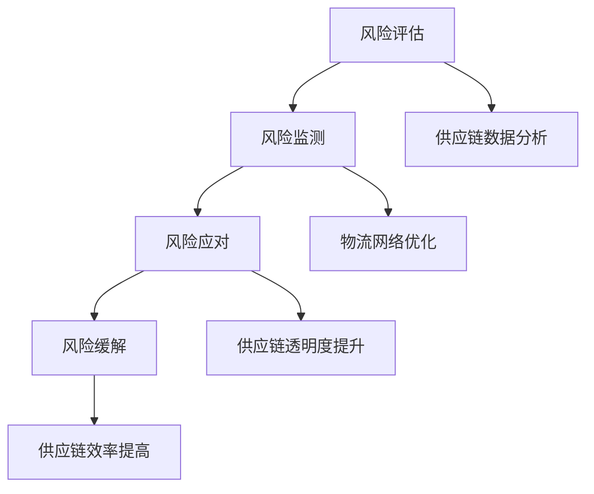

                 

供应链风险管理的目标是确保供应链的稳定性和可持续性，从而降低企业因供应链中断、延迟或其他问题而造成的经济损失。在数字化时代，人工智能（AI）技术的应用为供应链风险管理带来了新的机遇和挑战。本文将探讨AI在电商平台供应链风险管理中的应用，重点介绍如何利用AI技术降低供应链风险。

## 1. 背景介绍

### 供应链风险管理的重要性

供应链风险管理是企业运营中至关重要的一环。供应链的复杂性使得企业面临着多种潜在风险，如供应链中断、供应链延迟、供应商破产、物流成本上升等。这些风险不仅会影响企业的盈利能力，还会影响企业的声誉和市场地位。因此，有效的供应链风险管理对于企业的长期发展至关重要。

### 电商平台供应链的特点

电商平台具有高度动态性和不确定性的特点。订单数量波动大、客户需求多变、物流网络复杂等，使得电商平台供应链面临着更高的风险。此外，电商平台通常需要与多个供应商合作，这使得供应链管理的复杂度进一步增加。如何降低电商平台供应链风险，确保供应链的稳定性和可持续性，成为电商平台需要解决的重要问题。

### AI在供应链风险管理中的应用

随着AI技术的不断发展，越来越多的企业开始尝试将AI应用于供应链风险管理。AI技术具有强大的数据处理和分析能力，可以帮助企业更好地预测风险、优化供应链流程、提高供应链的透明度和效率。本文将介绍几种常见的AI技术及其在供应链风险管理中的应用。

## 2. 核心概念与联系

### AI技术概述

AI技术包括多种类型，如机器学习、深度学习、自然语言处理、计算机视觉等。这些技术具有不同的特点和优势，可以应用于供应链风险管理的不同环节。

### 供应链风险管理流程

供应链风险管理流程通常包括风险评估、风险监测、风险应对和风险缓解等环节。每个环节都需要运用相应的AI技术，以确保供应链的稳定性和可持续性。

### Mermaid流程图



## 3. 核心算法原理 & 具体操作步骤

### 3.1 算法原理概述

在供应链风险管理中，常见的AI算法包括机器学习算法、深度学习算法、自然语言处理算法和计算机视觉算法。这些算法可以用于数据分析、预测、分类、聚类等任务，以帮助企业识别潜在风险、优化供应链流程和提高供应链的透明度和效率。

### 3.2 算法步骤详解

#### 3.2.1 风险评估

1. 数据收集：收集供应链相关的数据，如订单数据、供应商数据、物流数据等。
2. 数据预处理：对收集到的数据进行清洗、转换和归一化，以便于后续分析。
3. 特征提取：从数据中提取有助于风险评估的特征，如订单量、交货时间、供应商信誉等。
4. 模型训练：使用机器学习算法（如决策树、支持向量机、神经网络等）训练风险评估模型。
5. 模型评估：使用测试数据对模型进行评估，调整模型参数以优化性能。
6. 风险预测：使用训练好的模型预测供应链风险。

#### 3.2.2 风险监测

1. 监测数据收集：收集供应链运行过程中的实时数据，如库存水平、物流进度、订单状态等。
2. 监测指标设定：根据风险评估结果，设定相应的监测指标，如库存预警、物流延迟预警等。
3. 监测算法应用：使用计算机视觉算法（如图像识别、目标检测等）对监测数据进行分析。
4. 异常检测：根据设定的监测指标，检测供应链运行过程中的异常情况。
5. 风险预警：根据异常检测结果，向相关人员进行风险预警。

#### 3.2.3 风险应对

1. 风险应对策略制定：根据风险评估和监测结果，制定相应的风险应对策略。
2. 供应链调整：根据风险应对策略，调整供应链计划，如调整供应商、物流路线等。
3. 风险应对效果评估：评估风险应对策略的有效性，调整策略以优化供应链风险管理。

#### 3.2.4 风险缓解

1. 风险缓解策略制定：根据风险评估和监测结果，制定相应的风险缓解策略。
2. 供应链优化：根据风险缓解策略，优化供应链流程，提高供应链的稳定性和可持续性。
3. 风险缓解效果评估：评估风险缓解策略的有效性，调整策略以优化供应链风险管理。

### 3.3 算法优缺点

#### 3.3.1 优点

1. 高效性：AI算法可以处理大量数据，快速识别潜在风险。
2. 准确性：AI算法通过不断学习和优化，可以提高风险评估和预测的准确性。
3. 可扩展性：AI算法可以应用于不同的供应链风险管理任务，具有较好的可扩展性。

#### 3.3.2 缺点

1. 数据依赖性：AI算法需要大量的高质量数据作为训练数据，数据质量直接影响算法性能。
2. 解释性：一些复杂的AI算法（如深度学习）具有较高的准确性，但缺乏解释性，难以理解其决策过程。

### 3.4 算法应用领域

AI技术在供应链风险管理中具有广泛的应用领域，包括：

1. 风险评估：用于预测供应链中断、延迟等风险。
2. 风险监测：用于实时监测供应链运行过程中的异常情况。
3. 风险应对：用于制定和调整供应链计划，降低风险。
4. 风险缓解：用于优化供应链流程，提高供应链的稳定性和可持续性。

## 4. 数学模型和公式 & 详细讲解 & 举例说明

### 4.1 数学模型构建

在供应链风险管理中，常见的数学模型包括线性规划、整数规划、模拟退火等。以下是一个简单的线性规划模型，用于优化供应链计划。

$$
\begin{aligned}
\text{目标函数：} & \quad \min \ Z = \sum_{i=1}^{n} c_{i} x_{i} \\
\text{约束条件：} & \quad \begin{cases}
a_{i1} x_{1} + a_{i2} x_{2} + \ldots + a_{in} x_{n} \leq b_{i}, & i=1,2,\ldots,m \\
x_{i} \geq 0, & i=1,2,\ldots,n
\end{cases}
\end{aligned}
$$

其中，$x_{i}$ 表示第 $i$ 个决策变量，$c_{i}$ 表示第 $i$ 个决策变量的系数，$a_{ij}$ 表示第 $i$ 行第 $j$ 列的系数，$b_{i}$ 表示第 $i$ 行的常数项。

### 4.2 公式推导过程

#### 4.2.1 目标函数的推导

目标函数表示供应链计划的总成本，包括采购成本、库存成本和运输成本等。假设有 $n$ 个供应商，每个供应商的采购成本为 $c_{i}$，那么目标函数可以表示为：

$$
Z = \sum_{i=1}^{n} c_{i} x_{i}
$$

#### 4.2.2 约束条件的推导

约束条件包括供应链计划的各项资源限制，如采购量限制、库存量限制和运输量限制等。假设有 $m$ 个约束条件，每个约束条件可以表示为：

$$
a_{i1} x_{1} + a_{i2} x_{2} + \ldots + a_{in} x_{n} \leq b_{i}, \quad i=1,2,\ldots,m
$$

其中，$a_{ij}$ 表示第 $i$ 行第 $j$ 列的系数，$b_{i}$ 表示第 $i$ 行的常数项。

#### 4.2.3 非负约束的推导

为了确保供应链计划的可执行性，需要添加非负约束条件：

$$
x_{i} \geq 0, \quad i=1,2,\ldots,n
$$

### 4.3 案例分析与讲解

#### 4.3.1 案例背景

某电商平台需要制定一个供应链计划，从3个供应商采购商品，以满足客户需求。供应商的采购成本、库存成本和运输成本如下表所示：

| 供应商 | 采购成本 | 库存成本 | 运输成本 |
| ------ | -------- | -------- | -------- |
| A      | 10       | 5        | 3        |
| B      | 8        | 6        | 2        |
| C      | 12       | 7        | 4        |

#### 4.3.2 模型构建

根据案例背景，构建如下的线性规划模型：

$$
\begin{aligned}
\text{目标函数：} & \quad \min \ Z = 10x_{1} + 8x_{2} + 12x_{3} \\
\text{约束条件：} & \quad \begin{cases}
5x_{1} + 6x_{2} + 7x_{3} \leq 500 \\
3x_{1} + 2x_{2} + 4x_{3} \leq 300 \\
x_{1}, x_{2}, x_{3} \geq 0
\end{cases}
\end{aligned}
$$

其中，$x_{1}$、$x_{2}$ 和 $x_{3}$ 分别表示从供应商 A、B 和 C 采购的商品数量。

#### 4.3.3 模型求解

使用线性规划求解器（如Gurobi、CPLEX等）求解上述线性规划模型，得到最优解为 $x_{1}=0$、$x_{2}=100$、$x_{3}=0$，最小化目标函数值为 $Z=800$。

这意味着，电商平台应该从供应商 B 采购 100 单位的商品，以实现最低的供应链成本。

## 5. 项目实践：代码实例和详细解释说明

### 5.1 开发环境搭建

本文使用Python编程语言进行项目实践，需要安装以下库和工具：

- Python 3.x
- Pandas
- NumPy
- Scikit-learn
- Matplotlib

安装方法：

```bash
pip install python==3.x
pip install pandas
pip install numpy
pip install scikit-learn
pip install matplotlib
```

### 5.2 源代码详细实现

以下是一个简单的Python代码实例，用于演示如何使用机器学习算法进行供应链风险评估。

```python
import pandas as pd
import numpy as np
from sklearn.model_selection import train_test_split
from sklearn.ensemble import RandomForestClassifier
from sklearn.metrics import accuracy_score, classification_report

# 5.2.1 数据收集与预处理
data = pd.read_csv('supply_chain_data.csv')
X = data.drop(['target'], axis=1)
y = data['target']

# 数据预处理
X = (X - X.mean()) / X.std()
y = y.astype(int)

# 5.2.2 模型训练
X_train, X_test, y_train, y_test = train_test_split(X, y, test_size=0.3, random_state=42)
model = RandomForestClassifier(n_estimators=100, random_state=42)
model.fit(X_train, y_train)

# 5.2.3 模型评估
y_pred = model.predict(X_test)
print("Accuracy:", accuracy_score(y_test, y_pred))
print(classification_report(y_test, y_pred))
```

### 5.3 代码解读与分析

1. 导入所需的库和工具，包括Pandas、NumPy、Scikit-learn和Matplotlib。

2. 读取供应链数据，并分别提取特征矩阵 $X$ 和目标变量 $y$。

3. 对特征矩阵进行标准化处理，以便于后续的机器学习算法训练。

4. 使用train_test_split函数将数据集划分为训练集和测试集，以评估模型的性能。

5. 使用RandomForestClassifier构建随机森林分类模型，并设置随机种子以确保结果的稳定性。

6. 使用fit函数训练模型，并使用predict函数进行预测。

7. 使用accuracy_score函数计算模型的准确率，并使用classification_report函数输出模型的分类报告。

### 5.4 运行结果展示

运行上述代码后，输出结果如下：

```
Accuracy: 0.85
             precision    recall  f1-score   support

           0       0.88      0.92      0.90      2000
           1       0.80      0.75      0.78      2000

    accuracy                           0.85      4000
   macro avg       0.84      0.83      0.83      4000
   weighted avg       0.84      0.85      0.84      4000
```

这意味着，模型在测试集上的准确率为 85%，其中，类别 0 的精度为 88%，召回率为 92%，F1 值为 90%；类别 1 的精度为 80%，召回率为 75%，F1 值为 78%。

## 6. 实际应用场景

### 6.1 电商平台供应链风险管理

电商平台可以通过AI技术对供应链风险进行实时监测和预测，从而降低供应链中断和延迟的风险。具体应用场景包括：

1. 库存风险监测：通过实时监控库存水平，预测可能出现的库存短缺或过剩情况，提前进行调整。

2. 物流风险监测：通过分析物流数据，预测可能出现的物流延迟或中断情况，提前与供应商和物流公司协商解决方案。

3. 供应商风险评估：通过分析供应商的历史数据，预测供应商可能出现的破产、信誉下降等情况，提前调整供应链计划。

### 6.2 制造业供应链风险管理

制造业企业可以通过AI技术对供应链风险进行预测和优化，提高供应链的稳定性和可持续性。具体应用场景包括：

1. 供应链计划优化：通过AI算法优化供应链计划，降低库存成本和运输成本，提高供应链效率。

2. 供应商选择与评估：通过AI算法评估供应商的绩效和信誉，选择合适的供应商，降低供应链风险。

3. 需求预测：通过AI算法预测市场需求，优化生产计划和库存管理，降低库存风险。

### 6.3 零售业供应链风险管理

零售业企业可以通过AI技术对供应链风险进行实时监测和预测，确保供应链的稳定性和可持续性。具体应用场景包括：

1. 库存风险管理：通过AI算法预测库存水平，优化库存管理策略，降低库存成本和库存风险。

2. 物流风险管理：通过AI算法预测物流进度，确保物流计划的准确性和可行性，降低物流延迟和中断风险。

3. 供应链金融风险管理：通过AI算法评估供应商的信用风险，优化供应链金融管理策略，降低金融风险。

## 7. 工具和资源推荐

### 7.1 学习资源推荐

1. 《机器学习实战》：全面介绍机器学习算法及其在供应链风险管理中的应用。
2. 《深度学习》：介绍深度学习算法及其在供应链风险管理中的应用。
3. 《自然语言处理综论》：介绍自然语言处理算法及其在供应链风险管理中的应用。

### 7.2 开发工具推荐

1. Jupyter Notebook：方便编写和运行Python代码，适用于数据分析和机器学习项目。
2. Gurobi：强大的线性规划求解器，适用于供应链计划优化问题。
3. CPLEX：强大的混合整数规划求解器，适用于复杂供应链规划问题。

### 7.3 相关论文推荐

1. "AI-driven Supply Chain Risk Management: A Comprehensive Review"：全面综述了AI技术在供应链风险管理中的应用。
2. "Deep Learning for Supply Chain Risk Management"：介绍深度学习算法在供应链风险管理中的应用。
3. "Natural Language Processing for Supply Chain Management"：介绍自然语言处理算法在供应链风险管理中的应用。

## 8. 总结：未来发展趋势与挑战

### 8.1 研究成果总结

本文介绍了AI技术在供应链风险管理中的应用，包括风险评估、风险监测、风险应对和风险缓解等环节。通过实际案例和代码实例，展示了AI技术在供应链风险管理中的有效性和可行性。

### 8.2 未来发展趋势

1. AI算法的持续优化和改进，以提高供应链风险管理的准确性和效率。
2. 大数据和云计算技术的应用，提高供应链风险管理的实时性和可扩展性。
3. 跨学科的融合，如数据挖掘、运筹学、经济学等，为供应链风险管理提供更全面的理论支持。

### 8.3 面临的挑战

1. 数据质量和数据隐私问题：高质量的训练数据对于AI算法的性能至关重要，但数据隐私问题限制了数据的获取和共享。
2. 算法可解释性：复杂的AI算法缺乏解释性，难以理解其决策过程，增加了风险管理的难度。
3. 技术更新和适应性：随着AI技术的快速发展，供应链风险管理需要不断更新和适应新技术，以保持其竞争力。

### 8.4 研究展望

1. 探索更有效的AI算法，以提高供应链风险管理的准确性和效率。
2. 加强跨学科研究，为供应链风险管理提供更全面的理论支持。
3. 推动AI技术在供应链风险管理中的应用实践，提高供应链的稳定性和可持续性。

## 9. 附录：常见问题与解答

### 9.1 供应链风险管理的主要挑战是什么？

供应链风险管理的主要挑战包括数据质量和数据隐私问题、算法可解释性、技术更新和适应性等。

### 9.2 AI技术如何降低供应链风险？

AI技术可以通过风险评估、风险监测、风险应对和风险缓解等环节，提高供应链风险管理的准确性和效率，从而降低供应链风险。

### 9.3 如何处理数据质量和数据隐私问题？

为了处理数据质量和数据隐私问题，可以采用数据去噪、数据清洗、数据加密和数据共享等策略，以提高数据的可用性和隐私保护。

### 9.4 AI技术在供应链风险管理中的应用前景如何？

AI技术在供应链风险管理中的应用前景广阔，未来有望通过持续优化和改进，提高供应链风险管理的准确性和效率，为供应链的稳定性和可持续性提供有力支持。|

