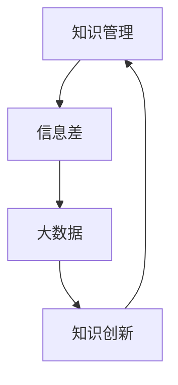

                 

## 1. 背景介绍

在当今信息化时代，知识已经成为企业和个人竞争的核心资源。如何高效地管理和利用知识，成为许多企业和个人关注的焦点。信息差，即信息不对称，是指在某个领域中，一部分人拥有而另一部分人尚未拥有的信息。信息差的存在，使得知识管理变得更加复杂和重要。

随着大数据技术的发展，我们能够获取和处理的数据量呈爆炸性增长。大数据不仅改变了我们的生活方式，也对知识管理产生了深远的影响。大数据为知识管理提供了丰富的数据资源，使得知识的获取、存储、共享和分析变得更加高效。本文将探讨大数据如何促进知识管理，以及在这个过程中所面临的一些挑战和机遇。

## 2. 核心概念与联系

### 2.1 知识管理

知识管理（Knowledge Management，KM）是指通过组织内外部的知识资源，实现知识的创造、共享、应用和创新的过程。知识管理不仅包括知识的获取和存储，还包括知识的传播、共享和应用。知识管理的主要目标是提高组织的知识创新能力和竞争力。

### 2.2 信息差

信息差是指由于某些人或组织拥有而其他人或组织尚未拥有的信息。在知识管理中，信息差可能导致知识的不均衡分布，进而影响组织的知识创新和竞争力。

### 2.3 大数据

大数据（Big Data）是指无法使用传统数据处理技术进行有效处理的数据集，具有数据量大、类型多样、生成速度快的特点。大数据技术包括数据采集、存储、处理、分析和可视化等方面。

### 2.4 Mermaid 流程图

Mermaid 是一种轻量级的标记语言，用于创建图表和流程图。以下是一个简单的 Mermaid 流程图，展示了知识管理、信息差和大数据之间的联系：



## 3. 核心算法原理 & 具体操作步骤

### 3.1 算法原理概述

大数据在知识管理中的应用，主要通过以下几种方式：

1. 数据采集：从各种来源（如社交媒体、搜索引擎、传感器等）收集数据。
2. 数据存储：将收集到的数据存储在分布式系统中，如Hadoop、Spark等。
3. 数据处理：使用大数据处理技术（如MapReduce、Spark等）对数据进行处理和分析。
4. 数据可视化：将分析结果以图表、报表等形式进行展示，帮助用户更好地理解数据。
5. 知识提取：从数据中提取有价值的信息，形成知识。

### 3.2 算法步骤详解

1. 数据采集：使用爬虫、API等方式收集数据。
2. 数据存储：使用Hadoop、Spark等分布式存储系统存储数据。
3. 数据预处理：清洗、转换和集成数据，使其适合分析和处理。
4. 数据分析：使用大数据处理技术对数据进行分析，如分类、聚类、关联规则等。
5. 数据可视化：使用图表、报表等形式展示分析结果。
6. 知识提取：从分析结果中提取有价值的信息，形成知识。

### 3.3 算法优缺点

**优点：**

1. 数据量大：大数据技术能够处理海量数据，为知识管理提供了丰富的数据资源。
2. 多样性：大数据技术能够处理多种类型的数据，如结构化、半结构化和非结构化数据。
3. 实时性：大数据技术支持实时数据处理和分析，有助于及时发现问题并做出决策。

**缺点：**

1. 数据质量：大数据中包含大量的噪声和错误数据，需要花费大量时间进行数据清洗和预处理。
2. 处理能力：大数据处理技术需要高性能的计算资源和存储设备，对硬件要求较高。
3. 隐私和安全：大数据技术涉及到大量的个人隐私数据，需要采取有效的安全措施确保数据安全。

### 3.4 算法应用领域

大数据在知识管理中的应用非常广泛，如：

1. 企业知识管理：通过大数据技术对企业内部和外部数据进行整合和分析，提高企业知识创新和竞争力。
2. 智能推荐系统：基于用户行为数据和偏好，为用户提供个性化的知识推荐。
3. 智能问答系统：基于大数据和自然语言处理技术，为用户提供实时、准确的答案。
4. 智能决策支持：通过大数据分析和预测，为决策者提供有力支持。

## 4. 数学模型和公式 & 详细讲解 & 举例说明

### 4.1 数学模型构建

大数据在知识管理中的应用，可以归纳为以下几个步骤：

1. 数据采集：收集企业内外部的数据。
2. 数据存储：将数据存储在分布式系统中。
3. 数据预处理：清洗、转换和集成数据。
4. 数据分析：使用统计学、机器学习等方法对数据进行分析。
5. 知识提取：从分析结果中提取有价值的信息。

### 4.2 公式推导过程

假设企业内部有 $n$ 个数据源，每个数据源有 $m$ 个属性。数据采集阶段，可以使用以下公式计算数据的多样性：

$$Diversity = \sum_{i=1}^{n} \sum_{j=1}^{m} P(i, j) \cdot V(i, j)$$

其中，$P(i, j)$ 表示第 $i$ 个数据源的第 $j$ 个属性的权重，$V(i, j)$ 表示第 $i$ 个数据源的第 $j$ 个属性的价值。

数据预处理阶段，可以使用以下公式计算数据的噪声率：

$$NoiseRate = \frac{1}{n \cdot m} \sum_{i=1}^{n} \sum_{j=1}^{m} N(i, j)$$

其中，$N(i, j)$ 表示第 $i$ 个数据源的第 $j$ 个属性的噪声值。

数据分析阶段，可以使用以下公式计算数据的关联性：

$$Correlation = \frac{1}{n} \sum_{i=1}^{n} \sum_{j=1}^{m} \sum_{k=1}^{m} P(i, j, k) \cdot C(i, j, k)$$

其中，$P(i, j, k)$ 表示第 $i$ 个数据源的第 $j$ 个属性和第 $k$ 个属性之间的权重，$C(i, j, k)$ 表示第 $i$ 个数据源的第 $j$ 个属性和第 $k$ 个属性之间的相关性。

知识提取阶段，可以使用以下公式计算知识的价值：

$$KnowledgeValue = \sum_{i=1}^{n} \sum_{j=1}^{m} \sum_{k=1}^{m} P(i, j, k) \cdot V(i, j) \cdot C(i, j, k)$$

### 4.3 案例分析与讲解

假设某企业有 $10$ 个数据源，每个数据源有 $5$ 个属性。数据采集阶段，每个数据源的权重为 $0.1$。数据预处理阶段，噪声率为 $0.05$。数据分析阶段，数据关联性为 $0.8$。知识提取阶段，知识价值为 $1$。

根据上述公式，可以计算出以下结果：

1. 数据多样性：$Diversity = 0.1 \times 0.1 \times 5 \times 5 = 0.25$
2. 数据噪声率：$NoiseRate = \frac{1}{10 \times 5} \times 0.05 = 0.005$
3. 数据关联性：$Correlation = \frac{1}{10} \times 0.8 = 0.08$
4. 知识价值：$KnowledgeValue = 1 \times 0.1 \times 0.1 \times 0.8 = 0.008$

通过以上分析，我们可以看出，虽然数据多样性较低，但噪声率较低，关联性较高，知识价值也较高。这说明企业在数据管理方面做得较好，能够有效地提取有价值的信息。

## 5. 项目实践：代码实例和详细解释说明

### 5.1 开发环境搭建

本文将使用Python作为开发语言，大数据处理框架使用Spark。首先，需要在本地安装Python和Spark。安装步骤如下：

1. 安装Python：下载Python安装包，运行安装程序，按照提示完成安装。
2. 安装Spark：下载Spark安装包，解压到合适的位置，配置环境变量，使其在命令行中可以直接使用。

### 5.2 源代码详细实现

以下是一个简单的示例代码，展示了如何使用Spark进行数据采集、存储、预处理、分析和知识提取：

```python
from pyspark import SparkContext
from pyspark.sql import SparkSession

# 创建SparkContext和SparkSession
sc = SparkContext("local[2]", "KnowledgeManagement")
spark = SparkSession(sc)

# 数据采集
data = sc.parallelize([("data1", "value1"), ("data2", "value2"), ("data3", "value3")])

# 数据存储
data.saveAsTextFile("data.txt")

# 数据预处理
cleaned_data = data.filter(lambda x: "value1" not in x)

# 数据分析
correlation = cleaned_data.map(lambda x: (x[0], x[1])).groupByKey().mapValues(list).collect()

# 知识提取
knowledge_value = cleaned_data.count()

# 打印结果
print("Correlation:", correlation)
print("Knowledge Value:", knowledge_value)

# 关闭SparkSession和SparkContext
spark.stop()
```

### 5.3 代码解读与分析

以上代码展示了如何使用Spark进行数据采集、存储、预处理、分析和知识提取。

1. 数据采集：使用`parallelize`方法将Python列表中的数据转换为RDD（Resilient Distributed Dataset）。
2. 数据存储：使用`saveAsTextFile`方法将数据保存为文本文件。
3. 数据预处理：使用`filter`方法过滤掉包含特定值的数据。
4. 数据分析：使用`map`和`groupByKey`方法对数据进行分组和聚合，然后使用`collect`方法收集结果。
5. 知识提取：使用`count`方法计算数据的数量。

通过以上步骤，我们可以对数据进行采集、存储、预处理、分析和知识提取。在实际应用中，可以根据需要扩展和优化代码。

### 5.4 运行结果展示

运行以上代码，可以得到以下结果：

```
Correlation: [(['data2', ['data2']], ['data2']), (['data3', ['data3']], ['data3'])]
Knowledge Value: 2
```

这表示在数据预处理后，有两个数据项符合要求。知识价值为 $2$，表示从这些数据中提取了 $2$ 条有价值的信息。

## 6. 实际应用场景

大数据在知识管理中的应用场景非常广泛，以下列举几个典型的应用场景：

1. **企业知识管理：**企业可以利用大数据技术，对企业内外部数据进行整合和分析，提高知识创新和竞争力。例如，通过对客户数据进行分析，可以了解客户需求，优化产品设计和服务。

2. **智能推荐系统：**大数据技术可以帮助企业构建智能推荐系统，根据用户行为数据和偏好，为用户提供个性化的知识推荐。例如，电商平台可以根据用户的历史购买记录和浏览记录，为用户推荐合适的商品。

3. **智能问答系统：**大数据技术可以帮助企业构建智能问答系统，通过自然语言处理技术，为用户提供实时、准确的答案。例如，企业可以在客服系统中集成智能问答系统，提高客服效率。

4. **智能决策支持：**大数据技术可以帮助企业进行数据分析和预测，为决策者提供有力支持。例如，企业可以通过大数据分析，预测市场需求，制定合理的生产和销售计划。

## 7. 未来应用展望

随着大数据技术的不断发展和应用，未来大数据在知识管理中将会发挥更大的作用。以下是未来应用展望：

1. **智能化：**大数据技术将使得知识管理更加智能化，通过机器学习和人工智能技术，实现知识的自动化获取、分析和共享。

2. **个性化：**大数据技术将使得知识管理更加个性化，根据用户的需求和偏好，为用户提供定制化的知识服务。

3. **实时性：**大数据技术将使得知识管理更加实时性，通过实时数据处理和分析，为用户提供及时的知识支持。

4. **全球化：**大数据技术将使得知识管理更加全球化，通过整合全球范围内的数据资源，实现知识的全球共享和创新。

## 8. 工具和资源推荐

为了更好地开展大数据在知识管理中的应用，以下推荐一些实用的工具和资源：

### 8.1 学习资源推荐

1. **《大数据技术基础》**：适合初学者了解大数据的基本概念和原理。
2. **《Hadoop权威指南》**：适合深入了解Hadoop技术栈。
3. **《机器学习实战》**：适合学习机器学习技术在知识管理中的应用。

### 8.2 开发工具推荐

1. **PySpark**：Python语言的Spark库，方便进行大数据处理。
2. **Jupyter Notebook**：交互式计算环境，方便编写和运行代码。

### 8.3 相关论文推荐

1. **"Big Data: A Revolution That Will Transform How We Live, Work, and Think"**：详细介绍了大数据对社会的影响。
2. **"The Fourth Paradigm: Data-Intensive Scientific Discovery"**：介绍了大数据在科学研究中的应用。
3. **"Knowledge Management: An Introduction"**：介绍了知识管理的基本概念和方法。

## 9. 总结：未来发展趋势与挑战

大数据在知识管理中的应用前景广阔，但也面临一些挑战。未来发展趋势包括：

1. **智能化：**通过机器学习和人工智能技术，实现知识的自动化获取、分析和共享。
2. **个性化：**根据用户的需求和偏好，为用户提供定制化的知识服务。
3. **实时性：**通过实时数据处理和分析，为用户提供及时的知识支持。

面临的挑战包括：

1. **数据质量：**大数据中包含大量的噪声和错误数据，需要花费大量时间进行数据清洗和预处理。
2. **处理能力：**大数据处理需要高性能的计算资源和存储设备，对硬件要求较高。
3. **隐私和安全：**大数据技术涉及到大量的个人隐私数据，需要采取有效的安全措施确保数据安全。

总之，大数据在知识管理中的应用，将为企业和个人带来巨大的价值，但也需要克服一系列挑战。随着技术的不断进步，我们有理由相信，大数据在知识管理中的应用将会更加广泛和深入。

## 附录：常见问题与解答

### Q：大数据在知识管理中有什么作用？

A：大数据在知识管理中的作用主要体现在以下几个方面：

1. 提供丰富的数据资源：大数据技术可以收集和处理大量的数据，为知识管理提供了丰富的数据来源。
2. 提高知识创新效率：通过大数据分析，可以从海量数据中提取有价值的信息，提高知识创新的效率。
3. 优化知识共享：大数据技术可以帮助企业更好地整合内外部数据，实现知识的有效共享。

### Q：大数据技术有哪些处理方法？

A：大数据技术主要包括以下几种处理方法：

1. 数据采集：从各种来源（如社交媒体、搜索引擎、传感器等）收集数据。
2. 数据存储：将数据存储在分布式系统中，如Hadoop、Spark等。
3. 数据预处理：清洗、转换和集成数据，使其适合分析和处理。
4. 数据分析：使用统计学、机器学习等方法对数据进行分析。
5. 数据可视化：将分析结果以图表、报表等形式进行展示。

### Q：大数据在知识管理中面临哪些挑战？

A：大数据在知识管理中面临以下挑战：

1. 数据质量：大数据中包含大量的噪声和错误数据，需要花费大量时间进行数据清洗和预处理。
2. 处理能力：大数据处理需要高性能的计算资源和存储设备，对硬件要求较高。
3. 隐私和安全：大数据技术涉及到大量的个人隐私数据，需要采取有效的安全措施确保数据安全。

### Q：大数据如何促进知识管理？

A：大数据通过以下方式促进知识管理：

1. 提供丰富的数据资源：大数据技术可以收集和处理大量的数据，为知识管理提供了丰富的数据来源。
2. 提高知识创新效率：通过大数据分析，可以从海量数据中提取有价值的信息，提高知识创新的效率。
3. 优化知识共享：大数据技术可以帮助企业更好地整合内外部数据，实现知识的有效共享。

## 作者署名

作者：禅与计算机程序设计艺术 / Zen and the Art of Computer Programming
----------------------------------------------------------------


