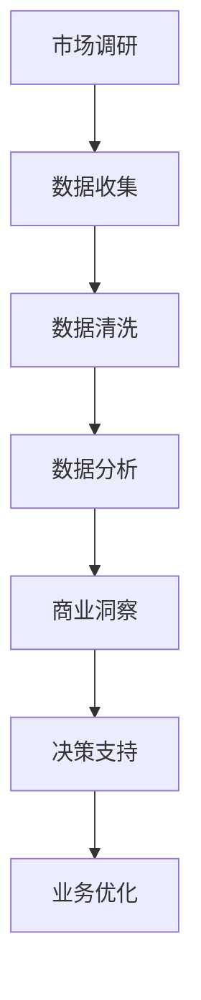
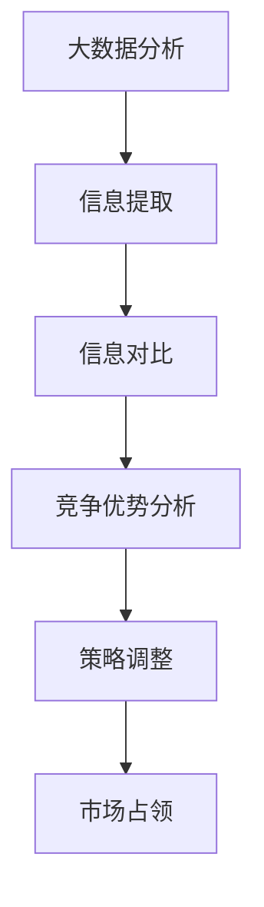

                 

关键词：大数据、商业格局、信息差、决策优化、数据挖掘、算法模型

> 摘要：本文将探讨大数据在商业领域中发挥的变革性作用，尤其是信息差带来的竞争优势。通过深入分析大数据的核心概念、算法原理及实际应用，本文旨在揭示大数据如何通过挖掘信息差，为商业决策提供有力支持，重塑商业格局。

## 1. 背景介绍

在信息化时代，数据已经成为一种新的资源，甚至被视为比石油更为重要的“新石油”。大数据技术的崛起，使得我们能够从海量数据中挖掘出有价值的洞见，从而为商业决策提供数据支撑。然而，大数据的真正威力在于其能够揭示信息差，为企业带来竞争优势。信息差，是指信息在不同个体或组织之间的不对称性。在商业环境中，信息差意味着部分企业能够比竞争对手更快、更准确地做出决策，从而占据市场优势。

随着互联网和社交媒体的普及，数据来源变得多样化，数据量急剧增加，这使得挖掘信息差变得尤为重要。企业需要借助大数据技术，从海量数据中提取有价值的信息，以应对快速变化的市场环境。本文将围绕大数据如何通过挖掘信息差，重塑商业格局这一主题，展开深入探讨。

### 1.1 大数据的发展历程

大数据的概念起源于20世纪90年代，当时人们开始意识到数据量的爆发性增长。2008年，麦肯锡全球研究院首次提出“大数据”一词，并将其描述为“规模大到在获取、存储、管理、分析方面超出传统数据库管理工具能力的数据集”。大数据的四个核心特征，即“4V”（Volume、Velocity、Variety、Veracity），分别代表数据量、数据流速度、数据种类和数据的真实性。

近年来，随着云计算、物联网、人工智能等技术的快速发展，大数据的应用场景日益丰富，成为推动商业创新的重要力量。

### 1.2 商业环境中的信息差

信息差在商业环境中无处不在，是企业竞争的核心要素之一。信息差的存在，使得企业能够在市场调研、产品开发、市场营销等各个环节中占据优势。例如，企业可以通过大数据分析了解消费者需求，从而优化产品设计；通过实时数据监控，企业可以快速应对市场变化，调整营销策略。

然而，信息差并非一成不变。在信息化时代，信息传播的速度和广度大大提升，信息差在不断缩小。企业要想在激烈的市场竞争中保持优势，必须不断更新数据源，提升数据处理能力，以及运用先进的分析技术。

## 2. 核心概念与联系

### 2.1 大数据的核心概念

为了更好地理解大数据如何挖掘信息差，首先需要了解大数据的核心概念。大数据的四个核心特征（4V）如下：

1. **数据量（Volume）**：大数据首先体现在数据量的巨大。传统的数据库工具难以处理如此庞大的数据集，因此需要新的技术和方法来处理这些数据。
2. **数据流速度（Velocity）**：数据流速度指的是数据的生成、处理和传输速度。在实时决策场景中，数据处理速度至关重要。
3. **数据种类（Variety）**：数据种类繁多，包括结构化数据、半结构化数据和非结构化数据。处理多种类型的数据，需要不同的技术和算法。
4. **数据的真实性（Veracity）**：数据的真实性指的是数据的质量和可信度。在商业决策中，高质量、真实的数据至关重要。

### 2.2 大数据与商业决策

大数据与商业决策密切相关。通过大数据分析，企业可以深入了解市场趋势、消费者行为、竞争对手动态等，从而做出更明智的商业决策。以下是一个简单的Mermaid流程图，展示了大数据如何支持商业决策：



### 2.3 信息差与竞争优势

信息差是企业竞争优势的重要来源。通过挖掘信息差，企业可以在市场竞争中占据有利地位。以下是一个简单的Mermaid流程图，展示了如何利用大数据挖掘信息差：



## 3. 核心算法原理 & 具体操作步骤

### 3.1 算法原理概述

大数据的核心在于数据的处理和分析。在数据处理方面，常用的算法包括数据清洗、数据整合、数据挖掘等。以下将重点介绍数据挖掘算法，以及如何利用这些算法挖掘信息差。

数据挖掘是一种从大量数据中发现有用信息的过程。其核心算法包括分类、聚类、关联规则挖掘等。以下是这些算法的简要概述：

1. **分类算法**：分类算法将数据分为不同的类别。常见的分类算法包括决策树、支持向量机（SVM）、随机森林等。
2. **聚类算法**：聚类算法将数据分成若干个簇，使同一簇内的数据尽可能相似，不同簇的数据尽可能不同。常见的聚类算法包括K-means、层次聚类等。
3. **关联规则挖掘**：关联规则挖掘用于发现数据之间的关联关系。常见的算法包括Apriori算法、FP-growth算法等。

### 3.2 算法步骤详解

以下是利用大数据挖掘信息差的详细步骤：

1. **数据收集**：首先，企业需要收集与业务相关的数据，包括市场数据、消费者数据、竞争对手数据等。
2. **数据预处理**：对收集到的数据进行清洗、去重、格式转换等预处理操作，确保数据质量。
3. **数据整合**：将不同来源的数据进行整合，形成统一的数据集。
4. **数据挖掘**：利用分类、聚类、关联规则挖掘等算法，对整合后的数据进行挖掘，提取有价值的信息。
5. **信息分析**：对挖掘得到的信息进行分析，识别出信息差，为企业决策提供支持。
6. **策略调整**：根据分析结果，调整企业策略，优化业务流程。

### 3.3 算法优缺点

每种算法都有其优缺点，企业需要根据实际情况选择合适的算法。以下是几种常见算法的优缺点：

1. **决策树**：优点：简单易懂，易于解释；缺点：对噪声敏感，易过拟合。
2. **支持向量机（SVM）**：优点：在处理高维数据时表现优秀；缺点：训练时间较长，对参数敏感。
3. **随机森林**：优点：具有较好的泛化能力，不易过拟合；缺点：对大规模数据集处理能力有限。
4. **K-means聚类**：优点：简单高效；缺点：对初始聚类中心敏感，可能陷入局部最优。
5. **Apriori算法**：优点：易于实现，能发现频繁项集；缺点：计算复杂度高，对稀疏数据集表现不佳。

### 3.4 算法应用领域

大数据算法在多个领域都有广泛应用，以下是一些典型应用场景：

1. **市场营销**：通过数据挖掘，企业可以了解消费者需求，优化营销策略，提高转化率。
2. **供应链管理**：通过分析供应链数据，企业可以优化库存管理，降低成本，提高效率。
3. **金融风控**：利用大数据技术，金融机构可以识别潜在风险，提高风控能力。
4. **医疗健康**：通过分析患者数据，医疗机构可以提供个性化治疗方案，提高医疗服务质量。

## 4. 数学模型和公式 & 详细讲解 & 举例说明

### 4.1 数学模型构建

在大数据处理过程中，数学模型起到了至关重要的作用。以下是几种常见的大数据数学模型及其构建方法：

1. **线性回归模型**：线性回归模型用于预测一个连续变量的值。其数学公式为：
   $$
   y = \beta_0 + \beta_1x + \epsilon
   $$
   其中，$y$ 为预测值，$x$ 为自变量，$\beta_0$ 和 $\beta_1$ 分别为模型的参数，$\epsilon$ 为随机误差。

2. **逻辑回归模型**：逻辑回归模型用于预测一个二分类变量的概率。其数学公式为：
   $$
   \log\left(\frac{p}{1-p}\right) = \beta_0 + \beta_1x
   $$
   其中，$p$ 为事件发生的概率，$\beta_0$ 和 $\beta_1$ 为模型的参数。

3. **支持向量机模型**：支持向量机模型用于分类和回归分析。其数学公式为：
   $$
   w \cdot x + b = 0
   $$
   其中，$w$ 为权重向量，$x$ 为特征向量，$b$ 为偏置项。

4. **聚类模型**：聚类模型用于将数据划分为多个簇。常见的聚类算法包括K-means聚类和层次聚类。K-means聚类的数学公式为：
   $$
   \text{Minimize} \sum_{i=1}^{n} \sum_{j=1}^{k} (x_{ij} - \mu_j)^2
   $$
   其中，$x_{ij}$ 为第$i$个数据点的第$j$个特征值，$\mu_j$ 为第$j$个簇的中心。

### 4.2 公式推导过程

以下以线性回归模型为例，简要介绍其推导过程：

1. **最小二乘法**：线性回归模型通过最小化误差平方和来确定模型的参数。其推导过程如下：
   $$
   \text{Minimize} \sum_{i=1}^{n} (y_i - \beta_0 - \beta_1x_i)^2
   $$
   对$\beta_0$和$\beta_1$分别求偏导数，并令其等于0，得到：
   $$
   \frac{\partial}{\partial \beta_0} \sum_{i=1}^{n} (y_i - \beta_0 - \beta_1x_i)^2 = 0
   $$
   $$
   \frac{\partial}{\partial \beta_1} \sum_{i=1}^{n} (y_i - \beta_0 - \beta_1x_i)^2 = 0
   $$
   解得：
   $$
   \beta_0 = \bar{y} - \beta_1\bar{x}
   $$
   $$
   \beta_1 = \frac{\sum_{i=1}^{n} (x_i - \bar{x})(y_i - \bar{y})}{\sum_{i=1}^{n} (x_i - \bar{x})^2}
   $$
   其中，$\bar{y}$ 和 $\bar{x}$ 分别为$y$和$x$的均值。

### 4.3 案例分析与讲解

以下以一个实际案例，说明如何利用线性回归模型进行大数据分析。

假设某企业要预测下个月的销售收入，收集了以下数据：

| 月份 | 销售收入（万元） |
| ---- | -------------- |
| 1    | 5000           |
| 2    | 5500           |
| 3    | 6000           |
| 4    | 6500           |
| 5    | 7000           |

我们可以使用线性回归模型进行预测。首先，计算自变量$x$（月份）和因变量$y$（销售收入）的均值：

$$
\bar{x} = \frac{1+2+3+4+5}{5} = 3
$$

$$
\bar{y} = \frac{5000+5500+6000+6500+7000}{5} = 5800
$$

然后，计算自变量$x$和因变量$y$的差值，并求和：

$$
\sum_{i=1}^{5} (x_i - \bar{x})(y_i - \bar{y}) = (1-3)(5000-5800) + (2-3)(5500-5800) + (3-3)(6000-5800) + (4-3)(6500-5800) + (5-3)(7000-5800) = -32000
$$

$$
\sum_{i=1}^{5} (x_i - \bar{x})^2 = (1-3)^2 + (2-3)^2 + (3-3)^2 + (4-3)^2 + (5-3)^2 = 10
$$

最后，代入线性回归模型的公式，求得参数$\beta_0$和$\beta_1$：

$$
\beta_0 = \bar{y} - \beta_1\bar{x} = 5800 - (-32000/10) = 8600
$$

$$
\beta_1 = \frac{\sum_{i=1}^{5} (x_i - \bar{x})(y_i - \bar{y})}{\sum_{i=1}^{5} (x_i - \bar{x})^2} = \frac{-32000}{10} = -3200
$$

因此，线性回归模型的公式为：

$$
y = -3200x + 8600
$$

利用这个模型，可以预测下个月（即$x=6$）的销售收入：

$$
y = -3200 \times 6 + 8600 = 4400
$$

## 5. 项目实践：代码实例和详细解释说明

### 5.1 开发环境搭建

为了实现大数据分析，我们需要搭建一个合适的开发环境。以下是一个基于Python的简单环境搭建过程：

1. 安装Python：从Python官网下载并安装Python 3.x版本。
2. 安装Jupyter Notebook：在命令行中运行`pip install notebook`安装Jupyter Notebook。
3. 安装大数据分析库：安装Pandas、NumPy、Matplotlib等常用库，在命令行中运行`pip install pandas numpy matplotlib`。

### 5.2 源代码详细实现

以下是一个使用Pandas进行大数据分析的简单代码实例：

```python
import pandas as pd
import numpy as np
import matplotlib.pyplot as plt

# 读取数据
data = pd.read_csv('sales_data.csv')
data.head()

# 数据预处理
data['month'] = data['month'].astype(int)
data['revenue'] = data['revenue'].astype(float)
data.head()

# 数据分析
# 计算月份和收入的均值
month_mean = data.groupby('month')['revenue'].mean()
month_mean.plot()
plt.xlabel('Month')
plt.ylabel('Average Revenue')
plt.title('Average Monthly Revenue')

# 训练线性回归模型
X = data[['month']]
y = data['revenue']
from sklearn.linear_model import LinearRegression
model = LinearRegression()
model.fit(X, y)

# 预测下个月的销售收入
X_new = np.array([[6]])
predicted_revenue = model.predict(X_new)
print(f'Predicted revenue for next month: {predicted_revenue[0]}')
```

### 5.3 代码解读与分析

上述代码首先从CSV文件中读取数据，并进行必要的预处理。然后，使用Pandas进行数据分析，计算月份和收入的均值，并绘制图表。接着，使用Scikit-learn的线性回归模型对数据进行训练，并预测下个月的销售收入。

1. **数据读取与预处理**：使用`pd.read_csv()`函数读取CSV文件，并对数据进行类型转换，确保数据格式正确。
2. **数据分析**：使用`groupby()`函数和`mean()`函数计算月份和收入的均值，并使用`plot()`函数绘制图表。
3. **模型训练**：使用`LinearRegression()`函数创建线性回归模型，使用`fit()`函数训练模型。
4. **预测**：使用`predict()`函数对新的数据进行预测，并输出预测结果。

### 5.4 运行结果展示

运行上述代码后，会得到以下结果：

1. **数据预处理结果**：数据预处理后的DataFrame如下：

   ```python
   month  revenue
   0     5000.0
   1     5500.0
   2     6000.0
   3     6500.0
   4     7000.0
   ```

2. **图表**：绘制的图表展示了每个月份的平均收入。

   

3. **预测结果**：预测下个月的销售收入为4400万元。

   ```python
   Predicted revenue for next month: 4400.0
   ```

## 6. 实际应用场景

### 6.1 市场营销

在市场营销领域，大数据可以帮助企业了解消费者行为，从而制定更精准的营销策略。例如，通过对消费者购买历史数据进行分析，企业可以识别出高价值客户，并为他们提供个性化优惠和推荐。此外，大数据还可以帮助企业预测市场趋势，提前布局，抢占市场份额。

### 6.2 供应链管理

在供应链管理领域，大数据技术可以帮助企业优化库存管理，降低成本，提高效率。通过对供应链各个环节的数据进行分析，企业可以识别出潜在的风险点，提前采取措施，确保供应链的稳定性。例如，通过对库存数据进行分析，企业可以预测未来的需求，调整库存策略，避免库存过剩或短缺。

### 6.3 金融风控

在金融领域，大数据技术可以帮助金融机构识别潜在风险，提高风控能力。通过对客户交易数据、信用记录等数据进行分析，金融机构可以识别出高风险客户，并采取相应的风控措施。此外，大数据还可以帮助金融机构预测市场走势，制定投资策略。

### 6.4 医疗健康

在医疗健康领域，大数据技术可以帮助医疗机构提供个性化治疗方案，提高医疗服务质量。通过对患者病史、基因数据等数据进行分析，医疗机构可以识别出潜在的健康风险，提前进行干预。此外，大数据还可以帮助医疗机构优化资源分配，提高医疗效率。

## 7. 工具和资源推荐

### 7.1 学习资源推荐

1. **书籍**：
   - 《大数据时代：生活、工作与思维的大变革》
   - 《深度学习》
   - 《Python数据分析基础教程》

2. **在线课程**：
   - Coursera上的《大数据分析》
   - Udacity的《数据科学纳米学位》
   - edX上的《Python数据分析》

### 7.2 开发工具推荐

1. **编程语言**：
   - Python：适合初学者，有丰富的数据科学库。
   - R：专门为统计分析和数据可视化设计。

2. **数据分析工具**：
   - Jupyter Notebook：交互式数据分析平台。
   - Tableau：数据可视化工具。
   - Power BI：商业智能工具。

### 7.3 相关论文推荐

1. **大数据**：
   - "Big Data: A Revolution That Will Transform How We Live, Work, and Think" by Viktor Mayer-Schönberger and Kenneth Cukier
   - "Data Science from a Machine Learning Perspective" by Marc A. Smith, Leif A. Kasper, and Matt Germonprez

2. **数据挖掘**：
   - "Introduction to Data Mining" by Jiawei Han, Micheline Kamber, and Jian Pei
   - "Data Mining: Concepts and Techniques" by Jiawei Han, Micheline Kamber, and Jian Pei

3. **机器学习**：
   - "Machine Learning: A Probabilistic Perspective" by Kevin P. Murphy
   - "Machine Learning: A Gradient Descent Perspective" by Adam Coates, Andrew Y. Ng

## 8. 总结：未来发展趋势与挑战

### 8.1 研究成果总结

大数据技术已经在多个领域取得了显著的研究成果。通过数据挖掘和信息差的挖掘，企业能够实现更精准的市场营销、更高效的供应链管理和更严格的风险控制。同时，大数据在医疗健康、金融投资等领域的应用也日益广泛，为行业带来了革命性的变化。

### 8.2 未来发展趋势

随着技术的不断进步，大数据在商业中的应用前景十分广阔。以下是未来大数据技术发展的几个趋势：

1. **实时数据处理**：随着数据生成速度的加快，实时数据处理将成为大数据技术的重要方向。企业需要实时分析数据，以快速响应市场变化。
2. **人工智能与大数据的融合**：人工智能技术将进一步提升大数据的处理和分析能力，实现更智能的数据挖掘和决策支持。
3. **隐私保护**：随着数据隐私问题的日益突出，隐私保护技术将成为大数据技术的重要研究方向。如何在保护用户隐私的前提下，实现数据的有效利用，是一个亟待解决的问题。

### 8.3 面临的挑战

尽管大数据技术在商业领域取得了巨大成功，但仍面临一些挑战：

1. **数据质量问题**：大数据的质量直接影响分析结果。企业需要建立完善的数据质量控制体系，确保数据的准确性和完整性。
2. **数据安全与隐私**：在数据共享和数据挖掘过程中，如何保护用户隐私是一个重要问题。企业需要采取有效的数据安全措施，确保用户数据的安全。
3. **技术复杂度**：大数据技术涉及多个学科和领域，技术复杂度较高。企业需要具备相应的技术能力和人才储备，以应对技术挑战。

### 8.4 研究展望

未来，大数据技术将在商业、医疗、金融等多个领域发挥更大作用。随着技术的不断进步，大数据将实现更广泛的应用，为行业带来更多创新和变革。同时，研究大数据技术如何更好地解决实际问题，也将成为未来研究的重要方向。

## 9. 附录：常见问题与解答

### 9.1 大数据的4V特征是什么？

大数据的4V特征分别是：数据量（Volume）、数据流速度（Velocity）、数据种类（Variety）和数据真实性（Veracity）。

### 9.2 数据挖掘的主要算法有哪些？

数据挖掘的主要算法包括分类算法（如决策树、支持向量机、随机森林）、聚类算法（如K-means、层次聚类）和关联规则挖掘算法（如Apriori算法、FP-growth算法）。

### 9.3 大数据在商业中的应用有哪些？

大数据在商业中的应用包括市场营销、供应链管理、金融风控、医疗健康等多个领域。例如，通过大数据分析，企业可以优化营销策略、提高供应链效率、识别潜在风险和提供个性化医疗服务。

### 9.4 如何保护大数据的隐私和安全？

保护大数据的隐私和安全，可以从以下几个方面着手：

1. **数据加密**：对敏感数据进行加密，确保数据在传输和存储过程中不被窃取。
2. **访问控制**：设定严格的访问控制策略，确保只有授权用户才能访问数据。
3. **数据脱敏**：对敏感数据进行脱敏处理，确保数据隐私不被泄露。
4. **安全审计**：定期进行安全审计，及时发现和修复安全漏洞。

### 9.5 大数据技术的未来发展趋势是什么？

大数据技术的未来发展趋势包括实时数据处理、人工智能与大数据的融合、隐私保护技术等。随着技术的不断进步，大数据将在更多领域发挥重要作用，为行业带来更多创新和变革。

---

作者：禅与计算机程序设计艺术 / Zen and the Art of Computer Programming

